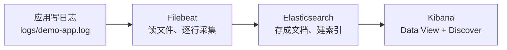
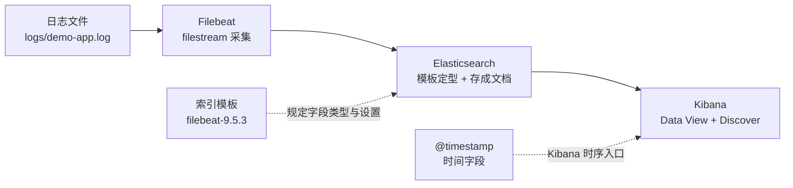

# 课 3：端到端走一遍

> 一句话：亲手把"一个日志文件 → Filebeat → Elasticsearch → Kibana"的最小链路跑通，并读懂链路上那条数据长什么样、组件之间靠什么契约衔接。
> 阶段 1 · 第 3 课（**阶段收官**）｜ 知识点：最小链路亲手跑通 / 一条数据长什么样 / 组件间的契约
> 状态：✅ 已交付（2026-09-06）｜ 版本基线：Elastic Stack **9.5.3** ｜ 环境：macOS arm64 + Docker Compose

---

## 🎯 本课目标

学完本课，你应该能：

1. 从一个本地日志文件出发，跑通 **Filebeat → Elasticsearch（先不经过 Logstash）→ Kibana 建 Data View → 看到日志** 的完整最小链路
2. 读懂一条文档的字段构成（`@timestamp` / `message` / `host.*` / `agent.*` / `log.*` / `_source`），说清 **event 与 document 的关系**
3. 解释组件之间靠"**索引名 + 索引模板 + 时间字段**"这套契约衔接，并预判**字段类型冲突**会发生什么

> 本课刻意**先绕开 Logstash**，用 Filebeat 直连 ES——先看最小链路成立，再谈处理（阶段 3 才把 Logstash 请进来）。
> 配套文件：[`playground/02-end-to-end/`](../../../playground/02-end-to-end/)（`docker-compose.yml` + `filebeat.yml` + `logs/demo-app.log`）

## 📌 知识点导航

| # | 知识点 | 关键点 | 状态 |
|---|--------|--------|------|
| 1 | 3.1 最小链路亲手跑通 | 写日志文件 → Filebeat 读 → **直连 ES（不经过 Logstash）** → Kibana 建 Data View → 看到日志 | ✅ 已完成 |
| 2 | 3.2 一条数据长什么样 | event 与 document 的关系 / `@timestamp`（**采集时间**而非事件时间）/ `message` / `host.*` / `agent.*` / `_source` | ✅ 已完成 |
| 3 | 3.3 组件间的契约 | 索引名与索引模板（Filebeat 自带模板）/ 时间字段为什么是命脉 / 字段类型冲突会发生什么 | ✅ 已完成 |

## 📖 本课在故事主线中的情节定位

第一幕收束的高潮：主角（一条日志）**第一次走完了从"源头文件"到"Kibana 屏幕"的全程**——"看得见全貌"在此落地。

回到课 1 那个凌晨两点的告警：那时你要 ssh 5 台机器逐台 grep；现在，5 台机器各自跑一个 Filebeat，日志全部汇到同一个 ES，你在 Kibana 一个框里就能搜到全部。**"找不到"这个痛，在本课第一次被真正解决**。

同时本课也埋下后三个阶段的引子：Filebeat 现在只在本机读单个文件（阶段 2 才铺到多源多行）、日志还只是一坨未解析的文本（阶段 3 才"看得懂"）、索引会无限膨胀（阶段 4 才"留得住、用得上"）。

---

# 正文

## 🏛️ 第一幕 · 起源与场景引入

课 2 结束时，你手里有两个能跑的容器：ES 和 Kibana。但它们是**空的**——像一个刚建好的仓库和展厅，货架上什么都没有。

本课要做的事很朴素：**让第一条日志真正地"走"一遍**。



三个角色，一条直线。注意这条链路里**没有 Logstash**——这不是省略，是刻意的：

| 组件 | 本课 | 为什么 |
|------|------|--------|
| Beats（Filebeat） | ✅ 上 | 采集的活只能它干，它得贴着日志文件部署 |
| **Logstash** | ⏸ **跳过** | 它是"处理/解析"的可选项。先证明最短链路成立，再加处理层 |
| Elasticsearch | ✅ 上 | 存储与检索的地基 |
| Kibana | ✅ 上 | 让人看得见的界面 |

**先跑通最短的，再加复杂的**——这是排查问题的黄金法则：链路越短，出问题时越容易定位是哪一段坏了。

## ❓ 第二幕 · 认知冲突

**你以为**：配好 Filebeat、指好文件路径、填对 ES 地址，数据就该自己流过去了。

**真相是，我第一次配的时候当场翻车了。**

我最初给 `filebeat.yml` 加了这么几行（想让索引名更好看）：

```yaml
output.elasticsearch:
  index: "demo-app-%{+yyyy.MM.dd}"    # 自定义索引名
setup.ilm.enabled: false
setup.template.name: "demo-app"
setup.template.pattern: "demo-app-*"
```

然后 Filebeat 起来了，但**一条数据都没进 ES**。翻日志：

```text
Failed to connect to backoff(elasticsearch(http://elasticsearch:9200)):
Connection marked as failed because the onConnect callback failed:
error loading template: failed to put data stream:
could not put data stream: 400 Bad Request:
{"error":{"root_cause":[{"type":"illegal_argument_exception",
"reason":"no matching index template found for data stream [demo-app]"}]}}
```

**`no matching index template found for data stream [demo-app]`** —— 9.5.3 下，自定义索引名会触发 Filebeat 去创建一个 **data stream**，而模板对不上，整条链路**从第一步就起不来**。

我把自定义索引名那几行删掉，改用默认行为，重启——数据立刻进来了。

这一跤摔出了本课的第二个真相：

> **数据"到了 ES"和"在 Kibana 里能看见"是两件事**，中间还隔着一整套看不见的契约：**索引名、索引模板、时间字段、Data View**。
>
> 日志明明进了 ES 却在 Kibana 里搜不到，八成不是采集坏了，而是**这套契约里某一环没对上**。

## 🔍 第三幕 · 层层揭示

---

### 知识点 3.1 · 最小链路亲手跑通

**一句话定义**
最小链路 = **Filebeat 盯着一个日志文件，逐行读出来，打包发给 ES，Kibana 从 ES 里读出来给人看**——中间不做任何解析与转换。

**直觉建立（类比）**
把它想成**收发室**：

- **日志文件** = 你工位上的待寄信件
- **Filebeat** = 收发员，定时来你工位收信，在登记本上记下"收到第几封了"，然后把信送到收发室
- **ES** = 收发室的档案柜，信件按规矩归档、编目，随时能检索
- **Kibana** = 查档窗口，你说要什么，柜员给你取出来、还能给你统计

**类比失效的边界**：信件是**精确一次**的（不能送两遍也不能丢）；日志链路是**至少一次**（at-least-once）——网络抖动时可能重复送，但不会少送。这个差异会在阶段 2 课 4、阶段 3 课 8 反复回来找你。另外信件送完就完了，日志要**留存很久**并支持任意维度回看。

**核心原理 · Filebeat 最小配置**

真正跑起来只需要这么几行（完整文件见 [`filebeat.yml`](../../../playground/02-end-to-end/filebeat.yml)）：

```yaml
# 采集端：从哪个文件读
filebeat.inputs:
  - type: filestream          # 新版推荐的日志读取类型（取代老的 log 类型）
    id: demo-app              # 每个 input 的唯一标识，Filebeat 靠它记"读到哪了"
    enabled: true
    paths:
      - /usr/share/filebeat/logs/demo-app.log   # 容器内的路径

# 输出端：写到哪个 ES
output.elasticsearch:
  hosts: ["http://elasticsearch:9200"]   # 容器网络里用服务名互访
  username: "elastic"
  password: "ELKlearn2026"
```

**就这些。** 没写索引名、没写模板、没写 ILM——全用默认。

**核心原理 · 容器里怎么读到宿主机的日志**

这是新手最容易卡住的地方：**Filebeat 跑在容器里，它看不见你宿主机的文件**。解决办法是**挂载**（docker-compose.yml 里）：

```yaml
  filebeat:
    image: docker.elastic.co/beats/filebeat:9.5.3
    user: root                                        # 需要读挂载文件、写自己的 registry
    command: ["filebeat", "-e", "--strict.perms=false"]
    volumes:
      - ./filebeat.yml:/usr/share/filebeat/filebeat.yml:ro   # 挂载配置
      - ./logs:/usr/share/filebeat/logs:ro                   # 挂载"应用日志"目录
    depends_on:
      elasticsearch:
        condition: service_healthy                    # 等 ES 真的可用再启动
```

💡 **注意一个细节**：我把宿主机的 `./logs` 挂到了容器的 `/usr/share/filebeat/logs`。而 `/usr/share/filebeat/logs` 恰好也是 Filebeat 自己的日志目录（启动时日志里能看到 `"logs":"/usr/share/filebeat/logs"`）。**学习环境这么挂没问题，生产上建议换个路径**（比如 `/var/log/app`），别把两件事混在一起。

**示例演示**：见第四幕。

**常见误区**
- ❌ **"不上 Logstash 跑不通"** —— Filebeat 直连 ES 就是最小可用链路，Logstash 是可选的重活
- ❌ **"我先自定义个好记的索引名"** —— 9.5.3 下这会踩 data stream 的坑（第二幕的翻车现场）
- ❌ 在容器里写 `localhost:9200` 连 ES —— 容器的 localhost 是它自己，要用服务名

**一句话记住**
最小链路 = **Filebeat 读文件 → 直连 ES → Kibana 看**；别自定义索引名、别引入 Logstash，先让最短的那条线亮起来。

📚 官方文档：[Filebeat 参考](https://www.elastic.co/docs/reference/beats/filebeat)

---

### 知识点 3.2 · 一条数据长什么样

**一句话定义**
Filebeat 每读到一行日志，就产出一个 **event（事件）**；这个 event 发到 ES 后，就变成一个 **document（文档）**——同一份东西在链路两头的两个名字。

**直觉建立（类比）**
event 和 document 的关系，就像**快递单和档案袋里的件**：

- **event** 还在路上时叫"快递单"，上面写着"从哪来、谁寄的、什么时候收的、内容是什么"
- **document** 是它进了档案柜之后的状态——同一张纸，换了存放的地方和编号

**类比失效的边界**：快递单送进档案柜后内容不会变；event 进 ES 成为 document 前，可能先经过 **Ingest Pipeline 加工**（增字段、改格式、丢弃），所以 document 的内容可能与原始 event 不同——这条在阶段 3 课 9 会展开。

**核心原理 · 一条真实文档**

这是我从本机 ES 里真取出来的一条（已省略 `_score` 等噪音）：

```json
{
  "_index": ".ds-filebeat-9.5.3-2026.09.06-000001",
  "_id": "ryecdaABwEfH_0ZAnL6r",
  "_source": {
    "@timestamp": "2026-09-06T07:26:22.494Z",
    "input": { "type": "filestream" },
    "host": { "name": "d18f7139d627" },
    "agent": {
      "ephemeral_id": "25875bd0-a1f3-47c5-b89b-0ea9b8ce5869",
      "id": "28b52de2-d61f-46f4-ad54-cc07e068b92d",
      "name": "d18f7139d627",
      "type": "filebeat",
      "version": "9.5.3"
    },
    "ecs": { "version": "8.0.0" },
    "log": {
      "file": {
        "path": "/usr/share/filebeat/logs/demo-app.log",
        "device_id": "43",
        "inode": "2236"
      },
      "offset": 0
    },
    "message": "2026-09-06 14:20:01 INFO  [order-service] 订单创建成功 orderId=10001 userId=u123 amount=299.00"
  }
}
```

逐字段拆开看：

| 字段 | 值（本例） | 是什么 | 为什么重要 |
|------|-----------|--------|-----------|
| `@timestamp` | `2026-09-06T07:26:22.494Z` | **Filebeat 读到这一行的时刻**（UTC） | 🔴 **全链路的命脉**，下面单说 |
| `message` | `2026-09-06 14:20:01 INFO ...` | 日志**原文**，完整一行、未解析 | 现在它就是一坨文本，阶段 3 才把它切成字段 |
| `host.name` | `d18f7139d627` | **这条日志来自哪台机器** | 直接对应课 1"5 台机器"的痛点——有了它，你才知道该去哪台机器查 |
| `agent.*` | `filebeat` / `9.5.3` / 各种 id | **谁采集的** | 排查采集问题时第一眼看它（版本对不对、是哪个采集端） |
| `log.file.path` + `log.offset` | 路径 + `0` | **来自哪个文件、第几个字节** | Filebeat 断点续传的依据 |
| `input.type` | `filestream` | 用的哪种输入类型 | 阶段 2 会展开 |
| `ecs.version` | `8.0.0` | 遵循的 ECS 规范版本 | 阶段 3 课 9 讲 ECS |
| `_source` | 上面那一整块 | ES 里存的**原始 JSON 原件** | 你在 Kibana 看到的就是它；真正被索引、可被搜索的是从它派生出的字段 |

**🔴 关于 `@timestamp`，有一个必须说清的坑**

看仔细点这行日志：

```text
message    : "2026-09-06 14:20:01 INFO  [order-service] ..."    ← 日志自己写的时间
@timestamp : "2026-09-06T07:26:22.494Z"                        ← ES 里记的时间
```

`07:26:22Z` 换算成北京时间是 **15:26**。也就是说：

> **日志内容说这事儿发生在 14:20，而 `@timestamp` 记的是 15:26——差了 1 小时 6 分。**

为什么？因为 **`message` 里那个时间是应用自己写的（事件发生时间），而 `@timestamp` 是 Filebeat 读到这一行的时刻**。我是 15:22 才创建这个日志文件、15:26 才让 Filebeat 去读的，所以它记的是"采集时间"。

**这件事的后果很实际**：如果你在 Kibana 里按"14:20–14:30"去过滤，这条日志**搜不到**——因为它被记在了 15:26。日志回溯、延迟采集、跨时区，都会放大这个偏差。

**怎么修**：用 Logstash 或 Ingest Pipeline 的 `date` 过滤器，从日志内容里把真实时间解析出来覆盖 `@timestamp`。**这正是阶段 3 的核心任务之一**（课 7 知识点 7.3）。

**另一个值得留意的细节**：本例 `host.name` 是 `d18f7139d627`（一串容器 ID），因为我们的 Filebeat 跑在容器里。**生产上 Filebeat 部署在业务机器上，那时 `host.name` 才是真正的机器名**——也才有意义。

**常见误区**
- ❌ 把 `@timestamp` 当成"事件真实发生的时间" —— 它默认是**采集时间**，回溯历史日志时两者能差很远
- ❌ 以为 `message` 已经被解析成字段了 —— 现在它是完整一行文本，**解析是阶段 3 的活**
- ❌ 以为 `_source` 就是"索引" —— `_source` 是存的原件；索引是从它派生、供搜索用的结构（ES 主课学过）

**一句话记住**
一行日志 = 一个 event = 一个 document；**`@timestamp` 默认记的是"什么时候被采集"，不是"什么时候发生"**。

📚 官方文档：[Filebeat 导出字段](https://www.elastic.co/docs/reference/beats/filebeat/exported-fields)

---

### 知识点 3.3 · 组件间的契约

**一句话定义**
Filebeat 与 ES、Kibana 之间不是"随便发过去就行"，而是靠一套**看不见的契约**衔接：**索引名 → 索引模板（规定字段类型与设置）→ 时间字段（规定时序入口）**。

**直觉建立（类比）**
把这套契约想成**寄快递的三项规定**：

| 契约 | 类比 |
|------|------|
| 索引名 | **收件地址**——写错了就送不到地方 |
| 索引模板 | **包装规格**——箱子多大、里面怎么分隔，得提前说好，否则装不进去 |
| 时间字段 | **时间戳**——没有它，仓库不知道这批货该按什么顺序上架 |

**类比失效的边界**：快递的地址写错会被退回；ES 的索引模板不匹配时，数据可能被**动态映射成错误的类型**（不报错，但之后查不准）——silent failure 比报错更难查。

**核心原理 · ① 索引名与索引模板**

我没配索引名，Filebeat 用了默认值。查一下它写到哪了：

```bash
curl -u elastic:ELKlearn2026 "http://localhost:9200/_cat/indices?v"
```

```text
health status index                                    pri rep docs.count store.size
yellow open   .ds-filebeat-9.5.3-2026.09.06-000001      1   1         10     24.4kb
```

**10 条日志全部进来了。** 注意索引名 `.ds-filebeat-9.5.3-2026.09.06-000001`：

| 片段 | 含义 |
|------|------|
| `.ds-` | 这是 **data stream 的后备索引**（backing index） |
| `filebeat-9.5.3` | data stream 的名字（默认格式：`<beat名>-<版本>`） |
| `2026.09.06` | 创建日期 |
| `000001` | 第几个后备索引（rollover 一次 +1） |

顺带解释那个 **`yellow`**：这个索引有 **1 个副本**（`rep=1`），但集群只有 1 个节点，副本没地方放 → 集群 yellow。**数据一条不少，只是没有冗余**（ES 主课课 10 学过：yellow = 数据都在，只是副本没处安放）。

那**模板**在哪？Filebeat 启动时会把自己的模板装进 ES，查一下：

```bash
curl -u elastic:ELKlearn2026 "http://localhost:9200/_index_template/filebeat-9.5.3?pretty"
```

关键片段（有删减）：

```json
{
  "name": "filebeat-9.5.3",
  "index_template": {
    "index_patterns": ["filebeat-9.5.3"],
    "template": {
      "settings": {
        "index": {
          "lifecycle": { "name": "filebeat" },          // 默认挂了 ILM 策略
          "mapping": { "total_fields": { "limit": "12500" } },   // 字段上限
          "refresh_interval": "5s",
          "max_docvalue_fields_search": "200"
        }
      }
    }
  }
}
```

**这份模板就是契约的文本**，它规定了：字段有哪些、什么类型、刷新间隔、生命周期策略、字段数上限。

它有多重要？看这个：我在 Kibana 里给这个 data stream 建 Data View 时，返回的字段列表里包含了 `activemq.*`、`zoom.*`、`agent.*`、`host.*`……**一大堆我们根本没用到的字段**。因为模板里预置了 Filebeat 支持的**全部采集场景**的字段定义（`total_fields.limit` 高达 **12500**）。

> 💡 顺带记住 `total_fields.limit: 12500` 这个数——它是防止"**字段爆炸**"的防线。日志来源一杂，动态映射可能把成千上万个新字段名塞进 mapping，拖垮集群。这是日志场景最高发的存储事故之一，**阶段 4 课 10 会专门讲怎么防**。

**核心原理 · ② 时间字段为什么是命脉**

Kibana 的一切时序能力都建立在 `@timestamp` 上：

- Discover 右上角那个**时间选择器**，过滤的就是 `@timestamp`
- 那根**按时间的直方图**，横轴就是 `@timestamp`
- Data View 创建时**必须指定一个时间字段**，否则这个 Data View 用不了时间过滤

所以：**没有 `@timestamp`（或它不是 date 类型），Kibana 基本就废了一半。**

创建 Data View 的命令（我实测通过）：

```bash
curl -u elastic:ELKlearn2026 -X POST "http://localhost:5601/api/data_views/data_view" \
  -H 'kbn-xsrf: true' -H 'Content-Type: application/json' \
  -d '{"data_view":{"title":"filebeat-9.5.3","timeFieldName":"@timestamp"}}'
```

返回（有删减）：

```json
{"data_view":{"id":"38ce53e5-9f64-4757-b645-0e031f0e1be6","title":"filebeat-9.5.3",
"timeFieldName":"@timestamp","fields":{"@timestamp":{"name":"@timestamp","type":"date",
"searchable":true,"aggregatable":true}, ...}}}
```

`"type":"date"` —— Kibana 认下了这个时间字段。**到这一步，"日志 → ES → Kibana"整条链路才算真的闭合。**

**核心原理 · ③ 字段类型冲突会发生什么**

模板给字段定了类型，来了不符合类型的数据会怎样？我实测了一下——往 `date` 类型的 `@timestamp` 里塞一个中文字符串：

```bash
curl -u elastic:ELKlearn2026 -X POST "http://localhost:9200/filebeat-9.5.3/_doc" \
  -H 'Content-Type: application/json' \
  -d '{"@timestamp":"不是时间","message":"这是一条用来触发类型冲突的测试"}'
```

```json
{
  "error": {
    "root_cause": [{
      "type": "document_parsing_exception",
      "reason": "[1:15] failed to parse field [@timestamp] of type [date] in document with id 'DCeedaABwEfH_0ZAfr-G'. Preview of field's value: '不是时间'"
    }],
    "type": "document_parsing_exception",
    "reason": "[1:15] failed to parse field [@timestamp] of type [date] in document with id 'DCeedaABwEfH_0ZAfr-G'. Preview of field's value: '不是时间'",
    "caused_by": {
      "type": "illegal_argument_exception",
      "reason": "failed to parse date field [不是时间] with format [strict_date_optional_time||epoch_millis]",
      "caused_by": { "type": "date_time_parse_exception", "reason": "Failed to parse with all enclosed parsers" }
    },
    "failure_store": "not_enabled"
  },
  "status": 400
}
```

**HTTP 400，整条文档被拒收。** 三层错误链很清晰：

```text
document_parsing_exception   ← 文档解析失败
  └ illegal_argument_exception: failed to parse date field [不是时间] with format [strict_date_optional_time||epoch_millis]
      └ date_time_parse_exception: Failed to parse with all enclosed parsers
```

**要点有三**：

1. **整条拒收，不是"这个字段不要了"** —— 一条脏数据坏不了你的索引，但它会**丢**
2. **报错里直接给了期望的格式**（`strict_date_optional_time||epoch_millis`）—— 这就是模板规定的契约，白纸黑字
3. 响应末尾的 `failure_store: "not_enabled"` 是 9.x 的**失败存储**机制（可以把解析失败的文档另存一处以便事后处理），本课不展开

> ⚠️ 更隐蔽的是**"不报错但算错"**那一类：ES 主课课 5 实测过——往 `long` 字段写 `19.9`，**不报错，`_source` 里还是 19.9，但索引里存的是 19**，之后按 19.9 查永远查不到。这比直接报错危险得多。

**常见误区**
- ❌ 以为"数据进 ES 了 Kibana 就能看到" —— 还得有 **Data View + 正确的时间字段**
- ❌ 自定义索引名却不配模板 —— 第二幕的翻车现场
- ❌ 以为类型冲突会"自动兼容" —— 要么整条拒收，要么静默算错
- ❌ 忽略 `total_fields.limit` —— 字段爆炸会拖垮集群元数据

**一句话记住**
组件之间靠 **索引名 → 索引模板 → 时间字段** 这套契约衔接；**模板是契约的文本，时间字段是 Kibana 的命脉，类型冲突会整条拒收**。

📚 官方文档：[ES 主课 5《映射：给数据定规矩》](../../../../stages/2-核心原理与上手/lessons/lesson-05-映射给数据定规矩.md) ｜ [ES 主课 15《索引管理与生命周期策略》](../../../../stages/4-分布式与工程实践/lessons/lesson-15-索引管理与生命周期策略.md)

---

## 🛠️ 第四幕 · 实操验证

完整走一遍，**每一步都真跑过**。文件在 [`playground/02-end-to-end/`](../../../playground/02-end-to-end/)。

### 第 0 步 · 停掉课 2 的栈（端口冲突）

课 3 的 compose 用的也是 9200 / 5601，同时跑会撞端口：

```bash
cd playground/01-minimal-stack && docker compose down    # 不带 -v，数据留着
```

### 第 1 步 · 写一条"应用日志"

`logs/demo-app.log` 里预置了 5 条（模拟课 1 的订单服务）：

```text
2026-09-06 14:20:01 INFO  [order-service] 订单创建成功 orderId=10001 userId=u123 amount=299.00
2026-09-06 14:20:03 INFO  [order-service] 订单创建成功 orderId=10002 userId=u456 amount=1899.00
2026-09-06 14:20:07 WARN  [order-service] 库存不足 orderId=10003 userId=u789 sku=SKU-88
2026-09-06 14:20:12 ERROR [order-service] 支付回调失败 orderId=10003 userId=u789 reason=timeout
2026-09-06 14:20:15 INFO  [order-service] 订单创建成功 orderId=10004 userId=u321 amount=59.90
```

### 第 2 步 · 起 ES，设好 Kibana 专用账号

新目录 = 新卷 = 空 ES，**所以课 2 那套安全配置要重做一遍**（正好巩固）：

```bash
cd ../02-end-to-end
docker compose up -d elasticsearch
# 等 healthy（实测 40 秒）
curl -u elastic:ELKlearn2026 -X POST "http://localhost:9200/_security/user/kibana_system/_password" \
  -H 'Content-Type: application/json' -d '{"password":"KibanaSys2026"}'
```

```text
{} [HTTP 200]
```

### 第 3 步 · 起 Kibana + Filebeat

```bash
docker compose up -d
```

```text
Container elk-es Healthy
Container elk-kibana Starting
Container elk-filebeat Starting
```

### 第 4 步 · 确认数据进来了

```bash
curl -u elastic:ELKlearn2026 "http://localhost:9200/_cat/indices?v"
```

```text
yellow open   .ds-filebeat-9.5.3-2026.09.06-000001   1   1   10   24.4kb
```

**`docs.count=10` 就是链路通的铁证。**

> 💡 **如果这里是空的**，按顺序查：① `docker compose logs --tail=30 filebeat` 看有没有 `error loading template` 之类的报错；② 确认 `filebeat.yml` 里 ES 地址写的是**服务名**不是 localhost；③ 别自定义索引名（第二幕的坑）。

再看看内容是不是我们要的那 10 条：

```bash
curl -u elastic:ELKlearn2026 "http://localhost:9200/filebeat-9.5.3/_search?pretty" \
  -H 'Content-Type: application/json' \
  -d '{"size":20,"_source":["@timestamp","message"],"sort":[{"log.offset":"asc"}]}'
```

### 第 5 步 · 在 Kibana 里建 Data View

```bash
curl -u elastic:ELKlearn2026 -X POST "http://localhost:5601/api/data_views/data_view" \
  -H 'kbn-xsrf: true' -H 'Content-Type: application/json' \
  -d '{"data_view":{"title":"filebeat-9.5.3","timeFieldName":"@timestamp"}}'
```

返回里看到 `"timeFieldName":"@timestamp"` 且字段列表里 `@timestamp` 的 `"type":"date"`，就成功了。

**之后在浏览器里**：打开 `http://localhost:5601` → 左侧 **Discover** → 左上角选 `filebeat-9.5.3` → 时间范围选"最近 24 小时" → **你写的日志就在屏幕上了**。（Kibana 界面的系统讲解在阶段 4 课 11）

### 第 6 步 · 亲手验证"类型冲突"

```bash
curl -u elastic:ELKlearn2026 -X POST "http://localhost:9200/filebeat-9.5.3/_doc" \
  -H 'Content-Type: application/json' \
  -d '{"@timestamp":"不是时间","message":"这是一条用来触发类型冲突的测试"}'
```

拿到 HTTP 400 和那串三层报错，你就知道**契约是真的会执行的**。

### 第 7 步 · 追加新日志，看它实时进来

```bash
echo '2026-09-06 14:35:00 ERROR [order-service] 库存扣减失败 orderId=10010 userId=u888 sku=SKU-77' >> logs/demo-app.log
sleep 15
curl -u elastic:ELKlearn2026 "http://localhost:9200/filebeat-9.5.3/_count"
```

文档数 +1。**这就是"实时采集"的手感**——Filebeat 盯着文件，有新行就送走。

## 🧭 第五幕 · 体系收束

### 一图收束：阶段 1 全景



### 三句话记住阶段 1

1. **日志难在"散、乱、短、多"**，而 ELK 用一条流水线逐个击破：Beats 拿进来、Logstash 变好看（可选）、ES 存起来能秒查、Kibana 让人看见
2. **`@timestamp` 默认记的是采集时间，不是事件时间**——这个偏差会在回溯历史日志时咬你一口
3. 组件之间靠**索引名 → 索引模板 → 时间字段**这套契约衔接；**先跑通最短链路，再加复杂度**

### 阶段 1 完成度自检

| 课 | 你现在应该能做到 | ✅ |
|----|-----------------|-----|
| 课 1 | 说清日志为什么难查、ELK 四件套各管什么、它从哪来 | ☐ |
| 课 2 | 用 Compose 起起 ES + Kibana、搞定安全配置、会观测与重建 | ☐ |
| 课 3 | 跑通 Filebeat → ES → Kibana，读懂一条文档，说清组件契约 | ☐ |

### 埋下的伏笔（阶段 2-4 来还）

| 本课留下的疑问 | 在哪一课回答 |
|---------------|-------------|
| Filebeat 凭什么保证不丢？重启后从哪继续？多行堆栈怎么办？ | **阶段 2 课 4-6**（采集层 · 拿得到） |
| `message` 还是一坨文本，怎么切成字段？`@timestamp` 怎么改成真实事件时间？ | **阶段 3 课 7-9**（处理层 · 看得懂） |
| 日志会一直涨，索引怎么自动滚动、冷热分层、到期删除？ | **阶段 4 课 10** |
| Kibana 除了看，还能做什么？怎么让它主动报警？ | **阶段 4 课 11-12** |
| 这一整套值不值？什么时候不该上 ELK？ | **阶段 4 课 12**（全课收官） |

---

## 🐞 常见误区

1. **"不上 Logstash 跑不通"** —— Filebeat 直连 ES 就是最小可用链路
2. **"我先自定义个好记的索引名"** —— 9.5.3 下会触发 data stream 创建，模板对不上就 `no matching index template found for data stream [xxx]`，整条链路起不来
3. **"Kibana 搜不到就是采集坏了"** —— 八成是 **Data View / 时间字段 / 索引模板**没对上，先查这三项
4. **把 `@timestamp` 当成事件发生时间** —— 它默认是**采集时间**，回溯历史日志时两者能差几小时甚至几天
5. **以为 `message` 已经解析好了** —— 它还是完整一行文本，解析是阶段 3 的活
6. **以为类型冲突会"自动兼容"** —— 要么整条拒收（400），要么**静默算错**（更危险，ES 主课课 5 实测过 long 字段写 19.9 的例子）
7. **看到 yellow 就慌** —— 单节点 + 1 副本必然 yellow，**数据一条不少**，只是没有冗余

## 📋 命令速查卡

| 命令 | 作用 | 坑 |
|------|------|-----|
| `docker compose up -d elasticsearch` | 只起 ES（分步起便于观察依赖） | 新目录 = 新卷 = 空 ES，**kibana_system 密码要重设** |
| `docker compose logs --tail=30 filebeat` | 看 Filebeat 日志（排障第一现场） | 输出是 JSON，用 `grep -o '"message":"[^"]*'` 抽 message 更好读 |
| `curl -u elastic:<密码> "_cat/indices?v"` | 看索引是否生成、文档数 | `docs.count` 是**查询时刻的快照**，不是实时值 |
| `curl -u elastic:<密码> "<data-stream>/_count"` | 数文档 | data stream 名（`filebeat-9.5.3`）≠ 后备索引名（`.ds-filebeat-9.5.3-...`），两者都能查 |
| `curl -u elastic:<密码> "_index_template/filebeat-9.5.3?pretty"` | 看 Filebeat 装的模板 | 模板是**启动时**加载的，改配置要重启 Filebeat |
| `curl -u elastic:<密码> -X POST "localhost:5601/api/data_views/data_view" -H 'kbn-xsrf: true' -d '...'` | 建 Data View | **`kbn-xsrf: true` 写操作必须带**；`title` 填 data stream 名 |
| `echo '...' >> logs/demo-app.log` | 追加日志（验证实时采集） | 用 `>>` 追加，别用 `>` 覆盖 |
| `docker compose down`（在 01 目录） | 停掉课 2 的栈 | 端口与课 3 冲突，同时跑必撞 |

## ✅ 自检三问

<details>
<summary><b>问题 1</b>：你配好了 Filebeat，<code>_cat/indices</code> 里看不到你期望的索引名，Filebeat 日志里出现 <code>no matching index template found for data stream [xxx]</code>。发生了什么？怎么办？</summary>

**发生了什么**：你在 `filebeat.yml` 里自定义了索引名（比如 `index: "demo-app-%{+yyyy.MM.dd}"`），而 9.5.3 下这会让 Filebeat 去创建同名的 **data stream**。创建 data stream 需要**先有匹配的索引模板**，模板对不上 → ES 返回 400 → Filebeat 的 onConnect 回调失败 → **整条链路从第一步就起不来**。

**怎么办（两条路）**：

1. **学习/快速验证阶段：删掉自定义，用默认**。把 `index` / `setup.template.name` / `setup.ilm.enabled` 那几行都去掉，只留 `filebeat.inputs` 和 `output.elasticsearch`。Filebeat 会自己装模板、自己建 data stream（`filebeat-9.5.3`），重启即可。— **本课就是这么解决的**
2. **真要自定义索引名**：必须同时提供**匹配的索引模板**（含 data stream 定义），这是阶段 4 课 10 的内容

**排查顺序**：`docker compose logs --tail=30 filebeat` → 找 `Failed to connect` / `error loading template` → 看具体 reason。别一上来就怀疑 ES 挂了。

</details>

<details>
<summary><b>问题 2</b>：日志确实进了 ES（<code>_count</code> 有数），但 Kibana 的 Discover 里一条都搜不到。列出至少 3 个可能原因与排查顺序。</summary>

按"最可能、最好查"的顺序：

1. **Data View 的索引模式没对上**
   - 查：Data View 的 `title` 是不是 `filebeat-9.5.3`（data stream 名），而不是 `.ds-filebeat-9.5.3-2026.09.06-000001`（后备索引名）
   - 修：title 填 data stream 名，或直接用 `filebeat-*` 通配

2. **时间范围没覆盖**
   - 查：Discover 右上角时间选择器。⚠️ **最容易踩**：`@timestamp` 默认是**采集时间**，如果你导入的是历史日志，事件时间可能是三天前，而时间选择器停在"最近 15 分钟" → 什么都搜不到
   - 修：把时间范围放宽（比如"最近 1 年"）试试

3. **Data View 没指定时间字段**
   - 查：Data View 的 `timeFieldName` 是不是 `@timestamp`。没指定时间字段的 Data View 用不了时间过滤
   - 修：重建 Data View 并指定 `timeFieldName`

4. **索引健康/分片问题**（较少见）
   - 查：`_cat/indices` 里索引是不是 `red`（有分片不可用）。注意 **yellow 不影响查询**（只是没副本）

**一句话口诀**：**先查 Data View 的索引模式，再查时间范围，最后查时间字段。**

</details>

<details>
<summary><b>问题 3</b>：一条日志内容写的是 <code>2026-09-06 14:20:01</code>，但 ES 里 <code>@timestamp</code> 是 <code>2026-09-06T07:26:22.494Z</code>。为什么不一致？这会导致什么后果？怎么修？</summary>

**为什么不一致**：这是**两个不同的时间**。

- `message` 里的 `14:20:01`：应用自己写进日志的**事件发生时间**
- `@timestamp` 的 `07:26:22Z`（= 北京时间 15:26）：**Filebeat 读到这一行的时刻**（采集时间）

我是在北京时间 15:22 才创建这个日志文件、15:26 才启动采集的，所以两者差了约 1 小时 6 分。

**会导致什么后果**：

- 在 Kibana 按"14:20–14:30"过滤 → **搜不到这条日志**（它被记在 15:26）
- 按时间排序时，历史事件会挤在"采集那一刻"，**时间线失真**
- 回溯历史日志、跨时区、采集有延迟时，偏差会放大到几小时甚至几天

**怎么修**：用 **Logstash 的 `date` 过滤器**或 **ES 的 Ingest Pipeline date processor**，从日志内容里解析出真实时间，覆盖 `@timestamp`。

这正是阶段 3 的核心任务之一——**课 7 知识点 7.3「date 与 mutate」**会手把手做这件事。当前阶段（未解析）这个偏差是**预期行为**，不是故障。

</details>

## 🚀 下一批接力提示词

> 🎉 **阶段 1《全景与起步》已全部完成**（3 课 / 9 知识点）。复制下面这段进入阶段 2：

```text
继续学 ELK。我的学习档案在 elasticsearch/elk/00-学习档案.md，
刚学完阶段 1《全景与起步》（课 1 一条日志的旅程 / 课 2 把 ELK 跑起来 / 课 3 端到端走一遍，共 9 个知识点），
请按大纲开始阶段 2《采集层 Beats》（故事章节：拿得到）课 4《Filebeat 把文件读进来》
（知识点：harvester 与 input 机制 / registry 与 at-least-once / 多行合并）。

要求：
- 按五幕结构 + 知识点六要素写正文，填进既有骨架文件
- 版本基线 Elastic Stack 9.5.3，命令用 macOS + Docker Compose 写法
- 每条命令必须真跑一遍再写进讲义（本机三件套容器已在跑）
- 写完过事实核查闸门 + 双视角评审，P0 清零后勾选评审清单对应条目

本机现状：三件套在跑（ES http://localhost:9200 elastic/ELKlearn2026、
Kibana http://localhost:5601、Filebeat 读 logs/demo-app.log），
配套文件在 elasticsearch/elk/playground/02-end-to-end/。
```

## 🧭 课程导航

| 上一课 | 本课 | 下一课 |
|--------|------|--------|
| [课 2 · 把 ELK 跑起来](lesson-02-把ELK跑起来.md) | **课 3 端到端走一遍**（阶段 1 收官） | [阶段 2 · 课 4 Filebeat 把文件读进来](../../2-采集层Beats/lessons/lesson-04-Filebeat把文件读进来.md) |

- **本阶段**：[阶段 1 概览](../overview.md)（**3/3 课已完成**）｜ **阶段路径图**：[stage-1-path.svg](../assets/stage-1-path.svg)
- **配套文件**：[`playground/02-end-to-end/`](../../../playground/02-end-to-end/)（`docker-compose.yml` / `filebeat.yml` / `logs/demo-app.log`）
- **返回目录**：[ELK 课程目录](../../../02-课程目录.md)
- **衔接 ES 主课**：[课 5《映射：给数据定规矩》](../../../../stages/2-核心原理与上手/lessons/lesson-05-映射给数据定规矩.md) ｜ [课 15《索引管理与生命周期策略》](../../../../stages/4-分布式与工程实践/lessons/lesson-15-索引管理与生命周期策略.md)

> 📌 **本课数据来源**：2026-09-06 于 macOS arm64 / Docker Desktop 29.4.1 实测。索引名、文档数、字段结构、`@timestamp` 与事件时间的偏差、类型冲突报错、索引模板设置均为真实输出。
> ⚠️ **一个真实的翻车记录**：本课最初配置了自定义索引名，触发 `no matching index template found for data stream [demo-app]`，整条链路起不来；改用 Filebeat 默认行为后一次跑通。**这个坑已原样写进讲义**。
