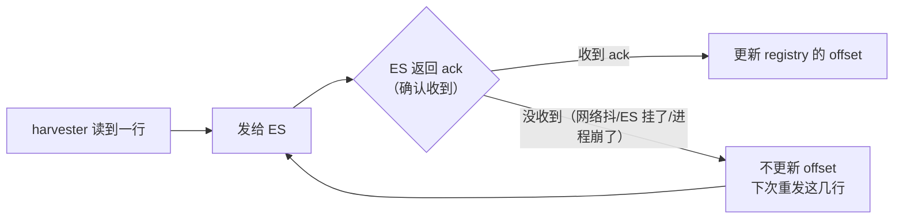
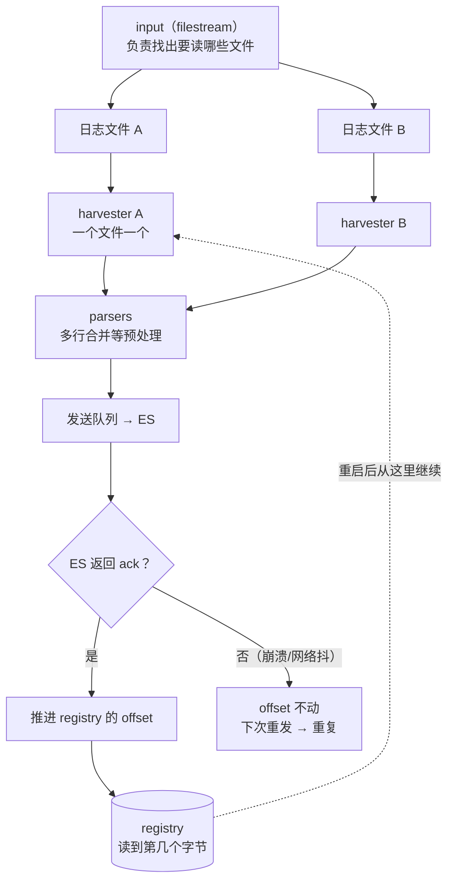

# 课 4：《Filebeat 把文件读进来》

> 一句话：日志躺在服务器文件里，Filebeat 怎么把它**自动、不丢、断点续传**地搬进管道——以及为什么一条 Java 异常堆栈会被切成 9 条。
> 阶段 2 · 第 1 课 ｜ 知识点：harvester 与 input 机制 / registry 与 at-least-once / 多行合并
> 状态：✅ 已交付（2026-09-06）｜ 版本基线：Elastic Stack **9.5.3** ｜ 环境：macOS arm64 + Docker Compose

---

## 🎯 本课目标

学完本课，你应该能：

1. 说清 Filebeat 读文件时的**两个分工角色**（input 与 harvester），以及 `filestream` 取代老 `log` input 的原因
2. 解释 Filebeat 为什么能"重启不丢、从上次的位置继续读"，并诚实说明它为什么**可能重复、极少漏**
3. 把被切成 9 条的 **Java 异常堆栈**用多行合并拼回一条完整日志
4. 用 Docker Compose 实测以上三个行为（本课所有输出都是本机真跑出来的）

> 配套文件：[`playground/03-filebeat-internals/`](../../../playground/03-filebeat-internals/)

## 📌 知识点导航

| # | 知识点 | 关键点 | 状态 |
|---|--------|--------|------|
| 1 | 4.1 harvester 与 input 机制 | input 找文件 / harvester 读文件（一个文件一个）/ `filestream` 取代 `log` / **fingerprint 标识文件** / 文件轮转 | ✅ 已完成 |
| 2 | 4.2 registry 与 at-least-once | registry 记 offset / 重启断点续读 / 为何**可能重复** / 什么情况会**漏** | ✅ 已完成 |
| 3 | 4.3 多行合并 | 堆栈被切成 9 条 / `parsers.multiline` 三件套（pattern / negate / match）/ 实测 9 条 vs 1 条 | ✅ 已完成 |

## 📖 本课在故事主线中的情节定位

第 2 幕「拿得到」正式开场。故事里那条日志还蜷缩在服务器的文件里，警报一响你就得 ssh 上去 grep。

**Filebeat 登场**——它像一个不知疲倦的传菜员，蹲在日志文件旁边，每写进一行就端起来、送进管道。课 3 你已经见过它干活的样子，本课要拆开看它是**怎么办到的**。

而拆开之后你会发现一个反直觉的现象：它**"几乎不漏"却"可能重复"**。这到底是 bug 还是特性？

---

# 正文

## 🏛️ 第一幕 · 起源与场景引入

### 从"人去读"到"程序去读"

课 1 那个凌晨两点的场景你还记得：

```bash
ssh web-01 'grep -n "ERROR" /var/log/order-service/app.log'
# 然后 web-02、web-03、web-04、web-05……
```

这个动作的本质是——**人主动去文件里翻**。它有三个致命问题：慢、不及时、依赖人到场。

Filebeat 把它反过来：**程序蹲在文件旁边，日志一写进来就被搬走**。人不再去读文件，而是去读那个"汇集点"。

### 但"蹲在文件旁边"这件事，比听起来难

想想看，一个靠谱的搬运工至少要解决这几个问题：

1. **哪些文件要读？**（可能有几十个，还在不断增加）
2. **读到哪了？**（程序重启一次，总不能从头再来一遍吧）
3. **文件被轮转/改名了怎么办？**（日志系统最爱干这事）
4. **一条日志占了多行怎么办？**（Java 异常堆栈能占几十行）

Filebeat 的答案分别是：**input、registry、fingerprint、multiline**——正好是本课的三个知识点。

## ❓ 第二幕 · 认知冲突

**你以为**：Filebeat 读文件嘛，一行一行读进去不就完了。

**真相是，它在这三件事上都会让你意外**：

### 意外一：一条异常被切成了 9 条

我在 `logs/stack-error.log` 里写了一条 Java 异常堆栈——**9 行，是一次报错**：

```text
2026-09-06 15:36:01 ERROR [order-service] 支付回调处理失败 orderId=20011
java.net.SocketTimeoutException: Read timed out
	at java.base/java.net.SocketInputStream.socketRead0(Native Method)
	at java.base/java.net.SocketInputStream.socketRead(SocketInputStream.java:115)
	...（后面还有 5 行）
Caused by: java.io.IOException: Connection reset by peer
```

用最朴素的配置（**不配多行合并**）采集后，ES 里变成了这样：

| 文件 | 文档数 |
|------|--------|
| `demo-app.log`（3 行单行日志） | **3** ✅ |
| `stack-error.log`（9 行 = 1 条异常） | **9** ❌ |

**一条报错变成了 9 条文档。** 后果很实际：你搜"支付回调失败"，只能搜到第一行那句 `ERROR ... orderId=20011`；**真正的异常原因（`SocketTimeoutException`）在第 2 条文档里，跟它毫无关联**。

### 意外二：它"几乎不漏"，却"可能重复"

我把 Filebeat 重启了一次，然后数 ES 里的文档：

```text
重启前：12 条
重启后：12 条     ← 一条不多，断点续传成功
```

好消息是没重复。但坏消息是——**这个"不重复"是有条件的**，条件就是那个叫 registry 的账本。一旦账本丢了，它就可能把同一个文件**再读一遍**，于是 ES 里出现重复。

这不是 bug，是一个明确的取舍：**at-least-once（至少一次）**。

### 意外三：文件轮转后，它认得出"这是新文件"

我做了这么个操作——把正在读的文件改名，再新建一个同名文件：

```bash
mv logs/stack-error.log logs/stack-error.log.1
echo '2026-09-06 16:20:01 ERROR [order-service] 轮转后新建同名文件 orderId=20031' > logs/stack-error.log
```

结果：`stack-error.log` 的文档数从 **9 变成 10**——新建的那个文件被当作**全新文件**重新采集（而不是接着旧的读）。

它凭什么认出来？答案在知识点 4.1。

## 🔍 第三幕 · 层层揭示

---

### 知识点 4.1 · harvester 与 input 机制

**一句话定义**
Filebeat 读文件是**两层分工**：**input** 负责"找出哪些文件需要读"，**harvester** 负责"读取其中某一个文件的内容"；**每个文件对应一个 harvester**。

**直觉建立（类比）**
把它想成**快递站**：

| 角色 | 对应 | 干什么 |
|------|------|--------|
| 派单员 | **input** | 拿着地址清单去找"哪些小区今天要收件"，找到一个就派一个人去 |
| 快递员 | **harvester** | 一个人负责一个小区，一趟趟把包裹搬回来 |

**类比失效的边界**：快递员送完一个小区就可以收工；**harvester 读完文件末尾后不会立刻消失**——它会继续守着，等新内容写进来（除非文件被删除或触发了关闭策略）。另外快递员可以临时顶替别人，harvester 与文件是**严格的一对一**。

**核心原理 · 实测：三个 input 各自启动**

我的配置里定义了 3 个 input（`demo-app` / `stack-error` / `stack-multiline`），Filebeat 启动日志长这样：

```text
Loading Inputs: 3
Starting input (ID: 4954160927811509121)
Starting input (ID: 12082954065250724910)
Starting input (ID: 12344977578275679899)
Loading and starting Inputs completed. Enabled inputs: 3
```

**三个 input，三个 ID。** 每个 input 独立扫描自己那组路径，找到文件就起一个 harvester。

**核心原理 · `filestream` 取代了老的 `log` input**

9.5.3 里你该用的类型是 **`filestream`**（本课及后续全部用它）。老类型是 `log`。为什么要换？看一眼 registry 里记的 key 就明白了：

```text
filestream::demo-app::fingerprint::f6a0b07541fe423aee9ea88bfef2714c3832dc8c5a1e3967d441d3f6b6e10301
└──┬─────┘ └─┬────┘ └────┬───┘ └───────────────────────┬────────────────────────────────────┘
 input类型   input id   标识方式            文件的 fingerprint（内容指纹）
```

关键在 **`fingerprint`** 这三个字：

| 代 | input 类型 | 怎么标识一个文件 | 问题 |
|----|-----------|----------------|------|
| 老 | `log` | **inode + device_id** | inode 会被操作系统**复用**！文件轮转后新文件可能拿到旧 inode，导致 Filebeat 认错文件 |
| 新 | `filestream` | **fingerprint**（文件开头若干字节的内容指纹） | 内容与路径一起判定，inode 复用骗不了它 |

**这就是为什么我前面那个轮转实验能被正确识别**：新老文件虽然同名，但内容不同 → fingerprint 不同 → 判定为两个不同的文件。

**核心原理 · 文件什么时候"读完就放手"**

harvester 读完文件末尾会一直守着。什么时候放？由 `close_*` 这组策略决定，最常用的是：

| 配置 | 含义 | 什么时候用 |
|------|------|-----------|
| `close.on_state_change.renamed` | 文件被改名（轮转的常见做法）后关闭 harvester | 配合 file rotation 使用 |
| `close.on_state_change.removed` | 文件被删除后关闭 | 默认开启 |
| `close.reader.after_interval` | 读完多久没新内容就关掉，有新的再开 | 文件极多、想省资源时 |
| `close.reader.on_eof` | 一到文件末尾立刻关闭（**不推荐**） | 容易丢正在写入的内容 |

> 💡 默认值通常够用。真正需要调的场景是**日志文件特别多**（几千上万个）时，为了控制资源占用才需要精细调 `close_*`。
>
> ⏳ **置信度说明**：上表四个 `close_*` 选项为**官方文档依据，本课未逐个实测**。已实测的是默认行为——harvester 读完文件末尾后**继续守着**（轮转实验中新建文件被立刻采集，证明 harvester 处于活跃监听状态）。

**示例演示**：见第四幕。

**常见误区**
- ❌ **混用 `log` 与 `filestream` 的配置写法** —— 两者的多行配置位置完全不同（老的在 `multiline.*` 顶层，新的在 `parsers` 里），照抄老教程必错
- ❌ 以为 harvester 读完就消失 —— 它默认一直守着文件等新内容
- ❌ 以为"一个 input 一个 harvester" —— **每个文件一个 harvester**，一个 input 可以对应成百上千个
- ❌ 用 `close.reader.on_eof: true` 省资源 —— 正在写入时读到末尾就关，容易出问题

**一句话记住**
**input 找文件、harvester 读文件（一个文件一个）**；9.x 用 **`filestream`**，它靠 **fingerprint** 认文件，轮转和 inode 复用都骗不了它。

📚 官方文档：[Filebeat filestream input](https://www.elastic.co/docs/reference/beats/filebeat/filebeat-input-filestream)

---

### 知识点 4.2 · registry 与 at-least-once

**一句话定义**
**registry** 是 Filebeat 本地的"账本"，记录**每个文件读到第几个字节**；基于此，Filebeat 提供的是 **at-least-once（至少一次）** 语义：**保证不丢，但不保证不重复**。

**直觉建立（类比）**
把它想成**读书时的书签**：你今天读到第 303 页，夹个书签；明天拿起书从 303 页继续，不用从头翻。

**类比失效的边界**：书签只记"页码"；registry 除了位置还记**文件的指纹**——如果有人把书换了一本（内容变了），光看页码会出错，还得先确认"这还是不是原来那本书"。

**核心原理 · registry 长什么样**

它在容器里的路径（实测）：

```bash
docker compose exec filebeat ls -la /usr/share/filebeat/data/registry/filebeat/
```

```text
-rw------- 1 root root 1296 log.json     ← 真正的账本
-rw------- 1 root root   15 meta.json    ← 元数据
```

看一眼 `log.json` 的开头（memlog 格式，一行一个操作）：

```json
{"op":"set","id":1}
{"k":"filestream::demo-app::fingerprint::f6a0b07541fe423aee9ea88bfef2714c3832dc8c5a1e3967d441d3f6b6e10301",
 "v":{"ttl":-1,"updated":[281470681743360,18446744011573954816],
 "cursor":null,
 "meta":{"fingerprint_len":303,"source":"/usr/share/filebeat/logs/demo-app.log","identifier_name":...}}}
```

我实测取出的**读取位置**：

```bash
docker compose exec filebeat grep -oE '"offset":[0-9]+' /usr/share/filebeat/data/registry/filebeat/log.json
```

```text
"offset":303     ← demo-app.log    读到了第 303 字节（正好是文件末尾）
"offset":588     ← stack-error.log 读到了第 588 字节
```

对照文件大小：`demo-app.log` 3 行 ≈ 303 字节、`stack-error.log` 9 行 ≈ 588 字节——**正好读完**。

**核心原理 · 断点续传实测**

```bash
curl -u elastic:ELKlearn2026 "http://localhost:9200/filebeat-9.5.3/_count"   # 重启前
docker compose restart filebeat
curl -u elastic:ELKlearn2026 "http://localhost:9200/filebeat-9.5.3/_count"   # 重启后
```

```text
重启前：{"count":12}
重启后：{"count":12}     ← 一条不多，一条不少
```

**重启后从 offset 继续，不重读。** 这就是 registry 的价值。

**核心原理 · 为什么会重复（at-least-once 的本质）**

关键在于 **offset 什么时候被更新**：



**只有在 ES 确认收到之后，offset 才会往前推。** 所以：

| 场景 | 结果 |
|------|------|
| 正常 | 发一次、ack、推 offset → **恰好一次** |
| 发出去了但没收到 ack（网络抖动 / ES 重启 / Filebeat 崩了） | offset 没推 → 重启后**这几行再发一遍** → **重复** |
| Registry 文件本身丢了 | 认不出读到哪 → 可能**从文件开头重读** → 大面积重复 |

**所以"至少一次"是设计取舍，不是缺陷**：它选择"宁可重复，不可丢失"。

> ⏳ **诚实标注**：我本想实测"删掉 registry 后重启导致重复"这一场景，但执行时命令未获批准（未执行成功），**因此这里只有原理与官方文档依据，没有我本机的实测数据**。已完成的实测是：① registry 里的 offset 值（303 / 588）② 正常重启 12→12 不重复。

**核心原理 · 什么情况会"漏"（比重复更该防）**

"至少一次"说的是**不丢已读到的内容**。但有几类情况 Filebeat 根本没机会读到：

| 情况 | 为什么漏 | 怎么防 |
|------|---------|--------|
| 日志写得比采集快，文件被轮转删除 | 还没轮到读，文件就被 rotate 掉了 | 调大轮转保留份数 / 提高采集能力 |
| Filebeat 长时间停机，期间文件被清理 | 同上 | 停机期间不要清理日志 |
| 单行超长被截断 | 单行超过 `message_max_bytes`（默认约 10MB）会被丢弃 | 调大该参数或修应用日志 |

**一句话**：重复的代价是"多几条"，漏的代价是"查不到"。**两害相权，宁可重复。**

> ⏳ **置信度说明**：上表三类"会漏"的情况属于**领域公认的常见风险与官方文档依据**，本课**未实测复现**（它们都需要特定的时序配合才能触发）。可以确定的实测结论是：正常情况下 Filebeat 重启后**不重不漏**（12 → 12）。

**常见误区**
- ❌ **拼命追求 exactly-once** —— 日志场景下去重的成本（分布式事务/唯一键）远高于接受少量重复。正确做法是**下游能幂等**（用 `_id` 去重）或**查询时容忍**（ES 主课学过：`_id` 相同则覆盖）
- ❌ 把 registry 存在容器里然后随便删容器 —— registry 是**状态**，容器一删就没了（生产上要挂卷持久化）
- ❌ 以为"重启 Filebeat 会重新灌一遍历史日志" —— 有 registry 就不会

**一句话记住**
registry 记着"每个文件读到第几个字节"，**ack 之后才推进** → 所以是 **at-least-once：可能重复，绝不丢失**。

📚 官方文档：[Filebeat 如何保证 at-least-once](https://www.elastic.co/docs/reference/beats/filebeat/how-filebeat-works)

---

### 知识点 4.3 · 多行合并

**一句话定义**
**多行合并**让 Filebeat 把"属于同一条日志的多行文本"合并成**一个 event**，而不是默认的"一行一个 event"。

**直觉建立（类比）**
把被撕成 9 片的信**拼回去再读**。

**类比失效的边界**：信的碎片边缘能严丝合缝对上；日志行**没有明确的"这条结束了"标记**——你只能反过来判断："**下一行是不是一条新日志的开始？**"如果不是，就把它并到上一条。这个"反向判断"正是配置里 `negate` 存在的理由，也是配错的根源。

**核心原理 · 三件套怎么配合**

`filestream` 里多行写在 **`parsers`** 下面（注意：不是老 `log` input 的顶层 `multiline.*`）：

```yaml
    parsers:
      - multiline:
          type: pattern
          pattern: '^\d{4}-\d{2}-\d{2} \d{2}:\d{2}:\d{2}'   # ① 什么样的行算"新日志的开始"
          negate: true                                       # ② 取反：不匹配的行才是"续行"
          match: after                                       # ③ 续行拼到前一条的后面
```

三个参数怎么读：

| 参数 | 值 | 含义 |
|------|-----|------|
| `pattern` | `'^\d{4}-...'` | 以"年-月-日 时:分:秒"开头的行 = **新日志的第一行** |
| `negate` | `true` | **反转判断**：不匹配 pattern 的行（也就是那些 `\tat ...` 堆栈行）= **续行** |
| `match` | `after` | 续行**追加到前一条**之后 |

组合起来的意思就一句话：**"不是以时间戳开头的行，都拼到上一条的后面。"**

> 🔴 **最容易配反的地方**：`negate: false` + `match: after` 的组合含义完全不同——那变成"匹配 pattern 的行才拼到上一条后面"，正好搞反。**记住 `negate: true` + `match: after` 这个最常用组合。**

**核心原理 · 实测：9 条 vs 1 条**

我在同一个 Filebeat 里放了两组对照，喂给它们内容结构完全相同的 9 行堆栈：

```bash
curl -u elastic:ELKlearn2026 "http://localhost:9200/filebeat-9.5.3/_search?pretty" \
  -H 'Content-Type: application/json' \
  -d '{"size":0,"aggs":{"by_file":{"terms":{"field":"log.file.path","size":10}}}}'
```

```text
"key" : "/usr/share/filebeat/logs/stack-error.log",      "doc_count" : 9    ← 没配 multiline：切成 9 条
"key" : "/usr/share/filebeat/logs/stack-multiline.log",  "doc_count" : 1    ← 配了 multiline：合成 1 条
"key" : "/usr/share/filebeat/logs/demo-app.log",         "doc_count" : 3    ← 单行日志：3 行 3 条（正常）
```

**同样的 9 行，9 条 vs 1 条。** 合并后那条文档的内容是完整的：

```json
"message" : "2026-09-06 16:10:01 ERROR [order-service] 库存扣减失败 orderId=20021\n
java.lang.IllegalStateException: 库存不足，当前可用 0，请求扣减 2\n
\tat com.order.service.InventoryService.deduct(InventoryService.java:64)\n
\tat com.order.service.InventoryService$$FastClassBySpringCGLIB$$1a2b3c.invoke(<generated>)\n
\tat org.springframework.cglib.proxy.MethodProxy.invoke(MethodProxy.java:218)\n
\tat com.order.service.OrderService.submit(OrderService.java:133)\n
\tat com.order.controller.OrderController.create(OrderController.java:47)\n
Caused by: java.sql.SQLException: Deadlock found when trying to get lock"
```

（`\n` 是换行符的 JSON 转义 —— 9 行完整保留在**同一个 `message`** 里。）

**现在你搜"库存扣减失败"，拿到的就是包含异常原因、完整调用栈和 `Caused by` 的一条日志**——而不是只有第一行的孤零零一句。

**示例演示**：见第四幕。

**常见误区**
- ❌ **`negate` 与 `match` 配反** —— 该并的没并、不该并的拼成一坨
- ❌ 照抄老教程把多行写在顶层 `multiline.*` —— `filestream` 必须写在 **`parsers`** 里
- ❌ `pattern` 写得太宽松 —— 比如只匹配 `^[0-9]`，正常日志行也可能被误判为续行
- ❌ 忘了多行合并只在**单个文件内**生效 —— 跨文件不会合并

**一句话记住**
多行合并就是一句话：**"不是以时间戳开头的行，拼到上一条后面"**（`negate: true` + `match: after`）。

📚 官方文档：[Filebeat 多行消息处理](https://www.elastic.co/docs/reference/beats/filebeat/multiline-examples)

---

## 🛠️ 第四幕 · 实操验证

配套文件在 [`playground/03-filebeat-internals/`](../../../playground/03-filebeat-internals/)。

### 第 0 步 · 切到课 4 的环境

```bash
cd ../02-end-to-end && docker compose down        # 停掉课 3（端口 9200/5601 冲突）
cd ../03-filebeat-internals
```

### 第 1 步 · 起环境

```bash
docker compose up -d elasticsearch
# 等 healthy（实测 40 秒）
curl -u elastic:ELKlearn2026 -X POST "http://localhost:9200/_security/user/kibana_system/_password" \
  -H 'Content-Type: application/json' -d '{"password":"KibanaSys2026"}'
docker compose up -d            # 起 Kibana + Filebeat
```

### 第 2 步 · 观察 input 与 harvester 启动

```bash
docker compose logs filebeat 2>&1 | grep -oE '"message":"[^"]{0,110}' | grep -iE "inputs|input |filestream"
```

```text
"message":"Loading Inputs: 3
"message":"Starting input (ID: 4954160927811509121)
"message":"Starting input (ID: 12082954065250724910)
"message":"Starting input (ID: 12344977578275679899)
"message":"Loading and starting Inputs completed. Enabled inputs: 3
```

### 第 3 步 · 看 registry 记了什么

```bash
docker compose exec filebeat ls -la /usr/share/filebeat/data/registry/filebeat/
docker compose exec filebeat grep -oE '"offset":[0-9]+' /usr/share/filebeat/data/registry/filebeat/log.json
```

```text
-rw------- 1 root root 1296 log.json
-rw------- 1 root root   15 meta.json

"offset":303
"offset":588
```

再看一眼 key 的格式，确认用的是 **fingerprint** 而非 inode：

```bash
docker compose exec filebeat head -c 300 /usr/share/filebeat/data/registry/filebeat/log.json | cat -v
```

```text
{"op":"set","id":1}
{"k":"filestream::demo-app::fingerprint::f6a0b07541fe423aee9ea88bfef2714c3832dc8c5a1e3967d441d3f6b6e10301",...
```

### 第 4 步 · 验证断点续传（重启不重复）

```bash
curl -u elastic:ELKlearn2026 "http://localhost:9200/filebeat-9.5.3/_count"   # 记下数字
docker compose restart filebeat
sleep 35
curl -u elastic:ELKlearn2026 "http://localhost:9200/filebeat-9.5.3/_count"   # 应该一模一样
```

实测：`12` → `12`。

### 第 5 步 · 多行合并的对照实验（本课最值得做的一步）

配置里已经同时放了两组，直接对比结果：

```bash
curl -u elastic:ELKlearn2026 "http://localhost:9200/filebeat-9.5.3/_search?pretty" \
  -H 'Content-Type: application/json' \
  -d '{"size":0,"aggs":{"by_file":{"terms":{"field":"log.file.path","size":10}}}}'
```

```text
stack-error.log      9 条   ← 没配 multiline，一条异常被切成 9 条
stack-multiline.log  1 条   ← 配了 multiline，合并成一条
demo-app.log         3 条   ← 单行日志，正常
```

再看看合并后那条长什么样：

```bash
curl -u elastic:ELKlearn2026 "http://localhost:9200/filebeat-9.5.3/_search?pretty" \
  -H 'Content-Type: application/json' \
  -d '{"size":1,"_source":["message"],"query":{"term":{"log.file.path":"/usr/share/filebeat/logs/stack-multiline.log"}}}'
```

### 第 6 步 · 验证文件轮转

```bash
mv logs/stack-error.log logs/stack-error.log.1
echo '2026-09-06 16:20:01 ERROR [order-service] 轮转后新建同名文件 orderId=20031' > logs/stack-error.log
sleep 35
# 再看一次按文件聚合，stack-error.log 应该 +1（实测 9 → 10）
```

新文件被当作**全新文件**采集（fingerprint 不同），而不是接着旧的读。

## 🧭 第五幕 · 体系收束

### 一图收束：Filebeat 读文件的完整机制



### 三句话记住本课

1. **input 找文件、harvester 读文件**（一个文件一个）；9.x 用 `filestream`，靠 **fingerprint** 认文件
2. **registry 记 offset，ack 之后才推进** → 所以是 **at-least-once：可能重复，绝不丢失**
3. 多行合并一句话：**"不是以时间戳开头的行，拼到上一条后面"**（`negate: true` + `match: after`）

### 为什么"拿得到"这一步必须理解这些

| 你现在的疑问 | 后面的课 |
|-------------|---------|
| 读进来的日志还是一坨文本，怎么切成字段？ | 阶段 3（Logstash / Ingest Pipeline） |
| 采集时能不能顺手加工一下、改改字段？ | **课 5《模块与处理器》** |
| Filebeat 之外还有哪些采集器？什么时候不该用它？ | **课 6《Beats 家族与采集选型》** |

### 埋下的伏笔

| 本课留下的疑问 | 在哪一课回答 |
|---------------|-------------|
| 除了读文件，Filebeat 还能读什么？ | 课 5（modules 与 processors） |
| 发送队列满了会怎样？压力怎么传回采集端？ | 课 5（输出与背压） |
| 日志量极大时采集端该怎么选？ | 课 6（采集选型） |

---

## 🐞 常见误区

1. **以为 Filebeat 一启动就把整份旧日志全灌进来** —— 有 registry 就只从上次的位置继续；**新文件**（registry 里没记录的）才会从头读
2. **混用 `log` 与 `filestream` 的配置写法** —— 多行配置位置完全不同，照抄老教程必错
3. **把"可能重复"当成丢数据，反过来追求 exactly-once** —— 日志场景下"至少一次 + 下游幂等"远比 exactly-once 划算
4. **`negate` / `match` 配反** —— 该并的没并、不该并的拼一坨；记住 `negate: true` + `match: after`
5. **把 registry 当临时文件** —— 它是**状态**，容器删了就没了；生产上必须挂卷持久化
6. **用 `close.reader.on_eof: true` 省资源** —— 正在写入时读到末尾就关，容易出问题

## 📋 命令速查卡

| 命令 | 作用 | 坑 |
|------|------|-----|
| `docker compose up -d filebeat` | 起采集容器 | 本课环境端口与课 3 相同，先 `docker compose down` 课 3 的 |
| `docker compose exec filebeat filebeat test config` | 校验配置 | 容器内配置路径是 `/usr/share/filebeat/filebeat.yml` |
| `docker compose logs filebeat \| grep -oE '"message":"[^"]{0,110}'` | 看日志（抽 message 更好读） | 原始输出是 JSON，很长 |
| `docker compose exec filebeat ls -la /usr/share/filebeat/data/registry/filebeat/` | 看 registry 文件 | 路径容易记错，注意 `data/registry/filebeat/` 三层 |
| `docker compose exec filebeat grep -oE '"offset":[0-9]+' .../log.json` | 看每个文件读到第几字节 | registry 是 memlog 格式（JSON 行），别当普通 JSON 解析 |
| `docker compose exec filebeat head -c 300 .../log.json \| cat -v` | 看 registry 的 key 结构 | 二进制片段用 `cat -v` 显示更清楚 |
| `docker compose restart filebeat` | 重启（验证断点续传） | 重启后文档数**不应该**增加 |
| `mv logs/x.log logs/x.log.1 && echo '...' > logs/x.log` | 模拟文件轮转 | 新文件 fingerprint 不同 → 被当新文件采集 |

## ✅ 自检三问

<details>
<summary><b>问题 1</b>：Filebeat 重启后，会不会把历史日志重新发一遍？什么情况下会？</summary>

**正常情况下不会。** registry 记着每个文件读到第几个字节，重启后从那个位置继续——实测 `12 → 12`，一条不多。

**但两种情况会重复：**

1. **没收到 ack 的那部分会重发**。offset 只有在 ES 确认收到之后才推进；如果发送后、收到 ack 前 Filebeat 崩了或网络断了，这批数据会被重发
2. **registry 丢了**。认不出读到哪，可能从文件开头重新读，造成大面积重复

> ⏳ 第 2 种情况我本想在本机实测（删 registry 后重启看文档数翻倍），但命令未获批准，只保留了原理说明。

**这也正是"at-least-once"的含义**：保证**不丢**，但**不保证不重复**。

**工程上的应对**：接受它，让下游幂等——写入 ES 时指定稳定的 `_id`（同一条日志重复写会覆盖而不是新增），或在查询层去重。

</details>

<details>
<summary><b>问题 2</b>：一条 9 行的 Java 异常堆栈，不配多行合并会怎样？为什么搜不到完整的报错原因？</summary>

**会被切成 9 条独立的文档**，每行一条：

| 文档 | message |
|------|---------|
| 1 | `2026-09-06 15:36:01 ERROR [order-service] 支付回调处理失败 orderId=20011` |
| 2 | `java.net.SocketTimeoutException: Read timed out` |
| 3-8 | `\tat java.base/...`（6 行调用栈） |
| 9 | `Caused by: java.io.IOException: Connection reset by peer` |

**为什么搜不到原因**：因为 Filebeat 默认**一行就是一个 event**。你搜"支付回调失败"只能命中第 1 条，**而真正的异常原因 `SocketTimeoutException` 在第 2 条文档里**——两条文档之间在 ES 里没有任何关联，你根本不知道它们原本是同一次报错。

**怎么修**：在 `filestream` input 里加 `parsers`：

```yaml
    parsers:
      - multiline:
          type: pattern
          pattern: '^\d{4}-\d{2}-\d{2} \d{2}:\d{2}:\d{2}'
          negate: true
          match: after
```

实测效果：**9 条 → 1 条**，`message` 里 9 行完整保留（用 `\n` 连接）。

</details>

<details>
<summary><b>问题 3</b>：老教程里的 <code>multiline.pattern</code> 写在顶层，我照抄到 <code>filestream</code> input 里没生效，为什么？</summary>

**因为两代 input 的多行配置位置不同。**

| input 类型 | 多行配置写在哪 |
|-----------|---------------|
| 老 `log` | **顶层**：`multiline.pattern` / `multiline.negate` / `multiline.match` |
| 新 `filestream` | **`parsers` 列表里**：`parsers: - multiline: {type: pattern, pattern: ..., negate: ..., match: ...}` |

`filestream` 把多行、ndjson、container 这些都抽象成了**统一的 parsers 流水线**，所以必须写在 `parsers` 下。写在顶层的 `multiline.*` 对 `filestream` **完全无效，而且不报错**——这正是坑人的地方：配置看着对，行为却没变。

**本课及后续全部使用 `filestream`。** 看到 8.x 以前的老教程（包括很多中文博客）时，记得做这个转换。

顺带说，除了位置不同，`filestream` 还有个本质改进：**用 fingerprint 而不是 inode 标识文件**，文件轮转（inode 复用）时不会认错。

</details>

## 🚀 下一批接力提示词

> 学完本课后，**复制下面这段文字发给 AI**，即可无缝进入下一课：

```text
继续学 ELK。我的学习档案在 elasticsearch/elk/00-学习档案.md，
刚学完阶段 2《采集层 Beats》课 4《Filebeat 把文件读进来》
（知识点：harvester 与 input 机制 / registry 与 at-least-once / 多行合并），
请按大纲继续讲解下一课：课 5《模块与处理器》
（知识点：modules 开箱即用 / processors 轻量加工 / 输出与背压）。

要求：
- 按五幕结构 + 知识点六要素写正文，填进既有骨架文件
- 版本基线 Elastic Stack 9.5.3，命令用 macOS + Docker Compose 写法
- 每条命令必须真跑一遍再写进讲义
- 写完过事实核查闸门 + 双视角评审，P0 清零后勾选评审清单对应条目

本机现状：三件套在跑（ES http://localhost:9200 elastic/ELKlearn2026、
Kibana http://localhost:5601），
配套文件在 elasticsearch/elk/playground/03-filebeat-internals/
（含 3 个 input 的对照：单行日志 / 未合并堆栈 / 已合并堆栈）。
```

## 🧭 课程导航

| 上一课 | 本课 | 下一课 |
|--------|------|--------|
| [阶段 1 · 课 3 端到端走一遍](../../1-全景与起步/lessons/lesson-03-端到端走一遍.md) | **课 4 Filebeat 把文件读进来** | [课 5 模块与处理器](lesson-05-模块与处理器.md) |

- **本阶段**：[阶段 2 概览](../overview.md) ｜ **阶段路径图**：[stage-2-path.svg](../assets/stage-2-path.svg)
- **配套文件**：[`playground/03-filebeat-internals/`](../../../playground/03-filebeat-internals/)
- **返回目录**：[ELK 课程目录](../../../02-课程目录.md)
- **衔接 ES 主课**：[课 11《数据管道与备份》](../../../../stages/4-分布式与工程实践/lessons/lesson-11-数据管道与备份.md)（Ingest Pipeline，可与本课"采集端加工"对照）

> 📌 **本课数据来源**：2026-09-06 于 macOS arm64 / Docker Desktop 29.4.1 实测。input 启动日志、registry 结构与 offset、重启前后文档数、多行合并 9 条 vs 1 条、文件轮转 9→10 条均为真实输出。
> ⏳ **一项未完成的实测**："删除 registry 后重启导致重复读取"这一场景命令未获批准，讲义中该部分只给原理与官方依据，**未标注为实测**。断点续传（12→12）与 registry offset 已实测。
