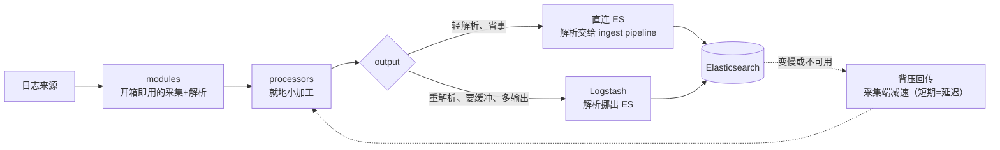

# 课 5：《模块与处理器》

> 一句话：文件读进来了，但"为每个常见来源手搓一套采集 + 解析 + 看板"太累——用 **modules 开箱即用**，再用 **processors** 顺手收拾字段，最后想清楚**数据送去哪、压力怎么回流**。
> 阶段 2 · 第 2 课 ｜ 知识点：modules 开箱即用 / processors 轻量加工 / 输出与背压
> 状态：✅ 已交付（2026-09-06）｜ 版本基线：Elastic Stack **9.5.3** ｜ 环境：macOS arm64 + Docker Compose

---

## 🎯 本课目标

学完本课，你应该能：

1. 说清 `modules.d` 目录的作用并启用一个模块（本课用 **nginx**），理解它替你打包好了"**采集配置 + ingest pipeline + Kibana dashboard**"三件套
2. 用 **processors**（`add_fields` / `drop_fields` / `add_tags` + `when` 条件）在采集端做轻量加工，并理解**执行顺序**为什么重要
3. 判断一条日志该**直连 ES** 还是**走 Logstash**，说清 bulk 批量、失败重试，以及**背压是怎么一路传导回采集源**的

> 配套文件：[`playground/04-modules-processors/`](../../../playground/04-modules-processors/)

## 📌 知识点导航

| # | 知识点 | 关键点 | 状态 |
|---|--------|--------|------|
| 1 | 5.1 modules 开箱即用 | `filebeat.config.modules.path` 前提 / `modules.d` 与启用方式 / 模块三件套 / **模块会自动把事件时间解析出来** | ✅ 已完成 |
| 2 | 5.2 processors 轻量加工 | `add_fields` / `add_tags` + `when` / `drop_fields` / **执行顺序** / 模块数据里 `message` 可能不存在 | ✅ 已完成 |
| 3 | 5.3 输出与背压 | `output.elasticsearch` vs `output.logstash` / bulk 批量 / **失败重试（实测停机不丢）** / 背压传导 | ✅ 已完成 |

## 📖 本课在故事主线中的情节定位

第 2 幕「拿得到」的推进。课 4 里主角日志已经被 Filebeat 端起来了，但"**端起来**"和"**端得漂亮**"是两回事：

- 每接一个日志来源（nginx、MySQL、系统日志…）都要手搓一遍路径、解析规则、字段命名——**重复劳动**
- 读进来的字段想顺手改一改（打个环境标记、丢掉噪音字段）——**就地加工**
- 这盘菜到底端到哪张桌子？ES 还是 Logstash？中间堵住了怎么办——**输出与背压**

故事冲突从"**读不读得到**"升级为"**读得巧不巧、送得稳不稳**"。

---

# 正文

## 🏛️ 第一幕 · 起源与场景引入

### 每个日志来源，都要重做一遍的苦力活

课 4 结束时，你已经能用 Filebeat 把一个文件读进 ES。现在假设公司让你接入三个来源：

| 来源 | 你要做的事 |
|------|-----------|
| **nginx 访问日志** | 找到日志路径 → 写 grok 正则解析出 IP / 方法 / 状态码 / UA → 把时间字段转成标准格式 → 在 Kibana 里拼几张图 |
| **MySQL 慢查询日志** | 找路径 → 处理"一条日志占多行" → 解析出耗时 / SQL 语句 → 时间转换 → 拼图 |
| **系统 syslog** | 找路径 → 解析 → 时间转换 → 拼图 |

看出规律了吗？**每个来源都要重复这四个动作**：找路径、写解析、转时间、做看板。而 nginx、MySQL、Redis、Kafka 这些主流软件的日志格式**是公开的、标准化的**——凭什么每个人都要自己解析一遍？

**Filebeat 的 modules 就是来消灭这份重复劳动的。** 它把"某个产品的日志该怎么采、怎么解析、怎么展示"打包成一个模块，你只管说"我要 nginx 这个模块"。

## ❓ 第二幕 · 认知冲突

**你以为**：开了模块就万事大吉，数据自己变漂亮。

**真相有三个，而且第二个最坑**：

### 真相一：modules 有个前提配置，不配它连用都用不了

我第一次敲 `filebeat modules list`，得到的是：

```text
Error in modules manager: modules management requires 'filebeat.config.modules.path' setting
```

**modules 功能不是默认可用的**，必须在 `filebeat.yml` 里声明模块配置目录的位置。

### 真相二（最坑）：模块解析后，`message` 字段**不见了**

模块解析完的文档长这样（实测节选）：

```json
{
  "source": { "ip": "192.168.1.10", "address": "192.168.1.10" },
  "http": { "request": { "method": "GET" }, "response": { "status_code": 201 } },
  "url": { "path": "/api/order/create" },
  "event": { "original": "192.168.1.10 - - [06/Sep/2026:16:30:01 +0800] \"GET /api/order/create HTTP/1.1\" 201 1234 \"-\" \"Mozilla/5.0\"" }
}
```

注意：**没有 `message` 字段了**，原始内容搬到了 **`event.original`**。

后果很实际——我写的这条 processor：

```yaml
  - add_tags:
      when:
        contains:
          message: "ERROR"      # ← 依赖 message 字段
      tags: ["alert"]
```

**对模块解析过的数据完全无效，而且不报错**（字段不存在，条件就是假）。它只对"没经过模块解析"的普通日志生效。这类"静默失效"是最难查的一类问题。

### 真相三：ES 挂了，数据会丢吗？

我把 ES 停掉、在停机期间继续写日志，然后恢复。**结果是：一条都没丢**（后面第四幕有完整实测）。但有个前提你得知道——**恢复后数据不会立刻出现**，它还在队列里排队。

## 🔍 第三幕 · 层层揭示

---

### 知识点 5.1 · modules 开箱即用

**一句话定义**
**模块**是 Filebeat 针对某个具体产品（nginx / mysql / redis / system…）预先打包好的一套配置，包含**采集配置 + ingest pipeline（解析规则）+ Kibana dashboard（看板）**——启用即用，不用自己写解析。

**直觉建立（类比）**
把它想成**预制菜料理包**：厂家已经把菜切好、调料配好、做法写在袋子上，你买回来热一下就能上桌。

**类比失效的边界**：料理包的口味是固定的；**模块是可以单独调的**——它的每一段配置（日志路径、是否启用某个 fileset）都能在 `modules.d/*.yml` 里改。模块不是黑盒，是"**可以改的模板**"。

**核心原理 · 前提配置（不配就用不了）**

```yaml
filebeat.config.modules:
  path: ${path.config}/modules.d/*.yml     # 模块配置文件的存放位置
  reload.enabled: false
```

少了这一段，`filebeat modules list` / `enable` / `disable` 全部报：

```text
modules management requires 'filebeat.config.modules.path' setting
```

**核心原理 · 启用一个模块到底发生了什么**

`modules.d/` 目录里，每个模块是一个 YAML 文件，**文件名决定是否启用**：

| 文件名 | 状态 |
|--------|------|
| `nginx.yml` | ✅ 已启用 |
| `nginx.yml.disabled` | ❌ 已禁用 |

所以 `filebeat modules enable nginx` 干的事，本质就是**把 `.disabled` 后缀去掉**。你也可以直接编辑文件来启用——两者等价。

启用后查一下（实测）：

```bash
docker compose exec filebeat filebeat modules list
```

```text
Enabled:
nginx

Disabled:
```

**核心原理 · 模块的三件套**

启用 nginx 后，Filebeat 启动时会自动往 ES 里装解析管道（实测）：

```bash
curl -u elastic:ELKlearn2026 "http://localhost:9200/_ingest/pipeline?pretty"
```

```text
"filebeat-9.5.3-nginx-access-pipeline"
```

这个 pipeline 里躺着完整的 grok 解析规则（节选）：

```text
"?(?:%{NGINX_ADDRESS_LIST:nginx.access.remote_ip_list}|%{NOTSPACE:source.address}) - (-|%{DATA:user.name}) \\[%\{HTTPDATE:nginx.access.time}\\] \\"...
```

**你一行正则都没写，解析规则已经在 ES 里了。**

**核心原理 · 实测：一行文本变成结构化字段**

我喂给 nginx 模块这一行：

```text
192.168.1.10 - - [06/Sep/2026:16:30:01 +0800] "GET /api/order/create HTTP/1.1" 201 1234 "-" "Mozilla/5.0"
```

ES 里的文档变成（实测节选）：

```json
{
  "@timestamp":   "2026-09-06T08:30:01.000Z",
  "source":       { "ip": "192.168.1.10", "address": "192.168.1.10" },
  "http":         { "request": { "method": "GET" },
                    "response": { "status_code": 201, "body": { "bytes": 1234 } },
                    "version": "1.1" },
  "url":          { "path": "/api/order/create", "original": "/api/order/create" },
  "user_agent":   { "original": "Mozilla/5.0", "name": "Other" },
  "service":      { "type": "nginx" },
  "event":        { "module": "nginx", "dataset": "nginx.access",
                    "category": ["web"], "type": ["access"], "outcome": "success",
                    "original": "192.168.1.10 - - [06/Sep/2026:16:30:01 +0800] ..." },
  "fileset":      { "name": "access" },
  "input":        { "type": "log" }
}
```

现在你可以直接问 ES："**有多少个 500 状态码？哪个接口最慢？**"——因为状态码、路径、字节数都已经是独立字段了，可以过滤、可以聚合。

**🔴 顺带解决课 3 留下的那个坑**

还记得课 3 说的吗：`@timestamp` 默认是**采集时间**，不是事件时间。

看上面这条：**`@timestamp` 是 `2026-09-06T08:30:01.000Z`** —— 换算成北京时间正是日志里写的 **16:30:01**！

**模块的 pipeline 自动从日志内容里解析出了真实事件时间并覆盖了 `@timestamp`。** 也就是说，用对模块的话，课 3 那个"差 1 小时 6 分"的问题根本不会出现。

> 💡 **另一个值得注意的细节**：模块内部用的是 **`input.type: log`**（不是我们在课 4 学的 `filestream`）。这是 Filebeat 模块自身的历史实现，**不影响你使用**，但你在 registry 和文档字段里会看到这个区别。

**示例演示**：见第四幕。

**常见误区**
- ❌ **把 modules 当成"只能整开整关"** —— 它只是普通 YAML 文件，`var.paths`、某个 fileset 的 `enabled` 都能单独改
- ❌ 以为开了模块就"什么都有了" —— 解析有了，但**字段加工、丢弃、路由**还得你自己配
- ❌ 不知道模块会把 `message` 搬到 `event.original` —— 导致依赖 `message` 的 processor 静默失效
- ❌ 不配 `filebeat.config.modules.path` 就去用 `modules` 命令

**一句话记住**
模块 = **采集 + 解析管道 + 看板**的打包；启用就是改文件名；**它替你写好了 grok，连事件时间都帮你解析好**。

📚 官方文档：[Filebeat modules](https://www.elastic.co/docs/reference/beats/filebeat/filebeat-modules)

---

### 知识点 5.2 · processors 轻量加工

**一句话定义**
**processors** 是采集端的"**就地加工**"环节——在事件送出之前，给它加字段、改字段、丢字段、加标签，还可以用 `when` 条件控制"**哪些事件才加工**"。

**直觉建立（类比）**
把它想成**流水线边上加装的小工位**：

| 工位 | 对应 processor |
|------|---------------|
| 贴标签机 | `add_fields` / `add_tags` |
| 拆件台 | `dissect` / `rename` |
| 废品剔除 | `drop_fields` / `drop_event` |

**类比失效的边界**：真实流水线上工位装反了，产品当场就废了，你立刻看得见；**processor 顺序写错了，通常不报错，只是"结果不对"**——你会在很后面才发现某个字段没加、某个条件没生效。

**核心原理 · 三类常用 processor**

```yaml
processors:
  # ① 加字段：给所有事件打上环境与课次标签
  - add_fields:
      target: ""            # 空字符串 = 加在根层级；写 "labels" 则加在 labels 下面
      fields:
        env: learning
        lesson: lesson-05

  # ② 条件加工：只有 message 含 "ERROR" 的事件才加 alert 标签
  - add_tags:
      when:
        contains:
          message: "ERROR"
      tags: ["alert"]

  # ③ 丢字段：去掉不关心的噪音
  - drop_fields:
      fields: ["agent.ephemeral_id", "ecs.version"]
      ignore_missing: true   # 字段不存在时不要报错
```

**核心原理 · 执行顺序：从上到下，错了就静默出错**

processors 是**按书写顺序依次执行**的。这意味着：

| 顺序 | 结果 |
|------|------|
| `add_fields` → `add_tags`（依赖 message）→ `drop_fields` | ✅ 正确：先加标记，再按条件打标签，最后清理 |
| `drop_fields`（删了 message）→ `add_tags`（依赖 message） | ❌ 条件永远为假，标签永远不打上，**但不报错** |

这就是本课第二幕那个坑的根因：**顺序 + 字段是否存在**，两个因素凑一起就成了静默失效。

**核心原理 · 实测：三项加工全部生效**

我用上面的配置跑了 3 条 `demo-app.log` 日志（1 条 ERROR、2 条 INFO），结果：

```text
第 1 条 (INFO)  : env=learning, lesson=lesson-05, ecs={}              ← 无 tags
第 2 条 (ERROR) : env=learning, lesson=lesson-05, ecs={}, tags=[...]  ← 只有它有 tags ✅
第 3 条 (INFO)  : env=learning, lesson=lesson-05, ecs={}              ← 无 tags
```

对照课 4 的文档（没有 processors 时），可以确认三点：

| processor | 验证结果 |
|-----------|---------|
| `add_fields` | 三条日志**全部**带上 `env` / `lesson` ✅ |
| `add_tags` + `when.contains.message: ERROR` | **只有 ERROR 那条**有 `tags` ✅ |
| `drop_fields` | `agent.ephemeral_id` 消失；`ecs` 从 `{"version":"8.0.0"}` 变成空对象 `{}` ✅ |

**⚠️ 但注意那个"但是"**——我同时看了 nginx 模块的日志，`tags` **一条都没有**。原因就是第二幕说的：模块解析后 `message` 字段不存在了（搬到了 `event.original`），于是 `when.contains.message` 的条件对它们全部为假。

**怎么修**：条件改成同时兼容两种形态，或干脆用 `event.original`：

```yaml
  - add_tags:
      when:
        or:
          - contains: { message: "ERROR" }
          - contains: { event.original: "ERROR" }
      tags: ["alert"]
```

**示例演示**：见第四幕。

**常见误区**
- ❌ **processors 与 ingest pipeline 混为一谈** —— processors 在**采集端**（Filebeat 进程里）跑，ingest pipeline 在 **ES 端**（写入前）跑。位置不同，CPU 开销归属就不同（阶段 3 课 9 会专门对比）
- ❌ processor 顺序乱写 —— 静默出错，查不到原因
- ❌ `when` 条件依赖的字段可能不存在 —— 尤其是模块解析过的事件
- ❌ 在采集端做重活（复杂正则、查外部字典） —— 那是 Logstash 的地盘，采集端应该**轻**

**一句话记住**
processors 是采集端的**就地小加工**：加字段、丢字段、打标签，能用 `when` 挑事件；**顺序敏感，且别在采集端干重活**。

📚 官方文档：[定义 processors](https://www.elastic.co/docs/reference/beats/filebeat/defining-processors)

---

### 知识点 5.3 · 输出与背压

**一句话定义**
**输出（output）**决定事件送去哪里（直连 ES 还是经 Logstash）；**背压（backpressure）**是下游处理不过来时，压力**反向传导**回采集端、让采集慢下来的机制——它是"不丢数据"的代价。

**直觉建立（类比）**
把这条链路想成**工厂的传送带 + 成品仓库**：

- 传送带 = Filebeat 的队列
- 成品仓库 = ES（或 Logstash）
- 仓库满了、卸货慢 → 传送带就得**减速**，否则货会掉在地上

**类比失效的边界**：真实传送带减速时货物停在带上（看得见）；**背压最终会传导到"读取文件"这一环**——Filebeat 会**放慢甚至暂停读取日志**，而不是无限堆积。这个行为对使用者是**半透明**的，你只能从指标和延迟里看出来。

**核心原理 · 直连 ES 还是走 Logstash**

```yaml
output.elasticsearch:                          # 直连 ES
  hosts: ["http://elasticsearch:9200"]

# 或者
output.logstash:                               # 交给 Logstash 处理
  hosts: ["logstash:5044"]
```

| 方案 | 谁做解析 | 优点 | 代价 |
|------|---------|------|------|
| **直连 ES** | ES 的 ingest pipeline | 组件少、延迟低、运维简单 | 解析的 CPU 开销**压在 ES 上** |
| **走 Logstash** | Logstash 的 filter | 解析不占 ES 资源；可做复杂处理、缓冲、多输出 | 多一个组件要运维；多一跳延迟 |

**判断口诀**：解析很轻 + 想省事 → 直连；**解析很重 / 要多输出 / 想做缓冲削峰** → 上 Logstash。

> 💡 一个常见误区是"要走 Logstash 才能解析"。不是——直连 ES 时，**ES 的 ingest pipeline 就是解析的执行者**（nginx 模块就是这么干的）。Logstash 不是解析的必需品，是**把解析挪出 ES** 的手段。这个话题在阶段 3 课 9《该在哪处理》会用一张决策表彻底讲清。

**核心原理 · bulk 批量与失败重试**

Filebeat 不是一条一条发，而是**攒批发送**（bulk）。相关参数：

| 参数 | 默认 | 含义 |
|------|------|------|
| `bulk_max_size` | 50 | 单个 bulk 请求最多装多少条事件 |
| `worker` | 1 | 几个并发连接同时发 |
| `max_retries` | 3 | 一个批次失败重试几次（**到顶则丢弃该批次并记日志**） |

⚠️ **这里有个必须说清的边界**：重试能保证"**下游短暂不可用时不丢**"，但**重试次数用尽后事件会被丢弃**（并写日志）。所以"不丢"是有条件的——它需要下游在合理时间内恢复。

> ⏳ **置信度说明**：上表三个默认值来自**官方文档**，本课未逐个实测。已实测的是重试**行为本身**——ES 停机期间 Filebeat 持续输出 `Attempting to reconnect ... with N reconnect attempt(s)`（N 递增到 6），恢复后 `Connection to backoff(...) established`，且停机期间的事件全部送达。

**核心原理 · 实测：ES 停机期间的数据会不会丢**

我做了这个实验：

```bash
# 1. 先写一条，确保正常
echo '...orderId=30010' >> logs/demo-app.log
# 2. 停掉 ES
docker compose stop elasticsearch
# 3. 停机期间继续写
echo '...orderId=30011' >> logs/demo-app.log
# 4. 恢复 ES
docker compose start elasticsearch
```

**停机期间，Filebeat 的日志是这样的**（实测）：

```text
Error dialing lookup elasticsearch on 127.0.0.11:53: no such host
Failed to connect to backoff(elasticsearch(http://elasticsearch:9200)): Get ...
Attempting to reconnect to backoff(elasticsearch(http://elasticsearch:9200)) with 4 reconnect attempt(s)
...（持续重试）
Connection to backoff(elasticsearch(http://elasticsearch:9200)) established   ← 恢复
```

**它在自动重试，而不是丢弃。**

恢复之后逐条核查（实测）：

```text
orderId=30010 -> "count":1     ← 停机前写的：在
orderId=30011 -> "count":1     ← 停机期间写的：在 ✅ 一条没丢
orderId=30020 -> "count":1     ← 恢复后写的：在
```

**文档总数 10 → 13，三条新日志全部到齐。**

> ⚠️ **但有个细节差点让我误判**：ES 刚恢复时我立刻查，文档数还是 **10**，一条都没多——我差点以为数据丢了。**其实是数据还在队列里排队**，等了一会儿（并追加新事件触发刷新）才全部刷出。
>
> **记住**：ES 恢复后数据**不会立刻可见**，给 Filebeat 一点时间把队列排空。

**核心原理 · 背压是怎么传导的**


**这就是背压**：压力从下游一路传回上游，**最终表现为"日志延迟进入 ES"**，而不是"数据丢失"。

**它会带来两个后果**：

1. **日志延迟**（轻微）：ES 恢复后补上，最终一致
2. **文件被轮转删除**（严重）：如果 ES 长时间不可用，期间写的日志可能**在轮转时被清理掉**——这才是真正会丢数据的场景（课 4 讲过"什么情况会漏"）

**示例演示**：见第四幕。

**常见误区**
- ❌ **以为背压会丢数据** —— 短期不会，它是"**减速**"不是"丢弃"；真正会丢的是**长期故障 + 文件轮转清理**
- ❌ 以为"ES 恢复后数据立刻可见" —— 队列要排空，需要时间
- ❌ 以为不配 Logstash 就不能解析 —— ES 的 ingest pipeline 也是解析执行者
- ❌ 盲目调大 `bulk_max_size` —— 太大会让单次请求过重、失败时重试代价更大

**一句话记住**
直连 ES = 解析压在 ES 上；走 Logstash = 把解析挪出去；**背压是把压力反向传回采集端让它减速**——短期表现为延迟，长期才可能真丢。

📚 官方文档：[Elasticsearch output](https://www.elastic.co/docs/reference/beats/filebeat/elasticsearch-output)

---

## 🛠️ 第四幕 · 实操验证

配套文件在 [`playground/04-modules-processors/`](../../../playground/04-modules-processors/)。

### 第 0 步 · 切环境（注意本课改了挂载路径）

```bash
cd ../03-filebeat-internals && docker compose down
cd ../04-modules-processors
```

> ⚠️ **本课修正了课 4 的一个挂载坑**：课 3、课 4 把日志挂到了 `/usr/share/filebeat/logs`，那恰好是 **Filebeat 自己的日志目录**，只读挂载会导致它写不了自己的日志：
> ```text
> write error: failed to open new log file for writing:
> open '/usr/share/filebeat/logs/filebeat-20260906.ndjson': read-only file system
> ```
> 本课改成挂到 `/var/log/app`，把 Filebeat 自己的目录还给它。

### 第 1 步 · 起环境

```bash
docker compose up -d elasticsearch
# 等 healthy（实测 40 秒）
curl -u elastic:ELKlearn2026 -X POST "http://localhost:9200/_security/user/kibana_system/_password" \
  -H 'Content-Type: application/json' -d '{"password":"KibanaSys2026"}'
docker compose up -d
```

### 第 2 步 · 确认模块已启用

```bash
docker compose exec filebeat filebeat modules list
```

```text
Enabled:
nginx

Disabled:
```

（如果报 `modules management requires 'filebeat.config.modules.path' setting`，说明 `filebeat.yml` 里少了那段配置。）

### 第 3 步 · 看模块自动装好的解析管道

```bash
curl -u elastic:ELKlearn2026 "http://localhost:9200/_ingest/pipeline?pretty" | grep nginx
```

```text
"filebeat-9.5.3-nginx-access-pipeline"
```

### 第 4 步 · 看解析效果（本课最爽的一步）

```bash
curl -u elastic:ELKlearn2026 "http://localhost:9200/filebeat-9.5.3/_search?pretty" \
  -H 'Content-Type: application/json' \
  -d '{"size":1,"query":{"term":{"log.file.path":"/var/log/app/nginx-access.log"}}}'
```

你会看到一行文本变成了 `source.ip` / `http.response.status_code` / `url.path` / `user_agent.original` 等结构化字段，而且 **`@timestamp` 正是日志里写的那个时间**。

### 第 5 步 · 验证 processors 的三项加工

```bash
curl -u elastic:ELKlearn2026 "http://localhost:9200/filebeat-9.5.3/_search?pretty" \
  -H 'Content-Type: application/json' \
  -d '{"size":5,"query":{"term":{"log.file.path":"/var/log/app/demo-app.log"}},"_source":{"includes":["message","tags","env","lesson","ecs"]},"sort":[{"log.offset":"asc"}]}'
```

逐条对照：三条都有 `env`/`lesson`、**只有 ERROR 那条有 `tags`**、`ecs` 被清空。

### 第 6 步 · 实测"ES 挂了会不会丢数据"

```bash
echo '2026-09-06 16:40:01 INFO  [order-service] 停ES前写入 orderId=30010' >> logs/demo-app.log
docker compose stop elasticsearch
echo '2026-09-06 16:40:30 ERROR [order-service] ES停机期间写入 orderId=30011' >> logs/demo-app.log

# 看看它在干嘛
docker compose logs --tail=25 filebeat 2>&1 | grep -oE '"message":"[^"]{0,130}' | tail -7

# 恢复
docker compose start elasticsearch
echo '2026-09-06 16:45:01 INFO  [order-service] 恢复后新写一条触发刷新 orderId=30020' >> logs/demo-app.log
sleep 40

# 逐条核查
for id in 30010 30011 30020; do printf "orderId=%s -> " "$id"; \
  curl -s -u elastic:ELKlearn2026 "http://localhost:9200/filebeat-9.5.3/_count" \
  -H 'Content-Type: application/json' -d "{\"query\":{\"match_phrase\":{\"message\":\"orderId=$id\"}}}" \
  | grep -oE '"count":[0-9]+'; done
```

实测三条全部 `"count":1`，**文档总数 10 → 13，停机期间写的那条一条没丢**。

## 🧭 第五幕 · 体系收束

### 一图收束：采集端的三个抓手



### 三句话记住本课

1. **modules 是"采集 + 解析管道 + 看板"的打包**，启用就是改文件名；它连**事件时间**都帮你从日志里解析出来
2. **processors 是采集端的就地小加工**，顺序敏感、条件依赖字段是否存在，**别在采集端干重活**
3. **背压是压力反向传回采集端让它减速**——短期表现为延迟，**长期故障 + 文件轮转**才会真丢数据

### 伏笔：还有一件事没解决

模块帮 nginx 解析出了字段，但**我们自己写的 `demo-app.log` 仍然是一坨文本**——`message` 里那句 `orderId=30001 userId=u201 amount=299.00` 还是没被切成字段。

**这就是阶段 3 要解决的问题**（Logstash / Ingest Pipeline 的 grok 与 dissect）。

### 埋下的伏笔

| 本课留下的疑问 | 在哪一课回答 |
|---------------|-------------|
| 自己的日志格式怎么解析成字段？ | 阶段 3 课 7（grok / dissect） |
| 解析到底该放采集端、Logstash 还是 ES？ | 阶段 3 课 9《该在哪处理》 |
| 除了 Filebeat，还有哪些采集器？什么时候不该用它？ | **课 6《Beats 家族与采集选型》** |

---

## 🐞 常见误区

1. **把 modules 当成"只能整开整关"** —— 它就是普通 YAML，`var.paths`、单个 fileset 的 `enabled` 都能改
2. **processors 与 ingest pipeline 混为一谈** —— 一个在采集端（Filebeat 进程里），一个在 ES 端（写入前）；**CPU 开销归属不同**
3. **processor 顺序乱写 / `when` 条件依赖了不存在的字段** —— 静默失效，最难查的一类问题（模块解析后 `message` 会消失，就是典型触发场景）
4. **直连 ES 与走 Logstash 选错** —— 不是"能不能解析"的问题，而是"**解析的开销算在谁头上**"
5. **不配 `filebeat.config.modules.path` 就用 modules 命令** —— 直接报 `modules management requires ...`
6. **以为背压会丢数据** —— 短期是延迟；真正会丢的是长期故障遇上文件轮转清理
7. **ES 恢复后立刻查不到数据就以为丢了** —— 队列还在排空，给它一点时间

## 📋 命令速查卡

| 命令 | 作用 | 坑 |
|------|------|-----|
| `docker compose exec filebeat filebeat modules list` | 看已启用/禁用模块 | ⚠️ 必须先配 `filebeat.config.modules.path`，否则报错 |
| `docker compose exec filebeat filebeat modules enable nginx` | 启用模块（改文件名） | 需要 `modules.d` 目录**可写**，只读挂载会失败 |
| `docker compose exec filebeat filebeat test config` | 校验配置（含 processors） | 只查语法，查不出"顺序错"这类逻辑问题 |
| `curl -u elastic:<密码> "_ingest/pipeline?pretty"` | 看 ES 里装了哪些解析管道 | 模块命名的管道形如 `filebeat-9.5.3-nginx-access-pipeline` |
| `curl -u elastic:<密码> ".../_search" -d '{"aggs":{...}}'` | 按字段聚合验证解析/加工效果 | 聚合字段要用 **keyword** 类型（如 `log.file.path`） |
| `docker compose stop elasticsearch` | 模拟下游故障 | 恢复后数据**不会立刻可见**，队列要排空 |
| `docker compose logs --tail=25 filebeat \| grep -oE '"message":"[^"]{0,130}'` | 看 Filebeat 日志（抽 message） | 原始 JSON 很长，用 grep 抽更清晰 |

## ✅ 自检三问

<details>
<summary><b>问题 1</b>：你启用了 nginx 模块，数据也进 ES 了，但基于 <code>message</code> 字段写的 processor 条件（比如 <code>when.contains.message: "ERROR"</code>）完全不生效，且不报错。为什么？怎么修？</summary>

**因为模块解析之后，`message` 字段不存在了。**

nginx 模块的 ingest pipeline 把原始日志内容从 `message` 搬到了 **`event.original`**，然后把解析出的各个部分（`source.ip`、`http.response.status_code`、`url.path`…）写成独立字段。所以文档里压根没有 `message`：

```json
{
  "source":  { "ip": "192.168.1.10" },
  "http":    { "response": { "status_code": 201 } },
  "event":   { "original": "192.168.1.10 - - [06/Sep/2026:16:30:01 +0800] \"GET ..." }
}
```

`when.contains.message` 遇到不存在的字段 → 条件为假 → 不执行。**这是 by design，所以不会报错。**

**怎么修（两条路）：**

1. **条件同时兼容两种形态**：
```yaml
  - add_tags:
      when:
        or:
          - contains: { message: "ERROR" }
          - contains: { event.original: "ERROR" }
      tags: ["alert"]
```

2. **改用解析后的字段做判断**（更推荐，语义更准）：
```yaml
  - add_tags:
      when:
        equals: { "http.response.status_code": 500 }
      tags: ["alert"]
```

**排查这类问题的通用方法**：先 `GET /_search` 把一条文档的**全部字段**拉出来看一眼，确认你要依赖的字段到底在不在、叫什么名字。**别凭印象写条件。**

</details>

<details>
<summary><b>问题 2</b>：ES 挂了 10 分钟，期间业务一直在写日志。恢复后数据会不会丢？什么情况下才会真丢？</summary>

**短期不会丢。** 实测：停机期间写入的日志（`orderId=30011`），在 ES 恢复后被完整补送，`count:1`，一条没丢。

原理是：Filebeat 发送后要等 ES 的 ack 才推进 offset；等不到就**持续重试**——

```text
Failed to connect to backoff(elasticsearch(http://elasticsearch:9200)): Get ...
Attempting to reconnect to backoff(elasticsearch(...)) with 4 reconnect attempt(s)
...
Connection to backoff(elasticsearch(http://elasticsearch:9200)) established
```

**但"不丢"是有条件的，真正会丢的情况是：**

1. **长期故障 + 文件轮转清理**：ES 长时间不可用期间，业务日志文件被 logrotate 轮转并删除了旧文件 → Filebeat 还没来得及读就被删了。**这是最常见的真丢场景**
2. **重试次数用尽**：`max_retries` 默认 3，超过后该批次会被丢弃并记日志
3. **采集速度长期跟不上写入速度**：队列持续堆积，最终撞上第 1 条

**一个容易误判的细节**：ES 刚恢复时立刻查，文档数可能没变（我实测恢复后查还是 10 条，差点以为丢了）。**数据还在队列里排队**，等一会儿（或追加新事件触发刷新）就会全部出现。

**工程建议**：监控"日志进入 ES 的延迟"而不只是"ES 是否活着"——背压的第一症状是**延迟变大**，而不是报错。

</details>

<details>
<summary><b>问题 3</b>：判断正误——"要做日志解析就必须上 Logstash，Filebeat 直连 ES 是没法解析的。"</summary>

**错误。**

**Filebeat 直连 ES 时，解析是由 ES 的 ingest pipeline 完成的。** 本课实测的 nginx 模块就是最好的反例：

- 配置里只有 `output.elasticsearch`，**没有 Logstash**
- 但 Filebeat 启动时自动往 ES 装了 `filebeat-9.5.3-nginx-access-pipeline`
- 一行原始文本被解析成 `source.ip` / `http.response.status_code` / `url.path` / `user_agent.original` 等完整字段
- 连 `@timestamp` 都被改成了日志里的真实事件时间

**所以真正的区别不是"能不能解析"，而是"解析的开销算在谁头上"：**

| 方案 | 解析执行者 | CPU 开销归属 |
|------|-----------|-------------|
| 直连 ES | ES 的 ingest pipeline | **压在 ES 上**，会跟查询/索引抢资源 |
| 走 Logstash | Logstash 的 filter | 在 Logstash 上，**ES 只管存** |

**什么时候才真的需要 Logstash**：解析规则很重、需要多输出分流、需要缓冲削峰、或者 ES 的 CPU 已经吃紧。

完整的决策表在**阶段 3 课 9《该在哪处理》**——那里会把"Beats processors / Logstash / ES Ingest"三个位置放在一起对比。

</details>

## 🚀 下一批接力提示词

> 学完本课后，**复制下面这段文字发给 AI**，即可无缝进入下一课：

```text
继续学 ELK。我的学习档案在 elasticsearch/elk/00-学习档案.md，
刚学完阶段 2《采集层 Beats》课 5《模块与处理器》
（知识点：modules 开箱即用 / processors 轻量加工 / 输出与背压），
请按大纲继续讲解下一课：课 6《Beats 家族与采集选型》（阶段 2 收官）
（知识点：家族成员各管什么 / 采集端选型对比 / 什么时候不该用 Beats）。

要求：
- 按五幕结构 + 知识点六要素写正文，填进既有骨架文件
- 版本基线 Elastic Stack 9.5.3，命令用 macOS + Docker Compose 写法
- 每条命令必须真跑一遍再写进讲义
- 写完过事实核查闸门 + 双视角评审，P0 清零后勾选评审清单对应条目

本机现状：三件套在跑（ES http://localhost:9200 elastic/ELKlearn2026、
Kibana http://localhost:5601），
配套文件在 elasticsearch/elk/playground/04-modules-processors/
（nginx 模块 + processors 演示 + 背压实验）。
```

## 🧭 课程导航

| 上一课 | 本课 | 下一课 |
|--------|------|--------|
| [课 4 把文件读进来](lesson-04-Filebeat把文件读进来.md) | **课 5 模块与处理器** | [课 6 Beats 家族与采集选型](lesson-06-Beats家族与采集选型.md) |

- **本阶段**：[阶段 2 概览](../overview.md) ｜ **阶段路径图**：[stage-2-path.svg](../assets/stage-2-path.svg)
- **配套文件**：[`playground/04-modules-processors/`](../../../playground/04-modules-processors/)
- **返回目录**：[ELK 课程目录](../../../02-课程目录.md)
- **衔接 ES 主课**：[课 11《数据管道与备份》](../../../../stages/4-分布式与工程实践/lessons/lesson-11-数据管道与备份.md)（Ingest Pipeline，可与本课 processors 对照"该在哪一层加工"）

> 📌 **本课数据来源**：2026-09-06 于 macOS arm64 / Docker Desktop 29.4.1 实测。模块启用、自动装载的 pipeline 名、nginx 解析后的完整字段、`@timestamp` 被解析为事件时间、processors 三项效果、ES 停机重试日志与恢复后逐条核查（10 → 13）均为真实输出。
> ⚠️ **两个真实踩坑已写进讲义**：① 不配 `filebeat.config.modules.path` 时 `modules list` 报错 ② 课 3/课 4 把日志挂到 `/usr/share/filebeat/logs`（Filebeat 自己的日志目录）导致它写不了日志——本课已修正为 `/var/log/app`。
