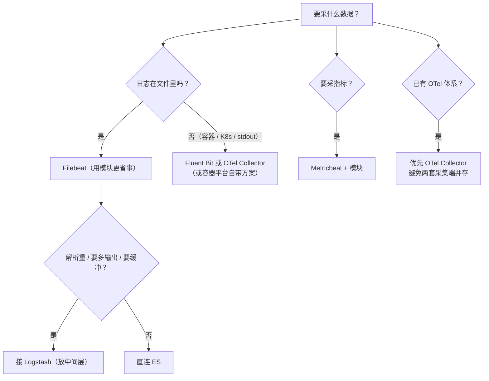
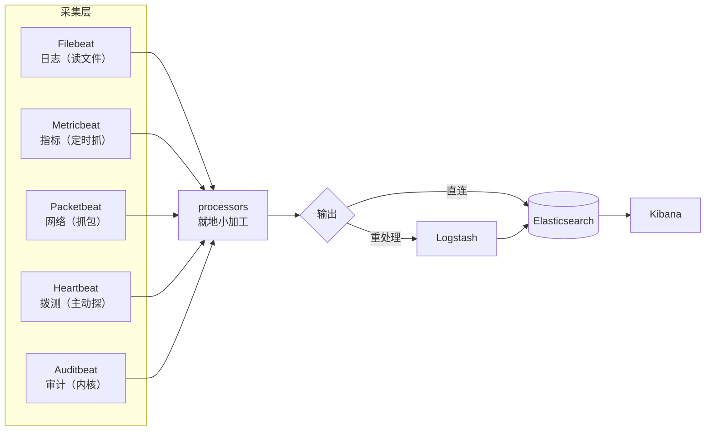

# 课 6：《Beats 家族与采集选型》

> 一句话：Filebeat 只会读文件——那 CPU 飙了、网络慢了、服务挂了谁来报？看清 **Beats 家族的分工**，在四条采集路线之间做出选型，并知道**什么时候不该用 Beats**。
> 阶段 2 · 第 3 课（**阶段收官**）｜ 知识点：家族成员各管什么 / 采集端选型对比 / 什么时候不该用 Beats
> 状态：✅ 已交付（2026-09-06）｜ 版本基线：Elastic Stack **9.5.3** ｜ 环境：macOS arm64 + Docker Compose

---

## 🎯 本课目标

学完本课，你应该能：

1. 说清 Beats 家族五个主力成员（**Filebeat / Metricbeat / Packetbeat / Heartbeat / Auditbeat / Winlogbeat**）各管什么数据，看到需求就知道该派谁上场，并理解它们共享同一套 **libbeat** 底座
2. 面对一个采集需求，能在 **Beats / Logstash / Fluentd（Fluent Bit）/ OpenTelemetry Collector** 之间做出有依据的选型
3. 判断**什么时候不该用 Beats**（容器与 K8s 日志、应用直连 SDK、已有可观测体系等），并给出替代路径

> 配套文件：[`playground/05-beats-family/`](../../../playground/05-beats-family/)（**两个 Beat 同台**：Filebeat 采日志 + Metricbeat 采指标）

## 📌 知识点导航

| # | 知识点 | 关键点 | 状态 |
|---|--------|--------|------|
| 1 | 6.1 家族成员各管什么 | Filebeat 日志 / Metricbeat 指标 / Packetbeat 网络 / Heartbeat 拨测 / Auditbeat 审计 / Winlogbeat Windows 事件；**共享 libbeat 底座** | ✅ 已完成 |
| 2 | 6.2 采集端选型对比 | Beats vs Logstash vs Fluentd/Fluent Bit vs OTel Collector：强项、代价、适用边界 | ✅ 已完成 |
| 3 | 6.3 什么时候不该用 Beats | 容器与 K8s 日志 / 应用直连 SDK / 已有 OTel 体系 / 极端资源受限 | ✅ 已完成 |

## 📖 本课在故事主线中的情节定位

第 2 幕「拿得到」的收官。课 4、课 5 你已经把"**日志文件**"这一种数据拿得稳稳的，但镜头一拉远就发现：**要采的东西不止日志**。

- 日志说"支付超时"——但**CPU 是不是飙了？内存是不是满了？**日志回答不了
- 日志说"接口 500"——但**网络是不是抖了？服务是不是压根没起来？**日志也回答不了

于是 Beats 家族的其他成员登场。而收官课必须泼一盆冷水：**Beats 不是万能的**——第三个知识点专门讲"什么时候不该用它"，为的是让你在进入阶段 3 之前就建立起判断力：**工具的价值不在于你会不会用，而在于你知道它不适合用在哪**。

---

# 正文

## 🏛️ 第一幕 · 起源与场景引入

### Filebeat 的能力边界

课 4、课 5 里的 Filebeat 干得不错：读文件、断点续传、多行合并、模块解析。现在把它放到这个场景里：

> 凌晨两点，订单服务告警。你打开 Kibana 看到一堆 `ERROR 支付回调失败`。
> 然后呢？**CPU 是不是满了？内存是不是泄漏了？网络是不是丢包了？**

Filebeat 一个都答不上来 —— **它只会读文件**，而这些信息根本不在文件里，它们是**操作系统/网络设备的当前状态**，需要有人**定时去问**。

### 于是家族里的其他成员登场

Elastic 的做法不是把 Filebeat 做成一个全能怪物，而是**一个数据一种 Beat**：

| 数据在哪 | 谁去拿 | 怎么拿 |
|---------|--------|--------|
| 写在**文件**里 | **Filebeat** | 盯着文件，写一行读一行 |
| 在**操作系统**里（CPU/内存/磁盘） | **Metricbeat** | 每隔 N 秒去问系统要一次快照 |
| 在**网络线路**上 | **Packetbeat** | 抓包，解析协议 |
| 需要**主动探测**才知道 | **Heartbeat** | 定时去 ping / 拨测 |
| 在**系统调用/文件变更**里 | **Auditbeat** | 接内核审计框架 |
| 在 **Windows 事件日志**里 | **Winlogbeat** | 读 Windows Event Log |

**一个 Beat 管一类数据，各司其职。**

## ❓ 第二幕 · 认知冲突

**你以为**：指标嘛，跟日志差不多，都是"一条数据"。

**真相是有三个**，第二个尤其坑。

### 真相一：日志与指标是两种形态完全不同的数据

我在本课环境里同时跑了 Filebeat 和 Metricbeat，各取一条对比：

| | **日志**（Filebeat） | **指标**（Metricbeat） |
|---|---------------------|----------------------|
| 内容 | `message` 是一坨**文本** | 是**纯数值**，如 `system.cpu.total.pct: 0.1827` |
| 来源 | 读文件，有 `log.file.path` 与 offset | **不读文件**，定时去问系统要快照 |
| 产生节奏 | **事件驱动**——应用写一行才有一行 | **周期驱动**——不管有没有事，每 10 秒一条 |
| 数据量 | 有就多、没就少 | **恒定增长**，跟业务量无关 |
| 标识 | `event.dataset: nginx.access` | `event.dataset: system.cpu` |
| agent | `agent.type: filebeat` | `agent.type: metricbeat` |

**"周期驱动"这条最容易被忽略**：我实测时索引里有 11 条指标，过了一会儿再查变成 14 条——**没有任何业务发生，它也在稳定增长**。这意味着指标的存储规划方式和日志完全不同（阶段 4 会讲）。

### 真相二（最坑）：`system.cpu.total.pct` **不是**"CPU 使用率"

看这条实测指标（节选）：

```json
{
  "system": {
    "cpu": {
      "cores": 11,
      "total": { "pct": 0.1827, "norm": { "pct": 0.0166 } },
      "user":  { "pct": 0.1486, "norm": { "pct": 0.0135 } },
      "idle":  { "pct": 10.8153, "norm": { "pct": 0.9832 } }
    }
  }
}
```

如果你以为 `system.cpu.total.pct: 0.1827` 是"CPU 用了 0.18%"，**那就错了**。

看清楚这三个数：**`cores: 11`**、`total.pct: 0.1827`、`total.norm.pct: 0.0166`——

```text
0.0166 × 11 = 0.1826 ≈ 0.1827 ✅
```

**`pct` 是按核数累加的**（11 个核的使用率加在一起），**`norm.pct` 才是归一化后的 0–1 值**（真正"这台机器用了百分之几"）。在 11 核机器上，满负荷时 `total.pct` 会接近 **11**（1100%），而不是 100。

**用错的结果**：你的"CPU 超过 80% 就告警"规则，在多核机器上**永远触发不了**（或者反过来一直误报）。

> 📌 这条是"**看懂字段定义比会配工具更重要**"的最佳例证：工具帮你采到了数，但读错数比没采到更糟——它会让你基于错误结论做决策。

### 真相三：不是所有场景都该用 Beats

Filebeat 读文件很擅长，但——**如果日志根本不在文件里呢？**

容器里的应用往 `stdout` 打日志，你在宿主机上找不到那个文件；K8s 里 Pod 随时重建，文件路径更是无从谈起。这时候硬套 Filebeat 会很别扭。第三个知识点专门处理这个。

## 🔍 第三幕 · 层层揭示

---

### 知识点 6.1 · 家族成员各管什么

**一句话定义**
**Beats** 是一组**单一职责的轻量采集器**：每个 Beat 只负责一类数据，采集后统一送往 ES 或 Logstash；它们共享同一套底层框架 **libbeat**（输出、重试、背压、监控这些能力是共用的）。

**直觉建立（类比）**
把它想成**医院里的各个科室**：

| 科室 | 对应 Beat | 看什么 |
|------|----------|--------|
| 病历科 | **Filebeat** | 病人自己写的病程记录（**日志**） |
| 检验科 | **Metricbeat** | 体温、血压这些**数值指标** |
| 影像科 | **Packetbeat** | 拍片子看体内**网络通信** |
| 体检中心 | **Heartbeat** | 主动**拨测**：你这人还活着吗 |
| 保卫科 | **Auditbeat** | **审计**：谁动了什么 |
|  Windows 专科 | **Winlogbeat** | Windows 事件日志 |

**类比失效的边界**：医院各科室的报告格式各不相同；**Beats 家族的输出格式是统一的**（都遵循 ECS 规范、都带 `@timestamp` / `host.*` / `event.*` / `agent.*`），所以能进同一个 ES、用同一套 Kibana 查询。这正是"家族"的意义。

**核心原理 · 六位成员一览**

| Beat | 管什么数据 | 典型用途 | 本机实测 |
|------|-----------|---------|---------|
| **Filebeat** | 日志文件 | 应用日志、nginx 访问日志、系统日志 | ✅ 课 4-6 全程实测 |
| **Metricbeat** | 系统与服务指标 | CPU / 内存 / 磁盘 / Redis、MySQL 等中间件指标 | ✅ **本课实测** |
| **Packetbeat** | 网络流量 | 抓包分析 HTTP / DNS / MySQL 协议，看接口耗时与错误 | ⏳ 未实测（需 `NET_ADMIN` + `NET_RAW` 权限） |
| **Heartbeat** | 主动拨测（可用性） | 定时 ping / HTTP / TCP 探测，判断服务是否存活、响应时间 | ⏳ 未实测 |
| **Auditbeat** | 审计事件 | 文件完整性、系统调用、用户登录（安全场景） | ⏳ 未实测（需内核审计权限） |
| **Winlogbeat** | Windows 事件日志 | Windows 安全日志、应用日志 | ⏳ 未实测（本机为 macOS） |

> ⏳ **诚实标注**：本课**只实测了 Filebeat 与 Metricbeat**。其余四位受运行环境限制（权限、操作系统）未能实测，上表中它们的定位来自官方文档。

**核心原理 · 它们共享同一套底座（libbeat）**

我把两个 Beat 的配置文件摆在一起，会发现高度一致：

| 能力 | Filebeat | Metricbeat |
|------|----------|-----------|
| 模块目录配置 | `filebeat.config.modules.path` | `metricbeat.config.modules.path` |
| 输出配置 | `output.elasticsearch` | `output.elasticsearch`（**一模一样**） |
| 模块目录 | `modules.d/*.yml` | `modules.d/*.yml` |
| 文档里的标识 | `agent.type: filebeat` | `agent.type: metricbeat` |

**这就是 libbeat**：输出、重试、背压、TLS、监控这些"公共能力"抽出来共享，每个 Beat 只实现自己那部分采集逻辑。

**对你意味着什么**：学会一个 Beat，其他的基本是**换个模块名**而已；而且课 4、课 5 学的 registry、背压、模块机制**全都通用**。

**核心原理 · 实测：两个 Beat 的数据长什么样**

同一套环境里，两个 data stream 并存（实测 `_cat/indices`）：

```text
yellow open   .ds-filebeat-9.5.3-2026.09.06-000001     1   1    7    29.1kb
green  open   .ds-metricbeat-9.5.3-2026.09.06-000001   1   0   11    63.2kb
```

顺带复习课 3 的知识：**Metricbeat 那个是 `green`，Filebeat 那个是 `yellow`**——因为我在 `metricbeat.yml` 里设了 `setup.template.settings.index.number_of_replicas: 0`（单节点学习环境副本设 0，就不会因副本无处安放而 yellow）。**green/yellow 只反映副本能不能放下，不代表数据多少。**

一条 CPU 指标的完整结构（实测节选）：

```json
{
  "@timestamp": "2026-09-06T08:58:11.525Z",
  "system": {
    "cpu": {
      "cores": 11,
      "total": { "pct": 0.1827, "norm": { "pct": 0.0166 } },
      "user":  { "pct": 0.1486, "norm": { "pct": 0.0135 } },
      "system":{"pct": 0.0221, "norm": { "pct": 0.002  } },
      "idle":  { "pct": 10.8153,"norm": { "pct": 0.9832 } },
      "iowait": {...}, "irq": {...}, "softirq": {...}, "nice": {...}, "steal": {...}
    }
  },
  "host":  { "name": "77729da9c75f" },
  "event": { "dataset": "system.cpu" },
  "agent": { "type": "metricbeat" }
}
```

对比课 4 那条日志文档：日志是 `message` 一坨文本，指标是**可以直接聚合求和的数值**。所以指标能画成折线图、能做"CPU 平均值"这类统计，而原始日志不行。

**示例演示**：见第四幕。

**常见误区**
- ❌ 以为 Filebeat 也能采 CPU/内存 —— 它是**读文件**的；指标要 Metricbeat（或其他指标采集器）
- ❌ 以为各 Beat 各装各的、配置完全不同 —— 它们共享 libbeat，输出/模块机制基本一致
- ❌ **把 `system.cpu.total.pct` 当成 CPU 使用率** —— 多核机器上是**累加值**，要用 `norm.pct` 或除以核数
- ❌ 以为指标数据量稳定 —— 它是**周期驱动**，没有业务也会持续写入

**一句话记住**
一个 Beat 管一类数据：**Filebeat 日志、Metricbeat 指标、Packetbeat 网络、Heartbeat 拨测、Auditbeat 审计**；它们共享 libbeat，学会一个就学会一片。

📚 官方文档：[Metricbeat 参考](https://www.elastic.co/docs/reference/beats/metricbeat) ｜ [Beats 总览](https://www.elastic.co/docs/reference/beats)

---

### 知识点 6.2 · 采集端选型对比

**一句话定义**
采集端不是只有 Beats 一家——**Beats / Logstash / Fluentd（Fluent Bit）/ OpenTelemetry Collector** 是四条主流路线，各有强项与代价。

**直觉建立（类比）**
把它想成**从家到公司的四种通勤方式**：

| 方式 | 类比 | 特点 |
|------|------|------|
| Beats | **步行/单车** | 轻巧、贴身、只能带少量东西，但随叫随到 |
| Logstash（作采集端） | **货车** | 装得多、能边走边加工，但笨重、要专门司机 |
| Fluent Bit | **电动车** | 轻又快，云原生长大，插件生态另一套 |
| OTel Collector | **标准化集装箱** | 不挑运输公司，日志/指标/链路**一柜装走** |

**类比失效的边界**：通勤方式可以随便换；**采集端一换，解析规则、监控指标、运维方式都要重写**——迁移成本很高，所以选型时要想清楚长期。

**核心原理 · 四条路线对比**

| 路线 | 强项 | 代价 | 什么时候选 |
|------|------|------|-----------|
| **Beats** | 与 Elastic 栈**无缝**（模板/模块/看板全自带）；轻量；ECS 字段统一 | 主要服务 Elastic 生态；输出到别处不如专用工具灵活 | **已用（或打算用）Elastic 栈**；想要开箱即用的解析与看板 |
| **Logstash**（作为采集端） | 插件最多；能做重解析、多输出分流、缓冲 | **JVM + 较重**，当采集端部署在业务机上不合适 | 需要**集中处理**时（通常放中间层，而不是当采集端） |
| **Fluentd / Fluent Bit** | 云原生生态（CNCF）事实标准之一；**Fluent Bit 极轻量**，适合容器与边缘 | 与 Elastic 的"模块/看板"开箱体验不如 Beats；两套字段规范要对齐 | **K8s 环境**、资源紧张、输出目标不止 ES |
| **OpenTelemetry Collector** | **厂商中立**；日志/指标/链路**一套管道**；可同时发往多个后端 | 相对较新，Elastic 侧的成熟预设少于 Beats；概念较多 | 要**统一三种信号**、避免厂商锁定、或已有 OTel 体系 |

> ⏳ **置信度说明**：上表是**基于各项目公开定位与社区共识的定性对比，本课未做性能实测或部署实测**（本机只实测了 Beats 两条：Filebeat + Metricbeat）。不同版本与场景下结论可能变化，选型前建议用**你自己的数据量**做一次压测。

**核心原理 · 一个实用的判断顺序**



**核心原理 · 混用是常态，不是失败**

真实环境里长期并存多套采集端很常见（比如 Beats 采日志、OTel Collector 采链路）。**关键不是"统一成一个"，而是避免同一份数据被两套工具重复采集**——那会让你付双倍存储、还难以排查重复。

**常见误区**
- ❌ 以为"选一个就要全部替换" —— 按数据类型分工是常态
- ❌ 只看性能不看生态 —— 与后端（ES）的整合深度、模块与看板能省下大量工作
- ❌ 忽略迁移成本 —— 采集端换了，解析规则与字段命名往往要重写

**一句话记住**
**用 Elastic 栈就优先 Beats**；K8s 或资源紧张看 Fluent Bit；要统一三种信号且避免厂商锁定选 OTel Collector；**Logstash 适合放中间层做重处理，不是采集端首选**。

---

### 知识点 6.3 · 什么时候不该用 Beats

**一句话定义**
Beats 的默认心智模型是"**一台机器上一个进程，读本机文件或问本机系统**"——**当数据不在这个形态里时，Beats 就不是最优选**。

**直觉建立（类比）**
Beats 像**每个小区门口的收发员**：贴着小区住、熟悉每家每户。但如果居民都搬进了"每天重建一次的临时板房"（容器），门口收发员今天记住的门牌号明天就作废了。

**类比失效的边界**：容器场景下 Beats **并非不能用**（有 DaemonSet 方案），只是**不是最省事**的那个——这个区别很重要：是"不合适"而不是"不行"。

**核心原理 · 四种该考虑别家的情况**

**① 容器与 K8s 日志**

- **问题**：容器随时创建销毁，日志写在容器内的 `stdout` 或临时目录，**没有稳定的宿主机文件路径**
- **Beats 的难处**：按"宿主机文件"配置的方式失效；需要以 DaemonSet 方式部署、挂载宿主机的容器日志目录、还要给每条日志补上 Pod/命名空间等元数据
- **更顺的做法**：容器平台自带的日志方案（如 Fluent Bit DaemonSet、容器运行时自带的 log driver）或 OTel Collector；它们原生理解 Pod 元数据

**② 应用直连（APM / SDK）**

- **场景**：你想要的不是"日志文本"，而是**一次请求的耗时分解、调用链、异常堆栈**
- **问题**：这类**结构化链路数据**由应用的 APM Agent 直接产生更准确（它知道一次调用的边界）
- **更顺的做法**：Elastic APM Agent（或 OpenTelemetry SDK）**从应用进程内直接上报**

**③ 已有统一可观测体系（OTel）**

- **场景**：公司已经上了 OpenTelemetry，指标、链路都在走 OTel Collector
- **问题**：再引入 Beats = 两套采集端、两套配置、两套监控
- **更顺的做法**：统一用 OTel Collector，通过 OTLP 接入后端

**④ 极端资源受限**

- **场景**：边缘设备、IoT、几千台小规格机器
- **问题**：每个 Beat 是一个独立进程（虽然已经很轻），数量一多仍有开销
- **更顺的做法**：更轻的采集器（如 Fluent Bit），或降低采集频率、减少 metricset

**⑤ 一个容易忽略的：只需要一次性搬运**

- **场景**：把一批历史日志文件倒进 ES
- **问题**：Beats 是**常驻守护进程**，为一次性任务配一套 Beat 太重
- **更顺的做法**：一次性脚本 / Logstash 一次性导入 / ES 的 `_bulk`

**示例演示**：见第四幕。

**常见误区**
- ❌ "Beats 能干所有采集" —— 它的心智模型是"**本机 + 常驻 + 单一数据类型**"，离开这三点就该看别家
- ❌ "容器场景绝对不能用 Beats" —— 是"不是最省事"，不是"不行"；小团队用 Filebeat DaemonSet 跑起来也完全可行
- ❌ 明知不合适还硬套，然后用一堆补丁配置去绕 —— 绕出来的东西比换工具更难维护

**一句话记住**
Beats 适合"**本机、常驻、单一数据类型**"；**容器/K8s、应用内链路、已有 OTel、极端轻量、一次性搬运**——这五类场景优先考虑别家。

---

## 🛠️ 第四幕 · 实操验证

配套文件在 [`playground/05-beats-family/`](../../../playground/05-beats-family/)。

### 第 0 步 · 切环境

```bash
cd ../04-modules-processors && docker compose down
cd ../05-beats-family
```

### 第 1 步 · 起环境（两个 Beat 一起）

```bash
docker compose up -d elasticsearch
# 等 healthy（实测 40 秒）
curl -u elastic:ELKlearn2026 -X POST "http://localhost:9200/_security/user/kibana_system/_password" \
  -H 'Content-Type: application/json' -d '{"password":"KibanaSys2026"}'
docker compose up -d          # filebeat + metricbeat + kibana
```

### 第 2 步 · 确认两个 Beat 都在干活

```bash
docker compose ps                                        # 看四个容器
docker compose exec metricbeat metricbeat modules list   # 看 Metricbeat 模块
```

```text
Enabled:
system

Disabled:
```

### 第 3 步 · 看两个 data stream 并存

```bash
curl -u elastic:ELKlearn2026 "http://localhost:9200/_cat/indices?v"
```

```text
yellow open   .ds-filebeat-9.5.3-2026.09.06-000001     1   1    7    29.1kb
green  open   .ds-metricbeat-9.5.3-2026.09.06-000001   1   0   11    63.2kb
```

> 💡 注意 `green` 与 `yellow` 的差别：Metricbeat 那份因为副本设为 0 而是 green。**这是课 3 知识的复习机会**，别看到 yellow 就以为数据有问题。
> 另外这两个数字是**查询时刻的快照**——指标每 10 秒各新增一条，过一会儿再查会变大。

### 第 4 步 · 对比"指标"与"日志"的字段形态

```bash
# 指标：按 event.dataset 分组
curl -u elastic:ELKlearn2026 "http://localhost:9200/metricbeat-9.5.3/_search?pretty" \
  -H 'Content-Type: application/json' \
  -d '{"size":0,"aggs":{"by_ds":{"terms":{"field":"event.dataset","size":10}}}}'

# 取一条 CPU 指标看结构
curl -u elastic:ELKlearn2026 "http://localhost:9200/metricbeat-9.5.3/_search?pretty" \
  -H 'Content-Type: application/json' \
  -d '{"size":1,"query":{"term":{"event.dataset":"system.cpu"}},"_source":{"includes":["@timestamp","system","event.dataset","agent.type","host.name"]}}'
```

### 第 5 步 · 亲手验算那个"CPU 陷阱"

从那条 CPU 指标里取出三个数，自己乘一下：

```text
cores          = 11
total.norm.pct = 0.0166
total.pct      = 0.1827

0.0166 × 11 = 0.1826 ≈ 0.1827 ✅
```

**结论**：`pct` 是按核累加的，`norm.pct` 才是归一化的使用率。**画图和配告警时别用错。**

## 🧭 第五幕 · 体系收束

### 一图收束：阶段 2 全貌



### 阶段 2 三句话总结（"拿得到"这一幕）

1. **Filebeat 负责把文件读出来**：input 找文件、harvester 读文件、registry 记位置，语义是 **at-least-once（可能重复、绝不丢失）**
2. **modules 开箱即用、processors 就地小加工**：模块替你写好解析管道（连事件时间都帮你解析），processors 负责打标记、丢字段、加条件
3. **家族各司其职、选型看场景**：一个 Beat 管一类数据；**离开"本机 + 常驻 + 单一数据类型"这三个前提，就该考虑别家**

### 阶段 2 完成度自检

| 课 | 你现在应该能做到 | ✅ |
|----|-----------------|-----|
| 课 4 | 说清 input/harvester、registry 与 at-least-once、多行合并 | ☐ |
| 课 5 | 用 modules 接入常见来源、用 processors 加工、理解背压 | ☐ |
| 课 6 | 分清家族成员分工、能在四条路线间选型、知道何时不该用 Beats | ☐ |

### 还有一件事没解决（引出阶段 3）

走到这里，日志**拿得到**了，但 `demo-app.log` 里这句仍然是**一坨文本**：

```text
2026-09-06 17:05:01 INFO  [order-service] 订单创建成功 orderId=40001 userId=u301 amount=299.00
```

`orderId`、`userId`、`amount` 全都埋在字符串里，**没法按订单号查、没法统计金额**。

**阶段 3《处理层 Logstash》就要解决这件事**——把文本切成字段，并回答"解析该放在哪一层做"。

### 埋下的伏笔

| 本课留下的疑问 | 在哪一课回答 |
|---------------|-------------|
| 怎么把 `orderId=xxx` 这种文本切成字段？ | **阶段 3 课 7**（grok / dissect / mutate） |
| 日志量大了处理不过来怎么办？ | 阶段 3 课 8（持久化队列 / 吞吐调优） |
| 解析到底该放采集端、Logstash 还是 ES？ | 阶段 3 课 9《该在哪处理》 |
| 采来的数据怎么存、怎么老化？ | 阶段 4 课 10 |

---

## 🐞 常见误区

1. **以为 Filebeat 能采 CPU/内存** —— 它是读文件的；指标归 Metricbeat
2. **把 `system.cpu.total.pct` 当 CPU 使用率** —— 多核机器上是**按核累加**，要用 `norm.pct` 或除以 `cores`
3. **以为指标数据量稳定** —— 它是**周期驱动**，没业务也会持续写入
4. **以为 Beats 各装各的、配置完全不同** —— 共享 libbeat，输出与模块机制基本一致
5. **以为"选一个采集端就要全部替换"** —— 按数据类型分工是常态，禁忌是**同一份数据被两套工具重复采集**
6. **明知场景不合适还硬套 Beats** —— 容器/K8s、应用内链路、已有 OTel、极端轻量、一次性搬运，这五类优先考虑别家
7. **看到索引 yellow 就以为数据有问题** —— 只反映副本能否放下；单节点 + 副本 1 必然 yellow

## 📋 命令速查卡

| 命令 | 作用 | 坑 |
|------|------|-----|
| `docker compose exec metricbeat metricbeat modules list` | 看 Metricbeat 已启用模块 | 同 Filebeat 一样需要先配 `metricbeat.config.modules.path` |
| `curl -u elastic:<密码> "_cat/indices?v"` | 看各 Beat 写入了哪些 data stream | `docs.count` 是**查询时刻快照**，指标会持续增长 |
| `curl ... "metricbeat-9.5.3/_search" -d '{"aggs":{"by_ds":{"terms":{"field":"event.dataset"}}}}'` | 按数据集分组看指标种类 | 聚合字段要用 keyword 类型 |
| `curl ... -d '{"query":{"term":{"event.dataset":"system.cpu"}}}'` | 精确筛某类指标 | `term` 查 keyword，`match` 查 text，别混用 |
| `docker compose ps` | 看所有 Beat 容器状态 | 本课有 4 个容器（ES / Kibana / Filebeat / Metricbeat） |
| `docker compose logs --tail=20 metricbeat` | 看 Metricbeat 日志 | JSON 格式，用 `grep -oE '"message":"[^"]*'` 抽 |

## ✅ 自检三问

<details>
<summary><b>问题 1</b>：告警规则写的是 <code>system.cpu.total.pct &gt; 0.8</code>（即 80%），在一台 11 核机器上跑了几周都没触发过。为什么？怎么改？</summary>

**因为 `system.cpu.total.pct` 不是"使用率百分比"，而是按 CPU 核数累加的值。**

本课实测数据：

```text
cores          = 11
total.pct      = 0.1827
total.norm.pct = 0.0166

0.0166 × 11 = 0.1826 ≈ 0.1827   ← 完全吻合
```

也就是说：**11 核机器满负荷时，`total.pct` 会接近 11（1100%），而不是 1（100%）。** 你写的阈值 0.8 相当于"整机只用了一核的 80%"，机器快烧了它也不响。

**怎么改（三选一）：**

1. **用归一化字段**：`system.cpu.total.norm.pct > 0.8` —— 这个值恒在 0–1 之间，语义就是"整机用了百分之几"
2. **保持用 pct，但阈值乘核数**：`system.cpu.total.pct > 0.8 × cores`
3. **用单核视角**：直接用 `system.cpu.total.pct / system.cpu.cores`（Kibana 里可以用公式字段）

**推广开来的教训**：**指标字段一定要先看清定义再写告警**。看到 `.pct`、`.bytes`、`.ms` 这类后缀时，先查一次文档或拿一条真实数据验算一遍——读错数比没采到更糟，因为你会基于错误结论做决策。

</details>

<details>
<summary><b>问题 2</b>：你们的日志跑在 K8s 上，容器随时重建，日志写在容器内的 stdout。还能用 Filebeat 吗？该怎么选？</summary>

**能用，但它不是最省事的那个。**

**难在哪**：Filebeat 的心智模型是"**一台机器上一个进程，读本机上某个稳定路径的文件**"。容器场景下：

- 容器随时创建销毁，**没有稳定的宿主机文件路径**（今天这个 Pod 在这个目录，明天重建就换了）
- 你还得给每条日志补上 Pod 名、命名空间、容器名这些**元数据**，否则日志进 ES 后你分不清它来自哪个服务

**三条路，按推荐度排：**

| 方案 | 适合 |
|------|------|
| **Fluent Bit / OTel Collector（DaemonSet）** | 原生理解 K8s，能自动附加 Pod 元数据；**K8s 场景首选** |
| **Filebeat DaemonSet + 挂载容器日志目录** | 团队已熟悉 Beats、规模不大；可行，但元数据要自己配 |
| **应用直连 SDK（OTel / APM）** | 你真正想要的是链路与结构化事件，而不是"日志文本" |

**判断依据是什么数据量级和团队熟悉度**：小团队用熟的 Filebeat 跑起来完全没问题；规模一大、元数据需求一复杂，专用方案省下的力气就很可观了。

**一个绝对要避免的事**：**同一份日志被两套采集端同时采**（比如 Filebeat 和 Fluent Bit 都读同一个目录）——你会付双倍存储，还得费劲排查重复。

</details>

<details>
<summary><b>问题 3</b>：判断正误——"既然 Logstash 是 Elastic 官方的处理工具，采集端就应该统一用 Logstash，不用 Beats。"</summary>

**错误，这是把 Logstash 的位置搞错了。**

**Logstash 的定位是"处理层"，不是"采集层首选"。** 关键区别在部署位置：

| | Beats | Logstash |
|---|-------|----------|
| 部署在哪 | **业务机器上**（贴着数据源） | **集中部署**（中间层） |
| 资源占用 | 很轻（Go 写的单进程） | 较重（JVM，通常 1GB+ 堆） |
| 擅长 | 轻量采集、断点续传、贴源加工 | 重解析、多输出分流、缓冲削峰 |

**把 Logstash 装在每台业务机上当采集端**意味着：每台机器多跑一个 JVM 进程、多一份运维负担——这是明显的资源浪费。

**正确的分工是**：

```text
业务机（Beats 轻量采集）→ [需要重处理时] → Logstash（集中处理）→ ES
                       ↘ [不需要时直连] → ES
```

- **解析很轻、想省事** → Beats **直连 ES**，解析交给 ES 的 ingest pipeline（课 5 的 nginx 模块就是这么干的）
- **解析很重、要多输出、要缓冲削峰** → 中间加一层 Logstash

"该在哪一层做解析"的完整决策表在**阶段 3 课 9《该在哪处理》**——那里会把 Beats processors / Logstash / ES Ingest 三个位置放在一起对比。

</details>

## 🚀 下一批接力提示词

> 🎉 **阶段 2《采集层 Beats》已全部完成**（3 课 / 9 知识点）。复制下面这段进入阶段 3：

```text
继续学 ELK。我的学习档案在 elasticsearch/elk/00-学习档案.md，
刚学完阶段 2《采集层 Beats》（课 4 把文件读进来 / 课 5 模块与处理器 / 课 6 家族与采集选型，共 9 个知识点），
请按大纲开始阶段 3《处理层 Logstash》（故事章节：看得懂）课 7《Logstash 管道三件套》
（知识点：管道结构与事件模型 / grok 解析 / date 与 mutate）。

要求：
- 按五幕结构 + 知识点六要素写正文，填进既有骨架文件
- 版本基线 Elastic Stack 9.5.3，命令用 macOS + Docker Compose 写法
- 每条命令必须真跑一遍再写进讲义
- 写完过事实核查闸门 + 双视角评审，P0 清零后勾选评审清单对应条目

本机现状：ES http://localhost:9200（elastic/ELKlearn2026）、Kibana http://localhost:5601，
配套文件在 elasticsearch/elk/playground/05-beats-family/（Filebeat + Metricbeat 同台）。
注意：阶段 3 需要新增 Logstash 服务。
```

## 🧭 课程导航

| 上一课 | 本课 | 下一课 |
|--------|------|--------|
| [课 5 模块与处理器](lesson-05-模块与处理器.md) | **课 6 Beats 家族与采集选型**（阶段 2 收官） | [阶段 3 · 课 7 Logstash 管道三件套](../../3-处理层Logstash/lessons/lesson-07-Logstash管道三件套.md) |

- **本阶段**：[阶段 2 概览](../overview.md)（**3/3 课已完成**）｜ **阶段路径图**：[stage-2-path.svg](../assets/stage-2-path.svg)
- **配套文件**：[`playground/05-beats-family/`](../../../playground/05-beats-family/)
- **返回目录**：[ELK 课程目录](../../../02-课程目录.md)

> 📌 **本课数据来源**：2026-09-06 于 macOS arm64 / Docker Desktop 29.4.1 实测。两个 Beat 的 data stream 并存、`_cat/indices`（filebeat yellow 7 条 / metricbeat green 11 条）、Metricbeat 模块列表、CPU 指标完整字段与 `cores=11 / pct=0.1827 / norm.pct=0.0166` 的验算，均为真实输出。
> ⏳ **未实测部分**：① Packetbeat / Heartbeat / Auditbeat / Winlogbeat（受权限与操作系统限制）② 采集端选型对比（定性，非性能实测）③ 容器/K8s 场景（本机为 Docker Compose 单机）— 均已在正文相应位置标注。
