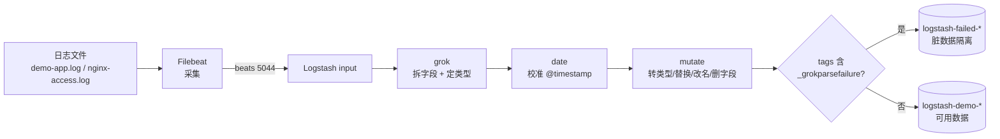

# 课 7：《Logstash 管道三件套》

> 一句话：Beats 送来的日志只是一行行文本，Logstash 用 **input / filter / output** 三段管道把它拆成结构化字段、把时间校准对。
> 阶段 3 · 第 1 课 ｜ 知识点：管道结构与事件模型 / grok 解析 / date 与 mutate
> 状态：✅ 已交付（2026-09-06）｜ 版本基线：Elastic Stack **9.5.3** ｜ 环境：macOS arm64 + Docker Compose

---

## 🎯 本课目标

学完本课，你应该能：

1. 读懂并手写一个 Logstash 配置文件：`input`（beats / file）→ `filter` → `output`（elasticsearch），三段各司其职
2. 用 grok 把一行日志拆成独立字段（内置模式 + 自定义模式 + **多模式依次尝试**），并知道解析失败时怎么兜底
3. 用 `date` 把日志里的真实时间覆盖到 `@timestamp`，用 `mutate` 做类型转换、替换、改名、删字段
4. 用 `--config.test_and_exit` 在启动前校验配置，别把错误配置跑进环境

> 配套文件：[`playground/06-logstash-pipeline/`](../../../playground/06-logstash-pipeline/)
> 回指 ES 主课：[课 11《数据管道与备份》](../../../../stages/4-分布式与工程实践/lessons/lesson-11-数据管道与备份.md) —— **grok 基础、Ingest Pipeline、`_simulate` 已在 ES 主课讲过，本课不重复基础**，只讲 Logstash 侧的完整管道与日志场景增量。

## 📌 知识点导航

| # | 知识点 | 关键点 | 状态 |
|---|--------|--------|------|
| 1 | 7.1 管道结构与事件模型 | input / filter / output 三段；event 是什么；条件分支；`-f` 与 `--config.test_and_exit` | ✅ 已完成 |
| 2 | 7.2 grok 解析（增量） | 内置 `COMMONAPACHELOG` + 自定义多模式；`%{PATTERN:field:type}`；`_grokparsefailure` 分流；**⚠️ ECS 模式会重命名内置模式的字段** | ✅ 已完成 |
| 3 | 7.3 date 与 mutate | 日志时间覆盖 `@timestamp`；时区；`convert` / `gsub` / `rename` / `remove_field` | ✅ 已完成 |

## 📖 本课在故事主线中的情节定位

故事推进到主角（一条日志）到达"**翻译官**"Logstash 的这一幕。

阶段 2 里 Beats 把主角从文件里**捕获**并运到 Logstash 门口，此刻它仍是一整段不分彼此的原文：

```text
2026-09-06 17:30:01 INFO  [order-service] 订单创建成功 orderId=50001 userId=u401 amount=299.00
```

`orderId`、`userId`、`amount` 全埋在字符串里——**没法按订单号查、没法统计金额**。

本课让 Logstash 把主角**拆解成一份看得懂的档案**：时间被校准、字段各归其位、噪音被修剪。这是阶段 3「**看得懂**」的核心一幕，也是后两课（稳得住、放对位置）的技术地基。

---

# 正文

## 🏛️ 第一幕 · 起源与场景引入

### 课 6 结尾留下的那根刺

阶段 2 收官时，日志**拿得到**了，但这一行仍然是"一坨文本"：

```text
2026-09-06 17:30:01 INFO  [order-service] 订单创建成功 orderId=50001 userId=u401 amount=299.00
```

在 ES 里，它长这样（课 4 实测过的结构）：

```json
{ "message": "2026-09-06 17:30:01 INFO  [order-service] 订单创建成功 orderId=50001 userId=u401 amount=299.00" }
```

**只有一个 `message` 字段。** 这意味着：

- 想找"订单 50001"→ 只能全文本搜索，慢且不准
- 想统计"今天总金额" → **根本做不到**（数字埋在字符串里）

### Logstash 上场

Logstash 干的事，就是把这一行**切开**：

```text
log_level = INFO
service   = order-service
action    = 订单创建成功
order_id  = 50001        ← 变成整数类型
user_id   = u401
amount    = 299.00       ← 变成浮点类型
```

切完之后，你想怎么查、怎么聚合都行了。

**它的工作方式是三段管道**：进（input）→ 加工（filter）→ 出（output）。

## ❓ 第二幕 · 认知冲突

**你以为**：配好管道，跑起来就完事。

**真相有三个，第三个最坑**：

### 真相一：`@timestamp` 默认是"Logstash 收到的时间"，不是"日志发生的时间"

Logstash 收到一条日志时，会自己盖一个时间戳——**是接收时刻**。如果你不处理，那么回溯历史日志时，所有数据都会挤在"你导入它们的那一刻"（课 3 已经在 Filebeat 侧见过同样的问题）。

### 真相二：改错配置要等两分钟才知道

Logstash 跑在 JVM 上，**启动要 1–2 分钟**。如果配置写错，你要等它启动失败、看日志、改、再启动……一轮几分钟就没了。

所以本课第一个要学的命令不是"启动"，而是 **`--config.test_and_exit`**（只校验语法，不真启动）。

### 真相三（最坑）：9.x 下内置 grok 模式给你的**不是**老教程里那些字段名

我按老教程的写法，用 `%{COMMONAPACHELOG}` 解析 nginx 日志，然后去找 `clientip` 字段——**查不到**：

```bash
curl ... '{"query":{"exists":{"field":"clientip"}}}'
# "hits":{"total":{"value":0}}     ← 0 条！
```

但它**也没有** `_grokparsefailure` 标签，说明 grok **是成功的**。那字段去哪了？

把整条 event 打出来看（Logstash 的 `stdout { codec => rubydebug }` 输出）：

```ruby
"source" => { "address" => "192.168.1.10" },
"http"   => {
    "request"  => { "method" => "GET" },
    "version"  => "1.1",
    "response" => { "status_code" => 201, "body" => { "bytes" => 1234 } }
},
"url"    => { "original" => "/api/order/create" },
"timestamp" => "06/Sep/2026:17:30:01 +0800"
```

**字段被自动改名成 ECS 标准名了。**

原因在于 Logstash 9.x 默认开启 **ECS 兼容模式**（启动日志里能看到 `pipeline.ecs_compatibility: v8`），它会把内置模式捕获的旧字段名**自动映射**为 ECS 字段：

| 老教程说的字段 | 9.5.3 实际得到的字段 | 本例的值 |
|--------------|---------------------|---------|
| `clientip` | **`source.address`** | 192.168.1.10 |
| `verb` | **`http.request.method`** | GET |
| `request` | **`url.original`** | /api/order/create |
| `httpversion` | **`http.version`** | 1.1 |
| `response` | **`http.response.status_code`** | 201 |
| `bytes` | **`http.response.body.bytes`** | 1234 |
| `timestamp` | `timestamp`（未被映射，保留原名） | 06/Sep/2026:17:30:01 +0800 |

**这个坑的杀伤力**：你照抄老教程写了 `if [bytes] > 1000 { }` 或给 `clientip` 做聚合，**不会报错，只会永远匹配不到** —— 又是静默失效。

> 📌 **记住**：9.x 里用内置 grok 模式，**先打一条 event 出来看真实字段名**，别凭教程里的名字写下游配置。

## 🔍 第三幕 · 层层揭示

---

### 知识点 7.1 · 管道结构与事件模型

**一句话定义**
Logstash 的配置文件就是 **input（数据怎么进）→ filter（怎么加工）→ output（数据往哪出）** 三段，三段之间流动的东西叫 **event（事件）**。

**直觉建立（类比）**
把它想成**快递中转站**：

| 环节 | 对应 | 干什么 |
|------|------|--------|
| 卸货口 | **input** | 接收从各处送来的包裹（Beats / 文件 / Kafka…） |
| 分拣加工区 | **filter** | 拆包、贴新单、改内容、挑出坏件——**真正的加工主力** |
| 装车口 | **output** | 发往目的地（ES / 文件 / Kafka…） |

**类比失效的边界**：真实中转站的包裹内容不会变；Logstash 的 filter 会**改变 event 的内容**（加字段、删字段、改类型）。而且中转站各区域是物理隔离的；Logstash 三段是**同一进程内的流水线**，event 依次流过。

**核心原理 · event 是什么**

> **event（人话）**：一个"装满了字段的信封"。

- 从 input 进来时，信封里只有原始内容（`message`）
- filter 往里**塞字段**（grok 解析出的）、**改字段**（mutate）、**删字段**
- output 把信封发走

**与 ES Ingest 的关键区别**（这条很重要）：

| | 改的是什么 | 位置 |
|---|-----------|------|
| **Logstash** | 改的是 **event**（这个"信封"） | 独立进程，在 ES 之外 |
| **ES Ingest Pipeline** | 改的是文档的 **`_source`** | ES 内部，写入前 |

所以 Logstash 做的加工**发生在数据进入 ES 之前**，消耗的是 Logstash 自己的 CPU。

**核心原理 · 一个最小三段配置**

```ruby
# ① input：从 Filebeat 接收
input {
  beats {
    port => 5044
  }
}

# ② filter：加工（本课的重点在后面两个知识点）
filter {
  grok { ... }
  date { ... }
  mutate { ... }
}

# ③ output：写入 ES
output {
  elasticsearch {
    hosts    => ["http://elasticsearch:9200"]
    user     => "elastic"
    password => "ELKlearn2026"
    index    => "logstash-demo-%{+YYYY.MM.dd}"
  }
  stdout { codec => rubydebug }   # 同时打印到日志，方便调试
}
```

**核心原理 · 条件分支**

filter 和 output 里都能写条件，语法跟大多数语言很像：

```ruby
filter {
  if [log][file][path] =~ "nginx-access" {
    # 只处理 nginx 日志
  } else if [log][file][path] =~ "demo-app" {
    # 只处理订单服务日志
  }
}

output {
  if "_grokparsefailure" in [tags] {
    # 解析失败的写到这里
  } else {
    # 正常的写到这里
  }
}
```

三个常用判断：

| 写法 | 含义 |
|------|------|
| `if [field] == "x"` | 字段等于某值 |
| `if [field] =~ "正则"` | 字段匹配正则 |
| `if "tag" in [tags]` | tags 数组里含某个标签 |

**核心原理 · 启动前先校验（省时间的好习惯）**

```bash
docker compose run --rm --no-deps logstash \
  logstash -f /usr/share/logstash/pipeline/logstash.conf --config.test_and_exit
```

实测输出（节选）：

```text
[WARN ] Ignoring the 'pipelines.yml' file because command line options are specified
[INFO ] Pipeline `main` is configured with `pipeline.ecs_compatibility: v8` setting.
Configuration OK
[INFO ] Using config.test_and_exit mode. Config Validation Result: OK. Exiting Logstash
```

**看到 `Configuration OK` 才放手启动。** 顺带一提，输出里那行 `ecs_compatibility: v8` 就是第二幕那个坑的根源提示。

**示例演示**：见第四幕。

**常见误区**
- ❌ **以为 input 也负责改数据** —— 只有 filter 是加工主力，input 管进、output 管出
- ❌ 改完配置直接重启 —— 先 `--config.test_and_exit`（Logstash 启动一次要 1–2 分钟）
- ❌ 用不存在的字段做条件判断 —— 不报错，直接走 else（静默失效）

**一句话记住**
**input 进、filter 加工、output 出**，中间流动的是 event；**改配置前先 `--config.test_and_exit`**。

📚 官方文档：[Logstash 参考](https://www.elastic.co/docs/reference/logstash) ｜ [Beats input 插件](https://www.elastic.co/docs/reference/logstash/plugins/plugins-inputs-beats)

---

### 知识点 7.2 · grok 解析（增量）

> ⚠️ **本课不讲 grok 基础**（`%{PATTERN}` 语法、ES Ingest 里怎么配、`_simulate` 调试）——那些在 [ES 主课 11](../../../../stages/4-分布式与工程实践/lessons/lesson-11-数据管道与备份.md) 已经学过。本课只讲**在 Logstash 完整管道里怎么用**，以及 9.x 的两个新坑。

**一句话定义**
**grok** 用一个（或一组）预定义模式去匹配日志文本，把匹配到的片段**捕获成独立字段**。

**直觉建立（类比）**
把它想成**填空题的模板**：

```text
模板：%{IP} - - [%{时间}] "%{方法} %{路径}" %{状态码} %{字节数}
原文：192.168.1.10 - - [06/Sep/2026:17:30:01 +0800] "GET /api/order/create HTTP/1.1" 201 1234
```

模板里每个 `%{...}` 就是一个空，原文填进去，每个空就有了自己的名字。

**类比失效的边界**：填空题的模板和原文长度固定对应；**grok 的 `DATA` / `GREEDYDATA` 这类模式是"能匹配多少算多少"**，配得不好会吞掉不该吞的内容。而且填空题只有一个正确答案；grok 可以配**多个模板依次尝试**。

**核心原理 · 内置模式 vs 自定义模式**

| 类型 | 什么时候用 | 例子 |
|------|-----------|------|
| **内置模式** | 常见标准格式（Apache / nginx / syslog / 时间戳…） | `%{COMMONAPACHELOG}`、`%{TIMESTAMP_ISO8601}`、`%{LOGLEVEL}`、`%{IP}` |
| **自定义模式** | 你们自己的日志格式 | `orderId=%{NUMBER:order_id:int}` |

**核心原理 · 内置模式：`%{COMMONAPACHELOG}`**

一行 nginx 访问日志：

```text
192.168.1.10 - - [06/Sep/2026:17:30:01 +0800] "GET /api/order/create HTTP/1.1" 201 1234
```

一句 `%{COMMONAPACHELOG}` 就拆完了。但如第二幕所述，**9.5.3 给你的字段名是 ECS 标准名**：

```json
{
  "source":  { "address": "192.168.1.10" },
  "http":    { "request": { "method": "GET" },
               "version": "1.1",
               "response": { "status_code": 201, "body": { "bytes": 1234 } } },
  "url":     { "original": "/api/order/create" },
  "timestamp": "06/Sep/2026:17:30:01 +0800"
}
```

**核心原理 · 自定义模式 + 多模式依次尝试**

我们的订单日志有两种形态（正常有 `amount`，异常有 `reason`）：

```text
2026-09-06 17:30:01 INFO  [order-service] 订单创建成功 orderId=50001 userId=u401 amount=299.00
2026-09-06 17:30:04 ERROR [order-service] 支付回调失败 orderId=50002 userId=u402 reason=timeout
```

**一个模式匹配不了两种**，那就写两个，grok 会**从上往下依次尝试，命中第一个就停**：

```ruby
grok {
  match => { "message" => [
    "%{TIMESTAMP_ISO8601:log_time} %{LOGLEVEL:log_level}\s+\[%{DATA:service_name}\] %{DATA:action} orderId=%{NUMBER:order_id:int} userId=%{DATA:user_id} amount=%{NUMBER:amount:float}",
    "%{TIMESTAMP_ISO8601:log_time} %{LOGLEVEL:log_level}\s+\[%{DATA:service_name}\] %{DATA:action} orderId=%{NUMBER:order_id:int} userId=%{DATA:user_id} reason=%{DATA:fail_reason}"
  ]}
}
```

**`%{PATTERN:字段名:类型}` 里的类型很关键**：

| 写法 | 效果 |
|------|------|
| `%{NUMBER:order_id}` | `order_id` 是**字符串** "50001" |
| `%{NUMBER:order_id:int}` | `order_id` 是**整数** 50001 |
| `%{NUMBER:amount:float}` | `amount` 是**浮点数** 1899.0 |

实测结果（ES 里的文档）：

```json
{
  "order_id": 50005,      ← 数字，不是字符串 ✅
  "amount": 99.5,         ← 浮点 ✅
  "log_level": "INFO",
  "action": "订单创建成功",
  "service": "order-service"
}
```

**没有类型转换的话，你后面做"金额求和"聚合会直接失败**（字符串不能求和）。

**核心原理 · 解析失败怎么办：`_grokparsefailure`**

所有模式都没匹配上 → grok 往 `tags` 里加一个 **`_grokparsefailure`** 标签，**不丢数据、不报错**。

然后你用条件分支把它分流（这是 Logstash 与 ES Ingest 的重要差异）：

| | ES Ingest Pipeline | Logstash |
|---|-------------------|----------|
| 失败处理 | `on_failure` → 可转死信索引或忽略 | 打 `_grokparsefailure` 标签 → **用条件分支分流** |
| 后果 | 通常整篇拒收或按 on_failure 走 | **数据仍在**，只是带了个标签，任你处置 |

我故意在日志里放了一条脏数据：

```text
这是一条完全不符合格式的脏数据，用来触发 grok 解析失败
```

实测它被单独送进了另一个索引：

```text
yellow open  logstash-failed-2026.09.06   1 条    ← 脏数据
yellow open  logstash-demo-2026.09.06     8 条    ← 正常数据（7 条 + 后来追加 1 条）
```

它的 tags（实测）：

```json
{ "tags": ["beats_input_codec_plain_applied", "_grokparsefailure"] }
```

**示例演示**：见第四幕。

**常见误区**
- ❌ **照抄老教程的字段名**（`clientip` / `bytes`） —— 9.x 的 ECS 模式下已被重命名为 `source.address` / `http.response.body.bytes`，引用旧名**静默失效**
- ❌ 不给捕获加类型 —— 全变字符串，后面聚合会失败
- ❌ 以为匹配不上会报错 —— 它只打标签，不报错，你得主动检查 `tags`
- ❌ 一个超复杂的正则搞定所有格式 —— 用**多模式依次尝试**更清晰、更好维护

**一句话记住**
grok 就是"**填空题模板**"：内置模式给标准格式、自定义模式给自家格式；**加 `:int`/`:float` 才有正确类型**；失败了打 `_grokparsefailure` 让你分流。

📚 官方文档：[Grok filter 插件](https://www.elastic.co/docs/reference/logstash/plugins/plugins-filters-grok)

---

### 知识点 7.3 · date 与 mutate

**一句话定义**
`date` 把日志里记录的**真实事件时间**解析出来、覆盖到 `@timestamp`；`mutate` 是**字段加工瑞士军刀**（转类型、替换、改名、增删字段）。

**直觉建立（类比）**
把它们想成**档案整理员**：

| 动作 | 对应插件 | 干什么 |
|------|---------|--------|
| 把"信上写的日期"登记为归档日期 | **`date`** | 用日志内容里的时间覆盖 `@timestamp` |
| 把"壹佰元"改成"100.00" | **`convert`** | 字符串 → 数字 |
| 统一称呼（"张三"→"张先生"） | **`gsub`** | 正则替换 |
| 给栏目改名 | **`rename`** | 改字段名 |
| 撕掉没用的附件 | **`remove_field`** | 删字段 |

**类比失效的边界**：档案整理员改错了会留下涂改痕迹；**Logstash 的改名是"原名字段消失"**——下游引用旧名会**直接扑空**（而且不报错）。

**核心原理 · date：时间校准（否则时间线全错位）**

```ruby
date {
  match    => ["log_time", "yyyy-MM-dd HH:mm:ss"]   # ① 从哪个字段取 ② 它是什么格式
  timezone => "Asia/Shanghai"                       # ③ 这个时间按哪个时区解释
  target   => "@timestamp"                          # ④ 覆盖到哪个字段
}
```

实测效果：

```text
日志内容里写的时间：  2026-09-06 17:45:01        （北京时间 +0800）
ES 里的 @timestamp ：  2026-09-06T09:45:01.000Z  （UTC，= 北京时间 17:45:01）✅
```

**如果不做这一步**，`@timestamp` 会是 Logstash 收到它的时刻——导入历史日志时，所有数据会挤在同一分钟，时间过滤和趋势图全部失真。

> 💡 **时区最容易写错**：`timezone` 说的是"**日志里那个时间的时区**"，不是"你所在的时区"。日志写的是北京时间就填 `Asia/Shanghai`，即使 Logstash 跑在 UTC 的容器里。

**核心原理 · mutate 四件套**

```ruby
mutate {
  convert      => { "[http][response][body][bytes]" => "integer" }  # 转类型
  gsub         => [ "user_id", "^u", "user-" ]                      # 替换：u405 → user-405
  rename       => { "service_name" => "service" }                   # 改字段名
  add_field    => { "processed_by" => "logstash-lesson07" }         # 加字段
  remove_field => ["log_time", "@version"]                          # 删字段
}
```

逐个实测效果（全部来自 ES 里的真实文档）：

| 插件 | 实测结果 |
|------|---------|
| `gsub` | `user_id`: `u405` → **`user-405`** ✅ |
| `rename` | `service_name` 消失，出现 `service: "order-service"` ✅ |
| `add_field` | 每条都带 `processed_by: "logstash-lesson07"` ✅ |
| `remove_field` | `log_time`、`@version` **不见了** ✅ |

**核心原理 · 一个真实踩坑：引用了被改名的字段**

我最初写的是：

```ruby
convert => { "bytes" => "integer" }      # ❌ 无效
```

因为在 ECS 模式下，`bytes` 已经被重命名成 `http.response.body.bytes` 了——**这条 convert 成了空操作：不报错，也不生效**。

改成嵌套写法才对：

```ruby
convert => { "[http][response][body][bytes]" => "integer" }    # ✅
```

**这正是骨架里那条误区的真实现场**：*"改完字段名后下游引用旧名会扑空"*。

**示例演示**：见第四幕。

**常见误区**
- ❌ **不做 date 处理** —— `@timestamp` 变成接收时间，时间线全错位
- ❌ **时区填错** —— `timezone` 是"日志时间的时区"，不是"服务器时区"
- ❌ **convert 引用了被改名的字段** —— 空操作，静默失效（本课实测案例）
- ❌ `remove_field` 删掉了下游还要用的字段 —— 删之前先确认没人引用

**一句话记住**
`date` 把**日志真实时间**盖到 `@timestamp`；`mutate` 负责转类型、替换、改名、增删字段；**改名之后，所有下游引用都要跟着改**。

📚 官方文档：[Date filter 插件](https://www.elastic.co/docs/reference/logstash/plugins/plugins-filters-date) ｜ [Mutate filter 插件](https://www.elastic.co/docs/reference/logstash/plugins/plugins-filters-mutate)

---

## 🛠️ 第四幕 · 实操验证

配套文件在 [`playground/06-logstash-pipeline/`](../../../playground/06-logstash-pipeline/)。

### 第 0 步 · 切环境（链路变了）

```bash
cd ../05-beats-family && docker compose down
cd ../06-logstash-pipeline
```

本课链路：**Filebeat → Logstash(5044) → ES**（Filebeat 不再直连 ES）。

### 第 1 步 · 起 ES 并设密码

```bash
docker compose up -d elasticsearch
# 等 healthy（40 秒）
curl -u elastic:ELKlearn2026 -X POST "http://localhost:9200/_security/user/kibana_system/_password" \
  -H 'Content-Type: application/json' -d '{"password":"KibanaSys2026"}'
```

### 第 2 步 · 先校验配置（别急着启动）

```bash
docker compose run --rm --no-deps logstash \
  logstash -f /usr/share/logstash/pipeline/logstash.conf --config.test_and_exit
```

看到 **`Configuration OK`** 再继续。

### 第 3 步 · 起全套

```bash
docker compose up -d
# 等 Logstash 就绪（实测约 20 秒出现 Pipeline started）
docker compose logs logstash | grep "Pipeline started"
```

### 第 4 步 · 看分流结果

```bash
curl -u elastic:ELKlearn2026 "http://localhost:9200/_cat/indices?v"
```

```text
yellow open  logstash-failed-2026.09.06   1 条   ← 脏数据（_grokparsefailure）
yellow open  logstash-demo-2026.09.06     8 条   ← 正常解析
```

### 第 5 步 · 看解析后的字段（本课最爽的一步）

```bash
curl -u elastic:ELKlearn2026 "http://localhost:9200/logstash-demo-2026.09.06/_search?pretty" \
  -H 'Content-Type: application/json' \
  -d '{"size":1,"query":{"match_phrase":{"message":"orderId=50005"}},"_source":{"includes":["order_id","user_id","amount","service","@timestamp","processed_by"]}}'
```

```json
{
  "order_id": 50005,                        ← :int 生效
  "user_id": "user-405",                    ← gsub 生效（原 u405）
  "amount": 99.5,                           ← :float 生效
  "service": "order-service",               ← rename 生效
  "@timestamp": "2026-09-06T09:45:01.000Z", ← date 生效（= 北京 17:45:01）
  "processed_by": "logstash-lesson07"       ← add_field 生效
}
```

### 第 6 步 · 亲手撞一次"ECS 改名"的坑

```bash
# 按老教程的字段查，什么都查不到
curl ... '{"query":{"exists":{"field":"clientip"}}}'      # → 0 条

# 用 ECS 名才查得到
curl ... '{"query":{"exists":{"field":"source.address"}}}'  # → 有数据
```

或者更直接——看 Logstash 打出来的原始 event：

```bash
docker compose logs logstash | grep -A 25 "192.168.1.10"
```

### 第 7 步 · 看解析失败的那条

```bash
curl -u elastic:ELKlearn2026 "http://localhost:9200/logstash-failed-2026.09.06/_search?pretty" \
  -H 'Content-Type: application/json' -d '{"size":1,"_source":{"includes":["message","tags"]}}'
```

```json
{
  "message": "这是一条完全不符合格式的脏数据，用来触发 grok 解析失败",
  "tags": ["beats_input_codec_plain_applied", "_grokparsefailure"]
}
```

## 🧭 第五幕 · 体系收束

### 一图收束：完整管道



### 三句话记住本课

1. **input 进、filter 加工、output 出**，event 在中间流；**改配置前先 `--config.test_and_exit`**
2. **grok 是填空题模板**：内置模式给标准格式、多模式依次尝试给自家格式；**`:int`/`:float` 才有正确类型**；失败打 `_grokparsefailure` 供你分流
3. **`date` 校准时间、`mutate` 加工字段**；⚠️ **9.x 的 ECS 模式会重命名内置模式的字段**（`clientip` → `source.address`），引用旧名静默失效

### 还有两件事没解决（引出课 8、课 9）

| 本课留下的疑问 | 在哪一课回答 |
|---------------|-------------|
| Logstash 挂了，管道里的数据会不会丢？ | **课 8《可靠性与吞吐》**（持久化队列、吞吐调优） |
| 解析到底该放 Logstash、Beats processors 还是 ES Ingest？ | **课 9《该在哪处理》**（三处对比决策表） |
| 这么多字段，命名有没有统一规范？ | 课 9（ECS 规范与脱敏） |

---

## 🐞 常见误区

| # | 误区 | 正确认知 |
|---|------|---------|
| 1 | 三段都以为是"改数据的" | **只有 filter 是加工主力**，input 管进、output 管出 |
| 2 | `@timestamp` 就是事件发生时间 | 默认是 **Logstash 接收时间**，必须用 `date` 覆盖 |
| 3 | 拿 ES Ingest 的 `on_failure` 思维硬套 Logstash | Logstash 靠 **`_grokparsefailure` 标签 + 条件分支分流** |
| 4 | 改完配置直接重启 | 先 **`--config.test_and_exit`**（Logstash 启动要 1–2 分钟） |
| 5 | **照抄老教程的 grok 字段名** | 9.x ECS 模式下 `clientip`→`source.address`、`bytes`→`http.response.body.bytes`，**引用旧名静默失效** |
| 6 | grok 捕获不加类型 | 全变字符串，后面的数值聚合直接失败 |
| 7 | 以为 grok 匹配不上会报错 | 只打标签不报错，得自己检查 `tags` |
| 8 | 时区随便填 | `timezone` 是"**日志里那个时间的时区**"，不是服务器时区 |

## 📋 命令速查卡

| 命令 | 作用 | 坑 |
|------|------|-----|
| `docker compose run --rm --no-deps logstash logstash -f <配置> --config.test_and_exit` | 校验配置语法 | `--no-deps` 避免拉起依赖；看到 `Configuration OK` 才算过 |
| `docker compose logs logstash \| grep "Pipeline started"` | 确认管道起来了 | Logstash 启动慢（JVM），别以为卡住了 |
| `docker compose logs logstash \| grep -A 25 "<关键字>"` | 看某条日志的**完整 event**（rubydebug） | 需要 output 里有 `stdout { codec => rubydebug }` |
| `docker compose restart logstash` | 改完配置后重启 | 重启要 1–2 分钟；旧数据不会重发（Filebeat registry 记着位置） |
| `curl -u elastic:<密码> "_cat/indices?v"` | 看分流出了哪些索引 | 本课会看到 `logstash-demo-*` 与 `logstash-failed-*`（后者是脏数据） |
| `curl ... '{"query":{"exists":{"field":"source.address"}}}'` | 验证某字段是否存在 | ⚠️ 查不到先怀疑**字段名被 ECS 重命名了** |

## ✅ 自检三问

<details>
<summary><b>问题 1</b>：你用 <code>%{COMMONAPACHELOG}</code> 解析 nginx 日志，查 <code>clientip</code> 字段返回 0 条，但数据明明在 ES 里、也没有 <code>_grokparsefailure</code>。发生了什么？</summary>

**grok 成功了，但在 9.x 的 ECS 兼容模式下，字段名被自动改成了 ECS 标准名。**

Logstash 9.x 默认 `pipeline.ecs_compatibility: v8`（启动时日志里能看到这行），内置 grok 模式捕获的旧字段名会被自动映射：

| 老教程的字段 | 9.5.3 的实际字段 |
|---|---|
| `clientip` | `source.address` |
| `verb` | `http.request.method` |
| `request` | `url.original` |
| `httpversion` | `http.version` |
| `response` | `http.response.status_code` |
| `bytes` | `http.response.body.bytes` |

**为什么危险**：引用旧名**不会报错**，条件判断直接为假、聚合直接为空——**静默失效**。我自己的 mutate 也栽在这上面：

```ruby
convert => { "bytes" => "integer" }                            # ❌ 空操作
convert => { "[http][response][body][bytes]" => "integer" }    # ✅ 正确
```

**怎么避免**：

1. **别凭教程写字段名** —— 配完后打一条 event 出来看真实结构：
   ```bash
   docker compose logs logstash | grep -A 25 "192.168.1.10"
   ```
   （需要 output 里有 `stdout { codec => rubydebug }`）
2. 或者在 grok 里**显式关掉 ECS 兼容**：`grok { ecs_compatibility => "disabled" ... }`，字段名就回到老样子（适合迁移老配置时过渡）
3. **推荐顺应 ECS**：用 `source.address` 这类标准名，与 Beats、ES 生态的字段天然对齐

</details>

<details>
<summary><b>问题 2</b>：为什么必须用 <code>date</code> 覆盖 <code>@timestamp</code>？不这么做会有什么后果？</summary>

**因为 `@timestamp` 默认是 Logstash 收到这条日志的时刻，不是日志里记录的事件时刻。**

两者在实时场景下差距很小，但在这些场景下会**差出天际**：

| 场景 | 后果 |
|------|------|
| **导入历史日志** | 一批三个月前的日志，全部盖上"今天 14:00"的时间戳 → 时间线完全失真 |
| **采集有延迟** | 网络抖动、队列堆积导致晚到几分钟到几小时 → 按时间排查时找不到 |
| **跨时区** | 时间被按错误时区解释 → 差 8 小时是常事 |

**后果的具体表现**：

- Kibana 的时间过滤器**筛不到**你想看的数据（它过滤的是 `@timestamp`）
- 按时间的趋势图、聚合**全部错位**
- 与同一时刻的其他日志**对不上**（无法关联排查）

**正确做法**：

```ruby
date {
  match    => ["log_time", "yyyy-MM-dd HH:mm:ss"]
  timezone => "Asia/Shanghai"     # ⚠️ 这是"日志里那个时间的时区"
  target   => "@timestamp"
}
```

**实测对照**（本课真实数据）：

```text
日志内容写的时间： 2026-09-06 17:45:01     （北京时间）
ES 里 @timestamp： 2026-09-06T09:45:01.000Z （UTC）
                  ↑ 换算回北京时间正是 17:45:01 ✅
```

**一个高频错误**：`timezone` 填的是"日志里那个时间是按哪个时区写的"，**不是 Logstash 所在机器的时区**。日志写的是北京时间，即使容器跑在 UTC，也要填 `Asia/Shanghai`。

</details>

<details>
<summary><b>问题 3</b>：一条日志解析失败了，Logstash 会怎么处理？跟 ES Ingest Pipeline 的失败处理有什么不同？</summary>

**Logstash 的做法：打标签，不丢数据。**

所有 grok 模式都没匹配上 → Logstash 往这条 event 的 `tags` 里加一个 **`_grokparsefailure`**，然后**继续往下走**（不报错、不丢弃）。

实测那条脏数据（我故意放的）：

```json
{
  "message": "这是一条完全不符合格式的脏数据，用来触发 grok 解析失败",
  "tags": ["beats_input_codec_plain_applied", "_grokparsefailure"]
}
```

**然后由你决定它去哪**——用条件分支分流：

```ruby
output {
  if "_grokparsefailure" in [tags] {
    elasticsearch { index => "logstash-failed-%{+YYYY.MM.dd}" ... }   # 脏数据隔离
  } else {
    elasticsearch { index => "logstash-demo-%{+YYYY.MM.dd}" ... }
  }
}
```

实测结果：`logstash-failed-2026.09.06`（1 条）与 `logstash-demo-2026.09.06`（8 条）**并存**。

**与 ES Ingest Pipeline 的区别**：

| | Logstash | ES Ingest Pipeline |
|---|----------|-------------------|
| 失败信号 | 加 `tags` 里的 `_grokparsefailure` | 触发 `on_failure` |
| 数据还在吗 | **在**，带着标签继续走 | 按 `on_failure` 处理（可转发死信索引，或让写入整体失败） |
| 分流方式 | 用 `if ... in [tags]` 条件分支 | 在 pipeline 定义里配 `on_failure` |
| 典型做法 | 脏数据单独存一个索引，事后可查可重处理 | 转死信索引，或忽略 |

**为什么 Logstash 这个设计更好排查**：脏数据没丢，你可以事后去 `logstash-failed-*` 里翻，看看到底是哪些格式没覆盖到——**这本身就是迭代 grok 模式的素材**。

> 💡 **实践建议**：生产上一定要做这个分流。否则解析失败的日志混在正常数据里，你既发现不了，也统计不出"我的解析覆盖率到底是多少"。

</details>

## 🚀 下一批接力提示词

> 学完本课后，**复制下面这段文字发给 AI**，即可无缝进入下一课：

```text
继续学 ELK。我的学习档案在 elasticsearch/elk/00-学习档案.md，
刚学完阶段 3《处理层 Logstash》课 7《Logstash 管道三件套》
（知识点：管道结构与事件模型 / grok 解析 / date 与 mutate），
请按大纲继续讲解下一课：课 8《可靠性与吞吐》
（知识点：持久化队列与 at-least-once / 背压与吞吐调优 / 多管道与隔离）。

要求：
- 按五幕结构 + 知识点六要素写正文，填进既有骨架文件
- 版本基线 Elastic Stack 9.5.3，命令用 macOS + Docker Compose 写法
- 每条命令必须真跑一遍再写进讲义
- 写完过事实核查闸门 + 双视角评审，P0 清零后勾选评审清单对应条目

本机现状：ES http://localhost:9200（elastic/ELKlearn2026）、Kibana http://localhost:5601，
Logstash + Filebeat 在跑，配套文件在 elasticsearch/elk/playground/06-logstash-pipeline/。
```

## 🧭 课程导航

| 上一课 | 本课 | 下一课 |
|--------|------|--------|
| [阶段 2 · 课 6 Beats 家族与采集选型](../../2-采集层Beats/lessons/lesson-06-Beats家族与采集选型.md) | **课 7 Logstash 管道三件套** | [课 8 可靠性与吞吐](lesson-08-可靠性与吞吐.md) |

- **本阶段**：[阶段 3 概览](../overview.md) ｜ **阶段路径图**：[stage-3-path.svg](../assets/stage-3-path.svg)
- **配套文件**：[`playground/06-logstash-pipeline/`](../../../playground/06-logstash-pipeline/)
- **返回目录**：[ELK 课程目录](../../../02-课程目录.md)
- **回指 ES 主课**：[课 11《数据管道与备份》](../../../../stages/4-分布式与工程实践/lessons/lesson-11-数据管道与备份.md)（grok 与 Ingest 基础）

> 📌 **本课数据来源**：2026-09-06 于 macOS arm64 / Docker Desktop 29.4.1 实测。`--config.test_and_exit` 的 `Configuration OK`、`logstash-demo-*`(8 条) 与 `logstash-failed-*`(1 条) 的分流、grok 自定义多模式与 `:int`/`:float` 类型捕获、`gsub`（u405→user-405）/`rename`/`add_field`/`remove_field` 的效果、`@timestamp` 校准为 `09:45:01Z`、以及 **`%{COMMONAPACHELOG}` 在 ECS 模式下输出 `source.address` 而非 `clientip`** 均为真实输出。
> ⚠️ 本课引用链接经 curl 验证（**需带浏览器 UA，默认 UA 会返回 404**）：Logstash 参考、grok / date / mutate / beats 插件文档均 HTTP 200。
