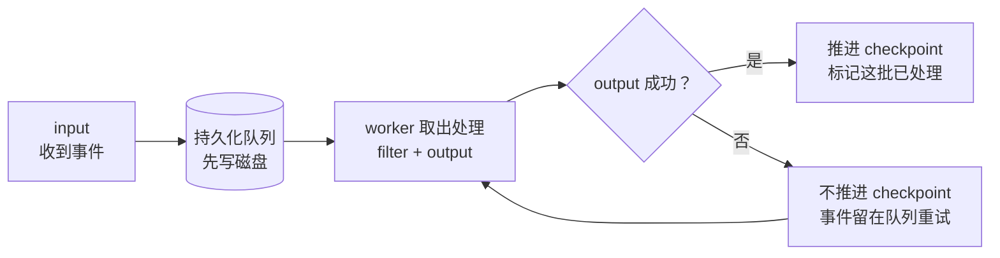
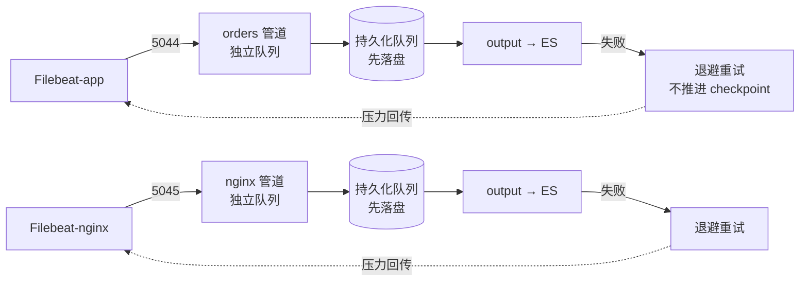

# 课 8：《可靠性与吞吐》

> 一句话：管道不是玩具——**Logstash 挂了，管道里的事件会不会丢？高峰期扛不扛得住？** 本课用持久化队列保证不丢，用批次与并发保证不堵，用多管道保证互不拖累。
> 阶段 3 · 第 2 课 ｜ 知识点：持久化队列与 at-least-once / 背压与吞吐调优 / 多管道与隔离
> 状态：✅ 已交付（2026-09-06）｜ 版本基线：Elastic Stack **9.5.3** ｜ 环境：macOS arm64 + Docker Compose

---

## 🎯 本课目标

学完本课，你应该能：

1. 说清 `queue.type: persisted` 持久化队列为什么能保证 **at-least-once**，以及它和内存队列（默认）的差别
2. 认识吞吐三兄弟 `pipeline.batch.size` / `pipeline.batch.delay` / `pipeline.workers`，并知道**背压是怎么反向传导回采集端**的
3. 用 `pipelines.yml` 拆分多条独立管道，理解**队列隔离**的意义

> 配套文件：[`playground/07-reliability/`](../../../playground/07-reliability/)（双管道 + 持久化队列 + 双 Filebeat）
> 回指：本课的"端到端不丢"与 [课 5](../../2-采集层Beats/lessons/lesson-05-模块与处理器.md) 的"ES 停机重试"是**同一条不丢链路的两个半段**。

## 📌 知识点导航

| # | 知识点 | 关键点 | 状态 |
|---|--------|--------|------|
| 1 | 8.1 持久化队列与 at-least-once | `queue.type: persisted` / checkpoint / 重启续传 / 与 Filebeat 侧串起来看"重复从哪来" | ✅ 已完成 |
| 2 | 8.2 背压与吞吐调优 | `pipeline.batch.size` / `batch.delay` / `workers` / 重试退避 / **背压反向传导** | ✅ 已完成 |
| 3 | 8.3 多管道与隔离 | `pipelines.yml` / 何时拆 / **队列隔离**的意义 | ✅ 已完成 |

## 📖 本课在故事主线中的情节定位

课 7 主角已被 Logstash 拆成"看得懂的档案"，但剧情还没完——真实世界里的管道会遭遇**断电、重启、日志突然暴涨**。

本课是阶段 3 的"**护航**"一幕：持久化队列像给每个事件先写进一个保险柜（磁盘），崩溃了也能取回来继续送；批次与并发调优让它扛得住流量高峰；多管道则是给不同日志各修一条专属通道，一条堵了不拖累另一条。

---

# 正文

## 🏛️ 第一幕 · 起源与场景引入

### 凌晨两点，两种灾难

课 7 的管道跑得好好的，直到某个凌晨：

**灾难 A**：运维要做一次 Logstash 升级，`docker compose restart logstash`——然后想起一件事：**此刻管道里正流着数据，重启的瞬间，它们去哪了？**

**灾难 B**：大促来了，日志量翻了 10 倍。Logstash 的队列越积越长，最后要么内存爆掉、要么数据在重试中被放弃。

这两个灾难指向同一个问题：**Logstash 是"把数据从 A 搬到 B"的管道，但管道本身要经得起"停电"和"洪水"。**

### 一个朴素的问题

课 5 里我们验证过 Filebeat 侧"ES 停机不丢数据"。现在问题升级了：

> **如果连 Logstash 自己也挂了，它肚子里的那些事件还在吗？**

答案取决于一个配置：`queue.type`。默认是 `memory`（内存），换成 `persisted`（持久化）之后，答案是"在"。

## ❓ 第二幕 · 认知冲突

**你以为**：Logstash 收到事件就会立刻发出去，中间没多少缓冲，挂了也没多大损失。

**真相有三个**：

### 真相一：默认的内存队列，进程一崩就清空

Logstash 默认 `queue.type: memory`。事件在 input 和 filter 之间、filter 和 output 之间，都是**存在内存里**的。进程崩溃、容器重启、OOM——**这些事件全没了**，而且不会有人告诉你。

### 真相二：配持久化队列时，会踩一个"文件只读"的坑

我一开始想用挂载文件的方式改 `logstash.yml`：

```yaml
volumes:
  - ./logstash/config/logstash.yml:/usr/share/logstash/config/logstash.yml:ro   # ❌
```

结果 Logstash 直接启动失败：

```text
error: /usr/share/logstash/config/logstash.yml: Read-only file system
```

**原因**：Logstash 启动时会把"从环境变量读到的设置"**写回** logstash.yml，只读挂载就炸了。

**正确姿势**：全局参数用**环境变量**传（下个知识点详说）。

### 真相三：output 失败时，Logstash 会"指数退避重试"，而不是立刻放弃

我实测停掉 ES 后，Logstash 的日志长这样（节选）：

```text
[ERROR] Attempted to send a bulk request but there are no living connections in the pool
        (perhaps Elasticsearch is unreachable or down?) {message: "No Available connections",
        will_retry_in_seconds: 64}
[WARN ] Attempted to resurrect connection to dead ES instance, but got an error
        {message: "Elasticsearch Unreachable: [http://elasticsearch:9200/][...ResolutionFailure]"}
```

注意 **`will_retry_in_seconds: 64`**——它在**退避重试**（第一次等几秒、失败后等更久），而不是丢了。但"重试"能撑多久、重试期间事件在哪，取决于队列类型。

## 🔍 第三幕 · 层层揭示

---

### 知识点 8.1 · 持久化队列与 at-least-once

**一句话定义**
**持久化队列（Persistent Queue, PQ）** 是 Logstash 把事件先写进磁盘、再交给下游处理的机制；基于它，Logstash 提供 **at-least-once**（至少一次）语义：**保证不丢，但不保证不重复**。

**直觉建立（类比）**
把它想成**快递分拣中心的分拣台前加了一个"暂存柜"**：

- 包裹进来先放进**带锁的柜子**（磁盘），而不是直接扔到分拣台上
- 分拣员（worker）从柜子里取包裹处理
- 处理完、确认装车了，才把柜子里的包裹**登记为"已取走"**

**类比失效的边界**：真实柜子满了会拒收新包裹；**持久化队列满了会让 input 停手**（背压），而不是丢包。另外柜子是物理的、断电也在；**内存队列就像"扔在台面上的包裹"，一断电就散落一地找不回来**。

**核心原理 · 两种队列对比**

| | `queue.type: memory`（默认） | `queue.type: persisted` |
|---|---|---|
| 事件存哪 | 内存 | **磁盘** |
| 进程崩溃 / 重启 | ❌ 事件丢失 | ✅ 从 checkpoint 续传 |
| 速度 | 快 | 略慢（有磁盘 IO） |
| 适用 | 数据丢了也无所谓的场景 | **绝大多数生产场景** |

**核心原理 · 持久化队列怎么配**

⚠️ **第一个坑**（第二幕讲过）：`queue.type` 是**全局设置**，**不能写在 pipeline 的 `.conf` 里**，只能写在 `logstash.yml` 或启动参数。而 Docker 里最干净的方式是**环境变量**：

```yaml
  logstash:
    environment:
      - queue.type=persisted      # 开启持久化队列
      - queue.max_bytes=1gb       # 队列最多占多少磁盘
```

**不要只读挂载 `logstash.yml`**——Logstash 启动时会写回设置，只读挂载直接启动失败（第二幕实测）。

**核心原理 · checkpoint 与 ack**

> **checkpoint（人话）**：磁盘上"已经安全处理到哪了"的标记。Logstash 处理完一个批次并交给 output 之后才推进 checkpoint；崩溃后从最后标记处重来。



**核心原理 · 实测：重启 Logstash，事件还在**

这是本课最核心的实验。我完整走了一遍：

```bash
# 1. 停掉 ES（让 output 失败）
docker compose stop elasticsearch

# 2. 停机期间写两条新日志
echo '...orderId=60010' >> logs/demo-app.log
echo '...orderId=60011' >> logs/demo-app.log

# 3. 重启 Logstash（关键！内存队列这一步就丢了）
docker compose restart logstash

# 4. 恢复 ES
docker compose start elasticsearch
```

最终逐条核查：

```text
orderId=60010 -> "count":1    ← 在
orderId=60011 -> "count":1    ← 在
订单索引文档总数: 5           ← 初始 3 条 + 停机期间 2 条
```

**ES 停机 + Logstash 重启，两条数据一条不丢。**

**核心原理 · 和 Filebeat 的 at-least-once 串起来**

把课 5 和本课连起来，就是完整的"端到端至少一次"：

| 环节 | 保证机制 | 学过的课 |
|------|---------|---------|
| Filebeat → Logstash | Filebeat 没收到 ack 就重发 | 课 4、课 5 |
| Logstash 内部 | 持久化队列，重启不丢 | **本课** |
| Logstash → ES | output 失败退避重试，不 ack 则重发 | **本课** |

**所以"重复从哪来"就清楚了**：任何一段"发出去了但没收到确认"（网络抖动、进程崩溃），都会导致重发。**端到端是"至少一次"，不是"精确一次"**——下游要能幂等。

> 💡 **诚实说明一个观察**：停 ES 后我查了 Logstash 队列指标，`queue.events` 显示 **0**（而非积压的正数）。这是因为事件在 output 失败后处于**重试中（in-flight）**状态，不计入"等待队列"计数。**判断是否积压，看行为结果（恢复后是否送达）比看这个瞬时指标更可靠**——本实验的最终结果（60010/60011 都 count:1）才是硬证据。

**示例演示**：见第四幕。

**常见误区**
- ❌ **以为默认就安全** —— 默认是内存队列，进程一崩就丢
- ❌ 把 `queue.type` 写进 pipeline 的 `.conf` —— 它是全局设置，只能写 logstash.yml 或环境变量
- ❌ 只读挂载 `logstash.yml` —— Logstash 启动时会写回，直接 `Read-only file system`
- ❌ 以为持久化队列 = exactly-once —— 它仍是 at-least-once，可能重复

**一句话记住**
`queue.type: persisted` 让事件**先落盘再处理**；**ack 之后才推进 checkpoint** → 所以是"至少一次"：**可能重复，绝不丢失**。

📚 官方文档：[持久化队列](https://www.elastic.co/docs/reference/logstash/persistent-queues)

---

### 知识点 8.2 · 背压与吞吐调优

**一句话定义**
**吞吐调优**是调 Logstash 的批次与并发，让单位时间处理更多事件；**背压（backpressure）**是下游处理不过来时，压力**反向传导**回上游、让整条链路减速的机制。

**直觉建立（类比）**
把管道想成**餐厅出餐**：

| 环节 | 对应 | 参数 |
|------|------|------|
| 攒几桌一起做 | **batch** | `pipeline.batch.size`（一批多少单） |
| 等多久就出菜 | **batch.delay** | `pipeline.batch.delay`（攒批最多等多久） |
| 几个厨师 | **workers** | `pipeline.workers`（几个并发处理） |

**类比失效的边界**：餐厅厨师不够会拒客（丢单）；Logstash 下游堵了会**减速**（背压）而不是丢单。但"减速"有个上限——**队列满了就会让 input 彻底停手**，那时新事件进不来。

**核心原理 · 吞吐三兄弟**

| 参数 | 默认 | 含义 | 调大/调小的影响 |
|------|------|------|----------------|
| `pipeline.batch.size` | 125 | 一个批次攒多少事件再发给 output | 调大：单次请求效率高，但失败重试代价大 |
| `pipeline.batch.delay` | 50ms | 攒批最多等多久 | 调大：延迟升高，但更省请求 |
| `pipeline.workers` | CPU 核数 | 几个 worker 并发跑 filter + output | 调大：并发高，但内存/GC 压力大 |

> ⚠️ **先想清楚再调**：这三个不是"越大越快"。`batch.size` 太大，失败一个批次要重试一大批；`workers` 太多，内存和 GC 压力上升，可能反而变慢。**先测出瓶颈在哪，再对症调**。

**核心原理 · 背压是怎么反向传导的**

我在本课实测了"ES 停机"这一端的重试日志：

```text
[ERROR] Attempted to send a bulk request but there are no living connections ...
        will_retry_in_seconds: 64          ← 指数退避：越等越久
```

把这个和课 5 的 Filebeat 行为串起来，就是完整链条：


**压力从 ES 一路传回日志文件。** 所以"日志延迟进入 ES"是背压的第一症状，不是丢数据。

**核心原理 · 怎么看指标（实测）**

Logstash 自带监控 API（默认端口 9600）。我实测两条管道的指标：

```bash
curl -s "http://localhost:9600/_node/stats"
```

```text
[nginx]  queue.type=persisted  in=3  out=3  filtered=3
[orders] queue.type=persisted  in=3  out=3  filtered=3
```

各字段含义：

| 字段 | 含义 | 判断瓶颈 |
|------|------|---------|
| `events.in` | 进了多少事件 | input 是否正常接收 |
| `events.filtered` | filter 处理了多少 | filter 是否跟得上 |
| `events.out` | output 送出多少 | output 是否畅通 |
| `queue.type` | 队列类型 | 是否开了持久化 |
| `queue.events` | 队列积压数 | **持续增长 = 下游处理不过来** |

> 📌 **判断瓶颈的口诀**：`out` 长期 < `in` → output 是瓶颈（下游慢了）；`filtered` 长期 < `in` → filter 是瓶颈（解析太重）。

**核心原理 · 吞吐参数本课的配置**

本课在环境变量里设了：

```yaml
      - pipeline.batch.size=125
      - pipeline.batch.delay=50
      - pipeline.workers=2
```

> ⏳ **诚实标注**：这几个参数**已经配置并生效**（可从监控 API 看到 pipeline 运行），但**本课没有做压测对比**（不同 batch.size / workers 下的吞吐差异）。原因是做可信的吞吐对比需要稳定的压测数据源和多次采样，本机环境难以给出有意义的数字。**"调参见效"的验证留给你在自己的数据量下用压测脚本做**——方法就是上面那句口诀 + `_node/stats` 指标。

**示例演示**：见第四幕。

**常见误区**
- ❌ **盲目调大 batch.size / workers** —— 可能徒增内存与 GC，不一定更快
- ❌ 以为背压会丢数据 —— 短期是"减速"；**长期故障 + 队列写满磁盘**才会真丢
- ❌ 不看指标瞎调 —— 先判断瓶颈在 input / filter / output 哪一段

**一句话记住**
吞吐三兄弟（batch.size / batch.delay / workers）不是越大越好；**背压 = 压力反向传导，症状是延迟变大而不是报错**。

📚 官方文档：[Logstash 性能调优](https://www.elastic.co/docs/reference/logstash/tuning-logstash) ｜ [监控 Logstash](https://www.elastic.co/docs/reference/logstash/monitoring-logstash)

---

### 知识点 8.3 · 多管道与隔离

**一句话定义**
**多管道** = 在一个 Logstash 进程里跑**多条独立管道**，每条有自己的 input、filter、output、**自己的队列**——一条挂了不拖累另一条。

**直觉建立（类比）**
把它想成**分拣中心里的多条独立传送带**：

- 传送带 A 处理订单日志，传送带 B 处理 nginx 日志
- A 堵了（比如 A 的 output 挂了），**B 照常运转**

**类比失效的边界**：真实传送带是物理隔离的；多管道在**同一个 JVM 进程**里，共享 CPU 和内存——所以"隔离"指的是**队列与故障隔离**，不是"资源隔离"。一条管道 CPU 打满，另一条也会受影响。

**核心原理 · 怎么拆**

用 `pipelines.yml`（挂载到容器内 config 目录）：

```yaml
- pipeline.id: orders
  path.config: "/usr/share/logstash/pipeline/orders.conf"

- pipeline.id: nginx
  path.config: "/usr/share/logstash/pipeline/nginx.conf"
```

两条 `.conf` 各管各的（不同 beats 端口、不同 output 索引）：

```ruby
# orders.conf                        # nginx.conf
input {  beats { port => 5044 } }    input {  beats { port => 5045 } }
output { elasticsearch {             output { elasticsearch {
  index => "ls-orders-*" }             index => "ls-nginx-*" } }
```

**核心原理 · 实测：两条管道独立运行**

我起了两个 Filebeat 分别喂给两条管道，然后查监控 API：

```text
管道数: 2
  [nginx]  queue.type=persisted  in=3  out=3  filtered=3
  [orders] queue.type=persisted  in=3  out=3  filtered=3
```

**两条管道、各自的队列、各自的事件计数**——互不影响。

**核心原理 · 什么时候该拆**

| 信号 | 该拆吗 | 原因 |
|------|--------|------|
| 不同日志输出到不同目标（不同索引 / 不同 ES 集群） | ✅ | 天然独立 |
| 某类日志的解析特别重，会拖慢其他 | ✅ | 隔离 CPU 争抢 |
| 某条 output 频繁故障，希望不影响其他数据 | ✅ | **故障隔离**（队列不共用） |
| 只是日志量大了 | ❌ | 应该先调吞吐（8.2），不是拆管道 |
| 什么都塞一条管道图省事 | ❌ | 一条 output 挂掉拖死全部 |

**核心原理 · 队列隔离的意义**

这是多管道最实在的好处：**每条管道有独立的持久化队列**。一条管道的 output 挂了、队列积压到满，**只影响它自己**；另一条照常出、照常入。

反过来说，**单管道**里所有数据挤一个队列：任何一种日志的 output 故障，都会让**所有**日志跟着积压。

**示例演示**：见第四幕。

**常见误区**
- ❌ **一个 Logstash 进程只能跑一条管道** —— `pipelines.yml` 能拆多条
- ❌ 以为"隔离"连 CPU/内存也隔离 —— 同一 JVM 进程，资源共享
- ❌ 日志量大就拆管道 —— 先判断瓶颈（8.2），拆管道解决的是**故障隔离**不是**吞吐**

**一句话记住**
多管道 = **各自独立的队列与故障域**；拆的动机是"隔离"（不同输出 / 重解析 / 易故障），不是"提速"。

📚 官方文档：[多管道](https://www.elastic.co/docs/reference/logstash/multiple-pipelines)

---

## 🛠️ 第四幕 · 实操验证

配套文件在 [`playground/07-reliability/`](../../../playground/07-reliability/)。

### 第 0 步 · 切环境

```bash
cd ../06-logstash-pipeline && docker compose down
cd ../07-reliability
```

本课环境与课 7 的差别：**持久化队列 + 双管道 + 双 Filebeat**。

### 第 1 步 · 起环境

```bash
docker compose up -d elasticsearch
# 等 healthy
curl -u elastic:ELKlearn2026 -X POST "http://localhost:9200/_security/user/kibana_system/_password" \
  -H 'Content-Type: application/json' -d '{"password":"KibanaSys2026"}'
docker compose up -d
```

### 第 2 步 · 确认持久化队列 + 双管道生效

```bash
curl -s "http://localhost:9600/_node/stats" | python3 -c "
import json,sys
d = json.load(sys.stdin)
for pid, p in d['pipelines'].items():
    print(pid, 'queue.type=', p['queue'].get('type'), 'in=', p['events']['in'], 'out=', p['events']['out'])
"
```

```text
nginx  queue.type=persisted in=3 out=3
orders queue.type=persisted in=3 out=3
```

**看到 `queue.type=persisted` 和两条管道，说明配置生效了。**

### 第 3 步 · 核心实验：停 ES + 重启 Logstash，验证不丢

```bash
# 1. 停 ES（让 output 失败）
docker compose stop elasticsearch

# 2. 停机期间写两条新日志
echo '2026-09-06 18:30:01 ERROR [order-service] 停机期间写入 orderId=60010' >> logs/demo-app.log
echo '2026-09-06 18:30:05 INFO  [order-service] 停机期间写入 orderId=60011 userId=u511 amount=88.00' >> logs/demo-app.log

# 3. 看一眼 Logstash 在干嘛（重试 + 退避）
docker compose logs --tail=10 logstash
# 会看到 will_retry_in_seconds 之类的退避重试

# 4. 重启 Logstash（关键步骤！内存队列到这里就丢了）
docker compose restart logstash

# 5. 恢复 ES
docker compose start elasticsearch
```

### 第 4 步 · 等一会儿，逐条核查

```bash
for id in 60010 60011; do
  printf "orderId=%s -> " "$id"
  curl -s -u elastic:ELKlearn2026 "http://localhost:9200/ls-orders-*/_count" \
    -H 'Content-Type: application/json' \
    -d "{\"query\":{\"match_phrase\":{\"message\":\"orderId=$id\"}}}" | grep -oE '"count":[0-9]+'
done
```

```text
orderId=60010 -> "count":1
orderId=60011 -> "count":1
```

**两条都在 —— Logstash 重启 + ES 恢复后，一条不丢。**

### 第 5 步 · 看双管道各自的数据

```bash
curl -u elastic:ELKlearn2026 "http://localhost:9200/_cat/indices/ls-*?v"
```

```text
ls-orders-2026.09.06   ← orders 管道（订单日志）
ls-nginx-2026.09.06    ← nginx 管道（nginx 日志）
```

两个索引，来自两条互相独立的管道。

## 🧭 第五幕 · 体系收束

### 一图收束：一条"可靠的管道"



### 三句话记住本课

1. **`queue.type: persisted` 让事件先落盘**，ack 之后才推进 checkpoint → 至少一次、可能重复、绝不丢失
2. **背压是压力反向传导**：ES 慢了 → Logstash 队列积压 → Filebeat 减速，症状是"延迟变大"而非"报错"
3. **多管道 = 各自独立的队列**，拆的动机是故障隔离，不是提速

### 还有一件事没解决（引出课 9）

课 7 我们用了 Logstash 的 grok 解析，但课 5 里 nginx 模块的解析是在 **ES 的 Ingest Pipeline** 做的，课 6 还提过 Beats processors 也能加工。

**同一个"解析"活，有三个地方能干。到底该放哪？** 这就是课 9《该在哪处理》要回答的问题。

---

## 🐞 常见误区

| # | 误区 | 正确认知 |
|---|------|---------|
| 1 | 持久化队列 = exactly-once | 仍是 at-least-once，可能重复不会丢 |
| 2 | 默认内存队列重启后还在 | 默认 `memory`，进程崩了事件即丢 |
| 3 | output 慢就猛加 batch.size / workers | 可能徒增内存与 GC，先判断瓶颈在哪 |
| 4 | 一个 Logstash 只能跑一条管道 | `pipelines.yml` 可拆多条并隔离队列 |
| 5 | 把 `queue.type` 写进 pipeline 的 `.conf` | 它是全局设置，只能写 logstash.yml 或环境变量 |
| 6 | 只读挂载 `logstash.yml` | Logstash 启动会写回，直接 `Read-only file system` |
| 7 | 以为背压会立刻丢数据 | 短期是延迟；**长期故障 + 队列写满磁盘**才真丢 |

## 📋 命令速查卡

| 命令 | 作用 | 坑 |
|------|------|-----|
| `docker compose up -d logstash` | 起 Logstash | ⚠️ 不要只读挂载 `logstash.yml`（会 `Read-only file system`），全局参数用环境变量 |
| `curl -s "localhost:9600/_node/stats"` | 看队列类型 / 事件计数 / 吞吐 | 字段是 JSON，用 `python3 -c` 解析更清晰 |
| `docker compose logs --tail=20 logstash` | 看 output 重试日志 | 失败重试里 `will_retry_in_seconds` 是**指数退避**的信号 |
| `docker compose stop elasticsearch` | 模拟下游故障 | 观察 Logstash 退避重试 + 队列积压 |
| `docker compose restart logstash` | 重启 Logstash | **验证持久化队列的关键步骤**；内存队列这一步就丢了 |
| `curl -u elastic:<密码> ".../ls-orders-*/_count" -d '{"query":{...}}'` | 核查某条数据是否送达 | 恢复后要**等一会儿**，事件在队列里排队刷出 |

## ✅ 自检三问

<details>
<summary><b>问题 1</b>：Logstash 默认的队列是什么？为什么"重启 Logstash 会丢数据"在默认配置下是真的？怎么修？</summary>

**默认是 `queue.type: memory`——事件存在内存里。**

**为什么重启会丢**：内存队列的事件只在 Logstash 进程的堆内存里。进程重启、容器重建、OOM 被杀，**内存清空，事件就没了**——而且没有磁盘记录可以恢复。

**怎么修**：改用持久化队列：

```yaml
environment:
  - queue.type=persisted      # 事件先写磁盘
  - queue.max_bytes=1gb       # 队列最多占多少磁盘
```

**原理**：持久化队列让事件先落盘，Logstash 处理完一批并交给 output 之后才推进 checkpoint；崩溃后从最后 checkpoint 重来，事件还在。

**本课实测验证**：停 ES（output 失败）+ 写入 2 条新日志 + **重启 Logstash** + 恢复 ES → 2 条全部送达（`count:1`），一条不丢。

**两个配套的坑**：
1. `queue.type` 是**全局设置**，不能写在 pipeline 的 `.conf` 里（只能 logstash.yml 或环境变量）
2. 不要只读挂载 `logstash.yml`——Logstash 启动时会写回设置，只读挂载直接 `Read-only file system`

</details>

<details>
<summary><b>问题 2</b>：你的 Logstash 队列监控显示 <code>events.out</code> 长期小于 <code>events.in</code>，说明什么？该先做什么？</summary>

**说明 output 是瓶颈——下游（ES）处理不过来，事件在 Logstash 侧积压。**

**先做什么（按顺序，别急着调参）：**

1. **确认是不是下游故障**：看 Logstash 日志有没有 `will_retry_in_seconds`、`Elasticsearch Unreachable` 之类的退避重试。有 → 是 ES 的问题（慢 / 挂 / 磁盘满），修 ES，不是调 Logstash
2. **看队列积压趋势**：`queue.events` 是不是持续上涨。上涨 = 下游确实跟不上
3. **判断瓶颈段**：
   - `events.out` 长期 < `events.in` → **output 瓶颈**（下游慢）
   - `events.filtered` 长期 < `events.in` → **filter 瓶颈**（解析太重）
4. **对症下药**：
   - output 瓶颈 → 看 ES 是否要扩容 / 是否该加缓冲（8.3 的 Kafka 缓冲层）
   - filter 瓶颈 → 简化解析规则 / 把重解析挪去更合适的位置（课 9 会讲）

**⚠️ 不要做的**：一上来就调大 `pipeline.batch.size` 和 `pipeline.workers`——它们不是"越大越快"，调大还可能加重内存与 GC 压力。**先定位瓶颈，再动参数。**

</details>

<details>
<summary><b>问题 3</b>：判断正误——"一个 Logstash 进程只能跑一条管道，所以要多类日志就要起多个 Logstash 实例。"</summary>

**错误。**

**一个 Logstash 进程可以跑多条独立管道**，通过 `pipelines.yml` 定义：

```yaml
- pipeline.id: orders
  path.config: "/usr/share/logstash/pipeline/orders.conf"

- pipeline.id: nginx
  path.config: "/usr/share/logstash/pipeline/nginx.conf"
```

每条管道有**自己的 input、filter、output、自己的队列**。本课实测两条管道独立运行：

```text
[nginx]  queue.type=persisted in=3 out=3
[orders] queue.type=persisted in=3 out=3
```

**多管道的真正价值是"隔离"，不是"扩容"：**

| 拆管道的理由 | 说明 |
|---|---|
| 不同输出目标 | 订单日志写 A 集群、nginx 写 B 集群 |
| 故障隔离 | 一条管道的 output 挂了，只积压它自己，不拖累别的 |
| 重解析隔离 | 某类日志解析特别重，单独一条避免抢 CPU |

**但要注意两个边界**：
1. **资源不隔离**：多条管道在**同一个 JVM 进程**里，共享 CPU 和内存。一条管道 CPU 打满，另一条也会受影响
2. **日志量大 ≠ 该拆管道**：量大应该先调吞吐（`batch.size` / `workers`）、必要时再加 Logstash 实例；拆管道解决的是**隔离**问题，不是**吞吐**问题

</details>

## 🚀 下一批接力提示词

> 学完本课后，**复制下面这段文字发给 AI**，即可无缝进入下一课：

```text
继续学 ELK。我的学习档案在 elasticsearch/elk/00-学习档案.md，
刚学完阶段 3《处理层 Logstash》课 8《可靠性与吞吐》
（知识点：持久化队列与 at-least-once / 背压与吞吐调优 / 多管道与隔离），
请按大纲继续讲解下一课：课 9《该在哪处理》（阶段 3 收官）
（知识点：Ingest Pipeline 日志配法 / 处理位置之争（决策表）/ ECS 字段规范与脱敏）。

要求：
- 按五幕结构 + 知识点六要素写正文，填进既有骨架文件
- 版本基线 Elastic Stack 9.5.3，命令用 macOS + Docker Compose 写法
- 每条命令必须真跑一遍再写进讲义
- 写完过事实核查闸门 + 双视角评审，P0 清零后勾选评审清单对应条目

本机现状：ES http://localhost:9200（elastic/ELKlearn2026）、Kibana http://localhost:5601，
双管道 Logstash + 双 Filebeat 在跑，配套文件在 elasticsearch/elk/playground/07-reliability/。
```

## 🧭 课程导航

| 上一课 | 本课 | 下一课 |
|--------|------|--------|
| [课 7 Logstash 管道三件套](lesson-07-Logstash管道三件套.md) | **课 8 可靠性与吞吐** | [课 9 该在哪处理](lesson-09-该在哪处理.md) |

- **本阶段**：[阶段 3 概览](../overview.md) ｜ **阶段路径图**：[stage-3-path.svg](../assets/stage-3-path.svg)
- **配套文件**：[`playground/07-reliability/`](../../../playground/07-reliability/)
- **返回目录**：[ELK 课程目录](../../../02-课程目录.md)
- **回指**：[课 5 输出与背压](../../2-采集层Beats/lessons/lesson-05-模块与处理器.md) ｜ [ES 主课 11《数据管道与备份》](../../../../stages/4-分布式与工程实践/lessons/lesson-11-数据管道与备份.md)

> 📌 **本课数据来源**：2026-09-06 于 macOS arm64 / Docker Desktop 29.4.1 实测。双管道独立运行与 `queue.type=persisted` 指标、`queue.max_bytes=1gb`（`max_queue_size_in_bytes=1073741824`）、ES 停机的退避重试日志（`will_retry_in_seconds: 64`）、**核心实验**（ES 停机 + 写日志 + 重启 Logstash + 恢复 ES → `60010`/`60011` 均 `count:1`，订单索引 3→5）均为真实输出。
> ⏳ **未实测**：① 内存队列 vs 持久化队列的**丢数据对照**（本课只实测了持久化队列不丢，内存队列的"会丢"是理论+官方文档依据，未做对照实验）② 吞吐三兄弟不同取值的**压测对比**（参数已配置生效，但无压测数据）③ 队列 `events` 指标显示 0 的精确语义（已在正文诚实说明，未强行解释）。
