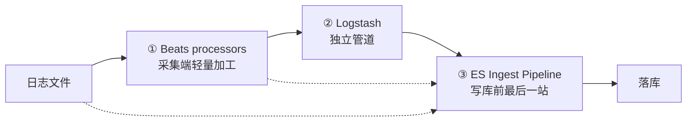
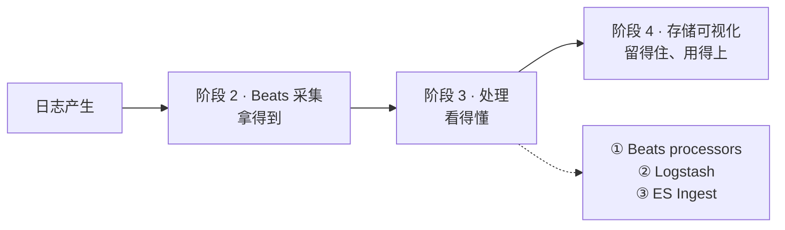

# 课 9：《该在哪处理》

> 一句话：课 7、课 8 教你在 Logstash 里处理日志，但"处理"这个重活其实有**三处**能干（Beats processors / Logstash / ES Ingest Pipeline）。本课给你一张决策表，并讲清 ECS 规范与敏感字段脱敏。
> 阶段 3 · 第 3 课 ｜ 知识点：Ingest Pipeline 日志配法 / 位置之争决策表 / ECS 字段规范与脱敏
> 状态：✅ 已交付（2026-09-07）｜ 版本基线：Elastic Stack **9.5.3** ｜ 环境：macOS arm64 + Docker Compose

---

## 🎯 本课目标

学完本课，你能——

1. 在日志场景里让 Filebeat 模块接上**自带的 ES Ingest pipeline**，查看并复用这些内置管道，用 `_simulate` 无副作用调试
2. 面对"这段日志加工放哪"时，用一张决策表在 **Beats processors / Logstash / ES Ingest** 之间做取舍（看 CPU 归属、可靠性、调试成本、可复用性、运维复杂度）
3. 理解 ECS（Elastic Common Schema）为什么要统一字段命名（`host.name` 而非 `ip`），知道常见敏感字段如何用 **fingerprint / gsub / remove** 脱敏

> 配套文件：[`playground/08-where-to-process/`](../../../playground/08-where-to-process/)（直连 ES 的两个 Filebeat + 脱敏 pipeline）
> 前置：本课复用课 8 的 `07-reliability` 栈（ES / Kibana / Logstash / 两个 Filebeat），**网络 `07-reliability_default` 由它创建**，本课只往里加 Filebeat。
> 回指：Ingest Pipeline 的处理器、`_simulate`、`on_failure` 已在 [ES 主课 11《数据管道与备份》](../../../../stages/4-分布式与工程实践/lessons/lesson-11-数据管道与备份.md) 讲过，本课不重复基础，只讲**日志场景的增量**。

## 📌 知识点导航

| # | 知识点 | 关键点 | 状态 |
|---|--------|--------|------|
| 1 | 9.1 Ingest Pipeline 在日志场景的配法 | 模块自带 pipeline 自动装载 / 查看与复用 / `_simulate` 调试 | ✅ 已完成 |
| 2 | 9.2 位置之争的决策表 | 三处取舍五维度（CPU 归属 / 可靠性 / 调试成本 / 可复用性 / 运维复杂度）→ 一张决策表 | ✅ 已完成 |
| 3 | 9.3 ECS 字段规范与脱敏 | ECS 是什么 / 字段族 / fingerprint + gsub + remove 三件套 | ✅ 已完成 |

## 📖 本课在故事主线中的情节定位

这是阶段 3 的收束一幕，也是一次"回头权衡"。前两幕已经让主角在 Logstash 里被拆好、被稳送到；但聪明的工程师会问：**既然 ES 里也有 Ingest Pipeline 能加工，Filebeat 端也有轻量处理器，那这条日志到底该在哪被加工最划算？**

本课给出一张决策表回答这个取舍，并用 ECS 与脱敏告诉主角：无论在哪处理，**字段名要遵守公共协议、敏感信息要被挡住**，才配得上进入阶段 4 的存储与可视化。

---

# 正文

## 🏛️ 第一幕 · 起源与场景引入

### 一个真实的选择困难

课 8 结束时，你手上有一套跑得好好的双管道 Logstash：`elk-filebeat-nginx` 把 nginx 访问日志送到 Logstash 的 5045 端口，被 `%{COMMONAPACHELOG}` 拆成字段，落进 `ls-nginx-2026.09.06`。

然后新同事来了，看了一眼架构图，问了个很朴素的问题：

> "我们为什么要有 Logstash？Filebeat 不是能直接写 ES 吗？我听说 ES 里有 Ingest Pipeline，能干 grok 的活。多一个 Java 组件，多一份运维，图啥？"

你正要反驳，他补了一刀：

> "而且 Filebeat 的 nginx 模块不是自带解析吗？我看文档说'开箱即用'。"

这两句话都对，也都不完整。要回答它们，得先看清一件事：**同一条日志，走在链路的不同位置被加工，代价完全不同。**

### 三处"车间"摆在面前



- **① Beats processors**：在采集端（你的业务机器上）加工，贴标签、删字段
- **② Logstash**：在独立的 Logstash 进程里加工，正则解析、富化、多输出
- **③ ES Ingest Pipeline**：ES 节点收到数据后、写进索引前，在 ES 进程里加工

本课就把这三条路**真跑一遍**，用实测数据告诉你该选哪条。

## ❓ 第二幕 · 认知冲突

### 你以为的答案，和实测的差距

**想当然 A**："Logstash 这么强，加工全给它。"

**想当然 B**："Ingest 在 ES 里，不用多部署组件，最省事，全给它。"

这两个想法各自漏算了一半账。我们一个个用实测打脸。

### 真相一：模块确实白送你一套 pipeline——但"白送"有前提

启用 nginx 模块后，Filebeat 启动时**自动**往 ES 装了一整套 Ingest Pipeline。这是我实测查到的：

```bash
curl -s -u elastic:ELKlearn2026 'http://localhost:9200/_ingest/pipeline' | python3 -c "..."
```

```text
filebeat-9.5.3-nginx-access-pipeline  <- processors: 30
```

**30 个处理器**，不是 3 个。它替你做了 grok、uri_parts、user_agent 解析、geoip 查询…… 你一行正则都没写。

但——**它默认匹配 nginx 的 combined 日志格式**。我们课 8 用的日志是 common 格式（没有 Referer 和 User-Agent），结果：

```text
event.original : 192.168.1.10 - - [06/Sep/2026:18:10:01 +0800] "GET /api/order/create HTTP/1.1" 201 1234
error          : Provided Grok expressions do not match field value: [192.168.1.10 - - ...]
字段总数(展开)  : 19
```

**解析失败，而且失败得很安静**——文档照样进库，只是多了一个 `error.message` 字段，字段数从 39 掉到 19。如果没人盯着，你会以为"模块开了，应该解析好了吧"。

### 真相二：Ingest 不免费，它吃的是 ES 节点的 CPU

这是本课最重要的一个数字。我查了 ES 节点的 ingest 统计：

```bash
curl -s -u elastic:ELKlearn2026 'http://localhost:9200/_nodes/stats/ingest?filter_path=nodes.*.ingest'
```

```text
filebeat-9.5.3-nginx-access-pipeline:
  count = 4,  time_in_millis = 98
  其中:  date 31ms / geoip 21ms / user_agent 5ms / grok 6ms
audit-mask:
  count = 9,  time_in_millis = 17
```

**4 条日志，98 毫秒**。换算一下约 25ms/条，而真正的解析（grok）只占 6ms，大头是 **geoip 21ms + date 31ms**。

这个 98ms 花在**谁身上**？花在 ES 节点上。ES 节点本来要干检索、聚合、合并段——现在它还要兼职做正则和 GeoIP 查询。日志量小的时候无所谓；**检索正忙的时候，这就是在跟你的查询抢 CPU**。

反过来，Logstash 路径的同类工作发生在 Logstash 自己的进程里，ES 节点一个 CPU 周期都不用出。

### 真相三：ES 里根本没有 `hash` 处理器

本课备课时的骨架里写着"用 fingerprint / **hash** / remove 三件套脱敏"。我照着写进 pipeline，ES 直接翻脸：

```text
{"error":{"root_cause":[{"type":"parse_exception",
  "reason":"No processor type exists with name [hash]","processor_type":"hash"}]},"status":400}
```

顺手还踩了第二个：**ES ingest 也没有 `comment` 处理器**（想在 pipeline 里写注释也不行）：

```text
"reason":"property isn't a map, but of type [java.lang.String]","processor_type":"comment"
```

> 这两个是**真踩的坑**，不是我编的。ES Ingest 有 `fingerprint`，没有 `hash`；Logstash 那边有 `fingerprint` **filter**。跨组件照搬处理器名是高频错误。

---

## 🔍 第三幕 · 层层揭示

---

### 知识点 9.1 · Ingest Pipeline 在日志场景的配法

**一句话定义**

**Ingest Pipeline** 是 ES 节点在**写入文档之前**执行的一串处理器；在日志场景里，它的最大价值是 **Filebeat 模块会把官方写好的 pipeline 自动装进 ES**，你开启模块就"白得"一整套解析逻辑。

> 🔗 **与课 5 的分工（重要）**：[课 5《模块与处理器》](../../2-采集层Beats/lessons/lesson-05-模块与处理器.md) 已经见过"模块自动装载 pipeline、日志被拆成 `event.original` / `source.ip` / `@timestamp` 变成事件时间"这个**现象**。本课不重复那个实验，而是换个角度——把它当作**三处处理位置之一**来权衡，并补上课 5 没讲的三件事：① 怎么查看 pipeline 里到底装了什么 ② 怎么用 `_simulate` 无副作用调试 ③ 怎么用 `default_pipeline` 让复用自动化。

**直觉建立（类比）**

把它想成**快递进仓库前的"验货台"**：

- 包裹（日志）到了仓库门口，不直接上架
- 先验货员（pipeline）拆包、贴标签、查地址（geoip）、登记时间
- 合格了才进货架（索引）

**类比失效的边界**：真实验货台排队不会拖慢仓库拣货；**ES 的验货台和拣货员是同一批人**——验货台越忙，拣货（检索）越慢。这是 Ingest 与 Logstash 最本质的区别。

**核心原理 · 模块自带 pipeline 是怎么来的**

Filebeat 模块的目录里，每个 fileset 都带一个 `ingest/pipeline.yml`。当 Filebeat 的 output 是 **Elasticsearch** 时，它启动时会把这些 pipeline 通过 API 装进 ES。

⚠️ **关键前提**：只有 `output.elasticsearch` 才会自动装载。我们课 8 的 Filebeat 配的是 `output.logstash`，所以 ES 里一条 pipeline 都没有——这也是为什么课 8 的 `ls-nginx-*` 里看不到模块解析的字段。

**核心原理 · 怎么查看与复用**

```bash
# 查看某个 pipeline 装了什么
curl -s -u elastic:ELKlearn2026 \
  'http://localhost:9200/_ingest/pipeline/filebeat-9.5.3-nginx-access-pipeline'
```

实测返回（节选前 12 个处理器）：

```text
description: Pipeline for parsing Nginx access logs. Requires the geoip and user_agent plugins.
processors 总数: 30
 1. set:    {"field": "event.ingested", "value": "{{_ingest.timestamp}}"}
 2. rename: {"target_field": "event.original", "field": "message"}
 3. grok:   {"patterns": ["(%{NGINX_HOST} )?\"?(?:%{NGINX_ADDRESS_LIST:nginx.access.remote_ip_list}|%{NOTSPACE:source.addr...
 4. grok:   {"field": "nginx.access.info", "patterns": ["%{WORD:http.request.method} %{DATA:_tmp.url_orig} HTTP/%{NUMBER:h...
 5. uri_parts: {"field": "_tmp.url_orig", "ignore_failure": true}
 6. set:    {"field": "url.domain", "value": "{{destination.domain}}", "if": "ctx.url?.domain == null && ..."}
 7. remove: {"field": ["nginx.access.info", "_tmp.url_orig"], "ignore_missing": true}
 8. split:  {"field": "nginx.access.remote_ip_list", "separator": "\"?,?\\s+", ...}
 ...
```

看第 2 步：**`message` 被 rename 成 `event.original`**——这就是 ECS 规范在起作用（下一节详说）。

**核心原理 · 三种"接上"pipeline 的方式**

| 方式 | 写法 | 适用 |
|------|------|------|
| 模块自动 | `filebeat.modules:` + `output.elasticsearch` | **首选**，零配置 |
| 写入时指定 | `POST /my-index/_doc?pipeline=audit-mask` | 临时、一次性 |
| 索引默认 | 索引模板里设 `index.default_pipeline` | **生产推荐**：写入方不用带参数，改不漏 |

第三种我实测过——创建模板后**故意不带 `?pipeline=`** 写入，脱敏照样生效：

```bash
# 1) 建模板，把 audit-mask 设为 default_pipeline
curl -s -u elastic:ELKlearn2026 -H 'Content-Type: application/json' \
  -X PUT 'http://localhost:9200/_index_template/audit-demo' -d '{
  "index_patterns": ["audit-demo*"],
  "template": { "settings": { "index.default_pipeline": "audit-mask" } }
}'
# -> {"acknowledged":true}

# 2) 写入时不带 ?pipeline=
curl -s -u elastic:ELKlearn2026 -H 'Content-Type: application/x-ndjson' \
  -X POST 'http://localhost:9200/_bulk' --data-binary @audit_bulk.ndjson
# -> errors: False
#    audit-1 -> created / audit-2 -> created / audit-3 -> created
```

**核心原理 · `_simulate`：改 pipeline 前先试跑，不写库**

这是本课最实用的调试手法。`_simulate` 是**只读**的，不会真的落库，可以拿真实日志行反复试。

```bash
curl -s -u elastic:ELKlearn2026 -H 'Content-Type: application/json' \
  -X POST 'http://localhost:9200/_ingest/pipeline/audit-mask/_simulate' \
  -d '{"docs":[{"_source":{"message":"<真实日志行>"}}]}'
```

实测用它抓出了本课的核心 bug（common 格式解析失败）：

```text
=== A：common 格式（无 Referer / UA） ===
  解析成功? 失败 -> Provided Grok expressions do not match field value

=== B：combined 格式（带 Referer + UA） ===
  解析成功? 成功
    source.ip                 = 192.168.1.20
    http.request.method       = GET
    url.path                  = /api/order/create
    http.response.status_code = 200
    user_agent.original       = Mozilla/5.0 (Macintosh; Intel Mac OS X 10_15_7)
    http.response.body.bytes  = 1234
```

> ⚠️ **一个模拟环境的坑**：如果 `_source` 里没给 `@timestamp`，`date` 处理器会报 `field [@timestamp] not present as part of path [@timestamp]`。这是**模拟数据缺字段**导致的，真实采集时 Filebeat 一定带 `@timestamp`，不用担心。别把它当成 pipeline 的 bug。

**示例演示 · 从"失败"到"成功"的真实闭环**

我把 combined 格式的两行追加进日志，让 Filebeat 自己 tail 进去：

```bash
printf '%s\n' '192.168.1.20 - - [07/Sep/2026:22:10:01 +0800] "GET /api/order/create HTTP/1.1" 200 1234 "-" "Mozilla/5.0 (Macintosh; Intel Mac OS X 10_15_7)"' >> logs/nginx-access.log
printf '%s\n' '192.168.1.21 - - [07/Sep/2026:22:10:05 +0800] "POST /api/pay/callback HTTP/1.1" 502 512 "https://shop.example.com" "curl/8.4.0"' >> logs/nginx-access.log
```

30 秒后再查，同一条 pipeline、同一份配置，**结果天差地别**：

| 日志行 | 格式 | 字段数 | `@timestamp` | `source.ip` | `user_agent.os.name` |
|--------|------|--------|--------------|-------------|----------------------|
| 前 3 条 | common | **19** | 13:53:29（**入库时间**） | ✗ | ✗ |
| 新 2 条 | combined | **39 / 38** | 14:10:01（**事件时间**） | 192.168.1.20 | Mac OS X |

注意 `@timestamp` 那列：解析成功的文档，`22:10:01+0800` 被正确换算成 `14:10:01Z`——**这是事件真正发生的时间**；解析失败的只能用入库时间。**日志时间错了，Kibana 上所有时间维度的分析都是错的。**

**常见误区**

| 误区 | 正确认知 |
|------|----------|
| 模块自带 pipeline 得自己手写 | 不用写，`output.elasticsearch` 时启动自动装载（实测 30 个处理器） |
| `output.logstash` 时模块也会装 pipeline | **不会**。走 Logstash 就别指望模块帮你解析 |
| 模块"开箱即用"= 什么格式都行 | 只认它预设的格式；格式不匹配会**静默失败**（文档照进，多一个 `error.message`） |
| `_simulate` 会把数据写进去 | 不会，纯内存试跑 |

**一句话记住**

> **模块 + `output.elasticsearch` = 白得 30 个处理器的解析流水线；但先拿 `_simulate` 喂一条真实日志，确认它认得你的格式。**

📚 官方文档
- [Ingest pipelines](https://www.elastic.co/guide/en/elasticsearch/reference/current/ingest.html)
- [Simulate pipeline API](https://www.elastic.co/guide/en/elasticsearch/reference/current/simulate-pipeline-api.html)
- [Filebeat modules](https://www.elastic.co/guide/en/beats/filebeat/current/filebeat-modules.html)
- [Configure Filebeat ingest node](https://www.elastic.co/guide/en/beats/filebeat/current/configuring-ingest-node.html)

---

### 知识点 9.2 · 位置之争的决策表

**一句话定义**

**位置之争**指的是：同一份日志加工逻辑，放在 Beats processors / Logstash / ES Ingest 三处的哪个位置——**选错位置不会让功能失败，但会让成本、可靠性和可维护性付出长期代价**。

**直觉建立（类比）**

把日志加工想成**洗衣服**：

| 位置 | 类比 |
|------|------|
| Beats processors | **在阳台上手洗**——只能做点简单的（摘掉标签、分个类），洗不动大件，但不用搬来搬去 |
| Logstash | **送到洗衣店**——什么都能洗，专业设备（正则 / 富化 / 多输出），但要专门跑一趟、多付一份钱 |
| ES Ingest | **让衣柜自己洗**——衣服直接扔柜子里，柜子兼职洗。省事，但柜子本来是用来放衣服（检索）的，洗得多了就顾不上给你拿衣服 |

**类比失效的边界**：洗衣店（Logstash）关门了你的衣服会堆在店里（持久化队列），不会丢；**衣柜（ES）兼职洗衣服时，洗坏了会连累放衣服的功能**——这才是真正的风险点。

**核心原理 · 五个权衡维度**

1. **CPU 归属**：这段计算的 CPU 花在谁的机器上？（业务机 / Logstash 机 / ES 节点）
2. **可靠性**：这一环挂了，数据会丢吗？有没有缓冲？
3. **调试成本**：改一版配置，多久能看到效果？能不能无副作用试跑？
4. **可复用性**：同一套加工逻辑，能被多个来源复用吗？
5. **运维复杂度**：为此要多维护几个组件 / 几份配置？

**核心原理 · 决策表（本课核心交付物）**

| 维度 | ① Beats processors | ② Logstash | ③ ES Ingest Pipeline |
|------|-------------------|------------|---------------------|
| **CPU 归属** | 业务机（采集端） | **Logstash 独立进程** | ⚠️ **ES 节点**（实测 98ms/4条） |
| **能干什么** | 轻量：增删字段、打标签、条件丢弃 | **重活全包**：grok、富化、多输出、分支路由 | 中等：grok / geoip / UA / date，支持 `_simulate` |
| **挂了会怎样** | 采集端挂，日志不进（registry 保不丢） | **持久化队列保不丢**（课 8 实测） | ES 挂了 = 写入端也没了 |
| **调试成本** | 改配置要重启 Beat | 改 `.conf` 要重启管道 | ✅ **`_simulate` 秒级、无副作用、不写库** |
| **可复用性** | 每个 Beat 配一份 | ✅ 多来源可复用同一管道 | ✅ 多来源可指向同一 pipeline |
| **运维复杂度** | 零新增组件 | ⚠️ 多一个 Java 组件（内存 + 运维） | 零新增组件 |
| **本课实测位置** | `fb-proc-*`（8 个顶层字段） | `ls-nginx-*`（grok 拆出 `source.address` 等） | `filebeat-9.5.3`（38–39 个字段） |

**核心原理 · 三条可以直接抄的结论**

1. **能用模块就用模块（Ingest）**——官方维护 30 个处理器，比你自己写正则靠谱，且零新增组件。前提是**你的日志格式匹配**（先 `_simulate`）。
2. **检索集群已经很忙 → 别再加 Ingest 重活**——实测 4 条 98ms，geoip + date 是大头。**把解析搬到 Logstash**，让 ES 只管存和查。
3. **需要多输出 / 复杂分支 / 队列缓冲 → 必须 Logstash**——Ingest 做不到"一份数据同时写 ES + Kafka + S3"，也没有持久化队列。

**示例演示 · 同台实测的三条路**

本课环境里三条路**同时**在跑，同一份 `nginx-access.log` 被三种方式处理：

```text
######## 路径 A：采集端 processors（fb-proc-*） ########
  顶层键: @timestamp, agent, ecs, host, ingestion_path, input, log, message
  message = 192.168.1.11 - - [06/Sep/2026:18:10:03 +0800] "POST /api/pay/callback HTTP/1.1" 500 512
  → 原文整条原样进 ES，没有 source.ip / http.request.method

######## 路径 B：Logstash（ls-nginx-*） ########
  source.address            = 192.168.1.10
  http.request.method       = GET
  http.response.status_code = 201
  url.original              = /api/order/create
  → grok 在 Logstash 里跑，ES 节点只管存

######## 路径 C：ES Ingest（filebeat-9.5.3） ########
  source.ip          = 192.168.1.20
  url.path           = /api/order/create
  user_agent.os.name = Mac OS X
  → grok/geoip/UA 全在 ES 节点里跑（98ms/4条）
```

三条路都"能用"，区别全在上面的决策表里。

**常见误区**

| 误区 | 正确认知 |
|------|----------|
| 加工一律丢给 Logstash | 模块 + Ingest 白送你 30 个处理器，先看看能不能白嫖 |
| Ingest "免费" | 它吃 ES 节点 CPU，检索繁忙时是实打实的代价 |
| 少一个 Java 组件总是好的 | 但代价是失去持久化队列、多输出、复杂分支能力 |

**一句话记住**

> **能用模块的白嫖（Ingest），需要队列和多输出的找 Logstash，只贴标签删字段的留在采集端；ES 已经很忙时，别再往它身上堆 pipeline。**

---

### 知识点 9.3 · ECS 字段规范与脱敏

**一句话定义**

**ECS（Elastic Common Schema）** 是一套开源的**字段命名规范**：规定大家把"客户端 IP"统一叫 `source.ip`、把"主机名"统一叫 `host.name`，而不是各叫各的 `ip`、`server_addr`。配套的**脱敏**是指在日志落库前，把密码、卡号这类敏感信息哈希掉或删掉。

**直觉建立（类比）**

ECS 就像**国际单位制**：

- 没有它之前：你量长度用"尺"，我量用"米"，他量用"步"——数字对不上，得换算
- 有了它：所有人都用米，数据能直接放一起比

**类比失效的边界**：国际单位制是**强制**的（不遵守就出错）；**ECS 不是强制约束**，你不遵守 ES 也不会报错——只是你的 Kibana 看板、告警规则、跨来源关联全部要自己重写一遍。这是"规范"和"法律"的区别。

**核心原理 · ECS 是什么（官方定义）**

> "The Elastic Common Schema (ECS) is an open source specification… ECS defines a common set of fields to be used when storing event data in Elasticsearch, such as logs and metrics."
> —— [ECS Reference](https://www.elastic.co/guide/en/ecs/current/index.html)（核查于 2026-09）

三个要点：

1. **ECS 是规范不是强制**——不遵守 ES 也照收，但你会失去跨组件统一的能力
2. **ECS 大版本与 Stack 大版本对齐**（ECS 9.5.0 已随 9.5 发布，核查于 2026-09）
3. **ECS 是"宽松模式"（permissive）**——你自己的业务字段照加，只要别跟 ECS 字段撞名

**核心原理 · 常见 ECS 字段族**

| 字段族 | 例子 | 含义 |
|--------|------|------|
| `@timestamp` | `2026-09-07T14:10:01.000Z` | 事件发生时间（**不是**入库时间） |
| `host.*` | `host.name` | 主机 |
| `source.*` | `source.ip`、`source.address` | 请求发起方 |
| `destination.*` | `destination.ip` | 请求目标方 |
| `user.*` | `user.name` | 用户 |
| `http.*` | `http.request.method`、`http.response.status_code` | HTTP 请求响应 |
| `url.*` | `url.path`、`url.domain` | URL |
| `event.*` | `event.dataset`、`event.action`、`event.outcome` | 事件元数据 |
| `log.*` | `log.level` | 日志级别 |

回看知识点 9.1 的 pipeline 第 2 步——`message` 被 rename 成 `event.original`，**这就是 ECS 在起作用**：ES 生态约定"原始报文"就叫 `event.original`。

**核心原理 · 脱敏三件套**

⚠️ 先说踩坑：ES Ingest **没有** `hash` 处理器（第二幕实测）。真正可用的是这三样：

| 手法 | 干什么 | 保留什么能力 | 适用 |
|------|--------|-------------|------|
| **fingerprint** | 把字段值哈希成稳定指纹 | ✅ 可去重、可统计 UV（同一值永远同一哈希） | IP、用户 ID |
| **gsub** | 正则替换，打码 | ✅ 保留部分原文（如卡号后四位） | 卡号、手机号 |
| **remove** | 整个字段删掉 | ❌ 什么都不留 | 密码、token |

**示例演示 · 一条真实的脱敏 pipeline**

配套文件 [`pipeline-audit-mask.json`](../../../playground/08-where-to-process/pipeline-audit-mask.json)（本课实测通过版）：

```json
{
  "description": "课 9 · 审计日志脱敏：ECS 归一化 + 敏感字段三件套",
  "processors": [
    { "grok": { "field": "message", "patterns": [
      "%{TIMESTAMP_ISO8601:log_time} %{LOGLEVEL:log.level}\\s+\\[%{DATA:service.name}\\] user=%{NOTSPACE:user.name} ip=%{IP:source.ip} password=%{NOTSPACE:_tmp.password} card=%{NOTSPACE:_tmp.card} action=%{NOTSPACE:event.action} result=%{NOTSPACE:event.outcome}"
    ]}},
    { "date": { "field": "log_time", "formats": ["ISO8601"], "target_field": "@timestamp" } },
    { "fingerprint": { "fields": ["source.ip"], "target_field": "source.ip_hash",
                       "method": "SHA-256", "salt": "elk-course-2026" } },
    { "remove": { "field": "source.ip", "ignore_missing": true } },
    { "gsub": { "field": "_tmp.card", "pattern": "\\d(?=\\d{4})", "replacement": "*" } },
    { "rename": { "field": "_tmp.card", "target_field": "card.masked" } },
    { "remove": { "field": "_tmp.password", "ignore_missing": true } },
    { "remove": { "field": "message", "ignore_missing": true } },
    { "remove": { "field": "log_time", "ignore_missing": true } },
    { "remove": { "field": "_tmp", "ignore_missing": true } }
  ]
}
```

四个设计点值得单独说：

1. **`salt` 必须配**——没有盐的哈希可以被彩虹表反推（IP 空间小，尤其危险）
2. **`\\d(?=\\d{4})` 是正向预查**——只替换"后面还有 ≥4 位数字"的数字，于是 `4111111111111111` → `************1111`，保留后四位
3. **删 `message` 是关键**——不删的话，脱敏后的文档旁边还躺着一行**未脱敏的原文**，等于白做
4. **末尾清 `_tmp`**——否则会留一个空的 `_tmp: {}`

**示例演示 · 落库后的真实结果**

```text
audit-1 {"@timestamp":"2026-09-07T13:00:01.000Z","log":{"level":"INFO"},
         "service":{"name":"auth"},
         "source":{"ip_hash":"tAXpa3Yyu/U1xlkTQKB97f0viXXHefY8lgMTLSHOp08="},
         "event":{"action":"login","outcome":"ok"},
         "user":{"name":"alice"},"card":{"masked":"************1111"}}

audit-2 {"@timestamp":"2026-09-07T13:00:03.000Z","log":{"level":"WARN"},
         "source":{"ip_hash":"93BxKeQgXPwNF+TqJT8ckoexf58ulYf+C7oCIA5Xhb0="},
         "event":{"action":"pay","outcome":"fail"},
         "user":{"name":"bob"},"card":{"masked":"************5559"}}

audit-3 {"@timestamp":"2026-09-07T13:00:07.000Z","log":{"level":"INFO"},
         "source":{"ip_hash":"tAXpa3Yyu/U1xlkTQKB97f0viXXHefY8lgMTLSHOp08="},
         "event":{"action":"pay","outcome":"ok"},
         "user":{"name":"alice"},"card":{"masked":"************1111"}}
```

三个结论，逐个都是实测的：

- **密码、卡号原文、IP 原文：全部消失**（脚本逐字段比对，均为 `残留: False`）
- **audit-1 和 audit-3 的 `ip_hash` 完全相同**（都是 alice 的 10.0.0.5）→ 证明 fingerprint **稳定**，还能做 UV 统计
- **audit-2 的哈希不同**（bob 的 10.0.0.6）→ 证明哈希**有区分度**

**常见误区**

| 误区 | 正确认知 |
|------|----------|
| 把 ECS 当强制要求 | 它是规范不是约束，不遵守 ES 也收，但失去跨组件统一能力 |
| `remove` 删了敏感字段就安全了 | **必须检查 `message` / `event.original`**——那里还有一份未脱敏的原文 |
| 哈希不需要加盐 | 必须加 `salt`，否则 IP 这种小值域可被彩虹表反推 |
| `ecs.version` 是组件版本 | ❌ 它是**数据遵循的 ECS 规范版本**。实测：同为 Filebeat 9.5.3，模块路径写出 `1.12.0`，普通 filestream 写出 `8.0.0` |

**一句话记住**

> **ECS 是"公共协议"不是"强制法律"——遵守它才能白嫖 Kibana 看板与跨源关联；脱敏要 fingerprint + gsub + remove 三件套，并记住把 `message` 原文一起删掉。**

📚 官方文档
- [Elastic Common Schema (ECS) Reference](https://www.elastic.co/guide/en/ecs/current/index.html)
- [Fingerprint processor](https://www.elastic.co/guide/en/elasticsearch/reference/current/fingerprint-processor.html)

---

## 🛠️ 第四幕 · 实操验证

> 以下每一步都在本机真跑过，输出是真实粘贴。请先确认课 8 的栈还活着。

### 步骤 0：确认前置环境

```bash
export PATH="/usr/local/bin:$PATH"     # macOS 上 docker 可能不在默认 PATH
cd elasticsearch/elk/playground/07-reliability && docker compose ps
```

```text
NAME                 STATUS
elk-es               Up 25 hours (healthy)
elk-filebeat-app     Up 25 hours
elk-filebeat-nginx   Up 25 hours
elk-kibana           Up 25 hours
elk-logstash         Up 25 hours
```

### 步骤 1：启动本课的直连 Filebeat

```bash
cd ../08-where-to-process && docker compose up -d
sleep 25    # 等 Filebeat 装载 pipeline
```

### 步骤 2：验证模块 pipeline 被自动装载

```bash
curl -s -u elastic:ELKlearn2026 'http://localhost:9200/_ingest/pipeline' \
  | python3 -c "import sys,json; d=json.load(sys.stdin); \
    [print(k,'<- processors:',len(v.get('processors',[]))) for k,v in d.items() if 'filebeat' in k]"
```

```text
filebeat-9.5.3-nginx-access-pipeline <- processors: 30
```

### 步骤 3：用 `_simulate` 验证格式是否匹配（本课关键动作）

```bash
curl -s -u elastic:ELKlearn2026 -H 'Content-Type: application/json' \
  -X POST 'http://localhost:9200/_ingest/pipeline/filebeat-9.5.3-nginx-access-pipeline/_simulate' \
  -d '{"docs":[{"_source":{"message":"192.168.1.20 - - [07/Sep/2026:22:10:01 +0800] \"GET /api/order/create HTTP/1.1\" 200 1234 \"-\" \"Mozilla/5.0 (Macintosh; Intel Mac OS X 10_15_7)\""}}]}'
```

成功时能看到 `source.ip` / `http.request.method` / `url.path` / `user_agent.original` 被拆出来；
若换成不带 UA 的 common 格式，则返回 `Provided Grok expressions do not match field value`。

### 步骤 4：看 CPU 归属（决策表的证据）

```bash
curl -s -u elastic:ELKlearn2026 \
  'http://localhost:9200/_nodes/stats/ingest?filter_path=nodes.*.ingest.total'
```

```text
{"nodes":{"<id>":{"ingest":{"total":{"count":11,"time_in_millis":96,...}}}}}
```

再单独看 nginx pipeline：`count=4, time_in_millis=98`（geoip 21ms + date 31ms 是大头）。

### 步骤 5：建脱敏 pipeline 并验证

```bash
# 5.1 装载
curl -s -u elastic:ELKlearn2026 -H 'Content-Type: application/json' \
  -X PUT 'http://localhost:9200/_ingest/pipeline/audit-mask' \
  -d @pipeline-audit-mask.json
# -> {"acknowledged":true}

# 5.2 设为索引默认 pipeline（写入时不用带 ?pipeline=）
curl -s -u elastic:ELKlearn2026 -H 'Content-Type: application/json' \
  -X PUT 'http://localhost:9200/_index_template/audit-demo' -d '{
  "index_patterns": ["audit-demo*"],
  "template": { "settings": { "index.default_pipeline": "audit-mask" } }
}'

# 5.3 批量写入 3 条审计日志
curl -s -u elastic:ELKlearn2026 -H 'Content-Type: application/x-ndjson' \
  -X POST 'http://localhost:9200/_bulk' --data-binary @audit_bulk.ndjson

# 5.4 查落库结果
curl -s -u elastic:ELKlearn2026 'http://localhost:9200/audit-demo-*/_search?size=10'
```

验收三条：① 密码/卡号/IP 原文查不到 ② audit-1 与 audit-3 的 `ip_hash` 相同 ③ 文档里没有 `message` 字段。

### 步骤 6（可选）：清场

```bash
docker compose down
```

> 会删掉 `elk-filebeat-direct` / `elk-filebeat-proc` 两个容器；ES、Kibana、Logstash 属于 07 栈，不受影响。

---

## 🧭 第五幕 · 体系收束

### 阶段 3 全貌：主角现在是什么样

| 课 | 主角的变化 |
|----|-----------|
| 课 7 | 在 Logstash 里被 grok/date/mutate **拆成结构化档案** |
| 课 8 | 有了持久化队列和独立管道，**断电不丢、高峰不堵、互不拖累** |
| **课 9** | **字段名符合 ECS 公共协议、敏感信息被拦下**，并知道"这段加工放哪最划算" |

现在主角是一条**结构合规、经过脱敏、处理位置经过权衡**的档案，可以交付给阶段 4 了。

### 阶段 3 在整条链路中的位置



### 阶段 3 的一句话总结

> **处理层的全部工作，就是回答三个问题：怎么拆（课 7）、怎么保证不丢不堵（课 8）、在哪拆最划算（课 9）。**

### 给阶段 4 埋的伏笔

主角现在字段都是 ECS 标准了——`source.ip`、`http.response.status_code`、`user.name`、`@timestamp`。
阶段 4 第一课（课 10《日志的存储策略》）会告诉你：**正因为字段统一了，data stream 和 ILM 才能按统一规则滚动和冷热分层**；课 11 里，Kibana 的 Discover 和 Lens 也是直接认这些 ECS 字段的。**ECS 不是约束，是给下游所有环节发的通行证。**

---

## 🐞 常见误区

| # | 误区 | 正确认知（本课实测） |
|---|------|---------------------|
| 1 | 日志加工一律丢给 Logstash | 模块 + Ingest 白送 30 个处理器，先按决策表权衡 |
| 2 | Ingest 在 ES 里"免费" | 吃 ES 节点 CPU，**实测 4 条 98ms**（geoip+date 是大头） |
| 3 | 字段名随便起 | ECS 是跨组件统一的公共协议，不遵守就失去统一能力 |
| 4 | `remove` 删了敏感字段就万事大吉 | **`message`/`event.original` 里还有一份原文**，必须一起删 |
| 5 | ES Ingest 有 `hash` 处理器 | ❌ **没有**，实测 `No processor type exists with name [hash]`，只有 `fingerprint` |
| 6 | 模块"开箱即用"= 什么格式都行 | 只认预设格式，不匹配会**静默失败**（文档照进，多 `error.message`） |
| 7 | `ecs.version` 是组件版本 | 它是数据遵循的 ECS 规范版本（实测 9.5.3 的 Filebeat 会写出 `1.12.0` 或 `8.0.0`） |

## 📋 命令速查卡

| 目的 | 命令 | 坑 |
|------|------|-----|
| 列出所有 pipeline | `curl -u elastic:ELKlearn2026 'localhost:9200/_ingest/pipeline'` | `filter_path=*.id` **取不到名字**（pipeline 无 `id` 字段），用 python 取 key |
| 看某个 pipeline | `GET /_ingest/pipeline/<name>` | 名字格式 `filebeat-9.5.3-nginx-access-pipeline` |
| 试跑（不写库） | `POST /_ingest/pipeline/<name>/_simulate -d '{"docs":[...]}'` | 源里没 `@timestamp` 会误报 `field [@timestamp] not present` |
| 创建 pipeline | `PUT /_ingest/pipeline/<name> -d @file.json` | ⚠️ **没有 `hash`、没有 `comment` 处理器** |
| 设为索引默认 | 模板里 `"settings": {"index.default_pipeline": "<name>"}` | 写入时就不必带 `?pipeline=` |
| 临时指定 | `POST /idx/_doc?pipeline=<name>` | 只对这一次请求生效 |
| 看 CPU 归属 | `GET /_nodes/stats/ingest?filter_path=nodes.*.ingest` | `time_in_millis` 就是 ES 节点付出的 CPU |
| 打码卡号 | `gsub` + `pattern: "\\d(?=\\d{4})"` | JSON 里反斜杠要双写 |
| IP 脱敏 | `fingerprint` + **salt** + 再 `remove` 原字段 | 哈希目标名不能是 `source.ip.hash`（会与原字段冲突），用 `source.ip_hash` |

## 🚀 下一批接力提示词

> 学完本课后，**复制下面这段文字发给 AI**，即可无缝进入下一批（无需重新描述上下文）：

```
继续学 ELK。我的学习档案在 elasticsearch/elk/00-学习档案.md，
刚学完阶段 3《处理层 Logstash》课 9《该在哪处理》
（知识点：Ingest Pipeline 日志配法 / 处理位置之争决策表 / ECS 字段规范与脱敏），
阶段 3 已收官，请按大纲继续讲解阶段 4《存储可视化与落地》的课 10《日志的存储策略》。
```

## 🧭 课程导航

| 上一课 | 本课 | 下一课 |
|--------|------|--------|
| [课8 可靠性与吞吐](lesson-08-可靠性与吞吐.md) | **课9 该在哪处理** | [课10 日志的存储策略](../../4-存储可视化与落地/lessons/lesson-10-日志的存储策略.md)（骨架） |

| 返回阶段 | 返回课程目录 | 返回教程总览 |
|----------|--------------|--------------|
| [阶段 3 概览](../overview.md) | [02-课程目录](../../../02-课程目录.md) | [01-学习路径总览](../../../01-学习路径总览.md) |
