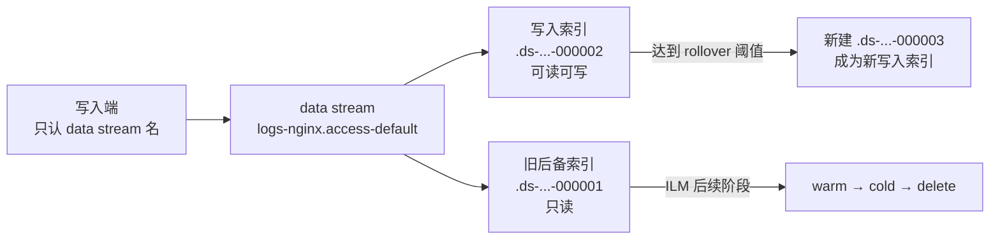
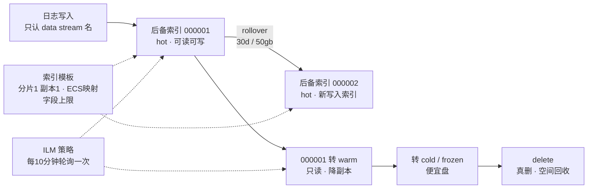

# 课 10：《日志的存储策略》

> 一句话：日志到手之后，怎么把它**存得下、留得住、自动分龄、到点该删就删**，还不用人天天手工折腾索引。
> 阶段 4 · 第 1 课 ｜ 知识点：data stream 日志配法 / ILM 滚动与冷热 / 模板配法与字段爆炸
> 状态：✅ 已交付（2026-09-07）｜ 版本基线：Elastic Stack **9.5.3** ｜ 环境：macOS arm64 + Docker Compose

---

## 🎯 本课目标

学完本课，你能——

1. 说清一条日志默认落进哪个 **data stream**、命名规则长什么样、由谁自动建后备索引与写入别名，并把写入端"只要认 data stream 名"这件事讲明白
2. 给日志配一套 **ILM 生命周期**，让它按容量/年龄自动滚动、按 hot→warm→cold→frozen→delete 分龄流转，并解释 data tier 与 `index.routing.allocation.include._tier_preference` 的协作方式
3. 用 **component template** 拆分 settings 与 mappings、套上 ECS 字段映射，并基于日志场景给出**分片与副本**的合理取舍；更重要的是——**知道字段爆炸怎么防**

> 配套文件：[`playground/09-storage-strategy/`](../../../playground/09-storage-strategy/)（ILM 策略 / 索引模板 / 字段爆炸演示）
> 本课是**纯 ES API 实验**，不需要新起容器，复用课 8 / 课 9 的 ES 即可（如果 ES 不在跑，先 `cd ../../playground/07-reliability && docker compose up -d`）。
> 回指：Data Stream / ILM / 索引模板的**基础概念**已在 [ES 主课 13《三大主战场》](../../../../stages/5-生产与选型/lessons/lesson-13-三大主战场.md) 与 [ES 主课 15《索引管理与生命周期策略》](../../../../stages/4-分布式与工程实践/lessons/lesson-15-索引管理与生命周期策略.md) 讲过。本课**只讲「日志场景」下的具体配法与增量**。

## 📌 知识点导航

| # | 知识点 | 关键点 | 状态 |
|---|--------|--------|------|
| 1 | 10.1 data stream 在日志场景 | Filebeat 默认写 data stream；`logs-<dataset>-<namespace>` 命名；后备索引与写入别名自动管理 | ✅ 已完成 |
| 2 | 10.2 ILM 滚动与冷热 | rollover 触发（`max_docs` / `max_age` / `max_primary_shard_size`）；hot→warm→cold→frozen→delete；data tier 与 `_tier_preference` | ✅ 已完成 |
| 3 | 10.3 模板配法与字段爆炸 | component template 拆分；ECS 映射；分片副本取舍；**字段爆炸与动态模板限制** | ✅ 已完成 |

## 📖 本课在故事主线中的情节定位

故事推进到**第 4 幕的开场**：主角（一条日志）已经被 Beats 采到手、被 Logstash / Ingest 拆成了结构化字段，此刻正站在 ES 的门口——但**它该住进哪间房、住多久、什么时候被请走**，还没有规矩。

本课就是给主角定「入住章程」：data stream 决定它住进哪间"自动续房"的房（后备索引），ILM 决定这间房多久退租、分龄转冷、到期清退，模板则保证每一间新房的格局（settings / mappings）都一模一样。**本课解决的是「留得住」的前半段——先把装日志的柜子设计对。**

---

# 正文

## 🏛️ 第一幕 · 起源与场景引入

### 一个"三个月后集群卡死"的经典剧本

想象一个再常见不过的开头：

第 1 个月，你建了个索引叫 `app-log`，Filebeat 往里写。**一切正常。**

第 3 个月，这个索引涨到 **800GB、3000 多个字段**。然后：

- 查询越来越慢——每次检索都要扫一个巨大的索引
- 想删 3 个月前的数据？**删不掉**。ES 里没有"按时间删一部分"这种操作，你只能 `DELETE app-log` 全删，或者写个脚本按 `@timestamp` 慢慢 `delete_by_query`（又慢又会产生大量段合并）
- 想给旧数据换个便宜盘？**换不了**。索引是一个整体，分片位置在写入时就定了
- 最要命的是：某个服务突然开始往日志里塞了一个新字段，一周内 mapping 涨到几千个字段，**集群元数据膨胀，master 节点开始卡**

这四个问题，根源是同一个：**你把所有日志写进了一个"无限膨胀的单体索引"。**

### 日志和你的业务数据，存储逻辑根本不同

| | 业务数据（订单、用户） | 日志 |
|---|---|---|
| 会不会改 | 会改 | **从不改**（写完就是历史） |
| 价值随时间 | 一直有价值 | **越老越不值钱**，30 天前的基本没人看 |
| 量级 | 可控 | **持续灌入，只增不减** |
| 典型操作 | 按 id 查、更新 | **按时间范围查最近的数据** |

日志是典型的**时序数据（time series data）**：只追加、按时间查询、越老越冷。用"一个大索引"来装时序数据，就像把流水账记在一本无限厚的本子上——写到后面，翻都翻不动。

ES 给出的答案是三件套：**data stream（自动换本子）+ ILM（自动归档销毁）+ 模板（每本新本子格式统一）**。

## ❓ 第二幕 · 认知冲突

### 真相一：Filebeat 默认给你的 ILM，其实只做了一半

你可能会想："Filebeat 默认不就配好 ILM 了吗？它自带策略的。"

是的，但让我们看看它自带的到底是什么。这是我在本机查到的真实策略：

```bash
curl -s -u elastic:ELKlearn2026 'http://localhost:9200/_ilm/policy/filebeat'
```

```json
{
  "phases": {
    "hot": {
      "min_age": "0ms",
      "actions": {
        "rollover": { "max_age": "30d", "max_primary_shard_size": "50gb" }
      }
    }
  }
}
```

**只有 hot 一个阶段，没有 delete。**

这意味着什么？日志每 30 天（或主分片到 50GB）**自动换一个新后备索引**——但它**永远不会自动删除**。

> **你的日志会一直滚、一直存，直到磁盘满。** 默认的 `filebeat` 策略只负责"换本子"，不负责"扔本子"。

更扎心的是 `max_primary_shard_size: 50gb`——这是给**生产级大流量**设计的默认值。在日均几 GB 的小集群上，这个阈值可能一年都碰不到，于是你的 data stream 一年只有一个后备索引，等于没滚。

### 真相二：同样是 data stream，有没有"挂上" ILM 天差地别

这是我本机上**四个 data stream 的真实现状**：

| data stream | 匹配模板 | ILM 策略 | 会滚动吗 | 会删除吗 |
|-------------|----------|----------|---------|---------|
| `filebeat-9.5.3` | `filebeat-9.5.3` | `filebeat` | ✅ 30d/50gb | ❌ **永不删除** |
| `logs-nginx.access-default` | `logs` | `logs` | ✅ 30d/50gb | ❌ **永不删除** |
| `fb-proc-2026.09.07` | `fb-proc` | **（无）** | ❌ **永不滚动** | ❌ 永不删除 |
| `audit-demo-2026.09.07` | `audit-demo` | （无） | ❌ 永不滚动 | ❌ 永不删除 |

第三行 `fb-proc-2026.09.07` 是**课 9 我自己建的**——当时为了对比三条处理路径，我在 Filebeat 里配了自定义索引名 `fb-proc-%{+yyyy.MM.dd}`，结果它虽然也进了 data stream，但**模板是我建的、没有挂 ILM**，于是它成了一本永远写不完的本子。

> **这就是本课要防的事**：你以为"用了 Filebeat 就自动有生命周期管理了"，其实只有走默认配置才有；一旦自定义索引名/模板，ILM 就不会自动跟上。

### 真相三：ILM 不是实时的，它每 10 分钟才看一眼

这是新手最容易崩溃的点：配好策略、灌够数据，**等了半天什么都没发生**。

原因在官方文档写得很清楚：

> `indices.lifecycle.poll_interval`（Dynamic, time unit value）How often index lifecycle management checks for indices that meet policy criteria. **Defaults to 10m**.
> —— [ILM settings](https://www.elastic.co/guide/en/elasticsearch/reference/current/ilm-settings.html)（核查于 2026-09）

我在实验里把它临时改成 10s，rollover 才在几十秒内出现。**这不是策略配错了，是 ILM 还没到轮询时间。**

---

## 🔍 第三幕 · 层层揭示

---

### 知识点 10.1 · data stream 在日志场景

**一句话定义**

**Data stream（数据流）** 是一层"自动换本子"的抽象：你永远只往一个名字（如 `filebeat-9.5.3`）写，ES 在背后自动创建并管理一串**后备索引（backing index）**，只有一个是"当前写入的"。

**直觉建立（类比）**

把它想成**酒店的"长包房"**：

- 你跟前台说"我住 1001 房"——**你永远只认这个房号**（写入端只认 data stream 名）
- 但 1001 住满 30 天，前台会**悄悄给你换到 1002**，再把 1001 封起来只读
- 你完全不用知道换过房，报 1001 就能找到你（查询时 data stream 名 = 所有后备索引的合集）

**类比失效的边界**：真酒店换房要你搬行李；**data stream 换后备索引对写入端完全透明**，而且旧房间不会被清空，只是不再接受新写入。

**核心原理 · 命名规则**

Data stream 的命名约定是三段式：

```
<type>-<dataset>-<namespace>
  │        │          │
  │        │          └─ 命名空间：default / prod / dev（用来隔离环境）
  │        └──────────── 数据集：nginx.access / system.syslog
  └───────────────────── 类型：logs / metrics / traces / synthetics
```

⚠️ **但这里有个坑**：这个三段式是**现代约定**（Fleet / Elastic Agent / integrations 用），而**独立 Filebeat 的默认 data stream 名是 `filebeat-9.5.3`**——不带 dataset、不带 namespace，是个"扁平"的老式名字。

两种都存在，我实测过：

```bash
# 老式（Filebeat 默认）：一个 data stream 装所有来源，靠 event.dataset 字段区分
filebeat-9.5.3                  → 模板 filebeat-9.5.3，ILM filebeat

# 现代（三段式）：按 dataset 拆成独立 data stream
logs-nginx.access-default       → 模板 logs，ILM logs
```

**现代命名为什么更好**：名字本身带上了来源和环境，模板匹配（`logs-*-*`）、ILM 策略、权限隔离都能**按名字批量生效**，而不用去读文档里的 `event.dataset` 字段。

**示例演示 · 亲手建一个三段式 data stream**

```bash
curl -s -u elastic:ELKlearn2026 -H 'Content-Type: application/json' \
  -X POST 'http://localhost:9200/logs-nginx.access-default/_doc' -d '{
  "@timestamp":"2026-09-07T22:30:00Z","message":"GET /api/health 200",
  "log.level":"INFO","host.name":"demo"
}'
```

```json
{"_index":".ds-logs-nginx.access-default-2026.09.07-000001","result":"created", ...}
```

注意返回的 `_index`——**你写的是 `logs-nginx.access-default`，实际落进去的是 `.ds-logs-nginx.access-default-2026.09.07-000001`**。这个 `.ds-` 前缀 + 6 位序号的后备索引，是 ES 自动建、自动管的，你不用（也不该）手动建。

再查它的归属：

```text
  名称        : logs-nginx.access-default
  generation  : 1
  后备索引    : ['.ds-logs-nginx.access-default-2026.09.07-000001']
  匹配模板    : logs          ← 由 index_patterns "logs-*-*" 匹配到
  ILM 策略    : logs          ← 模板里带的生命周期策略
```

**一个写入动作，模板和 ILM 全部自动挂上了。** 这就是"配置即约定"的力量。

**核心原理 · rollover 到底做了什么**



**generation（代数）** 就是"换过几次本子"的计数。我实测手动触发了一次 rollover：

```bash
curl -s -u elastic:ELKlearn2026 -X POST \
  'http://localhost:9200/logs-nginx.access-default/_rollover'
```

```text
  旧索引: .ds-logs-nginx.access-default-2026.09.07-000001
  新索引: .ds-logs-nginx.access-default-2026.09.07-000002
  rolled_over: True
  rollover 后 generation: 2
  后备索引: ['...-000001', '...-000002']
```

注意：**旧索引不会被删**，它变成只读，继续可被查询——直到 ILM 的后续阶段处理它。

**常见误区**

| 误区 | 正确认知 |
|------|----------|
| data stream 就是索引 | 它是**一层抽象**，背后有一串 `.ds-` 前缀的后备索引 |
| 要手动建后备索引 | 绝不。ES 自动建、自动管，你只管往 data stream 名写 |
| Filebeat 默认 data stream 是三段式 | ❌ 独立 Filebeat 默认是 `filebeat-9.5.3`（扁平老式名）；三段式是现代约定 |
| rollover 会删旧数据 | 不会。旧索引变只读、继续可查，删除是 delete 阶段的活 |

**一句话记住**

> **data stream = 给时序数据一个"永远不变的地址"，背后自动换本子；写入端只认名字，滚动/归档/删除交给 ILM。**

📚 官方文档
- [Data streams](https://www.elastic.co/guide/en/elasticsearch/reference/current/data-streams.html)
- [Rollover API](https://www.elastic.co/guide/en/elasticsearch/reference/current/indices-rollover-index.html)

---

### 知识点 10.2 · ILM 滚动与冷热

**一句话定义**

**ILM（Index Lifecycle Management，索引生命周期管理）** 是一套"按年龄/大小的自动运维策略"：给索引规定好 hot→warm→cold→frozen→delete 五个阶段，到点自动执行滚动、降副本、强制合并、迁移分层、删除等动作。

**直觉建立（类比）**

把它想成**图书馆的书籍流转**：

| 阶段 | 类比 | ES 里干什么 |
|------|------|------------|
| **hot** | 新书放在**阅览室最显眼处**，人人随手可取 | 正在写入，性能优先，副本多 |
| **warm** | 借的人少了，挪到**开架书库** | 只读，可降副本、force merge |
| **cold** | 几乎没人借，挪到**密集书库** | 只读，便宜盘，查询慢但能查 |
| **frozen** | 存进**胶片库**，要看得先调档 | 极低存储成本，查询要解冻 |
| **delete** | 超过保存年限，**销毁** | 整个索引删掉，空间回收 |

**类比失效的边界**：真实图书馆搬书要人去搬；**ES 的"搬"是自动的**——但前提是集群里真的有 warm/cold 节点。单节点集群上"迁移"只是改个标记，物理上没挪动（本课环境就是这种情况，后面会诚实说明）。

**核心原理 · rollover 的四个触发条件**

```json
"rollover": {
  "max_age": "30d",                  // 从创建/上次滚动起，过了 30 天
  "max_primary_shard_size": "50gb",  // 主分片总大小超 50GB
  "max_docs": 2,                     // 文档数超 2（演示用）
  "max_primary_shard_docs": 1000     // 主分片文档数
}
```

**任意一个满足就触发**。生产上最常用的是 `max_primary_shard_size`（按容量）和 `max_age`（按时间）。

**核心原理 · data tier 怎么把索引"搬"到对应节点**

7.9 之后 ES 用**节点角色**表达冷热，不再手写 `node.attr.box_type`：

| 节点角色 | 含义 |
|----------|------|
| `data_hot` | 热节点，装正在写的时序数据 |
| `data_warm` | 温节点 |
| `data_cold` | 冷节点 |
| `data_frozen` | 冻结节点 |
| `data_content` | 装**非时序**数据（用户、订单这类） |

ILM 的 `migrate` 动作会自动改写索引的分配偏好：

```bash
curl -s -u elastic:ELKlearn2026 \
  'http://localhost:9200/.ds-filebeat-9.5.3-2026.09.07-000001/_settings?include_defaults=true&filter_path=*.settings.index.routing.allocation.include._tier_preference'
```

```json
{"...-000001":{"settings":{"index":{"routing":{"allocation":{
  "include":{"_tier_preference":"data_hot"}}}}}}}
```

**`_tier_preference` 就是"我想住在哪层"的声明**。hot 阶段是 `data_hot`，进 warm 后 ILM 会把它改成 `data_warm,data_hot`（优先温节点，没有就退回热节点），进 cold 再改成 `data_cold,data_warm,data_hot`——**后面的都是降级候选**，保证找不到冷节点时数据仍有地方放，不会变成未分配分片。

**示例演示 · 实测一次完整的自动滚动 + 自动删除**

我建了一个"加速版"策略（配套文件 [`ilm-policy-demo.json`](../../../playground/09-storage-strategy/ilm-policy-demo.json)）：

```json
{
  "policy": { "phases": {
    "hot":    { "min_age": "0ms", "actions": { "rollover": { "max_docs": 2 }, "set_priority": { "priority": 100 } } },
    "warm":   { "min_age": "0s",  "actions": { "set_priority": { "priority": 50 } } },
    "delete": { "min_age": "1m",  "actions": { "delete": {} } }
  }}
}
```

再建一个模板把它挂到 `logs-demo*` 上（[`index-template-demo.json`](../../../playground/09-storage-strategy/index-template-demo.json)），然后把轮询间隔缩短（**默认 10m，仅为演示改成 10s**）：

```bash
curl -s -u elastic:ELKlearn2026 -H 'Content-Type: application/json' \
  -X PUT 'http://localhost:9200/_cluster/settings' -d '{
  "transient": { "indices.lifecycle.poll_interval": "10s" }
}'
```

**写入 3 条日志（阈值 max_docs=2）：**

```text
  已写 3 条，当前 generation: 1  ['.ds-logs-demo-nginx-default-2026.09.07-000001']
```

**等 40 秒后：**

```text
  rollover 后 generation: 2
  后备索引: ['.ds-...-000001', '.ds-...-000002']

  ILM 执行状态：
    .ds-...-000001  phase=warm  action=complete  step=complete      ← 已滚走，进入 warm
    .ds-...-000002  phase=hot   action=rollover  step=check-rollover-ready  ← 新写入索引
```

**再等 80 秒后：**

```text
  后备索引: ['.ds-...-000002']        ← -000001 不见了
  .ds-logs-demo-nginx-default-2026.09.07-000001  HTTP 404   ← 真被删了
  {"count":0}                                     ← 数据确实没了
```

**这就是 ILM 的完整闭环：写满 → 自动换新本子 → 旧本子转冷 → 到期真删。全程无人值守。**

> ⚠️ **本环境诚实标注**：我这个 ES 是**单节点**，节点角色是 `cdfhilmrstw`（同时包含 c=cold / f=frozen / h=hot / w=warm），所以"分龄迁移"只是改了 `_tier_preference` 标记，**物理上并没有真的挪到另一台机器**。真冷热架构需要多个不同角色的节点，本课无法演示——但策略写法与执行流程完全一致。

**常见误区**

| 误区 | 正确认知 |
|------|----------|
| 配好 ILM 立刻生效 | ❌ **默认每 10 分钟轮询一次**（`indices.lifecycle.poll_interval`），配完请耐心或用 `_ilm/explain` 看状态 |
| Filebeat 默认 ILM 会自动删旧日志 | ❌ **默认 `filebeat` 策略只有 hot 阶段，永不删除** |
| rollover 会删数据 | 不会，旧索引变只读继续可查；删除是 delete 阶段的动作 |
| `min_age` 是"在上个阶段停留多久" | ❌ 是**从索引创建（或上次 rollover）算起的绝对年龄**，不是阶段内停留时长 |
| 改了 ILM 策略，已有索引立刻跟上 | ❌ 已有索引按旧策略走；策略变更**只影响新索引**（除非手动重绑） |

**一句话记住**

> **ILM 是"日志的自动运维工"：写满就换本（rollover）、按龄转冷（tier_preference）、到期真删（delete）——但默认轮询 10 分钟一次，且 Filebeat 自带策略只有 hot、不删数据。**

📚 官方文档
- [ILM overview](https://www.elastic.co/guide/en/elasticsearch/reference/current/overview-index-lifecycle-management.html)
- [ILM rollover](https://www.elastic.co/guide/en/elasticsearch/reference/current/ilm-rollover.html)
- [Data tiers](https://www.elastic.co/guide/en/elasticsearch/reference/current/data-tiers.html)

---

### 知识点 10.3 · 模板配法与字段爆炸

**一句话定义**

**索引模板**是"新房子的施工图纸"——规定每个新后备索引的分片数、副本数、刷新间隔、字段映射。**字段爆炸（mapping explosion）** 则是日志场景最高发的存储事故：来源一杂，动态映射把每个新字段名都塞进 mapping，字段数暴涨拖垮集群。

**直觉建立（类比）**

模板就像**连锁酒店的标准间图纸**：每开一家新店（每建一个后备索引），格局必须一模一样——不然客人换房间就找不到插座在哪。

**类比失效的边界**：图纸改了，已经建好的老店不会推倒重建。**改模板只影响之后新建的索引**，已存在的后备索引纹丝不动（这是 ES 主课 15 已实测的坑，在日志场景同样成立）。

**核心原理 · 两种模板组织方式（我都实测了）**

| | 传统方式（Filebeat 自带） | 现代方式（ES 内置 `logs` 模板） |
|---|---|---|
| 组织 | 一个大模板，settings/mappings 全内联 | **component template 拆分**后组合 |
| 实测 `composed_of` | **`[]`（空）** | `['logs@mappings','logs@settings','logs@custom','ecs@mappings']` |
| 复用性 | 差 | ✅ 好：`ecs@mappings` 可被所有日志类模板共用 |

Filebeat 9.5.3 自带的模板（`priority: 150`）关键设置实测：

```text
  index.lifecycle.name                = filebeat
  index.mapping.total_fields.limit    = 12500      ← 字段上限
  index.refresh_interval              = 5s
  index.max_docvalue_fields_search    = 200
  dynamic_templates 条数              = 12
  _meta                               = {"beat":"filebeat","version":"9.5.3"}
```

而现代的 `logs@settings` component template 是这么配的：

```text
  index.codec                                          = best_compression
  index.default_pipeline                               = logs@default-pipeline
  index.lifecycle.name                                 = logs
  index.mapping.total_fields.ignore_dynamic_beyond_limit = true   ← 关键！
  index.mapping.ignore_malformed                       = true     ← 关键！
```

**注意最后两行**——这正是防字段爆炸的现代做法，而 Filebeat 的老模板只有 `total_fields.limit`，没有它们。

**核心原理 · 分片与副本：日志场景的取舍**

实测后备索引的真实配置：

```text
  index.number_of_shards   = 1
  index.number_of_replicas = 1
  index.refresh_interval   = 5s
```

**为什么日志通常 1 主 1 副？**

| 参数 | 取值 | 理由 |
|------|------|------|
| 主分片 | **1**（或按量 2-4） | 日志查询几乎都带时间范围，ES 能只查相关后备索引；分片多了反而浪费资源、拖慢聚合 |
| 副本 | **1** | 一份冗余防单机故障。日志可从源重采，副本 2 性价比低 |
| 单分片容量目标 | **30–50GB** | 超过就要 rollover（这也是默认 `max_primary_shard_size: 50gb` 的由来） |
| refresh_interval | 5s | 日志不要求实时可见，5s 比默认 1s 省大量段合并开销 |

**核心原理 · 字段爆炸：两种截然不同的失败方式**

这是本课最值得动手的一段。我用同一个 32 字段的文档，测了两种配置：

**A. 严格模式**（只设 `total_fields.limit: 20`）：

```bash
curl -X PUT '.../explosion-strict' -d '{"settings":{"index.mapping.total_fields.limit":20}}'
curl -X POST '.../explosion-strict/_doc' -d @doc-30fields.json
```

```text
  结果: 拒绝写入
  类型: document_parsing_exception
  原因: [1:325] failed to parse: Limit of total fields [20] has been exceeded while adding new fields [22]
```

→ **整条日志被拒绝，数据丢了。** 生产上这是"日志莫名其妙少了一截"的经典原因。

**B. 宽松模式**（`limit: 20` + `ignore_dynamic_beyond_limit: true`）：

```bash
curl -X PUT '.../explosion-lenient' -d '{"settings":{
  "index.mapping.total_fields.limit": 20,
  "index.mapping.total_fields.ignore_dynamic_beyond_limit": true }}'
```

```text
  结果: 写入成功 created
  mapping 中字段数: 11                       ← 只收了 11 个，其余被丢弃
  搜索 custom.field_25 命中: 0               ← 超出部分没进倒排索引，查不到
  _source 里 field_25 还在吗: {'custom.field_25': 'value-25'}   ← 原文还在
```

**两种模式的本质取舍：**

| | 严格模式 | 宽松模式 |
|---|---------|---------|
| 超限后果 | **拒绝写入**（丢整条日志） | 写入成功，**超出字段不建索引** |
| 数据完整性 | ❌ 可能整条丢失 | ✅ `_source` 完整保留 |
| 可检索性 | — | ❌ 超限字段**查不到**（0 命中） |
| 适用 | 字段可控、要求强一致 | **日志场景推荐**：宁可丢字段，不可丢日志 |

**核心原理 · 动态模板：把野字段收敛成 keyword**

默认动态映射遇到一个字符串，会建 `text` + `text.keyword` **两个**字段——字段数直接翻倍。用动态模板可以强制收敛：

```json
{
  "mappings": { "dynamic_templates": [
    { "strings_as_keyword": { "match_mapping_type": "string", "mapping": { "type": "keyword" } } }
  ]}
}
```

实测写入 `{"new_field":"hello world"}` 后的 mapping：

```text
  new_field 的类型: keyword      ← 不是 text，也没有 .keyword 子字段
```

Filebeat 自带的 12 条动态模板也是这个思路（实测前两条）：

```text
  {"labels":          {"path_match":"labels.*",          "mapping":{"type":"keyword"}, "match_mapping_type":"string"}}
  {"container.labels":{"path_match":"container.labels.*","mapping":{"type":"keyword"}, "match_mapping_type":"string"}}
```

**常见误区**

| 误区 | 正确认知 |
|------|----------|
| 改了模板，老索引也跟着变 | ❌ 只影响**之后新建**的后备索引 |
| 字段数没限制，随便加 | 默认上限 12500（Filebeat），超了**拒绝写入**；用 `ignore_dynamic_beyond_limit` 可降级为"丢弃字段" |
| `ignore_dynamic_beyond_limit` 等于不限制 | ❌ 它是"**不建索引**"，字段仍占 `_source`，且**查不到** |
| 副本越多越安全 | 日志可从源重采，副本 2 性价比低；通常 1 就够 |
| 分片越多越快 | ❌ 日志按时间查，分片多了反而拖慢聚合、浪费资源 |

**一句话记住**

> **模板管"新房子长什么样"，分片 1 主 1 副、单分片 30–50GB；字段爆炸是日志的头号存储事故——生产上推荐 `ignore_dynamic_beyond_limit` + 动态模板收敛 keyword，宁可丢字段，不可丢日志。**

📚 官方文档
- [Index templates](https://www.elastic.co/guide/en/elasticsearch/reference/current/index-templates.html)
- [Dynamic templates](https://www.elastic.co/guide/en/elasticsearch/reference/current/dynamic-templates.html)
- [Mapping limit settings](https://www.elastic.co/guide/en/elasticsearch/reference/current/mapping-settings-limit.html)

---

## 🛠️ 第四幕 · 实操验证

> 每一步都在本机真跑过。前置：ES 在跑（`docker ps` 能看到 `elk-es`）。为省事可先设变量：

```bash
export ES='http://localhost:9200'
export AUTH='elastic:ELKlearn2026'
```

### 步骤 1：看清现在的 data stream 都归谁管

```bash
curl -s -u $AUTH "$ES/_data_stream" | python3 -c "
import sys,json
for d in json.load(sys.stdin).get('data_streams',[]):
    print(f\"{d['name']:34s} 模板={d.get('template')} ILM={d.get('ilm_policy','(无)')} 生成={d.get('generation')}\")"
```

```text
filebeat-9.5.3                   模板=filebeat-9.5.3 ILM=filebeat 生成=1
logs-nginx.access-default        模板=logs          ILM=logs     生成=2
fb-proc-2026.09.07               模板=fb-proc       ILM=(无)     生成=1
```

**验收点**：能指出哪个 data stream 没有 ILM（`fb-proc`），并说出后果（永不滚动）。

### 步骤 2：看默认的 ILM 策略，确认它没有 delete

```bash
curl -s -u $AUTH "$ES/_ilm/policy/filebeat"
```

```json
{"filebeat":{"policy":{"phases":{"hot":{"min_age":"0ms",
  "actions":{"rollover":{"max_age":"30d","max_primary_shard_size":"50gb"}}}}}}}
```

**验收点**：能说出"只有 hot，没有 delete → 永不自动删除"。

### 步骤 3：亲手建一个三段式 data stream

```bash
curl -s -u $AUTH -H 'Content-Type: application/json' \
  -X POST "$ES/logs-nginx.access-default/_doc" -d '{
  "@timestamp":"2026-09-07T22:30:00Z","message":"GET /api/health 200",
  "log.level":"INFO","host.name":"demo"}'
# -> "_index":".ds-logs-nginx.access-default-2026.09.07-000001"
```

**验收点**：`_index` 是 `.ds-` 前缀的后备索引，且自动匹配到 `logs` 模板与 `logs` 策略。

### 步骤 4：手动 rollover，看 generation 递增

```bash
curl -s -u $AUTH -X POST "$ES/logs-nginx.access-default/_rollover"
# -> old_index ...000001 / new_index ...000002 / rolled_over: True
```

### 步骤 5：让 ILM 自动滚动 + 自动删除（本课高潮）

```bash
# 5.1 建"加速版"策略与模板
curl -s -u $AUTH -H 'Content-Type: application/json' -X PUT "$ES/_ilm/policy/logs-demo-lifecycle" \
  -d @ilm-policy-demo.json
curl -s -u $AUTH -H 'Content-Type: application/json' -X PUT "$ES/_index_template/logs-demo" \
  -d @index-template-demo.json

# 5.2 缩短轮询（默认 10m，演示改 10s）
curl -s -u $AUTH -H 'Content-Type: application/json' -X PUT "$ES/_cluster/settings" \
  -d '{"transient":{"indices.lifecycle.poll_interval":"10s"}}'

# 5.3 写 3 条（阈值 max_docs=2）
for i in 1 2 3; do
  curl -s -u $AUTH -H 'Content-Type: application/json' \
    -X POST "$ES/logs-demo-nginx-default/_doc" \
    -d "{\"@timestamp\":\"2026-09-07T22:35:0${i}Z\",\"message\":\"demo log line ${i}\"}" -o /dev/null
done

# 5.4 等 40 秒看自动滚动
sleep 40
curl -s -u $AUTH "$ES/logs-demo-nginx-default/_ilm/explain"
#   ...-000001  phase=warm  action=complete  step=complete
#   ...-000002  phase=hot   action=rollover  step=check-rollover-ready

# 5.5 再等 80 秒看自动删除
sleep 80
curl -s -u $AUTH -o /dev/null -w "%{http_code}\n" "$ES/.ds-logs-demo-nginx-default-2026.09.07-000001"
#   404        ← 真删了
curl -s -u $AUTH "$ES/logs-demo-nginx-default/_count"
#   {"count":0}
```

> ⚠️ 做完记得把轮询间隔改回去：`PUT _cluster/settings -d '{"transient":{"indices.lifecycle.poll_interval":null}}'`

### 步骤 6：字段爆炸两种模式对照

```bash
# 生成 32 字段的演示文档
python3 gen-doc-30fields.py

# A) 严格模式：拒绝写入
curl -s -u $AUTH -H 'Content-Type: application/json' -X PUT "$ES/explosion-strict" \
  -d '{"settings":{"index.mapping.total_fields.limit":20}}'
curl -s -u $AUTH -H 'Content-Type: application/json' \
  -X POST "$ES/explosion-strict/_doc" -d @doc-30fields.json
# -> document_parsing_exception: Limit of total fields [20] has been exceeded while adding new fields [22]

# B) 宽松模式：写入成功但超限字段不可检索
curl -s -u $AUTH -H 'Content-Type: application/json' -X PUT "$ES/explosion-lenient" \
  -d '{"settings":{"index.mapping.total_fields.limit":20,
                   "index.mapping.total_fields.ignore_dynamic_beyond_limit":true}}'
curl -s -u $AUTH -H 'Content-Type: application/json' \
  -X POST "$ES/explosion-lenient/_doc?refresh" -d @doc-30fields.json
# -> 写入成功
curl -s -u $AUTH "$ES/explosion-lenient/_search" -H 'Content-Type: application/json' \
  -d '{"query":{"match":{"custom.field_25":"value-25"}}}'   # -> 0 命中
curl -s -u $AUTH "$ES/explosion-lenient/_search" -H 'Content-Type: application/json' \
  -d '{"_source":["custom.field_25"],"query":{"match_all":{}}}'  # -> _source 里还在
```

### 步骤 7（可选）：清掉演示索引

```bash
curl -s -u $AUTH -X DELETE "$ES/explosion-strict,explosion-lenient,dt-demo"
curl -s -u $AUTH -X DELETE "$ES/_data_stream/logs-demo-nginx-default"
curl -s -u $AUTH -X DELETE "$ES/_index_template/logs-demo"
```

---

## 🧭 第五幕 · 体系收束

### 一条日志的"住房一生"



三个组件各管一段，缺一不可：

| 组件 | 回答的问题 | 缺了会怎样 |
|------|-----------|-----------|
| **data stream** | 写哪儿？ | 写进一个无限膨胀的单体索引 |
| **ILM** | 存多久、什么时候扔？ | 只增不减，直到磁盘满 |
| **索引模板** | 新索引长什么样？ | 每批索引配置不一致 + 字段爆炸 |

### 本课在阶段 4 的位置

阶段 4 的主题是「**留得住、用得上**」，本课解决前半段：

| 课 | 解决什么 |
|----|---------|
| **课 10（本课）** | **留得住**：设计"装日志的柜子"——data stream + ILM + 模板 |
| 课 11 | **用得上**：用 Kibana 把柜子里的东西翻出来看 |
| 课 12 | **用得上 + 收束**：告警让数据主动找人，容量/权限/备份收尾 |

### 给课 11 埋的伏笔

本课你看到的每个配置，都会在课 11 变成看得见的东西：

- data stream 名 `filebeat-9.5.3` → 就是 Kibana 里 **Data View** 要填的索引模式
- `@timestamp` → Discover 的**默认时间字段**（课 9 里它刚从"入库时间"修正为"事件时间"）
- ECS 字段 `host.name` / `http.response.status_code` / `user.name` → Lens 图表**直接认**这些字段，拖进去就能出图
- 本课防住的字段爆炸 → 直接决定 Kibana 的字段列表是 **50 个还是 5000 个**

**换句话说：课 10 把柜子设计对了，课 11 才找得到东西。**

---

## 🐞 常见误区

| # | 误区 | 正确认知（本课实测） |
|---|------|---------------------|
| 1 | Filebeat 默认 ILM 会自动删旧日志 | ❌ 默认 `filebeat` 策略**只有 hot 阶段，永不删除**（实测 phases 只有 hot） |
| 2 | 自定义索引名也能享受默认 ILM | ❌ 课 9 的 `fb-proc-*` 模板没挂 ILM，**永不滚动** |
| 3 | 配好 ILM 立刻生效 | ❌ 默认 **10 分钟**轮询一次；用 `_ilm/explain` 看状态 |
| 4 | rollover 会删数据 | ❌ 旧索引变只读继续可查；删除是 delete 阶段 |
| 5 | `min_age` 是"在上个阶段停留多久" | ❌ 是从**索引创建/上次 rollover 算起的绝对年龄** |
| 6 | 改模板会影响已存在的索引 | ❌ 只影响**之后新建**的后备索引 |
| 7 | 字段数没有上限 | 默认 12500（Filebeat）；超了**拒绝写入整条日志** |
| 8 | `ignore_dynamic_beyond_limit` = 不限制 | ❌ 是"**不建索引**"：能存（`_source`）但**查不到**（实测 0 命中） |
| 9 | 副本越多越安全 | 日志可重采，通常 **1 主 1 副** 足够 |
| 10 | 单节点能演示冷热迁移 | ❌ 单节点同时具备所有 data 角色，迁移只是改标记，物理上没动 |

## 📋 命令速查卡

| 目的 | 命令 | 坑 |
|------|------|-----|
| 列出 data stream | `GET /_data_stream` | 看 `ilm_policy` 字段确认有没有挂 ILM |
| 看某个 data stream | `GET /_data_stream/<name>` | 关注 `generation` 与 `indices[]` |
| 手动滚动 | `POST /<ds>/_rollover` | 立即生效，不等 ILM 轮询 |
| 看 ILM 策略 | `GET /_ilm/policy/<name>` | Filebeat 默认只有 hot |
| 看执行到哪了 | `GET /<ds>/_ilm/explain` | `hot/rollover/check-rollover-ready` = 正常等待中 |
| 缩短轮询 | `PUT /_cluster/settings` `{"transient":{"indices.lifecycle.poll_interval":"10s"}}` | **默认 10m**；用完记得改回 null |
| 看分层偏好 | `GET /<idx>/_settings?include_defaults=true&filter_path=*.settings.index.routing.allocation.include._tier_preference` | 不加 `include_defaults` 可能查不到 |
| 看索引模板 | `GET /_index_template/<name>` | 看 `composed_of` 判断是否用了 component template |
| 看组件模板 | `GET /_component_template/<name>` | 如 `logs@settings`、`ecs@mappings` |
| 查字段爆炸 | `GET /<idx>/_search` 试搜某字段 | 0 命中 + `_source` 里有值 = 被 `ignore_dynamic_beyond_limit` 丢弃了 |
| 生成演示脏数据 | `python3 gen-doc-30fields.py` | 配套脚本，32 字段 |

## 🚀 下一批接力提示词

> 学完本课后，**复制下面这段文字发给 AI**，即可无缝进入下一批（无需重新描述上下文）：

```
继续学 ELK。我的学习档案在 elasticsearch/elk/00-学习档案.md，
刚学完阶段 4《存储可视化与落地》课 10《日志的存储策略》
（知识点：data stream 日志配法 / ILM 滚动与冷热 / 模板配法与字段爆炸），
请按大纲继续讲解课 11《Kibana 从 Discover 到 Dashboard》。
```

## 🧭 课程导航

| 上一课 | 本课 | 下一课 |
|--------|------|--------|
| [课9 该在哪处理](../../3-处理层Logstash/lessons/lesson-09-该在哪处理.md) | **课10 日志的存储策略** | [课11 Kibana 从 Discover 到 Dashboard](lesson-11-Kibana从Discover到Dashboard.md)（骨架） |

| 返回阶段 | 返回课程目录 | 返回教程总览 |
|----------|--------------|--------------|
| [阶段 4 概览](../overview.md) | [02-课程目录](../../../02-课程目录.md) | [01-学习路径总览](../../../01-学习路径总览.md) |

> 基础回指：[ES 主课 13《三大主战场》](../../../../stages/5-生产与选型/lessons/lesson-13-三大主战场.md)（Data Stream 初识）｜ [ES 主课 15《索引管理与生命周期策略》](../../../../stages/4-分布式与工程实践/lessons/lesson-15-索引管理与生命周期策略.md)（ILM / 模板 / 别名）
