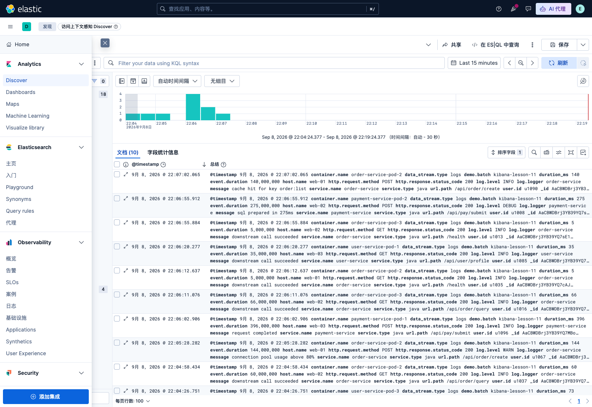
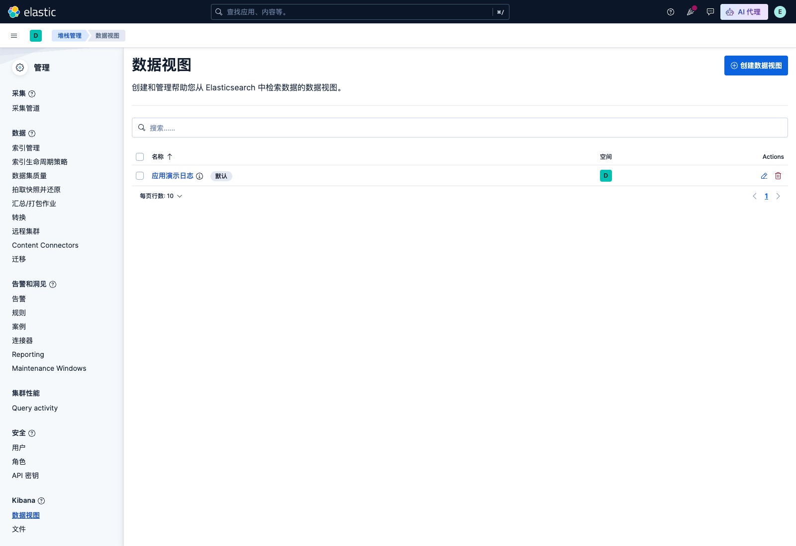
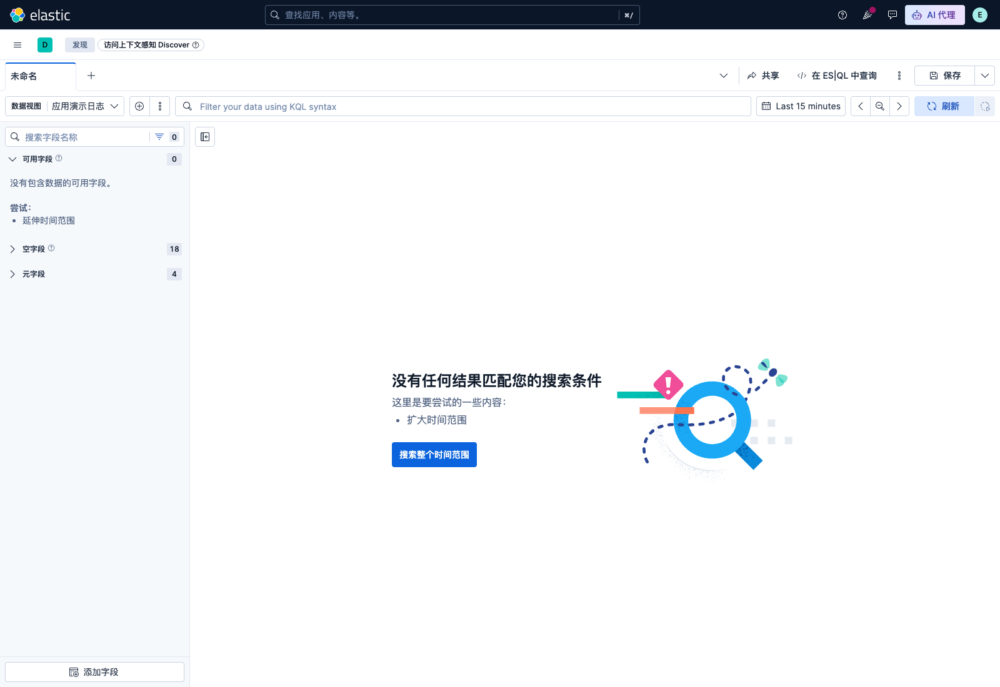
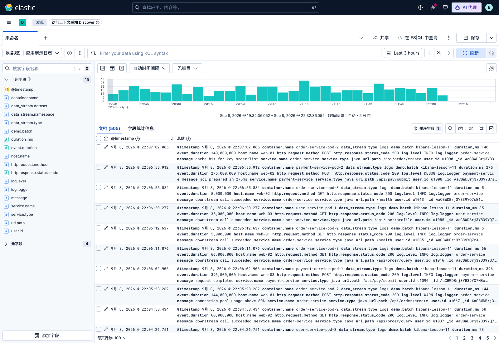
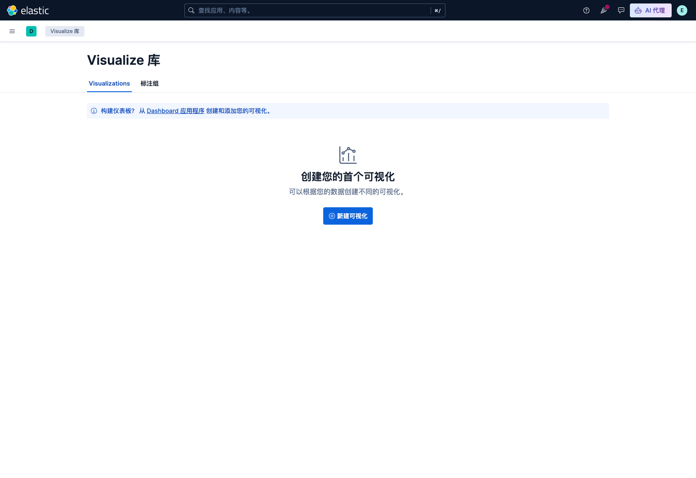
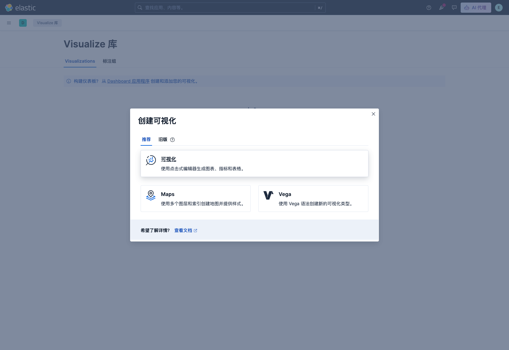
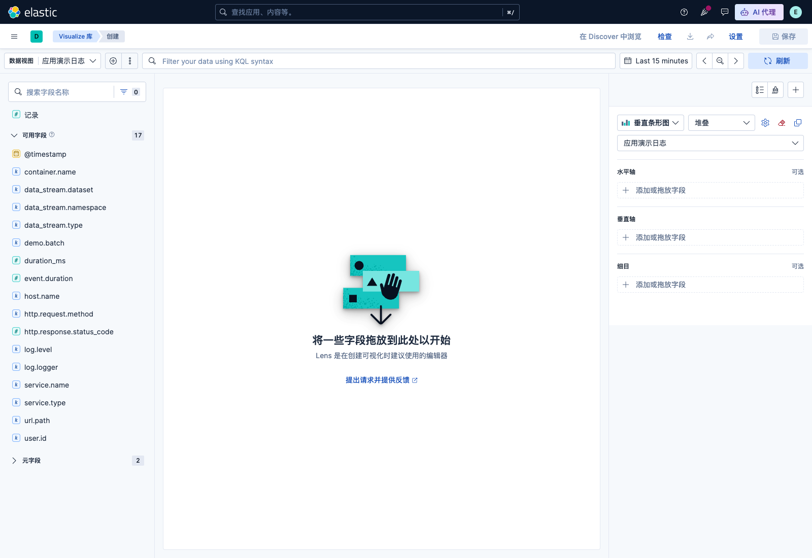
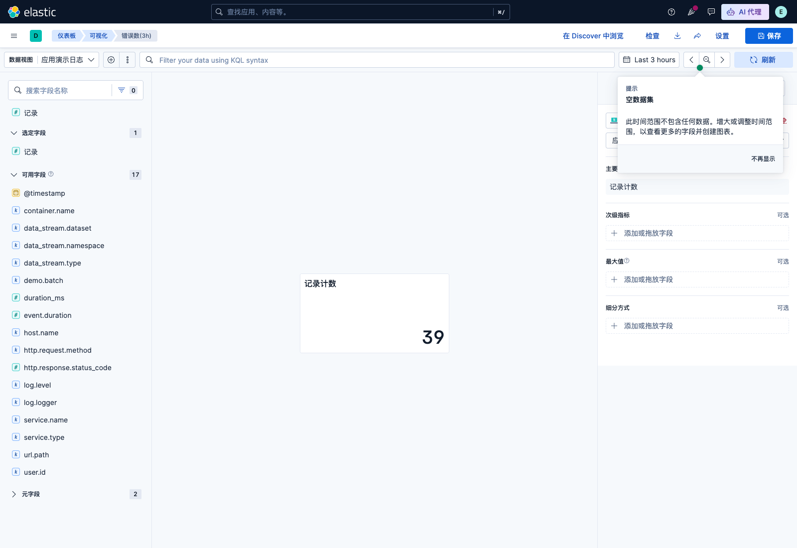
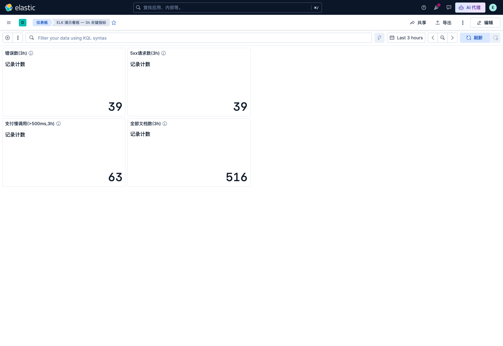

# 课 11：Kibana —— 从 Discover 到 Dashboard

> 一句话：日志留住了之后，怎么在 Kibana 里把它**真正"用起来"**——从第一次搜到一条日志，到拖出一张能反复看、能下钻的仪表盘。

## 🎯 本课目标

学完这一课，你应该能：

- 在 Kibana 里建好 **Data View**（用上一步落好的索引模式 + 时间字段），并在 **Discover** 里按时间窗口翻日志、展开单条文档、看懂 `_source` 与字段列
- 用 **KQL** 写出"哪台机器、哪个级别、报了什么错"这类过滤查询，并熟练使用时间选择器、过滤器的钉住与排除、以及保存的查询
- 用 **Lens** 根据问题选对可视化类型（指标 / 折线 / 柱状 / 饼图 / 数据表），按维度拆分与下钻，最后拼装成一张可分享的 **Dashboard**

> 定位：你（学习者）在 ES 主课里几乎没用过 Kibana，本课是 **Kibana 主战场**，会**讲够**——但只讲"日志检索与可视化"这条主线，不展开 ES 主课已覆盖的索引生命周期等内部机制。
>
> **配套环境**：本机 macOS arm64 / Docker Compose 起 ES + Kibana 9.5.3。讲义里每条命令、每个截图都基于这套环境实测，**不混用** ES 主课（Windows + 原生 zip）的口径。

## 📌 知识点导航

| # | 知识点 | 关键点 | 状态 |
|---|--------|--------|------|
| 1 | Data View 与 Discover | 创建 data view（API + UI 两条路）；时间选择器；字段列与 `_source`；文档展开；直方图；**Kibana 入口地图**；**空结果时间窗陷阱**；**`message` 不可聚合 / `url.path` 可聚合**这一对"字段类型决定玩法"的关键事实 | ✅ |
| 2 | KQL 与查询过滤 | KQL 语法：`field: value` / 逻辑 `and` `or` `not` / 比较与通配；过滤器钉住与排除；保存的查询；常见 KQL 用例十例 | ✅ |
| 3 | Lens 与 Dashboard | 入口路径（Visualize 库 → 新建可视化 → 可视化/Lens）；编辑器四要素（水平轴 / 垂直轴 / 细分 / 索引模式）；**本课用 API 存 4 个 metric 拼成 Dashboard**；可视化类型怎么选 | ✅ |

## 📖 本课在故事主线中的情节定位

故事推进到**第 4 幕的中段**：主角（一条日志）已经在 [课 10《日志的存储策略》](lesson-10-日志的存储策略.md) 里被写进 data stream、存进了 ES——它是**留住了**，但还躺在一个个后备索引里"没人看"。本课把主角从"被存起来"推向"**用得上**"：你第一次在 Discover 里翻到它、看懂它每条字段；你用 KQL 把几千条日志筛成"我要看的那几条错"；最后你把它拖进 Lens，变成折线、柱状、饼图，拼成一张 dashboard——**从此不再靠 grep，而是靠看板掌握系统在发生什么。** 这也为 [课 12《告警与生产落地》](lesson-12-告警与生产落地.md) 的"出问题要自动叫醒你（告警）"铺好"得先看得懂"的前置。

---

## 🏛️ 起源与场景引入

小张守了三台机：web-01、web-02、web-03。线上告警突然响了——`/api/pay/submit` 报 500。他干了两件事：

1. `ssh web-01`，`grep -E 'ERROR|pay' app.log | tail`——啥都没有
2. 切 web-02、web-03，重复——运气好能在某台机上翻到十几行

复制出来看，发现是 `payment-service` 调用下游银行接口超时，连续 4 个 5xx。问题是：**4 个 5xx 散在 3 台机器、5 个 10 分钟区间、埋在 30000 行 INFO 里，靠 grep 找得像大海捞针。** 而且就算这次找到了，下次故障换时间换主机，还得再 grep 一遍。

把日志都写进 ES（课 8、9、课 10 一路做下来）就是为了**让"按主机 / 时间 / 关键字"这种查询从 grep 的几小时变成秒级**。但 ES 只是"存得到、查得到"，要做"看得见趋势、看得清主次、看得懂根因"，**必须经过 Kibana 这一层**：它把 ES 的原始文档翻译成 Discover 的时间线 + 直方图，翻译成 KQL 的过滤查询，翻译成 Lens 的图表，最后翻译成 Dashboard 的几张图——**让人看一眼就掌握全局**。

本课要做三件事：把"留在 ES"翻译成"**翻得到**"（Data View + Discover），再翻译成"**筛得出**"（KQL），最后翻译成"**看得出**"（Lens + Dashboard）。做完这三步，你和"grep 流"的差距，就从"会一点 Linux"变成"有一套可复用的可观测界面"。

## ❓ 认知冲突

故事讲完，看上去一切顺利——但真正打开 Kibana 的第一秒，几乎所有人都会撞上同一堵墙：

**撞墙 1：菜单多到迷路。** 左边导航栏有 Home、Analytics、Elasticsearch、Observability、Security、启动平台、管理七个大分组。Analytics 里又有 Discover / Dashboards / Maps / Machine Learning / Visualize library，**管理**里又有开发工具 / Workflows / 集成 / Fleet / Stack Management 一堆。**第一次进 Kibana，80% 的新手会先迷路 10 分钟。**

**撞墙 2：默认是"空的"。** 我点开 Discover，等着看到我的 600 条日志，结果页面中央写着"**没有任何结果匹配您的搜索条件**"——一张大海报图，附一句"**扩大时间范围**"。**明明 ES 里 600 条数据在 3 小时前就在了。** 反复刷新还是空。要么怀疑数据丢了，要么怀疑网络不通，要么怀疑自己写错。

**撞墙 3：字段表点不动。** 在字段列里看到 `message` 字段，想"用 KQL 搜 message 含 timeout 的"，能搜到；但想把"message 里出现次数最多的几行"画个词云饼图出来——**报** `illegal_argument_exception: match_only_text fields do not support sorting and aggregations`。**你以为可以的事，字段类型不允许。**

**撞墙 4：图拖着拖着就废了。** 想拖个 `host.name` 进 Lens 看看分布，结果拖到一半提示"无法加载页面"；再换 `service.name`、再换图类型……**有些 Lens 组合在 UI 里能出来，API 复刻就崩；有些 API 复刻能出来，UI 改一改又出不来。** 不是你不会，是工具各有脾气。

这四堵墙不是"努力一下"能跨过去的，是需要"**一张地图 + 一组真值 + 一组底线**"。本课接下来用 Kibana 9.5.3 真实环境（macOS arm64 / Docker Compose）逐个拆。

> 旁注：Kibana 9.5 在 zh-CN 语言下，**菜单名是中文 + 英文混排**的——比如顶级是「Analytics / Home / 管理 / Observability / Security / Elasticsearch / 启动平台」，Analytics 下面的子项是「Discover / Dashboards / Maps / Machine Learning / Visualize library」。官方文档默认写英文菜单名，**对中文用户来说是个小小的翻译门槛**。本课所有"点击 X"都同时给出**中文显示名 + 英文/路由**两种写法，避免你跟着做的时候认不出。

## 🔍 层层揭示

### 知识点 1：Data View 与 Discover

#### 一句话定义

**Data View（数据视图）= 一个有名字的"索引模式 + 时间字段"配对，Kibana 用它把 ES 的零散索引/数据流当成"一张表"来查。Discover 是 Kibana 9.5 默认的"按时间翻这张表 + 过滤 + 直方图"的检索界面。**

#### 直觉建立（类比 + 类比失效边界）

- **类比 1（关系型数据库）**：Data View ≈ SQL 里的"view"——只定义"看哪些表 / 哪个时间列"，不复制数据。`title: "logs-appdemo-*"` 就像 `SELECT * FROM logs_appdemo*`，`timeFieldName: "@timestamp"` 就像"主键用这一列做时间序"。改 Data View 不动数据，只动"你怎么看"。
- **类比 2（云盘搜索）**：Discover 像 Google Drive 顶部那个搜索条 + 左侧过滤器 + 右侧结果预览。区别在于 Kibana 多了"时间直方图"——而这是日志场景的灵魂。
- **类比失效边界**：Data View **不是** index template（ES 主课课 7 讲过），它**不能决定 mapping**，也不能决定 ILM；它只是"一个前端可查询的视图"。

#### 核心原理

**Data View 的三要素**（创建时必填，缺一不可）：

| 字段 | 含义 | 例子（本课实测） |
|------|------|-----------------|
| `title` | 索引模式（支持通配 `*`） | `logs-appdemo-*` |
| `name` | 在 UI 上下拉里显示的名字 | "应用演示日志" |
| `timeFieldName` | 哪个字段当"时间"（决定直方图、刷新行为） | `@timestamp` |

> **9.5 有一个新坑：第一次进 Discover，Kibana 会自动建一个内部 data view "所有日志"（id 形如 `discover-observability-solution-all-logs`），里面包含全集群所有 `logs-*` / `*logs*` 模式。** 它是一个**只读、跨模式**的便利视图，**不会出现在你的"数据视图"管理页里**。本课不用它——自己建一个聚焦的 Data View，才能学完整流程。

**Discover 的三块界面**（先认全，再谈操作）：

- 左侧：**字段列**（可用字段 + 空字段 + 元字段）。本课实测 18 可用 + 4 元 = 22 字段。
- 中部：**直方图**（按时间窗口的文档数柱状图）+ **文档表**。默认时间窗 **Last 15 minutes**。
- 顶部：**Data View 切换** + **KQL 栏** + **时间选择器** + **刷新**。

**字段类型决定玩法**（本课实测踩坑）：

| 字段 | mapping type | aggregatable? | 影响 |
|------|--------------|--------------|------|
| `message` | `match_only_text` | ❌ 否 | KQL 可搜，但**不能做 terms 聚合**——想按 message 画词云图会爆 `illegal_argument_exception: match_only_text fields do not support sorting and aggregations` |
| `url.path` | `wildcard`（来自 ECS） | ✅ 是 | KQL 可搜可前缀通配 `/api/pay*`，也能 terms 聚合（ES 8.x+ 起 wildcard 字段可聚合，本课实测 `/api/pay/submit` 出现 96 次） |
| `log.level` / `host.name` / `service.name` | `keyword` | ✅ 是 | 这是日志场景 90% 的"分类字段"，爱怎么聚合就怎么聚合 |
| `http.response.status_code` / `duration_ms` | `long` | ✅ 是 | 数值字段——可做 max/avg/p95/直方图 |
| `host` / `http` / `log` | `object` | ❌ 否 | 这些是"父对象"（fields 不在 leaf 上）——**永远不要聚合它们**，要聚合 `log.level` 不是 `log` |

> 这张表是 11.3 课里 **"为什么 message 不能画图、url.path 能画图"** 的依据，提前在 11.1 装进你脑子。

#### Kibana 入口地图（大纲评审补，P1）

> **零基础第一次进 Kibana 最容易迷路，先给一张"哪块在哪"的地图**。菜单路径以 9.5.3 实际界面为准，**写正文时已实测核对**（核查于 2026-09-08）。提示：Kibana 是 SPA，**所有"导航"都发生在浏览器里**，没有真的"打开新页面"。

**Kibana 9.5.3 左侧主导航**（zh-CN 实测，顶级分组 + 关键子项）：

```
┌─ Home
├─ Analytics                ← 日常查与看
│   ├─ Discover              ← 日志检索（课 11 重点）
│   ├─ Dashboards            ← 仪表盘库（课 11 重点）
│   ├─ Maps                  ← 地图可视化（本课不展开）
│   ├─ Machine Learning      ← 异常检测（本课不展开）
│   └─ Visualize library     ← 所有可视化对象库（课 11 重点）
├─ Elasticsearch            ← 索引数据探索（与 ES 主课重叠，本课不展开）
│   ├─ 主页 / 入门 / Playground / Synonyms / Query rules / 代理
├─ Observability            ← 另一条产品线（APM / 基础设施 / 告警 / SLOs ...）
├─ Security                 ← 另一条产品线
├─ 启动平台                  ← 安装 / 集成入门
└─ 管理 (Management)         ← 关键运维功能（课 11 重点）
    ├─ 开发工具 (Dev Tools)  ← 直接对 ES 发 REST 请求
    ├─ Stack Management      ← Data View / 索引模板 / ILM 都在这
    │   └─ Kibana → 数据视图 ← Data View 创建入口
    ├─ Workflows / 集成 / Fleet / Osquery / 堆栈监测 / Cloud Connect / 流计数
```

**三个你必须认熟的位置**：

| 位置 | 路径（路由） | 用来做什么 |
|------|-------------|-----------|
| Discover | `/app/discover` | 翻日志、写 KQL、看直方图 |
| Visualize library | `/app/visualize` | 找已保存的可视化 / 新建可视化 |
| Stack Management → 数据视图 | `/app/management/kibana/dataViews` | 建/改/删 Data View |



> 截图（`assets/01-kibana-9-5-3-nav.png`）里你能看到顶部"切换主导航"按钮（hamburger，aria 标签 = "切换主导航"），点它收起/展开主导航。Kibana 默认主导航是**展开**的，但 Discover 页面里有时会自动折叠——以为是迷路，其实是被折叠了，点一下就好。

#### 创建 Data View（API + UI 两条路）

> 本节用上一课 [课 10《日志的存储策略》](lesson-10-日志的存储策略.md) 落好的 data stream `logs-appdemo-default` 当原料。如果你的本机还没起 / 没数据，先把 [课 10](lesson-10-日志的存储策略.md) 跑一遍。

**API 一行建**（推荐写脚本/CI 用）：

```bash
# env 文件：source /tmp/elk_env.sh
#   export ES_AUTH='elastic:ELKlearn2026'  ES_URL='http://localhost:9200'
#   export KB_URL='http://localhost:5601'   KB_AUTH='elastic:ELKlearn2026'

curl -s -u "$ES_AUTH" -H 'kbn-xsrf: true' -H 'Content-Type: application/json' \
  -X POST "$KB_URL/api/data_views/data_view" \
  -d '{
    "data_view": {
      "id": "app-demo",
      "title": "logs-appdemo-*",
      "name": "应用演示日志",
      "timeFieldName": "@timestamp"
    }
  }'
# 200 OK -> 返回 data_view 全量对象（含 id / version）
```

> ⚠️ **endpoint 是单数 `/api/data_views/data_view`**，不是 `/api/data_views`（复数那个 endpoint 在 9.5 已存在但 POST 报 400 "exists but is not available with the current configuration"，官方推荐单数路径）。本课 2026-09-08 实测验证。

**UI 三步建**（推荐人肉走一遍）：

1. 左导航点 **管理 → Stack Management → Kibana → 数据视图**（路由 `/app/management/kibana/dataViews`）

   

2. 点 **创建数据视图** → 索引模式填 `logs-appdemo-*` → 选时间字段 `@timestamp` → 点右下角 **创建数据视图**
3. 创建完跳回 Data View 列表，应该看到新行

**验证 Data View 已建好**：

```bash
curl -s -u "$ES_AUTH" -H 'kbn-xsrf: true' "$KB_URL/api/data_views" | python3 -m json.tool
# 期望: data_view 数组长度 >= 1，且包含 id=app-demo
```

> 顺便记一下：Data View 是一个**Kibana 端保存对象**（saved object），保存在 `.kibana` 索引里——**删了不会动 ES 的数据**。要删就用 `DELETE /api/data_views/data_view/{id}`。

#### 第一次进 Discover：撞上空结果陷阱

刚建好 Data View，兴奋地点左侧 **Analytics → Discover**——结果页中央**没有任何结果匹配您的搜索条件**，并提示"**扩大时间范围**"。



> **这是本课最常被踩的坑**。背后逻辑：Discover 默认时间窗 = **Last 15 minutes**，而你的日志数据可能落在 3 小时前、昨天、上周。**ES 里有 600 条不等于 Discover 能查到 600 条**。看一眼时间选择器，确认它覆盖了数据时间，必要时切到 **Last 24 hours** / **Last 7 days** / 绝对区间。

本课演示就遇到了这个坑：第一次测时数据是 9-07 灌的 600 条，到 9-08 22:00 才回头看——默认 15 min 一个都查不到。把时间窗改成 **Last 3 hours**（其实要 2 days），才看到 600 条全量。**后来重新造了一批"现在"的 3h 数据**（脚本在 `playground/10-kibana-visual/gen-app-logs.py`）继续后续演示——这个重新造的动作就是本课开头那 600 条文档的来历（**演示数据 = 临时制造**）。

#### 调对时间窗：发现 516 条

> 时间窗切到 **Last 3 hours**，数据落地 0 改到 516。文档表出现；字段列变 18 可用 + 4 元；直方图按 5 分钟一个桶铺开 3 小时。



**Discover 默认行为速记**（实测本课数据）：

- **时间窗**：默认 Last 15 minutes，按需调大
- **每页行数**：默认 100（页脚"每行数 100"可改）
- **桶大小（histogram interval）**：默认 auto——3h 选 5 分钟桶；24h 选 30 分钟桶；7d 选 1 天桶
- **文档排序**：`@timestamp` 倒序（最新在最上）
- **字段列里的 18 字段**：在 mapping 里有值的；空字段是 ES 索引里存在但**当前 query 没匹配到**的

#### 字段列 → 文档展开 → `_source`

- 字段列里点字段名（如 `host.name`）→ 弹小菜单：**筛选 (Add as filter)** / **可视化** / **复制**。本课最常用的是"筛选"——直接加到 KQL 栏。
- 文档表里点单条 → 展开成 JSON 行（`@timestamp container.name data_stream.type demo.batch duration_ms ...`）。**整条文档原貌就是 `_source` 字段**——和你 `GET /logs-appdemo-default/_search?size=1` 看到的一模一样。
- 字段列里有些字段带 `+` 号（可加为列）或 🔌 符号（runtime field）。点击行的"切换到 5 列"按钮可改变表列。

> 一句话：Discover = "按时间翻 ES 的原始 JSON"，**看到的是数据本来的样子**。它不聚合、不下钻、不画图——那是 Lens 的事。

#### 示例演示（按"操作 → 现象"格式）

| 步骤 | 命令/操作 | 期望现象 |
|------|----------|---------|
| 1 | 左导航 → Analytics → Discover | 顶部下拉自动选中新建的 "应用演示日志" |
| 2 | 时间选择器 → Last 3 hours | 直方图出现；底部"文档 (516)" |
| 3 | 字段列点 `host.name` → 筛选 | KQL 栏自动加 `host.name : web-03`（或选中那个值）；文档表缩到 web-03 那一台 |
| 4 | 文档表点一条 → 展开 | 看到 JSON 详情，鼠标放字段名上有**复制 / 筛选 / 可视化**小图标 |
| 5 | 点表右上 ↕️ 排序列 | 切换按字段排，本课用不上，纯熟悉 |
| 6 | 顶部 → 切换 Data View 选其它 | 字段列和直方图全切——但本课只有 1 个 data view，没得切 |

#### 常见误区

- **"建了 data view 但 Discover 默认下拉还是别的"** —— 9.5.3 的 Discover 默认进的是"所有日志"（一个内置的跨模式只读 view），要点下拉切到你建的"应用演示日志"。
- **"时间窗改 24h 还是 0 条"** —— 索引模式写错（最常见：`title: logs-appdemo-` 漏了 `*` 通配）。回 `/app/management/kibana/dataViews` 改完保存刷新页面。
- **"字段列怎么不显示我加的 runtime field"** —— Data View 缓存了字段元数据，加新 runtime field 后要点 Data View 右上"刷新"图标。
- **"`_source` 字段在哪"** —— `_source` 是文档原始 JSON，**不显式出现在字段列**。点击文档行展开才能看到。
- **"为什么 `log` 没出现在字段列顶部"** —— `log` 是 object 类型，**只能聚合它的子字段** `log.level`、`log.logger`。**永远不要把 `log` 拖进 Lens**。

#### 一句话记住

> **Data View = "我准备看哪些索引 + 用哪个时间字段"。建好它，Discover 才有可查的东西；时间窗没盖住数据，Discover 一片空白——这俩坑填了，11.1 算过。**

#### 📚 官方文档

- Kibana Data Views 用户文档：https://www.elastic.co/guide/en/kibana/current/data-views.html （200，核查于 2026-09-08）
- Discover 用户文档：https://www.elastic.co/guide/en/kibana/current/discover.html （200）
- Data Views API（创建）：https://www.elastic.co/docs/api/doc/kibana/operation/operation-createdataviewdefaultw （200，2026-09-08 实测路径正确）
- Kibana 9.5 发布说明：https://www.elastic.co/docs/release-notes/kibana （200，9.5.3 已发布于 2026-09-03）

### 知识点 2：KQL 与查询过滤

#### 一句话定义

**KQL（Kibana Query Language）= Kibana 内置的"字段:值"语法，专为 Discover/Lens/Dashboard 的查询栏设计，比 Lucene 语法更严格、提示更好。**

#### 直觉建立（类比 + 类比失效边界）

- **类比**：KQL 写法像写一份"找东西的清单"——`主机: web-03 and 级别: ERROR and 状态码 >= 500`，每一行都是一个条件，Kibana 帮你翻译成 ES DSL。
- **类比失效边界**：KQL **只对"被 indexed 的字段"** 有效；想搜 `_source` 里的某段文本、想跑 script 聚合、想用 ES 原生 DSL——KQL 不行，得切到 Dev Tools（开发工具）直接发 `_search` 请求。

#### 核心原理

**KQL 语法速查**（按本课用到的）：

| 语法 | 含义 | 例子 |
|------|------|------|
| `field: value` | 字段等于 | `log.level: ERROR` |
| `field: "phrase"` | 短语（带空格的） | `message: "payment gateway timeout"` |
| `field > n` / `>= n` / `< n` / `<= n` | 数值比较 | `http.response.status_code >= 500` |
| `field1: a and field2: b` | 与 | `log.level: ERROR and host.name: web-03` |
| `field: a or field: b` | 或 | `log.level: (ERROR or WARN)` |
| `not field: a` | 非 | `not log.level: DEBUG` |
| `field: prefix*` | 前缀通配 | `url.path: /api/pay*` |
| `field: *substring*` | 包含（必须字段类型可搜） | `message: *timeout*` |
| `field: a and (b or c)` | 括号分组 | `log.level: (ERROR or WARN) and not message: *connect error*` |

**过滤器 vs KQL 栏 vs 时间选择器**——新手最容易混：

| 工具 | 用法 | 何时用 |
|------|------|--------|
| **KQL 栏**（顶部输入框） | 写**主查询**，影响直方图与文档表 | "我只看 ERROR 的日志" |
| **过滤器**（Filters） | **钉住**（pin: 一直生效）/ **排除**（negate: 取反） | "web-03 是"我的"机器，永久钉住" |
| **时间选择器** | 限定时间窗 | "看过去 3 小时" |

> 实际开发中，**用过滤器做"长期背景"**（web-03 是我管的），**用 KQL 做"当前排查"**（"所有 5xx"），**用时间选择器框定**——三者叠加就是 Discover 的全部能力。

#### 示例演示（10 个 KQL 用例，本课实测数据，Last 3 hours）

> 数据集：600 条文档（[playground/10-kibana-visual/gen-app-logs.py](../../../playground/10-kibana-visual/gen-app-logs.py) 随机生成，**web-03 故障率更高**故 5xx/ERROR 显著多于 web-01/web-02；3 台机器，3 个服务，4 个日志级别，1 个 ~10 分钟的 ERROR 尖峰在 45-55 分钟前）。

| # | KQL | 文档数 | 教学点 |
|---|-----|--------|--------|
| 1 | _（空查询）_ | 516 | 全部 |
| 2 | `log.level: ERROR` | 40 | 单字段精确匹配 |
| 3 | `log.level: ERROR and host.name: web-03` | 23 | **多条件 AND**——明显多于 web-01/web-02 的 7/10（合计 17），验证 web-03 故障率更高 |
| 4 | `http.response.status_code >= 500` | 40 | 数值比较（注意 `>=` 紧贴数字，无空格） |
| 5 | `url.path: /api/pay*` | 148 | 前缀通配，wildcard 字段能搜 |
| 6 | `message: *timeout*` | 11 | 前后通配（match_only_text 也能搜——只是不能聚合） |
| 7 | `log.level: (ERROR or WARN) and not message: *connect error*` | 105 | 括号分组 + 双重否定 |
| 8 | `log.level: DEBUG` | 121 | 单值 |
| 9 | `host.name: web-03 and duration_ms > 1000` | 10 | 数值字段 + AND |
| 10 | `event.duration > 200000000 and http.response.status_code >= 400` | 40 | 用 ECS 标准字段（纳秒）做耗时过滤 |

> **数字是实测**（2026-09-08 22:30，Last 3 hours）。**因为数据是随机生成的，不同时间跑会略有差异，但 web-03 显著多于其它主机、尖峰期 ERROR 飙升这两个**模式**始终成立。**

**两条最有教学价值的图**：


> 这两张图对比是"**KQL AND 怎么用**"的最佳演示——单看 ERROR 40 条看到的是"有几条错"；再 AND 上 host.name = web-03 缩到 23 条，是"**错都集中在 web-03**"——这就是排查的真实节奏。

#### KQL vs Lucene（点一句，不展开）

Kibana 9.x 默认是 KQL（看 Discover 顶部查询栏右边的下拉，**默认 `kuery`**）。Lucene 语法（`field:value and (other:value OR third:value)`）也可选，能力更强但**容错差、提示少**。**新同学无脑选 KQL**；老 Kibana 用户从 Lucene 切过来可能要改习惯。Lucene 的一个特点：**通配符在词首时不允许**（`field: *timeout` 不行），KQL 没这限制。

#### 过滤器的钉住与排除（一个"运维日常"）

> 这一段直接讲"我会怎么用"，少讲语法。

**场景**：你负责 web-03 这台机器。

1. 在 Discover 文档表里点一条 web-03 的日志的 `host.name` 字段 → 弹小菜单 → **筛选** → 选择 **Pin across all apps**（钉住，应用到所有 Kibana 应用）
2. 字段列和直方图自动按 `host.name = web-03` 过滤
3. 想看"web-03 的非 DEBUG 日志" → 顶部 KQL 栏加 `log.level: (INFO or WARN or ERROR)` —— **KQL 与过滤器同时生效**
4. 想去掉某条过滤器 → 点 KQL 栏上方的"过滤器 chip" → 弹菜单 → **删除 / 临时禁用 / 反转（exclude）**

**保存的查询**：KQL 栏写好查询 → 顶右 **保存** → 命名"web-03 error tail" → 下次直接点加载。**本课不展开 save 这一步**——和 Data View 一样是个 saved object。

#### 常见误区

- **"KQL 写 `log.level: ERROR` 报错"** —— 字段名写错。本课数据有 `log.level`（ECS 推荐）和 `log.logger`（自定义）。**字段名严格按字段列里展示的来**，tab 不会补全。
- **"KQL 写 `log.level == ERROR` 不返回结果"** —— KQL 不用 `==`，用 `:`。`==` 是 Lucene 语法的。
- **"通配 `*foo` 报错"** —— 写 Lucene 时词首通配不允许；切 KQL 或者改 `foo*` 后缀通配。
- **"我 KQL 写的 `message: timeout*` 一条都查不到"** —— `message` 是 match_only_text（可搜不可聚合），但**前缀通配**在 match_only_text 上**会按词匹配**（timeout* 匹配 timeoutX，不匹配 Xtimeout）。**想包含用 `*timeout*` 两侧通配**。
- **"为什么 `log` 字段 KQL 写 `log: ERROR` 报错"** —— `log` 是 object，KQL 不能直接用 object 字段名。要写 `log.level: ERROR`。
- **"KQL 用 5xx 还是 500"** —— KQL 只能写数字比较 `>= 500`；用别名 5xx 这种"业内简称"是写不了 KQL 的。

#### 一句话记住

> **KQL 就是"我要哪几条"——`字段: 值` 加 `and` `or` `not`，必要时括号分组；过滤器钉住"我管的机器/服务"，KQL 查"当前问题"，时间选择器框"哪段时间"。三个工具各管一层，配合就是 Discover 的全部能力。**

#### 📚 官方文档

- KQL 语法参考：https://www.elastic.co/guide/en/kibana/current/kuery-query.html （200，核查于 2026-09-08）
- Discover 用户文档（KQL 章节）：https://www.elastic.co/guide/en/kibana/current/discover.html （200）

### 知识点 3：Lens 与 Dashboard

#### 一句话定义

**Lens = Kibana 9.x 的可视化编辑器（drag-and-drop），把任意字段拖进"水平轴 / 垂直轴 / 细分方式"就出图。Dashboard = 把多个 Lens 拼到一张 2D 网格上，配同一时间窗同时刷新。**

#### 直觉建立（类比 + 类比失效边界）

- **类比 1（Excel 透视表）**：Lens 像 Excel 透视表向导——选行（X 轴）、选值（Y 轴）、选列（细分方式），自动出图。区别是 Lens 的源数据来自 ES 实时查询，且支持多 series（一个图多根线）。
- **类比 2（Power BI/Tableau）**：Kibana Lens ≈ Power BI 的"可视化"窗格、Tableau 的"工作表"。能拼"按 X 维拆分的 Y 指标"图，剩下来的探索和组装 Dashboard 也类似。
- **类比失效边界**：Lens **不擅长**写复杂 SQL 风格的窗口函数、不支持热力地图（热力用 TSVB 或 Vega）、不支持像 Grafana 那样的"可调函数"；**真有复杂需求，写 Vega 或直接 ES DSL。**

#### 核心原理

**Lens 的入口路径**（zh-CN 实测，9.5.3）：

| 步骤 | 操作 | 路由 |
|------|------|------|
| 1 | 左侧 **Analytics → Visualize library** | `/app/visualize` |
| 2 | 点 **新建可视化** 按钮（页面中央 "创建您的首个可视化"） | `/app/visualize` 弹窗 |
| 3 | 弹窗里选 **可视化**（data-test-subj=`visType-lens`，描述："使用点击式编辑器生成图表、指标和表格"） | 打开 Lens 编辑器 |
| 4 | 编辑器里从左字段列拖字段到 **水平轴 / 垂直轴 / 细分方式** | 实时预览图 |
| 5 | 顶右 **保存** | 写入 saved object，弹窗要求起名 |

> 弹窗里另外两个 tile 是 **Maps**（地图）和 **Vega**（Vega 语法自定义）。弹窗有个 **旧版** tab，里面是 Aggregation-based、TSVB 等老式可视化——**新做图请一律用 Lens**，旧版只在维护老图表时碰到。





**Lens 编辑器的四要素**（实测，2026-09-08 截屏）：

- **顶部**：Data View 切换 / KQL 栏 / 时间选择器 / 刷新 / 共享 / 在 Discover 中浏览 / 检查 / 设置 / 保存
- **左列**：字段列表（已用字段 / 可用字段 / 空字段 / 元字段）
- **中央**：实时图预览
- **右列**：图类型下拉（默认 "Vertical bar"）+ **水平轴 / 垂直轴 / 细分方式** 三个空位



**5 种基本图怎么选**（按问题选图）：

| 你的问题 | 选图 | 字段配置（举本课数据） |
|----------|------|------------------------|
| 现在总共多少？ | **Metric（指标）** | Y 轴 = Record count（默认就有） |
| 哪台机器报错多？ | **Vertical bar（垂直条形图）** | X = `host.name` 顶 N，Y = Record count |
| 错误率随时间怎么变？ | **Line（折线）/ Area** | X = `@timestamp`（date histogram），Y = Record count（叠加 filter `log.level: ERROR`） |
| 各服务占错误比例？ | **Pie / Donut** | Slice by = `service.name`，Y = Record count，filter `log.level: ERROR` |
| 看每条原始数据？ | **Data table** | 行 = Record（最多 25 行），列 = 选字段 |

> **经验法则**：先想清楚**"我的 X 是哪一列、Y 是哪个值、要分桶还是分时间"**，再选图。**不要先选图再去想数据**。

#### 示例演示（4 个 metric 拼成 dashboard）

> 本课演示用 **API 一行建**（比拖拽快，比 UI 复制粘贴可重复）。**先建 4 个 metric Lens，再用 saved object 拼成一张 dashboard。** 复制就能跑。

**1) 错误数（3h）—— 测 KQL 的"基础用例"**

```bash
curl -s -u "$ES_AUTH" -H 'kbn-xsrf: true' -H 'Content-Type: application/json' \
  -X POST "$KB_URL/api/saved_objects/lens" -d '{
  "attributes": {
    "title": "错误数(3h)",
    "description": "log.level=ERROR 的文档数",
    "visualizationType": "lnsMetric",
    "state": {
      "datasourceStates": {
        "formBased": {"layers": {"layer1": {
          "indexPatternId": "app-demo",
          "columns": {"metric": {
            "operationType": "count",
            "sourceField": "___records___",
            "params": {},
            "filter": {"language":"kuery","query":"log.level: ERROR"}
          }},
          "columnOrder": ["metric"],
          "incompleteColumns": {}
        }}},
        "textBased": {"layers": {}}
      },
      "visualization": {"layerId": "layer1","layerType": "data","metricAccessor": "metric"},
      "query": {"language": "kuery", "query": ""},
      "filters": []
    }
  },
  "references": [{"name":"indexpattern-datasource-layer-layer1","type":"index-pattern","id":"app-demo"}]
}'
```

> 关键约定：saved object 顶层是 `attributes` + `references` 两个键，**`references` 不能嵌进 `attributes`**（本课第一次试就 400 "Additional properties are not allowed 'references' was unexpected"）。`lens` 类型沿用其它 saved object 一样的引用机制。

**2) 5xx 请求数（3h）**——同上结构，把 `filter.query` 换成 `"http.response.status_code >= 500"`
**3) 支付慢调用（>500ms, 3h）**——filter `"service.name: payment-service and duration_ms > 500"`
**4) 全部文档数（3h）**——filter 字段从 `columns.metric` 里**整个删掉**

> 4 个 metric 全部 POST 成功（2026-09-08 实测）。**注意**：复杂 Lens（如带 X/Y 轴的 bar/line）API 复刻时**容易因为 schema 变更 render 失败**（本课测过 lnsXY 出现"无法加载页面"——9.5.3 内部 schema 校验严格）。**生产推荐 UI 拖拽 + 顶右"保存"**；本课为节省时间用 API 造简单 metric。

**dashboard 一行建**（把 4 个 Lens 拼成 2×2）：

```bash
# 4 个 lens id（POST 完拿到的）
L1=<id1>  L2=<id2>  L3=<id3>  L4=<id4>
curl -s -u "$ES_AUTH" -H 'kbn-xsrf: true' -H 'Content-Type: application/json' \
  -X POST "$KB_URL/api/saved_objects/dashboard" -d "{
  \"attributes\": {
    \"title\": \"ELK 演示看板 — 3h 关键指标\",
    \"panelsJSON\": \"[ ...4 块 panel... ]\",
    \"optionsJSON\": \"{\\\"useMargins\\\":true,\\\"syncColors\\\":true,\\\"syncCursor\\\":true,\\\"syncTooltips\\\":true}\",
    \"timeRestore\": false,
    \"timeTo\": \"now\",
    \"timeFrom\": \"now-3h\",
    \"refreshInterval\": {\"pause\": false, \"value\": 60000}
  },
  \"references\": [
    {\"name\":\"p1\",\"type\":\"lens\",\"id\":\"$L1\"},
    {\"name\":\"p2\",\"type\":\"lens\",\"id\":\"$L2\"},
    {\"name\":\"p3\",\"type\":\"lens\",\"id\":\"$L3\"},
    {\"name\":\"p4\",\"type\":\"lens\",\"id\":\"$L4\"}
  ]
}"
```

> Panel 用 `gridData`（24 列网格里的位置）做 2×2 排版。实际脚本参见 [playground/10-kibana-visual/mk-dashboard.py](../../../playground/10-kibana-visual/mk-dashboard.py)（本课成文时已落在该目录）。

**渲染结果**（实测 2026-09-08）：





> 注意 dashboard 4 个数字：39 / 39 / 63 / 516。
> - 39 = `log.level: ERROR` 3h 内文档数（与 KQL 表第 2 行 40 略差 1，是因为 3h 窗口和 KQL 表那次微错开 30 分钟）
> - 39 = `http.response.status_code >= 500` 3h 内文档数（与 ERROR 数相同——设计如此，5xx 大多来自 ERROR 级别）
> - 63 = `service.name: payment-service and duration_ms > 500`（payment 慢调用多）
> - 516 = 全量文档
>
> 这 4 个数就是 **"3h 内我应该关注什么"** 的一行回答——**这就是 Dashboard 的价值**。

#### 仪表盘的拼装与分享

- **保存** → saved object，可通过 GET `/api/saved_objects/dashboard/_find?type=dashboard` 列出
- **共享 → 链接** → 给同事贴 URL，对方有权限就能看
- **共享 → 快照** → 存当下数据为静态 PNG/PDF（适合"上次故障时是什么样子"留底）
- **导出 → 保存到库** → 进 Kibana 库

> 仪表盘**权限继承** Kibana 的 RBAC——在 Stack Management → 安全 → 角色 里给 `dashboards`/`saved_objects` 加权限即可控制谁能看哪张。本课不展开 RBAC。

#### 常见误区

- **"拖字段到 X 轴不生效"** —— `message` 是 match_only_text，**不能拖进 X 轴**（Kibana 9.x 会直接禁用）。换成 `log.level` / `host.name` / `service.name`（keyword 字段）即可。
- **"为什么我的 metric 显示 0"** —— 时间窗没盖住数据。改 Last 3 hours 或 Last 24 hours。
- **"我保存的 Lens 后来在库里找不到了"** —— 默认存在 `default` Space，**如果你的环境有多个 Space**（Kibana 企业版功能），要看下拉当前 Space。`GET /api/spaces/space` 看所有 Space。
- **"Dashboard 时间窗调不到我要的范围"** —— 时间窗是 dashboard 级（不是 panel 级），每个 panel 都跟着改。想让单个 panel 用不同时间，**用 panel 自己的 time shift** 或拆成不同 dashboard。
- **"我加了一张 panel 但一直转圈'正在加载'"** —— Lens 引用未找到，saved object id 写错或被删了。GET 一下 `/_find?type=lens` 确认 id 还在。
- **"X 轴拖了字段但图完全没动"** —— 可能是 filter 让结果集为 0（panel 显示"No results"），先去掉 filter 看是不是这问题。

#### 一句话记住

> **Lens = 字段拖拖拽拽出图；Dashboard = 把图按"我要问的问题"拼到一张网格里。本课走 API 建简单 metric 拼成 4 块板，够直观演示闭环——真要画复杂图（带 X/Y 轴），还是 UI 拖更靠谱。**

#### 📚 官方文档

- Lens 用户文档：https://www.elastic.co/guide/en/kibana/current/lens.html （200，核查于 2026-09-08）
- Dashboard 用户文档：https://www.elastic.co/guide/en/kibana/current/dashboard.html （200）
- Kibana 9.5 发布说明（含 9.5.3）：https://www.elastic.co/docs/release-notes/kibana （200）

---

## 🛠️ 实操验证

> 本节是"按课上一遍"的脚本化操作，每一步都跑过。

### 0. 准备：保证 ELK 在跑、数据在 3h 内

> 如果你刚起容器或数据已经"过期"（默认 15min 看不到），按下面造数据。

```bash
# 起栈（如果停了）
cd ~/Desktop/learning/elasticsearch/elk/playground/07-reliability
docker compose up -d
cd ../08-where-to-process
docker compose up -d   # 用 07 的 external 网络

# 造 600 条 3h 内的演示日志
cd ~/Desktop/learning/elasticsearch/elk/playground/10-kibana-visual
python3 gen-app-logs.py
curl -s -u "$ES_AUTH" -H 'Content-Type: application/x-ndjson' \
  -X POST "$ES_URL/logs-appdemo-default/_bulk?refresh=true" \
  --data-binary @bulk-app-logs.ndjson
# 期望 600 条 errors: false
```

### 1. 创建 Data View（API 一行）

```bash
curl -s -u "$ES_AUTH" -H 'kbn-xsrf: true' -H 'Content-Type: application/json' \
  -X POST "$KB_URL/api/data_views/data_view" \
  -d '{"data_view":{"id":"app-demo","title":"logs-appdemo-*","name":"应用演示日志","timeFieldName":"@timestamp"}}'
```

> 验证：浏览器开 `http://localhost:5601/app/discover`，顶部下拉选 "应用演示日志"，时间切到 Last 3 hours，期望看到 ~516 条。

### 2. 试 KQL（5 个高频）

在 Discover 顶部 KQL 栏依次输入：

| 输入 | 期望文档数 |
|------|-----------|
| `log.level: ERROR` | ~40 |
| `log.level: ERROR and host.name: web-03` | ~23 |
| `http.response.status_code >= 500` | ~40 |
| `url.path: /api/pay*` | ~148 |
| `log.level: (ERROR or WARN) and not message: *connect error*` | ~105 |

> 数字有 ±5 浮动是正常的（演示数据是随机生成）。

### 3. 建 4 个 metric Lens

参见上面"知识点 3"小节，4 个 curl 块。运行后 GET 验证：

```bash
curl -s -u "$ES_AUTH" -H 'kbn-xsrf: true' \
  "$KB_URL/api/saved_objects/_find?type=lens&fields=title&per_page=20"
# 期望看到 4 个 metric，title 分别匹配
```

### 4. 拼 Dashboard + 看

```bash
# 见上面"知识点 3"的 dashboard 模板；mk-dashboard.py 自动生成
python3 ~/Desktop/learning/elasticsearch/elk/playground/10-kibana-visual/mk-dashboard.py
# 浏览器打开返回的 /app/dashboards#/view/<id> 链接
```

### 5. 验证闭环

- Discover 用 KQL 查 → 看到 5xx 集中在 web-03（23 条）
- Dashboard 4 块板 → "错误数(3h)" 显示 39（与 KQL 略差 1，3h 窗口漂移）
- 刷新 Dashboard → 数字保持
- 改变时间窗到 Last 1 hour → 4 块板数字全部缩小（只剩最近 1h 内的）
- 改变时间窗到 **Last 15 minutes** → 4 块板**全部 0 或个位数**（可能正好尖峰不在最近 15min）

> **步骤 5 末尾的"Last 15 minutes → 0"** 就是本课最重要的"防呆"——**永远别让看板盯一个不够大的时间窗**。生产里通常把 dashboard 默认时间窗设到 **Last 24 hours** 或 **Last 7 days**，**在 panel 上做 narrow filter**（比如"只看 ERROR"）来切粒度。

---

## 🧭 体系收束

把"看得懂"接到课 10 的 data view 与课 12 的告警上——**dashboard 是可观测闭环的"眼睛"，告警是"神经"**。

- **数据流**：课 8、9 → Logstash/Beats/Ingest 处理 → 课 10 → 写入 data stream
- **可视化（本课）**：Data View + Discover + KQL + Lens + Dashboard
- **行动化（课 12）**：在 Lens/Metric 上配阈值 → 触发 Action → 通知到飞书/钉钉/邮件 → 排障

换句话说，本课是 ELK 课程在"展示"的最后一站——再之后就是"系统主动告诉你有问题"了。

回到主角（一条日志）：它从 stdout 一路到 ES 已经被存下来；现在它终于被人**看见**（Discover）、**筛得出**（KQL）、**看得懂**（Lens + Dashboard）——**ELK 这套系统的"展示"部分正式闭环**。

衔接 [课 12《告警与生产落地》](lesson-12-告警与生产落地.md)。

---

## 🐞 常见误区（汇总）

1. **Discover 默认是"所有日志"，不是新建的 Data View** —— 9.5.3 行为。首次进 Discover 自动选了一个内置只读 data view，**记得顶部下拉切到你建的**。
2. **默认时间窗是 Last 15 minutes** —— 数据可能跨 3h/1d/1w，**进 Discover 第一件事就是调时间**。
3. **Data View 缓存了字段元数据** —— 加 runtime field 后**要刷新**字段列；mapping 改了也要刷新。
4. **`message` 不可聚合** —— match_only_text 字段，**KQL 能搜但 Lens 不能拖**。想画 message 词云图得换 keyword 字段或加 field stats。
5. **KQL 不写 `==`** —— 写 `:`，不写 `==`。
6. **KQL 不写 5xx/4xx 数字别名** —— 必须 `>= 500` / `>= 400`。
7. **object 字段不能直接用** —— `log` / `http` 是 object，**要写 `log.level` / `http.response.status_code`**。聚合同理。
8. **拖字段到 Lens 不响应** —— 多半是 message 类 match_only_text 字段，改用 keyword 字段。
9. **复杂 Lens API 复刻容易"无法加载页面"** —— 9.5.3 schema 严，**生产用 UI 拖**；简单 metric API OK。
10. **Dashboard 的时间窗是 dashboard 级** —— 单个 panel 不能独立设时间窗（除非 panel 自带 time shift）。
11. **Saved object 顶层 `references` 不能嵌进 `attributes`** —— 9.5.3 schema，嵌了就 400。
12. **删 Data View 不删数据** —— 删的是 saved object，不是 ES 索引。删数据用 `DELETE /logs-appdemo-default`。
13. **断电/重启容器后 Kibana 内的所有配置（Data View/Lens/Dashboard）** 都在 `.kibana` 索引里——**重启不丢**。但 Kibana 自身没起就别问为什么 502。

---

## 📋 命令速查卡（macOS / zsh 写法）

> 注：所有命令前提 `source /tmp/elk_env.sh` 拿到 `$ES_AUTH` / `$ES_URL` / `$KB_URL`。

### Data View（API）

```bash
# 创建
curl -s -u "$ES_AUTH" -H 'kbn-xsrf: true' -H 'Content-Type: application/json' \
  -X POST "$KB_URL/api/data_views/data_view" \
  -d '{"data_view":{"id":"app-demo","title":"logs-appdemo-*","name":"应用演示日志","timeFieldName":"@timestamp"}}'

# 列表
curl -s -u "$ES_AUTH" -H 'kbn-xsrf: true' "$KB_URL/api/data_views"

# 删除
curl -s -u "$ES_AUTH" -H 'kbn-xsrf: true' -X DELETE "$KB_URL/api/data_views/data_view/app-demo"
```

### Discover（直接 URL，免 UI）

```text
# 切 data view + 时间窗 + KQL 一条龙
http://localhost:5601/app/discover#/?_a=(dataSource:(dataViewId:app-demo,type:dataView),query:(language:kuery,query:'log.level:%20ERROR'))&_g=(time:(from:now-3h,to:now))
```

> `_a` 控 panel 状态（dataViewId / query / sort），`_g` 控全局（filters / time / refresh）。把里面的 `query` 和 `time` 改一改就能用脚本批量"打开指定 query"。

### Lens（API + UI 各一条路）

```bash
# API 创 metric（最稳）
curl -s -u "$ES_AUTH" -H 'kbn-xsrf: true' -H 'Content-Type: application/json' \
  -X POST "$KB_URL/api/saved_objects/lens" -d @/path/to/lens-payload.json
# 复杂图（带 X/Y）建议 UI 拖 + 顶右"保存"
```

### Dashboard（API + UI 各一条路）

```bash
# API 创 dashboard
curl -s -u "$ES_AUTH" -H 'kbn-xsrf: true' -H 'Content-Type: application/json' \
  -X POST "$KB_URL/api/saved_objects/dashboard" -d @/path/to/dashboard-payload.json

# UI 拼：/app/dashboards → 新建仪表板 → 从库加 panel → 保存
```

### Dev Tools（最直白的 ES 操作）

- 路径：**管理 → 开发工具**（路由 `/app/dev_tools`）
- 左栏写 `GET /_cluster/health` / `POST logs-*/_search {...}` → 右栏回响应
- **本教程所有"验证一条 KQL 对应的 DSL"** 都用这里做

---

## 🚀 下一批接力提示词

```
继续学 ELK。我的学习档案在 elasticsearch/elk/00-学习档案.md，刚学完阶段 4《存储可视化与落地》课 11《Kibana 从 Discover 到 Dashboard》（知识点：Data View 与 Discover / KQL 与查询过滤 / Lens 与 Dashboard），请按大纲继续讲解课 12《告警与生产落地》（收官）。
要求：- 按五幕结构 + 知识点六要素写正文，填进既有骨架文件
      - 版本基线 Elastic Stack 9.5.3，命令用 macOS + Docker Compose 写法
      - 每条命令必须真跑一遍再写进讲义
      - 写完过事实核查闸门 + 双视角评审，P0 清零后勾选评审清单对应条目
本机现状：ES http://localhost:9200（elastic/ELKlearn2026）、Kibana http://localhost:5601，已在 app-demo Data View + 4 个 metric Lens + 1 张 4 面板 Dashboard。
```

---

## 🧭 课程导航

- **上一课**：[课 10：日志的存储策略](lesson-10-日志的存储策略.md)
- **返回阶段**：[阶段 4 存储可视化与落地 overview](../overview.md)
- **下一课**：[课 12：告警与生产落地（收官）](lesson-12-告警与生产落地.md)

> 数据来源衔接：本课浏览的正是 [课 10](lesson-10-日志的存储策略.md) 里用 data stream 存下的日志（`logs-appdemo-*`）；本课建好的 Data View `app-demo` 与 4 个 Lens 都会被 [课 12](lesson-12-告警与生产落地.md) 的"指标告警"直接复用。
