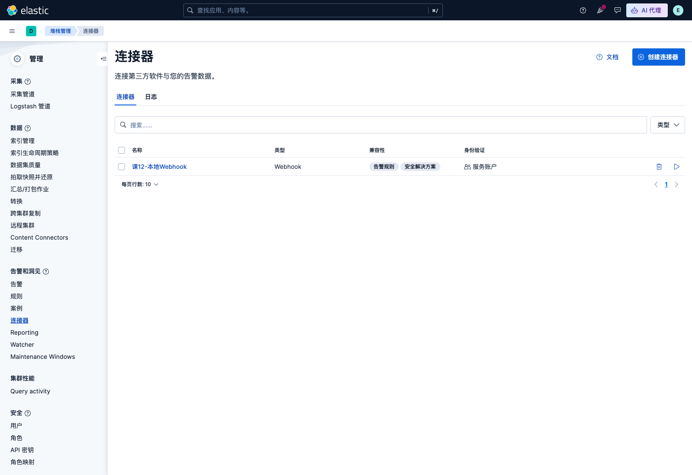
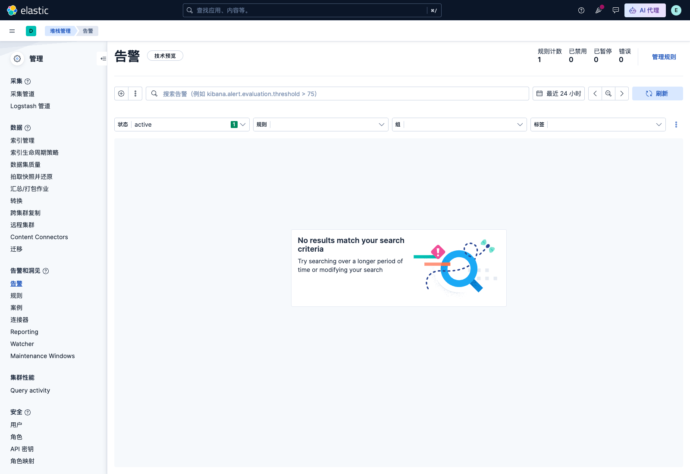
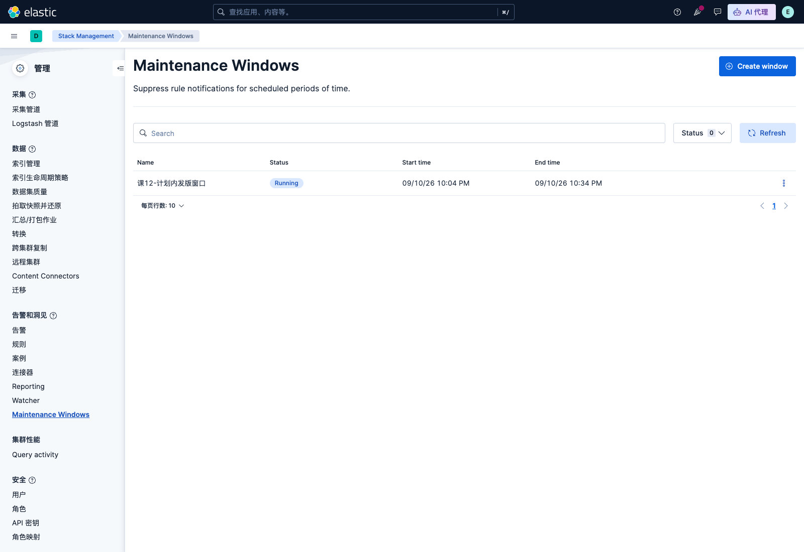
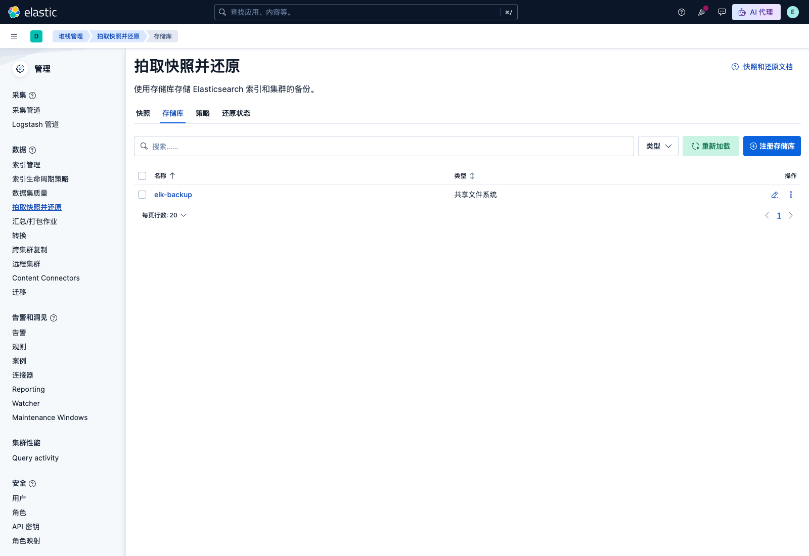
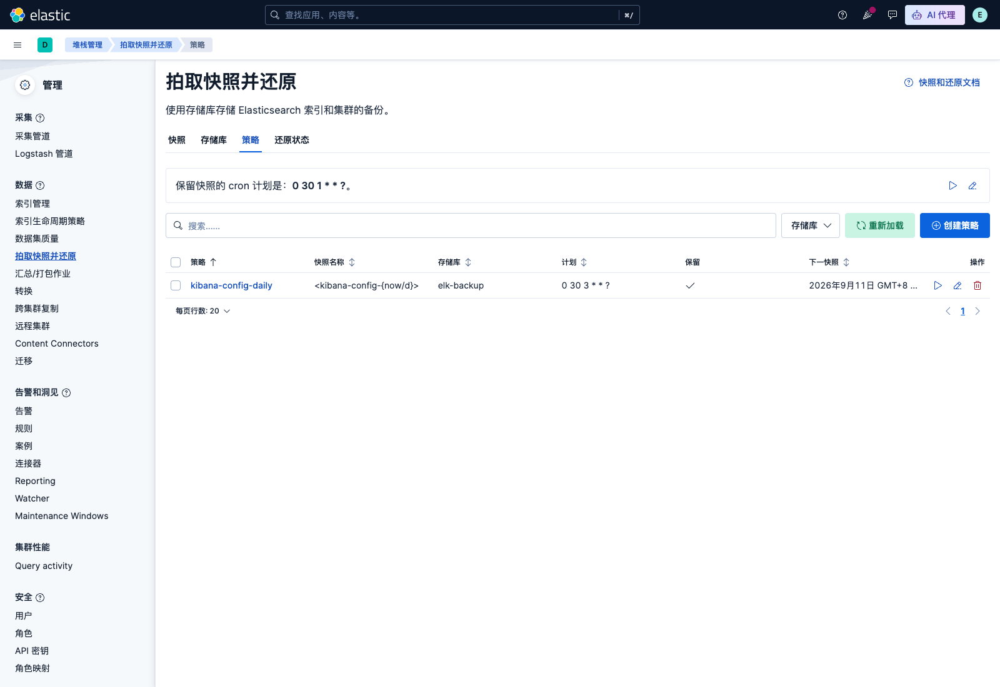
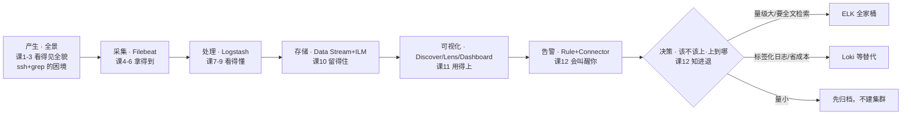

# 课 12：告警与生产落地（全课收官）

> 一句话：日志留得住也看得懂了，怎么在**出事时自动叫醒你、平时不被乱报警吵到、上线前把容量/权限/备份备齐**，最后回答那个绕不开的问题——**到底该不该上 ELK？**

## 🎯 本课目标

学完这一课，你应该能：

- 在 Kibana 配一条**告警规则**（ES query / 阈值），把它接到 **Connector**（webhook / 邮件 / Slack），并处理好静默、恢复与**告警风暴**规避
- 在日志场景做**落地运维**：做一份容量估算（日均量 × 保留天数 × 副本 × 膨胀系数）、给 Kibana Space 与 RBAC 划好权（回指 ES 主课 13）、给快照备份（回指 ES 主课 11）
- 站在选型会上，用一份**决策清单**判断"该不该上 ELK、上到哪一步就够"，并能讲清**一条日志从产生到告警触发的完整链路**（全课收束，回扣阶段 1 的日志旅程）

> 定位：本课是 **ELK 全教程的收官课**。它把阶段 4 的"留得住、用得上"推到"会叫醒人、能落地"，并在此刻**把四个阶段所有线索拧成一股**，完成整个故事主线的收束。

## 📌 知识点导航

| # | 知识点 | 关键点 | 状态 |
|---|--------|--------|------|
| 1 | 告警规则与连接器 | 规则类型（ES query / 阈值）；Connector（webhook / 邮件 / Slack）；告警静默与恢复；告警风暴怎么避免 | ✅ 已交付 |
| 2 | 容量、权限与备份 | 容量估算（日均量 × 保留天数 × 副本 × 膨胀系数）；Kibana Space 与 RBAC；快照备份 | ✅ 已交付 |
| 3 | 该不该上 ELK（决策收束） | 替代方案对比（Grafana Loki / ClickHouse / Splunk / 云厂商日志服务 / 自研）；决策清单；全课知识体系收束（回扣阶段 1 日志旅程） | ✅ 已交付 |

## 📖 本课在故事主线中的情节定位

故事推进到**第 4 幕（也就是全课的最后一幕）的收官**：主角（一条日志）在前两课里被存进了 data stream、被看成了 dashboard——它现在**看得懂、留得住、用得上**。本课补上最后一环：当它这批日志里出现"错误率飙升、某台主机失联"时，系统要**主动叫醒你**（知识点 1 的告警），而这套系统要被真实搬上生产，还得先算好容量、分好权、做好备份（知识点 2）。

> **收束点（本课知识点 3）**：故事回到阶段 1 的起点——那时你还站在服务器前逐台 `ssh` 上去 `grep`，找不到、留不住、看不懂。到这里，主角已完整走完 **"产生 → 采集 → 解析 → 存储 → 可视化 → 告警"** 的整条链。但 ELK 不是万能的，课 12 用一份**决策清单**回答最初的疑问：*什么信号该上、什么信号别上、上到哪一步就够。* 学完本课，四阶段全部闭环，你既有动手能力、又懂原理、还知道运维与边界——正是这一路 ES + ELK 想带你到达的地方。

## 正文

> 实操环境：macOS arm64 / Docker Compose（Elastic Stack 9.5.3）。本课所有命令、报错、数字均为 2026-09-08 ~ 09-10 在本机真跑记录。
>
> 基础回指：[ES 主课 13《三大主战场》](../../../../stages/5-生产与选型/lessons/lesson-13-三大主战场.md)（RBAC 基础）｜ [ES 主课 11《数据管道与备份》](../../../../stages/4-分布式与工程实践/lessons/lesson-11-数据管道与备份.md)（快照 / SLM）｜ [ES 主课 14《该不该用 ES》](../../../../stages/5-生产与选型/lessons/lesson-14-该不该用ES.md)（选型方法）。本课只讲日志场景的新增配法与收束，不重复基础。

### 🏛️ 起源与场景引入

课 11 的最后，你站在 Dashboard 前：4 块面板实时跳动，39 个错误、63 个慢调用，一目了然。

然后你合上电脑去吃饭了。

半小时后回来，发现 15:00~15:10 那波 ERROR 尖峰（课 11 Dashboard 上那 39 个错误）**已经过去 20 分钟，没有任何人知道**。Dashboard 再漂亮，它也只是**一面墙上的电视**——你不盯着看，它就什么都不是。

生产环境的现实是：**没有人能一直盯着 Dashboard**。值班工程师同时守着十几个系统，真正的需求是——

> **系统自己盯着日志，出事的时候来找我；没事的时候，别来烦我。**

这就是"告警（Alerting）"。而当你真要把它搬上生产，还要连闯三关：**容量**（日志会吃掉多少磁盘？）、**权限**（谁能看谁不能看？）、**备份**（集群挂了怎么办？）。这三关 + 一个选型决策，就是本课的全部内容。

### ❓ 认知冲突

**冲突一：配了告警，为什么反而天天被打扰？**

想象你给服务配了一条规则："ERROR 超过 1 条就告警"。上线的第一晚，你被叫醒 7 次：

- 凌晨 1:00，ERROR 出现 3 条，告警 ✓
- 凌晨 1:02，同一个问题还在，又告警 ✓（同一件事，第二次叫你）
- 凌晨 1:30，网络抖动，10 秒内冒出 4 条 ERROR 又自己好了，告警 ✓（起来一看啥事没有）
- 清晨 8:00，问题修好了，**没有人通知你**，你还在排查昨晚的问题

这四个场景对应告警系统要解决的四个机制问题：**通知只发一次还是反复发（节流）？瞬间的抖动要不要等一等（防抖）？计划内停机要不要闭嘴（维护窗口）？恢复要不要说一声（恢复通知）？** （注：这是**错误配置下**会发生的现象，Kibana 的默认行为比上面克制——但默认不等于正确，四个机制各配对一次，告警才真正"懂事"。）Kibana 的 Alerting 对这四个问题各有一套机制，配置错一个，告警就从"救命"变"扰民"。

**冲突二：为什么"我本地能跑"和"我能上线"隔着一个太平洋？**

课 2~11 的所有实操都在单机 Docker 里跑，600 条日志装得轻轻松松。但换算到真实业务：一天 50GB 日志 × 保留 30 天 × 1 副本，**光原始数据就是 3TB，倒排索引一膨胀还要翻 1.5~3 倍**。再算上"Kibana 自己也在悄悄吃你的磁盘"（本课实测证据在知识点 2）、谁有权删索引、快照往哪放——这三个问题不回答，ELK 就只能停在你的笔记本里。

### 🔍 层层揭示

#### 知识点 1：告警规则与连接器

- **一句话定义**：告警规则（Rule）= 一条按计划反复执行的查询 + 一个"结果算不算出事"的判断；连接器（Connector）= 判断成立后"通过什么渠道通知谁"的投递配置。

- **直觉建立（类比 + 类比失效边界）**：把规则想成**烟雾报警器**——传感器（查询）每分钟闻一次空气，超过烟浓度阈值（条件）就响（动作）。类比在"持续监测"这一点上成立；**失效边界**：烟雾报警器只会响，不会"自己停"，而 Kibana 告警是一个**完整的状态机**——它会追踪"这个事上一轮还在报吗"，从而区分"新出事"和"还没好"，还会在问题消失时主动发一条"恢复了"。家用的烟雾报警器没有这个状态记忆，所以别拿"响铃"去理解 Kibana 的 active / recovered。

- **核心原理**：

  **① 规则 = 类型 + 查询 + 调度 + 动作**。本机 9.5.3（trial license）实测 `GET /api/alerting/rule_types` 返回 **47 种**规则类型（随版本与 license 变化，用 `| jq '.|length'` 自查），日志场景最常用两种：
  - **Elasticsearch query（`rule_type_id: .es-query`）**：你写一条 ES 查询（KQL 或 DSL），返回条数超过阈值就算出事——最灵活，课 12 实操用它；
  - **Index threshold（`rule_type_id: .index-threshold`，指标阈值）**：对某个数值字段（如 `system.cpu.total.norm.pct`）做 avg/max 聚合再比对——适合指标型信号，不需要写查询。
  两者如何选？**要"数日志条数/按任意条件找文档"用 es-query；要对数值型指标做统计判断用 index-threshold。**

  **② Connector 是"通知出口"的插件**。webhook（自定义 HTTP）、邮件、Slack、PagerDuty 等（本机 9.5.3 实测 `GET /api/actions/connector_types` 共 **73 种**，随版本/license 变化）。**但注意许可证门槛**（本机 9.5.3 basic license 实测）：

  | Connector | basic license 可用？ | 最低 license |
  |---|---|---|
  | `.index`（写进一个索引） | ✅ 可用 | basic |
  | `.server-log`（写进 Kibana 日志） | ✅ 可用 | basic |
  | `.webhook` / `.email` / `.slack` | ❌ HTTP 403 | **gold** |

  basic 下强建 `.webhook` 连接器的实测报错原文：
  `Action type .webhook is disabled because your basic license does not support it. Please upgrade your license.`
  （本机解法：`POST /_license/start_trial?acknowledge=true` 开 30 天 trial 后创建成功。生产环境要么买 license，要么先用 `.index` 连接器把告警写进索引、再由外部程序轮询转发——这是零成本兜底方案。）

  **③ 生命周期是一个状态机**。先分清两个容易混的"状态"：
  - **规则执行状态** `execution_status.status`：这一轮查询跑得怎么样？取值 `ok`（跑成功且没超阈值）/ `active`（跑成功且超阈值）/ `error` / `warning` / `pending` 等——**它是规则的体检表，不是告警本身**；
  - **告警实例状态** `kibana.alert.status`：这件事现在怎么样了？官方枚举为 `active`（出事了）/ `recovered`（好了）/ `untracked`（不再追踪），另有 `flapping` 抖动标记。流转如下：

  ```
  （无实例/不产生文档）──超阈值──▶ active ──条件不再满足──▶ recovered
                                     ▲                        │
                                     └──────再次超阈值─────────┘
  ```

  实例本体存放在 ES 内部索引 `.internal.alerts-<consumer>.alerts-default-000001`（实测本机为 `.internal.alerts-stack.alerts-default-000001`），字段全部带 `kibana.alert.*` 前缀：`status`、`muted`、`snoozed`、`flapping`（抖动检测）、`consecutive_matches`（连续命中次数）等。这个索引**可以直接用 KQL 查**——告警历史本身也是数据。
  > ⚠️ 版本实测注：`alert_delay` 防抖生效期间，本机 9.5.3 观察到实例出现过 `kibana.alert.status: "delayed"` 的中间态（`consecutive_matches: 1`、`evaluation.value` 为实际命中数），**该取值未见于官方状态枚举文档**，属 9.5.3 实测行为，可能随版本变化——但它是理解"防抖等待期"的最好窗口，看到它不用慌。

  **④ 四个"防扰民"机制**（全部本机实测）。先补一个贯穿后面的词——**动作组（action group）**：它是"告警此刻处于哪类情形"的分类标签，动作必须挂在某个组上，只有当实例**进入**该组时才触发对应动作。ES query 规则只有两个组：`query matched`（查到了，出事）和 `recovered`（恢复了）；组同时也是实例 ID 的来源（见下）。

  - **节流 / 通知频次**：动作的 `frequency.notify_when` 控制什么时候发——`onActionGroupChange`（默认：只在组切换时发一次）、`onThrottleInterval`（按 `throttle` 间隔重复发）、`onActiveAlert`（每轮执行都发）。⚠️ API 里必须是 **snake_case 的 `notify_when`**，写驼峰 `notifyWhen` 直接 HTTP 400（实测踩坑）。
  - **防抖（alert_delay）**：`alert_delay: {active: 2}` = 连续 2 轮超阈值才算真出事（一轮 = 一次调度执行，本例即 1 分钟）。实测注入错误后第一轮实例进入 `status: delayed`、`consecutive_matches: 1`，第二轮才转 `active`——网络抖动这类"一闪而过"的信号在这里被天然过滤。顺带说清**实例（instance）**：`groupBy: all` 表示所有命中聚成一个实例（本课用法）；`groupBy: 某字段` 则按字段值分组，每个值一个独立实例、可独立静默。
  - **静默（mute）**：规则级 `POST /api/alerting/rule/{id}/_mute_all`（实测 204），单实例级 `POST /api/alerting/rule/{id}/alert/{instanceId}/_mute`（实测 204）。⚠️ **instanceId 不是告警文档的 `_id`**，而是 `kibana.alert.instance.id` 字段——`groupBy: all` 的规则下它就是动作组名（实测值 `query matched`），拿文档 `_id` 去静默会 404（实测踩坑）。静默后实例照常评估，只是 `kibana.alert.muted: true`、不发通知。
  - **维护窗口（Maintenance Window）**：见下。

  **⑤ 告警风暴的成因与规避**（面试 & 实战高频）：
  - **成因**：阈值拍脑袋（>0 就报）× 短轮询间隔 × 一个故障牵出 N 条规则（服务挂了 → CPU 告警、日志错误告警、探活告警同时炸）。
  - **规避四招**：① 阈值设"持续 N 分钟超 M"而不是瞬时值（结合 alert_delay）；② 拉长节流间隔、只在组切换时通知；③ 按严重度分级（ERROR 尖峰 = 高、单台慢调用 = 中），高严重度走 webhook/电话、低严重度写索引；④ **永远配恢复通知**——没有恢复通知，你已经修好了却还在排查。
  - 计划内停机（发版、压测）用**维护窗口**，而不是"临时禁用规则"（禁用会漏掉窗口期外的事）。

- **示例演示**（本机真跑，时间戳真实）：

  链路：本地起 webhook 收信端 → 建连接器 → 建规则 → 注入错误 → 收到 FIRING → 停止注入 → 收到 RECOVERED。

  > 约定：以下所有 `elastic:xxx` 中的 `xxx` 替换为你 compose 里的 `ELASTIC_PASSWORD`（本教程为 `ELKlearn2026`）；所有写 Kibana 的请求 `-H 'kbn-xsrf: true'` 是 Kibana 写接口的 CSRF 保护头，**非 GET 请求必带**。命令统一在 `playground/11-alerting/` 目录下执行（webhook 收信日志落盘到当前目录）。

  ```bash
  # 1) 本机起 webhook 收信端（约 50 行、只用标准库，任何 POST 都原样落盘到 ./webhook-inbox.log）
  #    脚本：playground/11-alerting/webhook-server.py   （后台常驻：python3 webhook-server.py &）
  # 2) （basic license 时先解锁 .webhook，或用 .index 连接器走兜底链路，见核心原理 ②）
  curl -u elastic:xxx -X POST 'localhost:9200/_license/start_trial?acknowledge=true'

  # 3) 创建 webhook 连接器「课12-本地Webhook」（config 里 url 用 host.docker.internal 让容器回连宿主机）
  curl -u elastic:xxx -X POST 'localhost:5601/api/actions/connector' \
    -H 'kbn-xsrf: true' -H 'content-type: application/json' -d '{
    "name": "课12-本地Webhook",
    "connector_type_id": ".webhook",
    "config": {"hasAuth": false, "method": "post",
               "url": "http://host.docker.internal:9999/kibana-alert"},
    "secrets": {}
  }'
  # → 200，记下返回的 id（本机实测 96f5b2bc-0c76-4fb2-8531-16a128f9e683），下一步要用

  # 4) 创建规则「课12-ERROR 新增告警」：logs-appdemo-* 里 log.level: ERROR，
  #    每 1m 检查一次最近 5m，条数 > 0 触发；两个动作组各挂一个 webhook 动作
  CONN=96f5b2bc-0c76-4fb2-8531-16a128f9e683   # ← 换成你上一步拿到的 id
  curl -u elastic:xxx -X POST 'localhost:5601/api/alerting/rule' \
    -H 'kbn-xsrf: true' -H 'content-type: application/json' -d "{
    \"name\": \"课12-ERROR 新增告警\",
    \"rule_type_id\": \".es-query\",
    \"consumer\": \"alerts\",
    \"schedule\": {\"interval\": \"1m\"},
    \"tags\": [\"lesson-12\", \"demo\"],
    \"params\": {
      \"searchType\": \"esQuery\", \"timeWindowSize\": 5, \"timeWindowUnit\": \"m\",
      \"size\": 100, \"thresholdComparator\": \">\", \"threshold\": [0],
      \"esQuery\": \"{\\\"query\\\":{\\\"bool\\\":{\\\"filter\\\":[{\\\"term\\\":{\\\"log.level\\\":\\\"ERROR\\\"}}]}}}\",
      \"index\": [\"logs-appdemo-*\"], \"timeField\": \"@timestamp\",
      \"excludeHitsFromPreviousRun\": false, \"aggType\": \"count\", \"groupBy\": \"all\"
    },
    \"actions\": [
      {\"group\": \"query matched\", \"id\": \"$CONN\",
       \"params\": {\"body\": \"{\\\"status\\\":\\\"FIRING\\\",\\\"rule\\\":\\\"{{rule.name}}\\\",\\\"value\\\":\\\"{{context.value}}\\\",\\\"date\\\":\\\"{{date}}\\\"}\", \"method\": \"post\"},
       \"frequency\": {\"notify_when\": \"onActionGroupChange\", \"throttle\": null, \"summary\": false}},
      {\"group\": \"recovered\", \"id\": \"$CONN\",
       \"params\": {\"body\": \"{\\\"status\\\":\\\"RECOVERED\\\",\\\"rule\\\":\\\"{{rule.name}}\\\",\\\"date\\\":\\\"{{date}}\\\"}\", \"method\": \"post\"},
       \"frequency\": {\"notify_when\": \"onActionGroupChange\", \"throttle\": null, \"summary\": false}}
    ]
  }'
  # → 200，记下返回的 id，后文用 $RULE 指代（获取方式：GET /api/alerting/rules/_find?…| jq -r '.data[0].id'）

  # 5) 注入 3 条 ERROR 日志（@timestamp=now，因为规则只看最近 5m），等约 2 分钟
  /Users/.../python3 inject-errors.py 3
  ```

  webhook 收信端真实收到的两封"信"（`webhook-inbox.log` 原文）：
  ```
  === 2026-09-08T23:10:31 POST /kibana-alert ===
  {"status": "FIRING", "rule": "课12-ERROR 新增告警", "value": "3",
   "conditions": "Number of matching documents is greater than 0",
   "date": "2026-09-08T15:10:28.524Z"}
  === 2026-09-08T23:11:31 POST /kibana-alert ===
  {"status": "RECOVERED", "rule": "课12-ERROR 新增告警",
   "date": "2026-09-08T15:11:28.573Z"}
  ```
  完整的一轮闭环恰好 60 秒（FIRING 23:10:31 → RECOVERED 23:11:31）：停止注入后，下一轮评估条件不再满足，`recovered` 组动作即被触发。注意动作模板里的 `{{rule.name}}`、`{{context.value}}`、`{{date}}`——这是 **mustache 模板语法**（`{{ }}` 占位符，投递时被真实值替换），不是 ES 的语法；这就是"告警内容可定制"的能力。

  UI 侧对应位置：**左侧导航 → 管理 → 告警和见闻 → 规则 / 连接器 / 告警**：

  

  

  维护窗口（9.5.3 中文界面里**没有翻译**，仍叫 Maintenance Windows；注意它的 API 不在 `/api/alerting` 下，而在 `/api/maintenance_window`）。创建一个 30 分钟的窗口（实测 200）：

  ```bash
  curl -u elastic:xxx -X POST 'localhost:5601/api/maintenance_window' \
    -H 'kbn-xsrf: true' -H 'content-type: application/json' -d '{
    "title": "课12-计划内发版窗口",
    "schedule": {"custom": {"start": "2026-09-10T14:04:00.000Z",
                            "duration": "30m", "timezone": "Asia/Shanghai"}}
  }'
  # → 200 {"id":"aedd3f5d-…","status":"running",…}；scope 不传 = 对所有规则生效（也可限定到具体规则）
  ```

  

  **维护窗口实测证据**：创建窗口「课12-计划内发版窗口」（30 分钟）后立刻注入 4 条 ERROR——下一轮实例照常进入 `active`（**照常检测**），但 webhook **一条通知都没发**（收件箱零新增），实例文档上多了两个字段：`kibana.alert.maintenance_window_ids: ['aedd3f5d-…']`、`kibana.alert.maintenance_window_names: ['课12-计划内发版窗口']`。结论一句话：**维护窗口 ≠ 停止监控，而是"照常检测、不打扰人"**。

- **常见误区**：
  - **用 PUT 更新规则时漏带 `actions` 字段 → 动作被静默清空**（本机实测：一次只改 `mute_all` 相关字段的 PUT 之后，`GET` 回来 `actions: []`，告警照常触发但 webhook 再也收不到）。教训：**改规则永远先 GET 完整对象、改完整个 PUT 回去**。
  - 把 `notifyWhen` 写成驼峰（API 只认 snake_case `notify_when`，实测 400）。
  - 在 PUT 里带 `mute_all` / `snooze_schedule`（9.5.3 里这两个是**只读字段**，实测报 `Additional properties are not allowed`）——静默要走专用端点 `_mute_all` / `_unmute_all`，不是改字段。
  - 拿告警文档 `_id` 去调实例级静默 → 404；要用 `kibana.alert.instance.id`。
  - **导入/迁移来的规则默认 `enabled: false`**（本机实测：Saved Objects 导入回含 alert 的 ndjson 后规则被自动禁用，需手动 `_enable`）——这是防"复制环境的规则立刻开炸"的安全设计，不是 bug。
  - 容器里 webhook 地址写 `localhost:9999`（那是容器自己）；跨到宿主机要用 `host.docker.internal`。
  - 只配 FIRING 不配 recovered 动作组 → 修好了没人知道，值班永远在"排查一个已经不存在的问题"。

- **一句话记住**：**规则是带记忆的状态机，连接器是它的嘴；发不发、发几条、什么时候闭嘴，各有专用开关——改规则必须整对象 PUT，恢复通知永远要配。**

- 📚 官方文档：
  - [Alerting 入门（Alerts and Insights）](https://www.elastic.co/guide/en/kibana/current/alerting-getting-started.html)
  - [创建与管理规则](https://www.elastic.co/guide/en/kibana/current/create-and-manage-rules.html)
  - [ES query 规则类型](https://www.elastic.co/guide/en/kibana/current/rule-type-es-query.html)
  - [动作类型（含 license 要求）](https://www.elastic.co/guide/en/kibana/current/action-types.html)
  - [维护窗口](https://www.elastic.co/guide/en/kibana/current/maintenance-windows.html)
  - [告警生产环境注意事项](https://www.elastic.co/guide/en/kibana/current/alerting-production-considerations.html)

#### 知识点 2：容量、权限与备份

> 告警会让系统"叫醒你"，但叫醒你的这套系统要真搬上生产，先得过三关：放不放得下、谁碰得着、坏了怎么办。

- **一句话定义**：生产落地的三件套——容量决定"**放不放得下**"，权限决定"**谁碰得着**"，备份决定"**坏了还能不能回来**"。

- **直觉建立（类比 + 类比失效边界）**：像**开餐厅**：容量 = 后厨冷库买多大（按每日进货量 × 存放天数算，还要留涨价的余量）；权限 = 前厅后厨分门禁（服务员进不了冷库，学徒碰不了账本）；备份 = 菜谱和账本复印存档（店烧了也能在别处重开）。**失效边界**：餐厅丢一天进货只是损失一天生意，而日志集群丢的是**唯一的排查证据**——日志通常不可再生，且"日志丢了能不能重建"这个问题，答案往往是**不能**，这决定了日志备份的优先级比多数人想象的高。

- **核心原理**：

  **① 容量估算公式**（每个数字都有实测依据）：
  ```
  总存储 ≈ 日均日志量 × 保留天数 × (1 + 副本数) × 膨胀系数(1.5~3)
  shard 数 ≈ 总存储 ÷ 单 shard 建议值(50GB 内，常取 20~50GB)
  ```
  膨胀系数来自倒排索引 + doc_values + `_source` 的开销（课 10 的 ILM 部分讲过字段爆炸会放大它）：字段少且规整的 ECS 日志取 1.5 左右，字段多、正文长的原始日志取 3。**跟我算一遍**：日增 2GB × 保留 7 天 × (1+1 副本) × 膨胀 2 = **56GB**——用 50GB 上限反推，这个规模 2 个 primary shard 就够了。是不是比直觉的"2GB 不用管"多了一个量级？副本和膨胀就是那个"多出来的量级"。

  但比公式更重要的，是**别漏了 ELK 自己的"隐形食量"**——本机实测（2026-09-10，单机 Docker，共 66 个索引 / 66 个 primary shard）：

  | 指标 | 数值 | 说明 |
  |---|---|---|
  | 业务日志（logs-appdemo-*） | **612 条，<0.1 MB** | 课 11 的 600 条 + 课 12 实测注入的 12 条错误样本 |
  | Kibana 内部 event log（`.ds-.kibana-event-log-ds-*`） | **288,379 条，59 MB** | 其中 140,516 条来自 taskManager（后台任务心跳），告警事件只有几十条 |
  | 系统索引总数 | **60 个 / 66 个** | 点开头的系统索引占了索引数的 91% |

  两天内 event log 从 14 万条（28 MB）涨到 28.8 万条（59 MB）——**你不存日志它也在涨**。它的默认保留由 **data stream lifecycle（DLM）** 管理，实测查询确认：`data_retention: 90d`。官方机制（核查于 2026-09）：自 Kibana 8.10 起 event log 从 ILM 改用 DLM 管理，**默认保留 90 天**；不想让它吃这么多，可以直接改：
  ```bash
  # 把 event log 保留期从默认 90 天收敛到 7 天（实测 acknowledged，立即生效）
  curl -u elastic:xxx -X PUT 'localhost:9200/_data_stream/.kibana-event-log-ds/_lifecycle' \
    -H 'content-type: application/json' -d '{"data_retention":"7d"}'
  ```
  同理，告警实例索引 `.internal.alerts-*` 实测绑定 `.alerts-ilm-policy`（hot 阶段 rollover：max_age 30d 或 50GB）——**这些"系统自留地"必须在容量账本里单列一行**。

  **② 权限 = ES 的 RBAC + Kibana 的 Space 双层**（RBAC 机制回指 [ES 主课 13](../../../../stages/5-生产与选型/lessons/lesson-13-三大主战场.md)，这里只讲日志场景增量）：
  - **ES 层**：角色（role）= 索引权限 + 集群权限 + Kibana 应用权限。日志场景的最小权限范式是"**只读 + 限定索引模式 + 限定 Kibana 功能**"；
  - **Kibana Space 层**：Space 是**功能隔离**（不同团队看不同的 Dashboard/Data View），**不是安全边界**——真正拦住越权访问的是角色里的 `applications` 权限。Space 之外还有高级 Space 权限可对单个对象做细粒度控制。
  - 本机实测（建角色 `log-reader` + 用户 `ops1`，五连击验证边界）：

    ```bash
    # 角色定义：索引只放行 logs-appdemo-* 的 read；Kibana 只放行 Discover/Dashboard 的 read
    # （"kibana-.kibana" 是 Kibana 在安全体系里固定的 application 名，Space 化后为 kibana-<space-id>.kibana）
    curl -u elastic:xxx -X PUT 'localhost:9200/_security/role/log-reader' -H 'content-type: application/json' -d '{
      "cluster": [],
      "indices": [{"names":["logs-appdemo-*"], "privileges":["read","view_index_metadata"]}],
      "applications": [{"application":"kibana-.kibana",
        "privileges":["feature_discover.read","feature_dashboard.read"], "resources":["*"]}]
    }'
    curl -u elastic:xxx -X PUT 'localhost:9200/_security/user/ops1' -H 'content-type: application/json' \
      -d '{"password":"***","roles":["log-reader"]}'
    ```

    | 操作（ops1） | 结果 |
    |---|---|
    | 查 `logs-appdemo-default` 条数 | ✅ 200 |
    | 查别人的索引 `ls-orders-*` | ❌ 403 |
    | 往 appdemo 写一条数据 | ❌ 403 |
    | 看用户列表 `/_security/user` | ❌ 403 |
    | 删索引 | ❌ 403 |

    一张角色 = **索引白名单 + 动作白名单 + Kibana 功能白名单**，五个方向全部拦住。

  **③ 备份的两条路线**（机制细节回指 [ES 主课 11](../../../../stages/4-分布式与工程实践/lessons/lesson-11-数据管道与备份.md)）：

  | | 快照（Snapshot） | Saved Objects 导出/导入 |
  |---|---|---|
  | 粒度 | 集群/索引级（含全局状态：模板、ILM、ingest pipeline） | 对象级（挑几个 Dashboard/规则带走） |
  | 恢复方式 | ES API restore（可改名恢复） | Kibana UI/API 导入 |
  | 自动化 | **SLM 策略**（cron 调度 + 保留策略） | 手动或脚本定时调 API |
  | 适用 | 整机灾备、迁移、升级前保险 | 跨集群搬"看板资产"、代码化（存 git） |

  关键实操事实（全部真跑）：
  - `path.repo` 是**静态设置**，只能在 elasticsearch 配置里写 + 重启生效（Docker 里加环境变量 `path.repo=/usr/share/elasticsearch/backup` + 挂载卷，实测重启后生效）；
  - 系统索引（`.kibana_9.5.3_001` 等）**只能作为 feature state 整体恢复，不能按索引改名恢复**（实测报错：`requested system indices ..., but system indices can only be restored as part of a feature state`）；
  - SLM 策略三要素：schedule（cron，如每天 3:30 `0 30 3 * * ?`）+ repository + retention（如 `expire_after: 30d, max_count: 30`）。⚠️ 策略配置的 `metadata` 里不能写保留字段名 `policy`（实测 400：`field name [policy] is reserved`）。

  **日志场景的备份优先级判断**（本课最重要的认知）：
  > **日志数据本身通常可丢可再采，但 Kibana 的配置资产（Data View / Dashboard / 告警规则 / Connector）丢了是真丢** —— 它们是 saved object，不在你的 git 里。所以日志集群备份的**第一优先级是 `.kibana*`**，其次才是近期热日志。

- **示例演示**（本机真跑完整闭环）：

  ```bash
  # ① 注册快照仓库（path.repo 已在 compose 里配好并重启生效）
  curl -u elastic:xxx -X PUT 'localhost:9200/_snapshot/elk-backup' \
    -H 'content-type: application/json' \
    -d '{"type":"fs","settings":{"location":"elk-backup","compress":true}}'

  # ② 手工拍第一张快照：只备份 Kibana 配置资产（33 个索引，SUCCESS，落盘 64MB）
  curl -u elastic:xxx -X PUT 'localhost:9200/_snapshot/elk-backup/kibana-config?wait_for_completion=true' \
    -H 'content-type: application/json' \
    -d '{"indices": ".kibana*,.internal.alerts*", "feature_states": ["kibana"],
         "include_global_state": true,
         "metadata": {"note": "DataView/Dashboard/告警规则/Connector 都在里面"}}'
  ```

  UI 对应：「管理 → 数据 → 数据管理 → **拍取快照并还原**」，存储库与策略两页：

  

  

  ```bash
  # ③ 交给 SLM：每天 3:30 自动拍，保留 30 天、至少 5 份、至多 30 份（实测创建成功并立即执行）
  curl -u elastic:xxx -X PUT 'localhost:9200/_slm/policy/kibana-config-daily' \
    -H 'content-type: application/json' -d '{
    "schedule": "0 30 3 * * ?",
    "name": "<kibana-config-{now/d}>",
    "repository": "elk-backup",
    "config": {"indices": [".kibana*"], "feature_states": ["kibana"], "include_global_state": true},
    "retention": {"expire_after": "30d", "min_count": 5, "max_count": 30}
  }'
  # 手动触发一次验证：POST /_slm/policy/kibana-config-daily/_execute
  # → {"snapshot_name":"kibana-config-2026.09.10-j8n_qh5hq0slgz2viunzqw"}  日期模板真实生效
  ```

  **④ Saved Objects 路线 —— 真"误删复生"演练**：
  ```bash
  # 导出全部可视化资产（实测 8 个对象：1 Data View + 4 Lens + 1 规则 + 1 连接器 + 1 Dashboard）
  curl -u elastic:xxx -X POST 'localhost:5601/api/saved_objects/_export' \
    -H 'kbn-xsrf: true' -H 'content-type: application/json' \
    -d '{"type": ["dashboard","index-pattern","lens","alert","action","visualization"]}' \
    -o kibana-saved-objects.ndjson
  # 模拟误删 Dashboard
  curl -u elastic:xxx -X DELETE 'localhost:5601/api/saved_objects/dashboard/aa1f336c-…'   # → 200，列表 total=0
  # 从备份文件整包恢复
  curl -u elastic:xxx -X POST 'localhost:5601/api/saved_objects/_import?overwrite=true' \
    -H 'kbn-xsrf: true' --form file=@kibana-saved-objects.ndjson
  # → {"success":true, "successCount":8}  8 个对象全部回来，Dashboard 复生
  ```
  这份 ndjson 就是你看板资产的"git 版本"——**把它提交进代码仓库，才算真正意义上的配置备份**。

- **常见误区**：
  - 容量只算"日志量 × 天数"，**漏副本 × 漏膨胀系数 × 漏系统索引/event log**（本机实测系统索引占了 60/66 个索引位、event log 59MB 是业务数据的 600 倍）。
  - 以为 Kibana Space 是安全边界——Space 只做功能隔离，越权拦截靠角色 `applications` 权限。
  - 用 superuser（elastic）账号给应用/采集端直连——权限最小化从"不用 elastic 账号"开始。
  - 备份只想着备日志数据，**没备 `.kibana*`**——恰恰告警规则、连接器、看板才是丢了重建成本最高的（连接器还涉及加密密钥，见误区下条）。
  - **`XPACK_ENCRYPTEDSAVEDOBJECTS_ENCRYPTIONKEY` 没配**：连接器/规则这类加密 saved object 直接创建 500（本机实测坑，课 12 已在 compose 里修复并注释）。且这个 key 一旦定下**不能随意换**——换了旧密钥加密的连接器将无法解密；多 Kibana 实例必须共用同一个 key。**备份这个 key，本身就是备份的一部分**。
  - 快照仓库没配 `path.repo` 就想注册 fs 仓库；或配了没重启节点，以为热改能生效。
  - 恢复时直接覆盖现有 `.kibana*`——正确姿势是先验证快照、在低峰窗口操作、恢复后重启 Kibana。

- **一句话记住**：**容量账本要给"系统自留地"留一行；Space 是隔离不是权限；日志可再采、看板规则不可再生——先备 `.kibana`，再谈别的。**

- 📚 官方文档：
  - [快照与恢复](https://www.elastic.co/guide/en/elasticsearch/reference/current/snapshot-restore.html)
  - [SLM 策略 API](https://www.elastic.co/guide/en/elasticsearch/reference/current/slm-api-put-policy.html)
  - [Data stream lifecycle](https://www.elastic.co/guide/en/elasticsearch/reference/current/data-stream-lifecycle.html)
  - [ILM 与索引生命周期](https://www.elastic.co/guide/en/elasticsearch/reference/current/ilm-index-lifecycle.html)
  - [创建/更新角色 API](https://www.elastic.co/guide/en/elasticsearch/reference/current/security-api-put-role.html)
  - [Saved Objects 导出 API](https://www.elastic.co/guide/en/kibana/current/saved-objects-api-export.html) ／ [导入 API](https://www.elastic.co/guide/en/kibana/current/saved-objects-api-import.html)
  - [shard 规模规划](https://www.elastic.co/guide/en/elasticsearch/reference/current/size-your-shards.html)

#### 知识点 3：该不该上 ELK（决策收束）

> 三关都过了，最后一问：这套系统到底值不值得上？——把全课知识换成一张选型清单，也是给整个 ELK 教程收尾。

- **一句话定义**：上不上 ELK，不是"ELK 好不好"，而是**你的查询形状 × 数据量级 × 预算 × 团队运维能力**四个变量的求解——本课给你一张能当着选型会填的清单。

- **直觉建立（类比 + 类比失效边界）**：像**买房 vs 租房 vs 住酒店**：ELK 是买房（自由、可深度改造，但要还贷 = 运维成本）；云厂商日志服务是租房（拎包入住、按月付费，装修受房东限制）；Loki 是合租青年公寓（便宜、够住，但全是公共区域 = 只按标签查）；Splunk 是高端服务式公寓（服务到位，账单也到位）。**失效边界**：租房比喻在"数据主权"上失效——日志里若有合规要求（金融、政务），SaaS/云外的数据出境可能是硬约束，这不是价格能衡量的维度。

- **核心原理**：

  **① 竞品坐标轴**（核查于 2026-09）：

  | 方案 | 索引模型 | 成本特征 | 最适场景 | 关键短板 |
  |---|---|---|---|---|
  | **ELK / Elastic Stack** | 全文倒排索引（每词可查） | 存储贵、运维重（JVM 集群） | 深度全文检索、复杂聚合、安全审计、已有 Kibana 资产 | 资源占用高；高版本 license 分层 |
  | **Grafana Loki** | **只索引标签，不索引正文**（官方原文：*"does not index the contents of the logs, but only indexes metadata ... as a set of labels"*，核查于 2026-09） | 压缩块进对象存储，存储开销远低于全文索引 | K8s 标签化日志、已有 Grafana/Prometheus 体系、预算敏感 | 全文检索弱（先选流再 grep）；聚合分析不如 ES |
  | **ClickHouse 系** | 列存 + 稀疏索引 | 查询吞吐极高，需自建导入链路 | 日志当"数据仓库"用、超大事件量 + 重 SQL 分析 | 无现成 UI 生态（需配 Grafana）；运维链路自建 |
  | **Splunk** | 全文索引 + 自有查询语言 | 按摄入量计费，商业定价最高（社区共识；思科 2024 年宣布、2025 年完成收购，产品与定价持续调整） | 有预算的大型企业、SIEM/合规 | 贵；数据出境敏感行业受限 |
  | **云厂商日志服务**（阿里云 SLS / 腾讯云 CLS / AWS CloudWatch Logs） | 云厂商托管索引 | 按量付费：实测腾讯云 CLS 刊例写入流量 ¥0.18/GB、索引流量 ¥0.35/GB、标准存储 ¥0.0115/GB/日（核查于 2026-09，价格以官网为准；⏳ 具体折扣与免费额度置信度：低） | 已在对应云上、要免运维、中小流量 | 单云绑定；多云无统一视图；深度定制受限 |
  | **自研/轻量组合** | — | 开发成本最高 | 有特殊合规/成本约束的团队 | 长期维护成本容易被低估 |

  > ⏳ 置信度说明：各家"便宜几倍"的具体倍数，社区口径从 3 倍到 20 倍不等（受保留天数、压缩比、副本策略影响巨大），**本课不采信任何单一倍数**；确定的是架构性差异：Loki 只索引标签 → 索引体积和内存需求显著低于全文索引方案。真要算账，用你**自己的日志量**套公式（知识点 2 的容量公式）+ 各家刊例价。

  **② 决策清单（选型会现场版）**——逐条打钩：

  **「什么信号该上」**（勾 2 条以上，值得上集中式日志）：
  - ☐ 服务数 ≥ 3，或部署实例 ≥ 5，逐台 grep 已经开始超时
  - ☐ 一个请求跨多台机器，需要按 traceId 串起来看
  - ☐ 有"分钟级发现错误尖峰"的值班需求（告警）
  - ☐ 有审计/合规要查历史日志且需要权限控制
  - ☐ 团队已被"各服务日志格式不一"反复折磨（需要统一解析管道）

  **「什么信号别上（或先别上）」**：
  - ☐ 单服务单机，日志 `tail -f` + `grep` 5 分钟内能解决
  - ☐ 日量 < 1GB 且没有跨服务关联需求——上一套 ELK 的运维成本 > 收益
  - ☐ 只是想"存着以防万一"→ 先上对象存储归档（Logstash 直接写 OSS/S3），别为"万一"养一个集群
  - ☐ 团队没人愿意背 ELK 的运维（JVM 调优、shard 规划、水位监控）——先选托管

  **「上到哪一步就够」**（渐进路线，别一步到顶）：
  1. **第 0 步**：Filebeat → ES → Kibana 单节点，只做 Discover 查日志（本教程课 1-6 的能力）；
  2. **第 1 步**：加 ILM + data stream（课 10），把"存"管起来；
  3. **第 2 步**：加 Dashboard + 3~5 条告警（课 11-12），把"用"补齐；
  4. **第 3 步**：加 RBAC + Space + SLM 备份（本课），把"管"补齐——**到此为止已覆盖 80% 团队的全部需求**；
  5. **第 4 步（仅大流量才考虑）**：集群化、冷热分层、双栈（Loki 存长尾 + ES 存高价值）。
  > 每一步都要"上一级出了痛感"再走——**大部分团队死在"直接按第 4 步的架构起步"**。

- **示例演示**：套一个真实场景走清单——**"5 人后端团队，12 个微服务跑在 20 台云主机上，日增日志 8GB，老板要求'线上问题 10 分钟内响应'"**：
  - 信号清单：服务数 ✓、跨服务排查 ✓、值班告警 ✓ → **该上**；
  - 已在某云上 → 云厂商日志服务 vs 自建 ELK：8GB/日 × 30 天 ≈ 240GB 原始量，用容量公式算自建磁盘需求 ≈ 240 × 2 × 2 = **~1TB**（含副本与膨胀），需要 1~2 名懂 ES 运维的人；云服务同量级粗算（以 CLS 刊例）：索引流量 240GB × ¥0.35 ≈ ¥84/月 + 写入 240GB × ¥0.18 ≈ ¥43/月 + 存储 240GB × ¥0.0115 × 30 天 ≈ ¥83/月 ≈ **每月两百元上下**（⏳ 未计折扣与低频分层，置信度：中）且零运维 → **推荐先上云服务**，等出现"深度全文检索/复杂聚合"需求再评估双栈；
  - 若老板给的是"要建安全审计体系" → 合规与细粒度权限成为第一需求，ELK（或 Elastic Cloud）权重上升。
  同样三个答案装进决策清单，不同输入 → 不同输出，这就是"决策收束"的含义：**不是标准答案，是可复算的推理过程**。

- **常见误区**：
  - 拿"别人家都用 ELK"当理由——人家的日志量、团队配置、合规要求和你不同；
  - 把替代方案当敌人——**双栈是常态**：Loki/对象存储吃长尾低价值日志，ES 吃需要深度检索的高价值日志；
  - 以为"上了 ELK = 告警自动化"——告警的价值取决于阈值设计（知识点 1），垃圾进垃圾出；
  - 忽略数据主权与出境合规——金融/政务选 SaaS 前先过法务；
  - 低估"第 3 步之后"的运维投入——SLM、水位监控、license 成本是持续性支出，不是一次性搭建。

- **一句话记住**：**查询形状决定方案，量级决定成本，团队能力决定上下限——清单逐条打钩，别按"最热门"抄作业。**

- 📚 官方文档：
  - [Grafana Loki 概览（标签索引模型官方表述）](https://grafana.com/docs/loki/latest/get-started/overview/)
  - [Elastic Stack 数据流与生命周期](https://www.elastic.co/guide/en/elasticsearch/reference/current/data-streams.html)
  - [shard 规模规划（容量估算依据）](https://www.elastic.co/guide/en/elasticsearch/reference/current/size-your-shards.html)
  - [ES 主课 14《该不该用 ES》](../../../../stages/5-生产与选型/lessons/lesson-14-该不该用ES.md)（选型方法论）

### 🛠️ 实操验证

> 本课全部实操在 `playground/11-alerting/` 完成，以下是完整回放清单。**每条命令均已真跑**，输出为实测原文。

1. **环境与前置**（`playground/07-reliability/docker-compose.yml`）：
   - Kibana 补配 `XPACK_ENCRYPTEDSAVEDOBJECTS_ENCRYPTIONKEY`（加密 saved object 必需）；
   - ES 补配 `path.repo` + 快照卷（备份必需）；
   - 确认 ES:9200 / Kibana:5601 存活、`logs-appdemo-default` 有 600+ 条数据。
2. **告警链路闭环**（命令统一在 `playground/11-alerting/` 目录下执行，webhook 日志才落到脚本同目录）：
   ```bash
   cd playground/11-alerting
   # 起本地 webhook 收信端（后台常驻）
   python3 webhook-server.py &
   # basic license 想完整体验的兜底链路：建 .index 连接器（basic 可用）→
   #   告警写进专用索引 → KQL 轮询该索引代替 webhook——零成本跑通全流程
   # 本课路线：开 trial license 解锁 .webhook
   curl -u elastic:xxx -X POST 'localhost:9200/_license/start_trial?acknowledge=true'
   # 建连接器、建规则（完整 curl 见知识点 1 示例演示）
   # 注入错误 → 观察
   python3 inject-errors.py 3
   tail -f webhook-inbox.log
   # → FIRING（value=3，23:10:31）→ 停止注入 → RECOVERED（23:11:31，恰好一轮闭环）
   ```
3. **防抖与静默**：
   ```bash
   # alert_delay 防抖：更新规则加 "alert_delay": {"active": 2}，再注入 4 条
   # → 实例 status=delayed，consecutive_matches=1（第一轮），第二轮才 active
   # 规则级静默/解除（$RULE 从 GET /api/alerting/rules/_find 里取 .data[0].id）
   curl -u elastic:xxx -X POST "localhost:5601/api/alerting/rule/$RULE/_mute_all"    # 204
   curl -u elastic:xxx -X POST "localhost:5601/api/alerting/rule/$RULE/_unmute_all"  # 204
   # 实例级静默（$INSTANCE 取自告警文档字段 kibana.alert.instance.id，不是 _id！）
   curl -u elastic:xxx -X POST "localhost:5601/api/alerting/rule/$RULE/alert/$INSTANCE/_mute"    # 204
   # 维护窗口（30 分钟）创建后注入 4 条 ERROR（API 见知识点 1）：
   # → 实例照常 active + mw_ids=[窗口id]，webhook 零投递 ✓
   ```
4. **容量取证**：
   ```bash
   curl -u elastic:xxx 'localhost:9200/_cat/indices?expand_wildcards=all&h=index,pri,docs.count,store.size&bytes=mb'
   # → 66 索引 / 66 primary shard；event log 28.8 万条 59MB；业务日志 612 条 <0.1MB
   # 收敛 event log 保留期（DLM 90d → 7d）
   curl -u elastic:xxx -X PUT 'localhost:9200/_data_stream/.kibana-event-log-ds/_lifecycle' \
     -H 'content-type: application/json' -d '{"data_retention":"7d"}'
   ```
5. **权限五连击**：建 `log-reader` 角色 + `ops1` 用户 → 按知识点 2 的表格逐条验证 200/403。
6. **备份双路线**：
   ```bash
   # 快照 + SLM（见知识点 2 示例演示 ①~③）；Saved Objects 误删复生演练（④）
   ```
   验收标准：①webhook 收到 FIRING 和 RECOVERED 各至少一条（真实记录见知识点 1 示例演示：23:10:31 FIRING value=3 → 23:11:31 RECOVERED，恰好一轮闭环）；②delayed 状态被抓拍到 `consecutive_matches=1`；③维护窗口期间 webhook 零投递而实例照常 active；④`ops1` 五连击全符合预期；⑤删除的 Dashboard 从 ndjson 完整恢复（successCount=8）。

### 🧭 体系收束

现在，把四个阶段拧成一股。一条日志的一生，你已经陪它走完了全程：



回望阶段 1 的那个傍晚：你逐台 ssh 上服务器 `grep` 一个 ERROR，找不到、留不住、看不懂。而现在——

| 阶段 | 能力 | 一句话 |
|---|---|---|
| 1 · 全景与起步 | 架构地图 + 起容器 | 看得见全貌 |
| 2 · 采集层 Beats | Filebeat 四种配法 | 拿得到 |
| 3 · 处理层 Logstash | grok / 条件 / 多管道 | 看得懂 |
| 4 · 存储可视化与落地 | data stream / Dashboard / 告警 / 决策 | 留得住 · 用得上 · 会叫醒你 · 知进退 |

ELK 教程到此收官。当初那个傍晚的三个困境，如今都有了答案：**找不到 → 全文秒级检索；留不住 → data stream + ILM 管保留；看不懂 → 结构化解析 + 看板 + 告警**。合上课本前，给自己做一次能力自检——以下 5 件事，你能不看讲义独立完成几件？

1. 起一套 ES + Kibana，把一份 json 日志采进来并存成 data stream（课 1-6、10）；
2. 把一段不认识的日志格式用 grok 解析成结构化字段（课 7-9）；
3. 从 Discover 到一条 KQL，再到一块 4 面板 Dashboard（课 11）；
4. 配一条"ERROR 尖峰就通知"的告警，并说清它的防抖、静默、恢复分别怎么配（本课）；
5. 说出你为什么（不）选 ELK，以及选了之后容量怎么估、权限怎么分、备份怎么备（本课）。

答不上来的，回对应课重走一遍——这正是接下来**结课综合实战**要检验的：把一个真实服务的日志，从零走到告警，全程你自己来。

## 🐞 常见误区（速查）

- **阈值拍脑袋**：">0 就报" + 1 分钟轮询 = 告警风暴。改用"持续 N 分钟超 M" + `alert_delay`。
- **恢复通知没配**：修好了没人说，值班一直 P0。`recovered` 动作组永远要配。
- **PUT 规则漏 `actions`**：动作被静默清空（实测坑），改规则 = GET 全量 → 改 → PUT 全量。
- **驼峰 `notifyWhen` / PUT 带 `mute_all`**：双双 400；静默走 `_mute_all` 端点。
- **实例静默用文档 `_id`**：404；用 `kibana.alert.instance.id`。
- **Connector 走 HTTPS/localhost**：端口不通或地址错；容器到宿主用 `host.docker.internal`。
- **容量漏算**：副本、膨胀系数、系统索引、event log（本机实测它是业务数据的 600 倍体积）。
- **Space 当安全边界**：越权拦截靠 RBAC，Space 只管功能隔离。
- **没配加密 key**：连接器/规则创建 500（`XPACK_ENCRYPTEDSAVEDOBJECTS_ENCRYPTIONKEY`）。
- **`path.repo` 想热改**：静态设置，写配置 + 重启。
- **导入规则后没启用**：导入的 alert 默认 `enabled: false`，记得 `_enable`。
- **备份只备日志不备 `.kibana`**：看板/规则/连接器才是不可再生的资产。

## 📋 命令速查卡

```bash
# 约定：xxx = 你的 ELASTIC_PASSWORD（本教程 ELKlearn2026）；写 Kibana 的非 GET 请求必带 kbn-xsrf 头
# $RULE  = curl -u elastic:xxx 'localhost:5601/api/alerting/rules/_find?page=1&per_page=10' \
#            -H 'kbn-xsrf: true' | jq -r '.data[0].id'
# $INSTANCE = 告警文档字段 kibana.alert.instance.id（groupBy:all 时即动作组名，如 query matched）

# ── 环境（macOS + Docker Compose）──────────────────────────────
open -a Docker                                   # 启动 daemon（本机默认不自启）
cd playground/07-reliability && docker compose up -d

# ── 告警：license 与规则 ────────────────────────────────────────
curl -u elastic:xxx -X POST 'localhost:9200/_license/start_trial?acknowledge=true'   # basic→trial(30d)
curl -u elastic:xxx 'localhost:5601/api/alerting/rule_types' | jq '.|length'          # 规则类型数
curl -u elastic:xxx 'localhost:5601/api/actions/connector_types' | jq '.|length'      # 动作类型数
curl -u elastic:xxx 'localhost:5601/api/alerting/rules/_find?page=1&per_page=10' -H 'kbn-xsrf: true'
curl -u elastic:xxx -X POST "localhost:5601/api/alerting/rule/$RULE/_enable"  -H 'kbn-xsrf: true'
curl -u elastic:xxx -X POST "localhost:5601/api/alerting/rule/$RULE/_mute_all"  -H 'kbn-xsrf: true'
curl -u elastic:xxx -X POST "localhost:5601/api/alerting/rule/$RULE/_unmute_all" -H 'kbn-xsrf: true'
# 实例级静默：instance id 取自文档字段 kibana.alert.instance.id（不是 _id）
curl -u elastic:xxx -X POST "localhost:5601/api/alerting/rule/$RULE/alert/$INSTANCE/_mute" -H 'kbn-xsrf: true'
# （创建 connector / rule 的完整 curl 见知识点 1 示例演示，速查卡不重复长 payload）

# ── 告警实例的底细（就是普通 ES 索引，直接查）──────────────────
curl -u elastic:xxx 'localhost:9200/.internal.alerts-stack.alerts-default-000001/_search?size=5&sort=@timestamp:desc'

# ── 容量三查 ────────────────────────────────────────────────────
curl -u elastic:xxx 'localhost:9200/_cat/indices?expand_wildcards=all&h=index,pri,docs.count,store.size&bytes=mb&s=store.size:desc'
curl -u elastic:xxx 'localhost:9200/_cluster/stats?filter_path=indices.shards.total,indices.count'
curl -u elastic:xxx 'localhost:9200/_data_stream/.kibana-event-log-ds/_lifecycle'     # 看系统索引保留期
curl -u elastic:xxx -X PUT 'localhost:9200/_data_stream/.kibana-event-log-ds/_lifecycle' \
  -H 'content-type: application/json' -d '{"data_retention":"7d"}'                    # 收敛保留期

# ── 权限最小化 ──────────────────────────────────────────────────
curl -u elastic:xxx -X PUT 'localhost:9200/_security/role/log-reader' -H 'content-type: application/json' -d '{
  "cluster": [],
  "indices": [{"names":["logs-appdemo-*"], "privileges":["read","view_index_metadata"]}],
  "applications": [{"application":"kibana-.kibana",
    "privileges":["feature_discover.read","feature_dashboard.read"], "resources":["*"]}]}'
curl -u elastic:xxx -X PUT 'localhost:9200/_security/user/ops1' -H 'content-type: application/json' \
  -d '{"password":"***","roles":["log-reader"]}'

# ── 备份：快照 + SLM + Saved Objects ───────────────────────────
# path.repo 必须在 ES 配置里（静态）+ 重启；仓库目录宿主侧 chmod 777（容器 uid 1000 可写）
curl -u elastic:xxx -X PUT 'localhost:9200/_snapshot/elk-backup' -H 'content-type: application/json' \
  -d '{"type":"fs","settings":{"location":"elk-backup","compress":true}}'
curl -u elastic:xxx -X PUT 'localhost:9200/_snapshot/elk-backup/kibana-config?wait_for_completion=true' \
  -H 'content-type: application/json' \
  -d '{"indices":".kibana*,.internal.alerts*","feature_states":["kibana"],"include_global_state":true}'
curl -u elastic:xxx -X PUT 'localhost:9200/_slm/policy/kibana-config-daily' -H 'content-type: application/json' -d '{
  "schedule": "0 30 3 * * ?", "name": "<kibana-config-{now/d}>", "repository": "elk-backup",
  "config": {"indices": [".kibana*"], "feature_states": ["kibana"], "include_global_state": true},
  "retention": {"expire_after": "30d", "min_count": 5, "max_count": 30}}'
curl -u elastic:xxx -X POST 'localhost:9200/_slm/policy/kibana-config-daily/_execute'      # 立即执行一次

# 对象级备份（Kibana 配置资产 → 可入 git）
curl -u elastic:xxx -X POST 'localhost:5601/api/saved_objects/_export' -H 'kbn-xsrf: true' \
  -H 'content-type: application/json' \
  -d '{"type": ["dashboard","index-pattern","lens","alert","action","visualization"]}' -o so.ndjson
curl -u elastic:xxx -X POST 'localhost:5601/api/saved_objects/_import?overwrite=true' \
  -H 'kbn-xsrf: true' --form file=@so.ndjson
```

## 🚀 下一批接力提示词

课 12 交付即 ELK 全部 12 课 / 36 知识点完成。接下来：

1. **同步活文档**：更新 `00-学习档案.md`（36/36，阶段 4 闭环）、`00-评审清单.md`（课 12 勾选）、`02-课程目录.md`（课 12 ✅）、`AGENTS.md`（进度同步）；
2. **结课综合实战**（Phase 3）：从零起一套 ELK，把一个真实应用（如 `app-demo`）的日志走到告警——采集→解析→存储→看板→告警→备份全链路独立完成，产出 `projects/` 实战档案；
3. 若实战完成，进入 Phase 6 知识点对齐（可选）。

> 复制即用：`继续学 ELK。我的学习档案在 elasticsearch/elk/00-学习档案.md，ELK 12 课全部完成（36/36 知识点），请启动结课综合实战项目。`

## 🧭 课程导航

- **上一课**：[课 11：Kibana 从 Discover 到 Dashboard](lesson-11-Kibana从Discover到Dashboard.md)
- **返回阶段**：[阶段 4 存储可视化与落地 overview](../overview.md)
- **上一阶段**：[阶段 3 处理层 Logstash](../../3-处理层Logstash/overview.md)
- **全课起点**：[阶段 1 全景与起步](../../1-全景与起步/overview.md)（回扣"一条日志的旅程"）
- **基础回指**：[ES 主课 14《该不该用 ES》](../../../../stages/5-生产与选型/lessons/lesson-14-该不该用ES.md) ｜ [ES 主课 13《三大主战场》](../../../../stages/5-生产与选型/lessons/lesson-13-三大主战场.md) ｜ [ES 主课 11《数据管道与备份》](../../../../stages/4-分布式与工程实践/lessons/lesson-11-数据管道与备份.md)
