# Elasticsearch 系统学习 · 课程手册

> 本手册汇总 `elasticsearch/` 全部教学内容：5 个阶段 15 课（46 知识点）+ 实战经验 / 排障速查手册 / 场景解法库。
> **定位**：复习与速查用的「一本书」。想系统学请回到各课原文（本手册每课都给了链接），想查问题直接翻 [五、实战与排障](#五实战与排障)。
> 汇总完成时间：2026-09-02 ｜ 知识点进度：**46 / 46 已完成** 🎉

## 怎么用这本手册

| 你的目的 | 看哪里 |
|---------|--------|
| 快速回忆全课讲了什么 | [一、阶段总览](#一阶段总览) → [六、知识点总索引](#六知识点总索引) |
| 忘了某一课的细节 | [二、全部课时汇总](#二全部课时汇总)，按阶段找到该课的「一图总结 + 核心结论 + 链接」 |
| 想动手练，把知识焊成能力 | [四、综合实战项目：商品搜索服务](#四综合实战项目商品搜索服务) |
| 只想知道最该记住的十条 | [三、收束：十个结论](#三收束十个一辈子受用的结论) |
| 查询出问题了按什么顺序查 | [四层排查法](#四层排查法) |
| 想知道「我该不该用 ES」 | [课 14 决策清单](#课-14该不该用-es) + [08 适用边界](08-实战经验.md) |
| 线上出问题了 | [五、实战与排障](#五实战与排障)（排障手册按症状倒查） |
| 新要求来了怎么设计 | [10 · 场景解法库](10-场景解法库.md)（8 个场景，多解法权衡，先想后看） |

## 故事主线

- **主角**：一个「搜索框」——老板说「加个搜索框，用户输『苹果手机』要能搜到 iPhone」
- **冲突**：你第一反应是 SQL `LIKE '%苹果手机%'`。上线后发现：慢、搜不准、排不好、还没有高亮
- **收束**：从「写 SQL 的人」成长为「懂搜索的人」——知道 ES 凭什么快、什么时候快、什么时候别用它

五个阶段对应能力增长的五个台阶：**动机（为什么）→ 原理（凭什么快）→ 检索（怎么问）→ 分布式（怎么扛）→ 选型（该不该用）**。

---

## 一、阶段总览

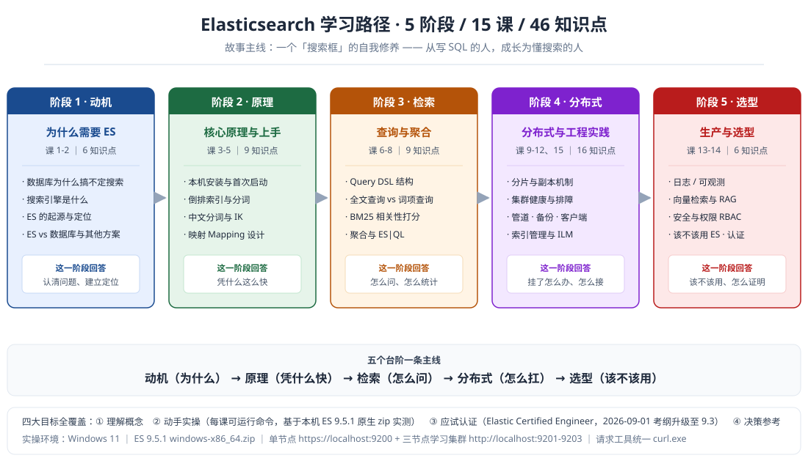

| 阶段 | 主题 | 本阶段回答 | 必须掌握 | 对应课 |
|------|------|-----------|---------|--------|
| 1 | 为什么需要 ES（动机） | 数据库为什么搞不定搜索？ES 是谁、凭什么 | 能解释「为什么 `LIKE '%x%'` 会全表扫」「ES 不是数据库，是主库的旁路」 | 课 1-2 |
| 2 | 核心原理与上手（原理） | ES 凭什么搜得这么快？怎么把它跑起来 | 能讲清倒排索引 + 分词三工序；能建结构合理的索引并配上中文分词 | 课 3-5 |
| 3 | 查询与聚合（检索） | 怎么向 ES 提问？结果凭什么这么排？怎么做统计 | `match`/`term` 不混用；`filter` 不打分；BM25 可用 `_explain` 手算；聚合必须用 keyword | 课 6-8 |
| 4 | 分布式与工程实践（分布式） | 数据怎么分布？挂了怎么办？怎么接进真实项目？索引怎么管、数据怎么老 | 分片数不可改；副本是数据第二份存在；bulk 要查 `errors`；应用只认别名 | 课 9-12、15 |
| 5 | 生产与选型（选型） | ES 在我的场景里该不该用？怎么证明我会 | **ES 是索引副本，不是原始账本**；401/403 分得清；9.3 考纲变化 | 课 13-14 |

**各阶段的关键认知**（从阶段概览提炼，每条都在本机实测过）：

- **阶段 1**：搜索引擎 = 倒排索引 + 分词 + 打分。MySQL FULLTEXT 救不了中文（内置解析器不认中文，ngram 是机械切字）
- **阶段 2**：`_source` 是原件，倒排索引 / doc_values 是按映射重抄的副本——**映射错了，副本就错了，而副本才是真正干活的那个**
- **阶段 3**：`match` 和 `term` 是新手第一道坎；`from`/`size` 上限 10000，深分页用 `search_after`，全量导出用 `scroll`
- **阶段 4**：**客户端版本只能往下看一个大版本**（`compatible-with=N`，服务端只接受 N 或 N-1）；**同步的命门是幂等**（业务主键当 `_id`）；**深分页别硬调 `max_result_window`**
- **阶段 5**：**分片不是越多越好**（1/3/50 主分片，同样 3000 条数据：p95 = 16.58/16.48/35.90 ms，存储 77.3/88.9/361.9 kb，50 片慢 2.2 倍、存储 4.7 倍，而 p50 几乎没差——**代价在长尾不在均值**）

---

## 二、全部课时汇总

## 阶段 1：为什么需要 ES（课 1-2 · 6 知识点）

> 本阶段回答：数据库为什么搞不定搜索？ES 是什么、能干什么、跟别的有啥不一样？
> [阶段概览](stages/1-为什么需要ES/overview.md)

### 课 1：为什么数据库搞不定搜索

**知识点**：数据库模糊查询的痛点 · 搜索引擎是什么 · ES 能干什么（四大场景）

**一图总结**

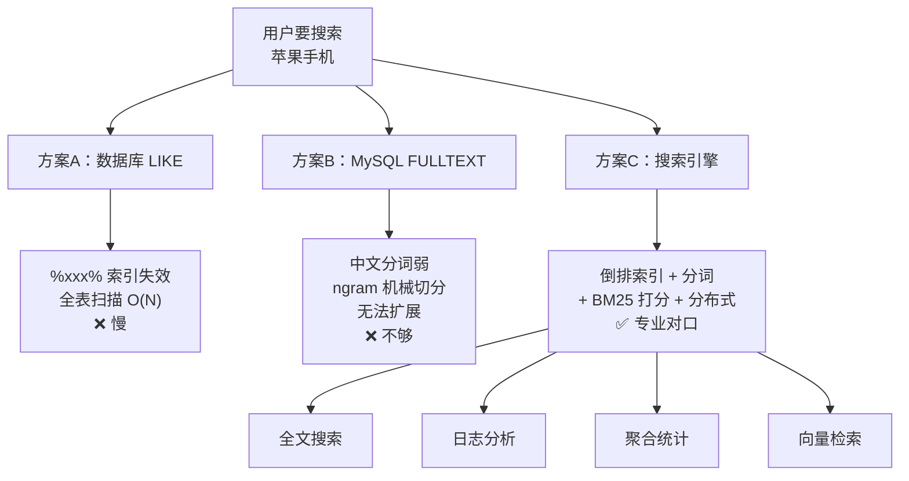

**核心结论**：

1. **`LIKE '%xxx%'` 让索引失效**——前导通配符破坏了 B+ 树的有序性，只能全表扫描
2. **MySQL FULLTEXT 救不了中文**——内置解析器不认识中文，ngram 是机械切字而非语义分词
3. **搜索引擎 = 倒排索引 + 分词 + 打分**——ES 把这三点做扎实，还加上了分布式

⚠️ **高频坑**：以为「加个 FULLTEXT 索引就行了」——中文场景下它既不准也不可扩展。

> 📖 [课 1 全文](stages/1-为什么需要ES/lessons/lesson-01-为什么数据库搞不定搜索.md)

### 课 2：ES 是谁、凭什么

**知识点**：ES 起源与定位 · 核心概念全景 · ES vs 数据库与其他方案对比

**一图总结**

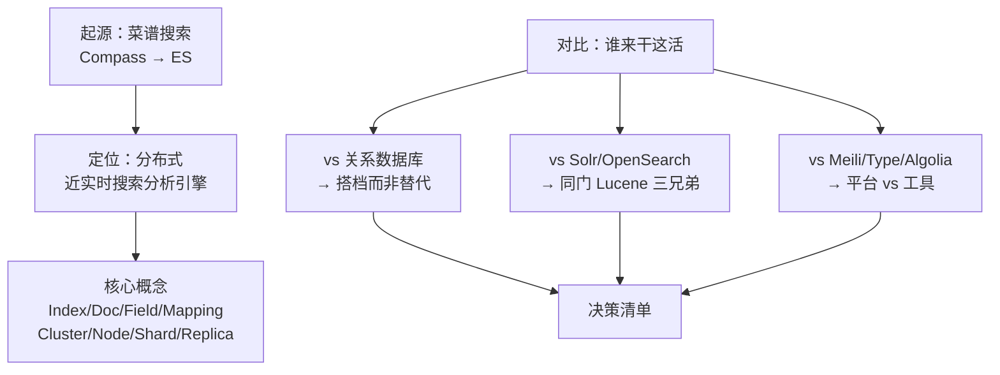

**核心结论**：

1. **起源**：ES 是 Shay Banon 从「给老婆做菜谱搜索」起步的——2004 年 Compass，2010 年重写为 ES，2012 年成立 Elastic，2018 年上市
2. **定位**：ES 是**分布式的近实时搜索与分析引擎**，基于 Lucene，用 RESTful API 隐藏复杂性；**它不是数据库，是主库的旁路**
3. **概念**：Index ≈ 库、Document ≈ 行、Field ≈ 列、Mapping ≈ 表结构；**Type 已废弃**；Shard 分片扩容、Replica 副本容灾；写入默认 1 秒后可搜
4. **选型**：轻量搜索框用 Meilisearch/Typesense；日志分析和大数据量用 ES；要纯 Apache 2.0 选 Solr/OpenSearch；**ES 永远不要当主数据库**

⚠️ **高频坑**：把 ES 当唯一数据源——数据丢了很难重建。

> 📖 [课 2 全文](stages/1-为什么需要ES/lessons/lesson-02-ES是谁凭什么.md)

## 阶段 2：核心原理与上手（课 3-5 · 9 知识点）

> 本阶段回答：ES 凭什么搜得这么快？怎么把它跑起来并正确存数据？
> [阶段概览](stages/2-核心原理与上手/overview.md)

### 课 3：把 ES 跑起来

**知识点**：本机安装与首次启动 · 索引/文档 CRUD · 用 `_cat` API 观察集群

**一图总结**

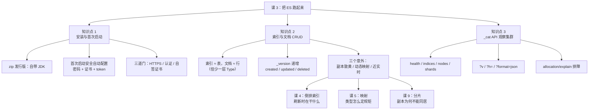

**核心结论**：

1. **装 ES 就是解压 + 跑脚本，但 9.x 首次启动会自己上锁**——密码打印在终端里，没看见就用 `elasticsearch-reset-password` 重配
2. **文档是 JSON、写完一秒后才搜得到、字段类型默认靠猜**——这三个特性分别通向课 4、课 9、课 5
3. **出事先看 `_cat/health?v`**，然后按 health → indices → shards → allocation/explain 四步走，ES 会自己交代原因

⚠️ **高频坑**：单节点学习环境建索引忘了显式指定 `"number_of_replicas": 0`——默认 1 副本，集群必然 yellow。

> 📖 [课 3 全文](stages/2-核心原理与上手/lessons/lesson-03-把ES跑起来.md)

### 课 4：倒排索引——快到离谱的秘密

**知识点**：倒排索引原理 · 分词与分析器 · 中文分词与 IK

**一图总结**

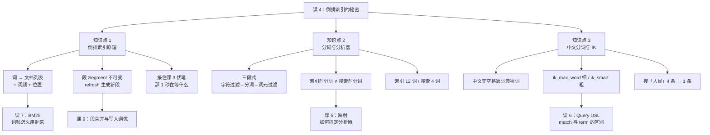

**核心结论**：

1. **倒排索引是「词 → 文档」的倒排表，它让搜索变成查表而不是扫描**；它被切成一段段，段生成了才可搜——这解释了课 3 那 1 秒
2. **文本进 ES 要过三道工序，且写入时和搜索时各过一次**；两次不兼容，就等于对着空气喊话
3. **中文没有空格，默认被逐字切开，所以搜「人民」会出「工人日报」**；装 IK 后同样的搜索从 4 条命中降到 1 条

⚠️ **高频坑**：IK 插件**版本号必须与 ES 严格一致**，且**装完必须重启**才生效；最佳实践是索引 `ik_max_word`、搜索 `ik_smart`。

> 📖 [课 4 全文](stages/2-核心原理与上手/lessons/lesson-04-倒排索引的秘密.md)

### 课 5：映射：给数据定规矩

**知识点**：映射 Mapping 设计 · 动态映射与模板 · 多字段 multi-fields

**一图总结**

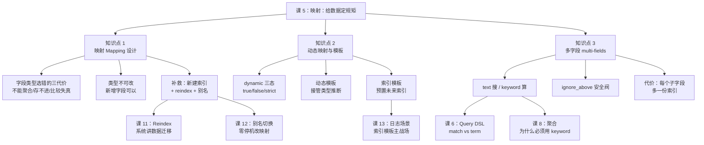

**核心结论**：

1. **映射是婚前协议不是婚后调解**——字段类型一旦定下就不能改，改就得新建索引 + reindex，生产上配别名零停机切换
2. **别让 ES 猜**——生产用 `dynamic: strict` 或 `false` 关掉自动推断，用动态模板接管规则、索引模板批量预置
3. **要搜用 text，要算用 keyword**——两者都要就上 multi-fields，代价是每个子字段多一份索引

⚠️ **高频坑（最隐蔽的一种）**：字段是 `long`，写入 `19.9` → **`_source` 保留 19.9，但索引里是 `19`**，不报错、只静默算错。价格、评分、耗时字段尤其要当心（`scaled_float` 是正解）。

> 💡 **贯穿全课的原理句**：**`_source` 是原件，倒排索引 / doc_values 是按映射重抄的副本。** 搜索、聚合、排序用的全是副本。

> 📖 [课 5 全文](stages/2-核心原理与上手/lessons/lesson-05-映射给数据定规矩.md)

## 阶段 3：查询与聚合（课 6-8 · 9 知识点）

> 本阶段回答：怎么「问」ES？结果凭什么这么排？怎么做统计分析？
> [阶段概览](stages/3-查询与聚合/overview.md)

### 课 6：Query DSL：问问题的语言

**知识点**：Query DSL 结构 · 全文查询 vs 词项查询 · 布尔组合与过滤

**一图总结**

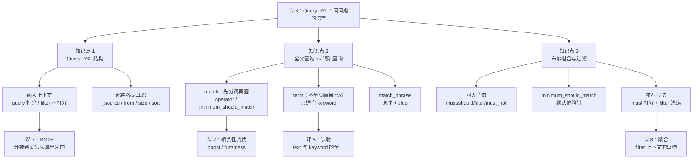

**核心结论**：

1. **`match` 分词、`term` 不分词**——查 text 用 `match`，查 keyword 用 `term`；拿 `term` 查 text 的整句话必然 0 条
2. **`must`/`should` 打分，`filter`/`must_not` 不打分**——实测加不加 filter，命中文档的分数逐一不变（1.6706 → 0.7262）
3. **`minimum_should_match` 的默认值是陷阱**——有 `must`/`filter` 时默认为 0，`should` 只加分不筛选

⚠️ **高频坑**：把所有条件都塞进 `must`，筛选条件会污染相关性分数；另外别迷信「filter 更快」——本课 8 条文档的实测中 `query_cache.hit_count` 始终为 0，**用 `filter` 的首要理由是语义清晰 + 分数干净，不是性能**。

> 📖 [课 6 全文](stages/3-查询与聚合/lessons/lesson-06-QueryDSL问问题的语言.md)

### 课 7：为什么这条排在前面

**知识点**：相关性打分 BM25 · 排序 · 分页 · 高亮 · 相关性调优

**一图总结**

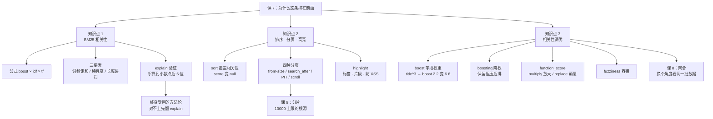

**核心结论**：

1. **分数 = boost × IDF × TF，可以手算验证**——实测 `2.2 × 0.441833 × 0.729547 = 0.709143`，ES 返回 0.7091
2. **排序会覆盖相关性（`_score` 变 null），`from/size` 上限 10000**——深分页用 `search_after`，全量导出用 `scroll`
3. **调优三招**：`boost` 提字段权重、`boosting` 压后排、`function_score` 按业务指标加权（`multiply` 放大，`replace` 颠覆）

⚠️ **高频坑**：以为 explain 里的 `boost = 2.2` 是自己设的权重——那是 `k1 + 1` 常量，真正的字段权重乘在它上面（`title^3` → 6.6）。堆关键词也提不了分：TF 会饱和，堆词还会撑大 `dl` 稀释权重。

> 📖 [课 7 全文](stages/3-查询与聚合/lessons/lesson-07-为什么这条排在前面.md)

### 课 8：聚合：不做搜索，做统计

**知识点**：桶聚合与指标聚合 · 子聚合与管道聚合 · ES|QL 入门

**一图总结**

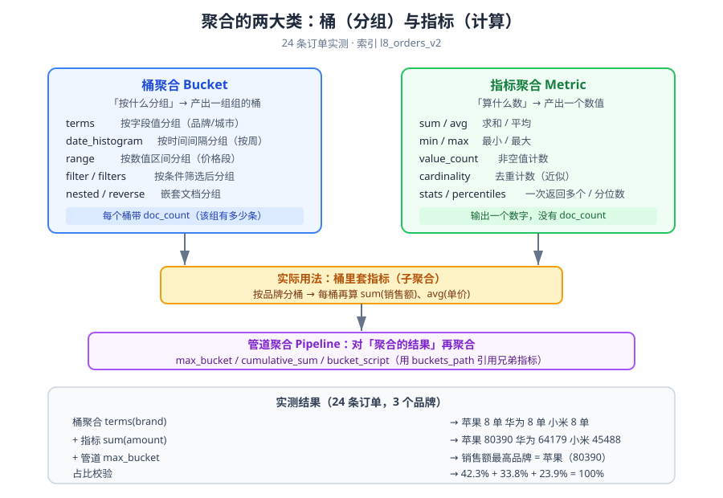

**核心结论**：

1. **搜索找文档，聚合算数字**——`query` 圈范围，`aggs` 做统计，`size=0` 是标配
2. **聚合必须用 keyword**——text 分词会把「苹果」拆成「苹」「果」两个桶，这是课 5 multi-fields 存在的理由
3. **ES|QL 写起来像 SQL，DSL 表达力更强**——两个都要会，按场景选（实测两者结果完全一致）

**本课五个实测踩坑**：

| # | 坑 | 报错原文 / 现象 | 正确做法 |
|---|---|---|---|
| 1 | 对 text 字段聚合 | `Fielddata is disabled on [brand]` | 用 keyword 字段 |
| 2 | `fielddata=true` 救急 | 结果变成 6 个碎桶（苹/果/华/为/小/米） | reindex 改 keyword mapping |
| 3 | `cumulative_sum` 挂 terms 下 | `must have a histogram... as parent` | 只挂 histogram 类 |
| 4 | `bucket_script` 放顶层 | `No aggregation found for path` | 必须挂桶内，与指标同级 |
| 5 | ES\|QL 中文列名 | `token recognition error at: '订'` | 别名用英文，值用中文 |

> 📖 [课 8 全文](stages/3-查询与聚合/lessons/lesson-08-聚合不做搜索做统计.md)

## 阶段 4：分布式与工程实践（课 9-12、15 · 16 知识点）

> 本阶段回答：数据怎么分布？挂了怎么办？怎么接入真实项目？索引怎么管、数据怎么老？
> [阶段概览](stages/4-分布式与工程实践/overview.md)

### 课 9：分片：ES 分布式的基石

**知识点**：分片与副本机制 · 分布式写流程 · 分布式读流程

**一图总结**

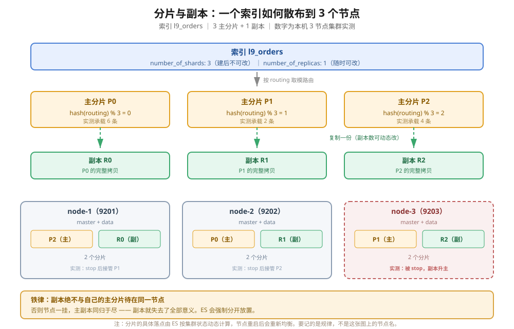

**核心结论**：

1. **主分片为容量，副本分片为高可用**——副本数可以随时改，分片数一旦设定就改不了
2. **分片数改不了是因为路由公式**——`shard = hash(routing) % 分片数`，改除数等于让所有文档搬家
3. **读是 scatter-gather，写是主分片优先**——多分片带来并行能力，也带来聚合误差

⚠️ **高频坑（两条要一起看）**：**单节点集群**设 0 副本是合理的（副本注定无处安放，yellow 是物理必然）；**多节点集群**为消掉 yellow 把副本设成 0 是危险的——本课实测停掉 node-3 后，7 个 0 副本索引全部转 red、数据真读不到，而有副本的 `l9_orders` 只是 yellow、22 条一条没丢。

> 📖 [课 9 全文](stages/4-分布式与工程实践/lessons/lesson-09-分片分布式的基石.md)

### 课 10：集群健康与排障

**知识点**：集群健康与故障转移 · 分片设计与容量规划 · 诊断与修片

**一图总结**

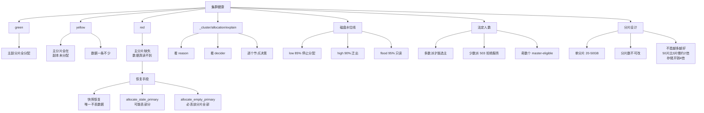

**三个必须记住的定理**：

1. **副本是数据的第二份存在，不是性能优化**——0 副本 + 节点永久损毁 = 永久丢失（实测 `l9_hi` 从 300 条变成 197 条）
2. **red 状态下，唯一不丢数据的恢复手段是快照**——官方原文 `restore this index from a recent snapshot`；`allocate_empty_primary` 会让集群变绿但清空该分片，**且不留痕迹**
3. **宁可不可用，不可不一致**——法定人数机制让少数派返回 503 而不是继续服务

⚠️ **高频坑**：只看颜色会漏——反复故障转移会让分片「静默消失」，**每次故障转移后必须核对 `docs.count`**。

> 📖 [课 10 全文](stages/4-分布式与工程实践/lessons/lesson-10-集群健康与排障.md)

### 课 11：数据管道与备份

**知识点**：Ingest Pipeline · Reindex 与 Update By Query · 快照与恢复

**一图总结**

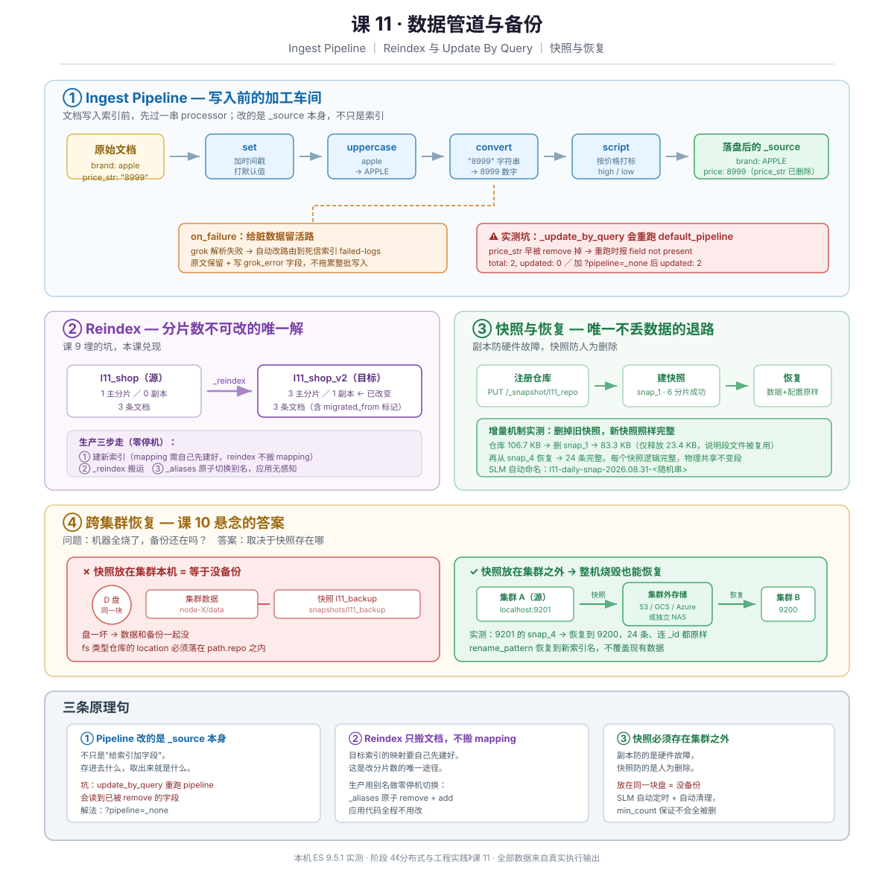

```
数据进来 → Ingest Pipeline 加工好
          ↓
发现问题 → Update By Query 批量改
          ↓
结构不对 → Reindex 搬到新索引
          ↓
日常运行 → SLM 自动做快照
          ↓
出事了   → 快照恢复（可跨集群）
```

**三条原理句**：

1. **Pipeline 改的是 `_source` 本身，不是只改索引**——所以 `_update_by_query` 重跑 pipeline 会炸（它要读的字段早被上一轮 `remove` 掉了）
2. **Reindex 是改分片数的唯一途径，但它不搬 mapping**——目标索引 mapping 要自己先建好，生产上用别名做零停机切换
3. **快照是唯一能对抗「人为删除」的手段，前提是它存在集群之外**——副本防硬件故障，快照防人为错误；放在同一块盘的快照等于没备份

⚠️ **高频坑**：`_update_by_query` 默认重跑索引的 `default_pipeline` → 报 `field [xxx] not present` 且 `updated: 0`，**加 `?pipeline=_none`** 才对；`path.repo` 改完必须重启**所有**节点。

> 📖 [课 11 全文](stages/4-分布式与工程实践/lessons/lesson-11-数据管道与备份.md)

### 课 12：接入真实项目

**知识点**：客户端选型与集成 · 数据同步模式 · 搜索应用架构

**一图总结**

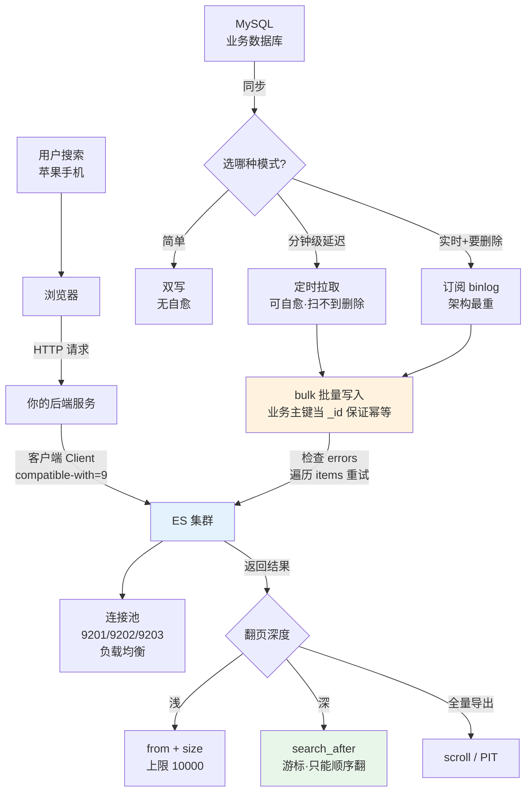

**核心结论**（三个知识点各一句）：

- **客户端是翻译官不是设计师；版本只能往下看一个大版本，升级顺序永远是「先服务端后客户端」**
- **同步三模式 = 双写 / 定时拉取 / 订阅 binlog；幂等的命门是用业务主键当 `_id`；bulk 不是事务，必须检查 `errors`**
- **架构三层 = 前端不直连 ES；连接池让客户端自己均衡；深分页别硬调参数，换 search_after**

⚠️ **高频坑**：bulk 报 `errors=true` 时**成功项已经落库了**，不能整批重来；深分页报错外层只有 `all shards failed`，**真因藏在 `root_cause`** 里。

> 📖 [课 12 全文](stages/4-分布式与工程实践/lessons/lesson-12-接入真实项目.md)

### 课 15：索引管理与生命周期策略（2026-09-01 增补）

**知识点**：索引模板体系（组件模板 + priority + `_simulate_index`） · 别名 · ILM 生命周期 · 索引运维

**一图总结**

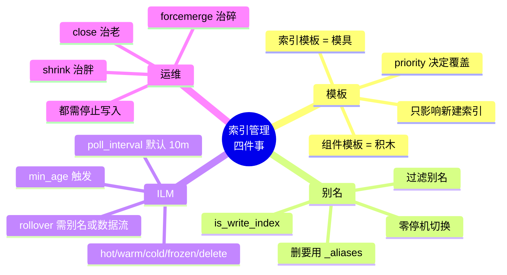

**核心结论**（四个知识点各一句）：

- **索引模板是模具，组件模板是积木，priority 决定谁说了算；但模具改了，已经压出来的零件不会变**
- **别名是可替换的门牌号：搜索跨全部、写入挑一个、切换零停机；但删它要用 `_aliases` 而不是 `DELETE`**
- **ILM 是按时间表自动执行的管家：轮询间隔决定它多久看一次（默认 10 分钟），min_age 决定什么时候动手，delete 阶段删数据不打招呼**
- **forcemerge 治碎、shrink 治胖、close 治老；三者都最好在索引停止写入后做，这正是 ILM warm 阶段的意义**

**核心洞察**：ILM 的 warm 阶段做的事（`forcemerge`、`shrink`），就是运维那部分讲的手工操作。**ILM 不是新东西，它是把手工运维自动化了。**

⚠️ **高频坑**：shrink 的目标分片数**必须是因数**（4 → 3 直接报 `must be a multiple of [3]`）；`indices.lifecycle.poll_interval` 是**集群级**设置，写在索引模板里会报 `unknown setting`。

> 📖 [课 15 全文](stages/4-分布式与工程实践/lessons/lesson-15-索引管理与生命周期策略.md)

## 阶段 5：生产与选型（课 13-14 · 6 知识点）

> 本阶段回答：ES 在我的场景里到底该不该用？怎么证明我会？
> [阶段概览](stages/5-生产与选型/overview.md)

### 课 13：三大主战场

**知识点**：日志与可观测 · 向量检索与 RAG · 安全与权限

**一图总结**

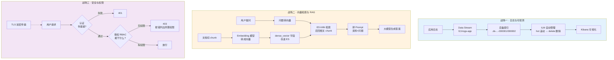

**核心结论**（三个知识点各一句）：

- **日志要不只写不删——Data Stream 负责自动换本子，ILM 负责自动丢旧的**
- **向量检索 = 在语义地图上找邻居；RAG = ES 负责找资料，大模型负责写答案，两者缺一不可**
- **认证管「你是谁」（401），授权管「你能干什么」（403）；权限绑角色不绑人；403 的报错会告诉你缺哪些权限**

**最有说服力的一组实测**：关键词搜「宠物」只命中 1 条（写了「宠物」二字的），**向量 kNN 命中 3 条，且「狗是人类的朋友」score 0.9992 排在「猫」0.9985 之前**——字面没有「宠物」，却因语义最近排第一。

⚠️ **高频坑**：basic license 下 `semantic_text` **能建索引、能建映射，但一写入就报 `non-compliant for [inference]`**——建时不响、写时才炸；kNN 字段名写错会**静默返回 0 条、不报错**。

> 📖 [课 13 全文](stages/5-生产与选型/lessons/lesson-13-三大主战场.md)

### 课 14：该不该用 ES

**知识点**：该不该用 ES（选型清单） · 认证备考指南 · 知识体系收束

**✅ 适合上 ES 的信号**

| 信号 | 原因 |
|---|---|
| 需要**全文检索**（分词、相关性打分、高亮） | 倒排索引是 ES 的看家本领，数据库 `LIKE` 会全表扫 |
| 需要**复杂聚合分析**（多维分组、分位数、时序） | 列存 + 聚合框架，课 9 实测过 |
| 数据量**持续增长的时序数据**（日志、指标、埋点） | Data Stream + ILM 自动滚动、自动过期 |
| 能接受**秒级延迟** | 近实时特性，实测写后立刻搜 0 条、1.2 秒后 1 条 |
| 查询模式**多变**、难以预先建索引优化 | 即时聚合比固定 BI 报表灵活 |
| 需要**语义检索 / RAG**（向量 + 关键词混合） | 课 13 实测：关键词搜「宠物」1 条 vs 向量 3 条 |

**❌ 不该上 ES 的信号**

| 信号 | 后果 | 替代方案 |
|---|---|---|
| 需要**多文档事务** | ES 只有单文档乐观锁 | 关系型数据库 |
| 需要**强一致读**（写完立刻查到） | 近实时，默认 1 秒延迟 | 关系型数据库 / KV 存储 |
| 数据是**高度关联的关系模型** | 无跨表关联 | 关系型数据库 / 图数据库 |
| 把 ES 当**唯一数据源**（没有源头） | 数据丢了难恢复，重建代价大 | ES 必须是「可重建的副本」 |
| 频繁**单行更新**、按主键点查为主 | ES 的强项是检索不是点查 | KV 存储（Redis）/ 关系型数据库 |
| 数据量小（< 百万级）且只有简单查询 | 杀鸡用牛刀，运维成本 > 收益 | PostgreSQL 全文检索够用 |

**🔑 一句话判断标准**

> **ES 应该是你数据的「索引副本」，不是「原始账本」。**
> 原始数据放在关系型数据库或对象存储里，ES 从那里同步过来、丢了能重建。
> 如果你的设计方案里 ES 挂了数据就没了——这个设计是错的。

**分片规划建议**：单分片目标 **20–50 GB**；小数据量（< 10 GB）**1 个主分片就够**；副本至少 1；**主分片数创建后不可更改，规划时宁小勿大**（太少可 `split`，太多只能 `shrink` 或重建）。

⚠️ **时效性**：Elastic 认证考纲 **2026-09-01 起从 8.15 升级到 9.3**——新增 Architecture 大类、`semantic search`、ES|QL、Streams；移除 runtime fields、跨集群搜索/复制、searchable snapshot。**旧攻略的重点别再套用。**

> 📖 [课 14 全文](stages/5-生产与选型/lessons/lesson-14-该不该用ES.md)

---

## 三、收束：十个「一辈子受用」的结论

从 46 个知识点里提炼最该记住的十条，**每一条都来自本机实测**：

| # | 结论 | 实测出处 |
|---|------|---------|
| ① | **ES 是索引副本，不是原始账本**——丢了要能从源头重建，这是所有选型判断的锚点 | 课 14 |
| ② | **倒排索引决定了一切能力边界**——能做的（全文检索、聚合）和不能做的（事务、跨表关联、强一致读）都源于这个数据结构 | 课 4 |
| ③ | **text 分词、keyword 不分词**——选错类型，查询会**静默失效**（不报错，只是查不到） | 课 5 |
| ④ | **match 走分词，term 不分词**——查 keyword 用 term，查 text 用 match；反过来 `term` 查 text 的「iPhone 15」必然 0 条 | 课 6 |
| ⑤ | **filter 不打分且可缓存**——能用 `filter` 就别用 `must`，相关性打分是纯开销 | 课 6 |
| ⑥ | **深分页用 search_after，别用 from/size**——`Result window is too large`，且根因藏在 `root_cause` 里 | 课 7 / 课 12 |
| ⑦ | **bulk 失败要逐项检查，不能只看 errors**——`errors=true` 时成功项**已经落库了** | 课 12 |
| ⑧ | **主分片数创建后不可改，且不是越多越好**——50 分片存储 4.7 倍、p95 延迟 2.2 倍、聚合误差上界 82 | 课 9 / 课 10 / 课 14 |
| ⑨ | **报错看 root_cause，不看外层**——外层通常是 `search_phase_execution_exception` 这类包装 | 课 12 / 13 / 14 |
| ⑩ | **ES 没有事务，只有单文档乐观锁**——`_seq_no` + `_primary_term` 是唯一保障，多文档原子性请交给关系型数据库 | 课 14 |

### 四层排查法

把 46 个知识点变成「可查阅能力」的关键。出问题按这个顺序往下走：

**第 1 层：查不到数据**

```
1. 字段名写对了吗？      → GET /index/_mapping
2. 字段类型对吗？        → text 用 match，keyword 用 term
3. 分词器对吗？          → POST /index/_analyze 看实际切分
4. 真的写进去了吗？      → 等 1 秒（近实时）或 ?refresh=true
5. 有别名/路由干扰吗？   → GET /_alias
```

> 课 14 教训：kNN 字段名写错**静默返回 0 条**，第一步永远是查映射。

**第 2 层：查询结果不对**

```
1. 聚合不准？            → 分片太多？看 doc_count_error_upper_bound
2. 相关性排序奇怪？      → 看 _score 和 explain
3. 中文搜不到？          → IK 装了吗？analyzer 指定了 ik 吗？
4. 大小写/空格问题？     → 看 normalizer 和 keyword 类型
```

**第 3 层：报错了**

```
1. 直接读 root_cause     → 外层 type 通常是包装（search_phase_execution_exception）
2. 维度不匹配？          → 向量 dims 检查（课 13 实测）
3. 权限问题？            → 401 是"你是谁"，403 是"你没权限"，403 末尾会列出所需权限名
4. license 问题？        → non-compliant for [xxx] = 该功能要付费
```

**第 4 层：慢**

```
1. 先看分片数是不是过多    → 代价在长尾（p95）不在均值（p50）
2. 看堆内存与熔断器        → GET _nodes/stats/breaker
3. 找昂贵查询              → GET _tasks?detailed=true
4. 看段数量                → 段太碎用 forcemerge
```

---

## 四、综合实战项目：商品搜索服务

> **一句话需求**：给电商网站做商品搜索后端——中文全文检索 + 分面筛选 + 相关性调优 + 深分页导出，并且能在**不停服**的前提下重建索引。
> 📂 [项目 README](projects/商品搜索服务/README.md) ｜ [设计决策](projects/商品搜索服务/设计决策.md) ｜ [反例对照](projects/商品搜索服务/反例对照.md) ｜ [验收清单](projects/商品搜索服务/验收清单.md)
> 可运行代码在 `projects/商品搜索服务/实现/`，`npm install && npm run demo` 一条命令跑通全流程（本机实测退出码 0）。

**架构一句话**：MySQL（项目里用代码模拟）是**原始账本**，ES 是它的**索引副本**——ES 全删了，重跑一次同步就能完整重建。

### 覆盖知识点：5 / 5 个阶段，22 个知识点

| 阶段 | 本项目用到什么 | 回指课时 |
|------|--------------|---------|
| 1 动机 | 为什么不用 `LIKE`；ES 是索引副本不是原始账本 | 课 1、课 2、课 14 |
| 2 原理 | IK 分析器分离、映射设计、`scaled_float`、multi-fields、`dynamic: strict` | 课 4、课 5 |
| 3 检索 | Query DSL + `filter` 不打分、BM25 + `function_score`、高亮、聚合分面 + `post_filter`、`search_after` | 课 6、课 7、课 8 |
| 4 分布式 | 分片副本设计、bulk 幂等与部分失败处置、模板体系、别名原子切换、ILM + Data Stream、reindex、连接池、`root_cause` | 课 9、课 10、课 11、课 12、课 15 |
| 5 选型 | RBAC 最小权限（401 / 403 边界）、适用边界 | 课 13、课 14 |

### 五项非功能约束

| 约束 | 落点 |
|------|------|
| 错误处理 | bulk 部分失败逐项检查，可重试的退避重试、不可重试的进死信，写入绝不静默 |
| 性能 | 批量写入、筛选不打分、深分页走游标 |
| 可维护性 | 组件模板 + 索引模板 + 别名，配置全部外置 |
| 安全 | 应用账号最小权限（只读 + 集群监控），不拿 superuser 跑服务 |
| 成本 | 单分片 + 日志自动滚动与过期删除 |

### 五个设计决策（摘要，完整五段式见项目文档）

| # | 决策 | 选了什么 | 代价 | 什么时候该改选 |
|---|------|---------|------|--------------|
| 1 | 分词器组合 | 索引 `ik_max_word` + 搜索 `ik_smart` | 索引体积大；分析器属映射，改它必须 reindex | 短文本精确匹配为主 → 改 keyword + term |
| 2 | 分片与副本 | 1 主 1 副 | 失去并行扩容能力，数据涨了要 split 或重建 | 单分片超 50 GB → 按总量重新规划 |
| 3 | 结构变更策略 | 别名 + reindex 原子切换 | 磁盘要能放两份；切换期写入不会自动跟随 | TB 级索引 → 双写 + 增量追赶 + 灰度 |
| 4 | 分面筛选实现 | `post_filter`（不是 `filter`） | 多一层概念，写错位置不报错 | 维度互斥不需反选 → filter 更简单 |
| 5 | 深分页与决胜键 | `search_after` + 业务主键 `sku` | 不能跳页；排序组合必须唯一 | 长耗时全量导出 → 加 PIT 保一致性视图 |

### 关键实测数字（本机 ES 9.5.1 三节点集群）

| 环节 | 结果 |
|------|------|
| 幂等同步 | 38 条，重写后文档数仍为 38（`_id` = 业务主键） |
| bulk 部分失败 | 40 条里 2 条失败 → `errors=true` 但另外 38 条**已落库**；死信分别是 `document_parsing_exception` 与 `strict_dynamic_mapping_exception` |
| 检索 | 「苹果手机」命中 19 条，top1 = 7.8949，高亮正常 |
| filter 不打分 | 加 `--min-price=6000` 后命中从 19 降到 10，但同一文档分数**一模一样** |
| 分面 `post_filter` | 选了苹果后，返回的样例只剩苹果，但品牌分面仍显示华为 4、小米 4 |
| 深分页 | 4 页导出 38 条，排序单调性校验通过；`from=9995` 报 `Result window is too large ... [10000] but was [10005]` |
| 零停机切换 | v1 命中 23 → v2 命中 19；v1 独有的 4 条**全是配件**（碎片词「本」命中"本商品…"）；切换后应用视角与 v2 一致，可一键回滚 |
| RBAC | 只读账号读成功；写入被拒 **403**（报错列出所需权限名）；错密码 **401** |

---

## 五、实战与排障

三份产物的素材源是同一批「典型失败模式 + 常见高难度场景」，但**姿态完全不同**——混在一起会同时毁掉三个：学习时读不到原理、紧急时读不完、设计时看不到选项。

| 你想干什么 | 去哪 | 姿态 |
|-----------|------|------|
| 新需求来了，怎么设计 | [10 · 场景解法库](10-场景解法库.md) | 设计态：8 个场景，每个 4-6 个解法 + 代价 + 推荐路径（`<details>` 折叠，先想后看） |
| 设计完了，会踩什么坑 | [08 · 实战经验](08-实战经验.md) | 学习态：6 个适用边界 + 6 个反模式 + 7 条故障模式（症状→根因→排查路径→修复→预防）+ 上线 Checklist + 2 个真实事故复盘 |
| 上线后出事了 | [09 · 排障速查手册](09-排障速查手册.md) | 使用态：14 个症状条目（E1-E14）+ 症状索引表，**只给动作不给原理** |

**排障手册的 14 个条目**（按症状倒查）：

| 紧急度 | 条目 |
|--------|------|
| 🔴 立即处理 | E1 磁盘水位触发只读块 ｜ E2 集群 red（主分片未分配）｜ E3 熔断触发（HTTP 429） |
| 🟡 尽快处理 | E4 text 字段聚合/排序失败 ｜ E5 写入报类型解析失败 ｜ E6 bulk 部分失败被静默吞掉 ｜ E12 别名无写索引，写入失败 ｜ E14 ILM 配了但 rollover 不滚动 |
| ⚪ 有时间再看 | E7 改字段类型被拒 ｜ E8 集群 yellow（副本未分配）｜ E9 深分页超过 max_result_window ｜ E10 刚写入的数据搜不到 ｜ E11 并发写冲突 409 ｜ E13 破坏性操作被拒 |

> 手册查不到当前症状 → 用 `debug` skill 现场取证。本阶段只预演**领域典型**失败模式的预案，不定位具体 bug。

**场景解法库的 8 个场景**：① 搜索要支持纠错 ② 数据量翻 100 倍 ③ QPS 从 500 涨到 5000 ④ 重新设计索引但不能停服 ⑤ 多租户（50 个业务方共用集群）⑥ 给搜索加语义理解 ⑦ 接新数据源怎么设计同步链路 ⑧ 索引越用越慢、分片设计有问题。

---

## 六、知识点总索引

> 知识点级进度以 [00-学习档案.md](00-学习档案.md) 为准；认证映射列对应 Elastic Certified Engineer 考纲域。

| 阶段 | 课 | 知识点 | 认证映射 |
|------|-----|--------|---------|
| 1 | [课 1](stages/1-为什么需要ES/lessons/lesson-01-为什么数据库搞不定搜索.md) | 数据库模糊查询的痛点 · 搜索引擎是什么 · ES 能干什么（四大场景） | — |
| 1 | [课 2](stages/1-为什么需要ES/lessons/lesson-02-ES是谁凭什么.md) | ES 起源与定位 · 核心概念全景 · ES vs 数据库与其他方案对比 | — |
| 2 | [课 3](stages/2-核心原理与上手/lessons/lesson-03-把ES跑起来.md) | 本机安装与首次启动 · 索引/文档 CRUD · 用 `_cat` API 观察集群 | Installation / Indexing Data / Cluster Admin |
| 2 | [课 4](stages/2-核心原理与上手/lessons/lesson-04-倒排索引的秘密.md) | 倒排索引原理 · 分词与分析器 · 中文分词与 IK | Mapping & Analysis |
| 2 | [课 5](stages/2-核心原理与上手/lessons/lesson-05-映射给数据定规矩.md) | 映射 Mapping 设计 · 动态映射与模板 · 多字段 multi-fields | Data Management / Mapping & Analysis |
| 3 | [课 6](stages/3-查询与聚合/lessons/lesson-06-QueryDSL问问题的语言.md) | Query DSL 结构 · 全文查询 vs 词项查询 · 布尔组合与过滤 | Queries |
| 3 | [课 7](stages/3-查询与聚合/lessons/lesson-07-为什么这条排在前面.md) | 相关性打分 BM25 · 排序 · 分页 · 高亮 · 相关性调优 | Queries |
| 3 | [课 8](stages/3-查询与聚合/lessons/lesson-08-聚合不做搜索做统计.md) | 桶聚合与指标聚合 · 子聚合与管道聚合 · ES\|QL 入门 | Aggregations / Queries |
| 4 | [课 9](stages/4-分布式与工程实践/lessons/lesson-09-分片分布式的基石.md) | 分片与副本机制 · 分布式写流程 · 分布式读流程 | Cluster Admin |
| 4 | [课 10](stages/4-分布式与工程实践/lessons/lesson-10-集群健康与排障.md) | 集群健康与故障转移 · 分片设计与容量规划 · 诊断与修片 | Cluster Admin |
| 4 | [课 11](stages/4-分布式与工程实践/lessons/lesson-11-数据管道与备份.md) | Ingest Pipeline · Reindex 与 Update By Query · 快照与恢复 | Data Processing / Cluster Admin |
| 4 | [课 12](stages/4-分布式与工程实践/lessons/lesson-12-接入真实项目.md) | 客户端选型与集成 · 数据同步模式 · 搜索应用架构 | — |
| 4 | [课 15](stages/4-分布式与工程实践/lessons/lesson-15-索引管理与生命周期策略.md) | 索引模板体系 · 别名 · ILM 生命周期 · 索引运维 | Index Management |
| 5 | [课 13](stages/5-生产与选型/lessons/lesson-13-三大主战场.md) | 日志与可观测 · 向量检索与 RAG · 安全与权限 | Cluster Security |
| 5 | [课 14](stages/5-生产与选型/lessons/lesson-14-该不该用ES.md) | 该不该用 ES（选型清单） · 认证备考指南 · 知识体系收束 | 全部 |

**合计**：5 阶段 / 15 课 / 46 知识点，全部 ✅ 已完成。

---

## 🚀 接下来可以做什么

| 方向 | 怎么做 |
|------|--------|
| **动手把知识用起来**（推荐） | 跑 [四、综合实战项目：商品搜索服务](#四综合实战项目商品搜索服务)：`cd projects/商品搜索服务/实现 && npm install && npm run demo` |
| **练"改错了怎么救"** | 切到 v2 后回滚：`node ops/reindex-switch.js --to=v1`，再看 [验收清单](projects/商品搜索服务/验收清单.md) 的 F 组 |
| **练"脏数据怎么处理"** | `npm run sync:dirty`，看 2 条死信怎么被分类出来 |
| **备考冲刺**（Elastic Certified Engineer，9.3 考纲） | 见 [02-课程目录.md](02-课程目录.md) 的「方向 A · 备考冲刺」提示词 |
| **考自己一下** | 让 AI 出一套选择题（产物落在 `知识点对齐记录/`，最新一轮更新 `07-知识点对齐.md`） |
| **只查问题** | 直接翻 [09 · 排障速查手册](09-排障速查手册.md) 的症状索引表 |
| **深入某个方向** | 向量检索 / RAG、性能调优、跨集群架构——都可以单独开一个速览或子课程 |

**本机环境备忘**（复现实操时需要）：

- 3 节点集群 `http://localhost:9201`（node-1/9201, node-2/9202, node-3/9203，`cluster.name=l9-cluster`，无安全）
- 单节点集群 `https://localhost:9200`（密码 `9PvhcGNNc86uFZb_ePAN`，IK 9.5.1 已装）
- 两集群 license 均 basic（`semantic_text` 写入报 `non-compliant for [inference]`）
- 请求工具统一 **`curl.exe`**（本机无 Git Bash，PowerShell 5.1 的 `Invoke-RestMethod` 连不上 ES 9.5.1 HTTPS）
- 仅 Node.js v22.14.0 可用，`@elastic/elasticsearch@9.5.1` 已装在 `playground/l13-client/`

---

**相关文档**：[学习路径总览](01-学习路径总览.md) ｜ [课程目录](02-课程目录.md) ｜ [学习档案](00-学习档案.md) ｜ [评审清单](00-评审清单.md) ｜ [实战经验](08-实战经验.md) ｜ [排障速查手册](09-排障速查手册.md) ｜ [场景解法库](10-场景解法库.md)
