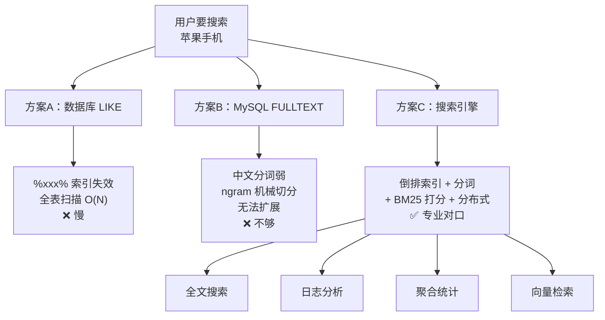

# 课 1：为什么数据库搞不定搜索

> 阶段 1 · 第 1 课 ｜ 知识点：数据库模糊查询的痛点 / 搜索引擎是什么 / ES 能干什么
> 本课不碰 ES，只建立"问题感"。

---

## 🎬 第一幕：场景引入

你接了个活儿：给公司电商网站加搜索。

需求听着特别朴素——

> 顶部一个搜索框，用户输入"苹果手机"，能搜到 iPhone、苹果配件相关的商品。

你心想：这不就是个模糊查询吗？五分钟搞定。

于是你写下人生中最自然的一行 SQL：

```sql
SELECT * FROM products WHERE name LIKE '%苹果手机%';
```

本地测试，20 条数据，秒回。你交了差。

上线三个月后，商品表涨到 **500 万条**。客服开始收到投诉："搜索要等三四秒，有时候直接转圈。"

你登上服务器一看，慢查询日志里密密麻麻全是这条 SQL。你给 `name` 字段加了索引——**没用**。你加了从库、升了配置——**还是卡**。

问题出在哪？

---

## 🤔 第二幕：认知冲突

你做的每一件事看起来都对：需求理解对了、SQL 写对了、索引也加了。

但有个要命的细节，没人告诉你——

> **加了索引，和索引用得上，是两回事。**

我们来看 MySQL 的 B+ 树索引是怎么存的。假设商品名字段上有索引，数据在索引里长这样（按字典序排好队）：

```text
AirPods Pro
Apple Watch
Huawei Mate60
iPhone 15 Pro
iPad Air
Xiaomi 14
小米手机
苹果手机壳
苹果手机
```

现在执行 `WHERE name LIKE '%苹果手机%'`。

索引是按**完整值**排好序的。你要找的是"中间包含'苹果手机'"的记录——那"苹果手机"可能出现在开头、中间、结尾的任意位置。

索引的有序性，在这里**完全帮不上忙**。

优化器想：我该从哪个位置开始扫呢？答案是——**不知道，只能从头扫到尾**。

这就是所谓的**索引截断**（index truncation）：前导通配符 `%` 一出现，B+ 树索引直接失效。

用 `EXPLAIN` 验证一下，你会看到扎心的结果：

```sql
EXPLAIN SELECT * FROM products WHERE name LIKE '%苹果手机%';
```

| 模式 | type | key | 扫描行数 | 含义 |
|------|------|-----|---------|------|
| `LIKE '苹果%'` | `range` | `idx_name` | 150 | ✅ 走索引，很快 |
| `LIKE '%苹果手机%'` | `ALL` | `NULL` | 5000000 | ❌ 全表扫描 |
| `LIKE '%手机'` | `ALL` | `NULL` | 5000000 | ❌ 全表扫描 |

**`type=ALL` + `key=NULL`** —— 这就是全表扫描的"病危通知书"。

规律很简单：

```text
LIKE 'abc%'    → 前缀确定 → 能走索引 ✅
LIKE '%abc'    → 前缀不确定 → 索引失效 ❌
LIKE '%abc%'   → 前缀不确定 → 索引失效 ❌
```

而用户的搜索习惯，恰恰就是**中间匹配**。这个矛盾无解。

### 那用 MySQL 自带的 FULLTEXT 呢？

你可能会想：MySQL 不是有全文索引吗？

```sql
ALTER TABLE products ADD FULLTEXT INDEX ft_name (name);
SELECT * FROM products WHERE MATCH(name) AGAINST('苹果手机');
```

这里藏着一个更深的坑——**MySQL 内置分词器根本不认识中文**。

官方 MySQL 文档白纸黑字写着（InnoDB 自然语言全文搜索章节）：

> 如果单词之间没有分隔符（例如在中文中），内置的 FULLTEXT 解析器**无法确定单词的开始和结束位置**。

英文 "database management system" 天然有空格，一眼能分成 3 个词。中文"数据库管理系统"呢？没有空格，MySQL 不知道该切成"数据库/管理/系统"还是"数据库管理/系统"。

MySQL 5.7.6 之后有个补救方案：**ngram 解析器**。

```sql
-- 必须显式指定，否则中文基本不可用
ALTER TABLE products ADD FULLTEXT INDEX ft_name (name) WITH PARSER ngram;
```

但 ngram 是**机械按字数切**，不是按语义切。`ngram_token_size=2` 时：

```text
输入："苹果手机"
切分：苹果 | 果手 | 手机     ← "果手"是什么鬼？
```

问题来了：

1. **精度差**：搜"苹果"会误命中"果手"相关的内容
2. **无语义**：不知道"苹果"是个品牌，不能做同义词（搜"苹果"出"iPhone"）
3. **改参数要重来**：`ngram_token_size` 改了，旧数据不会自动重分词，必须删索引重建
4. **功能薄**：拼音搜索、高亮、聚合统计、相关性调优——基本都没有
5. **分区表不支持**：FULLTEXT 索引在分区表上直接不支持

更要命的是——**FULLTEXT 是绑死在一张表、一个 MySQL 实例上的**。数据量再涨十倍，你连横向扩展的机会都没有。

### 所以真正的痛点是什么？

我们把问题摊开，你会发现用户要的"搜索"，根本不是一个 `WHERE` 条件能解决的：

| 用户期望 | 数据库能给你吗 |
|---------|--------------|
| 输"苹果手机"能搜到 iPhone | ❌ 字符串包含，做不到语义关联 |
| 模糊匹配要快（百万级毫秒回） | ❌ `%xxx%` 全表扫描 |
| 最相关的排最前面 | ⚠️ 只能按时间/ID 排，"相关性"是什么？ |
| 关键词高亮 | ❌ 自己写代码找字符串 |
| 搜"手机"能出"智能手机""移动电话" | ❌ 没有同义词 |
| 边搜边筛选（价格 1000-2000 + 品牌） | ⚠️ 能做但很快变慢 |
| 搜索框输错字也能搜到 | ❌ 没有容错 |

**结论**：不是数据库写得不好，是**数据库的设计目标就不是干这个的**。

数据库的强项是**精确存储 + 事务一致性**（ACID）——银行转账少一分钱都不行，这是它的看家本领。让它兼做模糊搜索，就像让账房先生去跑马拉松，不是他不行，是专业不对口。

---

## 🔍 第三幕：层层揭示

### 知识点 1：数据库模糊查询的痛点（已揭示）

**核心结论**：`LIKE '%xxx%'` 前导通配符导致 B+ 树索引失效，退化为全表扫描；FULLTEXT 中文分词能力薄弱，且无法水平扩展。

### 知识点 2：搜索引擎到底是什么

既然数据库不行，那"搜索引擎"凭什么行？

回到根本问题：给你 500 万条商品，怎么快速找到"包含苹果手机"的那些？

数据库思路（正向索引）：

```text
文档1 → 读一遍 → 含"苹果手机"吗？
文档2 → 读一遍 → 含"苹果手机"吗？
文档3 → 读一遍 → 含"苹果手机"吗？
...（500万次）
```

这是 **O(N)**，数据量翻倍，时间翻倍。

搜索引擎思路（**倒排索引**，Inverted Index）——**提前做好"词 → 文档"的对照表**：

```text
"苹果"   → [文档1, 文档5, 文档88, 文档1024]
"手机"   → [文档1, 文档3, 文档88, 文档556]
"苹果手机" → [文档1, 文档88]
```

查"苹果手机"？直接查表，一秒钟拿到 `[文档1, 文档88]`。

这就好比**书的索引页**——你想找"倒排索引"出现在哪些页，是翻完整本书快，还是看末尾的索引页快？答案不言自明。

> 📌 **倒排索引是 ES 全部性能的根基**。课 4 会拆开它的内部结构（词项字典、倒排表、词频、位置信息），这里先建立直觉。

**搜索引擎 = 倒排索引 + 分词 + 相关性打分**。三位一体：


少了任何一环都不行：
- 只有倒排索引，没分词 → 中文切不开
- 有倒排索引和分词，没打分 → 结果排不准，用户找不到想要的
- 有打分没倒排索引 → 慢

### 知识点 3：ES 能干什么（四大场景）

现在我们知道搜索引擎是什么了。**Elasticsearch 是当前最主流的开源搜索引擎**——基于 Apache Lucene 构建，分布式、近实时、RESTful API。

它主要干四件事：

**① 全文搜索（看家本领）**

站内搜索、电商商品搜索、内容平台文章检索、App 内搜索框。这是它诞生的原因。

**② 日志与可观测性（ELK 中的 E）**

这是很多人第一次接触 ES 的场景。把服务器日志扔进 ES，然后：
- 查"昨天下午 3 点，订单服务所有 ERROR 日志"
- 实时看错误率曲线
- 出了问题，秒级定位

为什么日志特别适合 ES？因为日志是**写多读少、按时间查、要做聚合统计**——正好撞在 ES 的强项上。

**③ 数据分析与聚合**

不只是"搜"，还能"算"：
- 过去一小时，各接口的 P95 耗时是多少？
- 各省份销售额Top 10？
- 用户搜索词云？

ES 的聚合（Aggregations）能力，让它在某些场景下能替代一部分 OLAP 的工作。（课 8 会专门讲）

**④ 向量检索与 RAG（新战场）**

这是 ES 近年最重要的方向。大模型时代，把文本转成向量存进 ES，做**语义搜索**——搜"怎么让程序跑得更快"，能召回讲"性能优化"的文档，哪怕里面一个"快"字都没有。

这让 ES 成了 RAG（检索增强生成）架构里的常客。（课 13 会展开）

一句话总结 ES 的定位：

> **ES 是一个分布式的、近实时的搜索与分析引擎。它用倒排索引解决"找得快"，用分词解决"找得全"，用 BM25 打分解决"排得准"，用分布式解决"装得下"。**

---

## ✋ 第四幕：实操验证

本课不装 ES，只做一个**思维实验 + 一段可选的真实验证**。

### 思维实验：你现在的数据库

打开你正在做的项目，找找有没有这种代码：

```sql
WHERE title LIKE CONCAT('%', #{keyword}, '%')
WHERE user_name LIKE '%张%'
WHERE content LIKE '%error%'
```

如果有，**你现在知道它为什么慢了**。

### 可选验证：用 EXPLAIN 亲眼看看

如果你本机有 MySQL，跑一下（没有也没关系，看结论即可）：

```sql
-- 建个测试表
CREATE TABLE products (
  id INT PRIMARY KEY AUTO_INCREMENT,
  name VARCHAR(200)
);

-- 加索引
CREATE INDEX idx_name ON products(name);

-- 随便插几条
INSERT INTO products (name) VALUES
  ('苹果手机 iPhone 15'),
  ('华为手机 Mate60'),
  ('苹果电脑 MacBook'),
  ('手机壳');

-- 关键：对比两种写法的执行计划
EXPLAIN SELECT * FROM products WHERE name LIKE '苹果%';
-- 预期：type=range, key=idx_name   ✅

EXPLAIN SELECT * FROM products WHERE name LIKE '%苹果%';
-- 预期：type=ALL, key=NULL         ❌
```

数据量小的时候两者都很快（优化器可能直接选全表扫），但把数据放大到百万级，差距就是**毫秒 vs 秒级**。

### 自检三问

1. 为什么 `LIKE 'abc%'` 能走索引，`LIKE '%abc%'` 不能？
2. MySQL 的 FULLTEXT 处理中文有什么问题？ngram 又有什么局限？
3. 倒排索引和"逐行扫描"的本质区别是什么？

（答案都在上面三幕里，答不上来回看一遍。）

---

## 🎓 第五幕：体系收束

### 本课知识地图



### 三句话记住本课

1. **`LIKE '%xxx%'` 让索引失效**——前导通配符破坏了 B+ 树的有序性，只能全表扫描
2. **MySQL FULLTEXT 救不了中文**——内置解析器不认识中文，ngram 是机械切字而非语义分词
3. **搜索引擎 = 倒排索引 + 分词 + 打分**——ES 把这三点做扎实，还加上了分布式

### 与后文的联系

| 本课埋的伏笔 | 在哪揭开 |
|-------------|---------|
| 倒排索引到底是什么结构？ | 课 4 |
| 中文分词怎么才能做好（IK 分词器）？ | 课 4 |
| BM25 打分是怎么算的？ | 课 7 |
| 分布式是怎么做到的？ | 课 9 |
| ES 四大场景具体怎么落地？ | 课 13 |

---

## 🚀 下一批接力提示词

复制以下内容发给 AI，继续下一课：

```text
继续 Elasticsearch 课程的课 2《ES 是谁、凭什么》。
请基于 D:/projects/learning/elasticsearch/ 下的学习档案与总览，
沿用课 1 的五幕结构（场景引入 / 认知冲突 / 层层揭示 / 实操验证 / 体系收束）与格式，
讲清楚三个知识点：ES 起源与定位、核心概念全景、ES vs 数据库与其他方案对比。
保持零基础友好、全程中文、结尾带下一课接力提示词与课程导航。
```

## 🧭 课程导航

- **下一课**：[课 2 · ES 是谁、凭什么](lesson-02-ES是谁凭什么.md)
- **本阶段**：[阶段 1 概览](../overview.md)
- **返回**：[课程总览](../../01-学习路径总览.md)
