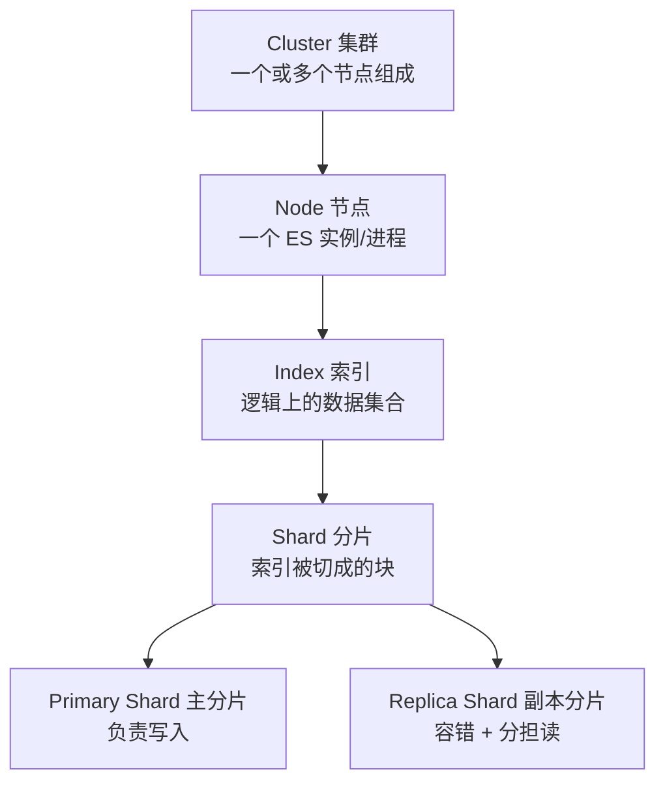
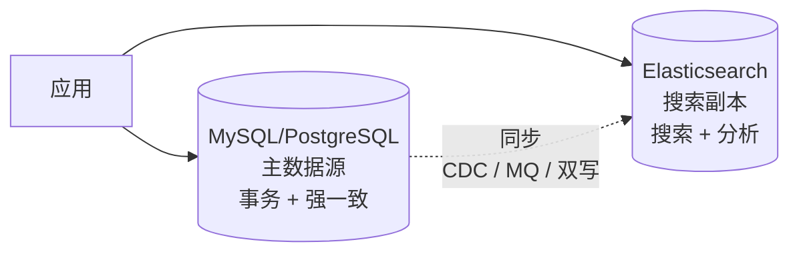
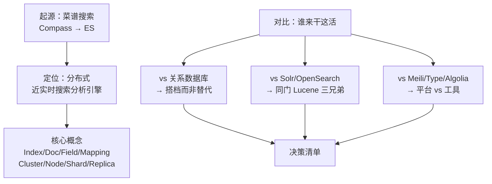

# 课 2：ES 是谁、凭什么

> 阶段 1 · 第 2 课 ｜ 知识点：ES 起源与定位 / 核心概念全景 / ES vs 数据库与其他方案对比
> 本课回答三个问题：它从哪来、它是什么、凭什么是它。

---

## 🎬 第一幕：场景引入

上节课结尾，我们得出一个结论：

> 数据库搞不定搜索，得用搜索引擎。而当前最主流的开源搜索引擎，是 **Elasticsearch**。

好，现在你打开搜索引擎，输入"Elasticsearch"，然后你懵了。

蹦出来的东西五花八门：

- 有人说它是"搜索引擎"，有人说它是"数据库"
- 有人说它叫 ELK，有人说叫 Elastic Stack
- 有人说它免费开源，有人说它改了许可证、不再开源了
- 有人提 Solr、OpenSearch、Meilisearch、Algolia……

更离谱的是它的出身——

> **Elasticsearch 最初是一个程序员给他老婆做的菜谱搜索工具。**

这不是段子，这是真事。

一个待业青年，跟着学厨艺的妻子去了伦敦，闲着没事想给老婆做个"菜谱搜索"，嫌 Lucene 太难用就包了一层，结果包着包着，包出了一个市值百亿美元的上市公司。

这课我们就把这三件事说清楚：**它从哪来 → 它到底是什么 → 凭什么是它而不是别人。**

---

## 🤔 第二幕：认知冲突

你可能带着几个"想当然"的理解，我们先把它们挑出来打碎。

### 误解一："ES 是个数据库"

很多人第一次接触 ES，是从"存数据、查数据"开始的，于是顺理成章觉得它是数据库。

**错得非常危险。**

ES 确实能存数据、能查数据，但它**没有事务**。你没法在 ES 里跑"扣库存 + 下订单"这样的操作——它不支持 ACID 事务，也不支持跨文档的一致性保证。

用 ES 当主数据库，就像用跑车去拉货——能装，但翻车只是时间问题。

**正确姿势**：ES 是**旁路**。主数据乖乖待在 MySQL/PostgreSQL 里，同步一份到 ES 专门负责搜索。ES 挂了，数据不会丢（源头还在），只是搜不了。

### 误解二："ES 完全开源免费"

这是很多人的认知停留在 2021 年之前导致的。

时间线是这样的：

| 时间 | 事件 |
|------|------|
| 2010–2021.1 | ES 采用 **Apache 2.0** 许可证，标准开源 |
| **2021.1** | Elastic 宣布从 **7.11** 起改为 **SSPL + Elastic License 双许可** |
| 2021.4 | AWS  forks 出 **OpenSearch**（沿用 Apache 2.0） |
| 2024 | Elastic 为 ES/Kibana 免费部分追加 **AGPLv3** 选项（8.16 GA 前） |

**为什么改？** Elastic 官方公告写得很直白：为了"限制云厂商把 ES/Kibana 直接当服务卖而不回馈社区"，矛头直指 AWS。

**对你意味着什么？**

- ✅ **自己用、自己部署、公司内部用**：完全免费，不受影响
- ⚠️ **你想把 ES 包装成 SaaS 卖给别人**：SSPL 要求你公开整个平台的源码——这时候得找法务
- ✅ 现在还有 **AGPLv3** 这个选项，比 SSPL 宽松一些

这个变化直接催生了 **OpenSearch**——AWS 主导的、Apache 2.0 的分叉。这是你做技术选型时必须知道的背景。

### 误解三："Lucene 就是 ES"

不是。关系是这样的：

```text
Lucene  = 引擎（一个 Java 库，只管建索引和搜索）
   ↓
ES      = 整车（在 Lucene 外面包了分布式、HTTP API、集群管理……）
```

**Lucene 只是个库**。想用它，你必须写 Java，还得懂一堆检索原理，并且——它**本身不支持分布式和高可用**。

ES 的价值恰恰在于：**把这些脏活累活全包了，然后给你一个 HTTP 接口**。你用 curl、用 Python、用 Go、用前端 JS，都能操作。

---

## 🔍 第三幕：层层揭示

### 知识点 1：ES 起源与定位

#### 故事：从菜谱搜索到上市公司

我们把时间线捋清楚（多来源交叉核对，含 Elastic 官方纪念 Lucene 20 周年的时间线、Shay Banon 本人访谈）：

```text
1999  Doug Cutting 写出 Lucene 第一个版本
      （名字取自他妻子的中间名；2001 年捐给 Apache）

2004  Shay Banon 发布 Compass
      ── 他在伦敦陪妻子读蓝带厨艺学校，想给她做个菜谱搜索，
         嫌 Lucene 太难用，就包了一层 Java 抽象层

2010.2.8  Elasticsearch 0.1.0 发布 🎉
      ── Shay 重写 Compass，两个目标：
         ① 从设计第一天起就为分布式而生
         ② 用 HTTP + JSON 接口，让非 Java 语言也能用

2012  Elastic 公司在荷兰阿姆斯特丹成立
      （创始人：Steven Schuurman、Uri Boness、Simon Willnauer、Shay Banon）

2015  公司从 "Elasticsearch" 更名为 "Elastic"

2018.10.5  在纽交所上市，股票代码 ESTC
          发行价 36 美元，首日收 70 美元，涨 94.4%

2021.1  许可证从 Apache 2.0 改为 SSPL + Elastic License 双许可
2021.4  AWS fork 出 OpenSearch（Apache 2.0）
2024    为免费部分追加 AGPLv3 选项
```

> 💡 **趣闻**：Elastic 官方纪念 Lucene 20 周年的文章里还提到，Shay 的妻子"至今仍在等她的菜谱搜索引擎"——他把这个小工具做成了百亿美元的公司，却始终没把最初的菜谱搜索做完。

#### 定位：用一句话说清 ES 是什么

> **Elasticsearch 是一个分布式的、近实时的搜索与分析引擎。基于 Apache Lucene 构建，通过 RESTful API 隐藏 Lucene 的复杂性。**

拆成四个关键词：

| 关键词 | 含义 |
|--------|------|
| **分布式** | 天生为集群设计，加机器就能扩，分片自动均衡 |
| **近实时** | 写入后约 **1 秒** 就能被搜到（默认 refresh_interval=1s），不是毫秒级 |
| **搜索** | 全文检索是看家本领，靠倒排索引 |
| **分析** | 聚合（Aggregations）能力，能统计、能作图、能替代部分 OLAP |

#### Elastic Stack（ELK）全家桶

ES 很少单打独斗。它通常和另外三个组件一起出现：

| 组件 | 角色 | 一句话 |
|------|------|--------|
| **Elasticsearch** | 存储 + 搜索 + 分析 | 核心引擎 |
| **Logstash** | 数据收集与清洗 | 从各种源采集 → 转换 → 送进 ES |
| **Kibana** | 可视化 | 图表、仪表盘、还能当 ES 的控制台用 |
| **Beats** | 轻量采集器 | 装在服务器上采日志/指标，比 Logstash 轻 |

> 📌 早期叫 **ELK**（三个首字母），后来加了 Beats，官方改称 **Elastic Stack**。两个名字指的是同一套东西，看到别懵。

> 🧭 **本课重要约定**：咱们这门课**聚焦 Elasticsearch 本身**。Logstash / Kibana / Beats 只在必要处提及（比如课 11 讲数据管道时会提到 Logstash 和 Beats 的取舍），不展开教。你要是主要想学 Kibana 画图，那得另找专门教程。

### 知识点 2：核心概念全景

学 ES 最大的拦路虎，其实是**名词**。我们先用一张对照表，把它们和你熟悉的数据库概念对上（⚠️ 只是类比，帮助入门，但不严谨）：

| Elasticsearch | 关系数据库 | 说明 |
|---------------|-----------|------|
| **Index**（索引） | Database（库）/ Table（表） | 一类文档的集合，逻辑概念 |
| **Document**（文档） | Row（一行记录） | ES 里的基本数据单位，JSON 格式 |
| **Field**（字段） | Column（一列） | 文档里的键值对 |
| **Mapping**（映射） | Schema（表结构） | 定义字段类型和分词方式 |

⚠️ **两个重要警告**：

1. **"Type"（类型）已经死了**。老教程里会说"Index 类比库、Type 类比表、Document 类比行"——那是 ES 6.x 及之前的事。7.0 起彻底废弃多 Type，一个索引只有一个 `_doc`。**看到老资料讲 Type，直接跳过。**

2. **别把类比当真理**。ES 没有 JOIN、没有外键、没有事务，Document 可以各自有不同的字段（无 schema 或动态 schema）。类比只是帮你建立第一印象。

#### 分布式层面的四个概念

这张图里的概念，课 9 会展开，这里先混个脸熟：



| 概念 | 一句话解释 |
|------|-----------|
| **Cluster** | 集群，一个或多个节点组成，有个唯一名字 |
| **Node** | 节点，一个 ES 进程就是一节点 |
| **Shard** | 分片。索引太大装不下，就切成几块分到不同机器 |
| **Replica** | 副本。主分片的拷贝，防机器挂了数据丢，还能分担查询压力 |

> ⚠️ **一个坑先记住**：索引的**主分片数一旦创建就不能改**。所以建索引时得想清楚（课 9 会讲怎么规划，以及实在要改怎么办）。

#### 写入到可被搜到：近实时是怎么回事

ES 有个反直觉的特性：**写入不是立即可搜**。

```text
你写入一个文档
   ↓
先进内存 buffer（这时搜不到）+ 记 translog（防丢）
   ↓
每隔 1 秒：refresh → buffer 变成一个新的 segment → 这时才能被搜到 ✨
   ↓
segment 越攒越多 → 定期 merge 合并
```

那个"每隔 1 秒"就是 `refresh_interval`，默认 **1s**。这就是"**近实时**（Near Real-Time, NRT）"的由来——不是实时，是接近实时。

想让它立刻可搜？可以手动 `?refresh=true`，但**别在生产环境高频用**，每次 refresh 都有成本。（课 5 会细讲写入流程）

### 知识点 3：ES vs 数据库 vs 其他方案

这是本课最实用的部分，直接服务你的"决策参考"目标。

#### 第一组：ES vs 关系数据库

| 维度 | 关系数据库 (MySQL/PG) | Elasticsearch |
|------|----------------------|---------------|
| 设计目标 | **事务一致性**（ACID） | **搜索与分析** |
| 事务 | ✅ 完整支持 | ❌ 无分布式事务（仅单文档原子性） |
| 模糊搜索 | ❌ `%xxx%` 全表扫描 | ✅ 倒排索引，毫秒级 |
| 中文分词 | ❌ 内置解析器不支持，ngram 凑合 | ✅ IK 等专业分词器 |
| 相关性排序 | ❌ 基本没有 | ✅ BM25 打分 |
| 聚合分析 | ⚠️ 能做，大数据量吃力 | ✅ 聚合框架强大 |
| JOIN | ✅ 成熟 | ❌ 很弱（nested / has_child，代价高） |
| 数据可靠性 | ✅ 强一致 | ⚠️ 最终一致、近实时 |
| 水平扩展 | ⚠️ 分库分表，麻烦 | ✅ 加节点，分片自动均衡 |

**结论：不是替代，是搭档。**



典型组合：**MySQL 存主数据（保证不丢不错）→ 同步到 ES（负责搜得快、算得快）**。

> ❓ **什么时候不该上 ES？**
> - 数据量就几万条，`LIKE` 也才几毫秒 → 杀鸡焉用牛刀
> - 强事务要求（订单、支付、库存）→ ES 不适合当主库
> - 团队没人会运维 ES，且没有云托管可用 → 运维成本是真实的

#### 第二组：ES vs 同门兄弟（都是 Lucene 家族）

Lucene 家族三大主力：ES、Solr、OpenSearch。三者底层都是 Lucene，全文检索性能**基本相当**，差别在架构、生态和许可证。

| 维度 | Elasticsearch | Apache Solr | OpenSearch |
|------|--------------|-------------|------------|
| 出生 | 2010（Shay Banon） | 2004（Yonik Seeley @ CNET） | 2021（AWS fork 自 ES 7.10） |
| 许可证 | SSPL / Elastic License / AGPLv3 | **Apache 2.0**（纯正开源） | **Apache 2.0**（纯正开源） |
| 分布式 | ✅ 天生自带，自动均衡 | ⚠️ SolrCloud，**需额外 ZooKeeper** | ✅ 自带（继承 ES 架构） |
| 接口 | REST + JSON DSL | REST + JSON/XML | REST + JSON（兼容 ES 7.x API） |
| Schema | 动态 mapping，灵活 | **严格 schema**（XML/JSON 预定义） | 动态 mapping |
| 生态/可视化 | ✅ 超大（Kibana、Beats、官方客户端） | ⚠️ 较小，需自己拼 | 🟡 成长中（OpenSearch Dashboards） |
| 主打场景 | 可观测性、日志分析、企业搜索 | 电商分面搜索、传统企业搜索 | AWS 云原生、需要 Apache 2.0 的场景 |

**怎么选？**

- **选 ES**：要最大生态、最全文档、Kibana 全家桶 → 市场主流，工作机会也最多
- **选 Solr**：公司强制要求纯 Apache 2.0 + 已有 Solr 运维经验 + 偏传统企业搜索
- **选 OpenSearch**：深度绑定 AWS + 必须要 Apache 2.0 许可证 + 能从 ES 7.x 平滑迁移

> ⚠️ **迁移成本提示**：OpenSearch fork 自 ES **7.10**。ES 8.x/9.x 之后两者差异越来越大，从新版 ES 迁 OpenSearch 已经不是"换个许可证"那么简单了。

#### 第三组：ES vs 轻量新秀

这几年冒出一批"小而美"的搜索引擎：

| 方案 | 特点 | 适合 |
|------|------|------|
| **Meilisearch** | 极简，开箱即用，容错强，MIT 协议 | 中小项目站内搜索，追求 10 分钟接入 |
| **Typesense** | 类似 Meilisearch，开源 + 托管 | 应用内搜索，不想运维重型集群 |
| **Algolia** | 商业 SaaS，极速，贵（~$1/千请求） | 不差钱、要最好的搜索体验、不想运维 |

**它们 vs ES 的本质区别**：

```text
轻量方案  →  专注"搜索框"这件事，做到极致简单
ES        →  搜索 + 日志 + 指标 + 安全分析 + 向量检索 的"数据平台"
```

**决策口诀**：

- 你只是要**一个好用的搜索框**，数据量不大（百万级以内）→ **Meilisearch / Typesense**，省心一百倍
- 你要**日志分析、可观测性、复杂聚合、PB 级数据** → **ES**，别无二选
- 你**又要搜索又要分析**，或者数据量会持续增长 → **ES**

#### 决策清单（收藏这一张表）

| 你的情况 | 推荐 |
|---------|------|
| 站内/应用搜索，数据 < 百万，想省事 | Meilisearch / Typesense |
| 站内搜索，数据量会涨到千万/亿级 | Elasticsearch |
| 日志/指标分析、可观测性 | Elasticsearch（ELK 事实标准） |
| 必须要 Apache 2.0 纯开源 | Solr 或 OpenSearch |
| 深度用 AWS | OpenSearch（或 AWS 托管 ES） |
| 已有强事务业务，只是想加搜索 | MySQL 主库 + ES 旁路 |
| 想用 ES 当主数据库 | ❌ 别，回头是岸 |

---

## ✋ 第四幕：实操验证

本课依然不装 ES（课 3 才动手），但有三个"零成本"验证，现在就能做。

### 验证 1：给你的项目做个体检

打开你正在做的项目，问自己三个问题：

1. 有没有 `LIKE '%xxx%'` 的查询？数据量多大？
2. 有没有"搜索结果要按相关性排序"的需求？
3. 数据量未来一年会到什么量级？

**判据**：
- 三个都"否" → 暂时不需要 ES
- 第 1 个"是"且数据过百万 → 该考虑 ES 了
- 第 2 个"是" → 数据库基本无解，ES 是正解

### 验证 2：确认版本现状（推荐做）

打开浏览器访问 ES 官方下载页，看看当前主版本号：

```text
https://www.elastic.co/downloads/elasticsearch
```

对照本课的时间线，确认你对"ES 现在走到哪一步了"有准确认知。

> 📌 咱们课程基于 **9.5.x** 系列。官方 `start-local` 脚本依赖 Docker，而你机器上没装 Docker，所以咱们走**原生 Windows zip 发行版**（自带 JDK），课 3 会手把手带你跑起来。

### 验证 3：名词对对碰（自检）

不看上面的表格，你能说出下面这些词的含义吗？

- Index 和 MySQL 的什么概念最接近？
- Document 是什么格式？
- Shard 和 Replica 分别解决什么问题？
- "近实时"的默认延迟是多少秒？
- Type 这个概念现在还用吗？

（答不上来就回去看知识点 2，这几个词后面每节课都会出现，必须熟。）

---

## 🎓 第五幕：体系收束

### 本课知识地图



### 四句话记住本课

1. **起源**：ES 是 Shay Banon 从"给老婆做菜谱搜索"起步的——2004 年 Compass，2010 年重写为 ES，2012 年成立 Elastic，2018 年上市
2. **定位**：ES 是**分布式的近实时搜索与分析引擎**，基于 Lucene，用 RESTful API 隐藏复杂性；**它不是数据库，是主库的旁路**
3. **概念**：Index ≈ 库、Document ≈ 行、Field ≈ 列、Mapping ≈ 表结构；**Type 已废弃**；Shard 分片扩容、Replica 副本容灾；写入默认 1 秒后可搜
4. **选型**：轻量搜索框用 Meilisearch/Typesense；日志分析和大数据量用 ES；要纯 Apache 2.0 选 Solr/OpenSearch；**ES 永远不要当主数据库**

### 伏笔表

| 本课埋的坑 | 在哪填 |
|-----------|--------|
| 倒排索引内部到底长什么样？ | 课 4 |
| Mapping 怎么定义？动态 mapping 有什么坑？ | 课 5 |
| 中文分词 IK 怎么用？ | 课 4 |
| 分片数怎么规划？主分片不能改怎么办？ | 课 9 |
| 数据怎么从 MySQL 同步到 ES？ | 课 11 |
| 向量检索 / RAG 怎么做？ | 课 13 |

### 与课 1 的呼应

课 1 我们证明了"数据库搞不定搜索"，课 2 我们回答了"那该找谁"：

```text
课 1：LIKE '%xxx%' 索引失效 → 数据库不是干这个的
课 2：ES 用倒排索引 + 分词 + 分布式解决 → 专业对口
课 3：→ 我们把它跑起来，亲眼看看
```

---

## 🚀 下一批接力提示词

复制以下内容发给 AI，进入动手环节：

```text
继续 Elasticsearch 课程的课 3《把 ES 跑起来》。
请基于 D:/projects/learning/elasticsearch/ 下的学习档案与总览，
沿用五幕结构（场景引入 / 认知冲突 / 层层揭示 / 实操验证 / 体系收束）与格式，
讲清楚三个知识点：Windows 原生 zip 方式安装 ES、索引/文档 CRUD 实操、REST API 基本用法。
重点：这是全课第一次真动手，本机无 Docker，采用 ES 9.5.1 原生 Windows zip 发行版（自带 JDK），
请给出完整的 PowerShell 操作步骤（下载、解压、启动、验证、首次登录密码），
以及第一条 curl / Invoke-RestMethod 命令。保持零基础友好、全程中文。
结尾带下一课接力提示词与课程导航。
```

## 🧭 课程导航

- **上一课**：[课 1 · 为什么数据库搞不定搜索](lesson-01-为什么数据库搞不定搜索.md)
- **下一课**：课 3 · 把 ES 跑起来
- **本阶段**：[阶段 1 概览](../overview.md)
- **返回**：[课程目录](../../02-课程目录.md) ｜ [学习路径总览](../../01-学习路径总览.md)
