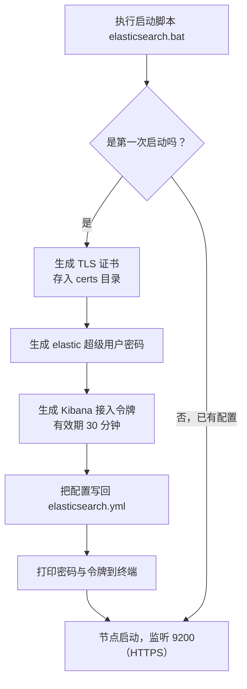
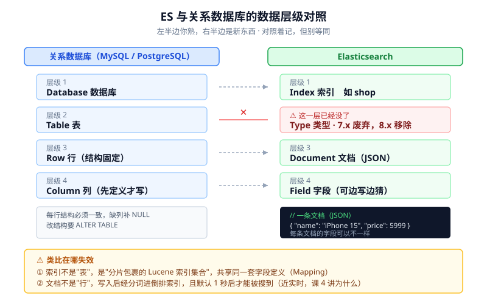
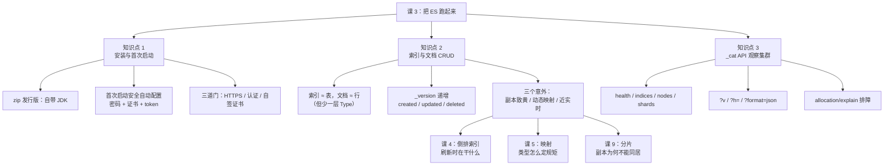

# 课 3：把 ES 跑起来

> 阶段 2 · 第 3 课 ｜ 知识点：本机安装与首次启动 / 索引文档 CRUD / 用 _cat API 观察集群
> 本课回答三个问题：**怎么装起来** → **怎么存进去** → **怎么看出问题**。
>
> 🧪 本课所有命令与输出，均为 **2026-08-31 在本机（Windows 11 + ES 9.5.1 原生 zip）实测**，不是从文档抄的。跑不通的地方我也会原样告诉你。

---

## 🎬 第一幕：场景引入

课 2 结尾我们说：ES 是一个把 Lucene 包成 REST 服务的分布式搜索引擎，倒排索引是它快的秘密。

现在，你要亲手把它跑起来了。

你打开浏览器，搜"Elasticsearch 快速上手"，第一条教程写着：

```bash
curl localhost:9200
```

然后告诉你，会看到这句著名的打招呼：

```json
{"tagline" : "You Know, for Search"}
```

你兴冲冲打开终端敲进去——

```bash
$ curl.exe localhost:9200
curl: (52) Empty reply from server
```

**什么都没有。**

你不信邪，加上 `https`：

```bash
$ curl.exe -k https://localhost:9200
{"error":{"root_cause":[{"type":"security_exception","reason":"missing authentication credentials..."}]}}
```

加账号密码试试？你根本不知道密码是什么。

**欢迎来到 ES 上手的第一道坎。** 那些教程没骗你，它们只是写于 2020 年——那时候 ES 还是 7.x，默认裸奔、谁都能连。现在是 9.5，**默认全副武装**。

这节课，我们走完这条"从零到能存能查"的路，并且把路上每个坑都亲手踩一遍。

---

## 🤔 第二幕：认知冲突

为什么一条最简单的命令会连不上？因为 9.x 在你和 ES 之间设了**三道门**。三道都过了，才算"连上"。

我用实测把它们摆出来（每条都是本机真实输出）：

| # | 门 | 你敲的命令 | 实际结果 |
|---|-----|-----------|----------|
| 1 | **协议门**：必须是 HTTPS | `curl.exe localhost:9200` | `curl: (52) Empty reply from server` |
| 2 | **认证门**：必须带账号密码 | `curl.exe -k https://localhost:9200` | `HTTP 401`（missing authentication credentials） |
| 3 | **证书门**：证书是自签的 | `curl.exe --cacert http_ca.crt https://localhost:9200` | `curl: (60) schannel: the revocation status is unknown` |

前两道门还算好理解——开了安全嘛，合情合理。

**第三道门最坑，而且是 Windows 独有的。**

同样的 `curl --cacert http_ca.crt` 命令，在 Linux / macOS 上一切正常。到了 Windows 上，它报 `revocation status is unknown`（吊销状态未知）。

原因是：Windows 自带的 curl 用的是 **Schannel**（Windows 的 TLS 后端），而不是 Linux 上常见的 OpenSSL。ES 自动生成的证书是自签 CA，没有吊销列表（CRL）也没有 OCSP 服务可查，Schannel 查不到吊销状态就直接拒绝。

> 这三道门，网上 90% 的中文教程只提到前两道。第三道会让你在"我明明按官方文档做了"的自我怀疑里耗掉半小时。

**先想 30 秒**：既然这么麻烦，把安全关掉不就行了？搜索一下，确实能找到 `xpack.security.enabled: false` 这种配置。

别急——我们先把路走通，最后再回来看这个问题（答案在知识点 1 的常见误区里）。

---

## 🔍 第三幕：层层揭示

### 知识点 1：本机安装与首次启动

**一句话定义**：下载一个自带 JDK 的压缩包，解压，跑一个脚本 —— ES 会在**第一次启动时**自动完成安全配置（开认证、发证书、设密码），然后你就可以通过 HTTPS 访问它了。

#### 直觉建立：精装公寓，不是毛坯房

装 ES 不像装 Redis 那样"解压即用、裸奔上阵"。它更像租一间**精装公寓**：

- **自带家具**（自带 JDK）—— 不用你先装 Java。实测日志里写着 `using bundled JDK [true]`，用的是 OpenJDK 26.0.1。
- **门锁出厂就装好了**（安全默认开启）—— 首次启动自动生成钥匙（密码）和门禁卡（证书）。
- **钥匙只在这一次给你看**—— 错过了就得用工具重配（我们待会儿就会踩到这个坑）。

> **类比的边界**：公寓钥匙丢了可以让物业重配，ES 的密码也能用 `elasticsearch-reset-password` 重设。但**安全配置只有首次启动那一次是全自动的**，之后再也不会自动生成证书了。所以第一次启动的输出，值得你认真看一眼。

#### 四种装法，为什么本机选 zip

| 方式 | 适合场景 | 本机能不能用 |
|------|---------|-------------|
| **zip / tar.gz 原生包** | 学习、手动掌控一切 | ✅ **本课用这个** |
| MSI 安装包 | Windows 生产部署、要跑成服务 | 可用，但服务方式不自动配 TLS |
| Docker | 快速起集群、多节点实验 | ❌ 本机未装 Docker |
| Elastic Cloud | 不想管运维 | 要钱，学习阶段不必 |

> 📌 本机环境：Windows 11、内存 63 GB、无 Docker。**官方推荐的 `start-local` 脚本依赖 Docker，本机走不通**，所以走原生 zip。

#### 目录结构：解压出来是什么

实测解压（646 MB，677,799,024 字节）后的顶层目录：

```
elasticsearch-9.5.1/
├── bin/          # 启动脚本与工具（elasticsearch.bat、elasticsearch-reset-password.bat…）
├── config/       # 配置文件（elasticsearch.yml、jvm.options、certs/…）
├── jdk/          # 自带 OpenJDK 26.0.1
├── lib/          # ES 自己的 jar
├── modules/      # 内置模块
├── plugins/      # 第三方插件（IK 分词器以后装这里）
├── logs/         # 日志
├── LICENSE.txt / NOTICE.txt / README.asciidoc
```

注意：**没有 `data` 目录**。它是在首次启动后才创建的——数据目录不需要你手动建。

官方把这个目录叫 `%ES_HOME%`，后面我们都用这个名字。

📚 官方文档：[Install Elasticsearch with .zip on Windows](https://www.elastic.co/guide/en/elasticsearch/reference/master/zip-windows.html)

#### 首次启动：那三件套是怎么生成的

跑到 `%ES_HOME%` 下执行启动脚本，ES 第一次启动时会做一件额外的事——**安全自动配置**。

所谓安全自动配置的"三件套"，指的是它自动生成的三样东西：

| 生成物 | 是什么 | 你什么时候会用到 |
|--------|--------|-----------------|
| **elastic 用户密码** | 超级管理员账号的初始密码 | **每一次请求都要带** |
| **TLS 证书** | 放在 `config/certs/` 下（`http.p12`、`transport.p12`、`http_ca.crt`） | 用 `--cacert` 认真校验证书时 |
| **Kibana 接入令牌** | 给 Kibana（ES 的官方可视化界面，课 2 提过）首次接入用的临时凭证，30 分钟有效 | 以后装 Kibana 时才用；**本课不需要** |

完整流程是这样的：



实测：启动完成后，`config/elasticsearch.yml` 里原本全是注释的文件，被自动写入了这些内容——

```yaml
xpack.security.enabled: true
xpack.security.enrollment.enabled: true
xpack.security.http.ssl:
  enabled: true
  keystore.path: certs/http.p12
xpack.security.transport.ssl:
  enabled: true
  verification_mode: certificate
  keystore.path: certs/transport.p12
  truststore.path: certs/transport.p12
cluster.initial_master_nodes: ["V_WYPGWU-PC5"]
http.host: 0.0.0.0
```

**这份文件就是"三件套"的账本**：安全开了、HTTP 层走 TLS、证书在 `certs/` 下。你以后想改任何安全设置，都是改这里。

#### ⚠️ 实测踩坑 1：把输出重定向到文件，密码就没了

我是这样启动的：

```bash
./bin/elasticsearch.bat > ../es-console.log 2>&1
```

然后去日志里找密码，**一行都没有**。翻遍日志只找到这一句：

```
[INFO ][o.e.x.s.InitialNodeSecurityAutoConfiguration]
Auto-configuration will not generate a password for the elastic built-in superuser,
as we cannot determine if there is a terminal attached to the elasticsearch process.
You can use the `bin/elasticsearch-reset-password` tool to set the password for the elastic user.
```

翻译：**"我判断不出这个进程有没有连着终端，所以不生成密码了。"**

因为我把输出重定向到了文件，ES 检测不到 TTY（终端），就**主动跳过了密码生成**。证书照发，密码不给。

> 💡 **对你的影响**：老老实实在**终端里直接运行**，不要重定向，密码就会打印出来。真错过了也别慌，用工具重设即可（下一步）。

#### ⚠️ 实测踩坑 2：重设密码的工具也要终端

```bash
$ ./bin/elasticsearch-reset-password.bat -u elastic -a
This tool will reset the password of the [elastic] user to an autogenerated value.
The password will be printed in the console.
Please confirm that you would like to continue [y/N]
ERROR: unable to read from standard input; is standard input open and a tty attached?, with exit code 65
```

它也要交互确认。解决办法是用 `-b`（batch，不征求确认）+ 管道喂密码：

```bash
printf 'ESlearn2026\nESlearn2026\n' | ./bin/elasticsearch-reset-password.bat -u elastic -i -b
```

```
Enter password for [elastic]: Re-enter password for [elastic]:
Password for the [elastic] user successfully reset.
```

> 你在自己的终端（CMD / PowerShell / Git Bash）里直接敲 `bin\elasticsearch-reset-password.bat -u elastic -i` 就行，它会交互式地让你输两次密码。上面加 `-b` 和管道，只是为了能在脚本里跑。

#### 怎么访问：三条路，实测结果不一样

设好密码后，本机实测三种写法：

| 写法 | 命令 | 结果 |
|------|------|------|
| **A. 跳过证书校验**（最省事） | `curl.exe -k -u elastic:密码 https://localhost:9200` | ✅ 成功 |
| **B. 正规校验证书** | `curl.exe --ssl-revoke-best-effort --cacert config\certs\http_ca.crt -u elastic:密码 https://localhost:9200` | ✅ 成功 |
| **C. Windows PowerShell 5.1** | `Invoke-RestMethod -Uri https://localhost:9200 ...` | ❌ 失败 |

**A 和 B 的区别要搞清楚**：

- `-k`（`--insecure`）是**不校验对方身份**——能连，但理论上可能连到假冒的服务器。本地学习完全够用。
- B 是**认真校验**：告诉 curl "用这个 CA 证书去验对方"，并额外加 `--ssl-revoke-best-effort` 允许"吊销状态查不到"这种情况通过。**在 Windows 上，这个参数不能省**，否则就是第二幕那道证书门。

**C 的失败要如实说明**：本机是 Windows PowerShell 5.1.26100，实测 `Invoke-RestMethod` 访问 ES 9.5.1 的 HTTPS 端点失败，报错"基础连接已经关闭: 发送时发生错误"。我试过绕过证书校验（`-SkipCertificateCheck` 在 5.1 里根本没有这个参数）、也试过强制 TLS 1.2 / 1.3，都不行。**根因我没有定位到**，所以本课不给 PowerShell 的方案。

> ✅ **结论：全课程统一用 `curl.exe`**。它是 Windows 10 17063+ 系统自带的（`C:\Windows\system32\curl.exe`），在 CMD、PowerShell、Git Bash 里都能敲。

#### 常见误区

**误区一：为了省事把安全关掉（`xpack.security.enabled: false`）。**

技术上可行，但这是**最坏的学习决策**：后面课 13 要讲的安全与权限，你会完全没手感；而且一旦养成习惯，将来在真实环境里就是一次数据泄露事故。安全配置的麻烦只在"第一次"，属于一次性成本。

**误区二：密码没记下来，以为重装能重来。**

重装会得到一个全新的集群，原来的数据虽然在 `data/` 目录里，但证书、keystore 全都对不上了。正确做法就是 `elasticsearch-reset-password`，5 秒钟的事。

**误区三：以为装 ES 要自己先装 Java。**

不用。zip 包自带 OpenJDK（实测 26.0.1，日志里 `using bundled JDK [true]`）。你自己装了 Java 反而可能因为版本不对出问题。

> 💡 顺带一个实测观察：本机 63 GB 内存，ES 自动把堆设成了 `-Xms31744m -Xmx31744m`（31 GB）。这是 ES 的默认策略——按物理内存的一半分配，上限 31 GB。学习用不了这么多，但也不影响，先不折腾它。

**一句话记住**：**ES 9.x 首次启动会自己上锁，钥匙打印在终端里；没看见钥匙就用 `elasticsearch-reset-password` 重配一把。**

---

### 知识点 2：索引与文档 CRUD

**一句话定义**：**索引（Index）**是"同一类文档的集合"，**文档（Document）**是一条 JSON 记录；CRUD 就是对它们做增删查改，全部通过 HTTP 动词完成。

#### 直觉建立：索引≈表，文档≈行……吗？

先借用你熟悉的东西：



数据库 → 表 → 行 → 列，对应 ES 的 索引 → （这层没了）→ 文档 → 字段。

**这个类比在三个地方会失效**（图上红框标出来的）：

1. **少了一层**：ES 7.x 废弃、8.x 彻底移除了 Type。现在是两层结构，别再写 `/index/type/id` 这种老路径。
2. **行有固定结构，文档没有**：同一个索引里的两条文档，字段可以完全不同。这不是"容错"，是设计如此。
3. **写入 ≠ 立刻能搜到**：这是个大坑，下面会用实测数据专门讲。

#### CRUD 端点：五个动词走天下

| 操作 | HTTP | 路径 | 说明 |
|------|------|------|------|
| 建索引 | `PUT` | `/索引名` | 可指定分片数、副本数、映射 |
| 写文档（指定 ID） | `PUT` | `/索引名/_doc/1` | ID 已存在则**整体覆盖** |
| 写文档（自动生成 ID） | `POST` | `/索引名/_doc` | 让 ES 给你分配 ID |
| 读文档 | `GET` | `/索引名/_doc/1` | 不存在返回 404 |
| 局部更新 | `POST` | `/索引名/_update/1` | 只改部分字段 |
| 删文档 | `DELETE` | `/索引名/_doc/1` | |
| 删索引 | `DELETE` | `/索引名` | **连数据带结构一起没** |

📚 官方文档：[Index APIs](https://www.elastic.co/guide/en/elasticsearch/reference/master/index.html) ｜ [Document APIs](https://www.elastic.co/guide/en/elasticsearch/reference/master/docs.html)

#### 实测：完整的增删改查

下面每一步都是本机真实输出。为了让你看清版本变化，我对同一个文档连续做了四次操作。

**① 创建索引**（1 个主分片、0 个副本）

```bash
curl.exe -s -k -u elastic:ESlearn2026 -X PUT "https://localhost:9200/shop" \
  -H "Content-Type: application/json" \
  -d '{"settings":{"number_of_shards":1,"number_of_replicas":0}}'
```

```json
{"acknowledged":true,"shards_acknowledged":true,"index":"shop"}
```

**② 写入文档（指定 ID = 1）**

```bash
curl.exe -s -k -u elastic:ESlearn2026 -X PUT "https://localhost:9200/shop/_doc/1" \
  -H "Content-Type: application/json" \
  -d '{"name":"iPhone 15","price":5999,"brand":"Apple","tags":["手机","5G"]}'
```

```json
{"_index":"shop","_id":"1","_version":1,"result":"created","_shards":{"total":1,"successful":1,"failed":0},"_seq_no":0,"_primary_term":1}
```

**③ 写入文档（自动生成 ID）**

```json
{"_index":"shop","_id":"NRroVaABr1ViNkVAhAo3","_version":1,"result":"created",...}
```

**④ 读取**

```json
{"_version":1,"found":true,"_source":{"name":"iPhone 15","price":5999,"brand":"Apple","tags":["手机","5G"]}}
```

**⑤ 同一个 ID 再 PUT 一次（整体覆盖）**

```json
{"_index":"shop","_id":"1","_version":2,"result":"updated",...}
```

**⑥ 局部更新（只改 price）**

```json
{"_index":"shop","_id":"1","_version":3,"result":"updated",...}
```

**⑦ 删除**

```json
{"_version":4,"result":"deleted"}
```

**⑧ 删完再读** → `HTTP 404`

**注意 `_version` 的变化：1 → 2 → 3 → 4。**

- 每次写入、覆盖、更新、删除，版本号都 +1。
- **删除之后版本号还在涨**（变成 4 而不是归零）。
- `result` 字段告诉你这次到底干了什么：`created` / `updated` / `deleted`。

这个版本号不是给你看热闹的——它是**乐观并发控制**的基础（课 9 会讲 `_seq_no` 和 `_primary_term` 怎么防并发写冲突）。

> 💡 顺带一提，`-d` 里的 JSON 在 **Git Bash** 里用单引号包起来即可；在 **CMD** 里要用双引号、内部双引号转义成 `"""`；在 **PowerShell** 里可以用 here-string。本课示例按 Git Bash 写法给。

#### 三个"意外"，每个都藏着后面的课

##### 意外一：不建索引直接写文档，集群变黄了

我偷懒没建索引，直接往一个不存在的索引写：

```bash
curl.exe -s -k -u elastic:ESlearn2026 -X POST "https://localhost:9200/auto_demo/_doc" \
  -H "Content-Type: application/json" \
  -d '{"title":"自动建索引","price":19.9}'
```

写入成功了。但紧接着看集群状态：

```
status node.total shards unassign active_shards_percent
yellow          1      5        0            1          83.3%
```

**从 green 变成 yellow 了。** 原因：自动创建的索引，默认 **1 主分片 + 1 副本**。而你只有一个节点，副本分片没地方放——主分片和副本放在同一个节点上毫无意义，ES 拒绝这么干。

用官方的分配解释 API 一问便知：

```bash
curl.exe -s -k -u elastic:密码 "https://localhost:9200/_cluster/allocation/explain"
```

```json
{"index":"auto_demo","shard":0,"primary":false,"current_state":"unassigned",
 "unassigned_info":{"reason":"INDEX_CREATED","last_allocation_status":"no_attempt"}}
```

修起来一行就行（把副本改成 0）：

```bash
curl.exe -s -k -u elastic:ESlearn2026 -X PUT "https://localhost:9200/auto_demo/_settings" \
  -H "Content-Type: application/json" \
  -d '{"number_of_replicas":0}'
```

两秒后再看：`green 1 5 0 100.0%`。

> 🔗 **这是课 9《分片：ES 分布式的基石》的引子**：什么是主分片、什么是副本、为什么副本不能跟主分片同居、yellow 到底意味着什么。这里你只要记住——**单节点学习环境，建索引时显式指定 `"number_of_replicas": 0`**。

##### 意外二：字段类型是你没开口，它自己猜的

写完 `auto_demo`，看一下 ES 认为这些字段是什么类型：

```json
{"auto_demo":{"mappings":{"properties":{
  "created":{"type":"date"},
  "onsale":{"type":"boolean"},
  "price":{"type":"float"},
  "title":{"type":"text","fields":{"keyword":{"type":"keyword","ignore_above":256}}}
}}}}
```

我只写了数据，一个类型都没声明，ES 自己猜了四个：

| 我写的值 | ES 猜的类型 | 评价 |
|---------|------------|------|
| `"2026-08-31"` | `date` | 猜对了 |
| `true` | `boolean` | 猜对了 |
| `19.9` | **`float`** | ⚠️ 注意是 float 不是 double |
| `"自动建索引"` | **`text` + `keyword` 子字段** | 一个字段两种用法 |

两个点值得警惕：

1. **浮点数默认猜成 `float`**（单精度，约 7 位有效数字）。金额、ID、大整数用 float 会丢精度。
2. **字符串默认给两个身份**：`text`（分词，用于搜索）+ `keyword`（不分词，用于精确匹配/排序/聚合）。这就是 multi-fields。

> 🔗 **这是课 5《映射：给数据定规矩》的引子**：这个"自动猜类型"的机制叫**动态映射（Dynamic Mapping）**。方便，但猜错了改起来很痛——**已存在字段的类型不能改，只能重建索引**。

##### 意外三：写完立刻搜，搜不到

这是本课最反直觉的一条。实测：

```bash
# 1) 写入一条华为 Mate60
curl.exe -s -k -u elastic:ESlearn2026 -X POST "https://localhost:9200/shop/_doc" \
  -H "Content-Type: application/json" \
  -d '{"name":"华为Mate60","price":6999}'
# 返回 result: created，写入成功

# 2) 立刻搜索
curl.exe "https://localhost:9200/shop/_search"
{"hits":{"total":{"value":1,"relation":"eq"}}}     ← 只有 1 条？我明明写了 2 条

# 3) 等 1.2 秒，再搜一次
{"hits":{"total":{"value":2,"relation":"eq"}}}     ← 现在 2 条了
```

**写入成功的文档，1 秒内搜不到。**

ES 管这叫**近实时（Near Real-Time, NRT）**：文档先写进内存缓冲区，每隔 1 秒（默认 `refresh_interval`）才"刷新"一次，刷新之后才对搜索可见。

赶时间的话，写的时候加个参数强制立刻刷新：

```bash
curl.exe -s -k -u elastic:ESlearn2026 -X POST "https://localhost:9200/shop/_doc?refresh=true" \
  -H "Content-Type: application/json" \
  -d '{"name":"iPad Air","price":4399}'
curl.exe "https://localhost:9200/shop/_search"
{"hits":{"total":{"value":3,"relation":"eq"}}}     ← 立刻就 3 条了
```

> 🔗 **这条线索分两头**：
> - **课 4** 回答"刷新的时候到底在干什么"——把内存里的文档切成 Lucene 段、建倒排索引。理解了倒排索引，你就知道为什么"写"和"可搜索"是两件事。
> - **课 9** 回答"这个 1 秒能不能调"——能，但调了会影响写入吞吐，那是生产调优的范畴。

#### 常见误区

**误区一：把 `PUT /index/_doc/1` 当"更新"用。**

它是**整体替换**。你只传 `name`，原来文档里的 `price`、`tags` 就全没了。要改部分字段请用 `_update`。

**误区二：用 ES 当数据库做事务。**

单文档写入是原子的，但**多文档之间没有事务**。ES 没有回滚。它也不是你的主数据源——数据同步模式在课 12 会讲。

**误区三：看到 `result: created` 就以为用户能搜到了。**

见意外三。近实时意味着"写入成功"和"可被搜索"之间有一秒级的延迟。

**一句话记住**：**文档是 JSON、字段可以不一样、写完一秒后才搜得到、类型让 ES 猜是方便但会埋雷。**

---

### 知识点 3：用 _cat API 观察集群

**一句话定义**：`_cat` 是一组返回**纯文本表格**的运维查询接口，用来快速查看集群、节点、索引、分片的当前状态。

#### 直觉建立：汽车的仪表盘

CRUD 是开车，`_cat` 是看仪表盘。

它有个很有辨识度的入口——敲 `GET /_cat` 会列出所有可用的 cat 接口，列表开头画着一只猫：

```
=^.^=
/_cat/allocation
/_cat/shards
/_cat/master
/_cat/nodes
/_cat/indices
/_cat/segments
/_cat/count
...
```

`cat` 这个名字，官方说是 **Compact and Text** 的缩写，但这只猫说明他们心里想的就是 cat。

#### 最常用的五个

| 接口 | 看什么 | 什么时候用 |
|------|--------|-----------|
| `_cat/health?v` | 集群整体健康（green/yellow/red） | **排障第一句** |
| `_cat/indices?v` | 所有索引：分片数、文档数、占用空间 | 看数据规模 |
| `_cat/nodes?v` | 节点：堆内存、CPU、角色、谁是 master | 看资源与角色 |
| `_cat/shards?v` | 每个分片的状态与所在节点 | yellow/red 时定位是哪个分片 |
| `_cat/count?v` | 集群总文档数 | 快速计数 |

#### 三个参数，让它更好用

| 参数 | 作用 | 示例 |
|------|------|------|
| `?v` | **显示表头**（不加则只有数据没有列名） | `_cat/health?v` |
| `?h=` | **只显示指定列** | `_cat/indices?h=index,docs.count,store.size` |
| `?format=json` | 输出 JSON 而不是文本表格 | `_cat/indices?format=json` |

实测对比（同一个 `_cat/indices`）：

```
# 默认（带 ?v）
health status index uuid                   pri rep docs.count docs.deleted store.size pri.store.size
green  open   shop  BB09fJLgR8iI8UqwS8iyYQ   1   0          1            4     25.3kb         25.3kb
```

```json
# ?h=index,health,pri,rep,docs.count&format=json
[{"index":"auto_demo","health":"yellow","pri":"1","rep":"1","docs.count":"1","store.size":"6.4kb"},
 {"index":"shop","health":"green","pri":"1","rep":"0","docs.count":"3","store.size":"37.4kb"}]
```

#### 实测：读懂这三张表

**① `_cat/health?v` —— 先看这一张**

```
epoch      timestamp cluster       status node.total node.data shards pri relo init unassign active_shards_percent
1788147724 03:42:04  elasticsearch green           1         1      4   4    0    0        0                 100.0%
```

重点看三列：
- **`status`**：`green`（一切正常）/ `yellow`（主分片都在，副本没分配完）/ `red`（有主分片缺失，**数据已经丢了**）
- **`unassign`**：未分配的分片数，> 0 就要查原因
- **`active_shards_percent`**：可用分片百分比

**② `_cat/indices?v` —— 看数据规模**

```
health status index uuid                   pri rep docs.count docs.deleted store.size pri.store.size
green  open   shop  BB09fJLgR8iI8UqwS8iyYQ   1   0          1            4     25.3kb         25.3kb
```

注意 **`docs.deleted` 这一列是 4，而 `docs.count` 只有 1**。

这里 `docs.deleted` 是 4，而 `docs.count` 只有 1——**比实际"活着"的文档还多，这是正常的**。

原因：ES 删除文档不是立刻物理擦除，而是先打个删除标记；**覆盖和更新同样会让旧版本变成"已删除"**，这些标记要等段合并（segment merge）时才真正清理。所以这一列统计的是"被覆盖和被删除的文档版本数"，具体数字与段合并的执行时机有关。

（段合并是课 9 的内容，这里先记结论：`docs.deleted` 大不代表数据丢了。）

**③ `_cat/nodes?v` —— 看这台机器**

```
ip        heap.percent ram.percent cpu load_1m node.role   master name
127.0.0.1            5          94  13         cdfhilmrstw *      V_WYPGWU-PC5
```

- **`node.role` = `cdfhilmrstw`**：一个字母一个角色，学习阶段你只需要知道——**单节点默认承担所有角色**，生产环境必须按角色拆分成不同节点（阶段 4 会讲）。
- **`master` = `*`**：这颗星表示它是主节点。
- **`heap.percent` 5%**：堆内存用了 5%（总堆 31 GB，用得很少，正常）。

#### yellow 了怎么办：一条标准排查路径

知识点 2 的意外一里，集群变黄了。当时我跳过了排查过程，这里补全——**这是你以后每天都会走的路径**：


实测第四步的输出：

```json
{"index":"auto_demo","shard":0,"primary":false,"current_state":"unassigned",
 "unassigned_info":{"reason":"INDEX_CREATED","last_allocation_status":"no_attempt"}}
```

`reason: INDEX_CREATED` + `last_allocation_status: no_attempt` = 刚建的索引，副本**根本没尝试过**分配。结合"只有 1 个节点"，结论就清楚了：没地方放。

#### 常见误区

**误区一：程序里用 `_cat` 取数据。**

`_cat` 是**给人看的文本**，列顺序和列名在不同版本间可能变。程序里请用对应的 JSON API（如 `GET /_cluster/health`、`GET /_stats`）。

**误区二：不加 `?v`。**

不加 `?v` 只有数据没有表头，第一次看会一脸茫然。养成习惯加上。

**误区三：看到 `docs.count` 比预期少就以为丢数据了。**

先看有没有 `docs.deleted`（版本历史），再考虑近实时（刚写的文档可能还没刷新）。

**一句话记住**：**出问题先敲 `_cat/health?v`，顺着 health → indices → shards → allocation/explain 这四步走，ES 会自己告诉你哪里不对。**

---

## ✋ 第四幕：实操验证

这一幕把本课串成一条可以**从上到下复制执行**的完整流程。跑完，你机器上就有一个活着的可用的 ES 了。

> 环境：Windows 11，无 Docker。所有命令在 **Git Bash** 中实测通过；在 CMD / PowerShell 里把换行符 `^` 换成对应写法即可（`curl.exe` 本身通用）。

### 第 1 步：下载并解压（约 4 分钟）

```bash
cd D:/projects/learning/elasticsearch/playground

# 下载（646 MB，实测 2 分 19 秒）
curl.exe -o es.zip "https://artifacts.elastic.co/downloads/elasticsearch/elasticsearch-9.5.1-windows-x86_64.zip"

# 解压（Windows 的 tar 不认 zip，用 Python 最稳）
python -m zipfile -e es.zip .

cd elasticsearch-9.5.1
```

> 版本说明：本文基于 **9.5.1**（2026-08-11 发布）。当前最新是 **9.5.2**（2026-08-20 发布，核查于 2026-08-31）。两者同为 9.5 系列，安装流程完全一致——把上面 URL 里的版本号换掉即可。

### 第 2 步：首次启动，记下密码

```bash
# 关键：直接在终端里跑，不要重定向输出！
./bin/elasticsearch.bat
```

启动过程中你会看到这样的输出（**务必复制保存**）：

```
✅ Elasticsearch security features have been automatically configured!
✅ Authentication is enabled and cluster connections are encrypted.

ℹ️  Password for the elastic user (reset with `bin/elasticsearch-reset-password -u elastic`):
  <这里是一串自动生成的密码>

ℹ️  HTTP CA certificate SHA-256 fingerprint:
  <一串十六进制指纹>
```

看到 `started` 且日志不再滚动，就是起来了（实测约 30 秒）。

**没看到密码？**（比如你重定向了输出）开一个新终端，执行：

```bash
./bin/elasticsearch-reset-password -u elastic -i
```

### 第 3 步：第一次握手

```bash
# 把密码存成变量，后面省事
export ES_PW='你的密码'

# 用 -k 跳过证书校验，先看一眼
curl.exe -s -k -u elastic:$ES_PW "https://localhost:9200?filter_path=name,cluster_name,version.number,tagline"
```

预期输出（本机实测）：

```json
{
  "name" : "V_WYPGWU-PC5",
  "cluster_name" : "elasticsearch",
  "version" : { "number" : "9.5.1" },
  "tagline" : "You Know, for Search"
}
```

看到 **"You Know, for Search"** —— 这就是本课开头那条教程承诺给你的东西。你绕了三道门才拿到它，而这正是 ES 9.x 的真实上手体验。

**验证一下三道门确实存在**（可选，但很有教育意义）：

```bash
curl.exe -sS --max-time 5 http://localhost:9200          # (52) Empty reply from server
curl.exe -s -k -o /dev/null -w "%{http_code}\n" https://localhost:9200    # 401
curl.exe -s -k -o /dev/null -w "%{http_code}\n" -u elastic:wrongpw https://localhost:9200  # 401
```

### 第 4 步：建一个规范的索引（副本设为 0）

```bash
curl.exe -s -k -u elastic:$ES_PW -X PUT "https://localhost:9200/shop" \
  -H "Content-Type: application/json" \
  -d '{"settings":{"number_of_shards":1,"number_of_replicas":0}}'
# {"acknowledged":true,"shards_acknowledged":true,"index":"shop"}
```

> 单节点学习环境，**记得写 `"number_of_replicas": 0`**，否则集群必黄。

### 第 5 步：CRUD 走一遍，盯住 _version

```bash
# 增
curl.exe -s -k -u elastic:$ES_PW -X PUT "https://localhost:9200/shop/_doc/1" \
  -H "Content-Type: application/json" -d '{"name":"iPhone 15","price":5999,"brand":"Apple"}'
# _version:1, result:created

# 查
curl.exe -s -k -u elastic:$ES_PW "https://localhost:9200/shop/_doc/1?filter_path=found,_version,_source"

# 改（整体覆盖）
curl.exe -s -k -u elastic:$ES_PW -X PUT "https://localhost:9200/shop/_doc/1" \
  -H "Content-Type: application/json" -d '{"name":"iPhone 15 Pro","price":7999}'
# _version:2, result:updated

# 改（局部更新）
curl.exe -s -k -u elastic:$ES_PW -X POST "https://localhost:9200/shop/_update/1" \
  -H "Content-Type: application/json" -d '{"doc":{"price":6999}}'
# _version:3, result:updated

# 删
curl.exe -s -k -u elastic:$ES_PW -X DELETE "https://localhost:9200/shop/_doc/1"
# _version:4, result:deleted
```

### 第 6 步：亲手验证"近实时"

```bash
# 写入
curl.exe -s -k -u elastic:$ES_PW -X POST "https://localhost:9200/shop/_doc" \
  -H "Content-Type: application/json" -d '{"name":"华为Mate60","price":6999}'

# 立刻搜 → 记下数字
curl.exe -s -k -u elastic:$ES_PW "https://localhost:9200/shop/_search?filter_path=hits.total"

# 等 1.2 秒再搜 → 数字变大了
sleep 1.2
curl.exe -s -k -u elastic:$ES_PW "https://localhost:9200/shop/_search?filter_path=hits.total"
```

**如果你看到两个数字不一样，恭喜——你亲手复现了 ES 最容易被误解的行为。**

> 万一两个数字一样呢？那说明你敲命令太慢，中间的 1 秒已经过去了。把上面的"写入 + 立刻搜"两步连着快速执行几遍，或者干脆去掉 `sleep` 直接对比，一定会看到差异。

### 第 7 步：用 _cat 给集群做体检

```bash
curl.exe -s -k -u elastic:$ES_PW "https://localhost:9200/_cat/health?v"
curl.exe -s -k -u elastic:$ES_PW "https://localhost:9200/_cat/indices?v"
curl.exe -s -k -u elastic:$ES_PW "https://localhost:9200/_cat/nodes?v"
```

**如果 status 是 yellow**，走四步排查：

```bash
curl.exe -s -k -u elastic:$ES_PW "https://localhost:9200/_cat/indices?v"          # 找黄索引
curl.exe -s -k -u elastic:$ES_PW "https://localhost:9200/_cat/shards?v"           # 找未分配分片
curl.exe -s -k -u elastic:$ES_PW "https://localhost:9200/_cluster/allocation/explain"  # 问原因
# 修：把那个索引的副本改成 0
curl.exe -s -k -u elastic:$ES_PW -X PUT "https://localhost:9200/索引名/_settings" \
  -H "Content-Type: application/json" -d '{"number_of_replicas":0}'
```

跑完这七步，你的机器上就有一个：能连上、存了数据、状态 green 的 ES 9.5.1。

---

## 🎓 第五幕：体系收束

### 本课知识地图



### 三句话记住本课

1. **装 ES 就是解压 + 跑脚本，但 9.x 首次启动会自己上锁**——密码打印在终端里，没看见就用 `elasticsearch-reset-password` 重配。
2. **文档是 JSON、写完一秒后才搜得到、字段类型默认靠猜**——这三个特性分别通向课 4、课 9、课 5。
3. **出事先看 `_cat/health?v`**，然后按 health → indices → shards → allocation/explain 四步走，ES 会自己交代原因。

### 伏笔表

| 本课留下的疑问 | 在哪一课解开 |
|---------------|-------------|
| 刷新（refresh）的时候到底在干什么？为什么写完不能立刻搜？ | **课 4：倒排索引——快到离谱的秘密** |
| 文档被切成"段"（segment）是什么东西？段合并又是啥？ | **课 9：分片：ES 分布式的基石** |
| `price` 被猜成 `float` 会不会出事？`text` + `keyword` 双字段怎么用？ | **课 5：映射：给数据定规矩** |
| 为什么副本不能和主分片放同一个节点？单节点怎么规划分片？ | **课 9 / 课 10** |
| `_seq_no` 和 `_primary_term` 是干嘛的？ | **课 9（并发写与乐观锁）** |
| 那个 `elasticsearch.yml` 里其他的 xpack 配置都是什么？ | **课 13：安全与权限** |

### 与课 1、课 2 的呼应

- **课 1** 我们用思维实验论证"数据库搞不定搜索"。本课你终于有了自己的 ES——后面每一课的验证，都不再是纸上推演。
- **课 2** 讲过 ES 的出身与定位、以及"近实时"这个词。当时它只是个名词，**本课你亲手复现了它**（写完立刻搜 = 1 条，1.2 秒后 = 2 条）。

### 📋 命令速查卡

| 场景 | 命令（省略 `curl.exe -s -k -u elastic:密码`） |
|------|---------------------------------------------|
| 看版本 | `https://localhost:9200` |
| 建索引（副本 0） | `-X PUT "…/shop" -d '{"settings":{"number_of_replicas":0}}'` |
| 写文档（指定 ID） | `-X PUT "…/shop/_doc/1" -d '{...}'` |
| 写文档（自动 ID） | `-X POST "…/shop/_doc" -d '{...}'` |
| 写 + 立刻可搜 | `-X POST "…/shop/_doc?refresh=true" -d '{...}'` |
| 读文档 | `"…/shop/_doc/1"` |
| 局部更新 | `-X POST "…/shop/_update/1" -d '{"doc":{...}}'` |
| 删文档 / 删索引 | `-X DELETE "…/shop/_doc/1"` / `-X DELETE "…/shop"` |
| 看 mapping | `"…/shop/_mapping"` |
| 集群健康 | `"…/_cat/health?v"` |
| 索引列表 | `"…/_cat/indices?v"` |
| 节点列表 | `"…/_cat/nodes?v"` |
| 分片明细 | `"…/_cat/shards?v"` |
| yellow 问诊 | `"…/_cluster/allocation/explain"` |
| 只取部分字段 | 任意请求后加 `?filter_path=a,b,c` |
| 改副本数 | `-X PUT "…/shop/_settings" -d '{"number_of_replicas":0}'` |
| 重设 elastic 密码 | `bin\elasticsearch-reset-password -u elastic -i`（在终端里直接敲，不要重定向） |

---

## 🚀 下一批接力提示词

> 学完本课后，**复制下面这段文字发给 AI**，即可无缝进入下一课（无需重新描述上下文）：

```
继续学 Elasticsearch。我的学习档案在 elasticsearch/00-学习档案.md，
刚学完阶段 2《核心原理与上手》课 3《把 ES 跑起来》的全部知识点
（本机安装与首次启动 / 索引文档 CRUD / 用 _cat API 观察集群），
本机已有运行中的 ES 9.5.1（原生 zip 发行版，访问地址 https://localhost:9200，
已用 curl.exe -k -u elastic:密码 的方式跑通）。

请按大纲继续讲解课 4《倒排索引——快到离谱的秘密》的三个知识点：
倒排索引原理 / 分词与分析器 / 中文分词与 IK。
重点接住本课留下的伏笔：刷新（refresh）时到底在干什么，
为什么文档写完要等 1 秒才能被搜到。
```

## 🧭 课程导航

- **上一课**：[课 2 · ES 是谁、凭什么](../../1-为什么需要ES/lessons/lesson-02-ES是谁凭什么.md)
- **下一课**：[课 4 · 倒排索引——快到离谱的秘密](lesson-04-倒排索引的秘密.md)
- **本阶段**：[阶段 2 概览](../overview.md)
- **返回**：[课程目录](../../02-课程目录.md) ｜ [学习路径总览](../../01-学习路径总览.md)
