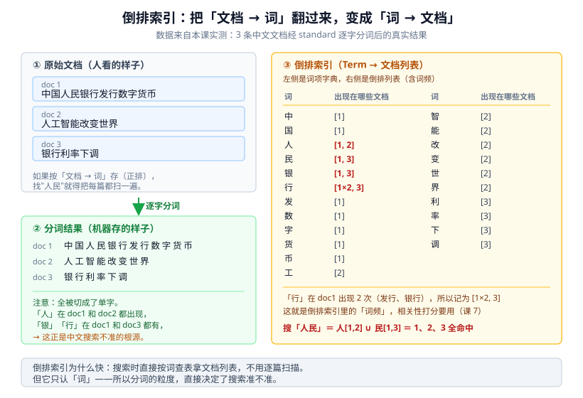
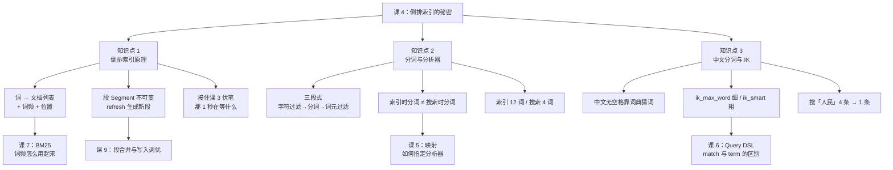

# 课 4：倒排索引——快到离谱的秘密

> 阶段 2 · 第 4 课 ｜ 知识点：倒排索引原理 / 分词与分析器 / 中文分词与 IK
> 本课回答三个问题：**ES 凭什么这么快** → **文本进去变成了什么** → **中文为什么必须装插件**。
>
> 🧪 本课所有命令与输出，均为 **2026-08-31 在本机（Windows 11 + ES 9.5.1 + IK 9.5.1）实测**。IK 插件是真装了的，不是画饼。

---

## 🎬 第一幕：场景引入

课 3 结尾，你亲手撞上了一个诡异现象：**文档写入成功，1 秒之内却搜不到。**

当时我告诉你这叫"近实时"，并说答案在课 4。现在补上另一半——

你往 ES 里塞了 4 条中文新闻，然后搜索"人民"。返回结果是这样的（本机实测）：

```
搜「人民」→ 命中 4 条：
  1. 中国人民银行发行数字货币   score 0.898   ✅ 这是我想要的
  3. 民办大学最新排名           score 0.710   ❌ 它只有"民"
  4. 工人日报社论               score 0.405   ❌ 它只有"人"
  2. 人工智能改变世界           score 0.365   ❌ 它只有"人"
```

**4 条里 3 条是垃圾。**

你明明搜的是"人民"这个完整的词，ES 却把"民"开头的大学排名和"人"开头的日报社论都翻了出来。

更糟的是，这不是 bug，这是 ES 对中文的**默认行为**。

这两件事——"写入后要等 1 秒"和"中文搜不准"——其实是同一个根因的两副面孔：**ES 在写入时做了一件额外的事，而且做得跟你想的不一样。**

这件额外的事就是**建倒排索引**。在此之前，先说个冷知识：这个想法比 ES 老得多。

> 📜 **它不是 ES 发明的，甚至不是计算机时代的产物**。倒排索引的思想可以追到图书馆的卡片目录——按主题查书，而不是翻遍书架找主题。**20 世纪 50 年代**，IBM 的 Hans Peter Luhn 提出用词对文档建索引、按词匹配程度检索的方法，被视为倒排文档技术的雏形；**60 年代** Gerard Salton 在康奈尔大学的 SMART 系统中将其形式化。ES 做的事，是把这套 70 年前的理论，工程化到了分布式、近实时的规模。
> （核查于 2026-08-31。关于"谁第一个提出"存在不同说法——另有资料归功于 1950 年代的 Connie M. Weaver，此处不做定论。）

---

## 🤔 第二幕：认知冲突

先想两个问题，答案都藏在同一个机制里：

**问题一：数据库也能查文本，为什么它慢，ES 就快？**

你可能会说"因为 ES 有索引"。但 MySQL 也有 B+ 树索引啊。区别在于——**B+ 树索引解决的是"按某个字段精确/范围查找"，它没法回答"哪些文档里提到了'人民'"**。

MySQL 的 `LIKE '%人民%'` 只能全表扫描（课 1 已经论证过）。而 ES 能**直接查表拿到"所有提到人民的文档"**。

它凭什么能？因为它建了一张"反过来的表"。

**问题二：既然建了索引，为什么写完不立刻能搜？**

因为**建索引本身要花时间**。文档写进去，先待在内存缓冲区里；每隔 1 秒，ES 才把这一批文档"倒排"成索引结构。在那之前，它只是一份没人能检索的原始数据。

**而第三个问题最要命：索引里的"词"到底是什么？**

对英文，空格天然分好了词。对中文——**"中国人民银行发行数字货币"里，哪个是词？**

ES 默认的选择简单粗暴：**一个字一个词，全部切开。**

于是"人民"这个你以为的词，在索引里根本不存在，只存在"人"和"民"两个单字条目。搜索"人民"被拆成"人 OR 民"，于是含"人"的《工人日报》和含"民"的《民办大学》全都命中了。

> **这一课的真正主题**：ES 快的秘密是倒排索引；但倒排索引的质量，完全取决于"词"切得对不对。**快不难，准才难。**

---

## 🔍 第三幕：层层揭示

### 知识点 1：倒排索引原理

**一句话定义**：**倒排索引（Inverted Index）**是一张"词 → 文档列表"的映射表，由**词项字典**（所有出现过的词）和**倒排列表**（每个词出现在哪些文档、出现几次、在什么位置）两部分组成。

#### 直觉建立：书末尾的索引页

绝大多数技术书最后都有个"索引"页，长这样：

```
分布式 ........... 42, 118, 203
分片 ............. 56, 118
副本 ............. 118, 240
```

你想找"分片"出现在哪几页，不用翻完整本书——**直接查这张表，翻到第 56 页和第 118 页就行**。

倒排索引就是这个东西，只不过：

- "页"换成了"文档 ID"
- 除了页码，还额外记了**出现几次**（词频）和**在什么位置**（位置信息）

> **类比的边界**：书的索引页是人工编的，只列关键概念；倒排索引是自动建的，**几乎每个词都会收录**。而且书出版后索引就固定了，倒排索引要能持续追加——这就引出了"段"的概念（下面讲）。

#### 结构长什么样：一张实测出来的图



图上的数据不是画出来的，是从本机 ES 里取出来的。左边是我们写进去的 3 条真实文档，右边是它们被逐字分词后形成的倒排索引。

**注意两个关键点**：

1. **「人」→ [1, 2]**：同一个词出现在多篇文档里，倒排列表就存多个文档 ID。这就是"搜一次查表，直接拿到全部结果"的底气。
2. **「行」→ [1×2, 3]**：词频（出现 2 次）也被记下来了。这个数字后面会变成相关性打分的输入（课 7 的 BM25）。

#### 内部结构：除了文档 ID，还存了什么

用本机实测的 `termvectors` 接口，直接看 doc 1 在索引里存了什么（原文：**中国人民银行发行数字货币**）。

> 🔍 说明一下视角：`termvectors` 是"**从文档出发**"去看它有哪些词——相当于把倒排索引反着读一遍给你看。它返回的数据（词、词频、位置）就是倒排索引里真实存的东西，只是站到了文档这一侧。

```
term | 词频 | 出现位置
-----|------|--------
  中  |  1   | [0]
  国  |  1   | [1]
  人  |  1   | [2]
  民  |  1   | [3]
  银  |  1   | [4]
  行  |  2   | [5, 7]     ← 注意：词频 2，位置 5 和 7
  发  |  1   | [6]
  数  |  1   | [8]
  字  |  1   | [9]
  货  |  1   | [10]
  币  |  1   | [11]
```

12 个字，"行"出现了两次（银行、发行），所以去重后是 **11 个 term**。

倒排列表里每个条目至少包含三样东西：

| 存的东西 | 干什么用 | 例子 |
|---------|---------|------|
| **文档 ID** | 定位文档 | doc 1 |
| **词频 TF** | 相关性打分 | 「行」= 2 |
| **位置 position** | 短语查询（"中国人民"要相邻才算） | 「行」= [5, 7] |

第三样最容易被忽略，但它是短语查询的基础——搜索"中国人民"时，ES 要检查"中"和"国"的位置是不是紧挨着。

📚 官方文档：[Term vectors API](https://www.elastic.co/guide/en/elasticsearch/reference/master/docs-termvectors.html)

#### 查询时怎么用：一次查表，不走全表扫描

实测用 term 查询（直接按词查，不分词）验证：

```bash
curl.exe -s -k -u elastic:密码 -X POST "https://localhost:9200/news/_search" \
  -H "Content-Type: application/json" \
  -d '{"query":{"term":{"title":"民"}}}'
```

```json
命中 2 条：
  doc3「民办大学最新排名」        score 0.875
  doc1「中国人民银行发行数字货币」  score 0.727
```

看到没——查"民"这个字，ES 直接去倒排索引里找到 `民 → [1, 3]`，取出这两个文档，**一步到位**。没有扫描，没有遍历。

#### 接住课 3 的伏笔：refresh 到底在干什么

现在回答那 1 秒。核心概念是**段（Segment）**。

**段是一个"自包含的小型倒排索引"**，一旦生成就**不可修改**。

> ⚠️ **先帮你分清两个容易混的概念**：
> - **段（Segment）**——Lucene 层的概念，一个段就是一份小型倒排索引，是本文的主角。
> - **分片（Shard）**——ES 层的概念，一个分片是"一堆段的容器"。
>
> 关系是：**分片里装着很多段**。分片怎么分布、副本怎么摆，是**课 9** 的事；本课只关心段本身。

ES 的写入流程是这样的：


关键点：**只有生成了段，文档才可被搜索**。课 3 那 1 秒，就是等下一次 refresh 生成新段。

本机实测，把这条链路拆给你看：

**① 先看看现在有几个段**

```bash
curl.exe -s -k -u elastic:密码 "https://localhost:9200/_cat/segments/news?v&h=shard,segment,docs.count,size,committed,searchable"
```

```
shard segment docs.count  size committed searchable
0     _0               4 5.9kb false     true
```

一个段 `_0`，4 篇文档，`searchable=true`（可被搜索）。

**② 关掉自动刷新，再写一条**

```bash
curl.exe -s -k -u elastic:密码 -X PUT "https://localhost:9200/news/_settings" \
  -H "Content-Type: application/json" -d '{"index.refresh_interval":"-1"}'

curl.exe -s -k -u elastic:密码 -X POST "https://localhost:9200/news/_doc/5" \
  -H "Content-Type: application/json" -d '{"title":"银行利率下调"}'
# {"result":"created"}  —— 写入成功
```

**③ 立刻搜"银行"**

```json
{"hits":{"total":{"value":1}}}   ← 只有 doc1，刚写的 doc5 搜不到
```

**④ 手动 refresh，再看段**

```bash
curl.exe -s -k -u elastic:密码 -X POST "https://localhost:9200/news/_refresh"
```

```
shard segment docs.count  size committed searchable
0     _0               4 5.9kb false     true
0     _1               1 5.5kb false     true   ← 多了一个新段
```

**⑤ 再搜，doc5 出现了**

```json
{"hits":{"total":{"value":2},"max_score":1.9504113,"hits":[
  {"_id":"5","_score":1.9504113,"_source":{"title":"银行利率下调"}},
  {"_id":"1","_score":1.7821636,"_source":{"title":"中国人民银行发行数字货币"}}]}}
```

**这就是 refresh 的全部秘密**：把内存缓冲区里攒的文档，建成一个新段。段一生成，里面的倒排索引就能被查了。

顺带解释了课 3 那个 `docs.deleted`：段不可变，所以删除只是在段里打个标记，等段合并时才真正清理。

#### 常见误区

**误区一：以为 ES 有一个"大索引"。**

实际上一个分片里是**很多个段**，每次搜索要把所有段都查一遍再合并结果。段太多会拖慢搜索——所以 ES 后台会持续做**段合并**（课 9 会讲它对性能的影响）。

**误区二：为了"立刻能搜到"把 refresh_interval 调成很小。**

每 refresh 一次就生成一个新段段，段多了要合并，合并吃 CPU 和 IO。**写入吞吐和搜索实时性是一对矛盾**，默认是 1 秒，是个平衡值。

**误区三：以为段是"边写边改"的。**

段**不可变**。更新一条文档 = 在新段里写一份新的 + 在旧段里标记删除。这也是 ES 不适合频繁更新场景的底层原因。

**一句话记住**：**倒排索引是"词 → 文档列表"的倒排表；它被切成一段一段（segment），段生成了才能搜——课 3 那 1 秒，就是在等新段。**

---

### 知识点 2：分词与分析器

**一句话定义**：**分析器（Analyzer）**负责把原始文本变成索引里的一串词（term），它由**字符过滤器 → 分词器 → 词元过滤器**三道工序组成。

#### 直觉建立：厨房流水线

把文本想成食材，分析器就是后厨流水线：

| 工序 | 干什么 | 厨房类比 |
|------|--------|---------|
| **Character Filter** 字符过滤器 | 先整段清理 | 洗菜、去皮（去掉 HTML 标签） |
| **Tokenizer** 分词器 | 切成词 | 切菜（决定切成丝还是块） |
| **Token Filter** 词元过滤器 | 逐个加工 | 焯水、调味（转小写、去停用词、加同义词） |

**只有分词器是必需的，且一个分析器只能有一个分词器**。过滤器可以有多个，按数组顺序依次作用。

#### 实测：三道工序一起上

```bash
curl.exe -s -k -u elastic:密码 -X POST "https://localhost:9200/_analyze" \
  -H "Content-Type: application/json" \
  -d '{"char_filter":["html_strip"],"tokenizer":"standard",
       "filter":["lowercase","stop"],
       "text":"<p>The Quick BROWN Foxes jumped over the lazy dog</p>"}'
```

实测输出：

```
quick | brown | foxes | jumped | over | lazy | dog
```

逐道工序拆解：

| 原文 | 经过哪道工序 | 结果 |
|------|-------------|------|
| `<p>` `</p>` | html_strip（字符过滤） | 被去掉 |
| `The` → `the`、`Quick` → `quick`、`BROWN` → `brown` | lowercase（词元过滤） | 全部转小写 |
| `The`(已变成 `the`) | stop（词元过滤） | 被停用词表过滤掉 |
| `over` | — | **保留了**（它不在 ES 默认停用词表里） |

> ⚠️ 最后一行值得盯一下：`over` 没被去掉。很多人以为英文虚词会全被过滤，实际取决于停用词表。ES 默认 `stop` 过滤器用的是 `_english_` 词表。

#### 内置分词器速览

| 分词器 | 行为 | 用在哪 |
|--------|------|--------|
| **standard**（默认） | 按 Unicode 文本切分，英文按空格、中文逐字 | 通用，中文需换掉 |
| **simple** | 按非字母切分并转小写 | 简单英文 |
| **whitespace** | 只按空格切，**不转小写** | 已预处理的数据 |
| **keyword** | **整句不切，当成一个词** | 精确匹配、聚合、排序 |
| **pattern** | 按正则切 | 特殊格式 |
| **stop** | simple + 停用词 | 纯英文 |

`keyword` 特别重要——课 3 你见过动态映射给字符串字段同时生成了 `text` 和 `keyword` 两个身份，那个 `keyword` 就是"**不分词的原始字符串**"（课 5 会详细讲）。

📚 官方文档：[Analyzer anatomy](https://www.elastic.co/guide/en/elasticsearch/reference/master/analyzer-anatomy.html) ｜ [Built-in analyzers](https://www.elastic.co/guide/en/elasticsearch/reference/master/analysis-analyzers.html)

#### 索引时分词，搜索时也分词

**这是最容易被忽略、也最容易踩坑的一条：分析器会作用两次。**

- **写入时**：文档 → 分析器 → terms → 存进倒排索引
- **搜索时**：查询词 → 分析器 → terms → 去倒排索引里查

**两边必须用"兼容"的分析器，否则你搜的东西索引里根本没有。**

#### 实测铁证：同一个字段，索引切 12 个词、搜索只切 4 个词

课 3 之后我建了个用 IK 的索引，配置是 `analyzer: ik_max_word` + `search_analyzer: ik_smart`。验证它真的生效了：

```bash
# 索引时（ik_max_word）
curl.exe -s -k -u elastic:密码 -X POST "https://localhost:9200/news_ik/_analyze" \
  -d '{"field":"title","text":"中国人民银行发行数字货币"}'
```

```
中国人民银行 | 中国人民 | 中国人 | 中国 | 国人 | 人民银行 | 人民 | 银行 | 发行 | 行数 | 数字 | 货币
（共 12 个）
```

```bash
# 搜索时（ik_smart）——用 _validate/query 看 ES 实际拿什么去查
curl.exe -s -k -u elastic:密码 -X POST "https://localhost:9200/news_ik/_validate/query?explain=true" \
  -d '{"query":{"match":{"title":"中国人民银行发行数字货币"}}}'
```

```
title:中国人民银行 title:发行 title:数字 title:货币
（共 4 个）
```

**同一句话，索引 12 个词，搜索 4 个词。** 搜索时被切得更粗，所以查得准；索引时切得更细，所以什么都能查到。这就是这组配置的全部用意。

#### 常见误区

**误区一：改了 mapping 的 analyzer，以为老数据会自动重新分词。**

不会。已经写进去的文档，倒排索引早就建好了。**换分词器必须重建索引**（课 11 的 Reindex 会讲怎么做）。

**误区二：用 `term` 查询去查一个 `text` 字段。**

`term` 查询**不分词**，你传什么就查什么。而 `text` 字段在索引里已经被切成一堆词了，所以 `term: "iPhone 15"` 永远查不到（索引里只有 `iphone` 和 `15`）。**要查就用 `match`**（课 6 会系统讲这个区别）。

**误区三：以为 `_analyze` 看到的结果就等于索引里存的。**

基本成立，但要注意 `_analyze` 用的是你指定的分析器，**不一定是该字段实际用的那个**。想看字段真实用的，用 `{"field": "字段名"}` 的写法（就像上面那个实测）。

**一句话记住**：**文本进 ES 要过三道工序（清理→切分→加工），而且写入时和搜索时各过一次；两次必须用兼容的分析器，否则搜了个寂寞。**

---

### 知识点 3：中文分词与 IK

**一句话定义**：中文没有空格，需要靠**词典 + 算法**猜出词的边界；**IK** 是 ES 生态里使用最广的中文分词插件，提供 `ik_max_word`（最细）与 `ik_smart`（最粗）两种模式。

#### 直觉建立：中文的"词"是人脑补出来的

看这句话：

> 中国人民银行发行数字货币

你一眼就能读出"中国人民银行"是一个整体。但**这句话里没有任何分隔符告诉机器这一点**。

英文 `People's Bank of China` 有 4 个空格，边界是写死的。中文没有。

所以中文分词本质上是个**猜词游戏**：拿着一本词典，在这串字里找出词典里存在的组合。不同的切法，结果天差地别：

| 切法 | 结果 | 后果 |
|------|------|------|
| 逐字（standard） | 中 国 人 民 银 行 … | **搜"人民"命中"工人日报"** |
| 最粗（ik_smart） | 中国人民银行 / 发行 / 数字 / 货币 | 干净、精确 |
| 最细（ik_max_word） | 中国人民 / 中国人 / 中国 / 人民银行 / 人民 / 银行 … | 穷举所有组合，召回全 |

#### 实测：三种切法的真实对比

同一句话，**中国人民银行发行数字货币**：

```
ik_max_word（12 个）：中国人民银行 | 中国人民 | 中国人 | 中国 | 国人 | 人民银行 | 人民 | 银行 | 发行 | 行数 | 数字 | 货币
ik_smart   （ 4 个）：中国人民银行 | 发行 | 数字 | 货币
standard   （12 个）：中 | 国 | 人 | 民 | 银 | 行 | 发 | 行 | 数 | 字 | 货 | 币
```

盯住 `ik_max_word` 里的 **「行数」**——它是从"**发行数字**"里切出来的跨界组合。这就是最细粒度模式的代价：**召回上去了，但会引入噪声**。

#### 装 IK：一条命令，但要重启

IK 现在由 **INFINI Labs** 维护（原 medcl 仓库已移交），安装走这个地址，**版本号必须与你的 ES 完全一致**：

```bash
cd D:/projects/learning/elasticsearch/playground/elasticsearch-9.5.1

bin\elasticsearch-plugin.bat install https://get.infini.cloud/elasticsearch/analysis-ik/9.5.1 --batch
```

**必须先停掉 ES**，装完再启动。实测输出：

```
-> Installing https://get.infini.cloud/elasticsearch/analysis-ik/9.5.1
-> Downloading ...
WARNING: this plugin contains a legacy Security Policy file...
@@@@@@@@@@@@@@@@@@@@@@@@@@@@@@@@@@@@@@@@@@@@@@@@@@@@@@@@@@@
@     WARNING: plugin requires additional entitlements    @
@@@@@@@@@@@@@@@@@@@@@@@@@@@@@@@@@@@@@@@@@@@@@@@@@@@@@@@@@@@
* outbound_network
-> Installed analysis-ik
-> Please restart Elasticsearch to activate any plugins installed
```

重启后在日志里看到这行，才算真的加载了：

```
[INFO ][o.e.p.PluginsService] loaded plugin [analysis-ik]
```

> 🔒 **那两个警告要看一眼**：IK 申请了 `outbound_network`（出网）权限。因为它的**远程词典热更新**功能需要定时去你指定的 URL 拉词表。如果你不需要热更新，就别在配置里填远程词典地址——**插件申请了权限不等于你必须用它**。

📚 官方仓库：[infinilabs/analysis-ik](https://github.com/infinilabs/analysis-ik) ｜ [IK 版本发布页](https://release.infinilabs.com/)

#### 终极对比：装上 IK 之后，同一个搜索的差别

这是本课最有说服力的一组数据。同样 5 条文档，同样搜"人民"：

**standard 索引（默认，逐字）**

```json
{"hits":{"total":{"value":4}},"hits":[
  {"_id":"1","_score":0.898,"_source":{"title":"中国人民银行发行数字货币"}},  ✅
  {"_id":"3","_score":0.710,"_source":{"title":"民办大学最新排名"}},          ❌
  {"_id":"4","_score":0.405,"_source":{"title":"工人日报社论"}},              ❌
  {"_id":"2","_score":0.365,"_source":{"title":"人工智能改变世界"}}]}         ❌
```

**IK 索引（ik_max_word 索引 + ik_smart 搜索）**

```json
{"hits":{"total":{"value":1}},"hits":[
  {"_id":"1","_score":1.038,"_source":{"title":"中国人民银行发行数字货币"}}]}   ✅ 只有它
```

**4 条 → 1 条**。垃圾结果全部消失，想要的那条还在。

建这个索引的命令（mapping 这块课 5 会细讲，先照抄体验一下）：

```bash
curl.exe -s -k -u elastic:密码 -X PUT "https://localhost:9200/news_ik" \
  -H "Content-Type: application/json" \
  -d '{"settings":{"number_of_shards":1,"number_of_replicas":0},
       "mappings":{"properties":{"title":{"type":"text",
         "analyzer":"ik_max_word","search_analyzer":"ik_smart"}}}}'
```

#### 为什么是"索引 max_word + 搜索 smart"

这套组合是社区多年沉淀下来的最佳实践，原理其实很朴素：

| 时点 | 用哪种 | 目的 |
|------|--------|------|
| **索引时** | `ik_max_word`（切最细） | 把所有可能的词都存进去 → **召回高**，用户不管搜"中国"还是"人民银行"都能命中 |
| **搜索时** | `ik_smart`（切最粗） | 把用户的话当成一个整体去匹配 → **精度高**，不会被"行数"这种跨界噪声干扰 |

反过来配置（索引 smart + 搜索 max_word）是**错的**：索引里只有 4 个粗粒度的词，用户搜索时被切成 12 个细词，其中大部分在索引里根本不存在，匹配度惨不忍睹。

#### 自定义词典：IK 的另一半价值

IK 自带词典覆盖通用词汇，但你的业务里总有它不认识的词——比如公司内部的型号名、行业黑话、新出的网络梗。

IK 支持在配置文件里挂自定义词典：

```xml
<!-- config/analysis-ik/IKAnalyzer.cfg.xml -->
<entry key="ext_dict">custom/mydict.dic</entry>        <!-- 自定义词库 -->
<entry key="ext_stopwords">custom/ext_stopword.dic</entry>  <!-- 停用词 -->
<entry key="remote_ext_dict">http://你的地址/dict.txt</entry>  <!-- 远程热更新 -->
```

词典是**每行一个词**的 UTF-8 文本文件。远程词典靠 HTTP 响应头 `Last-Modified` 和 `ETag` 判断是否需要重新拉取，改完词库不用重启 ES。

> 💡 这就是为什么它要申请 `outbound_network` 权限。生产上如果开了远程词典，**那个 URL 的可信度就等于你 ES 的安全边界**。

#### 常见误区

**误区一：装了 IK 就万事大吉。**

IK 解决的是"通用中文分词"。**领域词汇它照样不认识**——医疗术语、法律条文、你公司的产品型号。该配自定义词典就得配，这是持续工作，不是一次性配置。

**误区二：以为 IK 只有 IK 一家可选。**

还有其他选择（如 `analysis-smartcn`、基于模型的分词器等）。IK 的优势是**社区大、文档多、词典机制成熟**，所以是默认推荐。但选型要看你的具体场景。

**误区三：升级 ES 时忘了同步升级 IK。**

IK 版本号与 ES **严格对应**。ES 从 9.5.1 升到 9.6，IK 必须跟着换成 9.6 的构建，否则节点起不来。这是运维 checklist 上的常驻项。

**误区四：用 `ik_max_word` 做搜索分析器。**

见上文。索引细、搜索粗，别搞反。

**一句话记住**：**中文没有空格，靠词典猜词；IK 让 ES 认识中文词组，索引用 max_word 存全、搜索用 smart 查准，缺了自定义词典就只是个通用方案。**

---

## ✋ 第四幕：实操验证

这一幕把三个知识点串成一条可以**从上到下复制执行**的验证链。跑完你会亲手制造一次"搜索不准"，再亲手修好它。

> 前提：ES 9.5.1 在运行（课 3 装的），`curl.exe` 可用。下面用 `$ES_PW` 代指你的密码。

### 第 1 步：制造一次"中文搜不准"

```bash
# 建一个默认分词的索引
curl.exe -s -k -u elastic:$ES_PW -X PUT "https://localhost:9200/news" \
  -H "Content-Type: application/json" \
  -d '{"settings":{"number_of_shards":1,"number_of_replicas":0}}'

# 批量写 4 条中文（bulk 接口的 Content-Type 是 x-ndjson，别写成 json！）
curl.exe -s -k -u elastic:$ES_PW -X POST "https://localhost:9200/news/_bulk?refresh=true" \
  -H "Content-Type: application/x-ndjson" \
  --data-binary $'{"index":{"_id":1}}\n{"title":"中国人民银行发行数字货币"}\n{"index":{"_id":2}}\n{"title":"人工智能改变世界"}\n{"index":{"_id":3}}\n{"title":"民办大学最新排名"}\n{"index":{"_id":4}}\n{"title":"工人日报社论"}\n'

# 搜「人民」
curl.exe -s -k -u elastic:$ES_PW -X POST "https://localhost:9200/news/_search" \
  -H "Content-Type: application/json" -d '{"query":{"match":{"title":"人民"}}}'
```

**你会看到 4 条全命中**，其中 3 条毫不相关。

### 第 2 步：查清原因——看它被切成了什么

```bash
curl.exe -s -k -u elastic:$ES_PW -X POST "https://localhost:9200/_analyze" \
  -H "Content-Type: application/json" \
  -d '{"analyzer":"standard","text":"中国人民银行发行数字货币"}'
```

12 个单字。原因找到了。

再看看倒排索引里到底存了啥：

```bash
curl.exe -s -k -u elastic:$ES_PW -X POST "https://localhost:9200/news/_termvectors/1" \
  -H "Content-Type: application/json" \
  -d '{"fields":["title"],"positions":true}'
```

11 个去重 term，「行」词频 2、位置 [5, 7]。

### 第 3 步：亲眼看见"刷新"生成段

```bash
# 看现在的段
curl.exe -s -k -u elastic:$ES_PW "https://localhost:9200/_cat/segments/news?v&h=shard,segment,docs.count,size,committed,searchable"

# 关掉自动刷新
curl.exe -s -k -u elastic:$ES_PW -X PUT "https://localhost:9200/news/_settings" \
  -H "Content-Type: application/json" -d '{"index.refresh_interval":"-1"}'

# 写一条，然后立刻搜——搜不到
curl.exe -s -k -u elastic:$ES_PW -X POST "https://localhost:9200/news/_doc/5" \
  -H "Content-Type: application/json" -d '{"title":"银行利率下调"}'
curl.exe -s -k -u elastic:$ES_PW -X POST "https://localhost:9200/news/_search" \
  -H "Content-Type: application/json" -d '{"query":{"match":{"title":"银行"}}}'

# 手动 refresh，再看段、再搜——出现了
curl.exe -s -k -u elastic:$ES_PW -X POST "https://localhost:9200/news/_refresh"
curl.exe -s -k -u elastic:$ES_PW "https://localhost:9200/_cat/segments/news?v&h=shard,segment,docs.count,size,searchable"
curl.exe -s -k -u elastic:$ES_PW -X POST "https://localhost:9200/news/_search" \
  -H "Content-Type: application/json" -d '{"query":{"match":{"title":"银行"}}}'

# 别忘了改回来
curl.exe -s -k -u elastic:$ES_PW -X PUT "https://localhost:9200/news/_settings" \
  -H "Content-Type: application/json" -d '{"index.refresh_interval":"1s"}'
```

### 第 4 步：装上 IK，修好它

```bash
# 1) 先停掉 ES：切到运行 ES 的那个终端，按 Ctrl-C
#    （插件必须在节点停止时装，装完必须重启才生效）

# 2) 装插件（版本号必须和 ES 完全一致）
cd D:/projects/learning/elasticsearch/playground/elasticsearch-9.5.1
bin\elasticsearch-plugin.bat install https://get.infini.cloud/elasticsearch/analysis-ik/9.5.1 --batch

# 3) 重启 ES（在前台启动，方便看日志）
bin\elasticsearch.bat

# 4) 确认插件真的加载了：日志里应有这一行
#    loaded plugin [analysis-ik]

# 4) 验证两种模式
curl.exe -s -k -u elastic:$ES_PW -X POST "https://localhost:9200/_analyze" \
  -H "Content-Type: application/json" \
  -d '{"analyzer":"ik_max_word","text":"中国人民银行发行数字货币"}'
curl.exe -s -k -u elastic:$ES_PW -X POST "https://localhost:9200/_analyze" \
  -H "Content-Type: application/json" \
  -d '{"analyzer":"ik_smart","text":"中国人民银行发行数字货币"}'
```

### 第 5 步：同样的搜索，看差别

```bash
# 建 IK 索引
curl.exe -s -k -u elastic:$ES_PW -X PUT "https://localhost:9200/news_ik" \
  -H "Content-Type: application/json" \
  -d '{"settings":{"number_of_shards":1,"number_of_replicas":0},
       "mappings":{"properties":{"title":{"type":"text",
         "analyzer":"ik_max_word","search_analyzer":"ik_smart"}}}}'

# 写同样的 5 条
curl.exe -s -k -u elastic:$ES_PW -X POST "https://localhost:9200/news_ik/_bulk?refresh=true" \
  -H "Content-Type: application/x-ndjson" \
  --data-binary $'{"index":{"_id":1}}\n{"title":"中国人民银行发行数字货币"}\n{"index":{"_id":2}}\n{"title":"人工智能改变世界"}\n{"index":{"_id":3}}\n{"title":"民办大学最新排名"}\n{"index":{"_id":4}}\n{"title":"工人日报社论"}\n{"index":{"_id":5}}\n{"title":"银行利率下调"}\n'

# 再搜「人民」
curl.exe -s -k -u elastic:$ES_PW -X POST "https://localhost:9200/news_ik/_search" \
  -H "Content-Type: application/json" -d '{"query":{"match":{"title":"人民"}}}'
```

**从 4 条变 1 条。** 这一刻你应该彻底明白：ES 快的秘密是倒排索引，而准不准，全看词切得对不对。

---

## 🎓 第五幕：体系收束

### 本课知识地图



### 三句话记住本课

1. **倒排索引是"词 → 文档"的倒排表，它让搜索变成查表而不是扫描**；它被切成一段段，段生成了才可搜——这解释了课 3 那 1 秒。
2. **文本进 ES 要过三道工序，且写入时和搜索时各过一次**；两次不兼容，就等于对着空气喊话。
3. **中文没有空格，默认被逐字切开，所以搜"人民"会出"工人日报"**；装 IK 后同样的搜索从 4 条命中降到 1 条。

### 伏笔表

| 本课留下的疑问 | 在哪一课解开 |
|---------------|-------------|
| 怎么给字段指定分析器？`text` 和 `keyword` 到底怎么选？ | **课 5：映射：给数据定规矩** |
| `match` 和 `term` 查询到底什么区别？为什么要分两种？ | **课 6：Query DSL：问问题的语言** |
| 词频（TF）、文档长度这些东西怎么变成相关性分数？ | **课 7：为什么这条排在前面** |
| 段越来越多会怎样？段合并的代价是什么？写入调优怎么做？ | **课 9：分片：ES 分布式的基石** |
| 改了分词器，老数据怎么迁移？ | **课 11：Reindex 与 Update By Query** |

### 与课 3 的呼应

课 3 结尾我留了个悬念：**"刷新（refresh）的时候到底在干什么？"**

现在答案完整了：refresh 把内存缓冲区里攒下的文档，**倒排成一个新的 Lucene 段**。段里装着词项字典和倒排列表——就是本课讲的那个结构。段一生成，它就被加入搜索范围。

课 3 你只知道"要等 1 秒"，现在你知道**那 1 秒里 ES 在干什么活**。

### 📋 命令速查卡

| 场景 | 命令（省略 `curl.exe -s -k -u elastic:密码`） |
|------|---------------------------------------------|
| 测试分词 | `-X POST "…/_analyze" -H "Content-Type: application/json" -d '{"analyzer":"standard","text":"…"}'` |
| 看字段实际分词 | `-X POST "…/索引名/_analyze" -d '{"field":"title","text":"…"}'` |
| 看文档的倒排内容 | `-X POST "…/索引名/_termvectors/1" -d '{"fields":["title"],"positions":true}'` |
| 看查询被切成什么 | `-X POST "…/索引名/_validate/query?explain=true" -d '{"query":{...}}'` |
| 看段 | `"…/_cat/segments/索引名?v&h=shard,segment,docs.count,size,committed,searchable"` |
| 手动刷新 | `-X POST "…/索引名/_refresh"` |
| 关/开自动刷新 | `-X PUT "…/索引名/_settings" -d '{"index.refresh_interval":"-1"}'`（改回 `"1s"`） |
| 装 IK 插件 | `bin\elasticsearch-plugin.bat install https://get.infini.cloud/elasticsearch/analysis-ik/{ES版本} --batch`（**需停 ES，装完重启**） |
| 批量写文档 | `-X POST "…/索引名/_bulk?refresh=true" -H "Content-Type: application/x-ndjson" --data-binary $'...\n'` |
| 建 IK 索引 | `-d '{"mappings":{"properties":{"title":{"type":"text","analyzer":"ik_max_word","search_analyzer":"ik_smart"}}}}'` |

---

## 🚀 下一批接力提示词

> 学完本课后，**复制下面这段文字发给 AI**，即可无缝进入下一课（无需重新描述上下文）：

```
继续学 Elasticsearch。我的学习档案在 elasticsearch/00-学习档案.md，
刚学完阶段 2《核心原理与上手》课 4《倒排索引——快到离谱的秘密》的全部知识点
（倒排索引原理 / 分词与分析器 / 中文分词与 IK），
本机已有运行中的 ES 9.5.1 且已装好 IK 9.5.1 插件（https://localhost:9200，
curl.exe -k -u elastic:密码），实测索引 news（standard 逐字）与 news_ik（ik_max_word + ik_smart）都在。

请按大纲继续讲解课 5《映射：给数据定规矩》的三个知识点：
映射 Mapping 设计 / 动态映射与模板 / 多字段 multi-fields。
重点接住本课留下的伏笔：怎么给字段指定分析器，
以及 text 与 keyword 到底该怎么选（课 3 见过动态映射自动生成的 text+keyword 双字段）。
```

## 🧭 课程导航

- **上一课**：[课 3 · 把 ES 跑起来](lesson-03-把ES跑起来.md)
- **下一课**：课 5 · 映射：给数据定规矩
- **本阶段**：[阶段 2 概览](../overview.md)
- **返回**：[课程目录](../../02-课程目录.md) ｜ [学习路径总览](../../01-学习路径总览.md)
