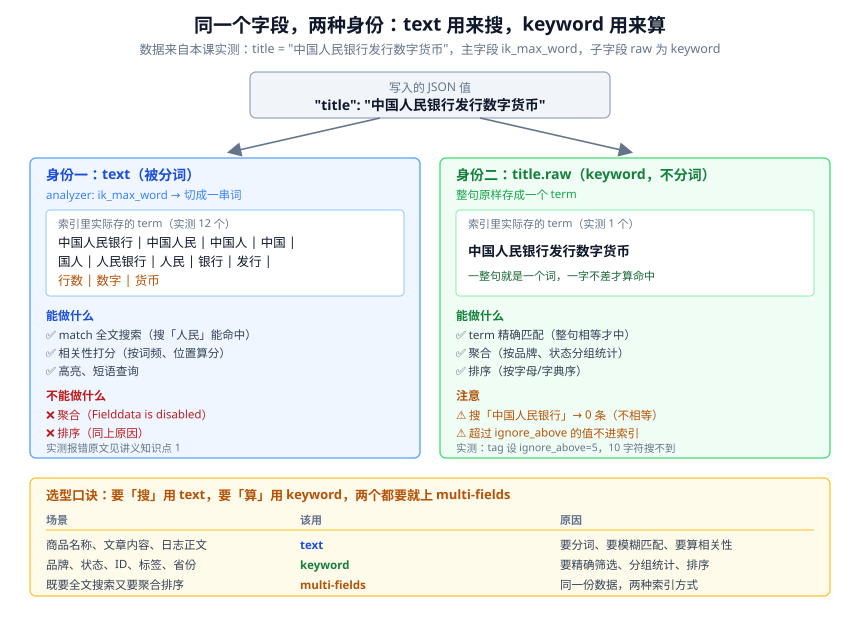
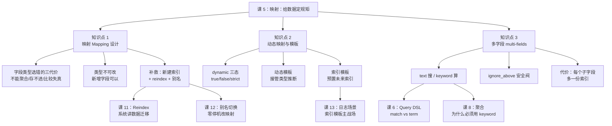

# 课 5：映射：给数据定规矩

> 阶段 2 · 第 5 课 ｜ 知识点：映射 Mapping 设计 / 动态映射与模板 / 多字段 multi-fields
> 本课回答三个问题：**字段类型怎么定** → **ES 自动猜的靠不靠谱** → **一个字段能不能身兼数职**。
>
> 🧪 本课所有命令与输出，均为 **2026-08-31 在本机（Windows 11 + ES 9.5.1 + IK 9.5.1）实测**。报错原文也是真的，不是编的。

---

## 🎬 第一幕：场景引入

课 3 你建了第一个索引 `shop`，写了第一条文档，兴奋地搜到了它。当时我让你先别管类型——ES 会自己猜。

课 4 你发现中文搜不准，装了 IK，在 `news_ik` 里**手动指定了分析器**：

```bash
"mappings":{
  "properties":{
    "title":{"type":"text","analyzer":"ik_max_word","search_analyzer":"ik_smart"}
  }
}
```

那个 `"mappings"` 就是**映射（Mapping）**——本课的主角。

现在场景升级了。你的电商网站要上线商品搜索，老板说："除了搜，我还想看**各品牌卖了多少件**，还要能**按价格排序**。"

你信心满满地写映射：

```bash
"properties":{
  "name":{"type":"text","analyzer":"ik_max_word"},
  "brand":{"type":"text","analyzer":"ik_max_word"},
  "price":{"type":"long"}
}
```

然后你写了个"按品牌统计销量"的聚合查询，敲下回车——

```json
{"error":{"root_cause":[{"type":"illegal_argument_exception",
  "reason":"Fielddata is disabled on [brand] in [l5_shop_bad]. Text fields are not
  optimised for operations that require per-document field data like aggregations
  and sorting, so these operations are disabled by default.
  Please use a keyword field instead."}]},
 "status":400}
```

**聚合报错了。**

你懵了：`brand` 明明有值，为什么不让统计？

更糟的还在后面。第二件商品标价 `19.9`，你读回来看到的是 `19.9`——**但索引里存的是 `19`**。日期写成 `"昨天"` 直接被拒收。而某个你以为不存在的字段，莫名其妙出现在了映射里。

先盯住价格这个，它最阴（本机实测）：

```bash
# price 字段被定义为 long，写入 19.9
curl.exe -s -k -u elastic:密码 -X POST "https://localhost:9200/l5_shop_bad/_doc/2?refresh=true" \
  -H "Content-Type: application/json" \
  -d '{"name":"测试商品","brand":"Test","price":19.9}'

# 读回来：看起来一切正常
curl.exe -s -k -u elastic:密码 "https://localhost:9200/l5_shop_bad/_doc/2?filter_path=_source"
# {"_source":{"name":"测试商品","brand":"Test","price":19.9}}
```

但读索引里真实存的值：

```bash
curl.exe -s -k -u elastic:密码 -X POST "https://localhost:9200/l5_shop_bad/_search" \
  -H "Content-Type: application/json" \
  -d '{"docvalue_fields":[{"field":"price"}],"query":{"ids":{"values":["2"]}}}'
```

```json
{"hits":[{"_source":{"price":19.9},"fields":{"price":[19]}}]}
```

**`_source` 里是 `19.9`，索引里是 `19`。** 小数部分被 silently 丢掉了。

再用 term 查询交叉验证（实测）：

```bash
term: 19    → 1 条 ✅
term: 19.9  → 0 条 ❌
```

> ⚠️ **这是本课最反直觉的一幕**：`_source` 是"你交上来的原件"，原样保管；索引是"按规矩重抄的副本"。**你看 `_source` 永远是对的，但搜索和聚合用的是索引。** 这个区别会贯穿整门课。

这四个问题，全都指向同一件事：**你没给数据定好规矩，ES 就替你定了，而它猜的往往不是你要的。**

---

## 🤔 第二幕：认知冲突

先破除三个直觉，它们听起来都对，但在 ES 里全都错。

### 直觉一："字段类型随时可以改，不行就改嘛"

**错。已存在的字段，类型不能改。**

这是我让你现在就知道、而不是上线后才发现的事。实测：

```bash
curl.exe -s -k -u elastic:密码 -X PUT "https://localhost:9200/l5_auto/_mapping" \
  -H "Content-Type: application/json" -d '{"properties":{"price":{"type":"text"}}}'
```

```json
{"error":{"root_cause":[{"type":"illegal_argument_exception",
  "reason":"mapper [price] cannot be changed from type [long] to [text]"}]},
 "status":400}
```

`price` 被动态映射成了 `long`，现在想改成 `text`，ES 直接拒绝。

**为什么这么死板？** 因为倒排索引已经建好了（课 4 讲过）。`long` 字段在 Lucene 里存的是数值结构，`text` 存的是分词后的词项表。已经写进去的数据是按 `long` 编码的，你让它按 `text` 去读，等于让一本书同时用两种排版印刷——做不到。

> 📌 **这是 ES 最重要的工程约束之一**：映射是"婚前协议"，不是"婚后调解"。签错了要么凑合过，要么**重建索引**（本课知识点 1 末尾会给你正确的补救姿势）。

### 直觉二："数字就该用数字类型"

**不一定。** 商品 ID、订单号、手机号——它们长得像数字，但你**从不会对它们做大小比较**。

官方原话：

> Consider mapping a numeric identifier as a keyword if: you don't plan to search for the identifier data using range queries. **`term` query searches on keyword fields are often faster than term searches on numeric fields.**

所以：**要算大小（价格、库存、耗时）用数值类型；只做精确匹配（ID、编号）反而该用 `keyword`。**

### 直觉三："字符串就是字符串"

**大错，这是本课最核心的一条。**

ES 里字符串有两个完全不同的物种：

| | `text` | `keyword` |
|---|--------|-----------|
| 分词吗 | ✅ 分词 | ❌ 不分词，整句原样存 |
| 用来干什么 | 全文搜索 | 精确匹配 / 聚合 / 排序 |
| 能聚合吗 | ❌ 默认禁止 | ✅ 可以 |
| 能排序吗 | ❌ 默认禁止 | ✅ 可以 |

课 3 你见过这个映射，当时没解释：

```json
"title":{"type":"text","fields":{"keyword":{"type":"keyword","ignore_above":256}}}
```

**同一个值，存了两份**：一份分词用来搜（`title`），一份不分词用来算（`title.keyword`）。这就是本课知识点 3 的**多字段（multi-fields）**。

那为什么上面那个 `brand` 会报错？因为它是纯 `text`，没有 `keyword` 兄弟。这是新手最常踩的坑之一。

### 所以本课真正要解决的问题

把开头那四个问题摆出来，你会发现它们是一条链：

| 症状 | 根因 | 知识点 |
|------|------|--------|
| 聚合报错、价格丢精度、日期拒收 | 字段类型选错 | **知识点 1：映射设计** |
| 冒出我没定义的字段 | ES 自动猜的 | **知识点 2：动态映射与模板** |
| 既要搜又要聚合 | 一份数据两种用法 | **知识点 3：多字段** |

---

## 🔍 第三幕：层层揭示

### 知识点 1：映射 Mapping 设计

**一句话定义**：**映射（Mapping）**是索引的"表结构定义"——它规定每个字段是什么类型、要不要索引、用什么分析器。相当于数据库的 `CREATE TABLE`。

#### 直觉建立：填快递单

把映射想成**快递单的填写规则**：

- 寄件人电话那一栏，格子是**数字**的——你写"138-0013-8000"它不认
- 是否保价那一栏，是**勾选项**——只能勾"是"或"否"
- 地址那一栏，是**自由文本**——随便写，快递员自己认路

映射干的就是这件事：**给每个字段规定"能填什么、怎么填、填了之后怎么用"**。

#### 实测：ES 自动猜出来的类型

课 3 你说"先不管类型"，于是 ES 帮你猜了。我们看看它猜得怎么样（本机实测）：

```bash
curl.exe -s -k -u elastic:密码 -X POST "https://localhost:9200/l5_auto/_doc?refresh=true" \
  -H "Content-Type: application/json" \
  -d '{
    "title":"iPhone 15 Pro",
    "price":7999,
    "score":19.9,
    "views":1024,
    "on_sale":true,
    "created_at":"2026-08-31",
    "tags":["手机","苹果"]
  }'
```

查映射：

```bash
curl.exe -s -k -u elastic:密码 "https://localhost:9200/l5_auto/_mapping"
```

实测结果（已整理）：

| 我写的 | ES 猜的类型 | 猜对了吗 |
|--------|------------|---------|
| `"title":"iPhone 15 Pro"` | `text` + `.keyword` 子字段 | ✅ 还行 |
| `"price":7999` | **`long`** | ⚠️ 价格哪有不带小数的 |
| `"score":19.9` | **`float`** | ⚠️ 猜成单精度，不是 `double` |
| `"views":1024` | `long` | ✅ |
| `"on_sale":true` | `boolean` | ✅ |
| `"created_at":"2026-08-31"` | `date` | ✅ |
| `"tags":["手机","苹果"]` | `text` + `.keyword` | ❌ **数组被当成一个 text 了** |

三条值得盯住：

1. **`19.9` 被猜成 `float` 而不是 `double`**。官方文档说明了原因：doubles 默认映射为 floats，精度通常够用，且**省一半磁盘**。
2. **价格 `7999` 因为没写小数点，被猜成 `long`**。等第一件 `19.9` 元的商品进来，类型已经锁死了，改不了。
3. **`tags` 是数组，但 ES 映射里没有"数组类型"**。Lucene 不认数组——同一个字段多个值，在倒排索引里就是这个词出现在同一篇文档多次而已。

> 💡 **这条要记住**：ES 的映射里**没有数组类型**。任何字段都可以直接写数组，只要数组元素类型一致。

#### 显式映射：别让 ES 猜

正确姿势是**建索引时就把规矩定好**。实测：

```bash
curl.exe -s -k -u elastic:密码 -X PUT "https://localhost:9200/l5_shop" \
  -H "Content-Type: application/json" \
  -d '{
    "settings":{"number_of_shards":1,"number_of_replicas":0},
    "mappings":{
      "properties":{
        "name":{"type":"text","analyzer":"ik_max_word","search_analyzer":"ik_smart"},
        "brand":{"type":"keyword"},
        "price":{"type":"scaled_float","scaling_factor":100},
        "stock":{"type":"integer"},
        "on_sale":{"type":"boolean"},
        "created_at":{"type":"date"}
      }
    }
  }'
```

几个选择说明一下：

| 字段 | 类型 | 为什么 |
|------|------|--------|
| `name` | `text` + IK | 要全文搜索（课 4 的成果） |
| `brand` | **`keyword`** | **要聚合统计**——本课开头的报错就是它 |
| `price` | **`scaled_float`** + `scaling_factor:100` | 价格用浮点会丢精度。`scaled_float` 内部存整数（7999 存成 799900），避开浮点误差 |
| `stock` | `integer` | 库存不会超过 21 亿，用 `long` 浪费 |
| `created_at` | `date` | 要按时间范围查 |

> 💡 **`scaled_float` 是什么**：它把 `79.99` 乘 100 存成整数 `7999`。为什么不用 `double`？因为 `0.1 + 0.2 != 0.3` 这种浮点误差在价格上是事故。`scaled_float` 是社区通用的价格存储方案。

#### 类型选错的四种代价

**① 该算的不能算**（开头的报错）

对 `text` 字段做聚合，实测报错原文（`brand` 被错配成 `text`）：

```
Fielddata is disabled on [brand] in [l5_shop_bad]. Text fields are not optimised for
operations that require per-document field data like aggregations and sorting,
so these operations are disabled by default. Please use a keyword field instead.
Alternatively, set fielddata=true on [brand] in order to load field data by
uninverting the inverted index. Note that this can use significant memory.
```

同样的聚合，换成 `keyword` 字段立刻成功（实测）：

```json
{"aggregations":{"by_brand":{"doc_count_error_upper_bound":0,
  "sum_other_doc_count":0,"buckets":[{"key":"Apple","doc_count":1}]}}}
```

> ⚠️ 报错里那句 `Alternatively, set fielddata=true` 是个**陷阱选项**。它确实能让它跑通，但官方紧接着警告 `this can use significant memory`——对 text 字段开 fielddata 会把整个倒排索引"倒过来"加载进堆内存，是常见的 OOM 元凶。**正确做法是改用 keyword，不是开 fielddata。**

**② 存进去的和你以为的不一样**（最阴的一种）

`price` 被定义成 `long`，你写入 `19.9`：

```bash
# 读 _source：看起来正常
{"_source":{"name":"测试商品","brand":"Test","price":19.9}}

# 读索引真实值（docvalue_fields）：小数没了
{"_source":{"price":19.9},"fields":{"price":[19]}}

# term 交叉验证
term: 19    → 1 条
term: 19.9  → 0 条
```

**`_source` 是原件，`fields`（索引）是副本。写 `19.9` 进去，搜的时候它是 `19`。** 这种错不会报错，只会让你的价格区间查询悄悄算错。

**③ 该存的存不进**

给 `date` 字段写 `"昨天"`，实测被拒：

```json
{"error":{"type":"document_parsing_exception",
 "reason":"[2:16] failed to parse field [created_at] of type [date] in document with id '1'.
  Preview of field's value: '昨天'",
 "caused_by":{"reason":"failed to parse date field [昨天] with format
  [strict_date_optional_time||epoch_millis]",
 "caused_by":{"reason":"Failed to parse with all enclosed parsers"}}},
 "status":400}
```

注意报错里那句 `with format [strict_date_optional_time||epoch_millis]`——这就是 `date` 默认接受的格式。写 `"2026-08-31"` 或 `1785000000000`（毫秒时间戳）都行，写 `"昨天"` 不行。

**④ 数字写成字符串，range 查询变字符串比较**

这是最隐蔽的一个。实测：

```bash
# price 写成字符串
-d '{"price":"19.9"}'
```

映射变成：

```json
{"price":{"type":"text","fields":{"keyword":{"type":"keyword","ignore_above":256}}}}
```

此时 `range` 查询 `price >= 10` 表面上还能返回 1 条，但它的比较逻辑已经变成了**字符串比较**——`"9" > "10"` 在字符串世界里是成立的。数据量一大，排序和范围查询的结果就会荒唐。

#### 映射不可改，但可以"加"

实测：给已有索引**新增**一个字段，完全没问题：

```bash
curl.exe -s -k -u elastic:密码 -X PUT "https://localhost:9200/l5_auto/_mapping" \
  -H "Content-Type: application/json" -d '{"properties":{"brand":{"type":"keyword"}}}'
```

```json
{"acknowledged":true}
```

总结一下边界：

| 操作 | 允许吗 | 说明 |
|------|--------|------|
| 新增字段 | ✅ | 随时可以 |
| 改字段类型 | ❌ | `mapper [x] cannot be changed from type [long] to [text]` |
| 改分析器 | ❌ | 属于映射变更，且**老数据不会重新分词** |
| 改 `ignore_above` | ✅ | 少数可改的参数（官方明确列出） |
| 新增子字段（multi-field） | ✅ | 但**老数据没有**，需 reindex 才生效 |
| 重命名字段 | ❌ | 改用 `alias` 字段 |

#### 改映射的唯一正确姿势：新建索引 + reindex

这是本课最实用的工程套路。实测全过程：

```bash
# ① 旧索引 l5_trap 的 price 是 text（错误类型）
curl.exe -s -k -u elastic:密码 "https://localhost:9200/l5_trap/_mapping"
# {"price":{"type":"text","fields":{"keyword":{"type":"keyword","ignore_above":256}}}}

# ② 建一个类型正确的新索引
curl.exe -s -k -u elastic:密码 -X PUT "https://localhost:9200/l5_trap_v2" \
  -H "Content-Type: application/json" \
  -d '{"settings":{"number_of_shards":1,"number_of_replicas":0},
       "mappings":{"properties":{"price":{"type":"float"}}}}'

# ③ 搬数据
curl.exe -s -k -u elastic:密码 -X POST "https://localhost:9200/_reindex?refresh=true" \
  -H "Content-Type: application/json" \
  -d '{"source":{"index":"l5_trap"},"dest":{"index":"l5_trap_v2"}}'
```

实测返回：

```json
{"took":576,"total":1,"created":1,"version_conflicts":0,"failures":[]}
```

验证新索引——`price` 已经是 `float` 了：

```json
{"l5_trap_v2":{"mappings":{"properties":{"price":{"type":"float"}}}}}
```

> 📌 **生产上还要多做一步**：用**别名（alias）**指向新索引，这样应用代码不用改。别名切换是原子的，课 12 会讲完整流程。课 11 会系统讲 Reindex。

📚 官方文档：[Explicit mapping](https://www.elastic.co/guide/en/elasticsearch/reference/current/explicit-mapping.html)

**一句话记住**：**映射是数据的婚前协议，字段类型一旦定下就不能改；要改就新建索引 + reindex，生产上再配别名切换。**

---

### 知识点 2：动态映射与模板

**一句话定义**：**动态映射（Dynamic Mapping）**是 ES 遇到未知字段时自动推断类型并写入映射的机制；**动态模板（Dynamic Templates）**让你接管这个推断过程；**索引模板（Index Template）**则把整套配置预置给"未来才创建"的索引。

#### 直觉建立：餐厅的三种接待方式

把新字段想成走进餐厅的客人：

| 模式 | 行为 | 类比 |
|------|------|------|
| `dynamic: true`（默认） | 照单全收，自动安排座位（猜类型） | 热情的服务员，来者不拒 |
| `dynamic: false` | 人放进来，但**不给座位**（存进 `_source`，不索引） | 让你站着，看得见但服务不了 |
| `dynamic: strict` | 直接拦在门口，**整篇文档拒收** | 保安：名单上没有，不许进 |

#### 实测一：`dynamic: true`（默认）—— 来者不拒

就是知识点 1 开头那个例子，ES 给 7 个字段全猜了类型。方便，但也埋雷。

#### 实测二：`dynamic: false` —— 存了但搜不到

```bash
curl.exe -s -k -u elastic:密码 -X PUT "https://localhost:9200/l5_nodyn" \
  -H "Content-Type: application/json" \
  -d '{"settings":{"number_of_shards":1,"number_of_replicas":0},
       "mappings":{"dynamic":false,"properties":{"title":{"type":"text"}}}}'

# 写入一个映射里没有的字段
curl.exe -s -k -u elastic:密码 -X POST "https://localhost:9200/l5_nodyn/_doc/1?refresh=true" \
  -H "Content-Type: application/json" \
  -d '{"title":"测试","ghost":"我是幽灵字段"}'
```

写入成功（不报错）。但查映射——**没有 `ghost`**：

```json
{"l5_nodyn":{"mappings":{"dynamic":"false","properties":{"title":{"type":"text"}}}}}
```

查文档——**数据其实在里面**（`_source` 原样保存）：

```json
{"_index":"l5_nodyn","_id":"1","found":true,"_source":{
  "title":"测试","ghost":"我是幽灵字段"}}
```

但搜索它——**0 条**：

```json
{"hits":{"total":{"value":0,"relation":"eq"}}}
```

> ⚠️ **这是最容易产生"数据丢了"误会的地方**：数据没丢，在 `_source` 里躺着，但**没进倒排索引，所以搜不到**。日志场景常用它——字段太多不想全索引，但要保留原始内容备查。

#### 实测三：`dynamic: strict` —— 直接拒收

```bash
curl.exe -s -k -u elastic:密码 -X PUT "https://localhost:9200/l5_strict" \
  -H "Content-Type: application/json" \
  -d '{"settings":{"number_of_shards":1,"number_of_replicas":0},
       "mappings":{"dynamic":"strict","properties":{"title":{"type":"text"}}}}'

# 写入未知字段
curl.exe -s -k -u elastic:密码 -X POST "https://localhost:9200/l5_strict/_doc/1" \
  -H "Content-Type: application/json" \
  -d '{"title":"测试","unknown_field":"我不该被写进来"}'
```

实测报错原文：

```json
{"error":{"root_cause":[{"type":"strict_dynamic_mapping_exception",
 "reason":"[2:36] mapping set to strict, dynamic introduction of [unknown_field]
  within [_doc] is not allowed"}]},
 "status":400}
```

> 💡 **什么时候用 strict**：生产环境的核心业务索引。宁可写入失败暴露问题，也好过让脏字段悄悄污染映射——**映射里每多一个字段，都占集群状态（cluster state）的内存**。

#### 动态模板：接管 ES 的"猜"

动态映射最大的问题是：字符串默认变成 `text + keyword` 双份，而大部分字段（作者、状态、标签）**根本不需要全文搜索**，白白浪费空间。

**动态模板**让你按规则接管。实测——把所有新出现的字符串字段都设成 `keyword`：

```bash
curl.exe -s -k -u elastic:密码 -X PUT "https://localhost:9200/l5_tpl" \
  -H "Content-Type: application/json" \
  -d '{
    "settings":{"number_of_shards":1,"number_of_replicas":0},
    "mappings":{
      "dynamic_templates":[
        {"strings_as_keyword":{
          "match_mapping_type":"string",
          "mapping":{"type":"keyword","ignore_above":256}
        }}
      ],
      "properties":{"content":{"type":"text","analyzer":"ik_max_word"}}
    }
  }'

# 写一条，author 和 status 是映射里没定义的
curl.exe -s -k -u elastic:密码 -X POST "https://localhost:9200/l5_tpl/_doc/1?refresh=true" \
  -H "Content-Type: application/json" \
  -d '{"content":"中国人民银行的货币政策","author":"张三","status":"published"}'
```

实测映射结果：

```json
{"dynamic_templates":[{"strings_as_keyword":{"match_mapping_type":"string",
   "mapping":{"ignore_above":256,"type":"keyword"}}}],
 "properties":{
   "author":{"type":"keyword","ignore_above":256},
   "content":{"type":"text","analyzer":"ik_max_word"},
   "status":{"type":"keyword","ignore_above":256}}}
```

**关键点**：

- `author`、`status` 被模板变成了 **`keyword`**，而不是默认的 `text + keyword`
- `content` 因为**显式定义在 `properties` 里，优先级高于模板**，保持 `text` + IK

> 📌 **优先级规则**：显式定义的 `properties` > 动态模板 > 默认动态映射规则。

匹配条件不止 `match_mapping_type`，常用的还有：

| 条件 | 作用 | 示例 |
|------|------|------|
| `match_mapping_type` | 按推断出的 JSON 类型 | `"string"`、`"long"` |
| `match` | 按字段名匹配（支持 `*` 通配） | `"match":"*_count"` |
| `unmatch` | 排除某些字段名 | `"unmatch":"*_text"` |
| `path_match` | 按字段路径匹配 | `"path_match":"user.*"` |

> ⚠️ **模板按顺序匹配，第一个命中的生效**。把特殊的放前面，通用的放后面。

#### 索引模板：给"未来的索引"预置配置

动态模板管的是"索引内部的新字段"，**索引模板**管的是"还没创建的索引"。

典型场景：日志按天存，`logs-2026-08-31`、`logs-2026-09-01`……你不可能每天手动建一次。实测：

```bash
curl.exe -s -k -u elastic:密码 -X PUT "https://localhost:9200/_index_template/l5_logs_template" \
  -H "Content-Type: application/json" \
  -d '{
    "index_patterns":["l5_logs-*"],
    "priority":100,
    "template":{
      "settings":{"number_of_shards":1,"number_of_replicas":0,"refresh_interval":"5s"},
      "mappings":{
        "dynamic_templates":[{"strings_as_keyword":{
          "match_mapping_type":"string","mapping":{"type":"keyword"}}}],
        "properties":{
          "@timestamp":{"type":"date"},
          "message":{"type":"text","analyzer":"ik_max_word"}
        }
      }
    }
  }'

# 直接创建索引，不写任何 mapping
curl.exe -s -k -u elastic:密码 -X PUT "https://localhost:9200/l5_logs-2026.08.31"
```

查它的映射——**模板自动套上了**：

```json
{"l5_logs-2026.08.31":{"mappings":{
  "dynamic_templates":[{"strings_as_keyword":{"match_mapping_type":"string",
    "mapping":{"type":"keyword"}}}],
  "properties":{"@timestamp":{"type":"date"},
    "message":{"type":"text","analyzer":"ik_max_word"}}}}}
```

三个参数说明：

| 参数 | 作用 |
|------|------|
| `index_patterns` | 匹配哪些索引名，支持 `*` 通配 |
| `priority` | 多个模板同时匹配时，**数字大的赢** |
| `template` | 套用的 settings / mappings / aliases |

> 💡 **索引模板只对"之后创建的索引"生效**。已经存在的索引不会被追溯修改——要改还是得 reindex。

📚 官方文档：[Dynamic templates](https://www.elastic.co/guide/en/elasticsearch/reference/current/dynamic-templates.html) ｜ [Index templates](https://www.elastic.co/guide/en/elasticsearch/reference/current/index-templates.html)

**一句话记住**：**动态映射是 ES 替你猜类型，方便但埋雷；生产上用 `dynamic: strict` 或 `false` 关掉它，再用动态模板接管规则、索引模板批量预置。**

---

### 知识点 3：多字段 multi-fields

**一句话定义**：**多字段（multi-fields）**让同一个字段的值以**多种方式**被索引——最常见的组合是主字段 `text` 用于搜索，子字段 `keyword` 用于聚合排序。

#### 直觉建立：一个人，多张证件

你这个人只有一个，但可以持有：

- **身份证**——用来证明"你是你"（精确匹配）
- **护照**——用来出境（另一个场景）
- **驾照**——用来开车（又一个场景）

**人还是同一个，不同场景出示不同证件。**

多字段就是这样：一份原始值，按不同规则索引多次，各司其职。

#### 结构长什么样

```json
"title":{
  "type":"text",                    ← 主字段：分词，用来搜
  "analyzer":"ik_max_word",
  "search_analyzer":"ik_smart",
  "fields":{                        ← 子字段：同一份值的其他身份
    "raw":{"type":"keyword"},       ← title.raw：不分词，用来聚合/排序
    "std":{"type":"text","analyzer":"standard"}  ← title.std：另一种分词
  }
}
```

访问时用 `字段名.子字段名`，比如 `title.raw`。

#### 实测：一句话，三种身份

建一个多字段索引（本机实测）：

```bash
curl.exe -s -k -u elastic:密码 -X PUT "https://localhost:9200/l5_multi" \
  -H "Content-Type: application/json" \
  -d '{"settings":{"number_of_shards":1,"number_of_replicas":0},
       "mappings":{"properties":{"title":{
         "type":"text","analyzer":"ik_max_word","search_analyzer":"ik_smart",
         "fields":{"raw":{"type":"keyword"},
                   "en":{"type":"text","analyzer":"english"},
                   "std":{"type":"text","analyzer":"standard"}}}}}}'

curl.exe -s -k -u elastic:密码 -X POST "https://localhost:9200/l5_multi/_doc/1?refresh=true" \
  -H "Content-Type: application/json" \
  -d '{"title":"中国人民银行发行数字货币"}'
```

同一句话，查三种身份的分词结果（实测）：

```bash
# 主字段 title（ik_max_word）
curl.exe -s -k -u elastic:密码 -X POST "https://localhost:9200/l5_multi/_analyze" \
  -H "Content-Type: application/json" \
  -d '{"field":"title","text":"中国人民银行发行数字货币"}'
```

```
中国人民银行 | 中国人民 | 中国人 | 中国 | 国人 | 人民银行 | 人民 | 银行 | 发行 | 行数 | 数字 | 货币
（12 个词）
```

```bash
# 子字段 title.std（standard 逐字）
-d '{"field":"title.std","text":"中国人民银行发行数字货币"}'
```

```
中 | 国 | 人 | 民 | 银 | 行 | 发 | 行 | 数 | 字 | 货 | 币
（12 个单字）
```

```bash
# 子字段 title.raw（keyword 不分词）
-d '{"field":"title.raw","text":"中国人民银行发行数字货币"}'
```

```
中国人民银行发行数字货币
（1 个词，整句）
```

**同一份数据，三种索引方式，互不影响。** 这就是多字段的全部含义。

#### 对比图



#### 搜索行为对比：这是最容易被坑的地方

同一句话，查主字段和查子字段，结果完全不同（实测）：

| 查询 | 结果 | 为什么 |
|------|------|--------|
| `match` 查 `title`，搜「中国人民银行」 | **1 条** ✅ | 搜索时用 `ik_smart` 切成「中国人民银行」，索引里有 |
| `term` 查 `title.raw`，搜「中国人民银行」 | **0 条** ❌ | keyword 要求整句完全相等，索引里存的是整句，不相等 |
| `term` 查 `title.raw`，搜「中国人民银行发行数字货币」 | **1 条** ✅ | 整句完全相等，命中 |
| `match` 查 `title`，搜「人民」 | **1 条** ✅ | 索引有「人民」这个词 |

> ⚠️ **`term` 查 `title.raw` 搜「中国人民银行」返回 0 条**——这是新手最常问的"我明明有这条数据为什么搜不到"。记住：**keyword 是整句匹配，不是包含匹配。**

#### 排序：text 不行，子字段可以

实测（这正好是开头那个报错的正面示范）：

```bash
# 对 text 字段排序 → 报错
curl.exe -s -k -u elastic:密码 -X POST "https://localhost:9200/l5_multi/_search" \
  -H "Content-Type: application/json" -d '{"sort":[{"title":"asc"}]}'
```

```json
{"error":{"type":"illegal_argument_exception",
 "reason":"Fielddata is disabled on [title] in [l5_multi]. ..."}}
```

```bash
# 对 keyword 子字段排序 → 成功
curl.exe -s -k -u elastic:密码 -X POST "https://localhost:9200/l5_multi/_search" \
  -H "Content-Type: application/json" -d '{"sort":[{"title.raw":"asc"}]}'
```

```json
{"hits":{"total":{"value":1},"hits":[{"_source":{"title":"中国人民银行发行数字货币"}}]}}
```

#### `ignore_above`：keyword 的安全阀

`keyword` 有个坑：Lucene 的 term 最多 **32766 字节**，超了整篇文档会被拒收。所以 ES 给动态映射的 keyword 子字段默认加了 `ignore_above: 256`。

实测验证它的行为：

```bash
curl.exe -s -k -u elastic:密码 -X PUT "https://localhost:9200/l5_ignore" \
  -H "Content-Type: application/json" \
  -d '{"settings":{"number_of_shards":1,"number_of_replicas":0},
       "mappings":{"properties":{"tag":{"type":"keyword","ignore_above":5}}}}'

# 写两条：一条 3 字符，一条 10 字符
-d '{"tag":"abc"}'        # 存 id=1
-d '{"tag":"abcdefghij"}' # 存 id=2
```

搜索结果（实测）：

```bash
# 查 "abc" → 1 条 ✅
{"hits":{"total":{"value":1}}}

# 查 "abcdefghij" → 0 条 ❌
{"hits":{"total":{"value":0}}}
```

**超长的那条存进去了（写入返回 created），但没进索引，所以搜不到。**

> ⚠️ **这是第二个"数据明明在却搜不到"的经典坑**。官方文档的描述很准确：`ignore_above` 是"不索引超长字符串"，但**值仍在 `_source` 里**。排查时用 `GET index/_doc/id` 看 `_source`，别只看搜索结果。

#### 什么时候需要多字段

| 你需要 | 配置 |
|--------|------|
| 只做全文搜索 | `text` + 分析器 |
| 只做筛选/聚合/排序 | `keyword` |
| **既要搜又要聚合** | `text` + `fields.keyword`（最常见） |
| 同一字段要中英文两种搜索 | `text`(IK) + `fields.en`(english) |
| 要按原始值精确去重 | `text` + `fields.raw`(keyword) |

> 💡 **代价**：每个子字段都是一份独立的倒排索引，**占空间、拖慢写入**。不要给所有字段都加 keyword，只给真正需要的加。

📚 官方文档：[fields (multi-fields)](https://www.elastic.co/guide/en/elasticsearch/reference/current/multi-fields.html)

**一句话记住**：**多字段让一份数据拥有多种索引身份——主字段 text 管搜索，子字段 keyword 管聚合排序；用 `字段名.子字段名` 访问，代价是每多一个子字段多一份索引。**

---

## ✋ 第四幕：实操验证

这一幕把三个知识点串成一条**可以整段复制执行**的验证链。跑完你会亲手踩一次坑，再用正确姿势修好它。

> 前提：ES 9.5.1 在运行（课 3 装的），`curl.exe` 可用，IK 插件已装（课 4）。
> 下面用 `$ES_PW` 代指你的密码。示例按 **Git Bash** 写法（单引号不转义 + `\` 续行）。

### 第 1 步：让 ES 猜一次，看看它猜得怎么样

```bash
export ES_PW='你的密码'

curl.exe -s -k -u elastic:$ES_PW -X POST "https://localhost:9200/l5_auto/_doc?refresh=true" \
  -H "Content-Type: application/json" \
  -d '{"title":"iPhone 15 Pro","price":7999,"score":19.9,
       "on_sale":true,"created_at":"2026-08-31","tags":["手机","苹果"]}'

curl.exe -s -k -u elastic:$ES_PW "https://localhost:9200/l5_auto/_mapping"
```

**盯住三处**：`price` 是 `long`（价格不该是整数）、`score` 是 `float`（不是 double）、`tags` 被当成 `text`。

### 第 2 步：试试改类型——撞墙

```bash
curl.exe -s -k -u elastic:$ES_PW -X PUT "https://localhost:9200/l5_auto/_mapping" \
  -H "Content-Type: application/json" -d '{"properties":{"price":{"type":"text"}}}'
```

**预期报错**：`mapper [price] cannot be changed from type [long] to [text]`

但加新字段是可以的：

```bash
curl.exe -s -k -u elastic:$ES_PW -X PUT "https://localhost:9200/l5_auto/_mapping" \
  -H "Content-Type: application/json" -d '{"properties":{"brand":{"type":"keyword"}}}'
# {"acknowledged":true}
```

### 第 3 步：撞一次"text 不能聚合"

```bash
# 建一个 brand 是 text 的索引（错误示范）
curl.exe -s -k -u elastic:$ES_PW -X PUT "https://localhost:9200/l5_wrong" \
  -H "Content-Type: application/json" \
  -d '{"settings":{"number_of_shards":1,"number_of_replicas":0},
       "mappings":{"properties":{"brand":{"type":"text"}}}}'

curl.exe -s -k -u elastic:$ES_PW -X POST "https://localhost:9200/l5_wrong/_doc?refresh=true" \
  -H "Content-Type: application/json" -d '{"brand":"Apple"}'

# 聚合 → 报错
curl.exe -s -k -u elastic:$ES_PW -X POST "https://localhost:9200/l5_wrong/_search" \
  -H "Content-Type: application/json" \
  -d '{"size":0,"aggs":{"by_brand":{"terms":{"field":"brand"}}}}'
```

**预期**：`Fielddata is disabled on [brand] ...`

### 第 4 步：用正确姿势修好它（新建 + reindex）

```bash
# 建正确索引：brand 是 keyword，price 用 scaled_float
curl.exe -s -k -u elastic:$ES_PW -X PUT "https://localhost:9200/l5_right" \
  -H "Content-Type: application/json" \
  -d '{"settings":{"number_of_shards":1,"number_of_replicas":0},
       "mappings":{"properties":{
         "brand":{"type":"keyword"},
         "price":{"type":"scaled_float","scaling_factor":100}}}}'

# 搬数据
curl.exe -s -k -u elastic:$ES_PW -X POST "https://localhost:9200/_reindex?refresh=true" \
  -H "Content-Type: application/json" \
  -d '{"source":{"index":"l5_wrong"},"dest":{"index":"l5_right"}}'

# 再聚合 → 成功
curl.exe -s -k -u elastic:$ES_PW -X POST "https://localhost:9200/l5_right/_search" \
  -H "Content-Type: application/json" \
  -d '{"size":0,"aggs":{"by_brand":{"terms":{"field":"brand"}}}}'
```

**预期**：`"buckets":[{"key":"Apple","doc_count":1}]`

### 第 5 步：体验 dynamic 的三种态度

```bash
# strict：未知字段直接拒收
curl.exe -s -k -u elastic:$ES_PW -X PUT "https://localhost:9200/l5_strict" \
  -H "Content-Type: application/json" \
  -d '{"mappings":{"dynamic":"strict","properties":{"title":{"type":"text"}}}}'

curl.exe -s -k -u elastic:$ES_PW -X POST "https://localhost:9200/l5_strict/_doc/1" \
  -H "Content-Type: application/json" -d '{"title":"测试","unknown":"我不该进来"}'
# 预期：strict_dynamic_mapping_exception

# false：存了但搜不到
curl.exe -s -k -u elastic:$ES_PW -X PUT "https://localhost:9200/l5_nodyn" \
  -H "Content-Type: application/json" \
  -d '{"mappings":{"dynamic":false,"properties":{"title":{"type":"text"}}}}'

curl.exe -s -k -u elastic:$ES_PW -X POST "https://localhost:9200/l5_nodyn/_doc/1?refresh=true" \
  -H "Content-Type: application/json" -d '{"title":"测试","ghost":"幽灵字段"}'

curl.exe -s -k -u elastic:$ES_PW "https://localhost:9200/l5_nodyn/_mapping"   # 没有 ghost
curl.exe -s -k -u elastic:$ES_PW "https://localhost:9200/l5_nodyn/_doc/1"     # _source 里有 ghost
curl.exe -s -k -u elastic:$ES_PW -X POST "https://localhost:9200/l5_nodyn/_search" \
  -H "Content-Type: application/json" -d '{"query":{"match":{"ghost":"幽灵"}}}'
# 预期：0 条
```

### 第 6 步：多字段——一个字段三种身份

```bash
curl.exe -s -k -u elastic:$ES_PW -X PUT "https://localhost:9200/l5_multi" \
  -H "Content-Type: application/json" \
  -d '{"settings":{"number_of_shards":1,"number_of_replicas":0},
       "mappings":{"properties":{"title":{
         "type":"text","analyzer":"ik_max_word","search_analyzer":"ik_smart",
         "fields":{"raw":{"type":"keyword"},
                   "std":{"type":"text","analyzer":"standard"}}}}}}'

curl.exe -s -k -u elastic:$ES_PW -X POST "https://localhost:9200/l5_multi/_doc/1?refresh=true" \
  -H "Content-Type: application/json" -d '{"title":"中国人民银行发行数字货币"}'

# 三种身份的分词结果
curl.exe -s -k -u elastic:$ES_PW -X POST "https://localhost:9200/l5_multi/_analyze" \
  -H "Content-Type: application/json" \
  -d '{"field":"title","text":"中国人民银行发行数字货币"}'      # 12 词
curl.exe -s -k -u elastic:$ES_PW -X POST "https://localhost:9200/l5_multi/_analyze" \
  -H "Content-Type: application/json" \
  -d '{"field":"title.std","text":"中国人民银行发行数字货币"}'  # 12 单字
curl.exe -s -k -u elastic:$ES_PW -X POST "https://localhost:9200/l5_multi/_analyze" \
  -H "Content-Type: application/json" \
  -d '{"field":"title.raw","text":"中国人民银行发行数字货币"}'  # 1 整句
```

### 第 7 步：验证 keyword 是"整句匹配"不是"包含匹配"

```bash
# match 查主字段 → 1 条
curl.exe -s -k -u elastic:$ES_PW -X POST "https://localhost:9200/l5_multi/_search?filter_path=hits.total" \
  -H "Content-Type: application/json" -d '{"query":{"match":{"title":"中国人民银行"}}}'

# term 查 raw，只给一部分 → 0 条（关键！）
curl.exe -s -k -u elastic:$ES_PW -X POST "https://localhost:9200/l5_multi/_search?filter_path=hits.total" \
  -H "Content-Type: application/json" -d '{"query":{"term":{"title.raw":"中国人民银行"}}}'

# term 查 raw，给完整整句 → 1 条
curl.exe -s -k -u elastic:$ES_PW -X POST "https://localhost:9200/l5_multi/_search?filter_path=hits.total" \
  -H "Content-Type: application/json" \
  -d '{"query":{"term":{"title.raw":"中国人民银行发行数字货币"}}}'
```

### 第 8 步：验证 ignore_above

```bash
curl.exe -s -k -u elastic:$ES_PW -X PUT "https://localhost:9200/l5_ignore" \
  -H "Content-Type: application/json" \
  -d '{"mappings":{"properties":{"tag":{"type":"keyword","ignore_above":5}}}}'

curl.exe -s -k -u elastic:$ES_PW -X POST "https://localhost:9200/l5_ignore/_doc/1?refresh=true" \
  -H "Content-Type: application/json" -d '{"tag":"abc"}'
curl.exe -s -k -u elastic:$ES_PW -X POST "https://localhost:9200/l5_ignore/_doc/2?refresh=true" \
  -H "Content-Type: application/json" -d '{"tag":"abcdefghij"}'

# "abc" 能搜到，"abcdefghij" 搜不到（超长不索引）
curl.exe -s -k -u elastic:$ES_PW -X POST "https://localhost:9200/l5_ignore/_search?filter_path=hits.total" \
  -H "Content-Type: application/json" -d '{"query":{"term":{"tag":"abc"}}}'
curl.exe -s -k -u elastic:$ES_PW -X POST "https://localhost:9200/l5_ignore/_search?filter_path=hits.total" \
  -H "Content-Type: application/json" -d '{"query":{"term":{"tag":"abcdefghij"}}}'
```

### 第 9 步：清理（可选）

```bash
curl.exe -s -k -u elastic:$ES_PW -X DELETE "https://localhost:9200/l5_auto,l5_shop,l5_multi,l5_tpl,l5_strict,l5_nodyn,l5_wrong,l5_right,l5_ignore,l5_trap,l5_trap_v2,l5_logs-2026.08.31"
curl.exe -s -k -u elastic:$ES_PW -X DELETE "https://localhost:9200/_index_template/l5_logs_template"
```

### 自检三问

1. 为什么 `price` 从 `long` 改成 `text` 会失败？改类型的正确姿势是什么？
2. `dynamic: false` 和 `dynamic: strict` 写入未知字段时，行为差在哪？数据还在吗？
3. 同一个字段搜「中国人民银行」，为什么查 `title` 命中、查 `title.raw` 不命中？

（答案都在上面三幕里。）

---

## 🎓 第五幕：体系收束

### 本课知识地图



### 三句话记住本课

1. **映射是婚前协议不是婚后调解**——字段类型一旦定下就不能改，改就得新建索引 + reindex，生产上配别名零停机切换。
2. **别让 ES 猜**——生产用 `dynamic: strict` 或 `false` 关掉自动推断，用动态模板接管规则、索引模板批量预置。
3. **要搜用 text，要算用 keyword**——两者都要就上 multi-fields，代价是每个子字段多一份索引。

### 三个"数据明明在却搜不到"的坑

本课一共遇到了三种，它们症状一样、根因不同，值得单独拎出来：

| 现象 | 根因 | 怎么确认 |
|------|------|----------|
| 搜不到刚写的文档 | 没 refresh，段还没生成（课 4） | 等 1 秒或 `?refresh=true` |
| 搜不到某个字段的值 | `dynamic: false`，字段没进索引 | 查 `_mapping` 里有没有它 |
| 搜不到超长的值 | 超过 `ignore_above`，keyword 没索引 | 查 `_source` 里有没有它 |

> 💡 **排查口诀**：搜索结果说没有，先 `GET index/_doc/id` 看 `_source`。**`_source` 里有但搜不到 = 映射/索引的锅；`_source` 里也没有 = 数据根本没写进去。**

还有第四种，更隐蔽——**能搜到，但值不对**：

| 现象 | 根因 | 怎么确认 |
|------|------|----------|
| 写 `19.9` 进去，搜出来是 `19` | 字段是 `long`，小数被截断 | 用 `docvalue_fields` 读索引真实值 |

这条不报错、不丢文档，只是**静静地算错**。价格、评分、耗时这类字段尤其要当心。

> 💡 **贯穿全课的一条原理**：**`_source` 是原件，倒排索引/doc_values 是按映射重抄的副本。** 你读 `_source` 永远看到原始输入，但搜索、聚合、排序用的全是副本。**映射错了，副本就错了，而副本才是真正干活的那个。**

### 常见误区

**误区一：以为 text 字段加个 keyword 子字段，老数据就自动能聚合了。**

不会。`fields` 只对**之后写入的文档**生效。老文档没有这个子字段的索引，聚合时它们会被算进"缺失值"。**要让老数据也生效，必须 reindex。**

**误区二：给所有字段都加 keyword 子字段，图省事。**

每个子字段都是一份独立的倒排索引。全字段加 keyword 会让索引体积明显膨胀、写入变慢。**只给真正需要聚合/排序/精确匹配的字段加。**

**误区三：以为 `scaled_float` 和 `float` 差不多。**

`float` 是二进制浮点，有精度误差；`scaled_float` 内部存整数。价格、金额这类**不能容忍误差**的场景必须用 `scaled_float`。

**误区四：把 ID、订单号映射成 `long`。**

它们长得像数字，但你从不会比较大小。官方建议这类标识符用 `keyword`——**`term` 查 keyword 通常比查数值更快**。

**误区五：以为索引模板能改已有索引。**

只对**之后创建**的索引生效。已有索引要改，还是 reindex。

### 📋 命令速查卡

| 场景 | 命令（省略 `curl.exe -s -k -u elastic:密码`） |
|------|---------------------------------------------|
| 看映射 | `"…/索引名/_mapping"` |
| 看单个字段映射 | `"…/索引名/_mapping/field/字段名"` |
| 建索引带映射 | `-X PUT "…/索引名" -d '{"mappings":{"properties":{...}}}'` |
| 加新字段 | `-X PUT "…/索引名/_mapping" -d '{"properties":{"新字段":{"type":"keyword"}}}'` |
| 改类型（报错） | `-X PUT "…/索引名/_mapping" -d '{"properties":{"price":{"type":"text"}}}'` → `cannot be changed` |
| 改类型（正确） | 新建索引 → `-X POST "…/_reindex" -d '{"source":{"index":"旧"},"dest":{"index":"新"}}'` |
| 关动态映射 | `-d '{"mappings":{"dynamic":"strict","properties":{...}}}'` |
| 动态模板 | `-d '{"mappings":{"dynamic_templates":[{"名":{"match_mapping_type":"string","mapping":{"type":"keyword"}}}]}}'` |
| 建索引模板 | `-X PUT "…/_index_template/模板名" -d '{"index_patterns":["logs-*"],"priority":100,"template":{...}}'` |
| 看索引模板 | `"…/_index_template/模板名"` |
| 删索引模板 | `-X DELETE "…/_index_template/模板名"` |
| 多字段 | `-d '{"properties":{"title":{"type":"text","fields":{"raw":{"type":"keyword"}}}}}'` |
| 查子字段分词 | `-X POST "…/索引名/_analyze" -d '{"field":"title.raw","text":"…"}'` |

### 字段类型速查

| 类型 | 用途 | 备注 |
|------|------|------|
| `text` | 全文搜索 | 必须配分析器；不能聚合/排序 |
| `keyword` | 精确匹配/聚合/排序 | 不分词；受 `ignore_above` 限制 |
| `long` / `integer` / `short` / `byte` | 整数 | 按范围选最小的 |
| `double` / `float` / `half_float` | 浮点 | 有精度误差 |
| `scaled_float` | **价格/金额** | 乘 `scaling_factor` 存整数，无误差 |
| `date` | 时间 | 默认 `strict_date_optional_time\|\|epoch_millis` |
| `boolean` | 布尔 | |
| `object` | 嵌套对象 | 数组会被"扁平化"（课 12 讲 nested） |
| `nested` | 对象数组独立查询 | 解决 object 数组关联丢失 |
| `geo_point` | 经纬度 | 地理位置查询 |
| `dense_vector` | 向量 | 课 13 的 RAG 场景 |

### 与课 3、课 4 的呼应

| 前两课留下的疑问 | 本课怎么回答的 |
|-----------------|---------------|
| 课 3：动态映射自动生成的 `text` + `keyword` 双字段是什么？ | **知识点 3**：这就是 multi-fields，一份数据两种索引身份 |
| 课 3：`19.9` 为什么变成 `float` 不是 `double`？ | **知识点 1**：官方默认把 double 映射成 float，省一半磁盘 |
| 课 4：怎么给字段指定分析器？ | **知识点 1**：在映射里写 `"analyzer":"ik_max_word","search_analyzer":"ik_smart"` |
| 课 4：改了分析器，老数据会重新分词吗？ | **知识点 1**：不会。分析器属映射变更，必须 reindex |

### 阶段 2 收官

到这里，**阶段 2《核心原理与上手》9 个知识点全部完成**：

| 课 | 回答的问题 |
|----|-----------|
| 课 3 | 怎么把 ES 跑起来、怎么读写数据 |
| 课 4 | ES 凭什么搜这么快（倒排索引 + 分词） |
| 课 5 | 数据进 ES 之前要定什么规矩（映射） |

你现在具备的能力：**能独立建一个结构合理的索引，配上中文分词，知道每个字段该用什么类型，并且知道改错了该怎么补救。**

下一阶段（阶段 3）你将学习**怎么问问题**——Query DSL。课 4 埋的伏笔「`match` 和 `term` 到底什么区别」会在那里揭晓。

### 伏笔表

| 本课留下的疑问 | 在哪一课解开 |
|---------------|-------------|
| `match` 和 `term` 查询到底什么区别？ | **课 6：Query DSL：问问题的语言** |
| 聚合为什么必须用 keyword？桶聚合怎么嵌套？ | **课 8：聚合：不做搜索，做统计** |
| reindex 的完整流程、异步执行、限流怎么做？ | **课 11：数据管道与备份** |
| 别名怎么实现零停机切换？ | **课 12：接入真实项目** |
| 索引模板在日志场景怎么用？（ILM、rollover） | **课 13：三大主战场** |

---

## 🚀 下一批接力提示词

> 学完本课后，**复制下面这段文字发给 AI**，即可无缝进入下一课（无需重新描述上下文）：

```
继续学 Elasticsearch。我的学习档案在 elasticsearch/00-学习档案.md，
刚学完阶段 2《核心原理与上手》课 5《映射：给数据定规矩》的全部知识点
（映射 Mapping 设计 / 动态映射与模板 / 多字段 multi-fields），
本机已有运行中的 ES 9.5.1 且已装好 IK 9.5.1 插件（https://localhost:9200，
curl.exe -k -u elastic:密码），实测索引 news、news_ik 都在，
另有一批课 5 建的测试索引（l5_auto / l5_shop / l5_multi / l5_tpl / l5_strict 等）。

阶段 2 已全部完成，请进入阶段 3《查询与聚合》，
按大纲讲解课 6《Query DSL：问问题的语言》的三个知识点：
Query DSL 结构 / 全文查询 vs 词项查询 / 布尔组合与过滤。
重点接住本课与课 4 留下的伏笔：match 与 term 到底什么区别，
以及 filter 和 query 上下文对打分的影响。
```

## 🧭 课程导航

- **上一课**：[课 4 · 倒排索引——快到离谱的秘密](lesson-04-倒排索引的秘密.md)
- **下一课**：课 6 · Query DSL：问问题的语言（阶段 3）
- **本阶段**：[阶段 2 概览](../overview.md)（已全部完成）
- **返回**：[课程目录](../../02-课程目录.md) ｜ [学习路径总览](../../01-学习路径总览.md)
