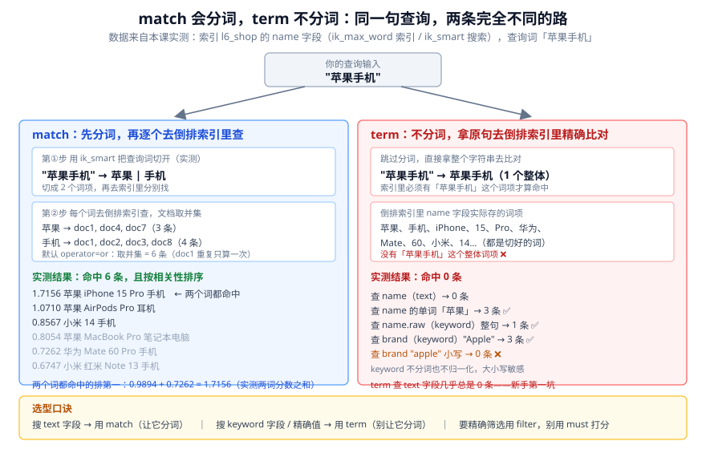
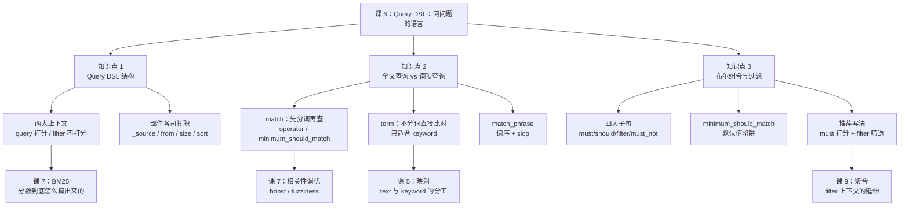

# 课 6：Query DSL：问问题的语言

> 阶段 3 · 第 6 课 ｜ 知识点：Query DSL 结构 / 全文查询 vs 词项查询 / 布尔组合与过滤
> 本课回答三个问题：**ES 的查询长什么样** → **`match` 和 `term` 到底差在哪** → **多个条件怎么组合**。
>
> 🧪 本课所有命令与输出，均为 **2026-08-31 在本机（Windows 11 + ES 9.5.1 + IK 9.5.1）实测**。
> 数据集：`l6_shop`（8 条商品，中文名 + IK 分词 + keyword 品牌），建库脚本见第四幕第 1 步。

---

## 🎬 第一幕：场景引入

课 4 你搞懂了倒排索引，课 5 你学会了给数据定规矩。现在你手里有一个结构合理的商品索引 `l6_shop`，8 条数据，品牌、价格、库存、上架时间一应俱全。

老板走过来说：**"给我搜一下苹果手机。"**

你张手就写——用课 5 刚学的 `term` 查询，多自然：

```bash
curl.exe -s -k -u elastic:密码 -X POST "https://localhost:9200/l6_shop/_search" \
  -H "Content-Type: application/json" \
  -d '{"query":{"term":{"name":"苹果手机"}}}'
```

```json
{"hits":{"total":{"value":0,"relation":"eq"},"max_score":null,"hits":[]}}
```

**0 条。**

你盯着屏幕：索引里明明有"苹果 iPhone 15 Pro 手机"，怎么可能搜不到？

你不服气，换个写法试试——把 `term` 改成 `match`：

```bash
-d '{"query":{"match":{"name":"苹果手机"}}}'
```

```json
{"hits":{"total":{"value":6},"max_score":1.71559}}
1.7156  苹果 iPhone 15 Pro 手机
1.0710  苹果 AirPods Pro 耳机
0.8567  小米 14 手机
0.8054  苹果 MacBook Pro 笔记本电脑
0.7262  华为 Mate 60 Pro 手机
0.6747  小米 红米 Note 13 手机
```

**6 条。**

同一个索引、同一句话、同一个字段，只换了一个关键字，从 0 条变成 6 条。

这就是课 4 结尾我留的那个问题——**`match` 和 `term` 到底有什么区别**——今天把它讲透。

而且这还没完。你接着会撞上第二个坑：想筛"苹果品牌 + 有货"，把两个条件都塞进 `must`，分数变了；换成 `filter`，分数又不一样。老板问"为什么这条排在前面"，你答不上来。

这三个问题，构成本课的全部内容：

| 症状 | 根因 | 知识点 |
|------|------|--------|
| `term` 查不到、`match` 能查到 | 一个不分词、一个分词 | **知识点 2：全文 vs 词项查询** |
| 两个条件组合，分数不对劲 | `must` 打分、`filter` 不打分 | **知识点 3：布尔组合与过滤** |
| 查询 JSON 该怎么写、哪些部件放哪 | DSL 结构 | **知识点 1：Query DSL 结构** |

---

## 🤔 第二幕：认知冲突

先破除三个直觉。

### 直觉一："`term` 是精确匹配，所以更严格、更准"

**错，恰恰相反。**

`term` 的意思是"**去倒排索引里找这个词项**"，它**不做任何处理**——不分词、不归一化、不小写化。它不是"更严格"，它是"**更原始**"。

课 4 讲过：`name` 是 `text` 字段，索引里存的是**切好的词**——`苹果`、`手机`、`iPhone`、`15`、`Pro`……**从来没有"苹果手机"这个整体词项**。

所以 `term` 拿"苹果手机"去查，等于在一本按词语排序的字典里找"苹果手机"这个不存在的词条——**当然 0 条**。

```
索引里 name 字段的实际词项（ik_max_word 切的）：
  苹果 | iPhone | 15 | Pro | 手机
  华为 | Mate | 60 | 手机
  小米 | 14 | 手机
  ...
```

> 📌 **`term` 的正确用法只有一个场景**：查 `keyword` 字段，或者查 `text` 字段里**确实存在的单个词项**。查整句话请用 `match`。

### 直觉二："`term` 查 keyword 字段，那我写 `apple` 也能查到 `Apple`"

**错。** 实测：

```bash
term: brand = "Apple"  → 3 条 ✅
term: brand = "apple"  → 0 条 ❌
```

`keyword` 字段**既不分词，也不归一化**。它在索引里是 `Apple`，你查 `apple` 就是另一个字符串。

课 4 讲过分析器三段式，`keyword` 类型相当于**只走了一段——什么都不做**（内部其实用 `keyword` 分析器，原样输出）。所以大小写、空格、标点全都敏感。

### 直觉三："两个条件都写进 `must` 就对了"

**能跑，但不是最优，而且分数会被污染。**

实测同一需求——"搜手机，只要苹果品牌"：

```bash
# 写法 A：品牌放 must
{"bool":{"must":[{"match":{"name":"手机"}},{"term":{"brand":"Apple"}}]}}
→ 命中 1 条，score = 1.6706

# 写法 B：品牌放 filter
{"bool":{"must":[{"match":{"name":"手机"}}],"filter":[{"term":{"brand":"Apple"}}]}}
→ 命中 1 条，score = 0.7262
```

**同一条文档，分数差了 2 倍多。**

哪个对？**都对，取决于你想不想要品牌参与打分。**

- 写法 A：`0.7262`（手机匹配得分）**+** `0.9445`（品牌匹配得分）= `1.6706`
- 写法 B：`0.7262`（手机匹配得分）**+** `0`（filter 不打分）= `0.7262`

关键是**写法 B 的 0.7262 和完全不加品牌条件时的分数一模一样**（实测对照组也是 0.7262）——这就是 `filter` 的本质：**只筛选，不干扰相关性**。

### 所以本课真正要解决的问题

把三个直觉翻译成三个知识点：

| 直觉 | 真相 | 知识点 |
|------|------|--------|
| 查询 JSON 随便写 | 有固定结构，部件各司其职 | **知识点 1：Query DSL 结构** |
| `term` 更严格 | `term` 更原始：不分词；`match` 会分词 | **知识点 2：全文 vs 词项查询** |
| 条件都塞 `must` | 打分条件用 `must`，筛选条件用 `filter` | **知识点 3：布尔组合与过滤** |

---

## 🔍 第三幕：层层揭示

### 知识点 1：Query DSL 结构

**一句话定义**：**Query DSL**是 ES 用 JSON 描述的查询语言——一个查询请求就是一棵由"**叶子查询**"（查什么）和"**复合查询**"（怎么组合）组成的树。

#### 直觉建立：填一张结构化的申请表

把一次搜索想成**填一张申请表**：

| 表格区域 | 对应 DSL 部件 | 作用 |
|---------|--------------|------|
| 你要找什么 | `"query"` | 核心条件，决定命中哪些文档、各得多少分 |
| 你不想看什么 | `"must_not"` | 排除条件 |
| 只要某几栏信息 | `"_source"` | 控制返回字段 |
| 从第几条开始看 | `"from"` / `"size"` | 分页 |
| 按什么排序 | `"sort"` | 排序（会覆盖相关性排序） |

**申请表是固定的，你不能把"第几页"填到"你要找什么"那一栏去。** DSL 同理——每个部件有固定位置。

#### 完整骨架（实测跑通）

```bash
curl.exe -s -k -u elastic:密码 -X POST "https://localhost:9200/l6_shop/_search" \
  -H "Content-Type: application/json" \
  -d '{
    "from": 0,
    "size": 3,
    "_source": ["name","price","brand"],
    "sort": [{"price":{"order":"desc"}}],
    "query": {
      "bool": {
        "must":     [{"match":{"name":"手机"}}],
        "filter":   [{"range":{"price":{"gte":1000}}}],
        "must_not": [{"term":{"brand":"Apple"}}],
        "should":   [{"term":{"tags":"旗舰"}}],
        "minimum_should_match": 0
      }
    }
  }'
```

实测输出：

```text
命中 2 条
  score=1.9135  华为 Mate 60 Pro 手机 | 6999.0 | ['手机','旗舰']
  score=0.8567  小米 14 手机        | 3999.0 | ['手机','性价比']
```

#### 两个上下文：query 与 filter

这是本课最重要的一个概念，官方原话：

> **Query context**: A query clause used in query context answers the question *"How well does this document match this query clause?"* … it also calculates a relevance score.
> **Filter context**: In filter context, a query clause answers the question *"Does this document match this query clause?"* The answer is a simple Yes or No — no scores are calculated.

翻成人话：

| | query 上下文 | filter 上下文 |
|---|-------------|--------------|
| 问的问题 | 这篇文档**有多匹配**？ | 这篇文档**匹不匹配**？ |
| 算分吗 | ✅ 算 `_score` | ❌ 恒为 0 |
| 排序影响 | 参与相关性排序 | 不参与（只筛掉不匹配的） |
| 缓存 | 不缓存 | **可被缓存** |
| 出现位置 | `query` / `must` / `should` | `filter` / `must_not` |

> 💡 **判断口诀**：**要不要影响"谁排前面"？** 要 → query 上下文；不要、只想筛掉一批 → filter 上下文。

#### 各部件速查

| 部件 | 作用 | 属于哪个上下文 |
|------|------|---------------|
| `"query"` | 查询主体，必填 | — |
| `"bool"` | 组合多个条件 | — |
| `"_source"` | 控制返回哪些字段 | — |
| `"size"` | 返回几条（默认 10） | — |
| `"from"` | 从第几条开始（配合 size 分页） | — |
| `"sort"` | 排序字段 | — |
| `"must"` | 必须满足，**参与打分** | query |
| `"should"` | 应该满足，满足则加分 | query |
| `"filter"` | 必须满足，**不打分、可缓存** | filter |
| `"must_not"` | 必须不满足，**不打分、可缓存** | filter |

> ⚠️ **`sort` 会覆盖相关性排序**。实测：一旦写了 `"sort"`，返回里的 `_score` 变成 `null`——因为你已经明确指定按什么排了，ES 就不再算分。课 7 会细讲。

#### 常用的叶子查询

| 查询 | 用途 | 例子 |
|------|------|------|
| `match_all` | 查所有 | `{"match_all":{}}` |
| `match` | 全文搜索（分词） | `{"match":{"name":"苹果手机"}}` |
| `match_phrase` | 短语搜索（词序也要对） | `{"match_phrase":{"name":"iPhone 15"}}` |
| `term` | 精确词项（不分词） | `{"term":{"brand":"Apple"}}` |
| `terms` | 多值精确匹配（任一命中） | `{"terms":{"brand":["Apple","Huawei"]}}` |
| `range` | 范围 | `{"range":{"price":{"gte":1000,"lte":5000}}}` |
| `exists` | 字段是否存在 | `{"exists":{"field":"brand"}}` |
| `multi_match` | 多字段搜同一个词 | `{"multi_match":{"query":"苹果","fields":["name","brand"]}}` |

后两个补测结果（本机实测）：

```text
exists: brand        → 8 条（全部商品都有品牌）
exists: missing_field → 0 条
multi_match「苹果」跨 name + brand → 3 条（AirPods 1.071 / iPhone 0.9894 / MacBook 0.8054）
```

> 💡 `multi_match` 就是"把同一个词扔进多个字段搜"，内部仍然是 match 逻辑。它有 `best_fields`（默认）/ `most_fields` / `cross_fields` 等类型，课 7 讲相关性调优时会细说。

#### 实测：`_source` / 分页 / 排序

```bash
# 只要 name 和 price 两个字段
-d '{"_source":["name","price"],"query":{"term":{"brand":"Apple"}}}'
```

```text
{'name': '苹果 iPhone 15 Pro 手机', 'price': 7999.0}
{'name': '苹果 MacBook Pro 笔记本电脑', 'price': 12999.0}
{'name': '苹果 AirPods Pro 耳机', 'price': 1799.0}
```

```bash
# 分页
-d '{"from":0,"size":2,"query":{"match_all":{}}}'   # 第1页: ['1','2']
-d '{"from":2,"size":2,"query":{"match_all":{}}}'   # 第2页: ['3','4']

# 按价格倒序
-d '{"size":3,"sort":[{"price":{"order":"desc"}}],"query":{"match_all":{}}}'
```

```text
苹果 MacBook Pro 笔记本电脑 12999.0
联想 ThinkPad 笔记本电脑     8999.0
苹果 iPhone 15 Pro 手机      7999.0
```

> 📌 `from`/`size` 分页有个**深度分页陷阱**（默认上限 10000），课 7 会讲 `search_after` 和 `scroll`。

📚 官方文档：[Query DSL](https://www.elastic.co/guide/en/elasticsearch/reference/current/query-dsl.html) ｜ [Query and filter context](https://www.elastic.co/guide/en/elasticsearch/reference/current/query-filter-context.html)

**一句话记住**：**一次搜索 = 一张固定格式的申请表；`query`/`must`/`should` 走 query 上下文会算分，`filter`/`must_not` 走 filter 上下文只筛选不打分。**

---

### 知识点 2：全文查询 vs 词项查询

**一句话定义**：**全文查询**（Full text queries，如 `match`）会先对查询词做分析（分词），再去倒排索引匹配；**词项查询**（Term-level queries，如 `term`）**不做分析**，直接拿原值去倒排索引精确比对。

#### 直觉建立：查字典 vs 查通讯录

想象你要找"苹果手机"这个东西：

**全文查询 = 查字典**：你先在脑子里把"苹果手机"拆成"苹果"和"手机"两个概念，然后分别去字典里查这两个词条，把结果合起来。字典里没有"苹果手机"这个连写的词条也没关系。

**词项查询 = 查通讯录**：你拿着"苹果手机"这整串字，去通讯录里找一个名字**恰好等于**"苹果手机"的联系人。通讯录里存的是"张三""李四"，没有"苹果手机"这个人——找不到。

**差别在于：你有没有先把查询词切开。**

#### 对比图



#### 实测：`match` vs `term` 的完整对照

数据集 `l6_shop`，`name` 是 `text`（ik_max_word 索引 / ik_smart 搜索）+ `name.raw` 是 `keyword`，`brand` 是 `keyword`。

**先看查询词被切成什么**（实测）：

```bash
curl.exe -s -k -u elastic:密码 -X POST "https://localhost:9200/l6_shop/_analyze" \
  -H "Content-Type: application/json" -d '{"field":"name","text":"苹果手机"}'
```

```text
ik_smart 搜索分词： 苹果 | 手机
```

现在跑七组对照（全部实测）：

| # | 查询 | 字段类型 | 命中 | 为什么 |
|---|------|---------|------|--------|
| A | `match`「苹果手机」 | text | **6 条** | 切成「苹果」「手机」两词，取并集 |
| B | `term`「苹果手机」 | text | **0 条** | 索引里没有这个整体词项 |
| C | `term`「苹果」 | text | **3 条** | 「苹果」是索引里真实存在的词项 |
| D | `term`「苹果 iPhone 15 Pro 手机」 | `name.raw`（keyword） | **1 条** | keyword 整句匹配，完全相等 |
| E | `term`「Apple」 | `brand`（keyword） | **3 条** | 精确值匹配 |
| F | `term`「apple」小写 | `brand`（keyword） | **0 条** | keyword 不归一化，大小写敏感 |
| G | `match`「Apple」 | `brand`（keyword） | **3 条** | 能查到，但对 keyword 用 match 没有分词意义 |

**B 和 C 的对比是理解本知识点的钥匙**：同一个 `term` 查询，查"苹果手机"是 0 条，查"苹果"是 3 条。**因为索引里存的是切好的词，不是整句。**

**再看 A 组 6 条为什么这么排序**（实测）：

```text
match「苹果手机」命中 6 条：
  1.7156  苹果 iPhone 15 Pro 手机      ← 两个词都命中
  1.0710  苹果 AirPods Pro 耳机        ← 只命中「苹果」
  0.8567  小米 14 手机                 ← 只命中「手机」
  0.8054  苹果 MacBook Pro 笔记本电脑   ← 只命中「苹果」
  0.7262  华为 Mate 60 Pro 手机        ← 只命中「手机」
  0.6747  小米 红米 Note 13 手机        ← 只命中「手机」
```

排第一的为什么是它？把两个词**单独查一遍**就清楚了（实测）：

```text
term「苹果」→ 苹果 iPhone 15 Pro 手机 : 0.9894
term「手机」→ 苹果 iPhone 15 Pro 手机 : 0.7262
                                     ─────────
                               合计 :  1.7156   ← 正是 match 给它的分数
```

**`match` 的分数 = 各词项得分之和。** 这条商品两个词都命中，自然排第一；只命中一个词的靠后。

> 📌 这不是巧合。bool 查询采用的是"**more-matches-is-better**"策略，官方原话：*"the score from each matching `must` or `should` clause will be added together to provide the final `_score`"*。**各子条件的分数相加就是总分**——课 7 讲 BM25 时会回来解释每个子分数本身怎么算。

#### `match` 的三个可调参数

**① `operator`：多个词之间是"或"还是"且"**

```bash
# 默认 or：任一词命中即可
-d '{"query":{"match":{"name":{"query":"苹果 华为","operator":"or"}}}}'
→ 5 条（苹果的 + 华为的都算）

# and：所有词都要命中
-d '{"query":{"match":{"name":{"query":"苹果 华为","operator":"and"}}}}'
→ 0 条（没有商品同时含"苹果"和"华为"）
```

**② `minimum_should_match`：至少要匹配几个词**

比 `operator` 更灵活，可以写数字也可以写百分比：

```bash
-d '{"query":{"match":{"name":{"query":"苹果 华为","minimum_should_match":1}}}}'
→ 5 条（2 个词至少匹配 1 个）
```

> 💡 长查询很有用：搜一句 10 个词的话，用 `"minimum_should_match":"75%"` 可以要求至少匹配 7-8 个词，比 `and`（必须全中）宽松，比 `or`（命中一个就算）精准。

**③ `fuzziness`：容错（课 7 会细讲）**

允许拼写错误，比如 `Iphone` 也能搜到 `iPhone`。

#### `match_phrase`：短语查询，词序也要对

`match` 只关心"有没有这些词"，**不关心顺序和位置**。`match_phrase` 要求**词序一致且相邻**：

```bash
# match_phrase「苹果手机」→ ik_smart 切成「苹果」「手机」，但原文里这两个词不相邻
→ 0 条

# match_phrase「iPhone 15」→ 相邻且顺序一致
→ 1 条（苹果 iPhone 15 Pro 手机，score=3.7542）

# 加 slop 放宽：允许中间隔几个词
-d '{"query":{"match_phrase":{"name":{"query":"苹果 手机","slop":3}}}}'
→ 1 条（score=0.6672）
```

> ⚠️ **注意上面第一个结果**：`match_phrase` 查"苹果手机"是 **0 条**，因为 IK 把查询切成"苹果|手机"两个词，而文档里这两个词**不相邻**（"苹果 iPhone 15 Pro 手机"中间隔了三个词）。这再次说明：**你的分析器怎么切，直接决定查询行为。**

> 📌 `slop` = 允许中间隔多少个词。`slop=0`（默认）要求严格相邻，`slop=3` 允许中间最多隔 3 个词。

#### 什么时候用什么

| 你的需求 | 用什么 | 查什么字段 |
|---------|-------|-----------|
| 搜一句话、一段描述 | `match` | `text` |
| 要求词序一致 | `match_phrase` | `text` |
| 精确筛选（品牌、状态、ID） | `term` | `keyword` |
| 多个精确值任一命中 | `terms` | `keyword` |
| 数值/日期范围 | `range` | 数值 / `date` |

**最容易犯的错**：拿 `term` 去查 `text` 字段的整句话。实测 0 条，而你会在那里怀疑人生。

📚 官方文档：[Full text queries](https://www.elastic.co/guide/en/elasticsearch/reference/current/full-text-queries.html) ｜ [Term-level queries](https://www.elastic.co/guide/en/elasticsearch/reference/current/term-level-queries.html)

**一句话记住**：**`match` 查 text（先分词再查），`term` 查 keyword（不分词直接比对）；用 `term` 查 text 的整句话必然 0 条，这是新手第一坑。**

---

### 知识点 3：布尔组合与过滤

**一句话定义**：**bool 查询**用 `must` / `should` / `filter` / `must_not` 四个子句把多个查询条件组合成一棵逻辑树，其中 `must`/`should` 参与打分，`filter`/`must_not` 只筛选不打分且可被缓存。

#### 直觉建立：招聘筛选的四道工序

把 bool 查询想成**筛简历**：

| 工序 | 对应子句 | 行为 |
|------|---------|------|
| **硬性要求**：必须会 Java | `must` | 不满足直接淘汰，**且要评分**（会多少年） |
| **加分项**：有开源项目经验更好 | `should` | 有则加分，没有也不淘汰 |
| **过滤条件**：只要在职状态 | `filter` | 不满足直接淘汰，**但不参与评分** |
| **一票否决**：有竞业限制的不要 | `must_not` | 命中即淘汰，不评分 |

关键差别在**第 1 和第 3 道工序**：硬性要求会**影响候选人排名**，过滤条件只决定"要不要这个人"，**不影响排名**。

#### 四大子句（全部实测）

数据集 `l6_shop`，8 条商品。

**① `must`：必须满足，参与打分**

```bash
-d '{"query":{"bool":{"must":[{"match":{"name":"手机"}}]}}}'
```

```text
命中 4 条  max_score=0.8567
  0.8567  小米 14 手机
  0.7262  苹果 iPhone 15 Pro 手机
  0.7262  华为 Mate 60 Pro 手机
  0.6747  小米 红米 Note 13 手机
```

**② `should`：应该满足，满足则加分**

```bash
-d '{"query":{"bool":{"should":[{"term":{"brand":"Apple"}},{"term":{"brand":"Xiaomi"}}]}}}'
```

```text
命中 5 条  max_score=1.2809
  1.2809  小米 14 手机
  1.2809  小米 红米 Note 13 手机
  0.9445  苹果 iPhone 15 Pro 手机
  0.9445  苹果 MacBook Pro 笔记本电脑
  0.9445  苹果 AirPods Pro 耳机
```

**③ `must_not`：必须不满足，不打分**

```bash
-d '{"query":{"bool":{"must_not":[{"term":{"brand":"Apple"}}]}}}'
```

```text
命中 5 条  max_score=0.0     ← 注意分数全是 0
  0.0000  华为 Mate 60 Pro 手机
  0.0000  小米 14 手机
  0.0000  联想 ThinkPad 笔记本电脑
  0.0000  华为 MateBook 笔记本电脑
  0.0000  小米 红米 Note 13 手机
```

> 📌 `must_not` 单独使用时等价于"match_all 减去这些"——8 条减去 3 条苹果 = 5 条。**因为没有任何打分查询，所有分数都是 0。**

**④ `filter`：必须满足，不打分、可缓存**

```bash
-d '{"query":{"bool":{"filter":[{"term":{"brand":"Apple"}}]}}}'
```

```text
命中 3 条  max_score=0.0     ← 同样全是 0
  0.0000  苹果 iPhone 15 Pro 手机
  0.0000  苹果 MacBook Pro 笔记本电脑
  0.0000  苹果 AirPods Pro 耳机
```

#### 决定性验证：`filter` 到底影不影响打分？

这是本知识点最重要的一组对照实验（全部实测）。

**场景**：搜"手机"，条件是品牌为 Apple。

```text
[A] brand 放 must（参与打分）
    score=1.6706  苹果 iPhone 15 Pro 手机

[B] brand 放 filter（不打分）
    score=0.7262  苹果 iPhone 15 Pro 手机

[C] 无任何 brand 条件（对照组）
    0.8567  小米 14 手机
    0.7262  苹果 iPhone 15 Pro 手机   ← 和 [B] 完全一致
    0.7262  华为 Mate 60 Pro 手机
    0.6747  小米 红米 Note 13 手机
```

**结论一目了然**：

- `[A]` = `0.7262`（"手机"匹配得分）**+** `0.9445`（"Apple"匹配得分）= `1.6706`
- `[B]` = `0.7262` + `0` = `0.7262`
- `[C]` = `0.7262`

**`[B]` 的分数和完全不加品牌条件的 `[C]` 一模一样。** 这就是 `filter` 的本质——**它是透明的，不干扰相关性**。

再用另一个 filter 交叉验证（实测）：

```text
[对照] 搜"手机"，不加 filter：
  0.8567  小米 14 手机
  0.7262  苹果 iPhone 15 Pro 手机
  0.7262  华为 Mate 60 Pro 手机
  0.6747  小米 红米 Note 13 手机

[实验] 搜"手机" + filter(stock>=20)：
  0.8567  小米 14 手机 (stock=100)
  0.7262  苹果 iPhone 15 Pro 手机 (stock=50)
  0.7262  华为 Mate 60 Pro 手机 (stock=30)
  0.6747  小米 红米 Note 13 手机 (stock=300)
```

**四条的分数逐一未变。** filter 只负责把不合格的筛掉（本例里 8 条 stock 都 ≥20，所以一条没筛掉），**不碰分数**。

> 📌 这和官方文档完全一致：*"Queries specified under the filter element have no effect on scoring — scores are returned as 0."*

#### `minimum_should_match` 的默认值陷阱

这是个高频面试/踩坑点，官方原话：

> If the bool query includes at least one `should` clause and **no** `must` or `filter` clauses, the default value is **1**. Otherwise, the default value is **0**.

翻成人话：

| bool 里有什么 | `minimum_should_match` 默认值 | 含义 |
|--------------|---------------------------|------|
| 只有 `should` | **1** | should 至少满足 1 个（等价于 OR） |
| 有 `should` + `must`/`filter` | **0** | should 一个都不满足也行，**只加分不筛选** |

**实测验证**（`should` 里是 `tags=旗舰`）：

```text
[must 存在，minimum_should_match 默认 0 → should 只加分不筛选]
  命中 4 条
    1.9135  苹果 iPhone 15 Pro 手机  tags=['手机','旗舰']
    1.9135  华为 Mate 60 Pro 手机    tags=['手机','旗舰']
    0.8567  小米 14 手机            tags=['手机','性价比']   ← 非旗舰也进来了
    0.6747  小米 红米 Note 13 手机   tags=['手机','入门']     ← 非旗舰也进来了
    
[显式设 minimum_should_match=1 → should 变成硬性条件]
  命中 2 条
    1.9135  苹果 iPhone 15 Pro 手机  tags=['手机','旗舰']
    1.9135  华为 Mate 60 Pro 手机    tags=['手机','旗舰']     ← 非旗舰被筛掉
```

**注意分数没变**（都是 1.9135），变的是**命中数量**。`minimum_should_match` 控制的是"够不够格进来"，不是"加多少分"。

> ⚠️ **最常见的坑**：写了 `must` + `should`，以为 should 是"或"条件、能扩大结果集。实际上默认 `minimum_should_match=0`，**should 一条都不会多筛进来**，只是给命中的加个分。想要"或"，必须显式设 `minimum_should_match: 1`。

**反过来再看只有 should 的情况**（实测）：

```text
[只有 should → 默认 minimum_should_match=1，等价于 OR]
  命中 4 条（Apple 的 3 条 + Lenovo 的 1 条）

[显式设 minimum_should_match=2 → 两个都要满足]
  命中 0 条  ← brand 是单值字段，不可能同时等于 Apple 和 Lenovo
```

#### 组合实战：must + filter 分离

生产上最推荐的写法——**打分条件放 `must`，筛选条件放 `filter`**：

```bash
curl.exe -s -k -u elastic:密码 -X POST "https://localhost:9200/l6_shop/_search" \
  -H "Content-Type: application/json" \
  -d '{
    "query":{
      "bool":{
        "must":[{"match":{"name":"手机"}}],
        "filter":[
          {"term":{"brand":"Apple"}},
          {"range":{"stock":{"gt":0}}}
        ]
      }
    }
  }'
```

实测：`命中 1 条，score=0.7262`（分数只来自"手机"的匹配度，品牌和库存只做筛选）。

**为什么这么写更好？**

| 好处 | 说明 |
|------|------|
| 相关性干净 | 分数只反映"用户搜的词有多匹配"，不被筛选条件污染 |
| 可缓存 | filter 结果进 query cache，重复查询更快 |
| 语义清晰 | 后来的人一眼看出哪些是"搜什么"、哪些是"筛什么" |

> 💡 **关于缓存**：官方明确说 filter 子句 *"are considered for caching"*。但本课只有 8 条文档，实测 `query_cache` 的 `hit_count` 始终为 0——**数据量太小，缓存根本没被触发**。这是诚实结论：缓存在生产规模（十万级以上）才有意义，本机环境量级测不出来。

#### 嵌套 bool

bool 可以嵌套，构造复杂逻辑：

```json
{"bool":{"must":[
  {"bool":{"should":[{"term":{"brand":"Apple"}},{"term":{"brand":"Huawei"}}]}},
  {"match":{"name":"手机"}}
]}}
```

语义：`(品牌=Apple OR 品牌=Huawei) AND name 含"手机"`

> ⚠️ 官方提醒：*"While nesting bool queries can be powerful, it can also lead to complex and slow queries. Try to keep your queries as flat as possible."* **能平铺就别嵌套。**

#### 四大子句速查

| 子句 | 必须满足 | 打分 | 缓存 | 类比 |
|------|---------|------|------|------|
| `must` | ✅ | ✅ | ❌ | 硬性要求 + 评分 |
| `should` | 看 `minimum_should_match` | ✅ | ❌ | 加分项 |
| `filter` | ✅ | ❌（恒 0） | ✅ | 硬性筛选，不评分 |
| `must_not` | 必须**不**满足 | ❌（恒 0） | ✅ | 一票否决 |

📚 官方文档：[Boolean query](https://www.elastic.co/guide/en/elasticsearch/reference/current/query-dsl-bool-query.html)

**一句话记住**：**打分条件放 `must`/`should`，筛选条件放 `filter`/`must_not`；`filter` 不影响分数且可缓存——实测加不加 filter，命中文档的分数逐一不变。**

---

## ✋ 第四幕：实操验证

这一幕从建库开始，给你一条**可以整段复制执行**的完整验证链。

> 前提：ES 9.5.1 在运行，IK 插件已装（课 4），`curl.exe` 可用。
> 下面用 `$ES_PW` 代指你的密码。示例按 **Git Bash** 写法（单引号不转义 + `\` 续行）。

### 第 1 步：建索引并写入 8 条测试数据

```bash
export ES_PW='你的密码'

# 建索引：name 用 IK + keyword 子字段（课 5 的成果）
curl.exe -s -k -u elastic:$ES_PW -X PUT "https://localhost:9200/l6_shop" \
  -H "Content-Type: application/json" \
  -d '{
    "settings":{"number_of_shards":1,"number_of_replicas":0},
    "mappings":{"properties":{
      "name":{"type":"text","analyzer":"ik_max_word","search_analyzer":"ik_smart",
              "fields":{"raw":{"type":"keyword"}}},
      "brand":{"type":"keyword"},
      "price":{"type":"scaled_float","scaling_factor":100},
      "stock":{"type":"integer"},
      "tags":{"type":"keyword"},
      "on_sale":{"type":"boolean"},
      "created_at":{"type":"date"}}}}'

# 批量写入 8 条商品
curl.exe -s -k -u elastic:$ES_PW -X POST "https://localhost:9200/l6_shop/_bulk?refresh=true" \
  -H "Content-Type: application/json" \
  -d '
{"index":{"_id":"1"}}
{"name":"苹果 iPhone 15 Pro 手机","brand":"Apple","price":7999.00,"stock":50,"tags":["手机","旗舰"],"on_sale":true,"created_at":"2026-08-01"}
{"index":{"_id":"2"}}
{"name":"华为 Mate 60 Pro 手机","brand":"Huawei","price":6999.00,"stock":30,"tags":["手机","旗舰"],"on_sale":true,"created_at":"2026-08-05"}
{"index":{"_id":"3"}}
{"name":"小米 14 手机","brand":"Xiaomi","price":3999.00,"stock":100,"tags":["手机","性价比"],"on_sale":true,"created_at":"2026-07-20"}
{"index":{"_id":"4"}}
{"name":"苹果 MacBook Pro 笔记本电脑","brand":"Apple","price":12999.00,"stock":20,"tags":["电脑","旗舰"],"on_sale":false,"created_at":"2026-06-15"}
{"index":{"_id":"5"}}
{"name":"联想 ThinkPad 笔记本电脑","brand":"Lenovo","price":8999.00,"stock":15,"tags":["电脑","商务"],"on_sale":true,"created_at":"2026-08-10"}
{"index":{"_id":"6"}}
{"name":"华为 MateBook 笔记本电脑","brand":"Huawei","price":7499.00,"stock":25,"tags":["电脑","轻薄"],"on_sale":false,"created_at":"2026-07-01"}
{"index":{"_id":"7"}}
{"name":"苹果 AirPods Pro 耳机","brand":"Apple","price":1799.00,"stock":200,"tags":["耳机","配件"],"on_sale":true,"created_at":"2026-08-20"}
{"index":{"_id":"8"}}
{"name":"小米 红米 Note 13 手机","brand":"Xiaomi","price":999.00,"stock":300,"tags":["手机","入门"],"on_sale":true,"created_at":"2026-08-25"}
'
```

验证：`{"count":8}`

### 第 2 步：撞一次"term 查 text 是 0 条"

```bash
# term 查整句 → 0 条
curl.exe -s -k -u elastic:$ES_PW -X POST "https://localhost:9200/l6_shop/_search" \
  -H "Content-Type: application/json" \
  -d '{"query":{"term":{"name":"苹果手机"}}}'

# match 查同一句 → 6 条
curl.exe -s -k -u elastic:$ES_PW -X POST "https://localhost:9200/l6_shop/_search" \
  -H "Content-Type: application/json" \
  -d '{"query":{"match":{"name":"苹果手机"}}}'
```

**先确认分词结果**，这一步是排查的关键：

```bash
curl.exe -s -k -u elastic:$ES_PW -X POST "https://localhost:9200/l6_shop/_analyze" \
  -H "Content-Type: application/json" \
  -d '{"field":"name","text":"苹果手机"}'
# → 苹果 | 手机
```

### 第 3 步：验证 term 的正确用法

```bash
# ✅ term 查 text 的单个词
-d '{"query":{"term":{"name":"苹果"}}}'                        # 3 条

# ✅ term 查 keyword 子字段（整句精确）
-d '{"query":{"term":{"name.raw":"苹果 iPhone 15 Pro 手机"}}}'  # 1 条

# ✅ term 查 keyword 字段
-d '{"query":{"term":{"brand":"Apple"}}}'                      # 3 条

# ❌ keyword 大小写敏感
-d '{"query":{"term":{"brand":"apple"}}}'                      # 0 条
```

### 第 4 步：验证 filter 不影响打分（本课核心实验）

```bash
# [A] brand 放 must → 参与打分
curl.exe -s -k -u elastic:$ES_PW -X POST "https://localhost:9200/l6_shop/_search" \
  -H "Content-Type: application/json" \
  -d '{"query":{"bool":{"must":[{"match":{"name":"手机"}},{"term":{"brand":"Apple"}}]}}}'
# → 1 条，score=1.6706

# [B] brand 放 filter → 不打分
curl.exe -s -k -u elastic:$ES_PW -X POST "https://localhost:9200/l6_shop/_search" \
  -H "Content-Type: application/json" \
  -d '{"query":{"bool":{"must":[{"match":{"name":"手机"}}],"filter":[{"term":{"brand":"Apple"}}]}}}'
# → 1 条，score=0.7262

# [C] 对照组：不加品牌条件
curl.exe -s -k -u elastic:$ES_PW -X POST "https://localhost:9200/l6_shop/_search" \
  -H "Content-Type: application/json" \
  -d '{"query":{"match":{"name":"手机"}}}'
# → 4 条，苹果那条 score=0.7262（与 [B] 完全一致）
```

**预期**：`[B]` 的分数 = `[C]` 中同文档的分数，`[A]` 则明显更高。

### 第 5 步：体验四大子句

```bash
# must_not：排除苹果 → 5 条，分数全 0
-d '{"query":{"bool":{"must_not":[{"term":{"brand":"Apple"}}]}}}'

# only must_not + filter：先圈定再排除
-d '{"query":{"bool":{"filter":[{"range":{"price":{"gte":1000}}}],
                     "must_not":[{"term":{"brand":"Apple"}}]}}}'
# → 4 条

# should 单独用（默认 minimum_should_match=1）
-d '{"query":{"bool":{"should":[{"term":{"brand":"Apple"}},{"term":{"brand":"Lenovo"}}]}}}'
# → 4 条（Apple 3 + Lenovo 1）
```

### 第 6 步：验证 minimum_should_match 的默认值陷阱

```bash
# must + should，默认 minimum_should_match=0 → should 只加分不筛选
-d '{"query":{"bool":{"must":[{"match":{"name":"手机"}}],
                     "should":[{"term":{"tags":"旗舰"}}]}}}'
# → 4 条（非旗舰的也在里面）

# 显式设 1 → should 变成硬性条件
-d '{"query":{"bool":{"must":[{"match":{"name":"手机"}}],
                     "should":[{"term":{"tags":"旗舰"}}],
                     "minimum_should_match":1}}}'
# → 2 条（只要旗舰）
```

**预期**：命中数从 4 降到 2，但旗舰那两条的分数**不变**（1.9135）。

### 第 7 步：match_phrase 与 slop

```bash
# 严格相邻 → 0 条（"苹果"和"手机"在原文里不相邻）
-d '{"query":{"match_phrase":{"name":"苹果手机"}}}'

# 相邻且顺序一致 → 1 条
-d '{"query":{"match_phrase":{"name":"iPhone 15"}}}'

# 加 slop 放宽 → 1 条
-d '{"query":{"match_phrase":{"name":{"query":"苹果 手机","slop":3}}}}'
```

### 第 8 步：完整 DSL 骨架（所有部件齐活）

```bash
curl.exe -s -k -u elastic:$ES_PW -X POST "https://localhost:9200/l6_shop/_search" \
  -H "Content-Type: application/json" \
  -d '{
    "from":0,
    "size":5,
    "_source":["name","price","brand","tags"],
    "query":{"bool":{
      "must":[{"match":{"name":"手机"}}],
      "filter":[{"range":{"price":{"gte":1000}}}],
      "must_not":[{"term":{"brand":"Apple"}}],
      "should":[{"term":{"tags":"旗舰"}}],
      "minimum_should_match":0}}}'
```

**预期**：

```text
命中 2 条
  1.9135  华为 Mate 60 Pro 手机 | 6999.0 | ['手机','旗舰']
  0.8567  小米 14 手机        | 3999.0 | ['手机','性价比']
```

### 第 9 步：清理（可选）

```bash
curl.exe -s -k -u elastic:$ES_PW -X DELETE "https://localhost:9200/l6_shop"
```

### 自检三问

1. `term` 查 `name`「苹果手机」为什么是 0 条？改成什么就能查到？
2. `must` 和 `filter` 都会筛掉不匹配的文档，那它们的区别体现在哪里？（提示：看分数）
3. 写了 `must` + `should`，想让 should 变成"或"条件，必须加什么参数？

（答案都在上面三幕里。）

---

## 🎓 第五幕：体系收束

### 本课知识地图



### 三句话记住本课

1. **`match` 分词、`term` 不分词**——查 text 用 `match`，查 keyword 用 `term`；拿 `term` 查 text 的整句话必然 0 条。
2. **`must`/`should` 打分，`filter`/`must_not` 不打分**——实测加不加 filter，命中文档的分数逐一不变。
3. **`minimum_should_match` 的默认值是陷阱**——有 `must`/`filter` 时默认为 0，`should` 只加分不筛选。

### 本课的三个数字（都来自实测）

| 数字 | 含义 |
|------|------|
| **0 条 → 6 条** | `term` 改 `match`，同一句查询的命中数变化 |
| **1.6706 → 0.7262** | 品牌条件从 `must` 挪到 `filter`，同一文档的分数变化 |
| **4 条 → 2 条** | `minimum_should_match` 从 0 改成 1，命中数变化（分数不变） |

### 常见误区

**误区一：以为 `term` 是"精确匹配"，所以查整句应该用 `term`。**

`term` 的"精确"指的是**不分词**，不是"匹配更准"。整句在 text 字段里根本不是一个词项，所以必然 0 条。**要精确匹配整句，用 `keyword` 子字段 + `term`。**

**误区二：给 `keyword` 字段用 `match`。**

能查到（实测 `match` 查 `brand:"Apple"` 也是 3 条），但**没有意义**——`keyword` 不分词，`match` 的分词过程被空转。而且一旦值里有空格，行为会变得难以预测。

**误区三：以为 `should` 会扩大结果集。**

只有在**没有** `must`/`filter` 时才如此（此时默认 `minimum_should_match=1`）。一旦有 `must`，`should` 默认 `minimum_should_match=0`，**只是加分，不会多筛进来任何一条**。

**误区四：把所有条件都塞进 `must`。**

能跑，但会让**筛选条件污染相关性分数**。搜"手机"只要苹果品牌，把品牌放 `must` 会让分数从 0.7262 涨到 1.6706——这个分数对用户毫无意义（用户搜的是"手机"，不是"苹果"）。

**误区五：以为 `filter` 一定更快。**

理论上 filter 可缓存，但**本课 8 条文档的实测中 `query_cache.hit_count` 始终为 0**——数据量太小，缓存根本没触发。缓存在生产规模才有意义。**用 `filter` 的首要理由是语义清晰 + 分数干净，不是性能。**

### 📋 命令速查卡

| 场景 | 命令（省略 `curl.exe -s -k -u elastic:密码 -X POST "…/_search" -H "Content-Type: application/json"`） |
|------|---------------------------------------------|
| 查所有 | `-d '{"query":{"match_all":{}}}'` |
| 全文搜索 | `-d '{"query":{"match":{"name":"苹果手机"}}}'` |
| 且关系 | `-d '{"query":{"match":{"name":{"query":"苹果 华为","operator":"and"}}}}'` |
| 短语 | `-d '{"query":{"match_phrase":{"name":"iPhone 15"}}}'` |
| 短语放宽 | `-d '{"query":{"match_phrase":{"name":{"query":"苹果 手机","slop":3}}}}'` |
| 精确词项 | `-d '{"query":{"term":{"brand":"Apple"}}}'` |
| 多值精确 | `-d '{"query":{"terms":{"brand":["Apple","Huawei"]}}}'` |
| 范围 | `-d '{"query":{"range":{"price":{"gte":1000,"lte":5000}}}}'` |
| 布尔组合 | `-d '{"query":{"bool":{"must":[...],"filter":[...]}}}'` |
| 控制返回字段 | `-d '{"_source":["name","price"],"query":{...}}'` |
| 分页 | `-d '{"from":0,"size":10,"query":{...}}'` |
| 排序 | `-d '{"sort":[{"price":{"order":"desc"}}],"query":{...}}'` |
| 看分词结果 | `-X POST "…/_analyze" -d '{"field":"name","text":"苹果手机"}'` |

### 查询类型速查

| 查询 | 分类 | 分词吗 | 打分吗 | 用在什么字段 |
|------|------|--------|--------|-------------|
| `match` | 全文 | ✅ | ✅ | `text` |
| `match_phrase` | 全文 | ✅ | ✅ | `text` |
| `multi_match` | 全文 | ✅ | ✅ | 多个 `text` |
| `term` | 词项 | ❌ | ✅ | `keyword` |
| `terms` | 词项 | ❌ | ✅ | `keyword` |
| `range` | 词项 | ❌ | ✅ | 数值 / `date` |
| `exists` | 词项 | ❌ | ✅ | 任意 |
| `bool` | 复合 | — | 看子句 | — |

### 与课 4、课 5 的呼应

| 前两课留下的疑问 | 本课怎么回答的 |
|-----------------|---------------|
| 课 4：`match` 和 `term` 到底什么区别？ | **知识点 2**：match 先分词再查，term 不分词直接比对 |
| 课 4：倒排索引里存的到底是什么？ | **知识点 2**：存的是切好的词项，所以整句查不到 |
| 课 5：text 和 keyword 该怎么选？ | **知识点 2**：要搜用 text + `match`，要精确筛选用 keyword + `term` |
| 课 5：`_source` 和索引是两回事 | **知识点 3**：filter 只筛索引里的文档，`_source` 不受影响 |

### 阶段 3 进度

| 课 | 回答的问题 | 状态 |
|----|-----------|------|
| 课 6 | 怎么向 ES 提问（Query DSL） | ✅ 已完成 |
| 课 7 | 结果凭什么这么排（BM25 / 排序分页高亮） | ⬜ 待开始 |
| 课 8 | 怎么做统计（聚合） | ⬜ 待开始 |

你现在具备的能力：**能写出结构正确的查询，知道每个条件该放哪个子句，并且能预判分数会被什么影响。**

但还有一个问题没解决——**分数到底是怎么算出来的？** 为什么"小米 14 手机"的 0.8567 比"苹果 iPhone 15 Pro 手机"的 0.7262 高？这是课 7 的 BM25。

### 伏笔表

| 本课留下的疑问 | 在哪一课解开 |
|---------------|-------------|
| 0.7262 和 1.6706 这些分数到底怎么算的？ | **课 7：BM25 相关性** |
| 怎么人为提高某个字段的权重（boost）？ | **课 7：相关性调优** |
| 拼写错误怎么容错（fuzziness）？ | **课 7：相关性调优** |
| `from`/`size` 超过 10000 怎么办？ | **课 7：深度分页（search_after / scroll）** |
| 聚合为什么必须用 keyword？ | **课 8：聚合** |
| 多字段同时搜索（multi_match）怎么配？ | **课 7：相关性调优** |

---

## 🚀 下一批接力提示词

> 学完本课后，**复制下面这段文字发给 AI**，即可无缝进入下一课（无需重新描述上下文）：

```
继续学 Elasticsearch。我的学习档案在 elasticsearch/00-学习档案.md，
刚学完阶段 3《查询与聚合》课 6《Query DSL：问问题的语言》的三个知识点
（Query DSL 结构 / 全文查询 vs 词项查询 / 布尔组合与过滤），
本机已有运行中的 ES 9.5.1 且已装好 IK 9.5.1 插件（https://localhost:9200，
curl.exe -k -u elastic:密码），实测索引 l6_shop（8 条商品数据）、
news、news_ik 都在。

请按大纲继续讲解课 7《为什么这条排在前面》的三个知识点：
BM25 相关性 / 排序 · 分页 · 高亮 / 相关性调优。
重点接住本课留下的伏笔：0.7262、1.6706 这些分数到底怎么算出来的，
怎么人为提高某个字段的权重（boost），
以及 from/size 超过 10000 的深度分页问题怎么解。
```

## 🧭 课程导航

- **上一课**：[课 5 · 映射：给数据定规矩](../../2-核心原理与上手/lessons/lesson-05-映射给数据定规矩.md)
- **下一课**：课 7 · 为什么这条排在前面
- **本阶段**：[阶段 3 概览](../overview.md)
- **返回**：[课程目录](../../02-课程目录.md) ｜ [学习路径总览](../../01-学习路径总览.md)
