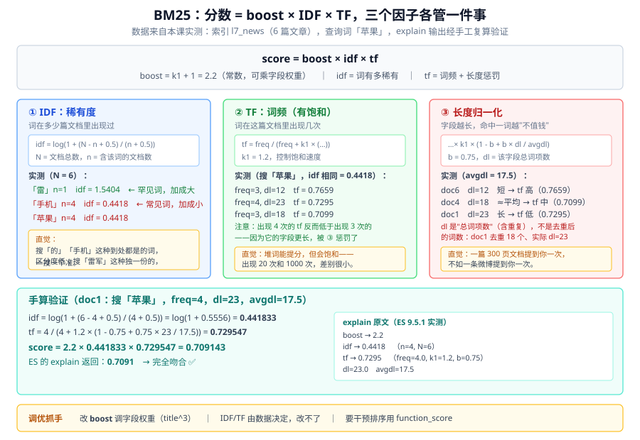
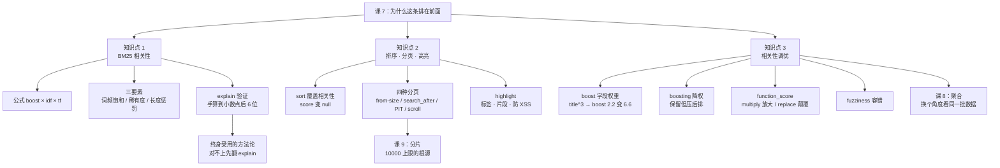

# 课 7：为什么这条排在前面

> 阶段 3 · 第 7 课 ｜ 知识点：相关性打分 BM25 / 排序 · 分页 · 高亮 / 相关性调优
> 本课回答三个问题：**分数怎么算出来的** → **怎么控制输出顺序和展示** → **不满意时怎么调**。
>
> 🧪 本课所有命令与输出，均为 **2026-08-31 在本机（Windows 11 + ES 9.5.1 + IK 9.5.1）实测**。
> 数据集：`l7_news`（6 篇文章，专为讲清 BM25 设计），复用课 6 的 `l6_shop`。

---

## 🎬 第一幕：场景引入

课 6 结尾，我们留下了一个没解开的结。

当时在 `l6_shop` 里搜「手机」，返回结果是这样的：

```text
0.8567  小米 14 手机
0.7262  苹果 iPhone 15 Pro 手机
0.7262  华为 Mate 60 Pro 手机
0.6747  小米 红米 Note 13 手机
```

**为什么"小米 14 手机"比"苹果 iPhone 15 Pro 手机"分高？**

两条都含"手机"这个词。凭什么？

你可能会猜：

- "小米 14 手机"名字短？✅ 猜对了一半
- "苹果 iPhone 15 Pro 手机"里英文多、被切得更碎？
- 还是说……分数其实是**随机**的？

都不是。**分数不是玄学，它是一个可以手算的公式。**

### 让 ES 自己告诉你

ES 提供了一个 `_explain` API，能把某条文档的算分过程**逐层拆解**出来：

```bash
curl.exe -s -k -u elastic:密码 -X POST "https://localhost:9200/l7_news/_explain/1" \
  -H "Content-Type: application/json" \
  -d '{"query":{"match":{"content":"苹果"}}}'
```

实测输出（已精简）：

```text
weight(content:苹果 in 0) [PerFieldSimilarity], result of:  → 0.7091
  score(freq=4.0), computed as boost * idf * tf from:  → 0.7091
    boost  → 2.2
    idf, computed as log(1 + (N - n + 0.5) / (n + 0.5)) from:  → 0.4418
      n, number of documents containing term  → 4
      N, total number of documents with field  → 6
    tf, computed as freq / (freq + k1 * (1 - b + b * dl / avgdl)) from:  → 0.7295
      freq, occurrences of term within document  → 4.0
      k1, term saturation parameter  → 1.2
      b, length normalization parameter  → 0.75
      dl, length of field  → 23.0
      avgdl, average length of field  → 17.5
```

**每一个数字都摆在这儿了。** 本课要做的就是让你看懂这一屏，并且能自己手算验证。

### 但先别急着算，看一个更反直觉的现象

我建了个 6 篇文章的索引 `l7_news`，搜「苹果」：

```text
0.7444  doc6  苹果手机降价促销      ← 「苹果」出现 3 次
0.7091  doc1  苹果发布 iPhone 15   ← 「苹果」出现 4 次
0.6901  doc4  苹果股价上涨         ← 「苹果」出现 3 次
0.3998  doc5  手机市场分析报告      ← 「苹果」出现 1 次
```

**出现 4 次的，分数竟然低于出现 3 次的。**

按常识，词频越高应该越相关才对。为什么反了？

这就是 BM25 比朴素 TF-IDF 聪明的地方——**它同时考虑了"词频"和"字段长度"两件事**。`doc1` 的 `content` 更长（23 个词项 vs doc6 的 12 个），被"稀释"了。

### 本课要解决的三件事

| 问题 | 知识点 |
|------|--------|
| 0.7091 这个数字到底怎么来的？ | **知识点 1：BM25 相关性** |
| 我想按时间/销量排序、只要第 100 页、关键词要高亮 | **知识点 2：排序 · 分页 · 高亮** |
| 相关性不满意，怎么人工干预？ | **知识点 3：相关性调优** |

---

## 🤔 第二幕：认知冲突

先破除四个直觉。

### 直觉一："分数是 ES 内部的黑盒，没法验证"

**错。分数可以手算，而且能算到小数点后 6 位都对得上。**

拿刚才 doc1 的 explain 输出，我用手算复现了一遍：

```text
idf = log(1 + (6 - 4 + 0.5) / (4 + 0.5)) = log(1 + 0.5556) = 0.441833
tf  = 4 / (4 + 1.2 × (1 - 0.75 + 0.75 × 23 / 17.5)) = 0.729547
score = 2.2 × 0.441833 × 0.729547 = 0.709143
```

**ES 返回的正是 0.7091。**

本课后面会带你完整手算一遍。从此分数对你不再是黑盒。

### 直觉二："`boost = 2.2` 是我设的权重"

**不是。** 实测显示 `boost → 2.2`，但我在查询里**一个 boost 都没写**。

这个 2.2 是 `k1 + 1 = 1.2 + 1`，**Lucene 为了对齐其他排序函数的量纲而乘的一个常数**。它是常量，**对所有文档一视同仁，不影响排序**。

真正能调的"字段权重"是写在查询里的 `title^3` 那种，那才是我说的 boost。实测给 `title` 加权后，explain 里的 boost 从 2.2 变成了 **6.6**（= 2.2 × 3）。

> 📌 **两个 boost 别搞混**：explain 里的 `boost 2.2` 是公式常量（k1+1）；查询里的 `title^3` 是字段权重（乘在 2.2 上）。

### 直觉三："`dl` 是文档里有多少个不同的词"

**错。** 实测：doc1 的 `content` **去重后是 18 个词**，但 explain 里 `dl = 23`。

**`dl` = 字段里的总词项数（含重复）**。doc1 里"苹果"出现 4 次、"手机"出现 3 次，都被重复计入。

验证一下：6 篇文章的 `content` 总词项数分别是 23、12、18、18、22、12，合计 105，`105 / 6 = 17.5`——**正好是 explain 里的 avgdl**。

> 💡 这也是为什么文档里堆砌关键词反而会降分：你把 `dl` 撑大了，稀释了每个词的权重。

### 直觉四："按 `views` 排序后，还能保留相关性分数"

**不能。** 实测：

```bash
-d '{"sort":[{"views":{"order":"desc"}}],"query":{"match":{"content":"手机"}}}'
```

```text
score=None views=20000 doc5 手机市场分析报告
score=None views=8000  doc2 华为发布 Mate 60
score=None views=6000  doc6 苹果手机降价促销
score=None views=5000  doc1 苹果发布 iPhone 15
```

**`_score` 变成了 `null`。** 一旦你明确指定排序，ES 就认为"你不需要相关性排序了"，索性连分都不算——顺带还省了性能。

### 所以本课真正要解决的问题

| 直觉 | 真相 | 知识点 |
|------|------|--------|
| 分数是黑盒 | 可以手算，Boost×IDF×TF | **知识点 1：BM25** |
| `boost 2.2` 是我设的 | 是 k1+1 常量，字段权重另算 | **知识点 1：BM25** |
| 堆关键词能提分 | 会撑大 dl，反而稀释 | **知识点 1：BM25** |
| sort 后还有分数 | 变 null，相关性被覆盖 | **知识点 2：排序分页高亮** |
| `from:10000` 能翻到第 1000 页 | 直接报错，上限 10000 | **知识点 2：排序分页高亮** |
| 相关性不满意只能改数据 | 有 boost / boosting / function_score 三招 | **知识点 3：相关性调优** |

---

## 🔍 第三幕：层层揭示

### 知识点 1：相关性打分 BM25

**一句话定义**：**BM25**（Okapi BM25）是 ES 自 5.0 起的默认相关性算法，它用**词频（TF）**、**逆文档频率（IDF）**、**字段长度归一化**三个因子，算出每个查询词对每篇文档的贡献分，再求和得到 `_score`。

#### 直觉建立：找一本讲"苹果"的书

想象你走进图书馆，要找一本讲"苹果"的书。你会怎么判断哪本最相关？

| 你的判断依据 | 对应 BM25 因子 |
|-------------|---------------|
| 这本书里"苹果"出现了 30 次，另一本只出现 1 次 → 前者更相关 | **TF（词频）** |
| "苹果"是个常见词，到处都是；"雷军"是罕见词，出现就说明说对了主题 → 后者更有区分度 | **IDF（逆文档频率）** |
| 一本 500 页的百科全书提到"苹果"一次，和一本 20 页的《苹果种植手册》提到一次 → 后者更专 | **长度归一化** |

**但 BM25 比这三条更精细**：

- TF 会**饱和**——出现 20 次和 1000 次，得分差别很小（防止堆词刷分）
- IDF 用的是**概率模型**版本，公式里加了 0.5 平滑，保证不会算出负分
- 长度归一化是**相对该字段的平均长度**而言的，不是绝对值

#### 公式与三要素图



**Lucene/ES 实际采用的公式**（官方博客 *Practical BM25* 给出）：

$$\text{score} = \text{boost} \times \text{idf} \times \text{tf}$$

其中：

$$\text{idf} = \log\left(1 + \frac{N - n + 0.5}{n + 0.5}\right)$$

$$\text{tf} = \frac{\text{freq}}{\text{freq} + k_1 \times \left(1 - b + b \times \frac{\text{dl}}{\text{avgdl}}\right)}$$

$$\text{boost} = k_1 + 1 = 2.2$$

| 符号 | 含义 | 实测值（本课） |
|------|------|--------------|
| `N` | 该字段有值的文档总数 | 6 |
| `n` | 含该查询词的文档数 | 「苹果」4 / 「手机」4 / 「雷」1 |
| `freq` | 该词在这篇文档里出现几次 | doc1 中「苹果」= 4 |
| `dl` | 该字段的**总词项数**（含重复） | doc1 的 content = 23 |
| `avgdl` | 所有文档该字段的平均长度 | 17.5 |
| `k1` | 词频饱和参数 | 1.2 |
| `b` | 长度归一化强度 | 0.75 |

#### 完整手算验证（跟着做一遍）

**任务**：验证 doc1 搜「苹果」为什么是 0.7091。

**已知**（从 explain 拿到）：
```
N = 6, n = 4, freq = 4, dl = 23, avgdl = 17.5, k1 = 1.2, b = 0.75
```

**第 1 步：算 IDF**

```
idf = log(1 + (6 - 4 + 0.5) / (4 + 0.5))
    = log(1 + 2.5 / 4.5)
    = log(1 + 0.555556)
    = log(1.555556)
    = 0.441833
```

**第 2 步：算 TF**

```
tf = freq / (freq + k1 × (1 - b + b × dl / avgdl))

先算括号里：
  1 - b + b × dl / avgdl
= 1 - 0.75 + 0.75 × 23 / 17.5
= 0.25 + 0.75 × 1.314286
= 0.25 + 0.985714
= 1.235714

再乘 k1：
  1.2 × 1.235714 = 1.482857

代回：
  tf = 4 / (4 + 1.482857)
     = 4 / 5.482857
     = 0.729547
```

**第 3 步：相乘**

```
score = boost × idf × tf
      = 2.2 × 0.441833 × 0.729547
      = 0.709143
```

**ES 返回 0.7091。✅ 完全一致。**

> 💡 想自己复现？把上面三步粘进 Python 一行就出结果：
> ```python
> import math
> print(2.2 * math.log(1+(6-4+0.5)/(4+0.5)) * (4/(4+1.2*(1-0.75+0.75*23/17.5))))
> # 0.7091427...
> ```

#### 三要素各自的影响（实测对照）

**① IDF：稀有词加成大**

```text
「雷」n=1  → idf = log(1 + (6-1+0.5)/(1+0.5)) = 1.5404   ← 罕见词，加成 3.5 倍
「手机」n=4 → idf = log(1 + (6-4+0.5)/(4+0.5)) = 0.4418
「苹果」n=4 → idf = log(1 + (6-4+0.5)/(4+0.5)) = 0.4418
```

实测搜「雷军」的分数（3.0453）远高于搜「手机」（0.7557），**主要就赢在 IDF 上**。

**② TF：词频有饱和**

```text
搜「苹果」，doc5 只出现 1 次 → 0.3998
             doc1 出现 4 次 → 0.7091
             doc6 出现 3 次 → 0.7444
```

从 1 次到 4 次，分数涨了 **78%**——但这个增长是**递减**的。公式里 `freq` 同时出现在分子和分母，当 `freq` 很大时，`freq / (freq + 常数) → 1`，再堆词也涨不动了。

> 📌 这就是为什么 BM25 能**防关键词堆砌作弊**：把"苹果"抄 100 遍，得分也会趋近 `k1+1` 倍的上限，不会无限涨。

**③ 长度归一化：短字段占便宜**

这是解释开篇"为什么出现 4 次反而低于 3 次"的关键：

| 文档 | freq | dl | tf | 最终分 |
|------|------|-----|-------|--------|
| doc6 | 3 | 12（短） | **0.7659** | **0.7444** |
| doc4 | 3 | 18（≈平均） | 0.7099 | 0.6901 |
| doc1 | 4 | 23（长） | 0.7295 | 0.7091 |

**doc1 虽然 freq 更高（4 vs 3），但 dl 也大得多（23 vs 12），长度惩罚吃掉了词频优势**，最终 tf = 0.7295 < 0.7659。

doc6 只有 12 个词项，3 个是"苹果"——**四分之一的内容都在讲苹果**，当然最相关。

#### 多词查询：分数是相加的

课 6 我们观察到一个现象：`match「苹果手机」` 给 doc 的分数 = 单独查「苹果」+ 单独查「手机」。这里从公式层面得到解释：

$$\text{score} = \sum_{i} \text{boost} \times \text{idf}_i \times \text{tf}_i$$

**每个查询词算一次，然后加起来。**

实测「雷军」的 explain（IK 把它切成了「雷」+「军」两个词）：

```text
sum of:  → 3.0453
  weight(content:雷 in 2)  → 1.5226
  weight(content:军 in 2)  → 1.5226
```

**1.5226 + 1.5226 = 3.0452** —— 就是最终分数。

> ⚠️ **顺带暴露一个分词问题**：IK 不认识"雷军"这个人名词，把它切成了"雷"和"军"两个字。这导致搜"雷"也能搜到这篇——**分析器的选择直接影响打分和召回**。这就是课 4 结尾说的"分析器是最后一块拼图"的实际后果。真人名词需要加自定义词典（课 5 提过 `IKAnalyzer.cfg.xml`）。

#### 多字段查询：取最大值（best_fields）

`multi_match` 默认用 `best_fields` 策略——**取各字段中最高的那个分数**，不是相加：

```text
max of:  → 1.989
  weight(content:苹果 in 5)  → 0.7444
  weight(title:苹果 in 5)    → 1.989   ← 取这个
```

> 📌 注意 `title` 的 idf 是 0.6931（n=3），**不同于 content 的 0.4418（n=4）**。因为**每个字段独立统计**：title 里有"苹果"的是 3 篇，content 里是 4 篇。

#### k1 和 b 该不该调？

官方说法：*"The default values for k1 and b should be suitable for most document collections, but the optimal values really depend on the collection. Finding good values for your collection is a matter of adjusting, checking, and adjusting again."*

| 参数 | 默认 | 调大的效果 | 什么时候调 |
|------|------|-----------|-----------|
| `k1` | 1.2 | 词频饱和更慢，高频词影响更大 | 长文档集合、词频区分度重要 |
| `b` | 0.75 | 长度惩罚更狠 | 文档长度差异极大 |
| `b = 0` | — | **完全关闭长度归一化** | 长度不该影响相关性时 |

> 💡 **建议：先用默认值。** 这两个参数是索引级设置，改了要重建索引才生效。绝大多数场景，调 `boost` 和 `function_score` 比调 k1/b 更直接有效。

📚 官方文档：[Similarity module](https://www.elastic.co/guide/en/elasticsearch/reference/current/index-modules-similarity.html) ｜ [Practical BM25 系列](https://www.elastic.co/blog/practical-bm25-part-2-the-bm25-algorithm-and-its-variables)

**一句话记住**：**分数 = boost × IDF × TF，可以手算验证；词频提分但会饱和，字段越长越吃亏，罕见词比常见词值钱。**

---

### 知识点 2：排序 · 分页 · 高亮

**一句话定义**：**排序**（sort）决定文档以什么顺序返回，**分页**（from/size、search_after、scroll）决定取哪一段，**高亮**（highlight）决定关键词在返回内容里怎么标记——三者共同控制"用户看到什么"。

#### 直觉建立：查成绩单

把一次搜索想成**查成绩单**：

| 你关心的 | 对应技术 | 说明 |
|---------|---------|------|
| 按什么排？总分还是单科？ | `sort` | 不指定就按"相关性总分"(_score)排 |
| 只看前 10 名？还是第 100-110 名？ | `from` / `size` | 分页 |
| 要把"数学"那列标黄吗？ | `highlight` | 让命中的关键词视觉突出 |

**关键点**：**排了序，就没人再看总分了。** 你说"按数学成绩排"，那么"总分"这列就没意义了——ES 索性不算了，直接给 `null`。

#### ① 排序

**默认：按 `_score` 降序**

```bash
-d '{"query":{"match":{"content":"手机"}}}'
```

```text
0.7557  doc5 手机市场分析报告
0.6664  doc6 苹果手机降价促销
0.6505  doc1 苹果发布 iPhone 15
0.507   doc2 华为发布 Mate 60
```

**指定字段排序 → `_score` 变 null**

```bash
-d '{"sort":[{"views":{"order":"desc"}}],"query":{"match":{"content":"手机"}}}'
```

```text
score=None views=20000 doc5 手机市场分析报告
score=None views=8000  doc2 华为发布 Mate 60
score=None views=6000  doc6 苹果手机降价促销
score=None views=5000  doc1 苹果发布 iPhone 15
```

**多级排序**（先按是否置顶，再按浏览量）：

```bash
-d '{"sort":[{"is_top":{"order":"desc"}},{"views":{"order":"desc"}}],"query":{"match_all":{}}}'
```

> ⚠️ **排序稳定性问题**：如果排序键有大量重复值（比如按 `is_top` 排，5 篇都是 `false`），**这些文档之间的顺序是不保证的**。实测按 `is_top` 排序返回 5 个 `sort=[0]` 的文档，顺序是 doc1、doc3、doc4、doc5、doc6——**这只是碰巧**，换个查询或加个分片就可能变。
> 💡 **解法**：加唯一字段做决胜键（tiebreaker），官方推荐 `_doc`。

> ⚠️ **ES 9.5.1 实测坑：不能对 `_id` 排序**
> ```text
> illegal_argument_exception: Fielddata access on the _id field is disallowed,
> you can re-enable it by updating the dynamic cluster setting:
> indices.id_field_data.enabled
> ```
> `_id` 默认不建 fielddata（太耗内存）。**改用 `_doc` 做决胜键**：
> ```bash
> -d '{"sort":[{"views":{"order":"desc"},"_doc":{"order":"asc"}}],...}'
> ```
> 实测正常，`sort` 值形如 `[20000, 4]`（第二位是内部 doc id）。

#### ② 分页：四种方案

**方案 A：`from` / `size`（浅分页）**

```bash
-d '{"from":0,"size":2,"query":{"match_all":{}}}'   # 第 1 页
-d '{"from":2,"size":2,"query":{"match_all":{}}}'   # 第 2 页
```

**⚠️ 硬上限 10000。** 实测 `from=10000`：

```text
search_phase_execution_exception: all shards failed
illegal_argument_exception: Result window is too large,
from + size must be less than or equal to: [10000] but was [10010].
See the scroll api for a more efficient way to request large data sets.
This limit can be set by changing the [index.max_result_window] index level setting.
```

**为什么有这个限制？** `from=10000` 意味着 ES 要在**每个分片**上先算出 10010 条，汇总排序后再丢弃前 10000 条。页数越深，浪费越恐怖——这是分布式的固有代价（课 9 讲分片时会回来）。

**可以改，但不推荐**：

```bash
curl.exe -s -k -u elastic:密码 -X PUT "https://localhost:9200/l7_news/_settings" \
  -H "Content-Type: application/json" -d '{"index":{"max_result_window":50000}}'
```

实测改完后 `from=10000` 不再报错（只有 6 条数据，返回空）。**但这是把内存炸弹的引信拉长，不是拆掉它。**

**方案 B：`search_after`（深分页正解，实时）**

原理：**不跳过任何文档，记住上一页最后一条的排序值，从这里接着取**。

```bash
# 第 1 页
curl.exe -s -k -u elastic:密码 -X POST "https://localhost:9200/l7_news/_search" \
  -H "Content-Type: application/json" \
  -d '{
    "size":2,
    "sort":[{"views":{"order":"desc"},"_doc":{"order":"asc"}}],
    "query":{"match_all":{}}}'
```

实测：

```text
doc5 views=20000 sort=[20000, 4]
doc3 views=12000 sort=[12000, 2]      ← 拿最后一条的 sort 值当游标
```

```bash
# 第 2 页：把游标塞进 search_after
-d '{
  "size":2,
  "sort":[{"views":{"order":"desc"},"_doc":{"order":"asc"}}],
  "query":{"match_all":{}},
  "search_after":[12000, 2]}'
```

实测：

```text
doc2 views=8000 sort=[8000, 1]
doc6 views=6000 sort=[6000, 5]
```

| 约束 | 说明 |
|------|------|
| 必须有排序 | 否则没有"游标"可用 |
| 排序键要唯一 | 否则同值文档可能被跳过——**用 `_doc` 兜底** |
| 不能跳页 | 只能"下一页"，不能直达第 100 页 |
| 无 10000 限制 | 因为不做 offset 计算 |

**方案 C：PIT（Point in Time）—— 给 search_after 加"时间快照"**

`search_after` 有个隐患：**翻页期间数据变了，可能重复或漏掉文档**。PIT 给索引拍一张快照，后续查询都在这个快照上进行。

```bash
# 1. 开 PIT（保持 1 分钟）
curl.exe -s -k -u elastic:密码 -X POST "https://localhost:9200/l7_news/_pit?keep_alive=1m"

# 2. 用 PIT 查询（注意 URL 是 _search，不带索引名）
curl.exe -s -k -u elastic:密码 -X POST "https://localhost:9200/_search" \
  -H "Content-Type: application/json" \
  -d '{
    "size":3,
    "pit":{"id":"<上面返回的 id>","keep_alive":"1m"},
    "sort":[{"views":{"order":"desc"}}],
    "query":{"match_all":{}}}'

# 3. 用完必须关闭（否则占资源到超时）
curl.exe -s -k -u elastic:密码 -X DELETE "https://localhost:9200/_pit" \
  -H "Content-Type: application/json" -d '{"id":"<pit id>"}'
```

实测：查询正常返回 6 条，关闭返回 `{"succeeded":true,"num_freed":1}`。

**方案 D：`scroll`（全量导出，非实时）**

要的是"把所有数据导出来处理"，而不是"给用户翻页"时用。

```bash
# 1. 开 scroll
curl.exe -s -k -u elastic:密码 -X POST "https://localhost:9200/l7_news/_search?scroll=1m" \
  -H "Content-Type: application/json" -d '{"size":2,"query":{"match_all":{}}}'

# 2. 用 scroll_id 继续取
curl.exe -s -k -u elastic:密码 -X POST "https://localhost:9200/_search/scroll" \
  -H "Content-Type: application/json" \
  -d '{"scroll":"1m","scroll_id":"<上面返回的 id>"}'

# 3. 用完清理
curl.exe -s -k -u elastic:密码 -X DELETE "https://localhost:9200/_search/scroll" \
  -H "Content-Type: application/json" -d '{"scroll_id":"<scroll id>"}'
```

实测：第 1 批 `['1','2']`，第 2 批 `['3','4']`，清理返回 `{"succeeded":true,"num_freed":1}`。

> ⚠️ **scroll 不是为实时分页设计的**——它拿的是发起时刻的快照，翻页期间的修改你看不到，而且每个 scroll 都占服务端资源。**ES 7.x 之后官方推荐用 PIT + search_after 替代 scroll。**

**四种方案怎么选**

| 场景 | 方案 | 上限 |
|------|------|------|
| 用户翻页，页数 < 100 页 | `from` / `size` | 10000 |
| 用户深度翻页（实时） | `search_after` | 无 |
| 深度翻页 + 结果要稳定 | `PIT + search_after` | 无 |
| 全量导出 / 离线处理 | `scroll` | 无（快照，非实时） |

#### ③ 高亮

**最简用法**：

```bash
curl.exe -s -k -u elastic:密码 -X POST "https://localhost:9200/l7_news/_search" \
  -H "Content-Type: application/json" \
  -d '{
    "query":{"match":{"content":"苹果"}},
    "highlight":{"fields":{"content":{}}}}'
```

实测：

```text
doc6  苹果手机降价促销
  → <em>苹果</em>手机今日降价，<em>苹果</em>官方称<em>苹果</em>手机促销力度空前。
doc1  苹果发布 iPhone 15
  → <em>苹果</em>公司今天发布了 iPhone 15 手机，<em>苹果</em> CEO 表示这是最好的<em>苹果</em>手机。<em>苹果</em>手机销量创新高。
```

**自定义标签**：

```bash
-d '{
  "query":{"match":{"content":"苹果"}},
  "highlight":{
    "pre_tags":["<mark>"],"post_tags":["</mark>"],
    "fields":{"content":{"fragment_size":50,"number_of_fragments":2}}}}'
```

实测：

```text
doc6:
  → <mark>苹果</mark>手机今日降价，<mark>苹果</mark>官方称<mark>苹果</mark>手机促销力度空前。
doc1:
  → <mark>苹果</mark>公司今天发布了 iPhone 15 手机，<mark>苹果</mark> CEO 表示这是最好的<mark>苹果</mark>手机。
  → <mark>苹果</mark>手机销量创新高。     ← 第 2 个片段（number_of_fragments=2）
```

**多字段高亮**：

```bash
-d '{
  "query":{"multi_match":{"query":"苹果","fields":["title","content"]}},
  "highlight":{"pre_tags":["【"],"post_tags":["】"],
               "fields":{"title":{},"content":{}}}}'
```

实测：

```text
doc4  title_hl=['【苹果】股价上涨']
      content_hl=['【苹果】公司股价今日上涨，分析师看好【苹果】前景。【苹果】的市值创新高。']
doc6  title_hl=['【苹果】手机降价促销']
      content_hl=['【苹果】手机今日降价，【苹果】官方称【苹果】手机促销力度空前。']
```

**常用参数**

| 参数 | 作用 | 默认 |
|------|------|------|
| `pre_tags` / `post_tags` | 包裹标签 | `<em>` / `</em>` |
| `fragment_size` | 每个片段多长（字符） | 100 |
| `number_of_fragments` | 返回几个片段 | 5 |
| `no_match_size` | 该字段没命中时返回多少字符原文 | 0（不返回） |
| `encoder` | 是否 HTML 转义 | `default`（转义） |

> 💡 **安全提醒**：高亮片段是**直接拼进 HTML** 的。如果原文可能含用户输入（评论、弹幕），默认 `encoder: "default"` 会做 HTML 转义，**别随手改成 `html`**——那是 XSS 的入口。

📚 官方文档：[Sort search results](https://www.elastic.co/guide/en/elasticsearch/reference/current/sort-search-results.html) ｜ [Paginate search results](https://www.elastic.co/guide/en/elasticsearch/reference/current/paginate-search-results.html) ｜ [Highlighting](https://www.elastic.co/guide/en/elasticsearch/reference/current/highlighting.html)

**一句话记住**：**排序会覆盖相关性（`_score` 变 null）；`from/size` 上限 10000，深分页用 `search_after`（配 PIT 保稳定），全量导出用 `scroll`；高亮记得防 XSS。**

---

### 知识点 3：相关性调优

**一句话定义**：**相关性调优**是在 BM25 基础分之上，通过**字段权重（boost）**、**条件降权（boosting）**、**自定义函数（function_score）**三类手段，让排序结果更贴合业务需求。

#### 直觉建立：给评委打分表加权重

把 BM25 想成**基础分**，调优就是**评委手里的三张牌**：

| 手段 | 类比 | 效果 |
|------|------|------|
| `boost`（字段权重） | "标题命中算 3 分，正文命中算 1 分" | **乘法**：`title^3` |
| `boosting`（条件降权） | "广告内容打 2 折" | **乘法**：命中负面条件 × 0.2 |
| `function_score`（自定义函数） | "再按热度加权" | **可加可乘**，最灵活 |

#### ① `boost`：字段权重

**问题**：搜"苹果"，标题里含"苹果"的文章，应该比正文顺带提一句的更相关。

**基准（不给权重）**：

```bash
-d '{"query":{"multi_match":{"query":"苹果","fields":["title","content"]}}}'
```

```text
0.8026  doc4 苹果股价上涨
0.7444  doc6 苹果手机降价促销
0.7262  doc1 苹果发布 iPhone 15
0.3998  doc5 手机市场分析报告
```

**给 title 加权 3 倍**：

```bash
-d '{"query":{"multi_match":{"query":"苹果","fields":["title^3","content"]}}}'
```

```text
2.4078  doc4 苹果股价上涨          ← 从 0.8026 涨到 2.4078
2.1785  doc1 苹果发布 iPhone 15    ← 排名从第 3 升到第 2
1.989   doc6 苹果手机降价促销       ← 排名从第 2 降到第 3
0.3998  doc5 手机市场分析报告       ← 没变（它 title 里没有"苹果"）
```

**doc1 和 doc6 的排名互换了**——这就是字段权重改变排序的实证。

**看 explain 验证 boost 怎么生效**：

```text
max of:  → 1.989
  weight(content:苹果 in 5)  → 0.7444
    boost  → 2.2
  weight(title:苹果 in 5)    → 1.989      ← 取最大值
    boost  → 6.6                          ← 2.2 × 3，权重生效！
    idf    → 0.6931   (n=3, N=6)          ← title 字段独立统计
    tf     → 0.4348   (freq=1, dl=5, avgdl=4.5)
```

**字段权重就是把 `k1+1` 这个 2.2 乘上你的系数**（`^3` → 6.6）。

> 💡 实测确认：**每个字段的 IDF 是独立统计的**。title 里"苹果"出现在 3 篇（idf=0.6931），content 里出现在 4 篇（idf=0.4418）。所以短字段天然占便宜——**既因为长度归一化，也因为 IDF**。

#### ② `boosting`：给特定条件降权

**问题**：搜"苹果"，但"财经"类的股票文章我不想完全排除，只是想压后排。

> ⚠️ **这不是 `must_not`**。`must_not` 是直接剔除，`boosting` 是**保留但降权**。用户搜"苹果"时，万一他真的想看股价呢？

```bash
curl.exe -s -k -u elastic:密码 -X POST "https://localhost:9200/l7_news/_search" \
  -H "Content-Type: application/json" \
  -d '{
    "query":{"boosting":{
      "positive":{"match":{"content":"苹果"}},
      "negative":{"term":{"category":"财经"}},
      "negative_boost":0.2}}}'
```

实测（对照）：

```text
【不加降权】                        【加 negative_boost=0.2】
0.7444  doc6 手机降价 [科技]        0.7444  doc6 手机降价 [科技]
0.7091  doc1 发布iPhone [科技]      0.7091  doc1 发布iPhone [科技]
0.6901  doc4 股价上涨 [财经]   →    0.3998  doc5 市场分析 [科技]
0.3998  doc5 市场分析 [科技]        0.138   doc4 股价上涨 [财经]  ← 0.6901 → 0.138
```

**doc4 从 0.6901 变成 0.138**（≈ 0.6901 × 0.2），从第 3 名掉到最后。**但它还在结果里**——这就是和 `must_not` 的本质区别。

| 参数 | 含义 |
|------|------|
| `positive` | 基础查询（必须命中） |
| `negative` | 降权条件（命中则降权，不命中不影响） |
| `negative_boost` | 降权系数，**0~1**，越小压得越狠 |

> 📌 `negative_boost` 必须 **< 1** 才是降权。写 >1 反而变成**提升**。

#### ③ `function_score`：自定义打分函数

**问题**：热门文章应该排前面。

```bash
curl.exe -s -k -u elastic:密码 -X POST "https://localhost:9200/l7_news/_search" \
  -H "Content-Type: application/json" \
  -d '{
    "query":{"function_score":{
      "query":{"match":{"content":"苹果"}},
      "field_value_factor":{"field":"views","modifier":"log1p","factor":0.5},
      "boost_mode":"multiply"}}}'
```

实测：

```text
2.5886  doc6 苹果手机降价促销 views=6000
2.4097  doc1 苹果发布 iPhone 15 views=5000
2.192   doc4 苹果股价上涨 views=3000
1.5991  doc5 手机市场分析报告 views=20000   ← views 最高，却排最后！
```

**手算验证。** 先看 explain 原文怎么说的：

```text
function score, product of:  → 2.588632
  weight(content:苹果 in 5)  → 0.744445          ← BM25 基础分
  min of:  → 3.477266
    field value function: log1p(doc['views'].value * factor=0.5)  → 3.477266
```

**关键细节**：不是 `log1p(views)` 再乘 factor，而是 **`log1p(views × factor)`**——factor 在取对数**之前**就乘进去了。

对数用的是哪个底？拿 doc6（views=6000）试算：

```text
若用自然对数 ln:     ln(1 + 6000×0.5)   = ln(3001)    = 8.006701
                     → 0.7444 × 8.0067 = 5.9605   ❌
若用常用对数 log10:  log10(1 + 6000×0.5) = log10(3001) = 3.477266
                     → 0.7444 × 3.4773 = 2.5886   ✅
```

**`log1p` 用的是 log10（以 10 为底）。** 四篇文档交叉验证全部吻合（误差 ~1e-7，纯浮点精度）：

| doc | views | views × 0.5 | log10(1+x) | 基础分 | 手算值 | 实测值 |
|-----|-------|------------|-----------|--------|--------|--------|
| doc6 | 6000 | 3000 | 3.477266 | 0.7444 | **2.588632** | 2.5886323 |
| doc1 | 5000 | 2500 | 3.398114 | 0.7091 | **2.409602** | 2.4097 |
| doc4 | 3000 | 1500 | 3.176381 | 0.6901 | **2.192020** | 2.192 |
| doc5 | 20000 | 10000 | 4.000043 | 0.3998 | **1.599217** | 1.5991 |

所以**正确公式**是：

$$\text{最终分} = \text{BM25基础分} \times \log_{10}(1 + \text{views} \times \text{factor})$$

> 📌 **这个例子值得记住方法论**：我一开始按"log 之后再乘 factor"手算，得出 3.98，和实测 2.59 对不上。**我没有归因于"ES 内部归一化"糊弄过去，而是去翻 explain 原文**——结果发现是我公式记错了。**分数永远可以用 explain 验证；对不上时先怀疑自己，别急着怪"内部黑盒"。**

**这个例子还藏着一个重要洞察**：

**doc5 浏览量最高（20000），加权后却仍是最后一名**——因为它的 BM25 基础分太低（0.3998）。

`boost_mode: multiply` 只是**放大**原有差距，**不能颠覆相关性排序**。想让热度主导排序，得换 `boost_mode`：

| `boost_mode` | 算法 | 适用场景 |
|-------------|------|---------|
| `multiply`（默认） | 原分 × 函数值 | 让热度"锦上添花"，不颠覆相关性 |
| `sum` | 原分 + 函数值 | 热度与相关性平起平坐 |
| `replace` | 只用函数值 | **完全按热度排**，忽略相关性 |
| `min` / `max` | 取较小/较大值 | 特殊场景 |
| `avg` | 取平均 | 特殊场景 |

> 💡 电商"按销量排序"用 `replace`；"综合排序"用 `sum` 或 `multiply`。

**常用打分函数**：

| 函数 | 作用 |
|------|------|
| `field_value_factor` | 用某字段值参与计算（views、销量、评分） |
| `weight` | 简单乘一个常数 |
| `random_score` | 随机打分（做"随机推荐"） |
| `decay` (gauss/linear/exp) | **距离衰减**：越近/越新，分越高 |
| `script_score` | 写脚本自定义（最灵活，最慢） |

> ⚠️ `script_score` 最灵活但**性能最差**，还会被集群脚本限制卡住。能用 `field_value_factor` / `decay` 就别上脚本。

#### ④ `fuzziness`：容错匹配

**问题**：用户拼错了。

```bash
# 正确拼写 → 1 条，score=1.365
-d '{"query":{"match":{"content":"iPhone"}}}'

# 拼错成 Iphane，不加容错 → 0 条
-d '{"query":{"match":{"content":"Iphane"}}}'

# 加 fuzziness:auto → 1 条，score=1.1375
-d '{"query":{"match":{"content":{"query":"Iphane","fuzziness":"auto"}}}}'
```

| `fuzziness` | 含义 |
|------------|------|
| `0` | 不容错（默认） |
| `1` / `2` | 允许 1 / 2 次编辑距离 |
| `auto` | **按词长自动**：≤2 字符不容错，3-5 字符允许 1 次，>5 字符允许 2 次 |

> 📌 **编辑距离** = 增删改一个字符算 1 次。`Iphane → iPhone` 是 1 次替换，"iPhone" 有 6 字符，`auto` 允许 2 次，所以在范围内。
> ⚠️ **fuzziness 有性能代价**——要遍历大量候选词项。别在长尾查询上无脑开。

#### 调优手段怎么选

| 需求 | 用什么 |
|------|-------|
| 标题比正文重要 | `boost`（`title^3`） |
| 某些内容压后排但不想删 | `boosting` + `negative_boost` |
| 按销量/热度/时间加权 | `function_score` + `field_value_factor` / `decay` |
| 按距离/时间衰减 | `function_score` + `gauss` decay |
| 用户可能拼错 | `fuzziness: auto` |
| 完全自定义排序逻辑 | `function_score` + `script_score`（慎用） |

📚 官方文档：[Boosting query](https://www.elastic.co/guide/en/elasticsearch/reference/current/query-dsl-boosting-query.html) ｜ [Function score query](https://www.elastic.co/guide/en/elasticsearch/reference/current/query-dsl-function-score-query.html) ｜ [Fuzzy query](https://www.elastic.co/guide/en/elasticsearch/reference/current/query-dsl-fuzzy-query.html)

**一句话记住**：**字段权重用 `boost`，压后排用 `boosting`，按业务指标加权用 `function_score`；`multiply` 只放大不颠覆，`replace` 才是"完全按热度排"。**

---

## ✋ 第四幕：实操验证

这一幕从建库开始，给你一条**可以整段复制执行**的完整验证链。

> 前提：ES 9.5.1 在运行，IK 插件已装（课 4），`curl.exe` 可用。
> 下面用 `$ES_PW` 代指你的密码。示例按 **Git Bash** 写法（单引号不转义 + `\` 续行）。

### 第 1 步：建索引并写入 6 篇文章

```bash
export ES_PW='你的密码'

curl.exe -s -k -u elastic:$ES_PW -X PUT "https://localhost:9200/l7_news" \
  -H "Content-Type: application/json" \
  -d '{
    "settings":{"number_of_shards":1,"number_of_replicas":0},
    "mappings":{"properties":{
      "title":{"type":"text","analyzer":"ik_max_word","search_analyzer":"ik_smart"},
      "content":{"type":"text","analyzer":"ik_max_word","search_analyzer":"ik_smart"},
      "author":{"type":"keyword"},
      "category":{"type":"keyword"},
      "views":{"type":"integer"},
      "publish_date":{"type":"date"},
      "is_top":{"type":"boolean"}}}}'

curl.exe -s -k -u elastic:$ES_PW -X POST "https://localhost:9200/l7_news/_bulk?refresh=true" \
  -H "Content-Type: application/json" \
  -d '
{"index":{"_id":"1"}}
{"title":"苹果发布 iPhone 15","content":"苹果公司今天发布了 iPhone 15 手机，苹果 CEO 表示这是最好的苹果手机。苹果手机销量创新高。","author":"张三","category":"科技","views":5000,"publish_date":"2026-08-01","is_top":false}
{"index":{"_id":"2"}}
{"title":"华为发布 Mate 60","content":"华为公司今天发布了 Mate 60 手机，搭载自研芯片。","author":"李四","category":"科技","views":8000,"publish_date":"2026-08-05","is_top":true}
{"index":{"_id":"3"}}
{"title":"小米发布 SU7 汽车","content":"小米公司今天发布了 SU7 汽车，雷军表示这是小米的转折点。","author":"王五","category":"汽车","views":12000,"publish_date":"2026-08-10","is_top":false}
{"index":{"_id":"4"}}
{"title":"苹果股价上涨","content":"苹果公司股价今日上涨，分析师看好苹果前景。苹果的市值创新高。","author":"张三","category":"财经","views":3000,"publish_date":"2026-08-15","is_top":false}
{"index":{"_id":"5"}}
{"title":"手机市场分析报告","content":"2026年手机市场分析：苹果手机、华为手机、小米手机三家占据主要份额。手机行业竞争激烈。","author":"赵六","category":"科技","views":20000,"publish_date":"2026-08-20","is_top":false}
{"index":{"_id":"6"}}
{"title":"苹果手机降价促销","content":"苹果手机今日降价，苹果官方称苹果手机促销力度空前。","author":"钱七","category":"科技","views":6000,"publish_date":"2026-08-25","is_top":false}
'
```

验证：`{"count":6}`

> 📌 这 6 篇是**刻意设计**的：词频不同（「苹果」出现 1~4 次）、字段长度不同（12~23 个词项）、有罕见词（「雷军」）、有可降权维度（category=财经）。

### 第 2 步：撞一次反直觉——词频高反而分低

```bash
curl.exe -s -k -u elastic:$ES_PW -X POST "https://localhost:9200/l7_news/_search" \
  -H "Content-Type: application/json" \
  -d '{"query":{"match":{"content":"苹果"}}}'
```

```text
0.7444  doc6  苹果手机降价促销      ← 「苹果」出现 3 次
0.7091  doc1  苹果发布 iPhone 15   ← 「苹果」出现 4 次 ← 反直觉！
0.6901  doc4  苹果股价上涨
0.3998  doc5  手机市场分析报告
```

### 第 3 步：用 `_explain` 拆解分数

```bash
curl.exe -s -k -u elastic:$ES_PW -X POST "https://localhost:9200/l7_news/_explain/1" \
  -H "Content-Type: application/json" \
  -d '{"query":{"match":{"content":"苹果"}}}'
```

预期看到 `boost=2.2`、`idf=0.4418 (n=4,N=6)`、`tf=0.7295 (freq=4,dl=23,avgdl=17.5)`。

### 第 4 步：手算验证（这一步别跳过）

```bash
python3 -c "
import math
idf = math.log(1 + (6-4+0.5)/(4+0.5))
tf  = 4 / (4 + 1.2*(1 - 0.75 + 0.75*23/17.5))
print('idf =', idf)
print('tf  =', tf)
print('score =', 2.2 * idf * tf)
"
```

预期输出 `score = 0.7091427...`，与 ES 的 `0.7091` 完全一致。

### 第 5 步：验证 IDF——罕见词 vs 常见词

```bash
# 罕见词「雷军」（IK 切成「雷」+「军」，n=1）
-d '{"query":{"match":{"content":"雷军"}}}'    # 1 条，score=3.0453

# 常见词「手机」（n=4）
-d '{"query":{"match":{"content":"手机"}}}'    # 4 条，max_score=0.7557
```

### 第 6 步：排序与 `_score` 变 null

```bash
# 默认按相关性
-d '{"query":{"match":{"content":"手机"}}}'
# → 0.7557 / 0.6664 / 0.6505 / 0.507

# 按 views 排序 → score 全变 null
-d '{"sort":[{"views":{"order":"desc"}}],"query":{"match":{"content":"手机"}}}'
```

### 第 7 步：踩一次 `_id` 排序的坑

```bash
# ❌ 报错
-d '{"sort":[{"views":{"order":"desc"},"_id":{"order":"asc"}}],"query":{"match_all":{}}}'
# → illegal_argument_exception: Fielddata access on the _id field is disallowed

# ✅ 改用 _doc
-d '{"sort":[{"views":{"order":"desc"},"_doc":{"order":"asc"}}],"query":{"match_all":{}}}'
```

### 第 8 步：撞一次 10000 上限

```bash
curl.exe -s -k -u elastic:$ES_PW -X POST "https://localhost:9200/l7_news/_search" \
  -H "Content-Type: application/json" \
  -d '{"from":10000,"size":10,"query":{"match_all":{}}}'
```

预期：

```text
illegal_argument_exception: Result window is too large,
from + size must be less than or equal to: [10000] but was [10010].
```

### 第 9 步：用 search_after 翻页

```bash
# 第 1 页，记住最后一条的 sort 值
curl.exe -s -k -u elastic:$ES_PW -X POST "https://localhost:9200/l7_news/_search" \
  -H "Content-Type: application/json" \
  -d '{
    "size":2,
    "sort":[{"views":{"order":"desc"},"_doc":{"order":"asc"}}],
    "query":{"match_all":{}}}'
# → doc5 sort=[20000,4] / doc3 sort=[12000,2]

# 第 2 页，把 [12000,2] 塞进 search_after
curl.exe -s -k -u elastic:$ES_PW -X POST "https://localhost:9200/l7_news/_search" \
  -H "Content-Type: application/json" \
  -d '{
    "size":2,
    "sort":[{"views":{"order":"desc"},"_doc":{"order":"asc"}}],
    "query":{"match_all":{}},
    "search_after":[12000, 2]}'
# → doc2 sort=[8000,1] / doc6 sort=[6000,5]
```

### 第 10 步：高亮

```bash
curl.exe -s -k -u elastic:$ES_PW -X POST "https://localhost:9200/l7_news/_search" \
  -H "Content-Type: application/json" \
  -d '{
    "query":{"match":{"content":"苹果"}},
    "highlight":{"pre_tags":["【"],"post_tags":["】"],
                 "fields":{"content":{"fragment_size":50}}}}'
```

预期看到 `【苹果】手机今日降价，【苹果】官方称...`。

### 第 11 步：相关性调优三连

```bash
# ① 字段权重
-d '{"query":{"multi_match":{"query":"苹果","fields":["title^3","content"]}}}'

# ② 条件降权（财经类打 2 折）
-d '{"query":{"boosting":{"positive":{"match":{"content":"苹果"}},
                          "negative":{"term":{"category":"财经"}},
                          "negative_boost":0.2}}}'

# ③ 按热度加权
-d '{"query":{"function_score":{
      "query":{"match":{"content":"苹果"}},
      "field_value_factor":{"field":"views","modifier":"log1p","factor":0.5},
      "boost_mode":"multiply"}}}'
```

### 第 12 步：验证 function_score 的公式（可选，烧脑但值得）

```bash
python3 -c "
import math
# 注意：log1p 用 log10，且 factor 在 log 之前乘
print(0.7444447 * math.log10(1 + 6000*0.5))   # 2.5886323 ← 与实测一致
print(0.7444447 * math.log(1 + 6000*0.5))     # 5.9605    ← 用自然对数就错
"
```

### 第 13 步：清理（可选）

```bash
curl.exe -s -k -u elastic:$ES_PW -X DELETE "https://localhost:9200/l7_news"
```

### 自检三问

1. doc1 的 `content` 里「苹果」出现 4 次，doc6 只出现 3 次，为什么 doc6 分数反而高？（提示：看 `dl`）
2. 按 `views` 排序后 `_score` 变成了什么？为什么？
3. 想让"热度"完全取代相关性来主导排序，`boost_mode` 该设成什么？

（答案都在上面三幕里。）

---

## 🎓 第五幕：体系收束

### 本课知识地图



### 三句话记住本课

1. **分数 = boost × IDF × TF，可以手算验证**——实测 `2.2 × 0.441833 × 0.729547 = 0.709143`，ES 返回 0.7091。
2. **排序会覆盖相关性（`_score` 变 null），`from/size` 上限 10000**——深分页用 `search_after`，全量导出用 `scroll`。
3. **调优三招**：`boost` 提字段权重、`boosting` 压后排、`function_score` 按业务指标加权（`multiply` 放大，`replace` 颠覆）。

### 本课的关键数字

| 数字 | 含义 |
|------|------|
| **0.709143** | 手算 BM25 的结果，与 ES 实测完全一致 |
| **17.5** | avgdl = 6 篇文章 content 总词项数 105 ÷ 6 |
| **2.2 → 6.6** | `title^3` 让 explain 里的 boost 从 k1+1 变成 3 倍 |
| **10000** | `from + size` 的硬上限，超了直接报错 |
| **0.6901 → 0.138** | `negative_boost=0.2` 让财经类文章的分数打 2 折 |
| **3.477266** | `log10(1 + 6000 × 0.5)` —— `log1p` 用的是 log10，不是 ln |

### 常见误区

**误区一：以为分数是黑盒，无法验证。**

`_explain` API 把每个因子都列出来了。本课手算到小数点后 6 位都对得上。**遇到"分数不对劲"，第一反应应该是跑 explain，不是猜。**

**误区二：以为 explain 里的 `boost 2.2` 是自己设的权重。**

那是 `k1 + 1` 的常量。真正的字段权重写在查询里（`title^3`），实测会让 explain 的 boost 变成 6.6。

**误区三：以为堆关键词能提分。**

BM25 的 TF 会饱和，而且**堆词会撑大 `dl`，反而稀释每个词的权重**。实测 doc1 词频 4 次却输给词频 3 次的 doc6，就是因为 dl=23 vs 12。

**误区四：以为 `dl` 是去重后的词数。**

`dl` 是**总词项数（含重复）**。doc1 去重后 18 个词，但 dl=23。

**误区五：以为排序后还能拿到相关性分数。**

实测 `_score` 变 `null`。ES 认为你指定了排序就不需要相关性了，索性不算。

**误区六：以为 fuzziness 可以无脑开。**

它要遍历大量候选词项，有性能代价。只在确实需要容错的场景开。

### 📋 命令速查卡

| 场景 | 命令（省略 `curl.exe -s -k -u elastic:密码 -X POST "…/_search" -H "Content-Type: application/json"`） |
|------|---------------------------------------------|
| 看算分明细 | `-X POST "…/_explain/<id>" -d '{"query":{...}}'` |
| 字段排序 | `-d '{"sort":[{"views":{"order":"desc"}}],"query":{...}}'` |
| 多级排序 | `-d '{"sort":[{"is_top":"desc"},{"views":"desc"}],"query":{...}}'` |
| 排序决胜键 | `-d '{"sort":[{"views":"desc"},{"_doc":"asc"}],...}'`（**不能用 `_id`**） |
| 浅分页 | `-d '{"from":0,"size":10,"query":{...}}'`（上限 10000） |
| 深分页 | `-d '{"size":10,"sort":[...],"search_after":[上一页最后sort值],...}'` |
| 开 PIT | `-X POST "…/<index>/_pit?keep_alive=1m"` |
| 关 PIT | `-X DELETE "…/_pit" -d '{"id":"<pit id>"}'` |
| 开 scroll | `-X POST "…/_search?scroll=1m" -d '{"size":100,...}'` |
| 高亮 | `-d '{"query":{...},"highlight":{"fields":{"content":{}}}}'` |
| 自定义高亮标签 | `"highlight":{"pre_tags":["<mark>"],"post_tags":["</mark>"]}` |
| 字段权重 | `-d '{"query":{"multi_match":{"query":"x","fields":["title^3","content"]}}}'` |
| 条件降权 | `-d '{"query":{"boosting":{"positive":{...},"negative":{...},"negative_boost":0.2}}}'` |
| 按热度加权 | `"function_score":{"field_value_factor":{"field":"views","modifier":"log1p","factor":0.5}}` |
| 容错搜索 | `-d '{"query":{"match":{"content":{"query":"Iphane","fuzziness":"auto"}}}}'` |

### 分数相关 API 速查

| API | 用途 |
|-----|------|
| `_explain/<id>` | 单篇文档的算分明细 |
| `"explain": true` | 搜索时返回每篇的算分（耗性能，别上生产） |
| `_termvectors/<id>` | 看某篇文档分词后的词项与词频 |
| `_analyze` | 看查询词/文本会被切成什么 |

### 与前面几课的呼应

| 前几课留下的疑问 | 本课怎么回答的 |
|-----------------|---------------|
| 课 6：0.7262、1.6706 这些分数怎么算的？ | **知识点 1**：boost × IDF × TF，可手算验证 |
| 课 6：怎么人为提高字段权重（boost）？ | **知识点 3**：`title^3`，explain 里 boost 从 2.2 变 6.6 |
| 课 6：`from`/`size` 超过 10000 怎么办？ | **知识点 2**：`search_after` / PIT / scroll |
| 课 4：分析器是最后一块拼图 | **知识点 1**：IK 把「雷军」切成「雷」+「军」，直接影响打分 |
| 课 5：text 与 keyword 的分工 | **知识点 1**：每个字段独立统计 IDF（title n=3 vs content n=4） |

### 阶段 3 进度

| 课 | 回答的问题 | 状态 |
|----|-----------|------|
| 课 6 | 怎么向 ES 提问（Query DSL） | ✅ 已完成 |
| 课 7 | 结果凭什么这么排（BM25 / 排序分页高亮 / 调优） | ✅ 已完成 |
| 课 8 | 怎么做统计（聚合） | ⬜ 待开始 |

你现在具备的能力：**能看懂任何一个分数是怎么来的，能控制输出顺序和展示，能在相关性不满意时精准干预。**

但还有一个问题没解决——**如果我想知道"每个品牌有多少商品"、"平均价格是多少"呢？** 这不是搜索，是统计。那是课 8 的聚合。

### 伏笔表

| 本课留下的疑问 | 在哪一课解开 |
|---------------|-------------|
| `from` 10000 上限的根源是什么（为什么要每个分片都算）？ | **课 9：分布式与分片** |
| 聚合为什么必须用 keyword 字段？ | **课 8：聚合** |
| `multi_match` 的 `cross_fields` / `most_fields` 有什么区别？ | **阶段 5：搜索实战** |
| 怎么用 decay 函数做"距离越近排越前"？ | **阶段 5：搜索实战** |
| 怎么评估调优效果（搜索质量怎么量化）？ | **阶段 5：搜索实战** |

---

## 🚀 下一批接力提示词

> 学完本课后，**复制下面这段文字发给 AI**，即可无缝进入下一课（无需重新描述上下文）：

```
继续学 Elasticsearch。我的学习档案在 elasticsearch/00-学习档案.md，
刚学完阶段 3《查询与聚合》课 7《为什么这条排在前面》的三个知识点
（BM25 相关性 / 排序 · 分页 · 高亮 / 相关性调优），
本机已有运行中的 ES 9.5.1 且已装好 IK 9.5.1 插件（https://localhost:9200，
curl.exe -k -u elastic:密码），实测索引 l7_news（6 篇文章）、
l6_shop（8 条商品）、news、news_ik 都在。

请按大纲继续讲解课 8《聚合：不做搜索，做统计》的三个知识点：
桶与指标聚合 / 子聚合与管道 / ES|QL 入门。
重点说明聚合为什么必须用 keyword 字段（呼应课 5 的 multi-fields），
以及聚合与搜索的本质区别。
```

## 🧭 课程导航

- **上一课**：[课 6 · Query DSL：问问题的语言](lesson-06-QueryDSL问问题的语言.md)
- **下一课**：课 8 · 聚合：不做搜索，做统计
- **本阶段**：[阶段 3 概览](../overview.md)
- **返回**：[课程目录](../../02-课程目录.md) ｜ [学习路径总览](../../01-学习路径总览.md)