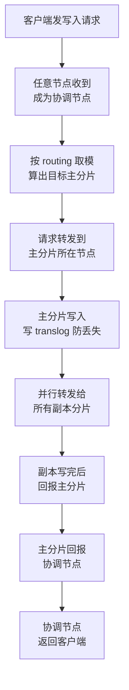
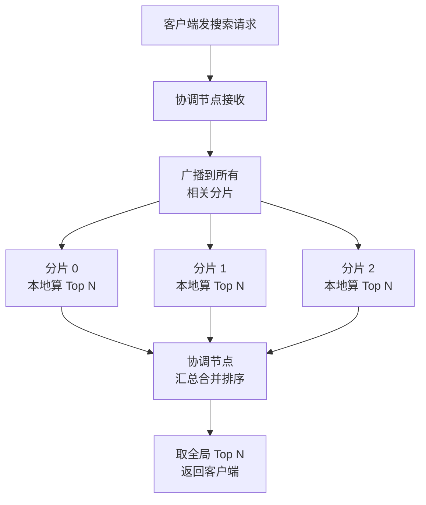

# 课 9：分片：ES 分布式的基石

> 阶段 4《分布式与工程实践》第 1 课
> 环境：本机 Elasticsearch **9.5.1**。本课额外搭建了一个 **3 节点集群**（端口 9201/9202/9203）用于真实验证分布式行为
> 数据集：`l9_orders`、`l9_hi`、`l9_trap2` 等（本课新建并实测）

---

## 开场：一个"装不下"的问题

前面八课，我们一直在一台机器、一个节点上玩 ES。你建的索引，跟我建的索引，本质上都是这个样子：

```
索引 l8_orders_v2  →  1 个主分片  →  放在唯一那个节点上
```

现在问一个问题：**如果这个索引有 500 GB，怎么办？**

三个答案摆在你面前：

1. **买更大的机器**——从 1 TB 硬盘换到 8 TB。能撑一阵，但总有上限，而且 8 TB 的机器贵得离谱。
2. **把数据分开放**——切成 5 份，每份 100 GB，放在 5 台机器上。
3. **不存这么多**——删数据。老板不同意。

ES 选了第 2 条。而"把数据切成几份"这件事，就是**分片（Shard）**。

但这里藏着一个会让无数新手踩坑的问题——**切几份，得在建索引的那一刻就决定，之后再也不能改**。

这不是 ES 故意为难你。这是分片的数学本质决定的。本课把这个"为什么改不了"讲透。

---

## 学习目标

| 学完你应该能 | 对应知识点 |
|---|---|
| 解释分片与副本的分工，说出副本数和分片数哪个能改 | 知识点 1 |
| 说清一条文档从写入到可搜索经历了什么，以及为什么"刚写入搜不到" | 知识点 2 |
| 解释 scatter-gather 读流程，并说明为什么多分片会让聚合产生误差 | 知识点 3 |
| **说出分片数为什么一旦设定就改不了**（本课重点） | 贯穿全课 |

---

## 预备：本课的 3 节点集群

单节点演示不了分布式。所以本课在本机搭了一个真集群（不是模拟、不是画图，是三个真进程）：

| 节点 | HTTP 端口 | Transport 端口 | 角色 |
|---|---|---|---|
| node-1 | 9201 | 9301 | master + data |
| node-2 | 9202 | 9302 | master + data |
| node-3 | 9203 | 9303 | master + data |

启动后验证：

```bash
curl.exe -s "http://localhost:9201/_cat/nodes?v"
```

实测输出：

```
ip        heap.percent ram.percent cpu load_1m load_5m load_15m node.role master name
127.0.0.1           16          71  20                          dim       -      node-3
127.0.0.1           32          71  20                          dim       *      node-1
127.0.0.1           15          71  20                          dim       -      node-2
```

注意 `master` 那一列的 `*`：它标出了**当前的主节点**是 node-1。

> **主节点（master）管什么？** 它管的是"集群层面的事"——创建删除索引、决定哪些分片放在哪个节点、监控节点是否存活。它**不处理你的搜索请求**。处理搜索的是数据节点（data）。这台机器上三个节点都是 `dim` 角色（d=data, i=ingest, m=master），所以既管集群又存数据。

集群健康：

```bash
curl.exe -s "http://localhost:9201/_cluster/health?pretty"
```

```
"status" : "green",
"number_of_nodes" : 3,
"number_of_data_nodes" : 3,
"unassigned_shards" : 0
```

**green** 表示所有主分片和副本分片都就位。

---

# 知识点 1：分片与副本机制

## 1.1 一个比喻：图书馆的分馆

把 ES 集群想象成一个图书馆系统：

| 图书馆 | Elasticsearch |
|---|---|
| **总馆藏 100 万册** | 索引里的全部文档 |
| **分成 5 个分馆，每馆 20 万册** | 索引分成 5 个**主分片** |
| **每个分馆的书另做一套备份，放别的城市** | 每个主分片有 1 个**副本分片** |
| **总馆管理员** | **主节点 master** |
| **读者查书时要问遍所有分馆** | **scatter-gather 读流程** |

这里有两个完全不同、但经常被混为一谈的概念：

**主分片（Primary Shard）**——解决的是**"装不下"**。把数据切开，横向扩展容量。

**副本分片（Replica Shard）**——解决的是**"挂了怎么办"**。它是主分片的完整拷贝，多存一份。

一句话区分：

> **主分片为容量，副本分片为高可用。**

## 1.2 结构图


*（图：3 个主分片按路由公式分散，各自带 1 个副本。图中分片承载条数、节点接管关系均来自本课实测。）*

## 1.3 建一个 3 主分片 + 1 副本的索引

```bash
curl.exe -s -XPUT "http://localhost:9201/l9_orders" -H "Content-Type: application/json" -d '{
  "settings": {
    "number_of_shards": 3,
    "number_of_replicas": 1
  },
  "mappings": {
    "properties": {
      "order_id": { "type": "keyword" },
      "brand":    { "type": "keyword" },
      "amount":   { "type": "double" }
    }
  }
}'
```

返回 `{"acknowledged":true,"shards_acknowledged":true,"index":"l9_orders"}`。

现在看这 6 个分片（3 主 + 3 副）落在哪：

```bash
curl.exe -s "http://localhost:9201/_cat/shards/l9_orders?v"
```

**实测输出**：

```
index     shard prirep state   docs store dataset ip        node
l9_orders 0     p      STARTED    0  227b    227b 127.0.0.1 node-2
l9_orders 0     r      STARTED    0  227b    227b 127.0.0.1 node-1
l9_orders 1     p      STARTED    0  227b    227b 127.0.0.1 node-3
l9_orders 1     r      STARTED    0  227b    227b 127.0.0.1 node-2
l9_orders 2     r      STARTED    0  227b    227b 127.0.0.1 node-3
l9_orders 2     p      STARTED    0  227b    227b 127.0.0.1 node-1
```

读这张表：`prirep` 列，`p` = 主分片，`r` = 副本分片。

关键观察：**分片 0 的主分片在 node-2，它的副本在 node-1**。没有任何一个分片的副本和它自己的主分片待在同一个节点。

为什么？因为副本的全部意义就是"主分片所在的那台机器炸了，数据还在"。如果副本和主分片同生共死，那它就没有存在价值。**ES 会强制把它们分开**——这是硬规则，不是建议。

> **⚠️ 你跑出来的节点名可能和我不一样**。分片的落点是 ES 根据当前集群状态动态算的，节点重启后还会重新均衡。我这边后来重跑一次，分片 2 就从 node-1 跑到了 node-3。
>
> **不要背这张表，要背这条规律**：主副本永不同节点、主分片尽量均摊。把上面的命令跑一遍，确认你自己环境里也满足这两条，就够了。

## 1.4 副本数能改，分片数不能改

这是本课最实用的一条结论。直接实测：

**改副本数**——成功：

```bash
curl.exe -s -XPUT "http://localhost:9201/l9_orders/_settings" -H "Content-Type: application/json" -d '{"number_of_replicas": 2}'
```

返回 `{"acknowledged":true}`。实测把副本数从 0 调到 1 再到 2，分片总数从 3 → 6 → 9，全程集群保持 green。

**改分片数**——失败：

```bash
curl.exe -s -XPUT "http://localhost:9201/l9_orders/_settings" -H "Content-Type: application/json" -d '{"number_of_shards": 5}'
```

**实测报错原文**：

```json
{"error":{"root_cause":[{"type":"illegal_argument_exception","reason":"Can't update non dynamic setting(s) [[index.number_of_shards]] for open indices [[l9_orders/q1pZ_oIZSQediCPcv5EQjg]]. The setting(s) [[index.number_of_shards]] cannot be modified on an index once it is created. You will need to create a new index with the desired setting(s) and reindex your data. See https://www.elastic.co/docs/api/doc/elasticsearch/operation/operation-reindex"}],"type":"illegal_argument_exception","reason":"Can't update non dynamic setting(s) [[index.number_of_shards]] for open indices ..."}}
```

错误信息里那句是关键：

> `cannot be modified on an index once it is created`

## 1.5 为什么分片数改不了？——路由公式

要理解这个限制，得先看 ES 怎么决定"一条文档存到哪个分片"。

公式只有一行：

```
shard_num = hash(routing) % number_of_shards
```

其中 `routing` 默认是文档的 `_id`。

这就是全部答案。**分片数是这个取模运算的除数**。你把除数从 3 改成 5，同一条文档的哈希值没变，但取模结果变了——它"应该"在的新位置和它现在待的老位置对不上。

举个具体例子。假设文档 `O001` 的哈希值是 17：

| 分片数 | 计算 | 落在 |
|---|---|---|
| 3 | 17 % 3 | **分片 2** |
| 5 | 17 % 5 | **分片 2** |
| 7 | 17 % 7 | **分片 3** |

改成分片数 5 时它侥幸还在分片 2，但改成 7 就跑到分片 3 去了。**ES 不可能为了改个数字，把几亿条文档全部重新搬一遍家**——所以干脆禁止。

> **那副本数为什么能改？** 因为副本只是主分片的拷贝，不参与路由计算。加一个副本，就是把已有数据复制一份到别处；减一个副本，就是删掉一份多余的拷贝。它不影响"文档该去哪"这个根本问题。

**如果真的需要改分片数怎么办？** 报错信息已经告诉你了：`create a new index with the desired setting(s) and reindex your data`——新建索引 + reindex 搬数据。这个操作课 11 会详细讲。

## 1.6 路由实测：让文档听你的话

默认的 `routing` 是 `_id`，但你可以自己指定。实测——连续写 5 条都指定 `routing=user1`：

```bash
curl.exe -s -XPOST "http://localhost:9201/l9_orders/_doc?routing=user1&refresh" -H "Content-Type: application/json" -d '{"order_id":"U1","brand":"华为","amount":100}'
```

然后逐分片统计这批文档（`preference=_shards:N` 表示"只查第 N 号分片"）：

```bash
curl.exe -s "http://localhost:9201/l9_orders/_search?preference=_shards:0&size=0" -H "Content-Type: application/json" -d '{"query":{"prefix":{"order_id":"U"}}}'
```

**实测结果**：

```
分片 0: 0 条
分片 1: 5 条
分片 2: 0 条
```

全部落在分片 1，一个都没跑偏。因为它们的 `routing` 相同 → 哈希值相同 → 取模结果相同。

> **上面的命令只写 1 条，怎么会有 5 条？** 因为这条写入命令我执行了 5 次（每次改一下 `order_id`）。你执行几次就是几条——**重点不是凑够 5 条，而是"无论写多少条，它们全在同一个分片"**。你写 3 条、跑一遍查询，看到 3 条全挤在一个分片、另外两个分片是 0，这个规律就验证成功了。

**这个特性有两个巨大用途：**

**用途一：让相关数据落在同一分片。** 比如一个用户的所有订单。查询时带上同样的 `routing`，ES 就只查那一个分片，不用 scatter-gather，速度快得多。

**用途二：加速聚合。** 数据预聚在同一个分片，聚合时不需要跨分片合并，精度也更高（这点在知识点 3 会看到）。

**代价是什么？** 数据倾斜。如果某个 `routing` 值特别热（比如某个大客户的订单占了 30%），那个分片就会特别大，成为热点，其他分片闲着。所以自定义 routing 要谨慎。

## 1.7 自然分布是不均衡的

如果不指定 routing，用默认的 `_id` 呢？我在建完索引后写入了 12 条订单，逐分片统计：

```
分片 0: 6 条
分片 1: 2 条
分片 2: 4 条
```

**6 / 2 / 4，完全不均衡。**

> **这个数字只是当时的快照**。后来我往同一个索引里又写了些测试文档（做 routing 实验、故障转移实验那些），再统计就变成了 8 / 8 / 4。所以**你跑出来的具体数字和我对不上是正常的**，只要确认"不均匀"这个事实就行。

这是哈希分布的正常现象——数据量越大越接近均匀，小数据集下偏斜是常态。这也解释了为什么**分片数的选择不能拍脑袋**：分片太少，单个分片太大；分片太多，每个分片只有零星几条，还要为它们付出额外的文件句柄和内存开销。

---

# 知识点 2：分布式写流程

## 2.1 一条文档的旅程

当你发出一个写入请求，背后发生了这些事：



几个关键点：

**协调节点（Coordinating Node）**——收到你请求的那个节点。它可能根本不存这条数据，但它负责"问对人、收齐答案、回给你"。任何节点都可以当协调节点。

**主分片先写，副本并行转发**——注意不是"主分片写完，再一个一个写副本"。主分片写完后会把请求**并行**发给所有副本，等它们都完成。

**translog**——写入时 ES 会先写一份事务日志。这是为了防止"刚写完、还没刷到磁盘、机器断电"导致数据丢失。文档进了 translog 就算安全了。

## 2.2 写入响应里的证据

写入时看响应体的 `_shards` 字段：

```bash
curl.exe -s -XPOST "http://localhost:9201/l9_orders/_doc?routing=wtest&refresh=true" -H "Content-Type: application/json" -d '{"brand":"写入测试","amount":999}'
```

**实测返回**：

```json
{
  "_index": "l9_orders",
  "_id": "HzYgV6ABXLYlc2oDKK_T",
  "result": "created",
  "_shards": { "total": 2, "successful": 2, "failed": 0 },
  "_seq_no": 7,
  "_primary_term": 1
}
```

重点看 `"_shards": {"total": 2, "successful": 2, "failed": 0}`。

这个 `total: 2` 是**主分片 1 个 + 副本 1 个**。`successful: 2` 表示两边都写成功了。

如果你的索引配了 1 副本，但某个副本所在的节点挂了，这个字段就会变成 `total:2, successful:1`——**写入依然会返回成功**。ES 认为主分片写成功就算数，副本的事后台慢慢补。

## 2.3 为什么刚写入搜不到？——refresh 机制

这是新手第二个必踩的坑。实测：

```bash
curl.exe -s -XPUT "http://localhost:9201/l9_nrt" -H "Content-Type: application/json" -d '{"settings":{"number_of_shards":2,"number_of_replicas":0}}'
curl.exe -s -XPOST "http://localhost:9201/l9_nrt/_doc/1" -H "Content-Type: application/json" -d '{"t":"first"}'
curl.exe -s "http://localhost:9201/l9_nrt/_count"
```

**实测结果**：

```
写入后立刻 count = 0
等 1.5 秒后 count = 1
用 refresh=true 写入后立刻 count = 2
```

写入的那一刻，`_count` 返回 **0**。等 1.5 秒后再查，变成 1。

原因：文档写入后，先进的是一个叫 **buffer** 的内存区域，此时它还不能被搜索。ES 每隔 1 秒（默认 `refresh_interval: 1s`）执行一次 **refresh**，把 buffer 里的东西刷成一个新的 **段（segment）**，这时候文档才变得可搜索。

这就是 ES 被称为**近实时（Near Real-Time, NRT）**而非"实时"的原因——**默认有最多 1 秒的延迟**。

三条应对方式：

| 方式 | 写法 | 代价 |
|---|---|---|
| 等 | 什么都不做，最多等 1 秒 | 无 |
| 强制立刻刷新 | 请求加 `?refresh=true` | **别在生产批量写入时用**，每次刷新都生成新段，段多了要合并，严重影响性能 |
| 刷新整个索引 | `POST /索引名/_refresh` | 同上，适合脚本里一次性调用 |

> **呼应课 4**：那里讲过"段（segment）"是 Lucene 的不可变文件单位。当时留了个伏笔"分片归课 9 讲"——现在补上：**一个分片内部，就是由若干个段组成的**。refresh 产生新段，后台的 merge 把小段合并成大段。

## 2.4 translog：断电保护

既然文档在 buffer 里还没刷盘，那机器突然断电怎么办？

答案是 **translog**（事务日志）。每次写入，ES 除了写 buffer，还会往 translog 里追加一条记录。translog 是**落盘的**，所以即使内存数据全丢，重启后也能从 translog 恢复。

实测查看：

```bash
curl.exe -s "http://localhost:9201/l9_orders/_stats?level=shards" | grep -o '"translog":{[^}]*}'
```

**实测输出**（l9_orders 索引）：

```
translog 操作数: 2
translog 大小: 520 bytes
```

当 translog 攒到一定大小或时间，ES 会执行一次 **flush**：把内存里的段真正刷到磁盘，然后清空 translog。

**一句话记住写入三兄弟**：

> **buffer** 负责"暂时存着让你可以搜"（refresh 后），**translog** 负责"防止断电丢失"，**segment** 是最终落盘的不可变文件。

---

# 知识点 3：分布式读流程

## 3.1 scatter-gather：分散收集

搜索的过程和写入完全不同。写是"精准投送到某一个分片"，读是"问遍所有分片"。



这个名字很形象：**scatter（散开去问）+ gather（收拢答案）**。

关键点：**每个分片只返回自己认为最好的前 N 条，不是全部**。协调节点拿到这些局部结果后再排序，取全局前 N 条。

注意这里 N 的含义：如果客户端要 `from=0&size=10`，那么每个分片要返回自己的前 `from+size=10` 条，协调节点从 `3×10=30` 条里挑出全局前 10。

## 3.2 可以用 _search_shards 看到查询会打哪些分片

```bash
curl.exe -s "http://localhost:9201/l9_orders/_search_shards?pretty"
```

这个 API 会返回：查询会涉及哪些节点、哪些分片、每个分片的主副本情况。实测返回了 3 个节点的信息和 3 组分片（每组含 1 主 1 副）。

调试"为什么这条查询慢"时，这个 API 能告诉你查询到底铺开了多大的面。

## 3.3 副本在读流程中的作用：负载均衡

读请求打到协调节点后，协调节点要在"分片 0 的主分片"和"分片 0 的副本"之间选一个。

**副本不只是备份，它还承担读流量。**

默认情况下，ES 会在同一分片的主副本之间轮转，把读请求分散开。这就是为什么加副本能提升**查询吞吐**——3 个副本意味着 4 份数据可以同时响应查询。

> **这也解释了一个反直觉的现象**：加副本既提高了可用性，也提高了查询性能（吞吐），但**不提高单条查询的速度**。单条查询仍然只打到一个分片上，耗时不变。

## 3.4 本课最硬的一块：多分片会让聚合产生误差

这是课 8 留下的伏笔。当时我们看到 `doc_count_error_upper_bound` 这个字段，说"它 >0 就是漏桶信号"，但没解释**为什么单分片时它恒为 0**。

现在可以正面回答了。

**问题根源**：scatter-gather 里每个分片只返回自己的 Top N，协调节点拿着这些局部 Top N 拼出全局 Top N。但**某个词可能在每个分片里都排不进前 N，加起来总数却很可观**——它就会被漏掉。

### 实测：先构造一个"抓得住"的场景

建一个 3 分片索引，写入 30 条（苹果 12 / 华为 10 / 小米 8）：

```bash
curl.exe -s -XPUT "http://localhost:9201/l9_agg" -H "Content-Type: application/json" -d '{
  "settings": {"number_of_shards": 3, "number_of_replicas": 0},
  "mappings": {"properties": {"brand": {"type": "keyword"}, "amount": {"type": "double"}}}
}'
```

逐个分片看它们的**局部品牌分布**（`preference=_shards:N`）：

```bash
curl.exe -s "http://localhost:9201/l9_agg/_search?preference=_shards:0&size=0" -H "Content-Type: application/json" -d '{"aggs":{"b":{"terms":{"field":"brand"}}}}'
```

**实测输出**：

```
分片 0: 苹果 5, 小米 3, 华为 1
分片 1: 华为 5, 苹果 3, 小米 1
分片 2: 华为 4, 小米 4, 苹果 4
```

注意**每个分片内的品牌排名都不一样**。分片 0 里苹果第一，分片 1 里华为第一，分片 2 里华为和小米并列。

然后查全局 Top 2：

```bash
curl.exe -s "http://localhost:9201/l9_agg/_search?size=0" -H "Content-Type: application/json" -d '{"aggs":{"b":{"terms":{"field":"brand","size":2}}}}'
```

**实测结果**：

```json
{"doc_count_error_upper_bound": 0, "buckets":[{"key":"苹果","doc_count":12},{"key":"华为","doc_count":10}]}
```

误差是 **0**，结果也正确（苹果 12、华为 10，与真实值一致）。

为什么没误差？因为**品牌只有 3 个**，而默认的候选窗口（`shard_size`，默认约 `size × 1.5 + 10`）远大于 3——每个分片都把自己全部 3 个品牌报上去了，没有遗漏。

**要看到误差，得把基数撑大。**

### 决定性实测：1245 条、1200+ 个品牌

构造这个数据集：3 个目标品牌 `PPP`/`QQQ`/`RRR`，每个分片各放 5 条（总数各 15 条）；再给每个分片塞 400 个**只出现 1 次**的噪声品牌。

这样，`PPP` 在每个分片里都是"5 条"，与几百个 1 条的品牌并列——但它的**总数 15 应该排全局第一**。

查全局 Top 10（默认 `shard_size`）：

```bash
curl.exe -s "http://localhost:9201/l9_trap2/_search?size=0" -H "Content-Type: application/json" -d '{"aggs":{"b":{"terms":{"field":"brand","size":10}}}}'
```

**实测结果**：

```json
{
  "doc_count_error_upper_bound": 3,
  "sum_other_doc_count": 1193,
  "buckets":[
    {"key":"PPP","doc_count":15},
    {"key":"QQQ","doc_count":15},
    {"key":"RRR","doc_count":15},
    {"key":"noise_k0_000","doc_count":1},
    ...
  ]
}
```

**`doc_count_error_upper_bound = 3`** —— 误差出现了。ES 在明明白白地告诉你：**"返回的这些桶，计数最多可能差 3。"**

再拿真实答案对照（`size=2000` + `shard_size=5000`）：

```json
{"doc_count_error_upper_bound": 0, "buckets":[{"key":"PPP","doc_count":15},{"key":"QQQ","doc_count":15},{"key":"RRR","doc_count":15}, ...]}
```

这个例子里前 3 名的计数恰好是对的，但**误差值 3 说明其他桶的计数可能被低估**。ES 给的是上界——它在说"我不保证后面那些计数准确"。

### 调大 shard_size 能救回来

实测不同 `shard_size` 下的误差：

| shard_size | doc_count_error_upper_bound |
|---|---|
| 25（默认附近） | **3** |
| 50 | **3** |
| 100 | **3** |
| 500 | **0** |
| 1000 | **0** |

**结论**：`shard_size` 调到 500 时误差归零。代价是更多的数据在网络上传输、协调节点要处理更多候选桶，所以更慢。**这是精度与性能的权衡**。

### 单分片对照组

同样的数据放在 **1 个分片**里，再查 Top 10：

```
单分片 error = 0
前3: PPP=15, QQQ=15, RRR=15
```

**误差恒为 0。**

这就是课 8 那个伏笔的答案：

> **单分片时 `doc_count_error_upper_bound` 恒为 0，因为没有跨分片合并，协调节点看到的就是完整数据，不存在"某个桶被漏报"的可能。**

### 三条实用建议

1. **看到 `doc_count_error_upper_bound > 0` 就要警惕**——说明这个聚合结果不可全信，尤其不要拿去做对账、结算。
2. **要精确结果就调大 `shard_size`**——`"terms": {"field": "brand", "size": 10, "shard_size": 500}`。
3. **或者降低分片数**——分片越少，需要合并的局部结果越少，精度越高。这也是"分片不是越多越好"的又一个理由。

## 3.5 副本的终极价值：故障转移

讲了这么多副本，它到底能不能在节点挂掉时救场？直接实测。

**先记录停手前的基线**：3 节点、green、30 个主分片、0 个未分配。

然后**直接杀掉 node-3 的进程**。等待 25 秒后查看：

```
status=red  nodes=2  active_primary=23  unassigned=13
unassigned_primary_shards = 7
```

**逐个索引看健康色**——这是最有信息量的一张表：

| 索引 | 副本数 | 停 node-3 后 |
|---|---|---|
| `l9_orders` | rep=1 | **yellow** |
| `l9_rep1` | rep=1 | **yellow** |
| `l9_hi` | rep=0 | **red** |
| `l9_trap2` | rep=0 | **red** |
| `l9_agg`、`l9_trap`、`l9_nrt`、`l9_rep0`、`l9_audit_nrt` | rep=0 | **red** |

**这张表把 red 和 yellow 的区别说得清清楚楚：**

- **有副本的索引 → yellow**。主分片由副本接管，数据一点没丢，只是副本暂时没地方放。
- **0 副本的索引 → red**。它们的主分片就在 node-3 上，node-3 一挂，**没有任何副本能顶上**，这部分数据真的读不到了。

`unassigned_primary_shards = 7` 就是这 7 个"随 node-3 一起消失、且无副本可替"的主分片。

再看数据本身：

- `l9_orders`（有副本）：查询照常，22 条文档一条不少，之前写的 `HA-TEST` 存活标记照样能搜到，写入也照常返回 `successful shards=2/2`。
- `l9_hi`（0 副本）：分片 2 跟着 node-3 走了，查这个索引会缺数据。

**结论**：副本不是"锦上添花"，它是**数据安全的唯一保障**。0 副本的索引在节点故障时就是裸奔。

> **一句话记住**：**yellow = 数据都在，只是副本没地方放**；**red = 有数据真的读不到了**。

重启 node-3 后，集群**自动恢复**，全部索引回到 green，未分配分片归零。这中间不需要任何人工干预。

重启 node-3 后，集群**自动恢复 green**，分片重新变成 3 主 + 3 副：

```
集群状态: green   节点数: 3   未分配分片: 0
```

---

# 本课总结

## 三句话

1. **主分片为容量，副本分片为高可用**——副本数可以随时改，分片数一旦设定就改不了
2. **分片数改不了是因为路由公式**——`shard = hash(routing) % 分片数`，改除数等于让所有文档搬家
3. **读是 scatter-gather，写是主分片优先**——多分片带来并行能力，也带来聚合误差

## 本课七个实测踩坑

| # | 坑 | 报错原文 / 现象 | 正确做法 |
|---|---|---|---|
| 1 | **想改分片数** | `cannot be modified on an index once it is created` | 新建索引 + reindex（课 11） |
| 2 | **刚写入搜不到** | 写入后立刻 `_count` 返回 0 | 等 1 秒，或用 `?refresh=true`（批量写入别用） |
| 3 | **多分片聚合不准** | `doc_count_error_upper_bound = 3` | 调大 `shard_size`，或减少分片数 |
| 4 | **单节点集群永远 yellow** | `last_allocation_status: no_attempt` | 见下方辨析，别盲目设 0 副本 |
| 5 | **自定义 routing 导致数据倾斜** | 某分片特别大 | 只在确需"相关数据同分片"时用 |
| 6 | **误以为副本能加速单条查询** | 单条耗时不变 | 副本提升的是**吞吐**，不是延迟 |
| 7 | **为消掉 yellow 把副本设成 0** | 节点一挂该索引直接 red，数据真丢 | 学习环境可设 0；**生产环境必须 ≥1** |

### 关于第 4 条与第 7 条：别把"消掉 yellow"当成目标

这两条看起来打架，其实说的是两回事，务必分清：

- **单节点集群**（本课之外你原来的 9200 环境）：只有 1 台机器，副本注定无处安放，yellow 是**物理上的必然**。这时设 `"number_of_replicas": 0` 是对的——反正也放不下，不如让它 green 看着舒服。
- **多节点集群**：副本放得下，就**一定要留着**。本课 3.5 节那张对照表就是铁证——停掉 node-3 后，设了 0 副本的 7 个索引全部变 red，数据真的读不到；而有副本的 `l9_orders` 只是 yellow，22 条数据一条没丢。

> **yellow 不是故障，red 才是。** 为了把 yellow 变成 green 而砍掉副本，等于为了不看见火灾警报器闪烁而把电池拆了。

## 呼应前序课程

| 本课内容 | 呼应 |
|---|---|
| 分片由段组成 | **课 4 段（segment）**：当时留的伏笔"分片归课 9" |
| 聚合误差 | **课 8 `doc_count_error_upper_bound`**：正面回答为何单分片恒为 0 |
| 索引级别设置 | **课 5 映射**：`settings` 管分片，`mappings` 管字段 |
| 副本与主分片不共处 | **课 3 单节点 yellow**：当时只知道现象，现在知道原因 |
| 分片内数据分布 | **课 6/7 查询**：所有查询最终都落到具体分片上执行 |

## 速查卡

```jsonc
// 建索引：分片与副本
PUT /my_index
{
  "settings": {
    "number_of_shards": 3,      // ⚠️ 建了就不能改
    "number_of_replicas": 1     // ✅ 随时能改
  }
}

// 改副本数（能改）
PUT /my_index/_settings
{ "number_of_replicas": 2 }

// 精确聚合（调大候选窗口）
GET /my_index/_search
{ "size": 0,
  "aggs": { "b": { "terms": {
    "field": "brand",
    "size": 10,
    "shard_size": 500      // 默认约 size*1.5+10，精度不够就调大
  }}}}

// 指定路由（相关数据同分片）
POST /my_index/_doc?routing=user1
{ "user": "user1", "amount": 100 }

// 查指定分片（调试用）
GET /my_index/_search?preference=_shards:0
```

```bash
# 观察集群的常用 _cat API
curl.exe -s "http://localhost:9201/_cat/nodes?v"        # 节点列表，* 标出主节点
curl.exe -s "http://localhost:9201/_cat/shards?v"       # 分片分布，p/r 区分主副本
curl.exe -s "http://localhost:9201/_cat/health?v"       # 集群健康
curl.exe -s "http://localhost:9201/_cat/allocation?v"   # 各节点分片数与磁盘
curl.exe -s "http://localhost:9201/_cat/recovery?v"     # 分片恢复进度
```

## 分片数怎么定？三条经验法则

1. **单个分片控制在 20–50 GB**（日志类可放宽到 100 GB）。太大则迁移、恢复都慢；太小则分片数膨胀。
2. **分片数 ≈ 数据节点数 × 1~3**。3 个节点起步给 3 个主分片，留出扩容空间。
3. **宁少勿多**。分片少了可以靠 reindex 重建，分片多了每个分片都在消耗文件句柄和堆内存。

---

## 下一课预告

本课知道了数据怎么分散、怎么写入、怎么读取、副本怎么救场。顺带还把 red 与 yellow 的区别给测明白了——停 node-3 后，有副本的索引转 yellow、0 副本的索引转 red，这个对照比任何定义都直观。

但还有几个"出问题怎么办"的问题没解决：

- **课 10《集群健康与排障》**：red/yellow/green 的完整判定规则是什么？节点挂掉到分片恢复之间，集群内部依次发生了哪些事（本课只看了结果）？分片怎么规划容量？`_cluster/allocation/explain` 怎么用来定位"这个分片为什么分配不出去"？

**留给课 10 的具体问题**：本课把 node-3 重启后，那 7 个无副本的主分片自己就回来了，集群回到 green——**它们是怎么回来的？如果 node-3 永远回不来，这些数据是不是就彻底丢了？** 这正是故障转移机制的核心。

### 伏笔表

| 本课留下的疑问 | 在哪一课解开 |
|---|---|
| 停掉节点后，有副本的索引为什么是 yellow 而不是 red？ | **本课已答**（见 3.5 节对照表）；课 10 展开完整判定规则 |
| 那些 0 副本索引的主分片，node-3 重启后是怎么回来的？ | **课 10：故障转移** |
| `_cluster/allocation/explain` 怎么用来定位"分片为什么分配不出去"？ | **课 10：诊断与修片** |
| 分片数定错了，reindex 具体怎么操作？ | **课 11：Reindex** |
| `translog` 的 flush 阈值怎么配？ | **阶段 5：生产调优** |
| 分片数与堆内存的关系（为什么要控制在 20-50 GB）？ | **阶段 5：容量规划** |

---

## 🚀 下一批接力提示词

> 学完本课后，**复制下面这段文字发给 AI**，即可无缝进入下一课（无需重新描述上下文）：

```
继续学 Elasticsearch。我的学习档案在 elasticsearch/00-学习档案.md，
刚学完阶段 4《分布式与工程实践》课 9《分片：ES 分布式的基石》的三个知识点
（分片与副本机制 / 分布式写流程 / 分布式读流程）。

本机环境：
- 原有单节点 ES 9.5.1 在 https://localhost:9200（elastic/ESlearn2026，IK 9.5.1 已装）
- 本课新建的 3 节点学习集群在 http://localhost:9201（node-1/9201, node-2/9202, node-3/9203，
  cluster.name=l9-cluster，已关闭安全，数据在 playground/l9-cluster/）
- 实测索引：l9_orders（3主1副）、l9_trap2（1245条高基数，用于演示聚合误差）、
  l9_agg（30条）、l9_hi（300条）
- 已实测结论：
  · 分片数改不了（报错 cannot be modified on an index once it is created）
  · 副本数可动态改（0->1->2，分片总数 3->6->9）
  · 多分片聚合 doc_count_error_upper_bound 可达 3（l9_trap2，调大 shard_size 到 500 归零）
  · 单分片对照组该值恒为 0（课 8 伏笔已正面回答）
  · 停 node-3 后：有副本的索引转 yellow 且数据零丢失；0 副本的索引转 red
    （unassigned_primary_shards=7），这是 red 与 yellow 的决定性对照

请按大纲继续讲解课 10《集群健康与排障》的三个知识点：
集群健康与故障转移 / 分片设计与容量规划 / 诊断与修片。
重点讲清 node-3 重启后那 7 个无副本主分片是怎么恢复的，
以及 _cluster/allocation/explain 在排查"分片分配不出去"时怎么用。
```

## 🧭 课程导航

- **上一课**：[课 8 · 聚合：不做搜索，做统计](../../3-查询与聚合/lessons/lesson-08-聚合不做搜索做统计.md)（阶段 3 收官）
- **下一课**：课 10 · 集群健康与排障（阶段 4）
- **本阶段**：[阶段 4 概览](../overview.md)
- **返回**：[课程总览](../../01-学习路径总览.md)
