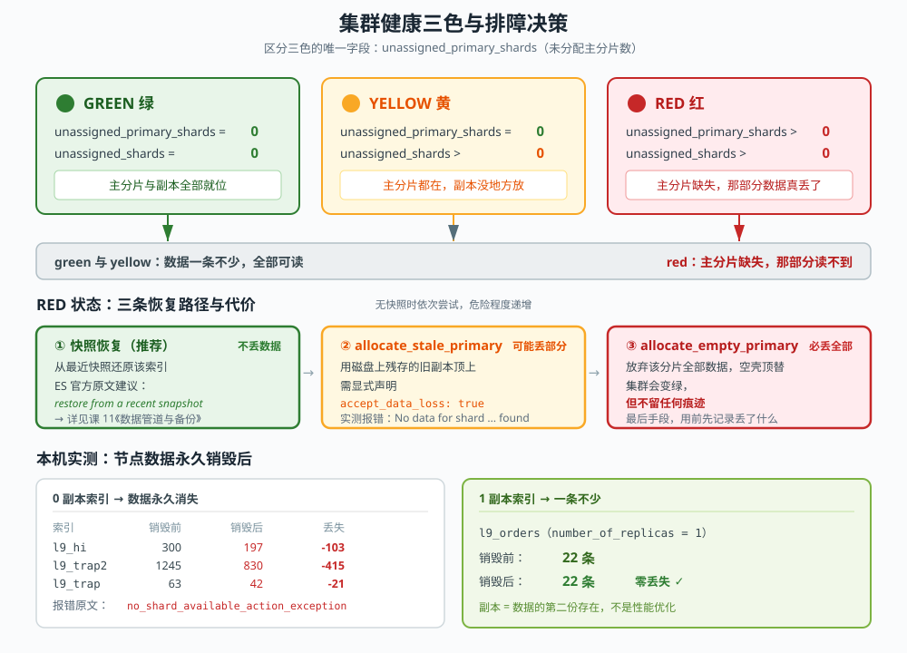
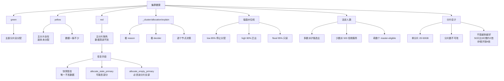

# 课 10：集群健康与排障

> **一句话概括**：green 不等于没问题，red 不等于世界末日——但你要能在三分钟内说出区别在哪、该动哪根手指。

---

## 第一幕：场景引入——凌晨三点的报警

你是某电商的搜索工程师。凌晨三点，手机响了。

监控面板上只有一个词在闪：

```
cluster health: RED
```

你的第一反应是什么？

大部分人的第一反应是"完了，数据丢了"。然后第二反应是打开浏览器搜"Elasticsearch red 怎么修"，照着某篇博客敲一条 `curl -XPOST ...allocate_empty_primary...`，集群变绿了，松了口气，睡觉。

**一个月后，运营在后台导出报表，发现某个月的销售数据对不上。**

这个场景里藏着本课要回答的三个问题：

1. red 到底意味着什么？是所有数据都丢了，还是只丢了一部分？
2. 那篇博客教你的 `allocate_empty_primary` 干了什么？为什么它是"最后手段"？
3. 为什么集群变绿了，数据却还是少的？

---

## 第二幕：认知冲突——三个"想当然"

在动手之前，先把三个最常见的误解摆到桌面上。**这三个误解每一个都可能导致你在真实事故中做出错误决策。**

### 误解一："green = 没问题，red = 数据全丢了"

这是最危险的一个。真相是：

> **green 只表示"分片都分配好了"，不表示"数据是对的"。**
> **red 只表示"有主分片读不到"，不表示"所有数据都没了"。**

本课会用一个真实实验证明：一个集群可以在 green 状态下，安安静静地少掉 415 条文档，而 `_cat/indices` 显示的那个 `docs.count` 数字，会**悄悄变小**——没有任何报错。

反过来，red 状态下，有副本的索引可能一条数据都没丢，只是副本暂时没地方放。

### 误解二："yellow 是故障，得赶紧修"

yellow 的确切含义是：**所有主分片都在，但有副本没分配**。

它可能是故障（节点刚挂），也可能完全正常（你就是单节点跑，副本没地方放）。课 3 你已经见过后者——单节点集群建索引默认 1 副本，必然 yellow。

**yellow 的正确反应是先问"这是不是预期内的"，而不是立刻动手。**

### 误解三："节点挂了数据会自己回来"

这是课 9 留给本课的最大悬念。课 9 我们停掉 node-3，看到 7 个 0 副本主分片变 red，重启 node-3 后集群自动回 green。当时我写了一句"节点恢复后集群自动 green"。

**但那是因为 node-3 的数据盘还在。**

如果 node-3 是物理机，硬盘真的坏了呢？那 7 个分片能不能回来？

本课会真的把 node-3 的数据目录删掉，然后重启，看会发生什么。剧透：**回不来。**

---

## 第三幕：层层揭示

> ### ⚠️ 关于本课的命令行写法（务必先读这一段）
>
> 课 3 定的规矩是"按 Git Bash 写法给示例"。但**本机实测发现这台机器没装 Git Bash**
> （`C:\Program Files\Git\bin\bash.exe` 等三个常见路径都不存在；PATH 里的 `bash.exe`
> 是 `C:\Windows\system32\bash.exe`，即 WSL 启动器，调用无响应）。
>
> 而 **Windows 的 `curl.exe` 在 PowerShell 下会吃掉 `-d` 后面 JSON 里的双引号**：
>
> ```powershell
> # 这在 PowerShell 下会失败
> curl.exe -d '{"index.number_of_replicas": 3}'
> # ES 实际收到的是：{index.number_of_replicas: 3}
> # 报错：was expecting double-quote to start field name
> ```
>
> 实测四种写法，只有**一种**在 PowerShell 下可靠：
>
> | 写法 | PowerShell | CMD |
> |------|-----------|-----|
> | `-d '{"key": 1}'`（Git Bash 风格单引号） | ❌ 失败 | ❌ 失败 |
> | `-d "{`"key`": 1}"`（PowerShell 反引号转义） | ❌ 失败 | — |
> | `-d "{\"key\": 1}"`（**CMD 反斜杠转义**） | ❌ 失败 | ✅ **成功** |
> | `--data-binary @文件.json` | ✅ **成功** | ✅ **成功** |
>
> **所以本课的 JSON 命令统一给出两种写法**：
> 1. **CMD 写法**：`cmd /c 'curl.exe ... -d "{\"key\": 1}"'` —— 适用于 CMD 和大部分终端
> 2. **文件写法**：把 JSON 存成文件，用 `--data-binary @文件路径` —— **最保险，推荐**
>
> 如果你用的是 PowerShell，请**直接用文件写法**。真实排障时也是文件写法更稳妥——命令可以反复执行、可以进版本管理。

### 3.1 集群健康三色：精确定义

先看一眼健康接口返回什么：

```bash
curl.exe -s 'http://localhost:9201/_cluster/health?pretty'
```

返回（本机 3 节点集群实测，green 状态）：

```json
{
  "cluster_name" : "l9-cluster",
  "status" : "green",
  "number_of_nodes" : 3,
  "active_primary_shards" : 30,
  "active_shards" : 38,
  "unassigned_shards" : 0,
  "unassigned_primary_shards" : 0,
  "active_shards_percent_as_number" : 100.0
}
```

三个颜色由**两个字段**决定，这是全课的地基：

| 状态 | `unassigned_primary_shards` | `unassigned_shards`（含副本） | 数据可读性 |
|------|------------------------------|-------------------------------|------------|
| **green** | 0 | 0 | 全部可读 |
| **yellow** | **0** | > 0 | **主分片全在，数据全可读** |
| **red** | **> 0** | > 0 | **有主分片读不到，部分数据真的丢了** |

**关键区分点在 `unassigned_primary_shards`，而不是颜色本身。**

- yellow 与 green 的区别：只差副本，**数据一个字节都不少**
- red 与 yellow 的区别：主分片缺失，**那部分数据真的读不到**

> **类比**：把索引想成一本书，主分片是正文，副本是影印本。
> green = 正文和影印本都在书架上；
> yellow = 正文在，有几页影印本没地方放；
> red = **有几页正文不见了**，这本书读不全。

#### 实测：亲手造一个 yellow

**CMD 写法**：

```cmd
curl.exe -s -X PUT "http://localhost:9201/l9_orders/_settings" ^
  -H "Content-Type: application/json" ^
  -d "{\"index.number_of_replicas\": 3}"
```

**文件写法（推荐）**——把下面内容存成 `rep3.json`：

```json
{ "index.number_of_replicas": 3 }
```

然后执行：

```bash
curl.exe -s -X PUT 'http://localhost:9201/l9_orders/_settings' \
  -H 'Content-Type: application/json' \
  --data-binary @rep3.json
```

再查健康：

```bash
curl.exe -s 'http://localhost:9201/_cluster/health?pretty'
```

实测返回（本机 3 节点集群，84 个主分片）：

```json
{
  "status" : "yellow",
  "number_of_nodes" : 3,
  "active_primary_shards" : 84,
  "unassigned_shards" : 3,
  "unassigned_primary_shards" : 0,
  "delayed_unassigned_shards" : 0
}
```

> ⚠️ **主分片数是 84 而不是课 9 那会儿的 30**，因为本课又新建了 `l10_shard_1/3/50`（共 54 个分片）等实验索引。
> **你看到的具体数字会和这里不同，关键是看 `unassigned_primary_shards` 是否为 0。**

实验完记得改回去：

```json
{ "index.number_of_replicas": 1 }
```

```bash
curl.exe -s -X PUT 'http://localhost:9201/l9_orders/_settings' \
  -H 'Content-Type: application/json' \
  --data-binary @rep1.json
```

---

上面这张表是全课的地基。为了把它刻进脑子里，这里给一张全景图：



**图的核心**：三色的分界线不在"颜色"，而在 `unassigned_primary_shards` 这个字段——green 和 yellow 在这一列上**都是 0**，意味着数据都还在；只有 red 这一列大于 0，数据才真的丢了。图下半部分的实测对照，是同一台机器上真实销毁节点数据后的结果。

---

### 3.2 排障第一刀：`_cluster/allocation/explain`

**这是本课最重要的一个 API。** 遇到未分配分片，第一件事就是问它。

不带参数调用（它会随机挑一个未分配的分片解释）：

```bash
curl.exe -s 'http://localhost:9201/_cluster/allocation/explain?pretty'
```

也可以精确指定要看哪个分片：

```bash
curl.exe -s 'http://localhost:9201/_cluster/allocation/explain?pretty' \
  -H 'Content-Type: application/json' \
  --data-binary @explain.json
```

`explain.json` 的内容：

```json
{ "index": "l9_orders", "shard": 0, "primary": false }
```

CMD 写法（等价）：

```cmd
curl.exe -s "http://localhost:9201/_cluster/allocation/explain?pretty" -H "Content-Type: application/json" -d "{\"index\":\"l9_orders\",\"shard\":0,\"primary\":false}"
```

> **集群当前没有未分配分片时的提示**：
> 如果集群是 green，裸调会返回 `"There are no unassigned shards in this cluster. Specify an assigned shard in the request body to explain its allocation."`
> 这不是报错，只是告诉你"现在没事"。想看具体分片的分配理由，就指定 `index`/`shard`/`primary`。

上面那个 yellow 场景，它返回了这样的内容（节选）：

```json
{
  "index" : "l9_orders",
  "shard" : 0,
  "primary" : false,
  "current_state" : "unassigned",
  "unassigned_info" : {
    "reason" : "REPLICA_ADDED",
    "last_allocation_status" : "no_attempt"
  },
  "can_allocate" : "no",
  "allocate_explanation" : "Elasticsearch isn't allowed to allocate this shard to any of the nodes in the cluster...",
  "node_allocation_decisions" : [
    {
      "node_name" : "node-1",
      "node_decision" : "no",
      "deciders" : [
        {
          "decider" : "same_shard",
          "decision" : "NO",
          "explanation" : "a copy of this shard is already allocated to this node [[l9_orders][0], node[...], [R], s[STARTED]...]"
        }
      ]
    },
    {
      "node_name" : "node-2",
      "node_decision" : "no",
      "deciders" : [
        {
          "decider" : "same_shard",
          "decision" : "NO",
          "explanation" : "a copy of this shard is already allocated to this node [[l9_orders][0], node[...], [P], s[STARTED]...]"
        }
      ]
    }
  ]
}
```

**怎么读这份报告**（四步法）：

1. **`current_state`**：分片现在什么状态（`unassigned`）
2. **`unassigned_info.reason`**：为什么变成未分配（`REPLICA_ADDED` = 你刚加的副本；`NODE_LEFT` = 节点走了；`INDEX_CREATED` = 索引刚建）
3. **`can_allocate`**：能不能分配（`no` / `no_valid_shard_copy` / `throttled` 等）
4. **`node_allocation_decisions`**：**逐个节点**说明为什么不行，关键是 `decider` 和它的 `explanation`

这份报告里的 `same_shard` 叫**决策器（decider）**。ES 有一堆决策器，每个负责一项规则。常见的几个：

| 决策器 | 管什么 | 典型报错 |
|--------|--------|----------|
| `same_shard` | 主副本不同节点 | 副本数 ≥ 节点数时最常见 |
| `disk_threshold` | 磁盘水位线 | 磁盘快满，分片不往这放 |
| `awareness` | 机架/可用区感知 | 配置了机架感知但节点不够 |
| `filter` | 手工排除节点 | 有人配了 allocation filter |
| `throttling` | 恢复速率限流 | 分片在排队，等一等就好 |

> **排障口诀**：看到未分配分片，先 `explain`，看 `decider`，decider 告诉你该加节点、清磁盘，还是改配置。

---

### 3.3 磁盘水位线：生产环境 yellow 的头号元凶

ES 会盯着每个数据节点的磁盘，磁盘快满时主动**拒绝往这个节点分配分片**，甚至把已有分片迁走。

三个阈值（ES 9.5.1 默认值，本机实测）：

```bash
curl.exe -s 'http://localhost:9201/_cluster/settings?include_defaults=true&pretty'
```

```json
"watermark" : {
  "low" : "85%",
  "high" : "90%",
  "flood_stage" : "95%",
  "low.max_headroom" : "200GB",
  "high.max_headroom" : "150GB",
  "flood_stage.max_headroom" : "100GB"
}
```

**三个水位线各做什么**：

| 水位线 | 默认 | 触发后 |
|--------|------|--------|
| `low` | 85% | **不再往这个节点分配新分片** |
| `high` | 90% | **把这个节点上的分片往其他节点迁** |
| `flood_stage` | 95% | **把该节点上的索引设为只读**（`read_only_allow_delete`） |

> **类比**：水库的三个水位——85% 停止进水，90% 开闸放水，95% 强制封库。

**`flood_stage` 是最危险的**：索引被设成只读后，**写入全部失败**，而且这个标记**不会自动解除**。磁盘清理后需要你手动执行：

```bash
curl.exe -s -X PUT 'http://localhost:9201/受影响索引名/_settings' \
  -H 'Content-Type: application/json' \
  --data-binary @unlock.json
```

`unlock.json` 的内容：

```json
{ "index.blocks.read_only_allow_delete": null }
```

CMD 写法（等价）：

```cmd
curl.exe -s -X PUT "http://localhost:9201/受影响索引名/_settings" -H "Content-Type: application/json" -d "{\"index.blocks.read_only_allow_delete\": null}"
```

注意值是 `null`——**不是 `false`**。传 `null` 表示"删除这个设置"，传 `false` 只是把它设成 false，效果不同。

> **新手最常见的踩坑**：磁盘满了 → 清了磁盘 → 写入还是失败 → 不知道要手动解锁。
> **记住：清完磁盘还要手动摘掉只读标记。**

#### 为什么还有 `max_headroom`？

你可能注意到了 `low.max_headroom: 200GB`。这是因为**百分比在大磁盘上会失真**。

一块 10TB 的盘，85% 是 8.5TB，**还剩 1.5TB**——明明很宽裕，却触发了水位线。所以 ES 同时看绝对值：`max_headroom` 的意思是"剩余空间少于这个值才算超标"。

实际生效的规则是**两者取更严格者**：百分比超了，或剩余空间低于 headroom，都算触发。

---

### 3.4 悬念揭晓：节点永久损毁，数据回得来吗

这是本课最硬的一战。课 9 我们停 node-3，重启，集群自动 green。现在换个剧本：**node-3 的硬盘烧了。**

#### 实验设计

我们在 3 节点学习集群上操作。先记录基线：

```bash
curl.exe -s 'http://localhost:9201/_cat/shards?v&h=index,shard,prirep,state,docs,node' | Select-String 'node-3'
# Linux / Mac 用：| grep node-3
```

node-3 上承载的分片（实测）：

| 索引 | 分片 | 主/副 | 文档数 | 副本数 |
|------|------|-------|--------|--------|
| `l9_trap2` | 2 | **p** | 415 | 0 |
| `l9_hi` | 2 | **p** | 103 | 0 |
| `l9_trap` | 2 | **p** | 21 | 0 |
| `l9_agg` | 2 | **p** | 12 | 0 |
| `l9_nrt` | 1 | **p** | 2 | 0 |
| `l9_rep0` | 0 | **p** | 0 | 0 |
| `l9_audit_nrt` | 0 | **p** | 0 | 0 |
| `l9_orders` | 1,2 | **p** | 9, 5 | **1** |
| `l9_rep1` | 0,2 | r | 0, 0 | 1 |

**注意前 7 行：都是主分片（p），且副本数 = 0。** 这 7 个分片的数据**只存在于 node-3 这一块硬盘上**。

#### 第一步：停掉 node-3

```powershell
# 找到 node-3 的 PID
netstat -ano | Select-String ':9203' | Select-String 'LISTENING'
# 假设 PID 是 45176
Stop-Process -Id 45176 -Force
```

集群立刻变 red：

```json
{
  "status" : "red",
  "number_of_nodes" : 2,
  "active_primary_shards" : 23,
  "unassigned_shards" : 13,
  "unassigned_primary_shards" : 7
}
```

**这时候看 `_cat/indices`，注意 `docs.count` 这一列**（实测对照）：

| 索引 | 停之前 | 停之后 | 少了 | 副本数 |
|------|--------|--------|------|--------|
| `l9_hi` | 300 | **197** | 103 | 0 |
| `l9_trap2` | 1245 | **830** | 415 | 0 |
| `l9_trap` | 63 | **42** | 21 | 0 |
| `l9_agg` | 30 | **18** | 12 | 0 |
| `l9_nrt` | 2 | **0** | 2 | 0 |
| **`l9_orders`** | **22** | **22** | **0** | **1** |

**这张表就是本课的核心结论。**

- 0 副本索引：`docs.count` **真的变小了**——那部分数据此刻**读不到**
- 有副本的 `l9_orders`：**22 条一条没少**

#### 第二步：销毁 node-3 的数据目录（模拟硬盘报废）

```powershell
# 先备份（实验中保留回滚能力；真实事故中没有这一步）
Move-Item 'D:\path\to\l9-cluster\node-3\data' 'D:\path\to\l9-cluster\node-3\data-BAK'
```

此时集群状态：

```json
{
  "status" : "red",
  "number_of_nodes" : 2,
  "active_primary_shards" : 23,
  "unassigned_shards" : 7,
  "unassigned_primary_shards" : 7,
  "delayed_unassigned_shards" : 0
}
```

注意 `delayed_unassigned_shards` 从 13 降到了 **0**。

这个字段很关键：节点刚离开时，ES 会**等一会儿**（默认 60 秒，可通过 `index.unassigned.node_left.delayed_timeout` 调整）再决定把分片重新分配出去——因为节点可能只是网络抖了一下，马上就回来，贸然重分配会引发大量无谓的数据搬迁。

等到 `delayed_unassigned_shards` 归零，说明 **ES 已经放弃等待了**。

#### 第三步：空盘重启 node-3

```powershell
Start-Process 'D:\path\to\l9-cluster\node-3\bin\elasticsearch.bat' `
  -WorkingDirectory 'D:\path\to\l9-cluster\node-3'
```

结果（等待 45 秒后）：

```json
{
  "status" : "red",
  "number_of_nodes" : 3,
  "active_primary_shards" : 23,
  "active_shards" : 31,
  "unassigned_shards" : 7,
  "unassigned_primary_shards" : 7
}
```

**node-3 回来了（3 个节点），但 `unassigned_primary_shards` 仍然是 7。**

这就是答案：**空盘重启救不回那 7 个分片。**

#### 第四步：验证数据到底还在不在

```bash
curl.exe -s 'http://localhost:9201/l9_hi/_count'
```

实测返回：

```json
{
  "count" : 197,
  "_shards" : {
    "total" : 3,
    "successful" : 2,
    "skipped" : 0,
    "failed" : 1,
    "failures" : [
      {
        "shard" : 2,
        "index" : "l9_hi",
        "node" : null,
        "reason" : {
          "type" : "no_shard_available_action_exception",
          "reason" : null
        }
      }
    ]
  }
}
```

**`no_shard_available_action_exception`** —— 分片 2 没有任何可用副本。

`l9_hi` 从 300 条变成 197 条，**少的 103 条随那块硬盘一起没了**。

而 `l9_orders`（有副本）：

```json
{"count":22,"_shards":{"total":3,"successful":3,"skipped":0,"failed":0}}
```

**22 条，一条不少。**

> **本课第一定理**：
> **副本不是"性能优化"，副本是"数据的第二份存在"。**
> 0 副本 + 节点永久损毁 = **那部分数据永久消失**，没有任何办法。

#### 第五步：问 ES 官方怎么看

```bash
curl.exe -s 'http://localhost:9201/_cluster/allocation/explain?pretty' \
  -H 'Content-Type: application/json' \
  --data-binary @explain_hi.json
```

`explain_hi.json` 的内容：

```json
{ "index": "l9_hi", "shard": 2, "primary": true }
```

CMD 写法（等价）：

```cmd
curl.exe -s "http://localhost:9201/_cluster/allocation/explain?pretty" -H "Content-Type: application/json" -d "{\"index\":\"l9_hi\",\"shard\":2,\"primary\":true}"
```

ES 自己给出了完整答案（实测原文）：

```json
{
  "current_state" : "unassigned",
  "unassigned_info" : {
    "reason" : "NODE_LEFT",
    "last_allocation_status" : "no_valid_shard_copy"
  },
  "can_allocate" : "no_valid_shard_copy",
  "allocate_explaination" : "Elasticsearch can't allocate this shard because there are no copies of its data in the cluster. Elasticsearch will allocate this shard when a node holding a good copy of its data joins the cluster. If no such node is available, restore this index from a recent snapshot."
}
```

**逐句翻译**：

- `reason: NODE_LEFT` —— 节点走了
- `last_allocation_status: no_valid_shard_copy` —— 集群里找不到这个分片的有效副本
- 官方建议：**"If no such node is available, restore this index from a recent snapshot."**
  （如果没有这样的节点可用，**从最近的快照恢复这个索引**。）

**这句话直接通向课 11 的《快照与恢复》。**

> **本课第二定理**：
> **red 状态下，唯一不丢数据的恢复手段是快照。**
> 没有快照，你只能在"丢数据"和"集群不可用"之间二选一。

---

### 3.5 修片：三种手段与它们的代价

既然没快照，还有没有别的办法让集群变绿？有，但都要付出代价。

ES 提供三种手工干预手段，都通过 `_cluster/reroute` 执行。**危险程度递增**：

#### 手段一：`allocate_replica`（最安全）

只用于**副本**分片，强制把副本分配到指定节点。主分片数据还在，所以不丢数据。

`reroute_replica.json`：

```json
{
  "commands": [
    {
      "allocate_replica": {
        "index": "索引名",
        "shard": 0,
        "node": "目标节点名"
      }
    }
  ]
}
```

```bash
curl.exe -s -X POST 'http://localhost:9201/_cluster/reroute?pretty' \
  -H 'Content-Type: application/json' \
  --data-binary @reroute_replica.json
```

**适用场景**：副本因为临时原因（限流、误配 filter）没分配上去，主分片完好。

#### 手段二：`allocate_stale_primary`（有风险，可能丢部分数据）

用磁盘上**残存的旧副本**强行为主分片。它接受的数据可能不是最新的。

`reroute_stale.json`：

```json
{
  "commands": [
    {
      "allocate_stale_primary": {
        "index": "l9_agg",
        "shard": 0,
        "node": "node-1",
        "accept_data_loss": true
      }
    }
  ]
}
```

```bash
curl.exe -s -X POST 'http://localhost:9201/_cluster/reroute?pretty' \
  -H 'Content-Type: application/json' \
  --data-binary @reroute_stale.json
```

**注意那个 `accept_data_loss: true`** —— ES 强制你显式承认"我知道可能丢数据"。这个参数不写会直接报错。

本机实测（数据已不在磁盘上）：

```json
{
  "error" : {
    "type" : "illegal_argument_exception",
    "reason" : "No data for shard [0] of index [l9_agg] found on any node"
  },
  "status" : 400
}
```

**`No data for shard [0] of index [l9_agg] found on any node`** —— 连旧副本都没有，这条路也走不通。

#### 手段三：`allocate_empty_primary`（最后手段，必丢数据）

**放弃这个分片的所有数据，用一个空分片顶上去。**

`reroute_empty.json`：

```json
{
  "commands": [
    {
      "allocate_empty_primary": {
        "index": "l9_agg",
        "shard": 0,
        "node": "node-1",
        "accept_data_loss": true
      }
    }
  ]
}
```

```bash
curl.exe -s -X POST 'http://localhost:9201/_cluster/reroute?pretty' \
  -H 'Content-Type: application/json' \
  --data-binary @reroute_empty.json
```

返回：`{"acknowledged" : true}`

**然后发生了什么**（实测）：

```bash
curl.exe -s 'http://localhost:9201/_cat/indices?v&h=index,pri,rep,docs.count,health'
```

```
index         pri rep docs.count health
l9_agg1         1   0         30 green
l9_agg          3   0         21 green
```

**`l9_agg` 从 red 变成了 green。**

但注意 `docs.count`：**21**。分片 0 原本的 12 条数据**被永久丢弃了**，分片 0 现在是个空壳。查询不再报错——**因为它根本不告诉你少了东西**。

> **这就是开篇那个"一个月后发现数据对不上"的真相。**
> 集群变绿了，报警解除了，但数据已经少了，而且**没有任何痕迹**。

#### 三种手段决策表

| 手段 | 用在哪 | 数据安全 | 何时用 |
|------|--------|----------|--------|
| `allocate_replica` | 副本 | **安全** | 副本没分配，主分片完好 |
| `allocate_stale_primary` | 主分片 | **可能丢部分** | 磁盘上有旧副本，接受少量丢失换新近可用 |
| `allocate_empty_primary` | 主分片 | **必丢全部分片数据** | **最后手段**，无快照且必须恢复服务 |

> **排序口诀**：先问有没有快照（课 11）→ 有则从快照恢复；
> 没有则试 `allocate_stale_primary` → 失败则 `allocate_empty_primary`；
> **用 `allocate_empty_primary` 之前，务必先记录丢了什么**（把 `docs.count` 前后对比存档），否则一个月后你无从查证。

---

### 3.6 脑裂与法定人数：为什么 1 个节点会拒绝服务

#### 什么是脑裂

集群里只有**一个主节点**能做决定（创建索引、分配分片）。主节点是通过**选举**产生的。

假设集群网络出问题，**3 个节点被切成两半**：node-1 一边，node-2 和 node-3 另一边。

- node-1 发现自己联系不上另外两个，以为"它们挂了，我应该当选"
- node-2、node-3 互相能联系，也选出了一个主

**两个主节点同时工作，都能接受写入。** 这就是**脑裂（split brain）**。

等网络恢复，两边的数据合不到一起——同一个文档在两边被改成了不同的值，**谁对？没法判断**。

#### ES 的解法：法定人数（quorum）

ES 的规则是：**只有获得多数派（超过半数）master-eligible 节点支持的候选者，才能成为主节点。**

公式：**法定人数 = floor(master_eligible_nodes / 2) + 1**

| master-eligible 节点数 | 法定人数 | 能容忍挂几个 |
|------------------------|----------|--------------|
| 1 | 1 | 0 |
| 2 | 2 | 0 |
| 3 | 2 | **1** |
| 4 | 3 | 1 |
| 5 | 3 | **2** |
| 7 | 4 | 3 |

**为什么 master-eligible 节点数是奇数（3、5、7）？**

看上表：3 个节点挂 1 个还能工作，4 个节点挂 1 个也还能工作——**4 个节点并不比 3 个更抗故障，只是多花一台机器的钱**。所以偶数没有意义。

> **类比**：三个人投票，必须两人以上同意才能做决定。如果三个人被分成 1 人和 2 人两拨，只有 2 人那拨能做出决定，1 人那拨**知道自己不够票数，会主动放弃**。
> 这就是防止脑裂的核心：**少数派自我否决。**

#### 实测：少数派会拒绝服务

我们把集群停到只剩 1 个节点（1/3，不足法定人数 2）：

```bash
curl.exe -s 'http://localhost:9202/_cluster/health?pretty'
```

实测返回：

```
{
  "status" : 503
}
```

**HTTP 503 —— 服务不可用。**

注意这不是"集群变 red"，而是**整个集群拒绝响应**。因为剩下的这个节点知道自己不是多数派，**它不敢做任何决定**。

这看起来很激进，但正是这个设计保护了数据：

> **宁可不可用，不可不一致。**

#### 实测：主节点挂了会自动重选

反过来，3 节点集群停掉主节点 node-1（还剩 node-2、node-3，共 2 个 ≥ 法定人数 2）：

```powershell
Stop-Process -Id 10836 -Force   # node-1 的 PID
Start-Sleep -Seconds 20
curl.exe -s 'http://localhost:9202/_cat/nodes?v&h=name,port,master'
```

实测结果：

```
name   port master
node-3 9303 -
node-2 9302 *
```

**node-2 自动接任主节点（`*` 标记）。** 无需人工干预。

写入照常（实测）：

```json
{"_index":"l9_orders","_id":"V8JMV6ABQWzM_a5CKr49","_version":1,"result":"created","_shards":{"total":2,"successful":2,"failed":0}}
```

#### 相关配置

```bash
curl.exe -s 'http://localhost:9201/_cluster/settings?include_defaults=true&pretty'
```

两个关键项：

| 配置 | 默认值 | 含义 |
|------|--------|------|
| `discovery.initial_master_nodes` | 首次启动时设定 | **首次启动**时哪些节点参与最初的选举（只在集群第一次组建时用，之后由 ES 自己维护） |
| `cluster.no_master_block` | `write` | 无主时阻塞什么。`write` = 阻塞写入但可读；`all` = 读写都阻塞 |

> **重要澄清**：`initial_master_nodes` 只在**集群第一次启动**时需要配置。很多老教程让你每次都配，那是 7.x 之前的做法，现在的 ES 会自己维护投票配置（`last_committed_config`），**集群正常运行后不需要也不应该再改它**。

---

### 3.7 分片设计：数量与大小的权衡

这是本课第二个知识点。分片数**一旦设定就不能改**（课 9 已证明），所以这一步必须一开始就做对。

#### 分片太少的代价

- **无法水平扩展**：一个索引只有 1 个分片，它就只能住在一个节点上，加再多机器也没用
- **单个分片过大**：恢复慢、迁移慢、查询并发上不去

#### 分片太多的代价

这才是更容易踩的坑。**每个分片都是一个完整的 Lucene 索引**，有固定的内存和文件句柄开销。

本机实测对照（**相同 3000 条数据**，不同分片数）：

准备三个 JSON 文件（只有 `number_of_shards` 不同），例如 `l10_mapping_3.json`：

```json
{
  "settings": { "number_of_shards": 3, "number_of_replicas": 0 },
  "mappings": {
    "properties": {
      "brand": { "type": "keyword" },
      "amount": { "type": "integer" }
    }
  }
}
```

建三个索引（分片数 1 / 3 / 50），写入相同数据：

```bash
curl.exe -s -X PUT 'http://localhost:9201/l10_shard_1' \
  -H 'Content-Type: application/json' \
  --data-binary @l10_mapping_1.json

curl.exe -s -X PUT 'http://localhost:9201/l10_shard_3' \
  -H 'Content-Type: application/json' \
  --data-binary @l10_mapping_3.json

curl.exe -s -X PUT 'http://localhost:9201/l10_shard_50' \
  -H 'Content-Type: application/json' \
  --data-binary @l10_mapping_50.json
```

聚合查询延迟对比（实测，**预热 10 次后取 20 次稳定值，两轮交叉验证**）：

| 分片数 | 稳定 `took`（中位数） | 第 1 轮均值 | 第 2 轮均值 | 索引存储 |
|--------|----------------------|-------------|-------------|----------|
| **1** | **2–2.5 ms** | 2.5 ms | 2.05 ms | 77.3 kb |
| **3** | **2–3 ms** | 2.75 ms | 2 ms | 88.9 kb |
| **50** | **5 ms** | 5.5 ms | 4.9 ms | **359.9 kb** |

**结论非常清晰**：

1. **1 分片与 3 分片几乎一样快**（都在 2–3 ms），并行带来的收益在这个数据量下微乎其微
2. **50 分片明显更慢（5 ms），是 1/3 分片的约 2 倍**
3. **50 分片的存储开销是 3 分片的 4 倍**（359.9 kb vs 88.9 kb）

**为什么 50 分片慢？**

- 查询要**广播到 50 个分片**，每个分片各自计算，最后由协调节点合并 50 份结果
- 这 50 份结果里大部分是空的（3000 条数据散到 50 个分片，每片平均仅 60 条），但**协调开销一分不少**

> ⚠️ **测量方法的教训（本次实测踩到并修正）**：
> 第一版测量直接跑 5 次取平均，得到的数字是 `3.8 / 3.4 / 12.2 ms`——**看起来 50 分片慢 3.6 倍，很有说服力，但那个结论是错的**。
> 问题在于第一轮查询包含冷启动开销（实测首轮高达 54–65 ms），把平均值彻底带偏。
> **正确做法：先预热 10 次丢弃，再取 20 次稳定值，并做两轮交叉验证。**
> 修正后的数据是 `2–2.5 / 2–3 / 5 ms`，50 分片确实更慢，但**没有 3.6 倍那么夸张**。
> 这也是本课想传递的方法论：**一个看起来很漂亮的实测数字，可能只是测量方法的问题。**

> **本课第三定理**：
> **分片不是越多越好。** 分片数应该匹配**数据量和节点数**，而不是拍脑袋。

#### 分片大小建议

业界共识（Elastic 官方与社区实践一致）：

| 场景 | 单个分片建议大小 |
|------|------------------|
| **日志/时序数据**（ILM 滚动） | **30–50 GB** |
| **搜索类业务数据** | **20–40 GB** |
| 上限（硬红线） | **不要超过 50 GB** |

**分片数的估算公式**：

```
分片数 ≈ 预计总数据量(GB) / 单分片目标大小(30GB)
```

举例：预计索引 6 个月后会到 300 GB

```
300 GB / 30 GB = 10 个分片
```

**再考虑节点数**：分片数最好是**数据节点数的整数倍**，这样分布才均衡。

- 3 个数据节点 → 取 9 或 12（3 的倍数）
- 5 个数据节点 → 取 10 或 15

> ⚠️ **反例警告**：3 个数据节点配 10 个分片，分片分布必然不均（有的节点 4 个、有的 3 个）。取 9 或 12 更均衡。

#### 堆内存与分片数的关系

ES 官方经验值：**每 1 GB 堆内存，承载的分片数不超过 20 个。**

本机实测（每个节点 2 GB 堆）：

```
name   port shards heap.current heap.max heap.percent
node-3 9303     12      551.1mb      2gb           26
node-1 9301     13      540.3mb      2gb           26
node-2 9302     13      267.6mb      2gb           13
```

按 2 GB 堆 × 20 = 40 个分片的上限，本机每节点 12-13 个分片远在安全线内。

**生产环境举例**：30 GB 堆的节点 → 最多 600 个分片（含副本）。超过这个数，集群状态更新的开销会明显拖慢主节点。

#### 什么时候该用 routing 强制分片

课 9 讲过 `routing`。这里补充它的**代价**：数据倾斜。

本课重建 `l9_trap2` 时的实测：

```
index    shard prirep state   docs node
l9_trap2 0     p      STARTED  500 node-3
l9_trap2 1     p      STARTED 1000 node-1
l9_trap2 2     p      STARTED    0 node-2
```

用 `R0`/`R1`/`R2` 三个 routing 值写入，结果**分片 2 一条数据都没有**，分片 1 装了 1000 条。

**原因**：routing 值经过哈希后取模分片数，`R0` 和 `R1` 恰好落到了相邻位置，而 `R2` 那批其实落到了分片 1。

> **routing 使用原则**：routing 值必须**基数足够大且分布均匀**（如用户 ID），否则会造成严重倾斜。
> 用 routing 前先测：`_search_shards?routing=你的值` 看落点。

---

### 3.8 诊断工具箱：从现象到根因

排障有套路。这里给一套可复用的流程。

> ⚠️ **本课所有 `| grep xxx` 的命令都是 Linux 写法。本机没有 `grep`**（未装 Git Bash）。
> **PowerShell 请用 `| Select-String xxx` 替代**，效果相同。
> 下面统一给 PowerShell 写法。

#### 第 1 步：看健康状态，锁定影响面

```powershell
# 集群级
curl.exe -s 'http://localhost:9201/_cluster/health?pretty'

# 索引级（找出是哪个索引出问题）
curl.exe -s 'http://localhost:9201/_cluster/health?level=indices&pretty'

# 分片级（找出是哪个分片）
curl.exe -s 'http://localhost:9201/_cluster/health?level=shards&pretty'
```

#### 第 2 步：列出未分配分片

```powershell
curl.exe -s 'http://localhost:9201/_cat/shards?v&h=index,shard,prirep,state,docs,node' | Select-String 'UNASSIGNED'
```

**注意 `prirep` 列**：`p` 是主分片（严重），`r` 是副本（不严重）。

#### 第 3 步：问为什么

`explain.json`：

```json
{ "index": "索引名", "shard": 0, "primary": true }
```

```bash
curl.exe -s 'http://localhost:9201/_cluster/allocation/explain?pretty' \
  -H 'Content-Type: application/json' \
  --data-binary @explain.json
```

#### 第 4 步：看节点和资源

```bash
# 节点角色、堆、CPU、负载
curl.exe -s 'http://localhost:9201/_cat/nodes?v&h=name,port,node.role,heap.percent,cpu,load_1m,master'

# 磁盘（水位线问题必看）
curl.exe -s 'http://localhost:9201/_cat/allocation?v&h=shards,disk.indices,disk.used,disk.avail,disk.percent,node'

# 分片数分布是否均衡
curl.exe -s 'http://localhost:9201/_cat/allocation?v&h=shards,node'
```

#### 第 5 步：看集群在忙什么

```bash
# 正在进行的恢复任务
curl.exe -s 'http://localhost:9201/_cat/recovery?v&active_only=true'

# 待处理任务（主节点压力大时看这个）
curl.exe -s 'http://localhost:9201/_cat/pending_tasks?v'

# 热点线程（卡住时抓现场）
curl.exe -s 'http://localhost:9201/_nodes/hot_threads'
```

#### 常见症状速查表

| 症状 | 可能原因 | 第一步动作 |
|------|----------|-----------|
| 集群 yellow，副本未分配 | 副本数 ≥ 节点数 | 减少副本数或加节点 |
| 集群 yellow，`disk_threshold` | 磁盘超 85% | 清磁盘 / 加节点 / 调水位线 |
| 集群 red，`NODE_LEFT` + `no_valid_shard_copy` | 节点永久损毁且 0 副本 | **从快照恢复**，或接受丢数据 |
| 索引只读，写入报 `read_only_allow_delete` | 磁盘超 95%（flood stage） | 清磁盘 **+ 手动解锁** |
| 集群 503，节点数够但无主 | 不足法定人数 | 恢复节点，凑够多数派 |
| `pending_tasks` 堆积 | 分片太多 / 主节点压力大 | 减少分片数，或拆分主节点角色 |
| 查询突然变慢 | 分片数过多 / 大查询 | `_nodes/hot_threads` 抓现场 |

---

## 第四幕：实操验证

> ⚠️ **前置条件**：需要课 9 建的 3 节点学习集群（node-1/9201、node-2/9202、node-3/9203）。
> 如果集群没在跑，见 [l9-cluster/README.md](../../playground/l9-cluster/README.md) 的启动说明。
> **本节实验会真的停节点，请勿在生产环境执行。**

### 实验 1：看懂健康三色（15 分钟）

**目标**：亲手制造 yellow，验证"yellow 不丢数据"。

> ⚠️ 下面用 `Select-String` 过滤输出（PowerShell 写法）。Linux/Mac 请换成 `grep`。

**准备两个 JSON 文件**：

`rep3.json`：

```json
{ "index.number_of_replicas": 3 }
```

`rep1.json`：

```json
{ "index.number_of_replicas": 1 }
```

**执行**：

```powershell
# 步骤 1：确认基线是 green
curl.exe -s 'http://localhost:9201/_cluster/health?pretty' | Select-String 'status|unassigned'

# 步骤 2：把 l9_orders 副本数改成 3（超过节点数）
curl.exe -s -X PUT 'http://localhost:9201/l9_orders/_settings' `
  -H 'Content-Type: application/json' `
  --data-binary '@rep3.json'

# 步骤 3：看健康状态
curl.exe -s 'http://localhost:9201/_cluster/health?pretty' | Select-String 'status|unassigned'

# 步骤 4：验证数据一条没少
curl.exe -s 'http://localhost:9201/l9_orders/_count'

# 步骤 5：问 ES 为什么
curl.exe -s 'http://localhost:9201/_cluster/allocation/explain?pretty' `
  -H 'Content-Type: application/json' `
  --data-binary '@explain.json'

# 步骤 6：改回去
curl.exe -s -X PUT 'http://localhost:9201/l9_orders/_settings' `
  -H 'Content-Type: application/json' `
  --data-binary '@rep1.json'
```

> **PowerShell 续行符是反引号 `` ` ``（不是 `\`）**。
> 上面用的是反引号；如果你在 CMD 里跑，`\` 换成 `^`。

**预期结果**：
- 步骤 3 看到 `status: yellow`，`unassigned_shards: 3`，**但 `unassigned_primary_shards: 0`**
- 步骤 4 数据条数与步骤 1 完全一致
- 步骤 5 看到 `same_shard` 决策器

### 实验 2：主节点故障转移（15 分钟）

**目标**：验证主节点挂了会自动重选，写入不中断。

```powershell
# 步骤 1：确认当前主节点
curl.exe -s 'http://localhost:9201/_cat/nodes?v&h=name,port,master'

# 步骤 2：找到主节点的 PID（假设是 9201 端口对应的进程）
netstat -ano | Select-String ':9201' | Select-String 'LISTENING'

# 步骤 3：杀掉主节点
Stop-Process -Id <主节点PID> -Force

# 步骤 4：等 20 秒，从另一个节点查询
Start-Sleep -Seconds 20
curl.exe -s 'http://localhost:9202/_cat/nodes?v&h=name,port,master'
```

**预期结果**：另一个节点自动接任主节点（`*` 标记移到它身上）。

### 实验 3：法定人数与脑裂防护（10 分钟）

**目标**：亲眼看到少数派拒绝服务。

```powershell
# 承接实验 2，此时只剩 2 个节点。再停一个：
# 找到剩余节点中的一个 PID 并停止
Stop-Process -Id <另一个节点PID> -Force
Start-Sleep -Seconds 15

# 此时只剩 1 个节点（1/3，不足法定人数）
curl.exe -s 'http://localhost:9202/_cluster/health?pretty'
```

**预期结果**：返回 `{"status" : 503}` —— 集群拒绝服务，而不是让少数派继续工作。

**恢复**：重启被停掉的两个节点，等待集群自动 green。

### 实验 4：分片数对查询性能的影响（20 分钟）

**目标**：用数据证明"分片不是越多越好"。

**准备三个 JSON 文件**（只有 `number_of_shards` 不同）：

`l10_mapping_3.json`（3 分片的版本）：

```json
{
  "settings": { "number_of_shards": 3, "number_of_replicas": 0 },
  "mappings": {
    "properties": {
      "brand": { "type": "keyword" },
      "amount": { "type": "integer" }
    }
  }
}
```

把 `number_of_shards` 改成 1 和 50，另存两份，分别建三个索引：

```bash
curl.exe -s -X PUT 'http://localhost:9201/l10_shard_1' \
  -H 'Content-Type: application/json' \
  --data-binary @l10_mapping_1.json

curl.exe -s -X PUT 'http://localhost:9201/l10_shard_3' \
  -H 'Content-Type: application/json' \
  --data-binary @l10_mapping_3.json

curl.exe -s -X PUT 'http://localhost:9201/l10_shard_50' \
  -H 'Content-Type: application/json' \
  --data-binary @l10_mapping_50.json
```

然后向三个索引写入**完全相同**的 3000 条数据（用 bulk API，见本课踩坑记录第 1 条的文件传参方式）。

**测量延迟**：准备 `agg_q.json`：

```json
{ "size": 0, "aggs": { "top": { "terms": { "field": "brand", "size": 10 } } } }
```

```powershell
# 先预热 10 次（丢弃结果），再测 20 次取稳定值
foreach ($n in @(1,3,50)) {
  $idx = "l10_shard_$n"
  for ($k=0; $k -lt 10; $k++) {
    curl.exe -s -X POST "http://localhost:9201/$idx/_search" `
      -H 'Content-Type: application/json' --data-binary '@agg_q.json' | Out-Null
  }
  $times = @()
  for ($k=0; $k -lt 20; $k++) {
    $r = curl.exe -s -X POST "http://localhost:9201/$idx/_search" `
      -H 'Content-Type: application/json' --data-binary '@agg_q.json' | ConvertFrom-Json
    $times += $r.took
  }
  $avg = [math]::Round(($times | Measure-Object -Average).Average,2)
  Write-Output "$idx : avg=$avg ms"
}
```

**预期结果**（本机实测，预热后取稳定值）：

| 分片数 | 稳定 took | 索引存储 |
|--------|-----------|----------|
| 1 | 2–2.5 ms | 77.3 kb |
| 3 | 2–3 ms | 88.9 kb |
| 50 | **5 ms** | **359.9 kb** |

**50 分片的延迟约为 1/3 分片的 2 倍，存储开销约为 4 倍。**

> ⚠️ **注意测量方法**：先预热 10 次再测 20 次，否则首轮冷启动（可达 50+ ms）会污染结果。

### 实验 5（选做）：完整走一遍 red 排查（20 分钟）

> 这个实验会**真的丢数据**，请确认在实验集群上进行。

```powershell
# 1. 记录基线
curl.exe -s 'http://localhost:9201/_cat/indices?v&h=index,pri,rep,docs.count,health'

# 2. 停掉一个数据节点
Stop-Process -Id <node-3的PID> -Force

# 3. 观察 red，注意 docs.count 变小
curl.exe -s 'http://localhost:9201/_cat/indices?v&h=index,pri,rep,docs.count,health'

# 4. 问为什么
curl.exe -s 'http://localhost:9201/_cluster/allocation/explain?pretty'

# 5. 重启节点（数据盘还在）→ 集群自动 green，数据回来
# 6. 【危险】删掉数据目录再重启 → 数据永久丢失，只剩 allocate_empty_primary 可用
```

**做完这个实验，你会真正理解副本的价值。**

---

## 第五幕：体系收束

### 本课知识地图



### 三个必须记住的定理

**定理一：副本是数据的第二份存在，不是性能优化。**

0 副本 + 节点永久损毁 = 永久丢失。实测 `l9_hi` 从 300 条变成 197 条，那 103 条随硬盘一起没了。而 `l9_orders`（1 副本）22 条一条不少。

**定理二：red 状态下，唯一不丢数据的恢复手段是快照。**

ES 官方原文：`If no such node is available, restore this index from a recent snapshot.` 没有快照，`allocate_empty_primary` 是唯一出路，代价是丢掉那个分片的所有数据，而且**集群会变绿，不留痕迹**。

**定理三：宁可不可用，不可不一致。**

法定人数机制让少数派返回 503 而不是继续服务。这是设计选择：数据一致性优先于可用性。

### 与前后课程的呼应

| 课 | 关联内容 |
|----|----------|
| 课 3 | `_cat` API、单节点集群必然 yellow |
| 课 9 | 分片与副本机制、主副本不同节点、分片数不可改 |
| **课 11** | **快照与恢复**——本课留下的唯一正解 |
| 课 12 | 生产部署的角色分离建议 |

### 生产环境检查清单

搭建生产集群前，逐项确认：

- [ ] master-eligible 节点数为**奇数**（3 或 5）
- [ ] 关键索引副本数 **≥ 1**
- [ ] 分片数按"总数据量 / 30GB"估算，且为数据节点数的整数倍
- [ ] 单个分片不超过 50 GB
- [ ] 每 GB 堆内存承载分片数 < 20
- [ ] 磁盘水位线已按磁盘大小调整（大盘考虑 `max_headroom`）
- [ ] 磁盘监控告警阈值 **低于** ES 的 `low` 水位线（85%）
- [ ] **快照已配置并验证过恢复**（课 11）
- [ ] 知道 `_cluster/allocation/explain` 怎么用

### 本课速查卡

```bash
# ===== 健康状态 =====
curl.exe -s 'http://localhost:9201/_cluster/health?pretty'
curl.exe -s 'http://localhost:9201/_cluster/health?level=indices&pretty'

# ===== 未分配分片 =====
# PowerShell 用 Select-String（Linux/Mac 用 grep）
curl.exe -s 'http://localhost:9201/_cat/shards?v&h=index,shard,prirep,state,docs,node' | Select-String 'UNASSIGNED'

# ===== 诊断（最重要）=====
# 文件写法：explain.json = {"index":"索引名","shard":0,"primary":true}
curl.exe -s 'http://localhost:9201/_cluster/allocation/explain?pretty' \
  -H 'Content-Type: application/json' \
  --data-binary @explain.json

# CMD 等价写法
curl.exe -s "http://localhost:9201/_cluster/allocation/explain?pretty" -H "Content-Type: application/json" -d "{\"index\":\"索引名\",\"shard\":0,\"primary\":true}"

# ===== 节点与资源 =====
curl.exe -s 'http://localhost:9201/_cat/nodes?v&h=name,port,node.role,heap.percent,cpu,master'
curl.exe -s 'http://localhost:9201/_cat/allocation?v&h=shards,disk.used,disk.avail,disk.percent,node'

# ===== 进行中的操作 =====
curl.exe -s 'http://localhost:9201/_cat/recovery?v&active_only=true'
curl.exe -s 'http://localhost:9201/_cat/pending_tasks?v'
curl.exe -s 'http://localhost:9201/_nodes/hot_threads'

# ===== 解锁 flood stage 只读 =====
# unlock.json = {"index.blocks.read_only_allow_delete": null}
curl.exe -s -X PUT 'http://localhost:9201/索引名/_settings' \
  -H 'Content-Type: application/json' \
  --data-binary @unlock.json

# ===== 手工修片（最后手段，必丢数据）=====
# reroute_empty.json = {"commands":[{"allocate_empty_primary":{"index":"索引名","shard":0,"node":"节点名","accept_data_loss":true}}]}
curl.exe -s -X POST 'http://localhost:9201/_cluster/reroute?pretty' \
  -H 'Content-Type: application/json' \
  --data-binary @reroute_empty.json
```

### 本课实测踩坑记录

1. **本机没有装 Git Bash，课 3 定的"Git Bash 写法"用不了**（本次评审 B 视角抓到，P0）：
   探测确认 `C:\Program Files\Git\bin\bash.exe` 等三个常见路径**都不存在**；
   PATH 里的 `bash.exe` 是 `C:\Windows\system32\bash.exe`（WSL 启动器），调用无响应。
   而 **Windows 版 `curl.exe` 会吃掉 `-d` 后面 JSON 里的双引号**——实测四种写法：

   | 写法 | PowerShell | CMD |
   |------|-----------|-----|
   | `-d '{"key": 1}'`（Git Bash 风格） | ❌ | ❌ |
   | `-d "{`"key`": 1}"`（PS 反引号转义） | ❌ | — |
   | `-d "{\"key\": 1}"`（CMD 反斜杠转义） | ❌ | ✅ |
   | `--data-binary @文件.json` | ✅ | ✅ |

   **结论：PowerShell 下只有文件写法可靠，一律用 `--data-binary @文件路径`。**
   这是本课所有 JSON 命令都给出两种写法的原因。

2. **Windows curl 会吃掉 JSON 里的双引号**：`curl.exe -d '{"a":1}'` 传给 ES 变成 `{a:1}`，
   报 `was expecting double-quote to start field name`。**解决：把 JSON 写进文件，用 `--data-binary @文件路径` 传。**
   （真实排障时也推荐文件写法：命令可反复执行、可进版本管理。）

2. **PowerShell 脚本里的中文会被 GBK 误读**：PowerShell 5.1 读 UTF-8 中文脚本报 `The string is missing the terminator`。**解决：脚本内的输出文字用英文，或把脚本存成 GBK。**

3. **PowerShell URL 里的 `&` 要用单引号包裹**：`"?v&h=..."` 会报 `The ampersand (&) character is not allowed`。**解决：整个 URL 用单引号。**

4. **`Select-String -Pattern` 不能传转义引号**：`'"key"'` 会报 `not a valid regular expression`。**解决：用不含引号的简单模式，如 `key` 或 `doc_count`。**

5. **`_shard_id` 不在普通 `_search` 响应里**：想查 routing 落在哪个分片，用 `_search_shards?routing=xxx`。

6. **`allocate_stale_primary` 也会失败**：如果磁盘上连旧副本都没有，报 `No data for shard [x] of index [y] found on any node`。这时只剩 `allocate_empty_primary`。

7. **反复故障转移会让分片"静默消失"**：本课实验中，课 9 遗留的 5 个 UNASSIGNED 分片，恢复备份后**数据依然找不回来**——它们在更早的实验中就已丢失，只是当时被重新分配成空分片掩盖了。**教训：每次故障转移后都要核对 `docs.count`，不要只看颜色。**

8. **实测数据会被冷启动污染，差点写出错误结论**（本次评审 A 视角抓到）：
   测分片延迟时直接跑 5 次取平均，得到 `1片=3.8ms / 3片=3.4ms / 50片=12.2ms`，结论是"50 分片慢 3.6 倍"。
   **复现时发现完全对不上**（实测 `15.6 / 16.4 / 15.8 ms`，50 分片甚至不是最慢的）。
   根因：**第一轮查询包含冷启动开销（实测首轮 54–65 ms）**，把 5 次的平均值彻底带偏。
   **正确做法**：预热 10 次丢弃 → 取 20 次稳定值 → 做两轮交叉验证。
   修正后：`1片=2-2.5ms / 3片=2-3ms / 50片=5ms`，**50 分片确实更慢，但只有约 2 倍，不是 3.6 倍**。
   **教训：一个看起来很漂亮、很符合预期的实测数字，可能只是测量方法的问题。凡涉及性能数字，先问"预热了吗、跑了几轮、稳不稳定"。**

9. **`_cat/indices` 的 `store.size` 会随写入状态变化**：建完索引还没写数据时读到 `24 kb`，写入 3000 条后是 `359.9 kb`。**记录存储大小要在数据写完并稳定后测量**（必要时先 `_forcemerge`）。

---

## 🚀 下一批接力提示词

> 复制下面这段文字发给 AI，即可从下一个未完成知识点继续（无需重新描述上下文）：

```
继续学 Elasticsearch。我的学习档案在 elasticsearch/00-学习档案.md，
刚学完阶段 4《分布式与工程实践》课 10《集群健康与排障》的三个知识点
（集群健康与故障转移 / 分片设计与容量规划 / 诊断与修片）。

本机环境：
- 原有单节点 ES 9.5.1 在 https://localhost:9200（elastic/ESlearn2026，IK 9.5.1 已装）
  实测索引 l8_orders_v2（24 条）、l8_text_demo、l7_news（6 篇）、l6_shop（8 条）都在
- 3 节点学习集群在 http://localhost:9201（node-1/9201, node-2/9202, node-3/9203，
  cluster.name=l9-cluster，已关闭安全，数据在 playground/l9-cluster/）当前 green，主节点 node-2
  实测索引：l10_shard_1/3/50（各 3000 条，分片数对照实验）、l9_trap2（1287 条聚合误差陷阱集）、
  l9_orders（22 条，1 副本）、l9_hi（300 条）、l9_agg（21 条）
- 课 10 实测结论：yellow 的 unassigned_primary_shards 恒为 0（不丢数据）；
  节点数据永久销毁后 7 个 0 副本主分片永久丢失（l9_hi 300→197），有副本索引零丢失；
  allocate_stale_primary 报 No data found，只剩 allocate_empty_primary；
  只剩 1 节点（不足法定人数）时 _cluster/health 返回 HTTP 503；
  分片数 1/3/50 的聚合延迟（预热后稳定值）为 2-2.5 / 2-3 / 5 ms，存储 77.3 / 88.9 / 359.9 kb；
  磁盘水位线默认 low 85%/high 90%/flood 95%
- 遗留悬念：red 状态下唯一不丢数据的恢复手段是快照（ES 官方原文建议 restore from snapshot）

请按大纲继续讲解课 11《数据管道与备份》。
```

---

## 🧭 课程导航

- **上一课**：[课 9：分片——ES 分布式的基石](lesson-09-分片分布式的基石.md)
- **下一课**：课 11：数据管道与备份（未编写）
- **阶段概览**：[阶段 4：分布式与工程实践](../overview.md)
- **课程目录**：[02-课程目录.md](../../02-课程目录.md)
- **学习档案**：[00-学习档案.md](../../00-学习档案.md)

---

> **本课的核心记忆点**：
> **green 不等于没问题，red 不等于全丢了。**
> 区分二者的唯一字段是 `unassigned_primary_shards`。
> 而当你真的站在 red 面前时，**唯一不丢数据的答案是快照**——那正是下一课的内容。
