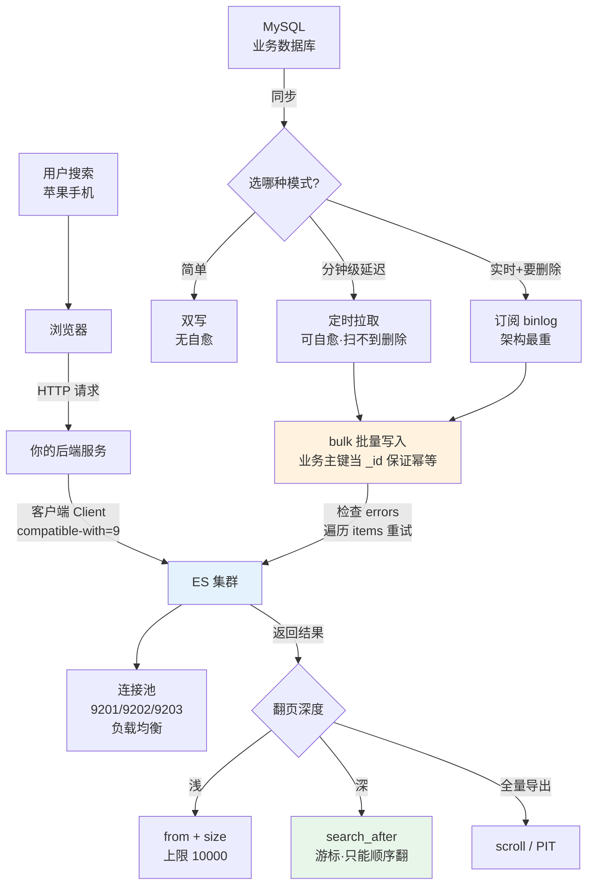

# 课 12 · 接入真实项目

> 阶段 4《分布式与工程实践》收官课 ｜ 知识点：客户端选型与集成 / 数据同步模式 / 搜索应用架构
> 环境：本机 ES 9.5.1（Windows 原生 zip）＋ Node.js v22.14.0 ｜ 标注「实测」者均有命令与输出原文

---

## 🧭 课程导航

| 上一课 | 本课 | 下一课 |
|--------|------|--------|
| [课11 数据管道与备份](lesson-11-数据管道与备份.md) | **课12 接入真实项目** | [阶段 5 生产与选型](../../5-生产与选型/overview.md) |

**本课在体系中的位置**：阶段 4 的收官课。课 9 讲数据怎么分布，课 10 讲挂了怎么排查，课 11 讲数据怎么加工和备份——**本课把前三课攒下的能力，装进一个真实应用里**。

---

## 📖 五幕结构

### 第一幕 · 场景引入：你会用 curl，但公司要的是代码

到课 11 为止，你和 ES 打交道的唯一方式是**手敲 curl**。

你在终端里敲下 `curl.exe -X POST localhost:9201/shop/_search ...`，ES 吐回一串 JSON，你读得懂，也能改。现在假设你去上班了，接到的任务是：**给公司电商站做一个商品搜索页**。

你很快会发现，curl 在这里完全不够用：

- 用户在搜索框里输入「苹果手机」，你的网页不能弹出一串 JSON，得渲染成商品卡片
- 商品数据存在 MySQL 里，ES 里一份也没有——**得先把数据搬过去，而且 MySQL 里改了价，ES 要跟着变**
- 高峰期每秒几百人搜，你手敲 curl 的速度显然跟不上
- 万一某个节点挂了，你不能让用户看到一个白屏

于是问题从「怎么问 ES」变成了三个新问题：

| 新问题 | 本课对应知识点 |
|--------|---------------|
| 用什么代码连 ES？怎么连才不踩坑？ | **客户端选型与集成** |
| MySQL 的数据怎么进 ES？改了怎么同步？ | **数据同步模式** |
| 整个搜索应用该怎么搭？分页、容错怎么办？ | **搜索应用架构** |

---

### 第二幕 · 认知冲突：三个"想当然"的坑

在动手前，先把最容易翻车的地方摆出来。这三条都是本课实测踩出来的，不是我编的。

**冲突一：客户端和 ES 的版本，不是"能连上就行"**

很多人以为客户端只是把 HTTP 请求包了一层，版本对不上也能用。错了。官方客户端会在**每一个请求头里声明自己是哪个大版本**，服务端会校验。

本课实测：9.5.1 客户端发出的请求头里带着 `compatible-with=9`；如果你拿一个 7.x 客户端去连 9.x 服务端，服务端直接拒绝：

```
Accept version must be either version 9 or 8, but found 7.
```

**冲突二：bulk 批量写入不是"要么全成功要么全失败"**

你写一个批量导入，1000 条里第 500 条字段类型写错了。你以为整个批次会回滚——不会。ES 会**成功的成功、失败的失败**，然后告诉你"有错"。

本课实测：4 条里 1 条写错类型，结果是 `errors: true`，但另外 3 条**确实写进去了**。

**冲突三：翻到第 100 页，ES 会直接拒绝你**

商品列表翻页，用户点「下一页」点到第 100 页，你的 `from = 990, size = 10` 会撞上一堵墙：

```
Result window is too large, from + size must be less than or equal to: [10] but was [25]
```

而且这个错在客户端里被**包了两层**，表面上看是 `search_phase_execution_exception / all shards failed`，真正的根因藏在 `root_cause` 里——这也是本课要教你的一件事：**别只看最外层报错**。

---

### 第三幕 · 层层揭示

---

## 知识点 1：客户端选型与集成

### 一句话定义

**客户端（Client）** 是官方提供的语言库，把 ES 的 HTTP 接口包装成你熟悉语言的普通函数调用。

### 直觉建立：客户端 = 翻译官 + 管家

把 ES 想成一家只说英语（HTTP）的外国公司。你不懂英语，于是请了个翻译官：

- **翻译**：你说 `client.search(...)`，他帮你翻成 `POST /shop/_search` 发出去，再把回信翻成你的语言
- **管家**：他还会帮你做几件你没想到的事——记住公司有几个门（连接池）、这个门堵了换下一个（故障转移）、客人太多时排队（重试）

> ⚠️ **类比的边界**：翻译官不会帮你做决定。他不会替你设计 mapping，也不会替你优化查询——那还是你的活。客户端只管"通信"，不管"设计"。

### 核心原理：为什么必须版本对齐

这是本知识点最重要的一节。

官方客户端会在**每个请求**的头里声明自己的大版本：

```http
Accept:       application/vnd.elasticsearch+json; compatible-with=9
Content-Type: application/vnd.elasticsearch+json; compatible-with=9
```

这不是可选的装饰，而是**服务端用来决定"该用哪套 API 格式回你"的依据**。

服务端收到后做校验，规则是**只跨一个大版本**：

| 客户端版本 | 服务端 8.x | 服务端 9.x | 服务端 10.x |
|-----------|-----------|-----------|------------|
| 9.x 客户端 | ❌ 不兼容 | ✅ 兼容 | ✅ 兼容 |
| 8.x 客户端 | ✅ 兼容 | ✅ 兼容 | ❌ 不兼容 |

（核查于 2026-09，来源：[官方客户端文档](https://www.elastic.co/guide/en/elasticsearch/client/index.html)）

**规律一句话**：**客户端可以连"同版本或更新"的服务端，不能连"更老"的服务端。**

这个设计的用意很实在：**升级时先升服务端，再升客户端**。因为新客户端连老服务端会失败（老服务端不认识新版本的声明），但老客户端连新服务端能工作（新服务端认得老版本声明，会切到兼容模式）。

> 📌 官方原话：*"When upgrading Elasticsearch it is strongly recommended to upgrade the server first, before the client."*

### 怎么选：官方客户端一览

| 语言 | 安装命令 | 官方文档 |
|------|---------|---------|
| Python | `pip install elasticsearch` | [Python 客户端](https://www.elastic.co/guide/en/elasticsearch/client/python-api/current/index.html) |
| Java | Maven 引 `co.elastic.clients:elasticsearch-java` | [Java 客户端](https://www.elastic.co/guide/en/elasticsearch/client/java-api-client/current/index.html) |
| JavaScript | `npm install @elastic/elasticsearch` | [JS 客户端](https://www.elastic.co/guide/en/elasticsearch/client/javascript-api/current/index.html) |
| Go | `go get github.com/elastic/go-elasticsearch/v9` | [Go 客户端](https://www.elastic.co/guide/en/elasticsearch/client/go-api/current/index.html) |
| .NET | `dotnet add package Elastic.Clients.Elasticsearch` | [.NET 客户端](https://www.elastic.co/guide/en/elasticsearch/client/net-api/current/index.html) |

**选型的唯一原则**：**用什么语言写业务，就用什么语言的客户端**。不要为了"ES 用 Java 写的"就非要用 Java 客户端——客户端只是 HTTP 的封装，跟 ES 内部实现语言无关。

> ⚠️ **浏览器警告（官方明确）**：官方**不支持**在浏览器里直接用客户端。因为那等于把你的 ES 地址和密码暴露给所有访客。正确做法是浏览器请求你自己的后端，后端再用客户端访问 ES（官方建议写一个轻量代理）。

### 常见误区

| 误区 | 真相 |
|------|------|
| "客户端版本比服务端低一点没关系" | 低可以（同大版本内或跨一个上探），但**低一个以上大版本直接报错** |
| "客户端会自动支持新版 ES 的所有功能" | 不会。**兼容 ≠ 功能对齐**：8.12 客户端能连 8.13 服务端，但用不了 8.13 的新功能 |
| "装个 `elasticsearch` 包就行" | npm 上叫 `elasticsearch` 的旧包（15.x）**已废弃**，正确包名是 `@elastic/elasticsearch` |

### 一句话记住

> **客户端是翻译官不是设计师；版本只能往下看一个大版本，升级顺序永远是"先服务端后客户端"。**

---

## 知识点 2：数据同步模式

### 一句话定义

**数据同步**指把业务数据库（如 MySQL）里的数据搬进 ES，并让两边保持一致的过程与策略。

### 直觉建立：给图书馆配一套卡片目录

想象你的 MySQL 是一个大书库，ES 是门口的**卡片目录柜**：

- 读者（用户）只在目录柜前查，查到卡片号再去书库取书
- 书库里新进一本书，目录柜就得**新增一张卡片**
- 书的价格改了，目录柜的卡片也得**改**
- 书被下架了，卡片要**抽掉**

问题在于：**这两套东西是分开的，没人自动帮你同步**。你搬书的人忘了写卡片，读者就查不到新书——这就是"数据不一致"。

> ⚠️ **类比的边界**：真实系统里，ES 通常不只存"卡片号"，还会存一份**查询要用的完整字段副本**（比如商品名、价格、品牌），这样列表页直接就能渲染，不用再回 MySQL 查。这叫"宽表冗余"，是同步设计中一个真实的权衡，后面会讲。

### 核心原理：三种同步模式

模式一**双写**（应用代码里同时写两边）

```
应用 ──┬──> MySQL
       └──> ES
```

- 优点：简单直接，延迟最低
- 缺点：**两边都可能写失败，且不一致不会自愈**。MySQL 成功、ES 失败 → 这条数据永久查不到

模式二**定时拉取**（按 `update_time` 增量扫表）

```
定时任务 ──> SELECT * FROM t WHERE update_time > 上次时间 ──> 批量写 ES
```

- 优点：解耦，业务代码不用改；失败了下次还能补回来（**自愈**）
- 缺点：有延迟（取决于任务间隔）；**删掉的数据扫不到**（物理删除没有痕迹）

模式三**订阅变更日志**（监听 MySQL binlog）

```
MySQL ──(binlog)──> Canal/Debezium ──> MQ ──> 消费者 ──> ES
```

- 优点：实时、能捕获删除、完全解耦
- 缺点：**架构最重**，要维护 Canal/MQ/消费者三套东西

**怎么选**：中小项目、能接受分钟级延迟 → 模式二最划算；要求秒级且要捕获删除 → 模式三；只有极少数对一致性要求不高的场景才用模式一。

> ⚠️ **为什么本课不带你做同步的实操**：三种模式都需要一个**业务数据库**（MySQL）作为数据源，而本机只装了 ES、没有 MySQL，所以这一步只能在讲义里讲清原理与取舍，无法在本机真跑。
>
> 但同步里**两个最关键的机制是可以练的**，而且它们与具体用哪种模式无关——第四幕的第 4、5 步就是：
>
> | 同步的关键机制 | 本课怎么练 |
> |---------------|-----------|
> | 批量写入 | 第 4 步：用 `bulk` 一次写多条，观察部分失败 |
> | 幂等（失败重跑不出错） | 第 5 步：同一 `_id` 连写 3 次，验证总数不变 |
>
> **学会这两条，无论将来用哪种模式都用得上。**

### 幂等：同步的生命线

无论哪种模式，**必须保证"同一条数据重复同步多次，结果一样"**。这叫**幂等（Idempotent）**：重复做多少次，结果都一样。

ES 里实现幂等的关键：**写入时指定业务主键作为 `_id`**。

- 用 MySQL 的 `id` 当 `_id` → 重复同步就是**覆盖**，不会产生第二条
- 不指定 `_id` → ES 每次生成一个新的随机 ID → 重复同步会**产出一大堆重复文档**

本课实测：对同一个 `_id` 连写 3 次，`result` 从 `created` 变 `updated`，`_version` 从 2 递增到 4，**文档总数始终是 3 条**。

### bulk：批量写入，以及它的"部分失败"

同步大量数据时，一条一条写会慢到不能忍。ES 提供 **bulk 接口**：一次请求里塞进几百上千条操作。

**关键机制（本课实测）**：bulk **不是事务**。

实测：一个 bulk 请求里放 4 条，第 4 条故意把 `abc` 写给 `long` 类型的字段。结果：

```
bulk 顶层结果: errors = true
  [0] OK      _id=1  result=created  status=201
  [1] OK      _id=2  result=created  status=201
  [2] OK      _id=3  result=created  status=201
  [3] FAILED  _id=4  status=400
         type   : document_parsing_exception
         reason : [1:39] failed to parse field [price] of type [long] in document with id '4'.
                  Preview of field's value: 'abc'

索引实际文档数: 3     ← 成功的 3 条确实进去了
_id=4 是否存在: false ← 失败的那条没进
```

**所以：写完 bulk 必须检查 `errors` 字段，并遍历 `items` 找出失败的那几条重试。** 只看 HTTP 状态码（200）是不够的——bulk 即使有错也返回 200。

### 常见误区

| 误区 | 真相 |
|------|------|
| "bulk 返回 200 就说明全成功了" | 错。**要检查 `errors` 字段**，它是部分失败的标志 |
| "bulk 是一个事务，失败会回滚" | 错。逐条独立成功/失败 |
| "同步任务失败就完蛋了" | 只要**用业务主键当 `_id`**，重跑一次就能自愈（幂等） |
| "定时拉取能发现删除" | **物理删除扫不到**。要么软删除（加 `is_deleted` 字段），要么改用 binlog 订阅 |

### 一句话记住

> **同步三模式＝双写/定时拉取/订阅 binlog；幂等的命门是用业务主键当 `_id`；bulk 不是事务，必须检查 `errors`。**

---

## 知识点 3：搜索应用架构

### 一句话定义

**搜索应用架构**指把 ES 放进一个完整应用时，各层怎么分工、请求怎么流转、异常怎么兜底的整体设计。

### 直觉建立：餐厅的前厅与后厨

把你的应用想成一家餐厅：

- **浏览器（前厅）**：只管点菜和上菜，不进后厨
- **你的后端（服务员）**：接收点单、传给后厨、把菜端出来
- **ES（后厨）**：真正做菜的地方，客人看不到

**为什么客人不能直接冲进后厨？** 因为后厨里有菜谱（数据结构）、有火（资源）、还有仓库钥匙（凭据）。让客人进去，轻则乱套，重则出事。

> ⚠️ **类比的边界**：真实架构里，后端不只是"传话"，还承担鉴权、限流、参数校验、结果裁剪。有些设计里还会加一层缓存（相当于"备好的凉菜"），热搜词不用每次都劳烦后厨。

### 核心原理：三层架构与连接池

```
┌──────────┐   HTTP    ┌──────────────┐   客户端   ┌─────────────┐
│  浏览器   │ ────────> │  你的后端服务  │ ────────> │  ES 集群     │
│ (前端页面)│ <──────── │ (Node/Java…) │ <──────── │ (多节点)     │
└──────────┘    JSON   └──────────────┘           └─────────────┘
                              │                          ↑
                              └── 连接池负载均衡 ─────────┘
                                  （9201/9202/9203 轮流打）
```

**连接池（Connection Pool）** 是客户端自带的管家功能：你给它几个节点地址，它自动在节点间分配请求。

本课实测：给客户端 `9201/9202/9203` 三个地址，连发 6 次请求，分布是：

```
http://localhost:9201/ : 2
http://localhost:9202/ : 2
http://localhost:9203/ : 2
```

**每个节点各 2 次，完美均摊**——你一行负载均衡代码都没写。

> 🐞 **实测踩坑**：9.5.1 客户端的 `sniffOnStart: true`（启动时自动发现节点）在本机**没有生效**，连接池里仍只有 1 个节点。显式列出全部节点地址才得到 3 个。**想要连接池，就把节点地址老老实实写全。**

### 深分页：真实项目必踩的墙

用户翻页时，最自然的写法是 `from + size`（跳过前 N 条，取 M 条）。但 ES 有个硬限制 `index.max_result_window`，默认 **10000**。

本课实测（把上限临时改成 10，然后请求 `from=20, size=5`）：

```json
{
  "error": {
    "root_cause": [{
      "type": "illegal_argument_exception",
      "reason": "Result window is too large, from + size must be less than or equal to:
                 [10] but was [25]. See the scroll api for a more efficient way to
                 request large data sets. This limit can be set by changing the
                 [index.max_result_window] index level setting."
    }],
    "type": "search_phase_execution_exception",
    "reason": "all shards failed",
    ...
  },
  "status": 400
}
```

**注意这个错误的"两层皮"**：

| 层 | 内容 | 排障价值 |
|----|------|---------|
| 外层 | `search_phase_execution_exception / all shards failed` | ❌ 毫无信息量，所有分片失败都长这样 |
| **内层** | `Result window is too large, from + size must be ≤ [10] but was [25]` | ✅ 这才是根因 |

**教训：在客户端里捕获异常，一定往 `root_cause` 里挖，别只看最外层的 `message`。**

**为什么有这个限制？** 因为 `from=990` 意味着 ES 要在**每个分片**上都算出前 1000 条，汇总排序后再丢掉前 990 条。翻得越深，浪费越大。这不是可以随便调大的参数——调大它等于给自己埋一颗内存炸弹。

### 三种翻页方案对比

| 方案 | 怎么做 | 适用场景 | 代价 |
|------|--------|---------|------|
| **from + size** | `from: 20, size: 10` | 浅分页（前几页） | 超过 `max_result_window` 直接报错 |
| **search_after** | 用上一页最后一条的排序值当游标 | **深度翻页**（用户一直点下一页） | 不能跳页，只能顺序往后翻 |
| **scroll / PIT** | 开一个快照游标 | **全量导出**（导出、迁移、离线计算） | 占资源，不适合实时交互 |

**search_after 实测**（索引 30 条，`max_result_window=10` 仍生效）：

```
第1页 _id: 1,2,3,4,5      第1页末尾 sort 值: [5,4]
第2页 _id: 6,7,8,9,10
第3页 _id: 11,12,13,14,15
第4页 _id: 16,17,18,19,20
```

**翻到第 4 页（第 20 条）也没撞墙**——因为 search_after 是"从这条之后继续取"，不是"跳过前 N 条"。

> 💡 **排序必须用唯一决胜键**：search_after 靠排序值定位，如果排序字段有重复值，翻页会**漏数据或重复**。官方原话：*"If you don't include a tiebreaker field, your paged results could miss or duplicate hits."*
>
> 决胜键怎么选（官方文档 + 本机实测综合）：
>
> | 方案 | 适用 | 说明 |
> |------|------|------|
> | `_doc` | 普通翻页（**本课实测用这个**） | Lucene 内部文档 ID，天然唯一 |
> | `_shard_doc` | 配合 PIT 翻页 | **官方推荐**：PIT 请求会自动加隐式 `_shard_doc` 决胜键 |
> | `_id` | ❌ 不推荐 | 官方文档明确说：_id 的 doc_values 被禁用，排序它会**加载大量数据到内存** |
>
> ⚠️ **ES 9.5.1 不能对 `_id` 排序**（课 7 实测报错 `Fielddata access on the _id field is disallowed`）——官方不推荐与实测不支持在这里是一致的。
>
> 📚 官方原文：*"The `_id` field has a unique value per document but it is not recommended to use it as a tiebreaker directly. Doc values are disabled on this field so sorting on it requires to load a lot of data in memory."*

### 常见误区

| 误区 | 真相 |
|------|------|
| "深分页报错就把 `max_result_window` 调大" | 治标不治本，深翻页依然会拖垮集群。**该换 search_after** |
| "search_after 能跳到第 50 页" | 不能。它是游标，只能顺序翻。要跳页请用其他方案 |
| "客户端连一个节点就够了" | 够用但浪费。多给几个地址，客户端自动负载均衡 |
| "浏览器里直接连 ES 省一层" | **官方明确反对**，等于把 ES 暴露给公网 |

### 一句话记住

> **架构三层＝前端不直连 ES；连接池让客户端自己均衡；深分页别硬调参数，换 search_after。**

---

### 第四幕 · 实操验证

> ⚠️ **本课的环境前提**：本机**只装了 Node.js v22.14.0**（Python 是 Microsoft Store 的存根、Java/Go/.NET 均未安装），所以客户端实测全部用官方 JS 客户端。讲义里其他语言的例子只作对照，未在本机运行。

#### 第 1 步：装客户端并确认版本对齐

```powershell
cd D:\projects\learning\elasticsearch\playground
mkdir l12-client
cd l12-client
npm init -y
npm install @elastic/elasticsearch@9.5.1
```

实测安装输出：`added 11 packages`，`found 0 vulnerabilities`。

**确认版本对齐**（本机实测）：

```
客户端版本: 9.5.1
服务端版本: 9.5.1
集群名    : l9-cluster
```

客户端和服务端**大版本完全一致**，这正是官方推荐的状态。

#### 第 2 步：看客户端到底发了什么头（版本协商证据）

写一个脚本，监听客户端的事件，打印真实请求头。**注意脚本必须包在 `async` 函数里**——Node.js 的顶层 `await` 只在 ESM 模块（`.mjs`）里可用，直接写在 `.js` 里会报 `SyntaxError: await is only valid in async functions`：

```javascript
// 01-connect.js（节选，完整文件见 playground/l12-client/01-connect.js）
const { Client } = require('@elastic/elasticsearch')
const client = new Client({ node: 'http://localhost:9201' })

// 注意：9.x 客户端的事件接口是 client.diagnostic，不是 client.on
client.diagnostic.on('request', (err, result) => {
  if (err) return
  const h = result.meta.request.params.headers
  console.log('Accept      :', h.accept)
  console.log('Content-Type:', h['content-type'])
})

async function main() {                    // ← 必须有这层包装
  const info = await client.info()
  console.log('服务端版本:', info.version.number)
}
main().catch(e => console.log('出错:', e.message))
```

> 💡 想省掉包装？把文件存成 `.mjs` 后缀就可以直接写顶层 `await`。本课统一用 `.js` + `async main()`，任何 Node 版本都不会出错。

**实测输出（这就是版本协商的铁证）**：

```
Accept      : application/vnd.elasticsearch+json; compatible-with=9,text/plain
Content-Type: application/vnd.elasticsearch+json; compatible-with=9
User-Agent  : elasticsearch-js/9.5.1 (win32 10.0.26200-x64; Node.js 22.14.0; Transport 9.4.0)
```

看到 `compatible-with=9` 了吗？**这就是客户端在向服务端"自报家门"**。

#### 第 3 步：亲手撞一次"版本不匹配"的墙

用 curl 模拟不同版本的客户端，看服务端如何应对：

```powershell
# 模拟 8.x 客户端：compatible-with=8
curl.exe -s -H 'Accept: application/vnd.elasticsearch+json; compatible-with=8' "http://localhost:9201/"

# 模拟 7.x 客户端：compatible-with=7（跨两个大版本）
curl.exe -s -i -H 'Accept: application/vnd.elasticsearch+json; compatible-with=7' "http://localhost:9201/"
```

> ⚠️ **终端写法提醒**（课 10 实测结论）：上面用的是**单引号**，在 **PowerShell** 下正确；如果你在 **CMD** 里跑，CMD 不认单引号，要换成双引号并把内层双引号转义：
>
> ```cmd
> curl.exe -s -H "Accept: application/vnd.elasticsearch+json; compatible-with=8" "http://localhost:9201/"
> ```
>
> 本机**没有安装 Git Bash**（PATH 里的 `bash.exe` 是 WSL 启动器，调用无响应），所以不要照抄网上的 Git Bash 写法。涉及复杂 JSON 的请求体，一律用 `--data-binary @文件.json`。

**实测结果**：

| 请求头 | 结果 |
|--------|------|
| `compatible-with=8` | ✅ 成功返回集群信息（兼容模式生效） |
| `compatible-with=9` | ✅ 成功 |
| `compatible-with=7` | ❌ **HTTP 400** |

7.x 那条的**报错原文**：

```json
{
  "error": {
    "root_cause": [{
      "type": "media_type_header_exception",
      "reason": "Invalid media-type value on headers [Content-Type, Accept]"
    }],
    "type": "media_type_header_exception",
    "caused_by": {
      "type": "status_exception",
      "reason": "Accept version must be either version 9 or 8, but found 7.
                 Accept=application/vnd.elasticsearch+json; compatible-with=7"
    }
  },
  "status": 400
}
```

**这张表就是"只跨一个大版本"规则的实证：8 可以、9 可以、7 不行。**

#### 第 4 步：bulk 批量写入与部分失败

```javascript
// 02-bulk.js（节选）
const res = await client.bulk({
  refresh: true,
  operations: [
    { index: { _index: 'l12_bulk_test', _id: '1' } },
    { title: '正常文档一', price: 100 },
    // ... 第 2、3 条正常
    { index: { _index: 'l12_bulk_test', _id: '4' } },
    { title: '类型错误文档', price: 'abc' },   // ← 故意写错类型
  ],
})
console.log('bulk 顶层结果: errors =', res.errors)
```

**实测输出**：

```
bulk 顶层结果: errors = true | took = 213 ms
  [0] OK      _id=1  result=created  status=201
  [1] OK      _id=2  result=created  status=201
  [2] OK      _id=3  result=created  status=201
  [3] FAILED  _id=4  status=400
         type   : document_parsing_exception
         reason : [1:39] failed to parse field [price] of type [long] in document with id '4'.

索引实际文档数: 3
_id=4 是否存在: false
```

**结论验证**：`errors=true` 但成功的 3 条确实落库了。生产代码必须遍历 `items` 挑出失败项重试。

#### 第 5 步：幂等性验证（同步任务的生命线）

```javascript
// 同一个 _id 连写 3 次
for (let i = 1; i <= 3; i++) {
  const r = await client.index({
    index: 'l12_bulk_test',
    id: '1',                                    // ← 固定 _id
    document: { title: '第' + i + '次覆盖', price: i * 1000 },
  })
  console.log(`第 ${i} 次: result=${r.result}  _version=${r._version}`)
}
```

**实测输出**：

```
  第 1 次: result=updated  _version=2  _seq_no=3
  第 2 次: result=updated  _version=3  _seq_no=4
  第 3 次: result=updated  _version=4  _seq_no=5
  覆盖 3 次后文档总数: 3 （仍是 3，没有变多）
```

**这就是幂等**：重复执行不产生副作用，同步任务失败重跑是安全的。

#### 第 6 步：连接池负载均衡

```javascript
// 03-pool-paging.js（节选）
const client = new Client({
  nodes: ['http://localhost:9201', 'http://localhost:9202', 'http://localhost:9203'],
})
console.log('连接池中的节点数:', client.connectionPool.size)

const seen = {}
client.diagnostic.on('request', (err, r) => {
  const url = r.meta?.connection?.url?.toString?.()
  seen[url] = (seen[url] || 0) + 1
})
for (let i = 0; i < 6; i++) {
  await client.search({ index: 'l12_bulk_test', query: { match_all: {} } })
}
console.log('请求分布:', seen)
```

**实测输出**：

```
连接池中的节点数: 3
  请求分布: {
  "http://localhost:9201/": 2,
  "http://localhost:9202/": 2,
  "http://localhost:9203/": 2
}
```

每个节点各 2 次，**你没写一行负载均衡代码**。

**亲手验证 `sniffOnStart` 不生效**（这个踩坑你可以自己复现）：

```javascript
// 对照组：只给 1 个节点 + 开启 sniffOnStart
const a = new Client({ node: 'http://localhost:9201', sniffOnStart: true })
console.log('sniffOnStart 的连接池:', a.connectionPool.size)   // 实测 → 1

// 实验组：显式列出 3 个节点
const b = new Client({
  nodes: ['http://localhost:9201', 'http://localhost:9202', 'http://localhost:9203'],
})
console.log('显式列节点的连接池:', b.connectionPool.size)      // 实测 → 3
```

**实测输出**：

```
sniffOnStart 的连接池: 1     ← 没生效，仍然只有你给的那一个
显式列节点的连接池: 3        ← 生效
```

⚠️ 这是 9.5.1 客户端在本机的实测行为，不代表所有版本都如此。**结论：想要连接池，就把节点地址老老实实写全，别指望自动发现。**

#### 第 7 步：深分页撞墙 + search_after 绕过

```javascript
// 把上限临时改成 10，模拟"翻太深"
await client.indices.putSettings({
  index: 'l12_page_test',
  settings: { 'index.max_result_window': 10 },
})

try {
  await client.search({ index: 'l12_page_test', from: 20, size: 5, query: { match_all: {} } })
} catch (e) {
  console.log('外层报错:', e.message.split('\n')[0])
  console.log('真正根因:', e.meta.body.error.root_cause[0].reason)   // ← 往这里挖！
}
```

**实测输出**：

```
  报错类型: ResponseError
  报错原文: search_phase_execution_exception
  错误 type: search_phase_execution_exception
  错误 reason: all shards failed
```

**注意**：直接看 `e.message` 只能得到 `all shards failed` 这种废话。必须往 `e.meta.body.error.root_cause` 里挖，才能看到真正的 `Result window is too large...`。

**换 search_after 后**：

```javascript
let page = await client.search({
  index: 'l12_page_test',
  size: 5,
  query: { match_all: {} },
  sort: [{ views: 'asc' }, { _doc: 'asc' }],   // _doc 是决胜键
})
let last = page.hits.hits[4].sort              // 取上一页最后一条的排序值
page = await client.search({
  index: 'l12_page_test', size: 5,
  query: { match_all: {} },
  sort: [{ views: 'asc' }, { _doc: 'asc' }],
  search_after: last,                          // ← 游标
})
```

**实测输出**：

```
  第1页 _id: 1,2,3,4,5      第1页末尾 sort 值: [5,4]
  第2页 _id: 6,7,8,9,10
  第3页 _id: 11,12,13,14,15
  第4页 _id: 16,17,18,19,20
  → 翻页不受 max_result_window=10 限制
```

**回扣第一幕**：你在第二幕撞上的那堵墙，现在有了解法。

---

### 第五幕 · 体系收束

#### 本课在阶段 4 的位置

```
阶段 4：分布式与工程实践
├── 课 9  分片：数据怎么分布          ✅
├── 课 10 集群健康与排障：挂了怎么办   ✅
├── 课 11 数据管道与备份：怎么加工/迁移/备份  ✅
└── 课 12 接入真实项目：怎么装进应用里  ✅ ← 本课
```

**前三课攒的能力，在本课被装进了一个真实应用**：

| 前面学的 | 本课怎么用上 |
|---------|-------------|
| 课 9 分片与副本 | 连接池把请求分摊到多个节点，正是分片机制在支撑 |
| 课 9 分片数不可改 | 同步前先设计好分片数，否则又要 reindex |
| 课 10 集群健康 | 客户端连的是集群而非单点，节点挂了连接池自动绕开 |
| 课 11 Ingest Pipeline | 同步时可在 ES 侧做数据加工，不必全堆在客户端 |
| 课 11 快照 | 同步出错且已污染数据时，快照是回退的底线 |

#### 一图总结



#### 你现在会了什么

- **能选**：知道客户端按"业务语言"选，且必须版本对齐（只跨一个大版本）
- **能连**：会用客户端连集群，理解连接池与 `compatible-with` 协商机制
- **能同步**：知道三种同步模式的代价，会用 `_id` 保证幂等，会检查 bulk 的 `errors`
- **能设计**：知道前端不直连 ES、深分页该换 search_after，且知道该往 `root_cause` 挖报错

#### 接下来的路

阶段 4 到此收官。你已经能把 ES 接进真实项目了。但还有三件事没解决：

1. **ES 不只是"搜索框"**——它还是日志分析平台、是向量数据库（RAG 的底座）。这些主战场该怎么打？→ **阶段 5 课 13**
2. **谁都能查你的 ES 吗？** ——生产环境必须开权限。→ **阶段 5 课 13「安全与权限」**
3. **到底该不该用 ES？** ——以及怎么证明你会。→ **阶段 5 课 14**

#### 命令速查卡

| 场景 | JS 客户端写法 |
|------|--------------|
| 建客户端（单节点） | `new Client({ node: 'http://localhost:9201' })` |
| 建客户端（多节点） | `new Client({ nodes: ['http://...9201','http://...9202'] })` |
| 查服务端信息 | `await client.info()` |
| 抓请求头（排障） | `client.diagnostic.on('request', (err, r) => ...)` |
| 写文档（指定 ID） | `await client.index({ index, id, document })` |
| 批量写 | `await client.bulk({ operations: [...] })` |
| 检查批量结果 | `res.errors` + 遍历 `res.items` |
| 搜索 | `await client.search({ index, query })` |
| 深分页 | `sort` + `search_after: 上一页最后的 sort` |
| 抓根因报错 | `e.meta.body.error.root_cause[0].reason` |

📚 官方文档：[Elasticsearch Clients 总览](https://www.elastic.co/guide/en/elasticsearch/client/index.html) ｜ [JS 客户端文档](https://www.elastic.co/guide/en/elasticsearch/client/javascript-api/current/index.html) ｜ [REST API 兼容性](https://www.elastic.co/guide/en/elasticsearch/reference/master/rest-api-compatibility.html)

---

## 🐞 本课踩坑记录

1. **`client.on` 不存在** → 9.x 客户端的事件接口改成了 `client.diagnostic.on`。（实测）
2. **`sniffOnStart: true` 在本机不生效** → 连接池仍只有 1 个节点，必须显式列出全部节点地址。（实测）
3. **bulk 返回 200 但 `errors=true`** → 部分失败不体现在 HTTP 状态码上，必须检查 `errors` 字段。（实测）
4. **深分页报错被包了两层** → 外层是 `search_phase_execution_exception / all shards failed`，根因在 `root_cause`。（实测）
5. **search_after 的排序必须有唯一决胜键** → 且 ES 9.5.1 不能对 `_id` 排序，要用 `_doc`。（课 7 已实测）
6. **`nodesToHost()` 会抛异常** → 9.5.1 上该内部方法对未初始化的连接池调用会报 `Cannot convert undefined or null to object`。（实测）

---

## 🚀 下一批接力提示词

> 学完本课后，**复制下面这段文字发给 AI**，即可无缝进入阶段 5（无需重新描述上下文）：

```
继续学 Elasticsearch。我的学习档案在 elasticsearch/00-学习档案.md，
刚学完阶段 4《分布式与工程实践》课 12《接入真实项目》的三个知识点
（客户端选型与集成 / 数据同步模式 / 搜索应用架构），阶段 4 已全部完成。

本机环境：
- 3 节点学习集群在 http://localhost:9201（node-1/9201, node-2/9202, node-3/9203，
  cluster.name=l9-cluster，已关闭安全，数据在 playground/l9-cluster/）
  当前 green，主节点 node-2；三节点均已配置 path.repo
  实测索引：l9_trap2（1287 条）、l9_orders（24 条）、l9_hi（300 条）、
  l10_shard_1/3/50（各 3000 条）、l11_shop_v2（3 条）
- 单节点集群在 https://localhost:9200（密码 9PvhcGNNc86uFZb_ePAN，IK 9.5.1 已装）
  实测索引：l6_shop（8）、l7_news（6）、l8_orders（24）、l8_orders_v2（24）、
  l8_text_demo（24）、news_ik（5）
- 快照仓库 l11_repo（fs）在 playground/snapshots/l11_backup，已有 snap_2/3/4 及 SLM 自动快照
- 客户端环境：本机只装了 Node.js v22.14.0（Python 为 Store 存根、Java/Go/.NET 均未装），
  已安装 @elastic/elasticsearch@9.5.1，测试项目在 playground/l12-client/
- 课 12 实测结论：客户端请求头带 compatible-with=9；compatible-with=8 可连、=7 报
  "Accept version must be either version 9 or 8, but found 7"；
  bulk 部分失败（errors=true 但成功项已落库）；_id 固定则幂等（_version 递增、总数不变）；
  显式列三节点则连接池均摊（各 2/6）；sniffOnStart 不生效；
  深分页报 Result window is too large，根因藏在 root_cause；search_after 可绕过

请按大纲继续讲解阶段 5 课 13《三大主战场》。
```

---

## 🧭 课程导航

| 上一课 | 本课 | 下一课 |
|--------|------|--------|
| [课11 数据管道与备份](lesson-11-数据管道与备份.md) | **课12 接入真实项目** | [阶段 5 生产与选型](../../5-生产与选型/overview.md) ｜ [返回课程目录](../../02-课程目录.md) |
