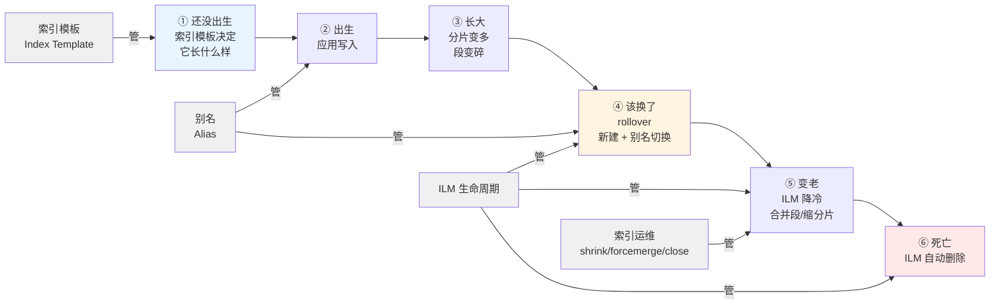
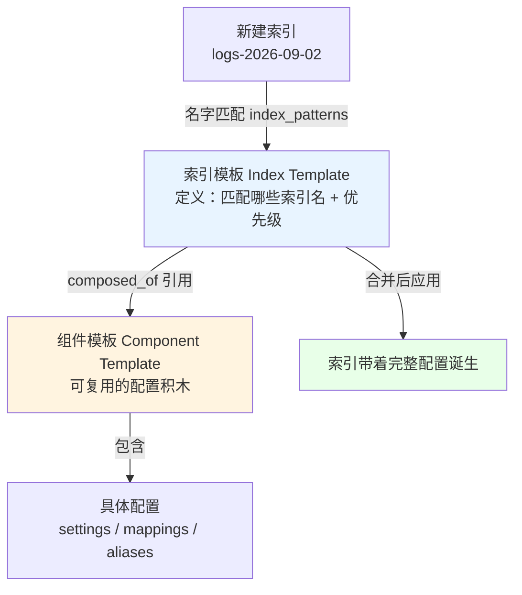
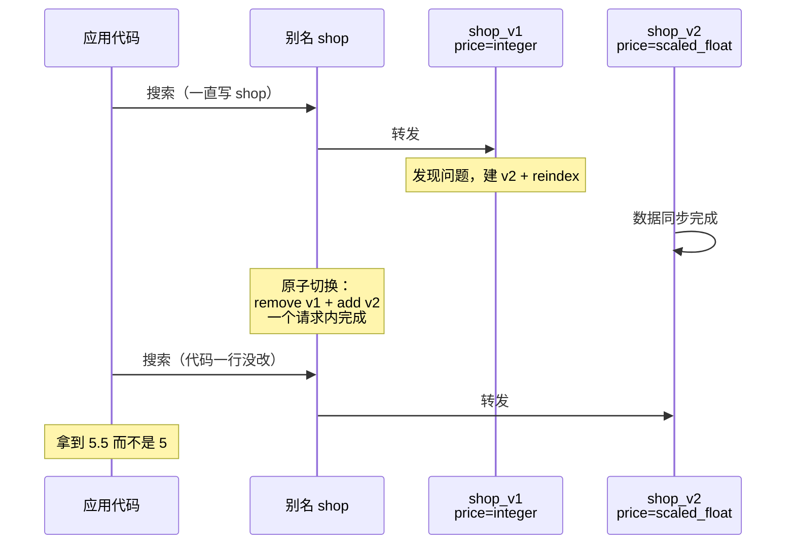
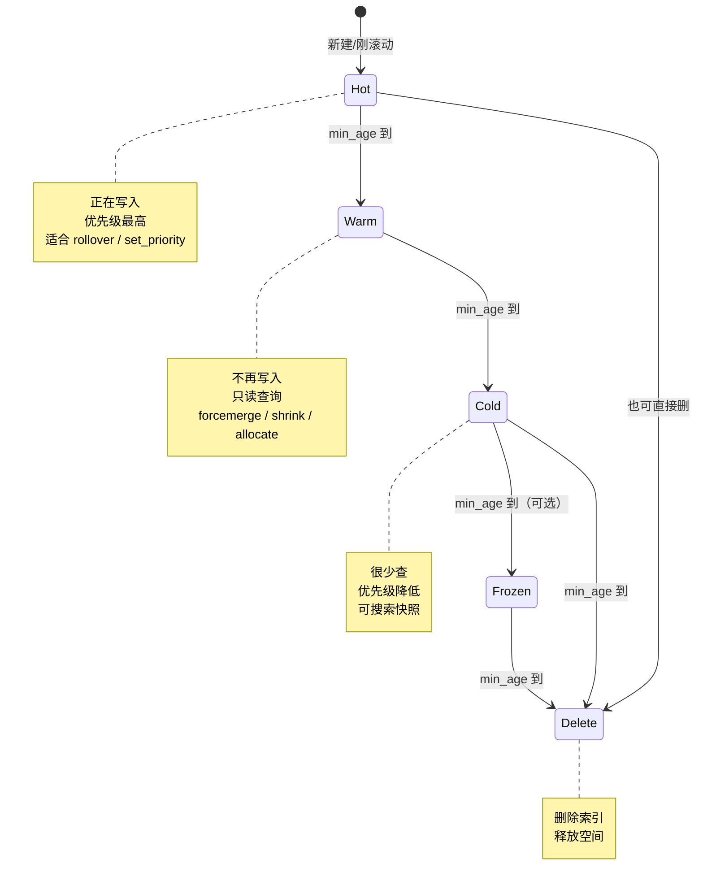
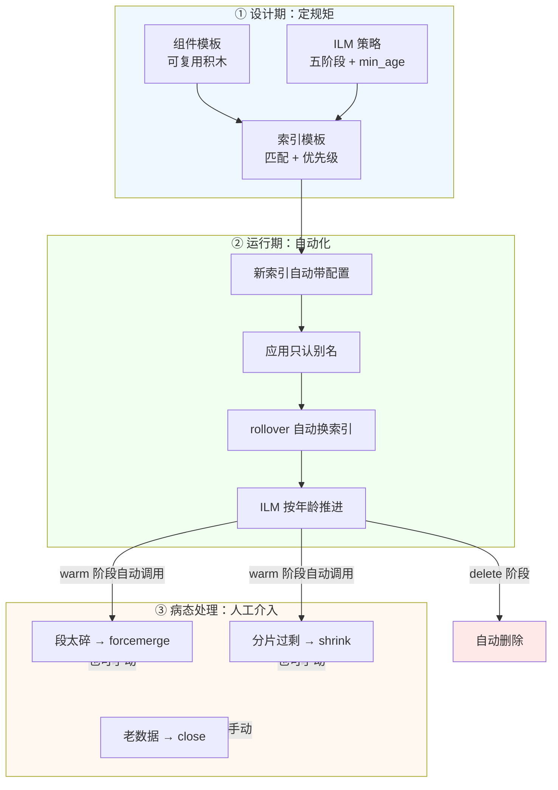
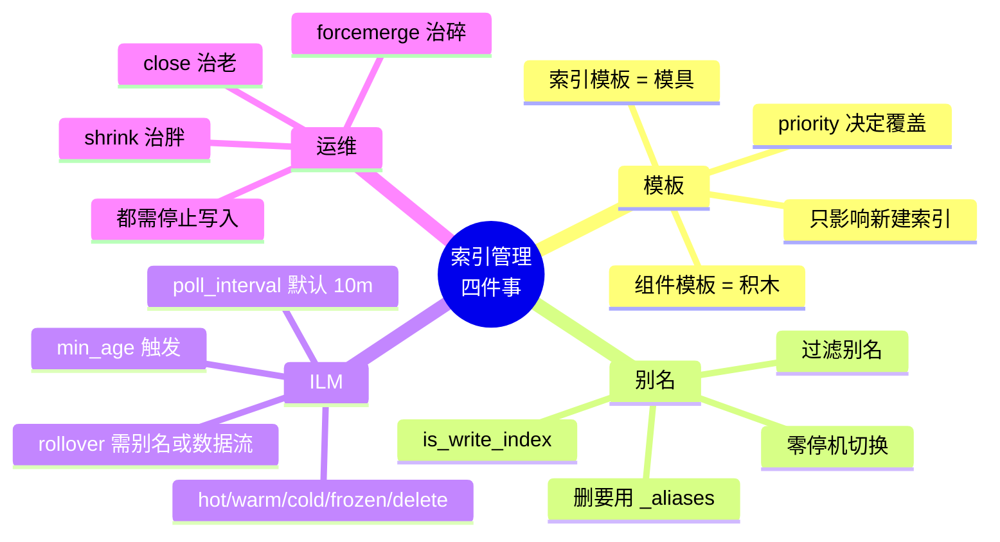

# 课 15：索引管理与生命周期策略

> 本课定位：把散落在课 5、课 11、课 13 里的"索引管理碎片"拼成一张完整的图。
> 前面 14 课教你**怎么用 ES 查数据**，这一课教你**怎么管住那些装数据的盒子**——它们从哪来、怎么长大、什么时候该换、什么时候该扔。

---

## 🎯 本课目标

学完这一课，你应该能回答四个问题：

1. 一个索引的配置是怎么"拼"出来的？（组件模板 + 索引模板）
2. 应用为什么应该认别名而不是认索引名？（零停机切换）
3. ILM 到底在什么时候做什么事？（五个阶段 + 轮询间隔）
4. 索引太大 / 太多 / 太碎，用什么手段收拾？（shrink / forcemerge / close）

**本课知识点**：索引模板体系、别名、ILM 生命周期、索引运维操作

---

## 第一幕 · 起源与场景引入：一次"改个字段类型"引发的凌晨三点

### 场景：你接手了一个跑了两年的商品搜索

凌晨三点，你被电话叫醒。

运营在群里@你：「搜索页价格显示错了，88 块的车厘子显示成 88 元没问题，但 3.25 元的香蕉显示成 3 元，财务对不上账。」

你爬起来查，发现问题出在两年前：

```json
// 两年前某个工程师建的索引
{
  "mappings": {
    "properties": {
      "name":  { "type": "text" },
      "price": { "type": "integer" }    // ← 就是这行
    }
  }
}
```

`integer` 存不了小数。3.25 被截断成 3，5.5 被截断成 5。数据量小的时候没人发现，等财务对账的时候已经错了两年。

你立刻想到课 5 学的：**映射是婚前协议，字段类型定下就不能改**。要改就得新建索引 + reindex。

但问题来了——

```javascript
// 应用代码里写死了索引名
await client.search({ index: 'shop', query: { ... } })
```

**你要新建 `shop_v2`、reindex 数据、然后让应用改代码指向 `shop_v2`。**
这意味着：发版、灰度、回滚预案、半夜叫醒前端同学……而这一切只是为了改一个字段类型。

更糟的是，这个 `shop` 索引已经长到 800 GB，只有一个分片（当年没规划），里面有 3000 万条数据，每年还要涨 50%。你想拆分片？想定期清理三年前的旧数据？全部要手工操作，每次都是高风险动作。

### 😖 认知冲突：三个"为什么这么难"

**冲突一：为什么改个字段类型要动应用代码？**
索引名写死在代码里，索引名就成了"契约"。契约一变，全线要改。

**冲突二：为什么索引会自己长到 800 GB 没人管？**
因为没人告诉 ES"这个索引应该多大就该换一个新的"。ES 默认就是"一个索引写到天荒地老"。

**冲突三：为什么清理旧数据只能靠人半夜手动删？**
删除是破坏性操作，没人敢自动化。但 ES 其实内置了一整套自动化机制，只是你不知道。

这三个冲突，答案是三个东西：**别名（Alias）**、**索引模板（Index Template）**、**ILM（生命周期管理）**。

它们不是三个孤立功能，而是一套**组合拳**。这一课就讲这套拳法。

---

## 第二幕 · 认知冲突的展开：先看一张全景图

在逐个讲之前，先看清楚这四件事在索引的一生中各管哪一段：



**一句话概括这四件事**：

| 组件 | 管什么 | 类比 |
|------|--------|------|
| **索引模板** | 索引"出生时长什么样" | 工厂的**模具**——同一个模具压出来的零件全都一样 |
| **别名** | 应用"认哪个名字" | 公司的**前台电话**——换人了号码不变 |
| **ILM** | 索引"什么时候换、什么时候扔" | 食品的**保质期管理**——到点自动下架 |
| **运维操作** | 索引"胖了怎么瘦、碎了怎么整" | **整理房间**——叠衣服、扔过期食品 |

> 💡 **类比的边界**：模具这个类比有个失效的地方——**改了模具，已经生产出来的零件不会变**。这正是索引模板最重要的特性，第二节会专门验证。

---

## 第三幕 · 层层揭示

### 知识点 1：索引模板体系——配置是怎么"拼"出来的

#### 一句话定义

**索引模板（Index Template）**是预先定义好的一套配置，当新建的索引名匹配某个模式时，ES 自动把这套配置套上去。

#### 直觉建立：为什么需要"模板"这个东西

回到第一幕的场景。你的日志系统每天要建一个新索引：`logs-2026-09-01`、`logs-2026-09-02`……

难道每天建索引的时候都手动写一遍 mapping、settings、分片数？那太蠢了。

更蠢的是——**忘了写怎么办**？课 5 讲过动态映射的坑：ES 会替你猜类型，猜错了就是 19.9 存成 19 那种事故。

模板解决的就是这个问题：**把"正确的配置"固化下来，让未来每一个索引都自动继承，不依赖人记得住。**

#### 核心原理：三层结构

ES 的模板体系有三层，从下往上搭：



**组件模板（Component Template）**：一块可复用的配置积木。比如"所有日志索引都要用 1 分片 0 副本"是一块积木，"所有日志索引都要有 `@timestamp`/`level`/`message` 三个字段"是另一块。

**索引模板（Index Template）**：定义"哪些索引名会被我管"（`index_patterns`）、"我有多大的话语权"（`priority`），以及"我用哪些积木"（`composed_of`）。

> 💡 **术语通俗化**：`index_patterns`（索引模式）= 一串带通配符的索引名，比如 `logs-*` 匹配所有 `logs-` 开头的索引；`composed_of`（由…组成）= 这个模板引用了哪些组件模板。

#### 为什么要有"优先级"

因为**一个索引名可能同时被多个模板匹配**。比如 `logs-2026-09-01` 既匹配 `logs-*`，也匹配 `logs-2026-*`。两份模板都说要设置 `refresh_interval`，听谁的？

**听 `priority` 大的。** 优先级高的模板覆盖优先级低的，没冲突的部分则**合并**保留。

#### 示例演示：亲眼看见"拼装"过程

本课的实测脚本在 `playground/l13-client/14-templates.js`。我做了一组实验：

**实验一：两块积木拼出一个索引**

先建两个组件模板：
- `l15_ct_settings`：管 settings（2 分片、0 副本、refresh 5 秒）
- `l15_ct_mappings`：管 mappings（`@timestamp`/`message`/`level` 三个字段）

再建一个索引模板 `l15_tpl_base`，`composed_of` 引用这两块积木，匹配 `l15-tpl-*`。

然后**直接建一个索引，什么配置都不写**：

```powershell
curl.exe -s -X PUT "http://localhost:9201/l15-tpl-a-0001" `
  -H "Content-Type: application/json" -d "{}"
```

**实测结果**：

```
number_of_shards      = 2        ← 来自组件模板
number_of_replicas    = 0        ← 来自组件模板
refresh_interval      = 5s       ← 来自组件模板
mappings 字段         = @timestamp, level, message   ← 来自组件模板
level 类型            = keyword  ← 来自组件模板
```

一个字都没写，配置全都到位了。这就是模板的价值。

**实验二：优先级覆盖**

再建一个 `priority: 200` 的模板（原模板是 100），只改 `refresh_interval` 为 30s，匹配 `l15-tpl-b-*`：

```
refresh_interval      = 30s    ← 被 priority=200 覆盖
number_of_shards      = 2      ← 组件模板的值保留（没冲突，合并）
mappings 字段         = @timestamp, level, message   ← 保留
```

**注意**：高优先级模板**只覆盖了它明确写的那一项**，其他配置照旧。这是"合并"而不是"替换"。

**实验三：改了模具，旧零件会变吗？**（本课最重要的结论之一）

我把组件模板 `l15_ct_settings` 的 `refresh_interval` 从 `5s` 改成 `77s`，然后看两个索引：

```
l15-tpl-a-0001 refresh_interval 现在 = 5s     ← 已存在的索引：纹丝不动
l15-tpl-a-0002 refresh_interval 新建 = 77s    ← 之后新建的索引：用了新值
```

**这就是类比的失效边界**：改模具不影响已生产的零件。

> ⚠️ **这个特性在生产上极其重要**。你改了模板，然后发现线上索引没变，会以为是 ES 出 bug 了——不是的，**模板只对"之后创建的索引"生效**。要改已有索引，还是得走 reindex（课 11）。

#### 常见误区

| ❌ 误区 | ✅ 真相 |
|---------|---------|
| "改了模板，线上索引会跟着变" | **不会**。只影响之后新建的索引，实测见上 |
| "优先级高的模板会完全替换低的" | **不会**。是逐项合并，只覆盖冲突项 |
| "模板能帮我改已有索引的映射" | **不能**。改映射永远只有 reindex 一条路 |
| "优先级随便写个数字就行" | 内置模板动辄用 `2147483647`（int 最大值）。自定义模板建议用 100~500 区间 |

#### 🔍 上线前怎么确认模板会拼成什么样

ES 提供了一个"预览"接口，你告诉它索引名，它告诉你最终会套上哪些配置：

```powershell
curl.exe -s "http://localhost:9201/_index_template/_simulate_index/l15-tpl-x-0001?pretty"
```

**实测输出（节选）**：

```json
{
  "template": {
    "settings": {
      "index": {
        "refresh_interval": "77s",
        "number_of_shards": "2",
        "number_of_replicas": "0"
      }
    },
    "mappings": {
      "properties": {
        "@timestamp": { "type": "date" },
        "level":      { "type": "keyword" },
        "message":    { "type": "text" }
      }
    },
    "aliases": {}
  },
  "overlapping": [
    { "name": "l15_tpl_override", "index_patterns": ["l15-tpl-b-*"] }
  ]
}
```

`overlapping` 列出了所有匹配上的模板。改模板前先跑一次这个，比改完再后悔强得多。

#### 一句话记住

**索引模板是模具，组件模板是积木，priority 决定谁说了算；但模具改了，已经压出来的零件不会变。**

📚 官方文档：[Index templates](https://www.elastic.co/docs/manage-data/data-store/templates) ｜ [Simulate index template](https://www.elastic.co/docs/api/doc/elasticsearch/operation/operation-indices-simulate-index-template)

---

### 知识点 2：别名——让应用永远不用改代码

#### 一句话定义

**别名（Alias）**是指向一个或多个索引的"另一个名字"。应用访问别名，别名背后指向谁可以随时换。

#### 直觉建立：前台电话号码

公司前台有个总机号码 `12345678`。张三离职了，李四接手——但**客户拨的还是 `12345678`**，没人需要改通讯录。

索引就是"人"（会换），别名就是"总机号"（不换）。

#### 核心原理：四种玩法

##### 玩法一：零停机切换（应用无感知换索引）

回到第一幕的 `price: integer` 事故。正确的做法：



**关键在"原子"**：`_aliases` API 允许在一个请求里同时 `remove` 旧的、`add` 新的。要么全成功，要么全失败——**不存在"应用查到一半，别名指向空了"的中间状态**。

**实测证据**（脚本 `15-alias.js`）：

```
切换前：搜别名 l15_shop 命中 3 条；_index = l15_shop_v1；第一条 price = 5
切换后：搜别名 l15_shop 命中 3 条；_index = l15_shop_v2；第一条 price = 5.5
```

同样的代码、同样的别名，**小数回来了**。全程没有一秒钟搜不到数据。

##### 玩法二：过滤别名（一份数据，多个视角）

别名可以带一个**过滤器**，让不同使用者看到不同的数据切片：

```json
{
  "actions": [{
    "add": {
      "index": "shop_v2",
      "alias": "shop_cheap",
      "filter": { "range": { "price": { "lt": 10 } } }
    }
  }]
}
```

**实测结果**：

```
不带过滤（索引本体）命中 = 3 条
过滤别名（price < 10）命中 = 2 条：苹果(5.5) 香蕉(3.25)
再叠加 price >= 10 的查询 → 命中 0 条
```

最后一行很关键：**别名的过滤先生效，你的查询是在过滤后的结果集上再过滤**。所以"便宜商品"里再找"贵于 10 块"的，自然是 0 条。

> 💡 **典型用途**：给不同租户 / 不同业务部门看同一个索引的不同切片。不用复制数据，省存储。
> ⚠️ **但这不是安全机制**——用户只要有索引的读权限，绕过别名直接查索引就能看到全部数据。真要隔离权限，用课 13 讲的 RBAC。

##### 玩法三：写索引（一个别名指向多个索引时，往哪写？）

一个别名可以同时指向多个索引。**搜索**时会跨所有索引查，这没问题。但**写入**呢？ES 不知道该写哪个。

**实测：不指定写索引就写入，直接报错**：

```
illegal_argument_exception
→ no write index is defined for alias [l15_multi]. The write index may be
  explicitly disabled using is_write_index=false or the alias points to
  multiple indices without one being designated as a write index
```

解决方案是 `is_write_index: true`，明确指定"写往这里"：

```json
{
  "actions": [{
    "add": { "index": "shop_v2", "alias": "shop", "is_write_index": true }
  }]
}
```

**实测结果**：

```
写入后 l15_multi_a 条数 = 0    l15_multi_b 条数 = 1   ← 只写到指定的那个
但搜别名仍能跨两个索引，命中 = 1 条
```

**这是"读写分离"的基础**：搜索跨全部（拿到完整数据），写入只进最新那个。

##### 玩法四：别名的边界（哪些操作能、哪些不能）

这是我实测时**被推翻了一次预期**的地方，值得单独讲。

我原本以为"别名不是索引，对它做索引级操作应该报错"。实测下来**不是这样**：

| 操作 | 对单个索引的别名 | 对多个索引的别名 | 实测结果 |
|------|-----------------|-----------------|---------|
| 读写文档 | ✅ 穿透到那个索引 | ❌ 写入报错（需 is_write_index） | 见玩法三 |
| 改 settings | ✅ **穿透**到那个索引 | ⚠️ **广播**到所有索引 | 两个索引都变成 17s |
| close | ✅ | ⚠️ 全部关掉 | 实测 close 成功 |
| **delete** | ❌ **被拒绝** | ❌ **被拒绝** | 见下 |

**重点看最后一行**：

```
DELETE /l15_multi_alias
→ illegal_argument_exception
→ The provided expression [l15_multi_alias] matches an alias,
   specify the corresponding concrete indices instead.
```

ES 明确拒绝"通过别名删索引"——因为**这个操作的破坏性太大，且意图不明确**（你是想删别名？还是想把别名下的索引全删了？）。

> ⚠️ **这是个安全设计**：想想课 11 那个误删 `l11_shop` 的教训。如果 `DELETE /别名` 能直接删掉背后所有索引，生产事故会多一大截。

**那正确删别名的方式是什么？** 用 `_aliases` 的 `remove`：

```powershell
curl.exe -s -X POST "http://localhost:9201/_aliases" `
  -H "Content-Type: application/json" `
  --data-binary "@remove-alias.json"
```

```json
// remove-alias.json
{ "actions": [{ "remove": { "index": "shop_v1", "alias": "shop" } }] }
```

#### 常见误区

| ❌ 误区 | ✅ 真相 |
|---------|---------|
| "别名就是索引的另一个名字，等于索引" | **不完全等于**。索引级操作会穿透或报错，视指向几个索引而定 |
| "用过滤别名就能做权限隔离" | **不能**。绕过别名直接查索引就穿了。权限要用 RBAC（课 13） |
| "别名切换时应用会短暂报错" | **不会**。`_aliases` 一个请求内完成，是原子的 |
| "删别名用 `DELETE /别名`" | **会被拒绝**。用 `_aliases` 的 `remove` |

#### 一句话记住

**别名是可替换的门牌号：搜索跨全部、写入挑一个、切换零停机；但删它要用 `_aliases` 而不是 `DELETE`。**

📚 官方文档：[Aliases](https://www.elastic.co/docs/manage-data/data-store/aliases)

---

### 知识点 3：ILM——让索引自己长大、变老、消失

#### 一句话定义

**ILM（Index Lifecycle Management，索引生命周期管理）**是按"年龄"自动对索引执行预定义动作的机制。

#### 直觉建立：超市的保质期管理

超市货架上的牛奶：

- 今天到货 → 摆在**最显眼的位置**（热，卖得快）
- 三天后 → 挪到**货架里侧**（温，还卖得动）
- 快到期 → 挪到**打折区**（冷，能卖一点是一点）
- 过期 → **下架扔掉**

**关键**：这套流程不是店长每天盯着做的，是**规则定好了自动执行**。ILM 干的就是这个活。

#### 核心原理：五个阶段



| 阶段 | 数据状态 | 典型动作 | 为什么 |
|------|---------|---------|--------|
| **Hot** | 正在被写入、查询频繁 | `rollover`（滚动）、`set_priority` | 新数据最热，要最快 |
| **Warm** | 不再写入，仍被查询 | `forcemerge`（合并段）、`shrink`（缩分片）、`allocate` | 省资源，提速查询 |
| **Cold** | 很少查，但要留着 | `allocate`（挪到便宜节点）、`searchable_snapshot` | 降成本 |
| **Frozen** | 极少查 | `searchable_snapshot` | 极低成本，查询慢 |
| **Delete** | 该扔了 | `delete` | 释放空间 |

> 💡 **`min_age` 是相对于什么算的？** 默认相对于**索引的创建时间**。但如果索引经历过 rollover，则是相对于 **rollover 的时间**。可用 `index.lifecycle.origination_date` 覆盖。

#### 最容易踩的坑：ILM 不是实时的

**ILM 靠轮询工作**，检查间隔由集群设置 `indices.lifecycle.poll_interval` 控制，**默认 10 分钟**。

也就是说：你配了"1 天后进 warm"，它可能 1 天零 10 分钟才动。这在日志场景无所谓，但**做实验的时候会让人以为 ILM 坏了**。

> ⚠️ **这个参数我实测踩过坑**：它是**集群级**设置，不能写在索引的 settings 里。我第一次写在索引模板里，直接报错：
> ```
> unknown setting [index.lifecycle.poll_interval]
> ```
> 正确做法是用 `PUT /_cluster/settings` 改（下面第四幕会演示）。

#### 示例演示：让 ILM 真的动起来

课 13 只是建了个 ILM 策略然后手动触发 rollover，**没看到阶段真的往下走**（1 天、30 天的等待不现实）。

这一课我用**秒级策略**把它跑完了（脚本 `16-ilm-lifecycle.js`）。策略是：10 秒进 warm、60 秒进 cold、120 秒删除。为了不让实验等 10 分钟，我临时把轮询间隔调到 5 秒。

**实测的阶段流转记录**：

```
[  0s] hot   / complete   / complete                      (age=886ms)
[ 15s] warm  / forcemerge / check-ts-end-time-passed      (age=15.97s)
[ 20s] warm  / forcemerge / segment-count                 (age=20.98s)
[ 25s] warm  / complete   / complete                      (age=26s)
[ 65s] cold  / complete   / complete                      (age=1.1m)
[126s] delete/ delete     / wait-for-shard-history-leases (age=2.1m)
[131s] delete/ delete     / check-ts-end-time-passed      (age=2.19m)
```

**这张表信息量很大**，逐条读：

1. **`[15s] warm / forcemerge / segment-count`**——ILM 不是"一键跳阶段"，而是**分步执行**。进 warm 后它先做 `forcemerge`，还要检查段数量是否达标。这解释了为什么 ILM 看起来"很慢"：它在认真做事。
2. **`[25s] warm / complete / complete`**——动作做完，阶段完成。
3. **`[126s] delete`**——**索引真的被删掉了**。我后面去查，索引已经不存在了。

> ⚠️ **这个实验有个严肃提醒**：ILM 的 delete 阶段是真的会删数据，**没有任何确认步骤**。生产上配 ILM 前，一定要确认快照（课 11 的 SLM）已经在跑。

#### 两个让索引滚动的方式

ILM 的 `rollover` 动作需要一个前提：**它作用的对象必须是别名或数据流，不能是具体索引**。

我实测时踩了这个坑——直接对具体索引调 rollover：

```
rollover target is a [concrete index] but one of [alias,data_stream] was expected
```

所以生产上有两种标准模式：

| 模式 | 适用 | 特点 |
|------|------|------|
| **Data Stream**（课 13） | 日志、指标等时序数据 | ES 自动管理后备索引，写入只能追加 |
| **别名 + is_write_index** | 需要更新/删除单条文档的场景 | 自己管理索引名，更灵活 |

第二种模式的滚动长这样：

```
rollover 结果：old = l15-lifecycle-000001 → new = l15-lifecycle-000002  rolled_over = true
```

旧索引封存，新索引接棒，别名指向自动切到新的。**应用全程只认别名。**

#### 怎么知道 ILM 在干什么

```powershell
curl.exe -s "http://localhost:9201/<索引名>/_ilm/explain?pretty"
```

这是我上面那张流转表的取数来源。看不懂 ILM 为什么不动的时候，先查这个。

> 💡 **实测提示**：我试图查 `ilm-history-*` 索引看执行历史，本机返回 0 条——因为该索引本身也被 ILM 管理，历史数据已被清理。**这不是 ILM 没执行**，而是历史被回收了。判断 ILM 是否工作，看 `_ilm/explain` 最可靠。

#### 一句话记住

**ILM 是按时间表自动执行的管家：轮询间隔决定它多久看一次（默认 10 分钟），min_age 决定什么时候动手，delete 阶段删数据不打招呼。**

📚 官方文档：[Index lifecycle management](https://www.elastic.co/docs/manage-data/lifecycle/index-lifecycle-management) ｜ [ILM actions](https://www.elastic.co/docs/manage-data/lifecycle/index-lifecycle-management/ilm-actions)

---

### 知识点 4：索引运维——收拾变大变碎的索引

ILM 的 warm 阶段做的那些动作（`forcemerge`、`shrink`），本质上是索引运维操作。这一节把它们单独拿出来讲清楚。

#### 4.1 forcemerge：把碎段合成整段

**问题**：ES 每 refresh 一次就产出一个新段（segment）。写得多、refresh 频繁 → 段特别碎 → 查询时要扫很多段 → 变慢。

**解决**：`forcemerge` 把多个段合并成少数几个。

**实测**（脚本 `17-ops.js`）：

```
8 次写入 + 8 次 refresh，forcemerge 前段数 = 8
forcemerge 后段数 = 1     ← 段合并生效
合并后条数 = 8            ← 数据不丢
```

**代价**：合并是 I/O 和 CPU 密集型操作，**不要在写入频繁的索引上做**。这正是 ILM 把它放在 warm 阶段（已停止写入）的原因。

```powershell
curl.exe -s -X POST "http://localhost:9201/l15_merge2/_forcemerge?max_num_segments=1"
```

#### 4.2 shrink：把分片数降下来

**问题**：索引建的时候分了 4 个分片，后来发现数据只有几百 MB——分片过剩，浪费资源。

**解决**：`shrink` 减少主分片数。

**但 shrink 有三个硬条件**，我实测逐个验证过：

| 条件 | 违反会怎样 |
|------|-----------|
| ① 源索引全部分片必须在**同一个节点** | `illegal_state_exception: index l15_ops must have all shards allocated on the same node to shrink index` |
| ② 源索引必须**只读**（`index.blocks.write=true`） | shrink 要求源索引不可写 |
| ③ 目标分片数必须是源分片数的**因数** | `illegal_argument_exception: the number of source shards [4] must be a multiple of [3]` |

**第 ① 条最麻烦**——3 节点集群里分片默认分散在各节点。解决方式是先用 allocation 规则把它们赶到一起：

```powershell
# step 1: 把全部分片赶到 node-1
curl.exe -s -X PUT "http://localhost:9201/l15_ops2/_settings" `
  -H "Content-Type: application/json" --data-binary "@gather.json"

# g把所有分片集中到 node-1
# {"index.routing.allocation.require._name": "node-1"}

# step 2: 设为只读
curl.exe -s -X PUT "http://localhost:9201/l15_ops2/_settings" `
  -H "Content-Type: application/json" --data-binary "@readonly.json"
# {"index.blocks.write": true}

# step 3: 缩容
curl.exe -s -X POST "http://localhost:9201/l15_ops2/_shrink/l15_ops2_shrunk" `
  -H "Content-Type: application/json" --data-binary "@shrink.json"
```

**实测输出**：

```
收缩前分片分布：
  shard 0 p → node-2
  shard 1 p → node-3
  shard 2 p → node-1
  shard 3 p → node-2

已设置 allocation.require._name = node-1，等待重分配...
  全部分片已集中到 node-1 （等了 2s）

shrink acknowledged = true
缩容后主分片 = 1 （原 4）
缩容后条数 = 6 （原 6）← 数据完整
```

**因数约束实测**（4 分片想缩成 3）：

```
illegal_argument_exception
→ the number of source shards [4] must be a multiple of [3]
```

所以 `8 → 4 → 2 → 1` 可以，`4 → 3` 不行。**规划分片数时尽量用 2 的幂**，给未来的 shrink 留余地。

#### 4.3 close / open：暂时封存不查的数据

`close` 的索引**不占内存、不能被搜索和写入**，但数据还在磁盘上。

**实测**：

```
open 状态搜索命中 = 1
close 后搜索报错：index_closed_exception → closed
close 后写入报错：index_closed_exception
close 后 _cat 状态 = l15_ops close
重新 open 后搜索命中 = 1    ← 数据还在
```

**用途**：归档。比如三年前的索引，一年查不了一次，关掉省内存。要用时再 open（会有几秒到几分钟的恢复时间）。

#### 4.4 一张表总结运维操作

| 操作 | 解决什么 | 关键约束 | 典型时机 |
|------|---------|---------|---------|
| `forcemerge` | 段太碎，查询慢 | 耗 I/O，别在写入期做 | ILM warm 阶段 |
| `shrink` | 分片过剩，浪费资源 | 同节点 + 只读 + 因数 | ILM warm 阶段 |
| `close` | 老数据占内存 | 关闭后不可读写 | 手动归档 |
| `split` | 分片不够，要拆开 | 与 shrink 相反，要求源只读 | 少用，通常 reindex 更好 |
| `rollover` | 索引太大，要换新的 | 必须作用于别名或 data stream | ILM hot 阶段 |

#### 常见误区

| ❌ 误区 | ✅ 真相 |
|---------|---------|
| "forcemerge 能让查询变快，多合几次" | 合并本身耗资源。**段数已经是 1 了再合就是纯浪费** |
| "shrink 想把分片改成几个就几个" | **必须是因数**。4→2→1 行，4→3 不行 |
| "close 的索引数据没了" | **数据还在**，只是不占内存、不可访问。open 就回来 |
| "这些操作随时都能做" | shrink/split 都要求源索引只读。**这是 ILM 把它们放在 warm 阶段的原因** |

#### 一句话记住

**forcemerge 治碎、shrink 治胖、close 治老；三者都最好在索引停止写入后做，这正是 ILM warm 阶段的意义。**

📚 官方文档：[Force merge](https://www.elastic.co/docs/api/doc/elasticsearch/operation/operation-indices-forcemerge) ｜ [Shrink index](https://www.elastic.co/docs/api/doc/elasticsearch/operation/operation-indices-shrink)

---

## 第四幕 · 实操验证：把四个知识点串成一条完整链路

> ⚠️ **环境前提**：以下全部在 **9201 三节点集群**（`http://localhost:9201`，`cluster.name=l9-cluster`，无安全认证，当前 green）上实测通过。
> 💡 **本机写法提醒**（课 10 已实测）：本机**没有 Git Bash**，PowerShell 复杂 JSON 只能用 `--data-binary @文件`。所有 JSON 文件放在 `playground/` 下。

### 场景回顾：救回那个凌晨三点的商品索引

我们要做的是：给商品搜索建一套"永不失控"的索引管理体系——
**模板管出生 → 别名管切换 → ILM 管生老病死 → 运维操作治病态索引。**

---

### 第 1 步：建组件模板（把配置拆成积木）

```json
// playground/l15-comp-settings.json
{
  "template": {
    "settings": {
      "number_of_shards": 2,
      "number_of_replicas": 0,
      "index.refresh_interval": "5s"
    }
  }
}
```

```json
// playground/l15-comp-mappings.json
{
  "template": {
    "mappings": {
      "properties": {
        "name":     { "type": "text" },
        "price":    { "type": "scaled_float", "scaling_factor": 100 },
        "brand":    { "type": "keyword" },
        "created":  { "type": "date" }
      }
    }
  }
}
```

```powershell
curl.exe -s -X PUT "http://localhost:9201/_component_template/l15_shop_settings" `
  -H "Content-Type: application/json" --data-binary "@l15-comp-settings.json"

curl.exe -s -X PUT "http://localhost:9201/_component_template/l15_shop_mappings" `
  -H "Content-Type: application/json" --data-binary "@l15-comp-mappings.json"
```

> 💡 **注意 `price` 用 `scaled_float` 而不是 `float`**：`scaled_float` 用 `scaling_factor: 100` 把小数放大 100 倍存成整数，**既保留两位小数精度，又省存储**。这正是第一幕那个事故的正确解法。

**实测输出**：两个 `{"acknowledged":true}`。

---

### 第 2 步：建索引模板，组装积木

```json
// playground/l15-shop-template.json
{
  "index_patterns": ["l15-shop-*"],
  "priority": 200,
  "composed_of": ["l15_shop_settings", "l15_shop_mappings"],
  "template": {
    "aliases": { "l15-shop": {} }
  }
}
```

```powershell
curl.exe -s -X PUT "http://localhost:9201/_index_template/l15_shop_tpl" `
  -H "Content-Type: application/json" --data-binary "@l15-shop-template.json"
```

**注意 `template.aliases`**——模板里可以预置别名，这样每个新建的索引自动挂上 `l15-shop` 别名。**应用从头到尾只认 `l15-shop`。**

---

### 第 3 步：建 v1 索引（什么都不用写）

```powershell
curl.exe -s -X PUT "http://localhost:9201/l15-shop-000001" `
  -H "Content-Type: application/json" -d "{}"
```

看一下它自动继承了什么：

```powershell
curl.exe -s "http://localhost:9201/l15-shop-000001?pretty"
```

**实测输出（节选）**：

```json
{
  "l15-shop-000001": {
    "aliases": { "l15-shop": {} },
    "settings": {
      "index": {
        "number_of_shards": "2",
        "number_of_replicas": "0",
        "refresh_interval": "5s"
      }
    },
    "mappings": {
      "properties": {
        "brand":   { "type": "keyword" },
        "created": { "type": "date" },
        "name":    { "type": "text" },
        "price":   { "type": "scaled_float", "scaling_factor": "100" }
      }
    }
  }
}
```

**一个配置都没手写，全是模板给的，别名也自动挂上了。**

---

### 第 4 步：验证"改字段类型不用改应用代码"

模拟第一幕的事故：假设 v1 的 `price` 类型错了，要重建 v2。

```json
// playground/l15-doc1.json
{ "name": "车厘子", "price": 88.88, "brand": "FRUIT-A", "created": "2026-09-01" }
```

```powershell
# 写进 v1（走别名，应用就是这么写的）
curl.exe -s -X POST "http://localhost:9201/l15-shop/_doc?refresh=true" `
  -H "Content-Type: application/json" --data-binary "@l15-doc1.json"
```

**实测输出**：`"result":"created"`，`_index` 是 `l15-shop-000001`。

现在建 v2（换个索引名，但通过模板自动获得同样配置），reindex 过去，然后原子切换：

```powershell
# 建 v2：名字不同，但模板会自动给它一模一样的配置
curl.exe -s -X PUT "http://localhost:9201/l15-shop-000002"

# 把 v1 的数据搬过去（⚠️ 这一步不能省：别名切换只是改指针，不会搬数据）
curl.exe -s -X POST "http://localhost:9201/_reindex" `
  -H "Content-Type: application/json" -d "{\"source\":{\"index\":\"l15-shop-000001\"},\"dest\":{\"index\":\"l15-shop-000002\"}}"
```

**实测输出**：`"total":1,"created":1`——1 条搬过去了。

> ⚠️ **最容易漏的一步**：`_aliases` 只改指针，**不搬数据**。少了 reindex，切完搜到的是一个空索引——而且因为别名已经指走了，你连"数据还在 v1"都看不出来。
> 大数据量下 reindex 要好几分钟甚至几小时，期间源索引还在被写入。生产上要么停写，要么用**双写 + 增量 reindex** 追平。

```json
// playground/l15-switch.json
{
  "actions": [
    { "remove": { "index": "l15-shop-000001", "alias": "l15-shop" } },
    { "add":    { "index": "l15-shop-000002", "alias": "l15-shop" } }
  ]
}
```

```powershell
curl.exe -s -X POST "http://localhost:9201/_aliases" `
  -H "Content-Type: application/json" --data-binary "@l15-switch.json"
```

**实测输出**：`{"acknowledged":true}`。

再搜同一个别名：

```powershell
curl.exe -s "http://localhost:9201/l15-shop/_search?pretty"
```

`_index` 已经变成 `l15-shop-000002`，而**搜索请求一个字都没改**。

> ✅ **这就是第一幕那个凌晨三点问题的答案**：模板 + 别名 + reindex，改字段类型不需要改应用代码、不需要发版、不需要停服。

---

### 第 5 步：给索引接上 ILM

```json
// playground/l15-ilm-policy.json
{
  "policy": {
    "phases": {
      "hot": {
        "min_age": "0ms",
        "actions": {
          "rollover": { "max_docs": 100, "max_age": "7d" },
          "set_priority": { "priority": 100 }
        }
      },
      "warm": {
        "min_age": "1d",
        "actions": {
          "forcemerge": { "max_num_segments": 1 },
          "set_priority": { "priority": 50 }
        }
      },
      "delete": { "min_age": "90d", "actions": { "delete": {} } }
    }
  }
}
```

```powershell
curl.exe -s -X PUT "http://localhost:9201/_ilm/policy/l15_shop_policy" `
  -H "Content-Type: application/json" --data-binary "@l15-ilm-policy.json"
```

把策略绑到模板上（改一下模板即可，**注意：这只影响之后新建的索引**）：

```json
// playground/l15-shop-template2.json
{
  "index_patterns": ["l15-shop-*"],
  "priority": 200,
  "composed_of": ["l15_shop_settings", "l15_shop_mappings"],
  "template": {
    "settings": { "index.lifecycle.name": "l15_shop_policy",
                  "index.lifecycle.rollover_alias": "l15-shop" }
  }
}
```

> 💡 **`index.lifecycle.rollover_alias` 是干嘛的**：ILM 执行 rollover 时需要知道该滚哪个别名。这个设置就是告诉它。

> ⚠️ **注意这里我故意没写 `template.aliases`**——第 2 步那个模板里写了，这里必须去掉。原因见下面的实测。

**现在建第一个索引**——注意，上面绑策略是改模板，**只影响之后新建的索引**，已经存在的 `l15-shop-000002` 不受影响。而且建索引时要**显式指定 `is_write_index`**：

```powershell
curl.exe -s -X PUT "http://localhost:9201/l15-shop-000003" `
  -H "Content-Type: application/json" `
  -d "{\"aliases\":{\"l15-shop\":{\"is_write_index\":true}}}"
```

**为什么 `is_write_index` 不能省？** 这是我实测踩出来的三个连环报错：

| 配法 | 实测结果 |
|------|---------|
| 别名不带 `is_write_index` | ❌ `index.lifecycle.rollover_alias [l15-probe] does not point to index [l15-probe-000001]` |
| 别名写在模板的 `template.aliases` 里 | ❌ `Rollover alias [l15-probe2] can point to multiple indices, found duplicated alias [[l15-probe2]] in index template [l15_probe_tpl]` |
| **模板不写 aliases + 建索引时显式 `is_write_index`** | ✅ rollover 成功，自动生成 `-000002` |

第二条最坑：**你在模板里声明了别名，ES 反而会说"别名重复"**。因为 rollover 要自己管别名的指向，模板里预置的那份会和它冲突。ILM 这套机制要求"建第一个索引时由你指定写入指针，之后归它管"。

**实测证据**：按上面的写法建索引后灌 101 条（策略 `max_docs: 100`），约 7 秒后：

```
[l15-shop-000003] phase=hot action=complete step=complete
[l15-shop-000004] phase=hot action=rollover step=check-rollover-ready
```

索引自动从 `-000003` 滚到了 `-000004`，**写入端一行代码都没改**——应用从头到尾只认 `l15-shop` 这个别名。

看一下 ILM 现在在想什么：

```powershell
curl.exe -s "http://localhost:9201/l15-shop-000003/_ilm/explain?pretty"
```

**这里有个陷阱：刚建好的索引查出来是没有 `phase` 的**。实测两种状态：

```json
// 状态 A：刚建好，ILM 还没轮询到（只有这几个字段）
{
  "index": "l15-shop-000003",
  "managed": true,
  "policy": "l15_shop_policy",
  "index_creation_date_millis": 1788236397848,
  "time_since_index_creation": "359ms",
  "skip": false
}
```

```json
// 状态 B：等 ILM 轮询跑过之后（多了 phase/action/step/age）
{
  "index": "l15-shop-000003",
  "managed": true,
  "policy": "l15_shop_policy",
  "age": "6.38s",
  "phase": "hot",           ← 当前阶段
  "action": "rollover",     ← 正在执行的动作
  "step": "check-rollover-ready",
  "phase_execution": { "policy": "l15_shop_policy", "version": 1 }
}
```

看到状态 A 别以为配错了——`managed: true` 就说明接管了，`phase` 要等第一次轮询才有。**想立刻看到，就把轮询调快**（见下方）。

> 💡 `step` 是排查 ILM 问题的关键。正常流程是 `check-rollover-ready` → `attempt-rollover` → `complete`；如果卡在 `ERROR`，看 `step_info.reason` 就是原因，上面那两个报错原文都是这么读出来的。

> 想让**存量索引**也接上（改模板影响不到它们），单独给它设一次：
> ```powershell
> curl.exe -s -X PUT "http://localhost:9201/l15-shop-000002/_settings" `
>   -H "Content-Type: application/json" `
>   -d "{\"index.lifecycle.name\":\"l15_shop_policy\",\"index.lifecycle.rollover_alias\":\"l15-shop\"}"
> ```

> ⚠️ **别指望配完立刻看到变化**。轮询间隔默认 10 分钟。做实验时可以临时调快（**集群级设置**）：
> ```powershell
> curl.exe -s -X PUT "http://localhost:9201/_cluster/settings" `
>   -H "Content-Type: application/json" -d "{\"transient\":{\"indices.lifecycle.poll_interval\":\"5s\"}}"
> ```
> **做完实验记得还原**：把值换成 `null`。

---

### 第 6 步：验证运维操作（收拾一个"碎"索引）

造一个段很碎的索引，然后合并：

```powershell
# 连写 8 条，每条都 refresh（产生 8 个段）
curl.exe -s -X POST "http://localhost:9201/l15-shop/_refresh"

# 合并成 1 个段
curl.exe -s -X POST "http://localhost:9201/l15-shop/_forcemerge?max_num_segments=1"
```

**实测对照**：

```
forcemerge 前段数 = 8
forcemerge 后段数 = 1
合并后条数 = 8    ← 一条不丢
```

看段数的命令：

```powershell
curl.exe -s "http://localhost:9201/l15-shop/_segments?pretty"
```

---

### 第 7 步：清理与检查

```powershell
# 看所有 l15 开头的索引
curl.exe -s "http://localhost:9201/_cat/indices/l15*?v&h=index,status,pri,rep,docs.count,store.size"

# 看别名指向
curl.exe -s "http://localhost:9201/_cat/aliases/l15*?v"

# 看模板
curl.exe -s "http://localhost:9201/_index_template/l15_shop_tpl?pretty"
```

> ⚠️ **删索引要用精确名字**。本机 `action.destructive_requires_name=true`（我实测过，通配符删除会被拒）：
> ```
> illegal_argument_exception → 通配符删除需要显式指定
> ```
> 这是好事——防止一个手滑删掉整个集群。

---

## 第五幕 · 体系收束

### 本课在全局中的位置

回头看第二幕那张"索引的一生"图，现在每一格都有答案了：



**核心洞察**：ILM 的 warm 阶段做的事（`forcemerge`、`shrink`），就是知识点 4 讲的运维操作。**ILM 不是新东西，它是把手工运维自动化了。**

### 现在你会了什么

| 能力 | 检验标准 |
|------|---------|
| 用模板固化配置 | 能建组件模板 + 索引模板，并解释为什么改模板不影响已有索引 |
| 用别名做零停机切换 | 能在一个 `_aliases` 请求里完成 remove + add，并说清为什么是原子的 |
| 配 ILM 策略 | 能写一个含 hot/warm/delete 的策略，并解释 poll_interval 的影响 |
| 收拾病态索引 | 能说清 shrink 的三个前置条件，以及为什么 forcemerge 别在写入期做 |

### 与其他课的连接

| 本课内容 | 关联课时 | 关系 |
|---------|---------|------|
| 组件/索引模板 | **课 5：映射** | 课 5 讲了动态模板和索引模板基础，本课补全"组件模板 + 优先级合并" |
| 别名切换 | **课 11：数据管道与备份** | 课 11 用 reindex + 别名做迁移，本课讲清别名的完整语义 |
| ILM | **课 13：三大主战场** | 课 13 在日志场景用了 data stream + ILM，本课讲 ILM 的五阶段全貌 |
| Data Stream | **课 13** | data stream 是 ILM 的一种载体；别名 + is_write_index 是另一种 |
| 分片规划 | **课 9/10：分片与容量规划** | shrink 治的是分片过剩，根子上还是要在课 10 把分片数规划对 |

### 🐞 本课五大误区回顾

1. **"改了模板，线上索引会跟着变"** → 不会，只影响之后新建的（实测：旧索引 5s，新索引 77s）
2. **"删别名用 `DELETE /别名`"** → 被拒绝，要用 `_aliases` 的 remove
3. **"配完 ILM 就立刻生效"** → 轮询间隔默认 10 分钟，还可能卡在中间 step
4. **"shrink 想把分片改成几个就几个"** → 必须是因数，4→3 直接报错
5. **"forcemerge 多合几次更快"** → 段数为 1 后再合是纯浪费，且合并耗 I/O

### 一图总结



### 📚 官方文档

- [Index templates](https://www.elastic.co/docs/manage-data/data-store/templates)
- [Aliases](https://www.elastic.co/docs/manage-data/data-store/aliases)
- [Index lifecycle management](https://www.elastic.co/docs/manage-data/lifecycle/index-lifecycle-management)
- [Force merge API](https://www.elastic.co/docs/api/doc/elasticsearch/operation/operation-indices-forcemerge)
- [Shrink index API](https://www.elastic.co/docs/api/doc/elasticsearch/operation/operation-indices-shrink)

---

## 📋 命令速查卡

| 操作 | 命令 |
|------|------|
| 建组件模板 | `PUT /_component_template/<名>` |
| 建索引模板 | `PUT /_index_template/<名>` |
| 看模板 | `GET /_index_template/<名>` |
| 预览模板合并结果 | `GET /_index_template/_simulate_index/<索引名>` |
| 建别名 | `POST /_aliases`（`actions: [{add: {...}}]`） |
| 原子切换别名 | `POST /_aliases`（一个请求里 remove + add） |
| 删别名 | `POST /_aliases`（`actions: [{remove: {...}}]`） |
| 看别名 | `GET /_cat/aliases?v` |
| 建 ILM 策略 | `PUT /_ilm/policy/<名>` |
| 看 ILM 状态 | `GET <索引>/_ilm/explain` |
| 手动滚动 | `POST <别名>/_rollover` |
| 合并段 | `POST <索引>/_forcemerge?max_num_segments=1` |
| 缩分片 | `POST <源>/_shrink/<目标>` |
| 关闭索引 | `POST <索引>/_close` |
| 打开索引 | `POST <索引>/_open` |
| 看段数 | `GET <索引>/_segments` |
| 调 ILM 轮询（集群级） | `PUT /_cluster/settings`（`transient.indices.lifecycle.poll_interval`） |

---

## 🚀 下一批接力提示词

> 学完本课后，**复制下面这段文字发给 AI**，即可无缝进入下一批（无需重新描述上下文）：

```
我已完成 Elasticsearch 课 15《索引管理与生命周期策略》，
学习档案在 elasticsearch/00-学习档案.md。

请继续：
1. 把课 15 同步到课程目录、学习档案、评审清单等活文档
2. 接着生成 Phase 5 的三份收尾产物：
   - 08-实战经验.md（学习态：适用边界 + 高频故障模式五段式 + 落地 Checklist）
   - 09-排障速查手册.md（使用态：按症状倒查的 QRH 式条件-动作表）
   - 10-场景解法库.md（设计态：多解法权衡 + 先想后看）
三份要一次生成，并过双 agent 评审（P0 清零后再交付）。

本机环境：
- 3 节点集群 http://localhost:9201（l9-cluster，无安全，green）
- 单节点集群 https://localhost:9200（密码 9PvhcGNNc86uFZb_ePAN，IK 9.5.1）
- 两集群 license 均 basic；仅 Node.js v22.14.0 可用
```

---

## 🧭 课程导航

- **上一课**：[课 14：该不该用 ES](../../5-生产与选型/lessons/lesson-14-该不该用ES.md)
- **返回目录**：[课程目录](../../../02-课程目录.md)
- **下一课**：🎉 课程知识已讲完——接下来做综合实战项目（见[课程目录](../../../02-课程目录.md)）

> 📌 **说明**：课 15 是课程制第 5 阶段之后补充的"索引管理"专题课。全部课时讲完后，还有 **Phase 3 综合实战项目**与 **Phase 5 实战经验/排障手册/场景解法库**两个收尾环节——课时讲完 ≠ 学完。
