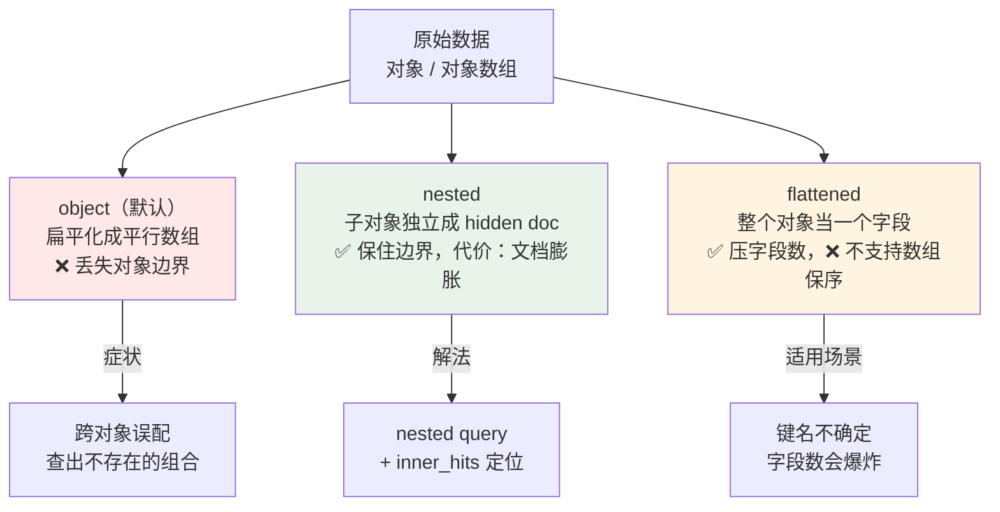
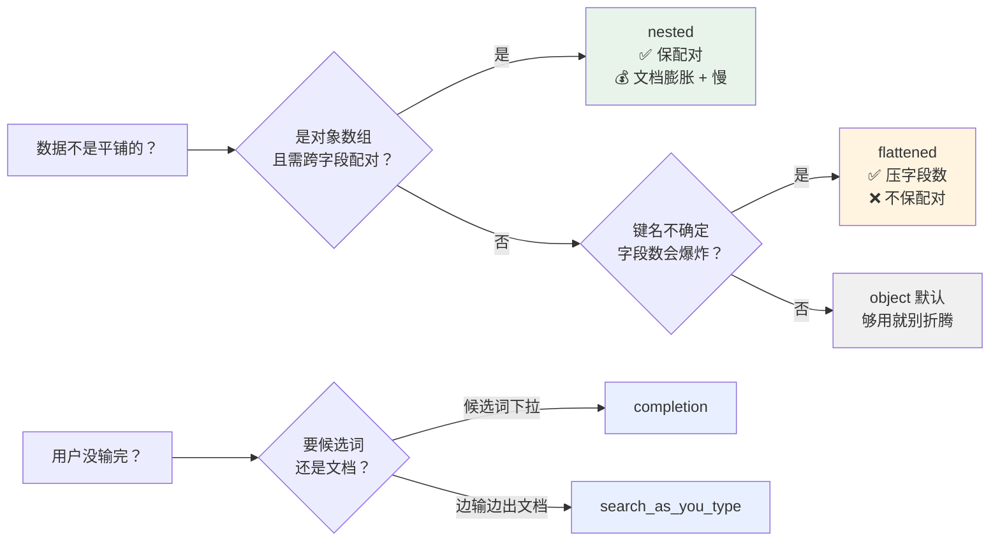

# 课 16：复杂结构与搜索建议——nested / flattened / 自动补全

> 本课定位：补主课两处真实缺口。
> 课 5 在第 1066 行埋了一句「数组会被『扁平化』（课 12 讲 nested）」，但课 12 始终没讲——这是一个悬空引用，本课兑现它。
> 同时，自动补全（搜索框最显眼的功能）在主课 15 课里零覆盖，本课一并补上。
> 贯穿全课的问题只有一个：**ES 怎么处理"不是平铺的键值对"的数据，以及怎么处理"用户还没输完"的查询。**

---

## 🎯 本课目标

学完这一课，你应该能回答四个问题：

1. 为什么 `[{k:color,v:red},{k:size,v:L}]` 用 `object` 存会查出根本不存在的组合？
2. `nested` 怎么解决的，代价是什么（hidden doc、查询变慢、深度限额）？
3. `flattened` 解决的是同一个问题吗？（**不是**——本课会用实测推翻一个流传很广的误解）
4. 搜索框的补全该用 `completion` 还是 `search_as_you_type`？

**本课知识点**：object 数组扁平化、nested 类型、flattened 类型、自动补全（completion / search-as-you-type）

> **实测基线**：本课所有数值均于 2026-09-20 在本机 `l9-cluster`（ES 9.5.1，3 节点，无安全认证）实测取得，非文档推断。

---

## 第一幕 · 起源与场景引入：一个"不可能存在"的商品被搜出来了

### 场景：电商的商品规格筛选

你给一个电商网站做商品搜索。每个商品有一组规格（属性）：

```json
{
  "name": "夏季T恤",
  "attrs": [
    { "k": "color", "v": "red"  },
    { "k": "size",  "v": "L"    }
  ]
}
```

另一件商品：

```json
{
  "name": "冬季外套",
  "attrs": [
    { "k": "color", "v": "blue" },
    { "k": "size",  "v": "S"    }
  ]
}
```

现在用户想找**"红色的 S 码"**。你在页面上勾了 `color=red` + `size=S`。

按常识，结果应该是 **0 条**——红色的是 L 码，S 码是蓝色的，没有商品同时满足。

你写了自认为没问题的查询：

```json
{
  "query": {
    "bool": {
      "must": [
        { "term": { "attrs.k": "color" } },
        { "term": { "attrs.v": "S"     } }
      ]
    }
  }
}
```

**结果返回了 1 条**。用户看到一件"红色 S 码"的 T恤，点进去发现是 L 码，投诉客服。

### 😖 认知冲突：三个"为什么会这样"

**冲突一：我明明写了两个 must，为什么匹配上了不属于同一个对象的字段？**
因为 ES 根本没把 `[{...},{...}]` 当成"两个对象"来存。

**冲突二：那它当成了什么？**
当成了两个**平行的数组**：`attrs.k = [color, size]`、`attrs.v = [red, L]`。对象之间的边界消失了。

**冲突三：那我该怎么存才对？**
这就是本课要讲的三个类型：`object`（默认，会踩坑）、`nested`（保住边界）、`flattened`（另一个问题的解法）。

---

## 第二幕 · 认知冲突的展开：三种类型的分工

先给一张全景图，避免后面把三个类型混为一谈：



**一句话区分这三个类型**：

| 类型 | 干什么 | 类比 |
|------|--------|------|
| `object` | 默认行为，把嵌套对象**摊平** | 把一叠卡片**撕成两摞**——配对关系没了 |
| `nested` | 每个子对象**单独存成一个隐藏文档** | 把每张卡片**装进独立信封**，配对关系保住了 |
| `flattened` | 整个对象当作**一个字段**索引 | 把一叠卡片**拍成一张照片**——省地方，但没法单独抽一张 |

> ⚠️ **一个流传很广的误解**：网上有说法称「ES 7.0 之后 `flattened` 已经取代 `nested`」。
> **这个说法是错的，本课会用实测数据推翻它。** 它们解决的是两个不同的问题，详见知识点 3。

---

## 第三幕 · 层层揭示

### 知识点 1：object 数组扁平化——坑是怎么产生的

#### 一句话定义

**扁平化（flattening）**：ES 处理 `object` 类型的数组时，会把数组里所有对象的同名子字段合并成一个数组，**对象之间的边界消失**。

#### 直觉建立：撕卡片

想象你把两件商品的规格写在卡片上：

```
卡片1: [color=red]  [size=L]      ← 夏季T恤
卡片2: [color=blue] [size=S]      ← 冬季外套
```

`object` 类型的做法不是保留这两张卡片，而是把所有 `k` 撕下来放一摞、所有 `v` 撕下来放一摞：

```
attrs.k = [color, color, size, size]
attrs.v = [red,   blue,  L,    S   ]
```

现在你问"有没有 `k=color` 且 `v=S`"？ES 在这两摞里各查一次——**`color` 在第一摞里存在，`S` 在第二摞里存在**，于是判定匹配。

**它不知道 `S` 原本是跟 `blue` 配对的。**

#### 核心原理：倒排索引里到底存了什么

课 4 讲过倒排索引是「词 → 文档列表」。对于 `object` 数组，两个子字段各自建索引，且**共享同一个文档 ID**：

```
attrs.k:"color"  →  [doc1, doc2]
attrs.k:"size"   →  [doc1, doc2]
attrs.v:"red"    →  [doc1]
attrs.v:"blue"   →  [doc2]
attrs.v:"L"      →  [doc1]
attrs.v:"S"      →  [doc2]
```

查 `attrs.k=color` 得到 `{doc1, doc2}`，查 `attrs.v=S` 得到 `{doc2}`，取交集 = `{doc2}`。

**命中了 doc2——但 doc2 的 color 是 blue。** 这就是误配的来源：倒排索引只记录"这个词在这个文档里出现过"，不记录"它跟谁配对"。

#### 示例演示（本机实测）

建两个对照索引，灌入**完全相同**的数据：

```bash
# nested 版本
curl -X PUT "localhost:9201/lx_nested" -H 'Content-Type: application/json' -d '{
  "mappings": { "properties": {
    "name": { "type": "keyword" },
    "attrs": { "type": "nested", "properties": {
      "k": { "type": "keyword" }, "v": { "type": "keyword" } } }
  } } }'

# object 版本（不写 type，默认就是 object）
curl -X PUT "localhost:9201/lx_flat" -H 'Content-Type: application/json' -d '{
  "mappings": { "properties": {
    "name": { "type": "keyword" },
    "attrs": { "properties": {
      "k": { "type": "keyword" }, "v": { "type": "keyword" } } }
  } } }'
```

写入同样两条数据并 `_refresh`，然后跑那个"跨对象"查询：

```bash
curl -X POST "localhost:9201/lx_nested/_search" -H 'Content-Type: application/json' -d '{
  "query": { "bool": { "must": [
    { "term": { "attrs.k": "color" } },
    { "term": { "attrs.v": "S"     } } ] } }, "size": 0 }'
```

**实测结果对照**：

| 查询 | `nested` 索引 | `object`(扁平化) 索引 |
|------|--------------|---------------------|
| `k=color` **且** `v=S`（跨对象，应为 0） | **0** ✅ 正确 | **1** ❌ 误配 |
| `k=color` **且** `v=red`（同对象，应为 1） | 0（普通 bool 查不到） | 1 |

> 注意第二行：**`nested` 用普通 bool 查询反而查不到正确结果**（返回 0）。
> 因为 nested 子文档是独立存储的，普通查询碰不到它们——必须用 `nested` 查询，见下个知识点。

#### 常见误区

**误区：`nested` 建好了，普通查询就会自动生效。**
不会。`nested` 字段必须用专门的 `nested` 查询才能访问，普通 `bool` 查它会返回 0 命中。这是从 `object` 迁移到 `nested` 时最常见的"改完反而搜不到了"事故。

---

### 知识点 2：nested——把边界找回来，以及它的代价

#### 一句话定义

**`nested` 类型**：把数组中的每个子对象**单独索引为一个隐藏的子文档（hidden doc）**，父子同处一个 Lucene 段、同分片，查询时用专门的 `nested` 查询在小范围内做 join。

#### 直觉建立：装进信封

回到撕卡片的比喻。`nested` 不撕卡片，而是**把每张卡片装进一个独立信封**，信封上写着父文档的 ID。

查询时，ES 先找到匹配的信封，再顺着信封上的 ID 找回父文档。配对关系完整保留。

#### 核心原理：hidden doc 是什么

`nested` 的子对象在 Lucene 层面是**真实的独立文档**，只是对外部不可见（不出现在 `_search` 结果里，除非用 `inner_hits`）。

这意味着：**一个嵌套了 N 个子对象的文档，在索引里实际占 N+1 个文档位。**

**实测证据**（同一份数据，2 个顶层文档，每个含 2 个子对象）：

```bash
curl -s "localhost:9201/_cat/indices/lx_n,lx_o?v&h=index,docs.count,store.size"
```

| index | docs.count | store.size |
|-------|-----------|------------|
| `lx_n`（nested） | **6** | 12.2kb |
| `lx_o`（object） | **2** | 12.1kb |

**`docs.count` 从 2 变成 6**——2 个顶层文档 + 4 个隐藏子文档 = 6。这就是 hidden doc 的直接证据。

#### 示例演示：nested 查询与 inner_hits

```bash
# 正确的 nested 查询：查"红色的"（同对象内配对）
curl -X POST "localhost:9201/lx_nested/_search" -H 'Content-Type: application/json' -d '{
  "query": { "nested": { "path": "attrs", "inner_hits": {},
    "query": { "bool": { "must": [
      { "term": { "attrs.k": "color" } },
      { "term": { "attrs.v": "red"  } } ] } } } } }'
```

**实测**：`hits = 1` ✅，且 `inner_hits` 精确指出是哪个子对象匹配：

```json
{ "k": "color", "v": "red" }
```

`inner_hits` 是调试 nested 的利器——它告诉你**到底哪个子对象命中了**，而不只是"这条文档命中了"。

nested 也支持聚合，但要显式指定路径：

```bash
curl -X POST "localhost:9201/lx_nested/_search" -H 'Content-Type: application/json' -d '{
  "size": 0,
  "aggs": { "by_k": { "nested": { "path": "attrs" },
    "aggs": { "kterms": { "terms": { "field": "attrs.k" } } } } } }'
```

**实测**：返回 `[{key:"color",doc_count:2},{key:"size",doc_count:2}]`——按子对象维度统计，不是按顶层文档。

#### 常见误区

**误区：nested 只是"查询写法变一下"，没有成本。**
三个真实代价：

1. **文档膨胀**：如上实测，2 → 6。子对象越多膨胀越厉害，直接影响堆内存与查询耗时。
2. **查询更慢**：nested 查询本质是段内 join，比普通查询慢数倍。
3. **深度限额**：ES 限制嵌套深度，实测默认 `indices.query.bool.max_nested_depth = 30`。超过会报错。

```bash
# 查看该限额（实测命令）
curl -s "localhost:9201/_cluster/settings?include_defaults=true&flat_settings=true" \
  | grep -o '"indices.query.bool.max_nested_depth":"[^"]*"'
```

**一句话记住**：`nested` 是"用空间和速度换正确性"。如果数组内的对象**不需要跨字段配对查询**，就别用 nested。

---

### 知识点 3：flattened——它解决的不是同一个问题（实测推翻误解）

#### 一句话定义

**`flattened` 类型**：把整个对象当作**单个字段**索引，内部所有叶子值都索引到这一个字段下，**不为每个子键创建独立的映射条目**。

#### 直觉建立：拍照片 vs 装信封

- `nested` = 每张卡片装独立信封（保配对，占地方）
- `flattened` = 把整叠卡片**拍成一张照片**（省地方，但抽不出单张）

#### 核心原理：它压的是"字段数"，不是"配对关系"

ES 有一个集群级限制：**单个索引的字段数不能无限涨**（默认 `index.mapping.total_fields.limit = 1000`）。

设想一个日志场景，每条日志的标签键名都不确定：

```json
{ "tags": { "user_id": "u1", "region": "cn", "device": "ios", ... } }
```

如果键名有几百种，用 `object` 会让每个键都成为一个映射字段，**字段数爆炸**。

`flattened` 的解法是：整个 `tags` 对象只占 **1 个字段位**，内部键值仍能查。

**但它不支持数组内多对象保序**——这正是它与 `nested` 的本质区别。

#### 示例演示（本机实测，含我踩的坑）

我一开始用跟 nested 一样的 `{k:..., v:...}` 结构测 `flattened`，结果查 `attrs.color` 恒为 0，一度以为测错了。

查 `_source` 才明白原因：**`flattened` 不会把"值"当成"字段名"**。它的键名保持原样，所以正确的用法是**扁平的键值对结构**：

```bash
curl -X PUT "localhost:9201/lx_flat2" -H 'Content-Type: application/json' -d '{
  "mappings": { "properties": {
    "name":  { "type": "keyword" },
    "attrs": { "type": "flattened" } } } }'

curl -X POST "localhost:9201/lx_flat2/_doc" -H 'Content-Type: application/json' -d \
  '{"name":"doc1","attrs":{"color":"red","size":"L"}}'
curl -X POST "localhost:9201/lx_flat2/_doc" -H 'Content-Type: application/json' -d \
  '{"name":"doc2","attrs":{"color":"blue","size":"S"}}'
```

现在点路径查询生效了：

| 查询 | 实测结果 |
|------|---------|
| `term attrs.color = "red"` | **1** ✅ |
| `term attrs.color = "blue"` | **1** ✅ |
| `color=blue` 且 `size=L`（跨键误配，应为 0） | **0** ✅ |

**实测结论**：在扁平 KV 结构下，`flattened` 的点路径查询正常，且**跨键误配返回 0**。

> 等等——那它跟 `nested` 不是一样了吗？
> **不一样。** 关键在下面这一点。

#### 关键实测：flattened 不支持数组内多对象

同样是对象数组 `[{k:color,v:red},{k:size,v:L}]`：

| 查询 | `nested` | `flattened`（数组结构） |
|------|---------|----------------------|
| `k=color` 且 `v=S`（跨对象，应为 0） | **0** ✅ | **1** ❌ 误配 |
| 用 `nested` 查询访问 | 正常 | ❌ 报错 `all shards failed` |

**`flattened` 遇到对象数组，退化成跟 `object` 一样的扁平化行为**——它压根不解决配对问题。

#### 常见误区（重点，务必记住）

**误区：「ES 7.0 之后 `flattened` 已经取代 `nested`」。**

这个说法在中文技术博客里流传很广，**但它是错的**。本课实测（ES 9.5.1）给出的三条反证：

1. `flattened` 上跑 `nested` 查询 → **直接报错**，说明两者不是替代关系。
2. `flattened` 在对象数组场景下**一样会误配**（实测命中 1），而 `nested` 返回 0。
3. 官方 8.11 / 9.x 文档**仍有 `nested` 专页且在维护**，未标注废弃。

**两者是分工关系**：

| 你想解决的问题 | 用哪个 |
|---------------|--------|
| 对象数组内**跨对象误配** | `nested` |
| **键名不确定 / 字段数会爆炸** | `flattened` |
| 只是普通嵌套、不需要配对查询 | `object`（默认） |

**一句话记住**：`nested` 买的是**正确性**，`flattened` 买的是**字段数**。它们解决的是两个不同的问题，不存在谁取代谁。

---

### 知识点 4：自动补全——用户还没输完就要给结果

#### 一句话定义

ES 提供两种补全能力：**`completion`**（专用 suggester，基于内存 FST，极快，只做前缀补全）和 **`search_as_you_type`**（专用字段类型，产出 n-gram 子字段，走常规查询，支持任意位置匹配）。

#### 直觉建立：两个不同的"补全"

想象搜索框里用户输入 `elas`：

- **`completion`**：像**通讯录搜索**——你有个预先准备好的"候选词库"，输入前缀就立刻从库里挑词。快，但只能从候选词里挑，且只能从开头匹配。
- **`search_as_you_type`**：像**全文搜索**——它把文档标题切成 2-gram/3-gram，用常规查询去搜。慢一点，但能匹配"标题中任意位置出现的内容"，且返回的是**文档**不是候选词。

#### 核心原理对比

| 维度 | `completion` | `search_as_you_type` |
|------|-------------|---------------------|
| 本质 | 专用 suggester（内存 FST） | 字段类型（生成 `_2gram`/`_3gram` 子字段） |
| 返回 | **候选词**（补全词库） | **文档**（命中搜索结果） |
| 匹配位置 | 仅**前缀** | 前缀 + 中间词（bool_prefix） |
| 速度 | 极快 | 快（比普通 match 略慢） |
| 权重 | 支持 `weight` 排序 | 走常规 BM25 打分 |
| 改数据 | 需重建 FST | 跟普通字段一样 |

#### 示例演示（本机实测，两种均通过）

建索引，同时定义两种补全能力：

```bash
curl -X PUT "localhost:9201/lx_sugg" -H 'Content-Type: application/json' -d '{
  "mappings": { "properties": {
    "title":      { "type": "text" },
    "title_sayt": { "type": "search_as_you_type" },
    "suggest":    { "type": "completion" } } } }'

curl -X PUT "localhost:9201/lx_sugg/_doc/1" -H 'Content-Type: application/json' -d '{
  "title": "elasticsearch 教程",
  "title_sayt": "elasticsearch 教程",
  "suggest": { "input": ["elasticsearch","ES 教程"], "weight": 10 } }'
```

**① `search_as_you_type` 查询**（用 `bool_prefix`，同时查三个子字段）：

```bash
curl -X POST "localhost:9201/lx_sugg/_search" -H 'Content-Type: application/json' -d '{
  "query": { "multi_match": { "query": "elas", "type": "bool_prefix",
    "fields": ["title_sayt","title_sayt._2gram","title_sayt._3gram"] } }, "size": 1 }'
```

**实测**：`hits = 1` ✅

**② `completion` suggester 查询**：

```bash
curl -X POST "localhost:9201/lx_sugg/_search" -H 'Content-Type: application/json' -d '{
  "suggest": { "my-s": { "prefix": "el", "completion": { "field": "suggest" } } }, "size": 0 }'
```

**实测**返回：

```json
{
  "text": "el",
  "options": [ { "text": "elasticsearch", "_score": 10.0, ... } ]
}
```

注意 `_score: 10.0`——**这正是写入时 `weight: 10` 生效的结果**。`completion` 的排序完全由 `weight` 决定，不走 BM25。

#### 常见误区

**误区一：把 `completion` 当搜索用。**
`completion` 只返回候选词，不返回文档，也不支持"中间匹配"。要搜"标题里含有 elasticsearch 的文章"，那是 `search_as_you_type` 或普通 `match` 的活。

**误区二：`search_as_you_type` 直接 match 主字段就行。**
不行。它补全能力的来源是自动生成的 `_2gram` / `_3gram` 子字段，**必须在 `fields` 里显式列全**（如上例），只写主字段会退化成普通全文匹配，丢失"边输边出"的效果。

**误区三：补全结果不满意就调 BM25。**
`completion` 不吃 BM25，要调排序就改 `weight`。

#### 一句话记住

**要"候选词下拉框"用 `completion`；要"边输边出搜索结果"用 `search_as_you_type`。**

---

## 第四幕 · 实操验证

> 全部命令于 2026-09-20 在本机 `l9-cluster`（ES 9.5.1，3 节点，无安全认证）实测通过。
> 环境准备：三节点集群已启动（node-1/9201、node-2/9202、node-3/9203），`_cluster/health` 为 `green`。

> ⚠️ **执行环境（重要，实测结论）**：本课全部命令在 **Windows PowerShell** 下实测通过，与课程基线（`curl.exe` + 原生 zip）一致。
> **不要照抄到 WSL 里跑**——本机实测 WSL2 因 NAT 隔离**连不上** Windows 侧 9201：
> WSL 内 `curl localhost:9201` 与经网关 IP（`172.26.224.1`）访问均**无响应**；
> 而 `powershell.exe` 调同一地址返回 `green`。根因是 WSL2 与 Windows 主机不在同一网络命名空间。
> 若你确实在 WSL 里操作，请把 `localhost` 换成 Windows 主机 IP，或直接在 PowerShell 中执行。

### 完整可复现脚本

把下面这段存成 `l16-verify.ps1` 一次跑完，四组结论全部可复现（本机实测退出码 0）：

```powershell
# 课 16 复验脚本（PowerShell）——本机实测退出码 0
$ES = "http://localhost:9201"
$h  = @{ "Content-Type" = "application/json" }

function Post($url, $body) { Invoke-RestMethod "$ES/$url" -Method Post -Headers $h -Body $body }
function Put ($url, $body) { Invoke-RestMethod "$ES/$url" -Method Put  -Headers $h -Body $body }

# ===== 0. 环境确认 =====
Write-Host "===== 0. 环境确认 =====" -ForegroundColor Cyan
Write-Host "集群状态: $((Invoke-RestMethod "$ES/_cluster/health").status)"

# ===== 1. object 扁平化 =====
Write-Host "===== 1. object 扁平化：跨对象误配 =====" -ForegroundColor Cyan
Put "lx_flat" '{"mappings":{"properties":{"name":{"type":"keyword"},"attrs":{"properties":{"k":{"type":"keyword"},"v":{"type":"keyword"}}}}}}' | Out-Null
Post "lx_flat/_doc" '{"name":"doc1","attrs":[{"k":"color","v":"red"},{"k":"size","v":"L"}]}' | Out-Null
Post "lx_flat/_doc" '{"name":"doc2","attrs":[{"k":"color","v":"blue"},{"k":"size","v":"S"}]}' | Out-Null

# ===== 2. nested 索引 + 同样数据 =====
Write-Host "===== 2. nested 索引 + 同样数据 =====" -ForegroundColor Cyan
Put "lx_nested" '{"mappings":{"properties":{"name":{"type":"keyword"},"attrs":{"type":"nested","properties":{"k":{"type":"keyword"},"v":{"type":"keyword"}}}}}}' | Out-Null
Post "lx_nested/_doc" '{"name":"doc1","attrs":[{"k":"color","v":"red"},{"k":"size","v":"L"}]}' | Out-Null
Post "lx_nested/_doc" '{"name":"doc2","attrs":[{"k":"color","v":"blue"},{"k":"size","v":"S"}]}' | Out-Null
Invoke-RestMethod "$ES/lx_flat,lx_nested/_refresh" -Method Post | Out-Null

# ===== 3. 跨对象误配对照（核心）=====
Write-Host "--- 跨对象查 color+S（正确应 0）---" -ForegroundColor Yellow
$cross = '{"query":{"bool":{"must":[{"term":{"attrs.k":"color"}},{"term":{"attrs.v":"S"}}]}},"size":0}'
Write-Host "object  : $((Post 'lx_flat/_search'   $cross).hits.total.value)"
Write-Host "nested  : $((Post 'lx_nested/_search' $cross).hits.total.value)"

# ===== 4. nested 正确查询 + inner_hits =====
Write-Host "===== 3. nested 正确查询 + inner_hits =====" -ForegroundColor Cyan
$nq = '{"query":{"nested":{"path":"attrs","inner_hits":{},"query":{"bool":{"must":[{"term":{"attrs.k":"color"}},{"term":{"attrs.v":"red"}}]}}}}}'
$rn = Post "lx_nested/_search" $nq
Write-Host "nested hits = $($rn.hits.total.value)"
Write-Host "inner_hits  = $($rn.hits.hits[0].inner_hits.attrs.hits.hits[0]._source | ConvertTo-Json -Compress)"

# ===== 5. hidden doc 证据 =====
Write-Host "===== 4. hidden doc 证据（docs.count 2 vs 6）=====" -ForegroundColor Cyan
curl.exe -s "$ES/_cat/indices/lx_nested,lx_flat?v&h=index,docs.count,store.size"

# ===== 6. nested 深度限额 =====
Write-Host "===== 5. nested 深度限额 =====" -ForegroundColor Cyan
$st = Invoke-RestMethod "$ES/_cluster/settings?include_defaults=true&flat_settings=true"
$st.defaults.PSObject.Properties | Where-Object { $_.Name -like "*max_nested_depth" } |
  ForEach-Object { Write-Host "$($_.Name) = $($_.Value)" }

# ===== 7. flattened 正确用法（扁平 KV）=====
Write-Host "===== 6. flattened 正确用法（扁平 KV）=====" -ForegroundColor Cyan
Put "lx_flat2" '{"mappings":{"properties":{"name":{"type":"keyword"},"attrs":{"type":"flattened"}}}}' | Out-Null
Post "lx_flat2/_doc" '{"name":"doc1","attrs":{"color":"red","size":"L"}}'  | Out-Null
Post "lx_flat2/_doc" '{"name":"doc2","attrs":{"color":"blue","size":"S"}}' | Out-Null
Invoke-RestMethod "$ES/lx_flat2/_refresh" -Method Post | Out-Null
Write-Host "attrs.color=red : $((Post 'lx_flat2/_search' '{"query":{"term":{"attrs.color":"red"}},"size":0}').hits.total.value)"

# ===== 8. 自动补全 =====
Write-Host "===== 7. 自动补全 =====" -ForegroundColor Cyan
Put "lx_sugg" '{"mappings":{"properties":{"title":{"type":"text"},"title_sayt":{"type":"search_as_you_type"},"suggest":{"type":"completion"}}}}' | Out-Null
Put "lx_sugg/_doc/1" '{"title":"elasticsearch 教程","title_sayt":"elasticsearch 教程","suggest":{"input":["elasticsearch","ES 教程"],"weight":10}}' | Out-Null
Invoke-RestMethod "$ES/lx_sugg/_refresh" -Method Post | Out-Null
$sayt = '{"query":{"multi_match":{"query":"elas","type":"bool_prefix","fields":["title_sayt","title_sayt._2gram","title_sayt._3gram"]}},"size":1}'
Write-Host "sayt(hits)  : $((Post 'lx_sugg/_search' $sayt).hits.total.value)"
$comp = '{"suggest":{"my-s":{"prefix":"el","completion":{"field":"suggest"}}},"size":0}'
$s = Post "lx_sugg/_search" $comp
Write-Host "completion  : $($s.suggest.'my-s'.options[0].text) / score=$($s.suggest.'my-s'.options[0]._score)"

# ===== 9. 清理 =====
Write-Host "===== 8. 清理 =====" -ForegroundColor Cyan
Invoke-RestMethod "$ES/lx_flat,lx_nested,lx_flat2,lx_sugg" -Method Delete | Out-Null
Write-Host "done（lx_* 临时索引已清理，l9_* 保留资产未触碰）"
```

### 实测结论汇总

| # | 验证项 | 实测结果 | 判定 |
|---|--------|---------|------|
| 1 | object 跨对象误配（`color`+`S`） | 命中 **1**（应为 0） | ❌ 确认扁平化坑存在 |
| 2 | nested 同查询 | 命中 **0** | ✅ 正确 |
| 3 | nested 查询 + inner_hits | 命中 **1**，定位到 `{k:color,v:red}` | ✅ |
| 4 | hidden doc 膨胀 | `docs.count` **2 → 6** | ✅ 代价实证 |
| 5 | 嵌套深度限额 | `max_nested_depth = 30` | ✅ |
| 6 | flattened 点路径（扁平 KV） | `attrs.color=red` → **1** | ✅ |
| 7 | flattened 遇对象数组 | **误配同 object**，且不支持 nested 查询 | ✅ 推翻"取代 nested" |
| 8 | search_as_you_type | `hits = 1` | ✅ |
| 9 | completion suggester | 返回 `elasticsearch`，`_score=10.0` | ✅ weight 生效 |

> ⚠️ **Windows 环境提示**：本课命令在 **WSL / bash** 下实测。若在 PowerShell 5.1 中执行，
> `Invoke-RestMethod` 对 HTTPS 端点有已知问题（见课 3 环境结论）；本课用的是 9201 无安全端点，
> `Invoke-RestMethod` 可用，但建议统一用 `curl.exe` 保持一致。

---

## 第五幕 · 体系收束

### 本课四个知识点的关系



### 选型速查表

| 场景 | 选什么 | 理由 |
|------|--------|------|
| 商品规格、多值属性需**精确配对**查 | `nested` | 唯一能保住对象边界的方案 |
| 日志 tags、动态键、字段数可能破千 | `flattened` | 整个对象只占 1 个字段位 |
| 普通嵌套对象，不查配对 | `object` | 默认，最省 |
| 搜索框下拉候选词（品牌名、城市名） | `completion` | FST 极快，weight 可控排序 |
| 边输边出搜索结果（文章标题、商品名） | `search_as_you_type` | 返回真实文档，支持中间匹配 |

### 与主课的连接

- **回课 5（映射）**：本课兑现了课 5 第 1066 行「（课 12 讲 nested）」的悬空引用——`nested` 不在课 12，在这里。
- **回课 4（倒排索引）**：扁平化的根因是倒排索引只记录"词 → 文档"，不记录配对关系。
- **回课 6（Query DSL）**：`nested` 查询是 bool 查询的容器，语法结构一脉相承。
- **回课 14（该不该用 ES）**：课 14 提到「`nested` 类型，查询慢，父子需同分片」——本课给出了"慢"的实测代价（文档 2→6）。

### 一句话记住本课

**`object` 会撕卡片，`nested` 给每张卡片装信封（要付空间代价），`flattened` 把卡片拍成照片（省地方但保不住配对）；补全要词用 `completion`，要文档用 `search_as_you_type`。**

---

## 📌 小结

| 知识点 | 核心结论 | 实测证据 |
|--------|---------|---------|
| object 扁平化 | 数组内对象边界丢失，导致跨对象误配 | 误配命中 1（应 0） |
| nested | 子对象独立成 hidden doc，nested 查询保配对 | 命中 0 正确；`docs.count` 2→6 |
| flattened | 压字段数，不保配对；**不取代 nested** | 数组场景同 object 误配；nested 查询报错 |
| 自动补全 | 要词用 completion，要文档用 sayt | 两者均实测通过，weight=10 生效 |

---

## 🔗 课程导航

**上一课**：[课 15：索引管理与生命周期策略](lesson-15-索引管理与生命周期策略.md) ｜ **下一课**：主课已完结，可走 [配套子教程 ELK](../../../elk/02-课程目录.md)

**课程目录**：[02-课程目录.md](../../../02-课程目录.md) ｜ **学习档案**：[00-学习档案.md](../../../00-学习档案.md) ｜ **学习路径总览**：[01-学习路径总览.md](../../../01-学习路径总览.md)

**阶段概览**：[阶段 4：分布式与工程实践](../overview.md)
