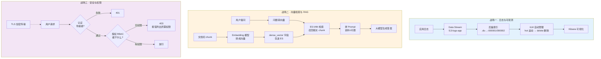

# 课 13 · 三大主战场

> 阶段 5《生产与选型》第 1 课 ｜ 知识点：日志与可观测 / 向量检索与 RAG / 安全与权限
> 环境：本机 ES 9.5.1（Windows 原生 zip）＋ Node.js v22.14.0 ｜ 标注「实测」者均有命令与输出原文

---

## 🧭 课程导航

| 上一阶段 | 本课 | 下一课 |
|---------|------|--------|
| [课12 接入真实项目](../../4-分布式与工程实践/lessons/lesson-12-接入真实项目.md) | **课13 三大主战场** | [课14 该不该用 ES](lesson-14-该不该用ES.md) |

**本课在体系中的位置**：阶段 5 的开篇。前四个阶段回答的是「ES 怎么用」，从本课开始回答「ES 用在哪」——把你已有的能力，对上真实世界最有价值的三个场景。

---

## 📖 五幕结构

### 第一幕 · 场景引入：你会用 ES，但不知道它能用在哪

学完课 12，你已经能把 ES 接进项目了。现在假设你在技术选型会上，有人问：

> **"我们到底该在什么场景下用 ES？"**

你大概会说「搜索」。这没错，但太窄了。现实是——ES 在业界主要被用在三个方向，而**「搜索」只是其中之一**：

| 场景 | 典型画面 | 你可能没意识到 |
|------|---------|--------------|
| **日志 / 可观测** | 几百台服务器的日志全灌进 ES，在 Kibana 上看曲线 | 这是**大多数人接触 ES 的第一个场景**，甚至早于搜索 |
| **向量检索 / RAG** | 公司文档丢进 ES，让大模型据文档回答 | ES 近年最重要的新方向，9.x 密集增强 |
| **安全与权限** | 生产集群必须设账号密码，A 部门看不到 B 部门的数据 | 不是"可选配置"，是**上线前的硬门槛** |

这三个方向各自有独立的知识块。本课把它们一个个拆开讲，并且**每一个都在本机真跑一遍**。

---

### 第二幕 · 认知冲突：三个"想当然"的坑

**冲突一：日志索引会无限膨胀，然后集群就死了**

很多人把日志写进一个叫 `logs` 的索引，然后不管了。三个月后，这个索引有 5 TB、几千个分片，集群开始变慢、分片分配失败、最后 red。

**日志是有时间属性的数据**，它需要一套完全不同的管理方式：**索引不该一直长大，而应该定期"换个新的"**。这就是 Data Stream + ILM 要解决的问题。

**冲突二：关键词搜不到"意思对但词不对"的内容**

你搜「宠物」，ES 给你"猫是一种宠物"。那"狗是人类的朋友"呢？**搜不到**——因为它不包含"宠物"这两个字。

本课实测：关键词搜「宠物」只命中 1 条；换成向量检索，命中 3 条，**而且"狗"排在"猫"前面**。

**冲突三：ES 装好就能用，安全是运维的事**

ES 默认**不带任何访问控制**（本机 9201 集群就是这么配的，方便学习）。但生产环境如果这样上线，等于把全公司的数据公开。

本课实测：给一个只读用户写数据，返回 **403**，报错原文直接告诉你缺哪些权限。

---

### 第三幕 · 层层揭示

---

## 知识点 1：日志与可观测

### 一句话定义

**日志场景**指把系统产生的时序日志写入 ES，用于检索、聚合分析与可视化监控；配套的**可观测（Observability）**是把日志、指标、链路追踪三者打通，回答"系统现在怎么了"。

### 直觉建立：日志是"每天换一本的流水账"

想象你在记账：

- 你不会用**一本永远写不完的账本**——写到第 500 页时，想找三月的某笔账得翻半天
- 你会**每月用一本新账本**，旧账本归档，超过一年就扔掉

ES 管日志也是这个思路，只是自动化了：

| 记账 | ES 日志方案 | 对应技术 |
|------|-----------|---------|
| 每月换一本新账本 | 定期创建新索引 | **Rollover（滚动）** |
| 账本按月份编号 | 索引名带日期 | **Data Stream（数据流）** |
| 超过一年就扔 | 老索引自动删除 | **ILM（索引生命周期管理）** |

> ⚠️ **类比的边界**：账本你可以翻回去改，但 **Data Stream 是只追加（append-only）的**。想改日志得先找到它在哪个后备索引里，再对那个具体索引操作——这是 Data Stream 的一个真实约束。

### 核心原理：Data Stream 是怎么"自动换本子"的

**Data Stream（数据流）** 是对外的一个"名字"，背后挂着若干个真实的**后备索引（Backing Index）**。

```
你写代码只认这个名字
        │
        ▼
  l13-logs-app  ←──── 写入请求自动路由到「当前写索引」
        │
        ├──> .ds-l13-logs-app-2026.09.01-000001  (旧的，只读)
        ├──> .ds-l13-logs-app-2026.09.01-000002  (新的，正在写) ← 写入都落这
        └──> ...未来的 000003
```

三个关键机制：

1. **写入**：你永远往 `l13-logs-app` 写，ES 自动路由到最新的那个后备索引
2. **读取**：你搜 `l13-logs-app`，ES 自动**横跨所有后备索引**——你不用管数据在哪一本里
3. **滚动（Rollover）**：达到条件（比如满 1 天、或主分片到 50 GB）就自动建一个新的，旧的封存

**ILM（Index Lifecycle Management）** 则是定义"什么时候滚动、什么时候删"的自动化策略。它有五个阶段：

| 阶段 | 干什么 | 典型配置 |
|------|-------|---------|
| **Hot** | 正在写入、频繁查询 | 滚动条件：50 GB 或 1 天 |
| **Warm** | 不再写入，偶尔查 | 缩分片、强制合并段 |
| **Cold** | 极少查询 | 降副本、移到廉价存储 |
| **Frozen** | 几乎不查 | 转成可搜索快照 |
| **Delete** | 删除 | 滚动后 30 天删 |

> 📌 本课本机用的是 **basic license**，实测 Hot + Delete 两阶段完全可用。Warm/Cold/Frozen 涉及的数据分层在 basic 下受限。

### 常见误区

| 误区 | 真相 |
|------|------|
| "日志全写进一个 `logs` 索引就行" | 索引会无限膨胀。**要用 Data Stream 自动滚动** |
| "ILM 配好就立刻生效" | ILM 有轮询间隔（`indices.lifecycle.poll_interval`，默认 **10 分钟**），不是实时的 |
| "Data Stream 里能随便改日志" | 它是**只追加**的。改单条要先定位到具体后备索引 |
| "rollover 后老数据要手动搬" | 不用。搜 Data Stream 名字会**自动跨所有后备索引** |

### 一句话记住

> **日志要不只写不删——Data Stream 负责自动换本子，ILM 负责自动丢旧的。**

---

## 知识点 2：向量检索与 RAG

### 一句话定义

**向量检索**把内容（文本/图片/音频）转成一串数字（向量），用"向量之间的距离"衡量语义相似度；**RAG（Retrieval-Augmented Generation）** 则是"先从 ES 检索出相关资料，再把资料和问题一起交给大模型生成答案"的架构。

### 直觉建立：给每个词在地图上标一个坐标

想象一张巨大的地图：

- 「猫」「狗」「宠物」被标在**相邻的角落**（都是动物）
- 「手机」「电脑」在**另一片区域**（都是电子设备）
- 「披萨」「汉堡」在**第三个区域**（都是食物）

这张地图上，**位置越近 = 意思越接近**。这就是向量检索的核心思想。

原来的关键词搜索是"逐字比对"——你搜"宠物"，只有**字面上写了"宠物"**的才命中。而向量搜索是"找地图上离你最近的邻居"——你站在"宠物"这个坐标，**"狗"就在旁边，自然被找到**，哪怕它通篇没提"宠物"两个字。

> ⚠️ **类比的边界**：真实 embedding 模型产出的向量通常有 **384 / 768 / 1536 维**，不是地图的 2 维。而且这些维度**没有"这一维代表动物性"这种可解释含义**——它们是模型自己学出来的。本课为了让你看得懂，手工构造了 3 维且赋予了语义含义，这是教学简化，不是真实情况。

### 先搞清一件事：关键词搜索到底解决不了什么

在讲向量之前，先用三个真实例子看清**关键词搜索的天花板**——这样你才知道向量检索为什么被发明出来：

| 用户想找 | 用户输入的词 | 关键词搜索的困境 |
|---------|------------|----------------|
| 找宠物相关的商品 | 「宠物」 | 商品标题写的是"金毛犬粮"、"猫爬架"，**没有"宠物"两个字** → 搜不到 |
| 找"怎么退款" | 「钱多久到账」 | 帮助文档写的是"结算周期" → 词不匹配，**搜不到** |
| 找"卡顿"的原因 | 「系统很慢」 | 日志里写的是 `timeout`、`latency` → 中文词对不上英文，**搜不到** |

**根本原因**：关键词搜索比的是**字面**，而用户表达的是**意图**。同一意图有一百种说法，你不可能把同义词全穷举出来。

**向量的思路**：别比字面了——把"意思"本身变成一串数字，然后比较**数字之间的距离**。意思越接近，距离越近。

### 核心原理：dense_vector 与 kNN

**第一步：把内容变成向量（Embedding）**

这一步由 embedding 模型完成，ES 只负责**存**这些向量。字段类型是 `dense_vector`：

```json
{
  "mappings": {
    "properties": {
      "title":     { "type": "text" },
      "embedding": { "type": "dense_vector", "dims": 3, "similarity": "cosine" }
    }
  }
}
```

两个必填参数：

| 参数 | 含义 | 注意 |
|------|------|------|
| `dims` | 向量维度 | **必须和写入的向量长度一致**，且 ≤ 4096 |
| `similarity` | 相似度算法 | 文本语义检索用 `cosine`（余弦）最普遍 |

**第二步：用 kNN 找最近的邻居**

```javascript
await client.search({
  index: 'l13_vector_demo',
  knn: {
    field: 'embedding',
    query_vector: [0.88, 0.05, 0.05],  // 查询向量
    k: 3,                               // 返回最相似的 3 条
    num_candidates: 10,                 // 每个分片先粗筛 10 个候选
  },
})
```

**关键认知**：这是**近似**搜索（Approximate kNN），底层用 HNSW 算法。它牺牲一点点精度换速度——`num_candidates` 调大，结果更准但更慢。

**生产方式：semantic_text 自动挡 vs dense_vector 手动挡**

官方提供了两条路，选哪条取决于你要不要自己管模型：

| 方式 | 谁生成向量 | 适合 |
|------|-----------|------|
| **`semantic_text` 字段**（9.x 推荐） | ES 自动调用 inference endpoint 生成 | 快速上手、不想管模型 |
| **`dense_vector` 字段**（本课实测用这条） | 你在外部用 embedding 模型生成好再写入 | 已有向量、非文本数据、要自定义评分 |

官方原话：*"For most use cases, the `semantic_text` field type is the recommended starting point."*

> 🐞 **但本机实测了一个很狡猾的坑**（basic license）：`semantic_text` 字段**能建索引、能建映射，但一写入就报错**——
>
> ```
> 索引创建: ✅
> 写入报错: security_exception
> 根因: current license is non-compliant for [inference]
> ```
>
> 原因：`semantic_text` 依赖 **inference（推理）** 能力，而 inference 在 basic license 下不可用。连单独建 inference endpoint 也会被直接拒绝，报同样的 `current license is non-compliant for [inference]`。
>
> **这个坑狡猾在哪**：建索引时**一声不响**，让你以为配好了；直到写入那一刻才炸。**排障记住：报 `non-compliant for [inference]` 是 license 级别不够，不是你配置写错了。**
>
> 所以本课用 `dense_vector` 手动挡——它不依赖 inference，basic license 下完全可用，而且能让你看清向量到底是什么。

**第三步：RAG —— 检索只是前半段**

RAG = **R**etrieval（检索）+ **A**ugmented（增强）+ **G**eneration（生成）。ES 只负责第一个 R：

```
用户提问
   │
   ├─[Embedding]─> 问题向量
   │
   ├─[ES kNN 检索]─> 召回最相关的 N 个文档片段（chunk）   ← ES 负责这步
   │
   ├─[拼 Prompt]─> "根据以下资料回答：{资料} + {问题}"
   │
   └─[大模型]─> 生成答案                                  ← LLM 负责这步
```

### 实测：关键词 vs 向量，差距有多大

本课构造了 6 条数据，手工赋予 3 维语义向量（维度1≈动物、维度2≈科技、维度3≈食物）。搜「宠物」：

**关键词搜索**（`match`）：

```
命中数: 1
  - 猫是一种宠物 | score: 3.149
```

**向量搜索**（kNN，查询向量 = 动物语义 `[0.88, 0.05, 0.05]`）：

```
命中数: 3
  - 狗是人类的朋友     | score: 0.9992   ← 排第一，但标题里没有"宠物"两个字
  - 猫是一种宠物       | score: 0.9985
  - 披萨是意大利美食   | score: 0.5571
```

**这就是语义搜索的价值**：关键词搜到 1 条，向量搜到 3 条，而且把**语义最相关但字面不匹配**的"狗"排在了第一。

换个查询向量（科技语义 `[0.0, 0.92, 0.0]`），召回立刻切换：

```
  - 手机是通讯工具 | score: 0.9994
  - 笔记本电脑     | score: 0.9992
  - 汉堡是快餐     | score: 0.5578
```

### 常见误区

| 误区 | 真相 |
|------|------|
| "向量维度可以随便填" | **必须和写入的一致**。实测填错会报 `The query vector has a different number of dimensions [2] than the document vectors [3]` |
| "ES 能自己把文本变成向量" | ES 只存向量。**生成向量要靠 embedding 模型**（或用 9.x 的 `semantic_text` 字段类型，它会自动管理模型） |
| "向量检索会取代关键词检索" | 不会。**两者是互补的**，生产常用"混合检索"：向量召回 + 关键词精筛 |
| "RAG 就是向量搜索" | 向量搜索只是 RAG 的**检索环节**，后面还有"拼 Prompt"和"大模型生成"两步 |

### 一句话记住

> **向量检索＝在语义地图上找邻居；RAG＝ES 负责找资料，大模型负责写答案，两者缺一不可。**

---

## 知识点 3：安全与权限

### 一句话定义

**ES 安全体系**解决三件事：你是谁（**认证 Authentication**）、你能干什么（**授权 Authorization**，ES 用 RBAC 角色模型）、以及传输过程是否加密（**TLS**）。

### 直觉建立：公司的门禁卡

把 ES 集群想成一栋办公楼：

- **认证（你是谁）**：进门要刷工牌。没有工牌 = 401 拒绝
- **授权（你能干什么）**：工牌决定了你能进哪些房间。普通员工进不了机房 = 403 拒绝
- **TLS（传输加密）**：走廊里的监控和加密通话，防止别人偷听

**ES 的 RBAC 模型**由三层组成：

```
用户（User）──属于──> 角色（Role）──拥有──> 权限（Privilege）
```

你**不直接给用户赋权限**，而是把权限打包成角色，再把角色分配给用户。这样人员变动时只需改角色分配。

三个粒度从粗到细：

| 粒度 | 你能控制到 | 本机 basic license |
|------|-----------|-------------------|
| **索引级** | 能不能看某个索引 | ✅ **可用**（本课实测） |
| **字段级**（Field-level） | 能看索引，但**某些字段看不见** | ❌ 需付费 license |
| **文档级**（Document-level） | 能看索引，但**只看到符合某查询的文档** | ❌ 需付费 license |

> ⚠️ **本机预期**：两个集群都是 basic license，**字段级/文档级安全用不了**。如果你在本机尝试，会得到 license 相关的报错——这不是你配置错了。
>
> 本课只实测索引级（最常见、也最够用）。字段级/文档级的写法是给角色加上 `field_security` 或 `query` 参数，等你有付费 license 时照着加即可。

### 核心原理：三类权限

| 类型 | 作用范围 | 常用值 |
|------|---------|-------|
| **集群权限** | 整个集群的操作 | `monitor`（看健康）、`manage`（管理）、`all` |
| **索引权限** | 具体索引的读写 | `read`、`write`、`create_index`、`delete_index`、`all` |
| **应用权限** | Kibana 等应用 | `application` 段配置 |

**内置用户**：`elastic`（超级管理员）、`kibana_system`、`logstash_system`、`beats_system`、`apm_system`、`remote_monitoring_user`。

> 🐞 **本机的真实教训**：9200 集群的 `elastic` 密码曾被重置，档案里记的旧密码 `ESlearn2026` 已失效，当前是 `9PvhcGNNc86uFZb_ePAN`。**密码会变，档案会过时，用之前先验证。**

### 实测：权限矩阵全验证

本课在 9200 集群（已开安全）上建了一个只读角色，然后逐项验证：

```json
{
  "cluster": ["monitor"],
  "indices": [
    { "names": ["l8_orders*"], "privileges": ["read", "view_index_metadata"] },
    { "names": ["l6_shop"],    "privileges": ["read"] }
  ]
}
```

| 操作 | 结果 | 报错原文（关键部分） |
|------|------|-------------------|
| 读 `l8_orders/_count` | ✅ **24 条** | — |
| 往 `l8_orders` 写数据 | ❌ **403** | `action [indices:data/write/index] is unauthorized ... granted by the index privileges [create_doc,create,index,write,all]` |
| 读未授权的 `l7_news` | ❌ **403** | `action [indices:data/read/search] is unauthorized ... granted by the index privileges [read,all]` |
| 删索引 `l6_shop` | ❌ **403** | `action [indices:admin/delete] is unauthorized ... granted by the index privileges [delete_index,manage,all]` |
| 看集群健康（`monitor`） | ✅ **green** | — |
| 不带任何凭据访问 | ❌ **401** | — |
| 用错误密码访问 | ❌ **401** | — |

**这个报错格式值得单独说**：ES 的 403 报错**不只说"不行"，还会告诉你"需要哪些权限才行"**：

```
action [indices:data/write/index] is unauthorized for user [l13_reader]
with effective roles [l13_readonly] on indices [l8_orders],
this action is granted by the index privileges [create_doc,create,index,write,all]
```

看到最后那句了吗？**它直接列出了所有能授予这个动作的权限名**。排障时照着加就行，不用猜。

**401 vs 403 的区别**（这是面试和排障都爱问的）：

| 状态码 | 含义 | 类比 |
|--------|------|------|
| **401** | 你是谁？我不知道 | 没带工牌 / 工牌是假的 |
| **403** | 我知道你是谁，但你没权限 | 工牌是真的，但进不了这个房间 |

### 常见误区

| 误区 | 真相 |
|------|------|
| "ES 默认就是安全的" | **错**。8.x 起默认开启，但很多自建集群（包括本机 9201 学习集群）**手动关掉了** |
| "设个密码就够了" | 不够。还要配 **TLS**（否则密码在网络上明文传输），生产还要做**角色细分** |
| "一个人一个角色" | 应该反过来：**一个角色给多个人**。权限绑在角色上，不绑在人上 |
| "403 报错看不懂" | 报错最后一句**列出了需要哪些权限**，照着加即可 |

### 一句话记住

> **认证管"你是谁"（401），授权管"你能干什么"（403）；权限绑角色不绑人；403 的报错会告诉你缺哪些权限。**

---

### 第四幕 · 实操验证

> ⚠️ **本课的环境前提**：本机两个集群都是 **basic license**（实测 `_license` 返回 `"type": "basic"`）。ILM 与基础安全 API 可用；但文档级/字段级安全、部分数据分层动作需要付费 license，本课不做。

#### 第 1 步：建 ILM 策略（先写 JSON 文件）

> 💡 **本机写法提醒**（课 10 已实测）：本机**没有 Git Bash**，CMD 不认单引号。复杂 JSON 一律用 `--data-binary @文件.json`，不要内联。

```json
// playground/l13-ilm-policy.json
{
  "policy": {
    "phases": {
      "hot": {
        "min_age": "0ms",
        "actions": {
          "rollover": { "max_primary_shard_size": "50gb", "max_age": "1d" },
          "set_priority": { "priority": 100 }
        }
      },
      "delete": { "min_age": "30d", "actions": { "delete": {} } }
    }
  }
}
```

```powershell
curl.exe -s -X PUT "http://localhost:9201/_ilm/policy/l13_logs_policy" `
  -H "Content-Type: application/json" --data-binary "@l13-ilm-policy.json"
```

> 💡 **反引号说明**：PowerShell 用 `` ` ``（反引号）做续行，不是 CMD 的 `^`。本课本机全程用 PowerShell，所以续行统一用反引号。

**实测输出**：`{"acknowledged":true}`，策略版本 `1`。

#### 第 2 步：建 index template，绑定策略

```json
// playground/l13-logs-template.json
{
  "index_patterns": ["l13-logs-*"],
  "data_stream": {},
  "priority": 200,
  "template": {
    "settings": {
      "number_of_shards": 1,
      "number_of_replicas": 0,
      "index.lifecycle.name": "l13_logs_policy"
    },
    "mappings": {
      "properties": {
        "@timestamp": { "type": "date" },
        "message": { "type": "text" },
        "level": { "type": "keyword" },
        "service": { "type": "keyword" }
      }
    }
  }
}
```

关键两处：`"data_stream": {}` 声明这是个数据流模板；`index.lifecycle.name` 把 ILM 策略绑上去。

#### 第 3 步：写日志，Data Stream 自动创建

```powershell
curl.exe -s -X POST "http://localhost:9201/l13-logs-app/_doc?refresh=true" `
  -H "Content-Type: application/json" --data-binary "@l13-log1.json"
```

**实测输出**：三条全部 `created`。查看数据流：

```
"name" : "l13-logs-app",
"timestamp_field" : { "name" : "@timestamp" },
"indices" : [
  { "index_name" : ".ds-l13-logs-app-2026.09.01-000001",
    "managed_by" : "Index Lifecycle Management",
    "ilm_policy" : "l13_logs_policy" }
],
"generation" : 1,
"status" : "GREEN",
"ilm_policy" : "l13_logs_policy"
```

注意 `"managed_by": "Index Lifecycle Management"`——**ILM 已经接管了**。

#### 第 4 步：手动触发 rollover，验证"换本子"

```powershell
curl.exe -s -X POST "http://localhost:9201/l13-logs-app/_rollover?pretty"
```

**实测输出**：

```json
{
  "acknowledged" : true,
  "shards_acknowledged" : true,
  "old_index" : ".ds-l13-logs-app-2026.09.01-000001",
  "new_index" : ".ds-l13-logs-app-2026.09.01-000002",
  "rolled_over" : true,
  "dry_run" : false,
  "lazy" : false,
  "conditions" : { }
}
```

再写 2 条，看它们去了哪：

```
health status index                              pri rep docs.count
green  open   .ds-l13-logs-app-2026.09.01-000002   1   0          2   ← 新的 2 条在这
green  open   .ds-l13-logs-app-2026.09.01-000001   1   0          3   ← 旧的停在 3 条
```

**写入自动路由到新索引，旧索引封存不动**——这就是"换本子"。

#### 第 5 步：验证"搜索自动跨所有本子"

搜数据流名 `l13-logs-app`（ERROR 级别）：

```
"total" : 2
  { "_index" : ".ds-l13-logs-app-2026.09.01-000001", ... "service" : "payment" }
  { "_index" : ".ds-l13-logs-app-2026.09.01-000002", ... "service" : "payment" }
```

只搜 `000001` 这一个后备索引：

```
"total" : 1
```

**搜数据流名 = 跨所有后备索引（2 条）；搜单个后备索引 = 只有它自己的（1 条）。** 你写代码时只认数据流名就行。

#### 第 6 步：向量检索（关键词 vs 语义的对照）

```javascript
// playground/l13-client/02-vector.js
// 建索引：3 维向量 + cosine 相似度
await client.indices.create({
  index: 'l13_vector_demo',
  mappings: { properties: {
    title: { type: 'text' },
    embedding: { type: 'dense_vector', dims: 3, similarity: 'cosine' },
  }},
})

// (a) 关键词搜
await client.search({ index: 'l13_vector_demo', query: { match: { title: '宠物' } } })

// (b) 向量搜
await client.search({ index: 'l13_vector_demo', knn: {
  field: 'embedding',
  query_vector: [0.88, 0.05, 0.05],  // 动物语义
  k: 3, num_candidates: 10,
}})
```

**实测输出对比**：

```
--- (a) 关键词 match 搜索 "宠物" ---
  命中数: 1
    - 猫是一种宠物 | score: 3.149

--- (b) 向量 kNN 搜索（动物语义）---
  命中数: 3
    - 狗是人类的朋友     | score: 0.9992   ← 字面没有"宠物"，但语义最近
    - 猫是一种宠物       | score: 0.9985
    - 披萨是意大利美食   | score: 0.5571
```

#### 第 7 步：维度不匹配的报错（必踩的坑）

故意把查询向量写成 2 维（索引定义的 `dims` 是 3）：

```
报错: search_phase_execution_exception
根因: failed to create query: The query vector has a different number of
      dimensions [2] than the document vectors [3].
```

**又一次验证课 12 那条教训**：外层是毫无信息量的 `search_phase_execution_exception`，**根因在 `root_cause` 里**。

#### 第 8 步：RAG 最小闭环（不用申请大模型 Key）

```javascript
// playground/l13-client/03-rag.js
// 知识库已切成 5 个 chunk，每个带 3 维向量
const question = '我买的东西什么时候能退钱？'
const queryVector = [0.92, 0.1, 0.0]   // 退款语义

const retrieved = await client.search({
  index: 'l13_rag_kb',
  knn: { field: 'content_vector', query_vector: queryVector, k: 2, num_candidates: 10 },
  _source: ['content', 'source'],
})
```

**实测输出**：

```
===== 第 4 步：向量检索，召回最相关的 chunk（Retrieval）=====
召回 2 个 chunk:
  [1] (score 1.0000) [policy.md]
      退款到账时间：审核通过后 3-5 个工作日退回原支付账户。
  [2] (score 0.9992) [policy.md]
      退款政策：商品签收后 7 天内可申请无理由退货，15 天内可换货。

===== 第 5 步：拼 Prompt（Augmentation）=====
你是客服助手。请只根据下面提供的资料回答用户问题，不要编造。

【参考资料】
1. 退款到账时间：审核通过后 3-5 个工作日退回原支付账户。
2. 退款政策：商品签收后 7 天内可申请无理由退货，15 天内可换货。

【用户问题】我买的东西什么时候能退钱？

【回答】
```

**换个问题，召回立刻切换到配送资料**：

```
问题换成"多久能送到" → 召回:
  [1] [shipping.md] 配送时效：一线城市次日达，其他城市 2-3 天。
  [2] [shipping.md] 配送范围：全国包邮，偏远地区（新疆、西藏）需加收 20 元运费。
```

> 💡 **为什么本课不接真的大模型**：接 LLM 需要 API Key 和费用，而且会分散注意力。这里模拟了"生成"那一步，让你把注意力放在 **ES 负责的检索环节**——那才是本课的重点。

#### 第 9 步：RBAC 权限实测（在 9200 上）

```powershell
# 建只读角色
curl.exe -s -k -u "elastic:<密码>" -X PUT "https://localhost:9200/_security/role/l13_readonly" `
  -H "Content-Type: application/json" --data-binary "@l13-role-readonly.json"

# 建用户并绑定角色
curl.exe -s -k -u "elastic:<密码>" -X POST "https://localhost:9200/_security/user/l13_reader" `
  -H "Content-Type: application/json" --data-binary "@l13-user-readonly.json"

# 用只读用户读（应该成功）
curl.exe -s -k -u "l13_reader:l13Readonly2026" "https://localhost:9200/l8_orders/_count?pretty"

# 用只读用户写（应该 403）
curl.exe -s -k -u "l13_reader:l13Readonly2026" -X POST "https://localhost:9200/l8_orders/_doc" `
  -H "Content-Type: application/json" --data-binary "@l13-log1.json"
```

**实测输出**：

```
读 l8_orders:  {"count" : 24, ...}          ✅
写 l8_orders:  {"error":{..."type":"security_exception",
                "reason":"action [indices:data/write/index] is unauthorized
                for user [l13_reader] with effective roles [l13_readonly]
                on indices [l8_orders], this action is granted by the index
                privileges [create_doc,create,index,write,all]"},
                "status":403}                ❌
```

---

### 第五幕 · 体系收束

#### 三个战场一图总结



#### 本课在阶段 5 的位置

```
阶段 5：生产与选型
├── 课 13 三大主战场：ES 用在哪  ✅ ← 本课
└── 课 14 该不该用 ES：什么时候不该用 + 认证备考
```

**本课回答"用在哪"，课 14 回答"什么时候别用"**——两个问题合起来，才是完整的选型能力。

#### 你现在会了什么

- **能搭日志链路**：会用 Data Stream + ILM 让日志自动滚动、自动过期
- **懂语义检索**：理解向量检索与关键词检索的差异，会写 kNN 查询
- **能讲清 RAG**：知道 ES 在 RAG 架构里只负责检索那一半
- **能配权限**：会建角色、建用户，并看得懂 403 报错里的权限提示
- **会区分 401 和 403**：认证失败 vs 授权失败

#### 接下来的路

最后一课《该不该用 ES》要解决三件事：

1. **ES 不是万能的**——哪些场景用它反而添乱？（课 14 会给一份决策清单）
2. **怎么证明你会**——Elastic 认证。**注意：考纲今天（2026-09-01）刚从 8.15 升级到 9.3**，变化很大：新增了 Architecture 大类、`semantic search`、ES|QL，移除了 runtime fields、跨集群搜索等。课 14 会详细对照。
3. **整个知识体系收束**——把 5 个阶段、14 课、42 个知识点串成一张图。

#### 命令速查卡

| 场景 | 命令 |
|------|------|
| 建 ILM 策略 | `PUT _ilm/policy/<名>` |
| 建 data stream 模板 | `PUT _index_template/<名>`（含 `"data_stream": {}`） |
| 写日志 | `POST <数据流名>/_doc` |
| 手动滚动 | `POST <数据流名>/_rollover` |
| 看数据流 | `GET _data_stream/<名>` |
| 看 ILM 进度 | `GET <索引>/_ilm/explain` |
| 建角色 | `PUT _security/role/<名>` |
| 建用户 | `POST _security/user/<名>` |
| 查当前用户权限 | `GET _security/user/_privileges` |
| 向量检索 | `knn: { field, query_vector, k, num_candidates }` |

📚 官方文档：[Data Streams](https://www.elastic.co/docs/manage-data/lifecycle/index-lifecycle-management/tutorial-time-series-with-data-streams) ｜ [kNN search](https://www.elastic.co/guide/en/elasticsearch/reference/current/knn-search.html) ｜ [User roles / RBAC](https://www.elastic.co/docs/deploy-manage/users-roles/cluster-or-deployment-auth/user-roles) ｜ [Elastic Certified Engineer Exam](https://www.elastic.co/training/elastic-certified-engineer-exam)

---

## 🐞 本课踩坑记录

1. **复杂 JSON 不能内联** → 本机无 Git Bash、CMD 不认单引号，必须 `--data-binary @文件.json`。（课 10 已实测，本课再次验证）
2. **`--data-binary @文件` 报 "error encountered when reading a file"** → 文件还没创建。先写 JSON 文件再引用。（本课实测）
3. **新建目录缺 `node_modules`** → `l13-client` 是新目录，直接跑脚本会报 `Cannot find module '@elastic/elasticsearch'`，要先 `npm install`。（本课实测）
4. **向量维度不匹配** → 报错外层是 `search_phase_execution_exception`，根因在 `root_cause`：`The query vector has a different number of dimensions [2] than the document vectors [3]`。（本课实测）
5. **档案里的密码会过时** → 9200 的 `elastic` 密码已重置，档案记的 `ESlearn2026` 失效，当前为 `9PvhcGNNc86uFZb_ePAN`。**用之前先验证**。（本课实测）
6. **ILM 不是实时的** → 轮询间隔 `indices.lifecycle.poll_interval` 默认 10 分钟，配完别指望立刻生效。

---

## 🚀 下一批接力提示词

> 学完本课后，**复制下面这段文字发给 AI**，即可无缝进入最后一课（无需重新描述上下文）：

```
继续学 Elasticsearch。我的学习档案在 elasticsearch/00-学习档案.md，
刚学完阶段 5《生产与选型》课 13《三大主战场》的三个知识点
（日志与可观测 / 向量检索与 RAG / 安全与权限）。

本机环境：
- 3 节点学习集群在 http://localhost:9201（node-1/9201, node-2/9202, node-3/9203，
  cluster.name=l9-cluster，已关闭安全，数据在 playground/l9-cluster/）
  当前 green，主节点 node-2；三节点均已配置 path.repo
  实测索引：l9_trap2（1287 条）、l9_orders（24 条）、l9_hi（300 条）、
  l10_shard_1/3/50（各 3000 条）、l11_shop_v2（3 条）
- 单节点集群在 https://localhost:9200（密码 9PvhcGNNc86uFZb_ePAN，IK 9.5.1 已装）
  实测索引：l6_shop（8）、l7_news（6）、l8_orders（24）、l8_orders_v2（24）、
  l8_text_demo（24）、news_ik（5）
- 两个集群 license 均为 basic
- 客户端环境：本机只装了 Node.js v22.14.0（Python 为 Store 存根、Java/Go/.NET 均未装），
  已安装 @elastic/elasticsearch@9.5.1
- 课 13 新增产物：
  * 9201 上：ILM 策略 l13_logs_policy（hot 滚动 + 30d 删除）、
    index template l13_logs_template、data stream l13-logs-app
    （两个后备索引 000001/000002，分别 3 条和 2 条）、
    向量索引 l13_vector_demo（6 条，dims=3）、RAG 知识库 l13_rag_kb（5 个 chunk）
  * 9200 上：只读角色 l13_readonly、只读用户 l13_reader（密码 l13Readonly2026）
- 课 13 实测结论：rollover 后新写入自动进 000002、旧索引封存；
  搜 data stream 名跨所有后备索引（2 条）vs 搜单个后备索引（1 条）；
  关键词搜"宠物"命中 1 条 vs 向量 kNN 命中 3 条且"狗"排在"猫"前；
  向量维度不匹配报 root_cause "different number of dimensions [2] than [3]"；
  只读用户读 24 条成功、写入/删索引/访问未授权索引均 403（报错列出所需权限名）、
  无凭据与错密码均 401、monitor 权限允许看集群健康
- 重要时效：Elastic 认证考纲于 2026-09-01 从 8.15 升级至 9.3
  （新增 Architecture 大类、semantic search、ES|QL；移除 runtime fields、跨集群搜索等）

请按大纲继续讲解课 14《该不该用 ES》。
```

---

## 🧭 课程导航

| 上一课 | 本课 | 下一课 |
|--------|------|--------|
| [课12 接入真实项目](../../4-分布式与工程实践/lessons/lesson-12-接入真实项目.md) | **课13 三大主战场** | [课14 该不该用 ES](lesson-14-该不该用ES.md) ｜ [返回课程目录](../../02-课程目录.md) |
