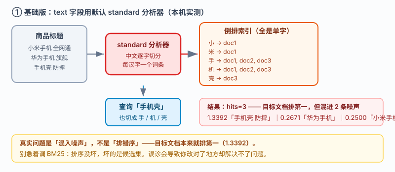
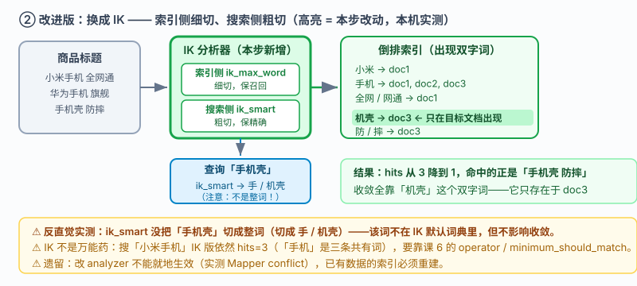
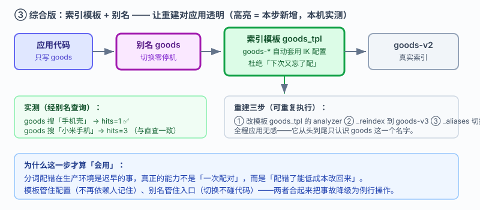

# 应用实战 · 倒排索引：中文搜索为什么搜不准

> 对应课程：[课 4：倒排索引——快到离谱的秘密](../stages/2-核心原理与上手/lessons/lesson-04-倒排索引的秘密.md) ｜ 覆盖知识点：倒排索引原理、分词与分析器、中文分词与 IK
> 定位：**会用，不上生产**——课里学完，在这里动手。课内第四幕验证的是"倒排索引长什么样"，这里做的是**一个中文搜索从"搜不准"到"搜得准"的完整过程**。
> 🧪 **本篇全部输出为本机 `l9-cluster`（ES 9.5.1，3 节点，`http://localhost:9201`）2026-09-20 实测**；实测脚本见 `playground/l17-app-t1.ps1`

---

## 场景：用户搜「手机壳」，为什么连手机都搜出来了

**场景**：你给一个电商站做商品搜索，商品标题只有三条：

```
小米手机 全网通
华为手机 旗舰
手机壳 防摔
```

用户在搜索框输入「手机壳」，期望看到"手机壳 防摔"。结果**三条全出来了**，另外两条"小米手机""华为手机"赫然在列。用户投诉："我要的是壳，你给我手机。"

**全貌一句话**：真实项目里还要处理同义词（"手机壳"="保护套"）、拼错容错、以及"必须同时包含小米和手机"的 AND 语义（课 6 的 `operator` / `minimum_should_match`）——本课只解决**分词这一层**：让倒排索引里存在「机壳」这样的双字词条，而不是只有「手」「机」「壳」三个到处都是的单字。

---

### ① 基础实现（能跑但幼稚）：`text` 字段用默认分析器

直接用 `text` 类型、不指定分析器——绝大多数人第一次建索引的写法：

```powershell
$ES = "http://localhost:9201"
$h  = @{ "Content-Type" = "application/json" }

Invoke-RestMethod "$ES/ap_t1" -Method Put -Headers $h -Body @'
{"mappings":{"properties":{"title":{"type":"text"}}}}
'@ | Out-Null

Invoke-RestMethod "$ES/ap_t1/_doc" -Method Post -Headers $h -Body '{"title":"小米手机 全网通"}' | Out-Null
Invoke-RestMethod "$ES/ap_t1/_doc" -Method Post -Headers $h -Body '{"title":"华为手机 旗舰"}'   | Out-Null
Invoke-RestMethod "$ES/ap_t1/_doc" -Method Post -Headers $h -Body '{"title":"手机壳 防摔"}'     | Out-Null
Invoke-RestMethod "$ES/ap_t1/_refresh" -Method Post | Out-Null
```



> 看图：左边三条标题经 `standard` 分析器后，每个汉字**单独成一个词条**（"手""机""壳"），右侧倒排索引里因此只有单字条目。查「手机壳」时查询串也被切成三个单字——**「手」「机」在三条标题里都存在**，于是三条全部命中。

排查中文搜索的第一条命令永远是 `_analyze`（先看切成了什么，再谈别的）：

```powershell
(Invoke-RestMethod "$ES/ap_t1/_analyze" -Method Post -Headers $h -Body @'
{"analyzer":"standard","text":"小米手机 全网通"}
'@).tokens.token -join " / "
```

**实测输出**：

```
小 / 米 / 手 / 机 / 全 / 网 / 通
```

`standard` 对中文做的是**逐字切分**——每个汉字一个词条。这就是一切问题的根源。查询串同样如此：

```
standard 切分「手机壳」: 手 / 机 / 壳
```

现在搜「手机壳」（本机实测）：

```powershell
$r = Invoke-RestMethod "$ES/ap_t1/_search" -Method Post -Headers $h -Body @'
{"query":{"match":{"title":"手机壳"}},"size":3}
'@
$r.hits.total.value
$r.hits.hits | ForEach-Object { "$($._source.title)   score=$($._score)" }
```

**实测输出**：

```
hits = 3
手机壳 防摔     score=1.3392011
华为手机 旗舰   score=0.26706278
小米手机 全网通 score=0.25001624
```

> ⚠️ **它的问题**（逐条对实测输出，不夸大）：
> 1. **不相关的两条混进来了**：`hits=3` 而不是 1。因为「手」「机」两个单字在"华为手机""小米手机"里同样存在。这是**精确率问题**——用户要 1 条，你给 3 条。
> 2. **排序其实是对的**：正确的"手机壳 防摔"以 1.3392 排第一，是另外两条的 5 倍分。**别急着去调 BM25**——排序没坏，坏的是候选集。这是排查时最容易误诊的地方。
> 3. **分数差距不够大**：1.3392 vs 0.2671。若数据量一大、文档一长，这个差距会被稀释，噪声就有可能翻到前面来。

---

### ② 改进实现（被问题逼出来的下一步）：换 IK 分析器

根因是"逐字切"，那就换一个**认识中文词**的分析器。课 4 装过 IK 9.5.1，这里直接用——注意**索引侧和搜索侧用两个不同分析器**：

```powershell
Invoke-RestMethod "$ES/ap_t2" -Method Put -Headers $h -Body @'
{"mappings":{"properties":{"title":{"type":"text","analyzer":"ik_max_word","search_analyzer":"ik_smart"}}}}
'@ | Out-Null
```

写入同样三条数据，看两侧分别切成什么（**这是本篇最关键的一组输出**）：

```powershell
# 索引侧：ik_max_word（切得细，尽量多产生词条，保召回）
(Invoke-RestMethod "$ES/ap_t2/_analyze" -Method Post -Headers $h -Body @'
{"analyzer":"ik_max_word","text":"手机壳 防摔"}
'@).tokens.token -join " / "

# 搜索侧：ik_smart（切得粗，词条少而准，保精确）
(Invoke-RestMethod "$ES/ap_t2/_analyze" -Method Post -Headers $h -Body @'
{"analyzer":"ik_smart","text":"手机壳"}
'@).tokens.token -join " / "
```

**实测输出**：

```
ik_max_word 切分「小米手机 全网通」: 小米 / 手机 / 全网 / 网通
ik_max_word 切分「手机壳 防摔」    : 手机 / 机壳 / 防 / 摔
ik_smart    切分「手机壳」          : 手 / 机壳
ik_smart    切分「小米手机」        : 小米 / 手机
```

⚠️ **注意这里有个反直觉的实测结果，值得单独记一笔**：`ik_smart` **并没有**把「手机壳」切成一个整词，而是切成了 `手 / 机壳`——因为「手机壳」这个词**不在 IK 默认词典里**。但这不影响结果收敛，原因在下一步分解。



> 看图：与上一张同布局，分析器换成 IK（高亮处）。索引侧 `ik_max_word` 细切，从「手机壳 防摔」里切出了 **`机壳`** 这个双字词；搜索侧 `ik_smart` 粗切，查询「手机壳」得到 `手 / 机壳`。**「机壳」只在 doc3 的倒排索引里出现**——这就是候选集从 3 收敛到 1 的全部原因。

再搜一次「手机壳」（本机实测）：

```powershell
$r = Invoke-RestMethod "$ES/ap_t2/_search" -Method Post -Headers $h -Body @'
{"query":{"match":{"title":"手机壳"}},"size":3}
'@
$r.hits.total.value
$r.hits.hits | ForEach-Object { "$($._source.title)   score=$($._score)" }
```

**实测输出**：

```
hits = 1
手机壳 防摔   score=0.94566
```

**从 3 条降到 1 条，且命中的正是要找的那个。**

> ⚠️ **它的问题**（实测暴露的两个，都很实在）：
> 1. **IK 不是万能药**：搜「小米手机」在 IK 版**依然是 3 条**（1.0744 / 0.1443 / 0.1287）。因为 `ik_smart` 把它切成 `小米 / 手机`，而「手机」是三条标题共有的词。要让"必须同时有小米和手机"，得靠课 6 的 `operator: and` 或 `minimum_should_match`——**分词解决不了的，别硬靠分词**。
> 2. **改分析器不能就地生效**：实测对已有字段改 `analyzer` 直接报错：
>    ```
>    Mapper for [title] conflicts with existing mapper:
>        Cannot update parameter [analyzer] from [default] to [ik_max_word]
>    ```
>    已经灌了数据的索引必须**重建**（建新索引 → reindex 搬迁 → 别名切换，课 11 / 课 15 讲）。另外，词典里没有的新词（如"液态硅胶壳"）照样会被切碎，需要配自定义词典（课 4 讲过 IK 的 `IKAnalyzer.cfg.xml`）。

---

### ③ 综合实现：模板 + 别名，让"分词配错"从事故降级为例行重建

问题 2 是真实痛点：**分词错了要重建，重建意味着线上索引要换**。把切换做成可重复的动作，才是能用的方案：

```powershell
# 1) 索引模板：以后所有 goods-* 索引自动带 IK 配置，杜绝"下次又忘了配"
Invoke-RestMethod "$ES/_index_template/goods_tpl" -Method Put -Headers $h -Body @'
{
  "index_patterns": ["goods-*"],
  "template": {
    "settings": { "number_of_shards": 1, "number_of_replicas": 1 },
    "mappings": { "properties": {
      "title": { "type": "text", "analyzer": "ik_max_word", "search_analyzer": "ik_smart" }
    } }
  }
}
'@ | Out-Null

# 2) 建新索引并搬迁数据（reindex 按新 mapping 重建索引）
Invoke-RestMethod "$ES/_reindex?refresh=true" -Method Post -Headers $h -Body @'
{"source":{"index":"ap_t2"},"dest":{"index":"goods-v2"}}
'@ | Out-Null

# 3) 挂别名：应用只认 goods 这个别名
Invoke-RestMethod "$ES/_aliases" -Method Post -Headers $h -Body @'
{"actions":[{"add":{"index":"goods-v2","alias":"goods"}}]}
'@ | Out-Null

# 4) 应用侧只写别名，以后再重建也不改代码
(Invoke-RestMethod "$ES/goods/_search" -Method Post -Headers $h -Body @'
{"query":{"match":{"title":"手机壳"}},"size":0}
'@).hits.total.value
```

**实测输出**：

```
经别名 goods 搜「手机壳」  : hits=1
经别名 goods 搜「小米手机」: hits=3
```

（与直查 `ap_t2` 完全一致，说明别名透传生效。）



> 看图：比上一张多两个元素（高亮处）——**索引模板**在建索引时自动套用 IK 配置，**别名**横在应用与真实索引之间（应用只写 `goods`，底下换成 `goods-v3` 它也不知道）。**到这一步，"分词配错了"从一个事故降级成一次例行重建。**

> 🎯 **会用标志**：能独立回答"用户搜的词搜不准时，第一步该敲哪条命令"——`_analyze` 看分词器实际切成了什么；能说清为什么索引侧细切、搜索侧粗切；能区分"排序错了"和"候选集混入噪声"这两种完全不同的故障；并且知道改分析器为什么必须重建索引而不是改 mapping。

---

## 🧭 导航

- ⬅️ 回到课程：[课 4：倒排索引——快到离谱的秘密](../stages/2-核心原理与上手/lessons/lesson-04-倒排索引的秘密.md)
- 📚 全部实战：[应用实战索引](INDEX.md)
- ➡️ 下一课实战：[05 · 一个字段类型选错，返工重建索引](05-映射给数据定规矩.md)

---

> ⚠️ **执行环境**：本篇命令在 **Windows PowerShell** 下实测（符合 ES 课程 `curl.exe` 基线）。
> **不要在 WSL 里照抄**——本机实测 WSL2 因 NAT 隔离连不上 Windows 侧 9201（详见课 16 第四幕的环境结论）。
> ⚠️ **PowerShell 5.1 编码坑（实测踩到）**：`Invoke-RestMethod` 会把 ES 返回的 UTF-8 中文按 Latin-1 解析，`_source` 显示成 `æ壳` 乱码；同时无 BOM 的 `.ps1` 脚本也会让中文字符串被吞成 `?`。复现脚本 `playground/l17-app-t1.ps1` 里用 `HttpClient` + 显式 UTF-8 解码 + 带 BOM 的脚本文件绕开了这两个坑。
> 实测脚本：`elasticsearch/playground/l17-app-t1.ps1`（临时脚本，已按 `lXX-*` 惯例忽略）。
