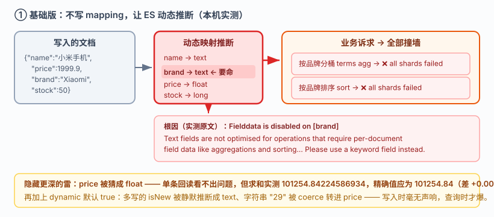
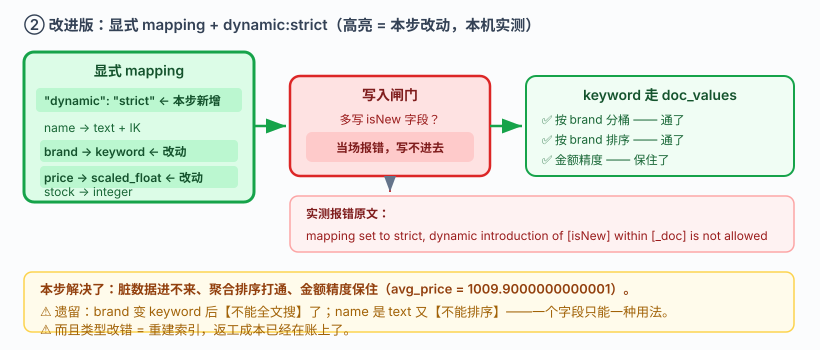
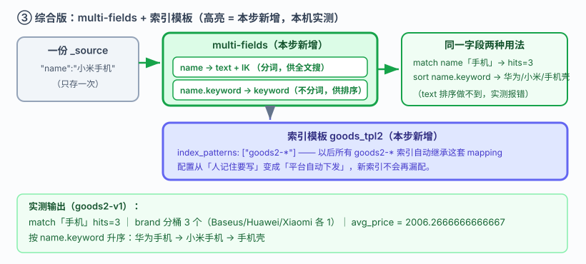

# 应用实战 · 映射：一个字段类型选错，返工重建索引

> 对应课程：[课 5：映射：给数据定规矩](../stages/2-核心原理与上手/lessons/lesson-05-映射给数据定规矩.md) ｜ 覆盖知识点：映射 Mapping 设计、动态映射与模板、多字段 multi-fields
> 定位：**会用，不上生产**——课里学完，在这里动手。课内验证的是"mapping 怎么定义"，这里做的是**一个字段类型从"随便推断"到"经得起聚合和排序"的完整返工过程**。
> 🧪 **本篇全部输出为本机 `l9-cluster`（ES 9.5.1，3 节点，`http://localhost:9201`）2026-09-20 实测**；脚本见 `playground/l17-app-t2.ps1`、`l17-app-t2b.ps1`

---

## 场景：财务对账差了两分钱，你却查不出哪里算错

**场景**：你接手一个商品索引，前人是"直接灌数据、不写 mapping"做的。现在运营要看"按品牌统计销量与均价"，你在业务代码里写了聚合，一跑就报错；好不容易聚合通了，财务又来对账说**均价差了两分钱**。

**全貌一句话**：真实项目里还要考虑字段膨胀上限（`index.mapping.total_fields.limit`）、`dynamic_templates` 按字段名模式自动分类、以及已上线索引的零停机重建（课 11 / 课 15 的 reindex + 别名）——本课只解决**类型这一层**：让字段既能全文搜、又能精确聚合排序，且金额不丢精度。

---

### ① 基础实现（能跑但幼稚）：不写 mapping，让 ES 自己猜

**绝大多数"跑起来再说"的索引都是这么来的**——直接写文档，ES 动态映射自动推断类型：

```powershell
$ES = "http://localhost:9201"
$h  = @{ "Content-Type" = "application/json" }

Invoke-RestMethod "$ES/ap_p1/_doc" -Method Post -Headers $h -Body '{"name":"小米手机","price":1999.9,"brand":"Xiaomi","stock":50}' | Out-Null
Invoke-RestMethod "$ES/ap_p1/_doc" -Method Post -Headers $h -Body '{"name":"手机壳","price":19.9,"brand":"Baseus","stock":500}' | Out-Null
Invoke-RestMethod "$ES/ap_p1/_refresh" -Method Post | Out-Null
```



> 看图：左侧写入的 4 个字段，被动态映射猜成了 `text / float / long`（高亮处 `brand` 被猜成 `text`）。右侧两条业务诉求——**按品牌分桶**和**按品牌排序**——都撞在 `text` 字段上，直接报 `Fielddata is disabled`。

看看 ES 到底猜成了什么：

```powershell
(Invoke-RestMethod "$ES/ap_p1/_mapping").ap_p1.mappings.properties
```

**实测输出**：

```
brand : text
name  : text
price : float
stock : long
```

`brand` 被猜成了 `text`——这是最要命的一个。现在响应运营的需求，按品牌分桶：

```powershell
Invoke-RestMethod "$ES/ap_p1/_search" -Method Post -Headers $h -Body @'
{"size":0,"aggs":{"by_brand":{"terms":{"field":"brand"}}}}
'@
```

**实测报错**：

```
报错类型: search_phase_execution_exception
报错原因: all shards failed
根因: Fielddata is disabled on [brand] in [ap_p1].
       Text fields are not optimised for operations that require per-document field data
       like aggregations and sorting, so these operations are disabled by default.
       Please use a keyword field instead.
```

按品牌**排序**同样报错（`sort:[{"brand":{"order":"asc"}}]`），根因一模一样。

> ⚠️ **它的问题**（三条，逐条对实测）：
> 1. **`text` 字段既不能聚合也不能排序**——两个需求同时撞墙。报错信息其实已经把答案告诉你了：`Please use a keyword field instead`。
> 2. **类型猜错了改不回来**：`price` 猜成 `float` 后，实测 `float` 求和得 `101254.84224586934`，而精确值是 `101254.84`——**差了 0.0022**。金额用 `float` 就是在账上埋雷（详见下方精度对照）。
> 3. **脏数据能静默写进去**：`dynamic` 默认 `true`，多写一个 `isNew` 字段照样成功，实测被推断成 `text`；字符串 `"29"` 写进 `price` 也被 coerce 静默转成数字——**错误在写入时毫无声响，要到查询时才爆。**

**精度对照（实测，同一批值 0.1 / 0.2 / 19.99 / 1234.56 / 99999.99 求和，精确答案 101254.84）**：

| 类型 | sum 结果 | 与精确值之差 |
|---|---|---|
| `float` | `101254.84224586934` | **+0.0022** ❌ |
| `scaled_float` | `101254.84000000001` | ~1e-11 ✅ |
| `double` | `101254.84000000001` | ~1e-11 ✅ |

> 单条值回读时三者都显示 `99999.99` 看不出差别——**误差只在聚合求和时才暴露**。这正是"财务对账才发现"的原因。

---

### ② 改进实现（被问题逼出来的下一步）：显式 mapping + `dynamic: strict`

既然"猜"会出事，那就自己定。并且把 `dynamic` 设成 `strict`，让脏数据**写不进来**而不是静默污染：

```powershell
Invoke-RestMethod "$ES/ap_p2" -Method Put -Headers $h -Body @'
{
  "mappings": {
    "dynamic": "strict",
    "properties": {
      "name":  { "type": "text", "analyzer": "ik_max_word", "search_analyzer": "ik_smart" },
      "price": { "type": "scaled_float", "scaling_factor": 100 },
      "brand": { "type": "keyword" },
      "stock": { "type": "integer" }
    }
  }
}
'@ | Out-Null
```



> 看图：与上一张同布局，改为显式定义（高亮处 `brand` 从 `text` 变成 `keyword`，`price` 从 `float` 变成 `scaled_float`）。`keyword` 走 doc_values，聚合排序双双打通；`dynamic: strict` 在写入侧加了一道闸门，非法字段**当场报错**而不是混进去。

验证闸门是否生效（实测）：

```powershell
Invoke-RestMethod "$ES/ap_p2/_doc" -Method Post -Headers $h -Body @'
{"name":"充电宝","price":89.9,"brand":"Anker","stock":30,"isNew":"true"}
'@
```

**实测报错**：

```
mapping set to strict, dynamic introduction of [isNew] within [_doc] is not allowed
```

脏数据在**写入那一刻**就被挡住了。再验证金额精度（实测）：

```
存入 19.9 → 回读 19.9
avg_price = 1009.9000000000001
```

> ⚠️ **它的问题**：
> 1. **`brand` 现在只能精确匹配，不能全文搜了**——`keyword` 不做分词，搜 "xiaomi" 小写形式或分词场景会失配。真实业务常常**两个都要**。
> 2. **`name` 同样如此**：它是 `text`，能全文搜，但**不能排序**（实测按 `name` 排序会撞同样的 fielddata 报错）。
> 3. 如果只想给单个字段开个后门，可以用 `"index": false` 或 `"doc_values": false`——但这些都解决不了"一个字段两种用法"的需求。

---

### ③ 综合实现：`multi-fields` + 索引模板，一个字段两种用法 + 不再依赖人记住

用 `fields` 给同一份数据建**两套索引方式**：主字段 `text` 供全文搜，子字段 `keyword` 供聚合排序。再用**索引模板**固化，杜绝"下次新索引又忘了配"：

```powershell
Invoke-RestMethod "$ES/_index_template/goods_tpl2" -Method Put -Headers $h -Body @'
{
  "index_patterns": ["goods2-*"],
  "template": {
    "settings": { "number_of_shards": 1, "number_of_replicas": 1 },
    "mappings": {
      "dynamic": "strict",
      "properties": {
        "name":  { "type": "text", "analyzer": "ik_max_word", "search_analyzer": "ik_smart",
                   "fields": { "keyword": { "type": "keyword", "ignore_above": 256 } } },
        "price": { "type": "scaled_float", "scaling_factor": 100 },
        "brand": { "type": "keyword" },
        "stock": { "type": "integer" }
      }
    }
  }
}
'@ | Out-Null
```

灌入三条数据后，**同一字段两种用法**同时成立（实测）：

```powershell
# ① 全文搜 name（走 text + IK）
# ② 按 brand 精确分桶（走 keyword）
# ③ 按 price 聚合（走 scaled_float）
Invoke-RestMethod "$ES/goods2-v1/_search" -Method Post -Headers $h -Body @'
{"size":0,"query":{"match":{"name":"手机"}},
 "aggs":{"by_brand":{"terms":{"field":"brand"}},"avg_price":{"avg":{"field":"price"}}}}
'@
```

**实测输出**：

```
match 手机 hits = 3
brand 分桶数 = 3
  - Baseus : 1
  - Huawei : 1
  - Xiaomi : 1
avg_price = 2006.2666666666667
```

再用 `name.keyword` 排序——这是 **text 字段做不到的**（实测）：

```powershell
Invoke-RestMethod "$ES/goods2-v1/_search" -Method Post -Headers $h -Body @'
{"size":3,"sort":[{"name.keyword":{"order":"asc"}}],"_source":["name"]}
'@
```

**实测输出**：

```
华为手机
小米手机
手机壳
```



> 看图：比上一张多两个元素（高亮处）。**multi-fields** 让 `name` 同时有 `text`（分词、供搜索）和 `name.keyword`（不分词、供排序聚合）两条路径，**一份数据、两套索引**；**索引模板**保证以后所有 `goods2-*` 索引自动继承这套配置。**到这一步，"类型选错"从一次返工变成一次配置下发。**

> 🎯 **会用标志**：看到 `Fielddata is disabled` 报错能立刻反应出"这个字段该用 keyword"而不是去开 `fielddata=true`（那是拿内存换功能，报错原文就警告了 `can use significant memory`）；能说清金额为什么用 `scaled_float` 而不是 `float`；能独立写出一个字段同时支持全文搜与精确排序的 mapping；并且知道"改字段类型 = 重建索引"，所以第一次就要写对。

---

## 🧭 导航

- ⬅️ 回到课程：[课 5：映射：给数据定规矩](../stages/2-核心原理与上手/lessons/lesson-05-映射给数据定规矩.md)
- 📚 全部实战：[应用实战索引](INDEX.md)
- ⬅️ 上一课实战：[04 · 中文搜索为什么搜不准](04-倒排索引的秘密.md)
- ➡️ 下一课实战：[06 · 从一个搜索框到能用的筛选器](06-QueryDSL问问题的语言.md)

---

> ⚠️ **执行环境**：本篇命令在 **Windows PowerShell** 下实测。**不要在 WSL 里照抄**——本机实测 WSL2 因 NAT 隔离连不上 Windows 侧 9201（详见课 16 第四幕环境结论）。
> ⚠️ **PowerShell 5.1 编码坑**：`Invoke-RestMethod` 会把 ES 返回的 UTF-8 中文按 Latin-1 解析成乱码；无 BOM 的 `.ps1` 脚本中文字符串也会被吞成 `?`。复现脚本用 `HttpClient` + 显式 UTF-8 解码 + 带 BOM 的脚本文件绕开。
> 实测脚本：`elasticsearch/playground/l17-app-t2.ps1`、`l17-app-t2b.ps1`（临时脚本，已按 `lXX-*` 惯例忽略）。
