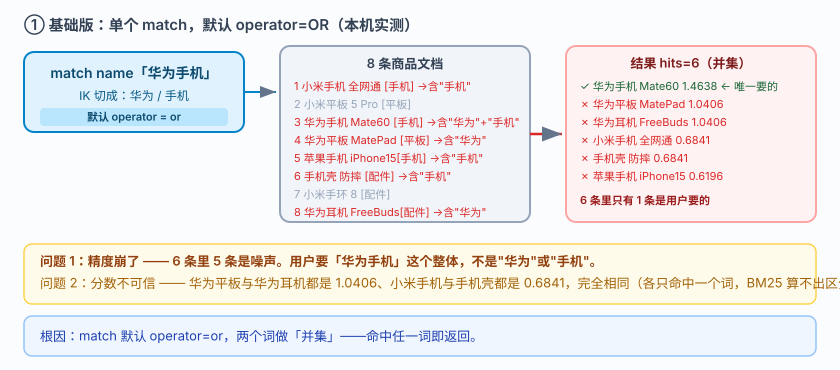
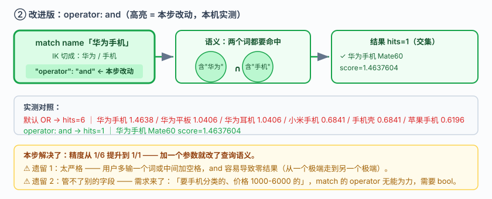
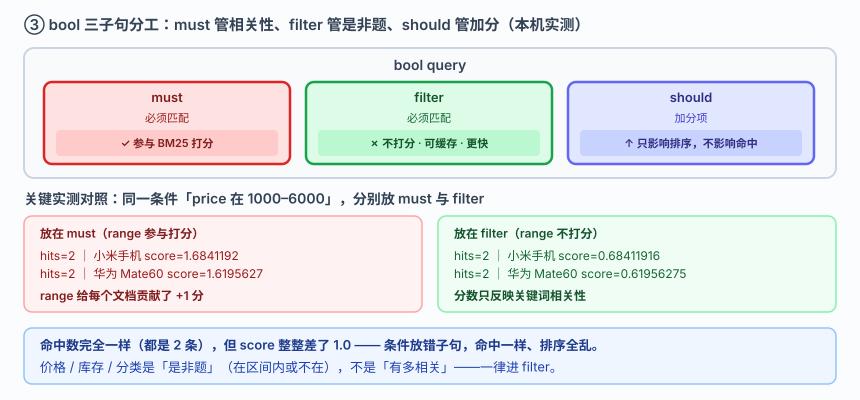
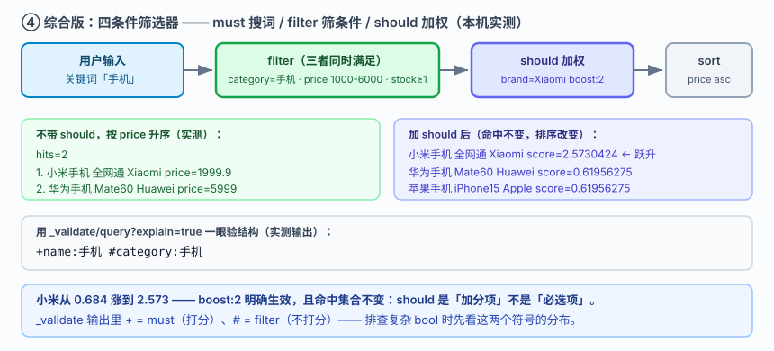

# 应用实战 · Query DSL：从一个搜索框到能用的筛选器

> 对应课程：[课 6：Query DSL：问问题的语言](../stages/3-查询与聚合/lessons/lesson-06-QueryDSL问问题的语言.md) ｜ 覆盖知识点：Query DSL 结构、全文 vs 词项查询、布尔组合与过滤
> 定位：**会用，不上生产**——课里学完，在这里动手。课内验证的是"每种查询长什么样"，这里做的是**一个搜索框从"能搜"到"搜得对、筛得准、排得合理"的完整演进**。
> 🧪 **本篇全部输出为本机 `l9-cluster`（ES 9.5.1，3 节点，`http://localhost:9201`）2026-09-20 实测**；脚本见 `playground/l17-app-t3.ps1`

---

## 场景：用户搜「华为手机」，结果华为耳机和华为平板都来了

**场景**：电商搜索框上线第一天。用户搜「华为手机」，期望看到 Mate60。结果返回 6 条——**华为平板、华为耳机赫然在列，还排在小米手机前面**。运营找过来："你们的搜索是不是坏了？"

**全貌一句话**：真实项目还要处理分页深度限制、多字段权重（`multi_match` 的 `^3`）、以及模糊容错（课 7 的 `fuzziness`）——本课只解决**查询结构这一层**：用 `operator`、`bool` 的 must/filter/should 把"想要什么"准确翻译成 DSL。

---

### 数据准备（8 条商品，本篇共用）

```powershell
$ES = "http://localhost:9201"
$h  = @{ "Content-Type" = "application/json" }

Invoke-RestMethod "$ES/ap_g1" -Method Put -Headers $h -Body @'
{"mappings":{"properties":{
  "name":{"type":"text","analyzer":"ik_max_word","search_analyzer":"ik_smart"},
  "brand":{"type":"keyword"},"price":{"type":"scaled_float","scaling_factor":100},
  "category":{"type":"keyword"},"stock":{"type":"integer"}}}}
'@ | Out-Null
```

| # | name | brand | price | category | stock |
|---|---|---|---|---|---|
| 1 | 小米手机 全网通 | Xiaomi | 1999.9 | 手机 | 50 |
| 2 | 小米平板 5 Pro | Xiaomi | 2599 | 平板 | 20 |
| 3 | 华为手机 Mate60 | Huawei | 5999 | 手机 | 30 |
| 4 | 华为平板 MatePad | Huawei | 2299 | 平板 | 15 |
| 5 | 苹果手机 iPhone15 | Apple | 6999 | 手机 | 40 |
| 6 | 手机壳 防摔 | Baseus | 19.9 | 配件 | 500 |
| 7 | 小米手环 8 | Xiaomi | 249 | 配件 | 200 |
| 8 | 华为耳机 FreeBuds | Huawei | 799 | 配件 | 100 |

---

### ① 基础实现（能跑但幼稚）：单个 `match`

搜索框接一个关键词，直接丢给 `match`——这是 90% 的搜索框第一版：

```powershell
Invoke-RestMethod "$ES/ap_g1/_search" -Method Post -Headers $h -Body @'
{"query":{"match":{"name":"华为手机"}},"size":10}
'@
```



> 看图：查询「华为手机」被 IK 切成 `华为` / `手机` 两个词，`match` 默认 **`operator: or`**——命中任一词即返回。左侧 8 条文档里，含"华为"的 3 条 + 含"手机"的 3 条全部被拉进来，右侧结果集 6 条。

**实测输出**：

```
match name「华为手机」: hits=6
    - 华为手机 Mate60    [手机]  score=1.4637604
    - 华为平板 MatePad   [平板]  score=1.0405861
    - 华为耳机 FreeBuds  [配件]  score=1.0405861
    - 小米手机 全网通    [手机]  score=0.68411916
    - 手机壳 防摔        [配件]  score=0.68411916
    - 苹果手机 iPhone15  [手机]  score=0.61956275
```

> ⚠️ **它的问题**（逐条对实测）：
> 1. **6 条里只有 1 条是用户要的**——"华为平板""华为耳机""手机壳"全是噪声。用户搜的是「华为手机」这个**整体**，不是"华为"或"手机"。
> 2. **根因是默认 OR**：`match` 默认 `operator: or`，命中任一词就返回。分词后"华为""手机"两个词各自召回一批，做并集。
> 3. **分数也不可信**：华为平板 1.0406 与华为耳机 1.0406 **完全相同**，小米手机与手机壳 0.6841 也完全相同——因为各自都只命中一个词，BM25 算不出区分度。

---

### ② 改进实现（被问题逼出来的第一步）：`operator: and`

用户输两个词，通常是**两个都要**。加一个参数就能改语义：

```powershell
Invoke-RestMethod "$ES/ap_g1/_search" -Method Post -Headers $h -Body @'
{"query":{"match":{"name":{"query":"华为手机","operator":"and"}}},"size":10}
'@
```



> 看图：与上一张同布局，查询结构改为 `operator: and`（高亮处）。两个词做**交集**而非并集——只有同时含"华为"和"手机"的文档才能通过。结果从 6 条直接收敛到 1 条。

**实测输出**：

```
-- 默认 OR --          hits=6
-- operator: and --    hits=1
    - 华为手机 Mate60  score=1.4637604
```

> ⚠️ **它的问题**：
> 1. **太严格了**：如果用户搜「华为 手机」（中间有空格）或多输一个词，`and` 会导致**零结果**。真实搜索里 `and` 容易从一个极端走到另一个极端。
> 2. **只能控制一个字段**：现在需求来了——"我要手机分类的、价格在 1000–6000 的"。`match` 的 `operator` 管不了分类和价格，需要 `bool`。

---

### ③ 再进一步（被新需求逼出来）：`bool` 的 must / filter / should

真实筛选器都是**多条件组合**。关键决策是：**哪些条件参与打分，哪些只做筛选**。

```powershell
# must：必须匹配，且参与打分
# filter：必须匹配，但不参与打分（可缓存，更快）
Invoke-RestMethod "$ES/ap_g1/_search" -Method Post -Headers $h -Body @'
{"query":{"bool":{
  "must":  [{"match":{"name":{"query":"手机","operator":"and"}}}],
  "filter":[{"term":{"category":"手机"}}]}},"size":10}
'@
```

**实测输出**：

```
must 手机 AND filter category=手机 : hits=3
    - 小米手机 全网通    score=0.68411916
    - 华为手机 Mate60    score=0.61956275
    - 苹果手机 iPhone15  score=0.61956275
```

**`must` vs `filter` 的关键实测对照**（同一条件"价格在 1000–6000"，分别放 `must` 和 `filter`）：

```
-- 放在 must（参与打分）--
   hits=2
    - 小米手机 全网通  price=1999.9  score=1.6841192
    - 华为手机 Mate60  price=5999    score=1.6195627

-- 放在 filter（不参与打分）--
   hits=2
    - 小米手机 全网通  price=1999.9  score=0.68411916
    - 华为手机 Mate60  price=5999    score=0.61956275
```

**命中完全一样（都是 2 条），但 score 整整差了 1.0**——`must` 里的 `range` 给每个文档贡献了 +1 分，把价格区间的"匹配程度"混进了相关性。价格区间是**是非题**（在区间内 / 不在），不是"有多相关"，所以它应该待在 `filter` 里。



> 看图：三个子句各司其职（高亮处）。`must` 走"相关性"路径（参与 BM25 打分），`filter` 走"是非题"路径（不打分、结果可缓存、更快），`should` 走"加分项"路径（不影响是否命中，只影响排序）。**把条件放错子句，命中数可能一样，但排序全乱了**——这正是上面 1.0 分差的来源。

---

### ④ 综合实现：一个真正能用的筛选器

把关键词、分类、价格、库存全串起来，并用 `should` 加一个"品牌加权"：

```powershell
Invoke-RestMethod "$ES/ap_g1/_search" -Method Post -Headers $h -Body @'
{
  "query": {"bool": {
    "must":   [{"match":{"name":{"query":"手机","operator":"and"}}}],
    "filter": [
      {"term": {"category":"手机"}},
      {"range":{"price":{"gte":1000,"lte":6000}}},
      {"range":{"stock":{"gte":1}}}
    ],
    "should": [{"term":{"brand":{"value":"Xiaomi","boost":2}}}]
  }},
  "sort": [{"price":{"order":"asc"}}],
  "size": 10
}
'@
```

**实测输出**（不带 `should` 时，按价格升序）：

```
最终命中: hits=2
    - 小米手机 全网通  brand=Xiaomi  price=1999.9
    - 华为手机 Mate60  brand=Huawei  price=5999
```

**加上 `should` 品牌加权后（同一批命中，排序被改变）**：

```
    - 小米手机 全网通  brand=Xiaomi   score=2.5730424   ← boost:2 生效，跃升第一
    - 华为手机 Mate60  brand=Huawei   score=0.61956275
    - 苹果手机 iPhone15 brand=Apple   score=0.61956275
```

小米从 0.684 涨到 **2.573**，`boost: 2` 明确生效——`should` 是"加分项"而非"必选项"，这就是运营要的"主推品牌靠前"。

**用 `_validate` 验证结构是否符合预期**（排查复杂 bool 的第一步）：

```powershell
(Invoke-RestMethod "$ES/ap_g1/_validate/query?explain=true" -Method Post -Headers $h -Body @'
{"query":{"bool":{"must":[{"match":{"name":"手机"}}],"filter":[{"term":{"category":"手机"}}]}}}
'@).explanations
```

**实测输出**：

```
+name:手机 #category:手机
```

> `+` 表示 must，`#` 表示 filter——**一眼看出哪些条件在打分、哪些不在**。



> 看图：比上一张更完整（高亮处）——多个 `filter` 串联构成"与"逻辑（分类、价格、库存三者同时满足），`should` 挂在打分侧做加权，`sort` 在最后决定呈现顺序。**到这一步，搜索框才算"能用"。**

> 🎯 **会用标志**：搜「华为手机」出平板，能立刻想到是 `operator` 默认 OR，而不是去调 BM25 参数；能说清 `must` 和 `filter` 在**命中数相同**的情况下为什么 score 会差 1.0；知道价格、库存、分类这类"是非题"条件一律进 `filter`；会用 `_validate/query?explain=true` 一眼看出 `+` 和 `#` 的分布对不对。

---

## 🧭 导航

- ⬅️ 回到课程：[课 6：Query DSL：问问题的语言](../stages/3-查询与聚合/lessons/lesson-06-QueryDSL问问题的语言.md)
- 📚 全部实战：[应用实战索引](INDEX.md)
- ⬅️ 上一课实战：[05 · 一个字段类型选错，返工重建索引](05-映射给数据定规矩.md)
- ➡️ 下一课实战：[07 · 让它排对、翻得动、拼错也有结果](07-为什么这条排在前面.md)

---

> ⚠️ **执行环境**：本篇命令在 **Windows PowerShell** 下实测。**不要在 WSL 里照抄**——本机实测 WSL2 因 NAT 隔离连不上 Windows 侧 9201（详见课 16 第四幕环境结论）。
> ⚠️ **PowerShell 5.1 编码坑**：`Invoke-RestMethod` 会把 ES 返回的 UTF-8 中文按 Latin-1 解析成乱码；无 BOM 的 `.ps1` 脚本中文也会被吞成 `?`。复现脚本用 `HttpClient` + 显式 UTF-8 解码 + 带 BOM 脚本文件绕开。
> 实测脚本：`elasticsearch/playground/l17-app-t3.ps1`（临时脚本，已按 `lXX-*` 惯例忽略）。
