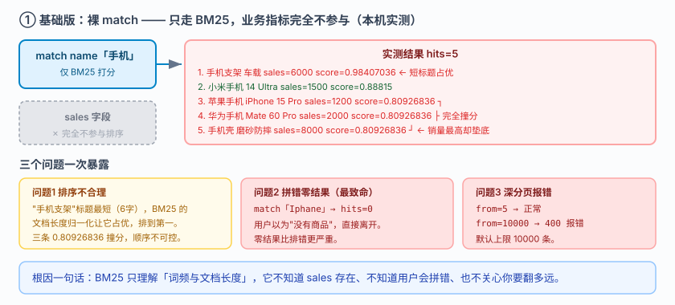
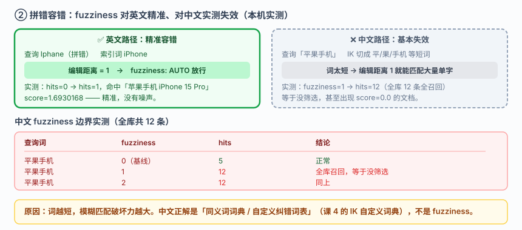
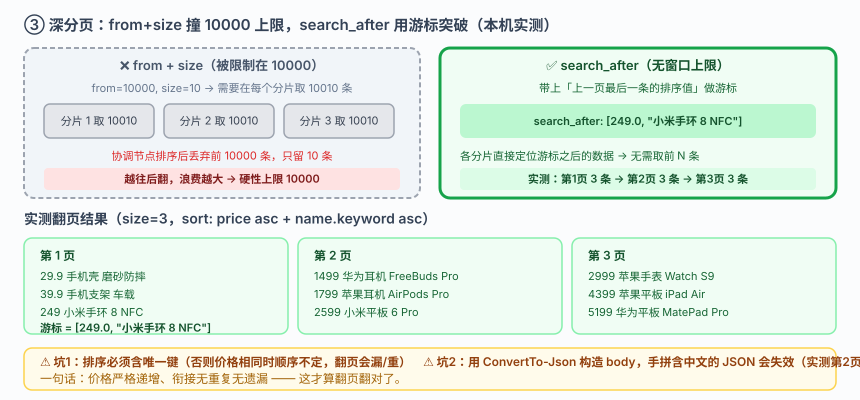

# 应用实战 · 相关性：让它排对、翻得动、拼错也有结果

> 对应课程：[课 7：为什么这条排在前面](../stages/3-查询与聚合/lessons/lesson-07-为什么这条排在前面.md) ｜ 覆盖知识点：BM25 相关性、排序 · 分页 · 高亮、相关性调优
> 定位：**会用，不上生产**——课里学完，在这里动手。课内验证的是"BM25 怎么算分"，这里做的是**一个搜索结果页从"排得莫名其妙"到"排对、翻得动、容得错"的完整演进**。
> 🧪 **本篇全部输出为本机 `l9-cluster`（ES 9.5.1，3 节点，`http://localhost:9201`）2026-09-20 实测**；脚本见 `playground/l17-app-t4.ps1`、`l17-app-t4b.ps1`

---

## 场景：销量 8000 的手机壳排在销量 1200 的 iPhone 后面

**场景**：搜索「手机」，结果第一条是"手机支架 车载"（销量 6000），而"苹果手机 iPhone 15 Pro"排在第三。运营说：**"我们主推的手机呢？"** 与此同时，用户搜「Iphane」（拼错了）返回**零结果**，直接离开了页面；还有人反馈翻到第 1000 页时页面报错。

**全貌一句话**：真实项目还要做 A/B 测评相关性（`rank_eval`）、多字段权重、以及个性化重排——本课只解决**三个具体问题**：排序不合理、拼错零结果、深分页报错。

---

### 数据准备（12 条商品，本篇共用）

```powershell
$ES = "http://localhost:9201"
$h  = @{ "Content-Type" = "application/json" }

Invoke-RestMethod "$ES/ap_r1" -Method Put -Headers $h -Body @'
{"mappings":{"properties":{
  "name":{"type":"text","analyzer":"ik_max_word","search_analyzer":"ik_smart",
          "fields":{"keyword":{"type":"keyword"}}},
  "brand":{"type":"keyword"},
  "price":{"type":"scaled_float","scaling_factor":100},
  "sales":{"type":"integer"}}}}
'@ | Out-Null
```

| name | brand | price | sales |
|---|---|---|---|
| 苹果手机 iPhone 15 Pro | Apple | 7999 | 1200 |
| 苹果平板 iPad Air | Apple | 4399 | 800 |
| 苹果耳机 AirPods Pro | Apple | 1799 | 3000 |
| 苹果手表 Watch S9 | Apple | 2999 | 600 |
| 小米手机 14 Ultra | Xiaomi | 6499 | 1500 |
| 小米平板 6 Pro | Xiaomi | 2599 | 400 |
| 小米手环 8 NFC | Xiaomi | 249 | 5000 |
| 华为手机 Mate 60 Pro | Huawei | 6999 | 2000 |
| 华为平板 MatePad Pro | Huawei | 5199 | 300 |
| 华为耳机 FreeBuds Pro | Huawei | 1499 | 900 |
| 手机壳 磨砂防摔 | Baseus | 29.9 | 8000 |
| 手机支架 车载 | Baseus | 39.9 | 6000 |

---

### ① 基础实现：裸 `match`，三个问题一次暴露

```powershell
Invoke-RestMethod "$ES/ap_r1/_search" -Method Post -Headers $h -Body @'
{"query":{"match":{"name":"手机"}},"size":12}
'@
```



> 看图：查询「手机」只走 BM25 单一路径。`sales` 字段（图上灰掉的方框）**完全不参与排序**——ES 不知道"销量高=更该排前面"，因为它只理解词频与文档长度。

**实测输出**：

```
match「手机」: hits=5
    - 手机支架 车载           sales=6000  score=0.98407036
    - 小米手机 14 Ultra       sales=1500  score=0.88815
    - 苹果手机 iPhone 15 Pro  sales=1200  score=0.80926836
    - 华为手机 Mate 60 Pro    sales=2000  score=0.80926836
    - 手机壳 磨砂防摔          sales=8000  score=0.80926836
```

> ⚠️ **它的问题 1：排序不符合业务预期**
> 1. **"手机支架"排第一**——它标题最短（6 个字），BM25 的**文档长度归一化**让短文档占优。销量 6000 只是巧合。
> 2. **三条 0.80926836 完全撞分**——苹果手机、华为手机、手机壳分数一模一样，BM25 算不出区分度，**顺序实际由内部分片/文档 ID 决定，不可控**。
> 3. **销量 8000 的手机壳垫底**——业务上它才是最该推的，但 BM25 完全不知道 `sales` 的存在。

**问题 2：拼错就零结果**（实测）

```powershell
Invoke-RestMethod "$ES/ap_r1/_search" -Method Post -Headers $h -Body '{"query":{"match":{"name":"Iphane"}},"size":5}'
```

```
match「Iphane」（拼错）: hits=0
```

用户拼错一个字母，**页面直接空白**——这是搜索产品最致命的体验问题。

**问题 3：深分页直接报错**（实测）

```powershell
Invoke-RestMethod "$ES/ap_r1/_search" -Method Post -Headers $h -Body @'
{"query":{"match_all":{}},"size":10,"from":10000,"sort":[{"price":{"order":"asc"}}]}
'@
```

```
报错类型: illegal_argument_exception
根因: Result window is too large, from + size must be less than or equal to: [10000]
      but was [10010]. See the scroll api for a more efficient way to request
      large data sets. This limit can be set by changing the
      [index.max_result_window] index level setting.
```

`from=5` 正常返回；`from=10000` 直接 400。**默认上限 10000 条**，超出即失败。

---

### ② 改进一：拼错容错 `fuzziness`（先解决最致命的）

零结果比排错更严重——用户以为"没有商品"，直接流失。加 `fuzziness` 做编辑距离容错：

```powershell
Invoke-RestMethod "$ES/ap_r1/_search" -Method Post -Headers $h -Body @'
{"query":{"match":{"name":{"query":"Iphane","fuzziness":"AUTO"}}},"size":5}
'@
```

**实测输出**：

```
match Iphane fuzziness=AUTO : hits=1
    - 苹果手机 iPhone 15 Pro  score=1.6930168
```

**从 0 条到 1 条，且精准命中**。`AUTO` 会根据词长自动决定编辑距离（短词 0、中词 1、长词 2）。



> 看图：左半部分英文路径——`Iphane` 与 `iPhone` 编辑距离为 1，`fuzziness: AUTO` 精准放行，命中 1 条。右半部分中文路径（灰色 + 警告）——**实测 `fuzziness: 1` 把 12 条全部召回**，中文模糊匹配**基本失效**。

> ⚠️ **中文 `fuzziness` 实测结论（重要边界，必须标注）**

| 查询 | fuzziness | hits | 结论 |
|---|---|---|---|
| 平果手机 | 0（基线） | 5 | 正常 |
| 平果手机 | 1 | **12** | ❌ 全库都召回，等于没筛选 |
| 平果手机 | 2 | **12** | ❌ 同上 |
| 苹杲手机 | 1 | **11** | ❌ 几乎全召回，还有 2 条 score=0.0 |

**原因**：中文经 IK 分词后多为**单字或双字词**，"平果"与"苹果"只差一个字，编辑距离 1 就已经能让"平"匹配到大量单字词——**词越短，模糊匹配的破坏力越大**。`fuzziness` 是为英文这类长词设计的，直接套到中文上会把精确查询变成全表扫描。

> 中文纠错的正确做法是**同义词词典 / 自定义纠错词表**（课 4 的 IK 自定义词典），而不是 `fuzziness`。

---

### ③ 改进二：`function_score` 让销量参与排序

BM25 不懂业务，那就把业务指标**加进分数**。`field_value_factor` 用 `log1p` Modifier 避免销量绝对值碾压相关性：

```powershell
Invoke-RestMethod "$ES/ap_r1/_search" -Method Post -Headers $h -Body @'
{"query":{"function_score":{
  "query":{"match":{"name":"手机"}},
  "field_value_factor":{"field":"sales","modifier":"log1p","factor":1}}},"size":12}
'@
```

**实测输出**：

```
function_score log1p(sales) : hits=5
    - 手机支架 车载           sales=6000  score=3.7180378
    - 手机壳 磨砂防摔          sales=8000  score=3.1586912
    - 小米手机 14 Ultra       sales=1500  score=2.8211024
    - 华为手机 Mate 60 Pro    sales=2000  score=2.6715949
    - 苹果手机 iPhone 15 Pro  sales=1200  score=2.4921768
```

**撞分现象消失了**——原本三条 0.80926836 现在分别是 3.1587 / 2.6716 / 2.4922，销量高的手机壳从第 5 升到第 2。

> ⚠️ **它的问题**：
> 1. **"手机支架"仍是第一**（3.718）——`log1p` 只是压缩了销量差距，没有改变"它是配件不是手机"这个事实。**销量加权解决不了品类错配**，那是课 6 `bool` + `filter` 的活。
> 2. `factor` 和 `modifier` 需要调参，实测才有数——**不要凭感觉设**。

**顺带验证高亮**（搜索结果页必备，实测）：

```powershell
Invoke-RestMethod "$ES/ap_r1/_search" -Method Post -Headers $h -Body @'
{"query":{"match":{"name":"手机"}},"highlight":{"fields":{"name":{}}},"size":2}
'@
```

```
- <em>手机</em>支架 车载
- 小米<em>手机</em> 14 Ultra
```

---

### ④ 综合实现：`search_after` 解决深分页

`from + size` 的 10000 上限是**设计约束**不是 bug——因为 `from=10000` 需要协调节点在**每个分片**上取 10010 条再排序丢弃，分片越多浪费越大。正解是 `search_after`：**用上一页最后一条的排序值做游标**。

```powershell
# 第 1 页：排序必须包含唯一键（这里用 name.keyword 兜底，保证排序值全局唯一）
$sort = '[{"price":{"order":"asc"}},{"name.keyword":{"order":"asc"}}]'
$p1 = Invoke-RestMethod "$ES/ap_r1/_search" -Method Post -Headers $h -Body @"
{"query":{"match_all":{}},"size":3,"sort":$sort}
"@
$p1.hits.hits | ForEach-Object { "$($._source.price)  $($._source.name)" }
$cursor = $p1.hits.hits[-1].sort          # ← 取最后一行的 sort 值做游标
```

**实测输出（第 1 页）**：

```
29.9   手机壳 磨砂防摔
39.9   手机支架 车载
249    小米手环 8 NFC
最后一行的 sort 值: [249.0, "小米手环 8 NFC"]
```

```powershell
# 第 2 页：把游标放进 search_after（注意用 ConvertTo-Json 序列化，别手拼字符串）
$body = @{
  query = @{ match_all = @{} }
  size  = 3
  sort  = @(@{ price = @{ order = "asc" } }, @{ "name.keyword" = @{ order = "asc" } })
  search_after = $cursor
} | ConvertTo-Json -Depth 8 -Compress

Invoke-RestMethod "$ES/ap_r1/_search" -Method Post -Headers $h -Body $body
```

**实测输出（第 2 页）**：

```
1499  华为耳机 FreeBuds Pro
1799  苹果耳机 AirPods Pro
2599  小米平板 6 Pro
```

**第 3 页**：`2999 苹果手表 Watch S9` / `4399 苹果平板 iPad Air` / `5199 华为平板 MatePad Pro`——**价格严格递增，衔接无重复无遗漏**。



> 看图：`from+size` 路径（灰色）——协调节点要在每个分片取 `from+size` 条再丢弃前 `from` 条，越往后越浪费，所以被硬性限制在 10000。`search_after` 路径（高亮）——带上"上一页最后一条的排序值"，各分片直接定位游标之后的数据，**没有窗口上限**。

> ⚠️ **两个必须注意的坑**（都是实测踩到的）：
> 1. **排序必须包含唯一键**：只用 `price` 排序时，价格相同的文档顺序不确定，翻页会漏数据或重复。加 `name.keyword` 作为第二排序键（tiebreaker）才能**保证排序值全局唯一**。
> 2. **用 `ConvertTo-Json` 构造请求体**：我第一版手拼字符串 `"search_after":[249.0,"小米手环 8 NFC"]` 时，中文被引号/编码问题吞掉，请求体变成空串，ES 忽略 `search_after` 直接返回全量——**第 2 页返回了 10 条而不是 3 条**。改用 `ConvertTo-Json -Depth 8 -Compress` 序列化整个 body 才正确。

> 🎯 **会用标志**：搜「手机」销量 8000 的排最后，能立刻意识到"BM25 不知道 sales 字段的存在"，并知道用 `function_score` 把业务指标加进来而不是去魔改 BM25 参数；能说清中文为什么不能用 `fuzziness`；遇到 `Result window is too large` 知道改用 `search_after` 而不是去调大 `max_result_window`，并且记得给排序加上唯一键兜底。

---

## 🧭 导航

- ⬅️ 回到课程：[课 7：为什么这条排在前面](../stages/3-查询与聚合/lessons/lesson-07-为什么这条排在前面.md)
- 📚 全部实战：[应用实战索引](INDEX.md)
- ⬅️ 上一课实战：[06 · 从一个搜索框到能用的筛选器](06-QueryDSL问问题的语言.md)
- ➡️ 下一课实战：[08 · 一张销售看板从拉数据到聚合出来](08-聚合不做搜索做统计.md)

---

> ⚠️ **执行环境**：本篇命令在 **Windows PowerShell** 下实测。**不要在 WSL 里照抄**——本机实测 WSL2 因 NAT 隔离连不上 Windows 侧 9201（详见课 16 第四幕环境结论）。
> ⚠️ **PowerShell 5.1 编码坑**：`Invoke-RestMethod` 会把 ES 返回的 UTF-8 中文按 Latin-1 解析成乱码；无 BOM 的 `.ps1` 脚本中文也会被吞成 `?`；手拼含中文的 JSON 字符串会失效（必须 `ConvertTo-Json`）。复现脚本用 `HttpClient` + 显式 UTF-8 解码 + 带 BOM 脚本文件绕开。
> 实测脚本：`elasticsearch/playground/l17-app-t4.ps1`、`l17-app-t4b.ps1`（临时脚本，已按 `lXX-*` 惯例忽略）。
