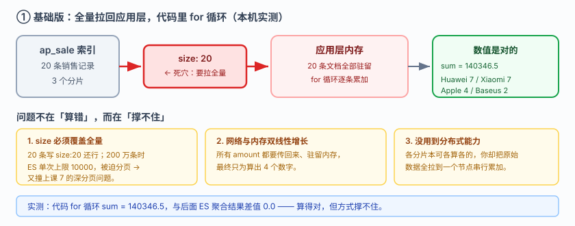
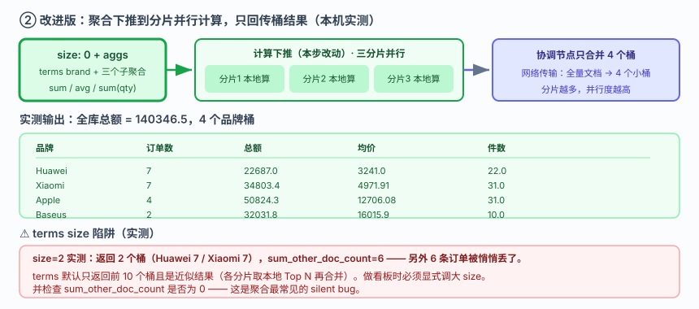
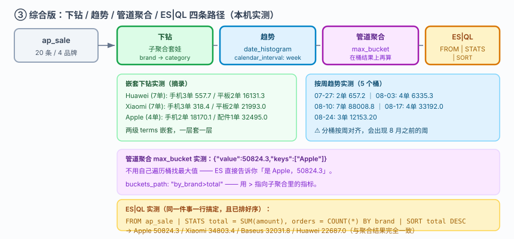

# 应用实战 · 聚合：一张销售看板从拉数据到聚合出来

> 对应课程：[课 8：聚合：不做搜索，做统计](../stages/3-查询与聚合/lessons/lesson-08-聚合不做搜索做统计.md) ｜ 覆盖知识点：桶聚合与指标聚合、子聚合与管道聚合、ES|QL 入门
> 定位：**会用，不上生产**——课里学完，在这里动手。课内验证的是"每种聚合长什么样"，这里做的是**一张销售看板从"拉回数据自己算"到"ES 一次算完"的完整演进**。
> 🧪 **本篇全部输出为本机 `l9-cluster`（ES 9.5.1，3 节点，`http://localhost:9201`）2026-09-20 实测**；脚本见 `playground/l17-app-t5.ps1`、`l17-app-t5b.ps1`

---

## 场景：运营要一张看板，你在代码里写 for 循环

**场景**：运营找你要一张销售看板——**各品牌的订单数、销售总额、平均单价、件数**，还要能按品牌下钻到品类，外加一周的趋势。你的第一反应是：把数据查出来，在代码里 for 循环算。

**全貌一句话**：真实项目还要考虑聚合精度（`doc_count_error_upper_bound`）、高基数字段的内存开销、以及用 transform 预计算——本课只解决**思路这一层**：把"拉数据 + 自己算"改成"让 ES 在分片上并行算完再汇总"。

---

### 数据准备（20 条销售记录，本篇共用）

```powershell
$ES = "http://localhost:9201"
$h  = @{ "Content-Type" = "application/json" }

Invoke-RestMethod "$ES/ap_sale" -Method Put -Headers $h -Body @'
{"mappings":{"properties":{
  "order_id":{"type":"keyword"},"product":{"type":"keyword"},
  "brand":{"type":"keyword"},"category":{"type":"keyword"},
  "amount":{"type":"scaled_float","scaling_factor":100},
  "qty":{"type":"integer"},"region":{"type":"keyword"},
  "sold_at":{"type":"date","format":"yyyy-MM-dd"}}}}
'@ | Out-Null
```

字段：`order_id` / `product` / `brand` / `category` / `amount` / `qty` / `region` / `sold_at`（2026-08 内的日期）。

---

### ① 基础实现（能跑但幼稚）：查回来，代码里算

这是最直觉的写法——查出所有文档，在应用层循环：

```powershell
$r = Invoke-RestMethod "$ES/ap_sale/_search" -Method Post -Headers $h -Body @'
{"size":20,"_source":["brand","category","amount"]}
'@
$sum = 0; $byBrand = @{}
foreach ($hit in $r.hits.hits) {
  $sum += $hit._source.amount
  $byBrand[$hit._source.brand] = ($byBrand[$hit._source.brand] ?? 0) + 1
}
```



> 看图：20 条文档经过网络传到应用层，再在内存里循环。**网络传输量与内存占用都随数据量线性增长**——图上标注的 `size: 20` 就是这个做法的死穴：数据量一大就必须分页，而分页又带上课 7 讲的深分页问题。

**实测输出**：

```
拉回 20 条文档到内存
  代码里 for 循环求和 = 140346.5
  代码里分组计数:
    Baseus : 2
    Xiaomi : 7
    Apple  : 4
    Huawei : 7
```

数值本身是对的——代码 for 循环求和 `140346.5`，与后面 ES 聚合的结果**完全一致（差值 0.0）**。

> ⚠️ **它的问题**（不是算错，是撑不住）：
> 1. **`size` 必须覆盖全量**：20 条时写 `size: 20` 还行，200 万条时怎么办？ES 单次最多返回 `max_result_window`（10000 条），你被迫分页——而分页又撞上课 7 的深分页上限。
> 2. **网络与内存双线性增长**：所有文档的 `amount` 都要传回来、都要驻留内存，只为算 4 个数字。
> 3. **没有用到 ES 的分布式能力**：每个分片本来可以各算各的，你却把所有原始数据拉到一个节点上串行累加。

---

### ② 改进一：`terms` 桶聚合 + 指标子聚合

把计算**下推到 ES**：分片各自算完，协调节点只做汇总。

```powershell
Invoke-RestMethod "$ES/ap_sale/_search" -Method Post -Headers $h -Body @'
{"size":0,
 "aggs":{
   "by_brand":{
     "terms":{"field":"brand","size":10},
     "aggs":{
       "total":  {"sum":{"field":"amount"}},
       "avg_amt":{"avg":{"field":"amount"}},
       "units":  {"sum":{"field":"qty"}}
     }},
   "grand_total":{"sum":{"field":"amount"}}
 }}
'@
```

**实测输出**：

```
全库总额 = 140346.5
按品牌分桶 (4 个):
    Huawei   订单=7  总额=22687.0   均价=3241.0    件数=22.0
    Xiaomi   订单=7  总额=34803.4   均价=4971.91   件数=31.0
    Apple    订单=4  总额=50824.3   均价=12706.08  件数=31.0
    Baseus   订单=2  总额=32031.8   均价=16015.9   件数=10.0
sum_other_doc_count = 0
```

**与代码 for 循环的对照**：`sum` 差值 **0.0**——结果一致，但只传回了 4 个桶而不是 20 条文档。`size: 0` 表示"我不要原始文档，只要聚合结果"。



> 看图：与上一张同布局，计算被下推（高亮处）——三个分片各自在本地算 `sum`/`avg`，协调节点只合并 4 个桶的结果。**网络传输从"全量文档"变成"4 个小桶"**，且分片越多并行度越高。

> ⚠️ **它的问题**：
> 1. **看板要下钻，现在做不到**：运营说"点开 Huawei 看它各品类卖多少"——单层 `terms` 给不出这个结构。
> 2. **没时间维度**："按周看趋势"需要另一种桶。
> 3. **`terms` 的 `size` 有陷阱**（实测，见下）——这是聚合最常见的 silent bug。

> ⚠️ **`terms` size 陷阱（实测，务必记住）**

把 `size` 改成 2 后实测：

```
size=2 返回 2 个桶, sum_other_doc_count=6
    Huawei : 7
    Xiaomi : 7
doc_count_error_upper_bound = 0
```

**4 个品牌只返回了 2 个，另外 6 条订单被塞进 `sum_other_doc_count` 里悄悄丢了。** `terms` 默认只返回前 10 个桶，且**返回的是近似结果**——分片各自取本地 Top N 再合并，可能不准。做看板时如果品牌超过 10 个，必须显式调大 `size`，并检查 `sum_other_doc_count` 是否为 0。

---

### ③ 改进二：嵌套下钻 + 时间趋势

**品牌 → 品类两级下钻**（子聚合套子聚合）：

```powershell
Invoke-RestMethod "$ES/ap_sale/_search" -Method Post -Headers $h -Body @'
{"size":0,"aggs":{"by_brand":{
  "terms":{"field":"brand","size":10},
  "aggs":{"by_cat":{
    "terms":{"field":"category","size":10},
    "aggs":{"total":{"sum":{"field":"amount"}}}}}}}}
'@
```

**实测输出**：

```
Huawei (7 单):
    - 手机  3 单  总额=557.7
    - 平板  2 单  总额=16131.3
    - 配件  2 单  总额=5998.0
Xiaomi (7 单):
    - 手机  3 单  总额=318.4
    - 平板  2 单  总额=21993.0
    - 配件  2 单  总额=12492.0
Apple (4 单):
    - 手机  2 单  总额=18170.1
    - 平板  1 单  总额=159.20
    - 配件  1 单  总额=32495.0
Baseus (2 单):
    - 平板  1 单  总额=31992.0
    - 手机  1 单  总额=39.80
```

**按周趋势**（`date_histogram`）：

```powershell
Invoke-RestMethod "$ES/ap_sale/_search" -Method Post -Headers $h -Body @'
{"size":0,"aggs":{"by_day":{
  "date_histogram":{"field":"sold_at","calendar_interval":"week","format":"yyyy-MM-dd"},
  "aggs":{"total":{"sum":{"field":"amount"}}}}}}
'@
```

**实测输出**：

```
2026-07-27  2 单  总额=657.2
2026-08-03  4 单  总额=6335.3
2026-08-10  7 单  总额=88008.8
2026-08-17  4 单  总额=33192.0
2026-08-24  3 单  总额=12153.20
```

> ⚠️ **注意 `date_histogram` 默认会把空桶也返回**（`min_doc_count: 0` 时），且分桶起点按周对齐（这里出现了 07-27 这个 8 月之前的周）。做趋势图时要么接受这个对齐，要么显式设 `min_doc_count: 1` 过滤空桶。

---

### ④ 综合实现：管道聚合 + ES|QL

**管道聚合：在聚合结果上再做聚合**（找出销售额最高的品牌）：

```powershell
Invoke-RestMethod "$ES/ap_sale/_search" -Method Post -Headers $h -Body @'
{"size":0,"aggs":{
  "by_brand":{"terms":{"field":"brand","size":10},
    "aggs":{"total":{"sum":{"field":"amount"}}}},
  "max_brand":{"max_bucket":{"buckets_path":"by_brand>total"}}}}
'@
```

**实测输出**：

```
max_bucket 输出: {"value":50824.3,"keys":["Apple"]}
```

**`max_bucket` 直接告诉你"是 Apple，50824.3"**——不用自己遍历桶找最大值。

**同一件事用 ES|QL 写**（课 8 讲的 ES|QL，管道式语法更贴近 SQL 思维）：

```powershell
Invoke-RestMethod "$ES/_query?format=json" -Method Post -Headers $h -Body @'
{"query":"FROM ap_sale | STATS total = SUM(amount), orders = COUNT(*) BY brand | SORT total DESC"}
'@
```

**实测输出**：

```
columns: total | orders | brand
    50824.3  |  4  |  Apple
    34803.4  |  7  |  Xiaomi
    32031.8  |  2  |  Baseus
    22687.0  |  7  |  Huawei
```

**与聚合结果完全一致**（Apple 50824.3 / Xiaomi 34803.4 / Baseus 32031.8 / Huawei 22687.0），且**已经按 total 降序排好**——省掉了管道聚合那一步。



> 看图：从同一个索引出发的四条路径（高亮处）——**下钻**用子聚合套娃，**趋势**用 `date_histogram`，**管道聚合**在桶结果上再算一次，**ES|QL** 用管道语法一行搞定。看板做深了这四种都会用到。

> 🎯 **会用标志**：看到"把数据查回来在代码里算"能立刻指出问题不在算错、而在 `size` 上限与网络内存；写 `terms` 聚合时会主动检查 `sum_other_doc_count` 是否为 0（而不是默认前 10 个桶就完事）；知道 `max_bucket` 这类管道聚合是"在聚合结果上再聚合"；并且能用 ES|QL 一行写出同样的统计，在两种写法之间按场景选择。

---

## 🧭 导航

- ⬅️ 回到课程：[课 8：聚合：不做搜索，做统计](../stages/3-查询与聚合/lessons/lesson-08-聚合不做搜索做统计.md)
- 📚 全部实战：[应用实战索引](INDEX.md)
- ⬅️ 上一课实战：[07 · 让它排对、翻得动、拼错也有结果](07-为什么这条排在前面.md)
- ➡️ 下一课实战：[09 · 分片数定错了怎么救](09-分片分布式的基石.md)

---

> ⚠️ **执行环境**：本篇命令在 **Windows PowerShell** 下实测。**不要在 WSL 里照抄**——本机实测 WSL2 因 NAT 隔离连不上 Windows 侧 9201（详见课 16 第四幕环境结论）。
> ⚠️ **PowerShell 5.1 编码坑**：`Invoke-RestMethod` 会把 ES 返回的 UTF-8 中文按 Latin-1 解析成乱码；无 BOM 的 `.ps1` 脚本中文也会被吞成 `?`。复现脚本用 `HttpClient` + 显式 UTF-8 解码 + 带 BOM 脚本文件绕开。
> ⚠️ **本篇实测踩到的两个脚本 bug**（写复杂聚合时容易犯）：
> 1. 同一层级写两个 `"aggs"` 键，后者会覆盖前者（PowerShell 的 hashtable 转 JSON 时会去重）——**多个聚合必须并列在同一个 `aggs` 块内**。
> 2. 手拼 JSON 字符串时多一个引号会让整批文档被 ES 拒绝，且不报错（实测写入 0 条才发现）。
>
> 实测脚本：`elasticsearch/playground/l17-app-t5.ps1`、`l17-app-t5b.ps1`（临时脚本，已按 `lXX-*` 惯例忽略）。
