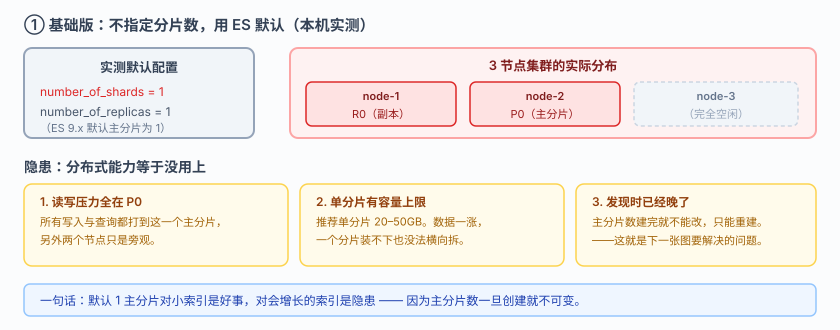
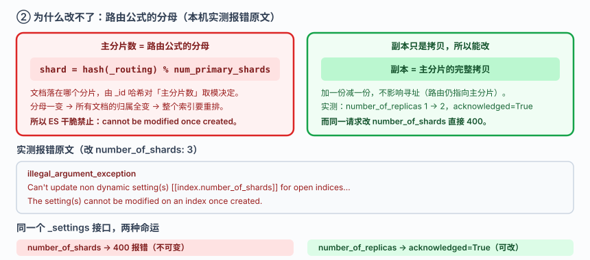
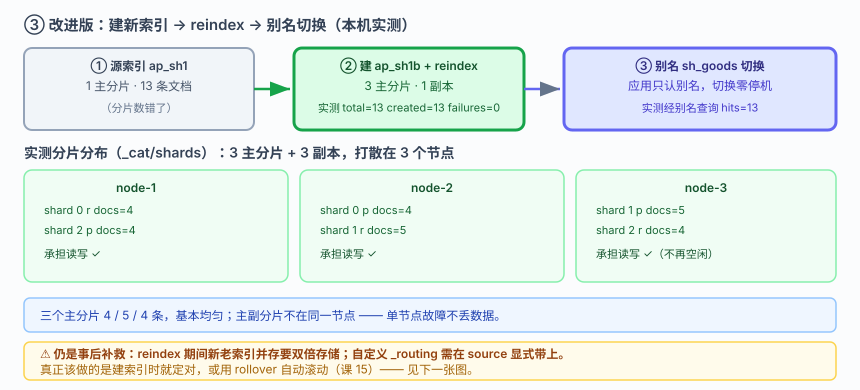
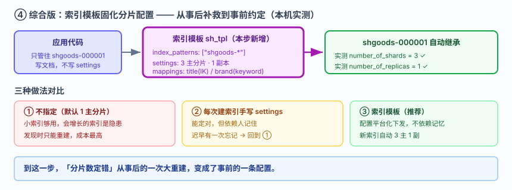

# 应用实战 · 分片：分片数定错了怎么救

> 对应课程：[课 9：分片：ES 分布式的基石](../stages/4-分布式与工程实践/lessons/lesson-09-分片分布式的基石.md) ｜ 覆盖知识点：分片与副本机制、分布式写流程、分布式读流程
> 定位：**会用，不上生产**——课里学完，在这里动手。课内验证的是"分片怎么分布"，这里做的是**一个索引分片数定错之后，从"改不动"到"低成本重建"的完整过程**。
> 🧪 **本篇全部输出为本机 `l9-cluster`（ES 9.5.1，3 节点，`http://localhost:9201`）2026-09-20 实测**；脚本见 `playground/l17-app-t6.ps1`

---

## 场景：索引建完才发现分片数不对，改不了

**场景**：你建索引时没想太多，直接用了默认配置。上线一个月后数据量涨上来，你发现**主分片只有 1 个**——所有数据挤在一个分片上，另外两个节点闲着。你想把它改成 3 个，执行后却报错。

**全貌一句话**：真实项目还要考虑单分片容量上限（建议 20–50GB）、`shrink`/`split` API 这类原地调整手段、以及 rollover 滚动（课 15 讲）——本课只解决**认知与动作这一层**：为什么改不了，以及正确的重建姿势。

---

### ① 基础实现（能跑但幼稚）：不指定分片数，用默认值

**最常见的建法**——直接写文档，让 ES 自动建索引：

```powershell
$ES = "http://localhost:9201"
$h  = @{ "Content-Type" = "application/json" }

Invoke-RestMethod "$ES/ap_sh1/_doc" -Method Post -Headers $h -Body '{"title":"文档1","brand":"A"}' | Out-Null
```

看看 ES 给了什么默认值：

```powershell
(Invoke-RestMethod "$ES/ap_sh1/_settings").ap_sh1.settings.index
```

**实测输出**：

```
默认 number_of_shards   = 1
默认 number_of_replicas = 1
```

> ES 9.x 的默认主分片数是 **1**（7.x 时代是 5，后来改成了 1）。这对小索引是好事，但对会增长的索引就是隐患。



> 看图：默认配置下只有 1 个主分片（+1 副本），落在 2 个节点上，**第三个节点完全空闲**。所有写入和查询压力都集中在这一个主分片上——分布式能力等于没用上。

---

### ② 问题：想把主分片从 1 改成 3

```powershell
Invoke-RestMethod "$ES/ap_sh1/_settings" -Method Put -Headers $h -Body '{"index.number_of_shards":3}'
```

**实测报错**：

```
报错类型: illegal_argument_exception
报错原因: Can't update non dynamic setting(s) [[index.number_of_shards]] for open
          indices [[ap_sh1/LpRnifOMSg63Ha857Ra3pg]]. The setting(s)
          [[index.number_of_shards]] cannot be modified on an index once created.
          You will need to create a new index with the desired setting(s) and
          reindex your data.
```

**报错信息已经把答案写明了**：`create a new index ... and reindex your data`。

**对比：副本数是能改的**（实测）

```powershell
Invoke-RestMethod "$ES/ap_sh1/_settings" -Method Put -Headers $h -Body '{"index.number_of_replicas":2}'
```

```
改副本成功: acknowledged=True
现在 number_of_replicas = 2
主分片仍是              = 1
```

**同样的 `_settings` 接口，副本改得动、主分片改不动**——这个对比本身就是理解分片设计的钥匙。



> 看图：左半是**路由公式** `shard_num = hash(_routing) % num_primary_shards`（高亮处）——文档落在哪个分片，由 `_id` 的哈希对**主分片数**取模决定。分母一变，所有文档的归属全变，等于整个索引要重排，所以 ES 干脆禁止。右半是**副本**——它只是主分片的拷贝，加一份减一份不影响路由，所以可以动态改。

> **为什么改不了（一句话）**：主分片数是路由公式的分母，改它等于让所有文档重新找家；副本是拷贝，多一份少一份不影响寻址。

---

### ③ 改进实现：重建索引（建新索引 → reindex → 别名切换）

既然改不了，就**新建一个对的，把数据搬过去**。注意这是**零停机**的关键在于别名：应用从头到尾只认别名。

```powershell
# 1) 建目标索引，明确指定 3 主分片
Invoke-RestMethod "$ES/ap_sh1b" -Method Put -Headers $h -Body @'
{"settings":{"number_of_shards":3,"number_of_replicas":1},
 "mappings":{"properties":{"title":{"type":"text","analyzer":"ik_max_word","search_analyzer":"ik_smart"},
                           "brand":{"type":"keyword"}}}}
'@ | Out-Null

# 2) 搬迁数据
Invoke-RestMethod "$ES/_reindex?refresh=true" -Method Post -Headers $h -Body @'
{"source":{"index":"ap_sh1"},"dest":{"index":"ap_sh1b"}}
'@

# 3) 别名切换（应用无感）
Invoke-RestMethod "$ES/_aliases" -Method Post -Headers $h -Body @'
{"actions":[{"add":{"index":"ap_sh1b","alias":"sh_goods"}}]}
'@
```

**实测输出**：

```
源索引 ap_sh1 文档数 = 13
reindex: total=13 created=13 failures=0
目标索引 ap_sh1b 文档数 = 13
ap_sh1b number_of_shards = 3
经别名 sh_goods 查询 hits = 13
```

**13 条全部搬过去，零失败。**

**验证分片是否真的均匀分布了**（`_cat/shards` 实测）：

```
shard 0 p  docs=4  node=node-2
shard 0 r  docs=4  node=node-1
shard 1 p  docs=5  node=node-3
shard 1 r  docs=5  node=node-2
shard 2 r  docs=4  node=node-3
shard 2 p  docs=4  node=node-1
```

**三个主分片分别 4 / 5 / 4 条**，主副分片还**打散在不同节点上**——这正是要的效果。



> 看图：与第 1 张对比——现在是 3 主分片 + 3 副本，**6 个分片分散在 3 个节点上**，每个节点都承担读写。数据 4/5/4 基本均匀，且主副分片不在同一节点（保证单节点故障不丢数据）。

> ⚠️ **它的问题**：
> 1. **reindex 期间要双倍存储**——新老索引同时存在，磁盘要够。
> 2. **reindex 不搬 `_id` 之外的元数据**：如果你依赖自定义 `_routing`，需要在 source 里显式带上。
> 3. **这仍然是"事后补救"**：真正该做的是**建索引时就把分片数定对**，或者用 rollover 让它自动滚动（课 15）。

---

### ④ 综合实现：用索引模板固化分片配置

问题 3 的正解是**让配置不再依赖人记住**——用索引模板，以后所有匹配的索引自动继承：

```powershell
Invoke-RestMethod "$ES/_index_template/sh_tpl" -Method Put -Headers $h -Body @'
{
  "index_patterns": ["shgoods-*"],
  "template": {
    "settings": { "number_of_shards": 3, "number_of_replicas": 1 },
    "mappings": { "properties": {
      "title": {"type":"text","analyzer":"ik_max_word","search_analyzer":"ik_smart"},
      "brand": {"type":"keyword"}
    } }
  }
}
'@ | Out-Null

# 以后建索引不用再想分片数
Invoke-RestMethod "$ES/shgoods-000001/_doc" -Method Post -Headers $h -Body '{"title":"模板创建","brand":"C"}' | Out-Null
```

**实测输出**：

```
模板建的索引 number_of_shards   = 3
模板建的索引 number_of_replicas = 1
```

**没写任何 settings，自动就是 3 主 1 副。**



> 看图：比上一张多了模板这一环（高亮处）——**索引模板**在索引创建时自动下发分片配置，应用侧只管往 `shgoods-000001` 写数据。**到这一步，"分片数定错"从事后的一次大重建，变成了事前的一条配置。**

> 🎯 **会用标志**：看到 `Can't update non dynamic setting(s) [index.number_of_shards]` 能立刻反应出"主分片数不可变，要重建"，而不是反复试各种 API；能说清为什么副本改得动而主分片改不动（路由公式的分母 vs 拷贝）；能独立完成"建新索引 → reindex → 别名切换"的零停机重建；并且知道用索引模板把分片配置固化下来，而不是每次建索引都靠记忆。

---

## 🧭 导航

- ⬅️ 回到课程：[课 9：分片：ES 分布式的基石](../stages/4-分布式与工程实践/lessons/lesson-09-分片分布式的基石.md)
- 📚 全部实战：[应用实战索引](INDEX.md)
- ⬅️ 上一课实战：[08 · 一张销售看板从拉数据到聚合出来](08-聚合不做搜索做统计.md)
- ➡️ 下一课实战：[10 · red 之后先做的三个判断](10-集群健康与排障.md)

---

> ⚠️ **执行环境**：本篇命令在 **Windows PowerShell** 下实测。**不要在 WSL 里照抄**——本机实测 WSL2 因 NAT 隔离连不上 Windows 侧 9201（详见课 16 第四幕环境结论）。
> ⚠️ **PowerShell 5.1 编码坑**：`Invoke-RestMethod` 会把 ES 返回的 UTF-8 中文按 Latin-1 解析成乱码；无 BOM 的 `.ps1` 脚本中文也会被吞成 `?`。复现脚本用 `HttpClient` + 显式 UTF-8 解码 + 带 BOM 脚本文件绕开。
> 实测脚本：`elasticsearch/playground/l17-app-t6.ps1`（临时脚本，已按 `lXX-*` 惯例忽略）。
