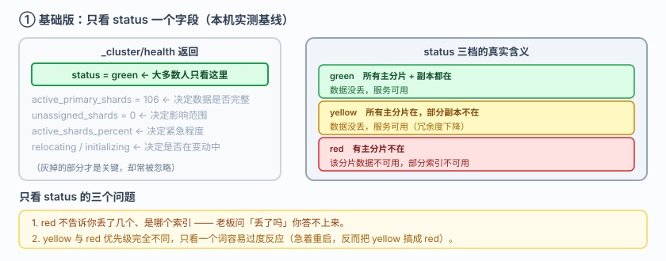
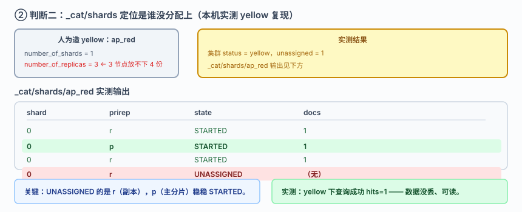
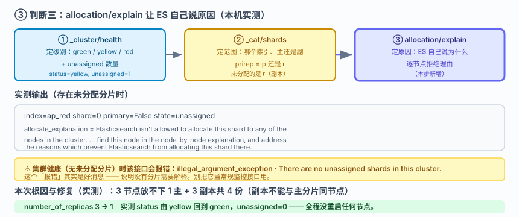
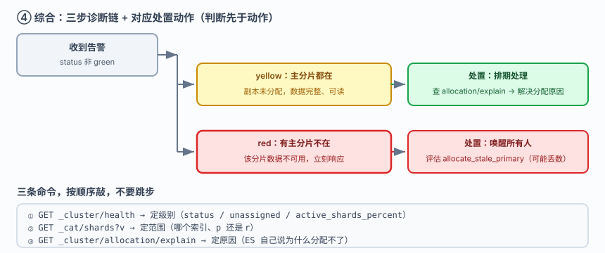

# 应用实战 · 集群健康：red 之后先做的三个判断

> 对应课程：[课 10：集群健康与排障](../stages/4-分布式与工程实践/lessons/lesson-10-集群健康与排障.md) ｜ 覆盖知识点：集群健康与故障转移、分片设计与容量规划、诊断与修片
> 定位：**会用，不上生产**——课里学完，在这里动手。课内验证的是"健康状态有哪些"，这里做的是**从"看到 red 就慌"到"三个判断定级别、定范围、定动作"的完整排障过程**。
> 🧪 **本篇全部输出为本机 `l9-cluster`（ES 9.5.1，3 节点，`http://localhost:9201`）2026-09-20 实测**；脚本见 `playground/l17-app-t7.ps1`

---

## 场景：凌晨三点告警，集群变 red，怎么判断数据丢没丢

**场景**：凌晨三点你被叫醒，监控显示 ES 集群 `red`。老板在群里问**"数据丢了吗"**。你打开电脑，敲下第一条命令……

**全貌一句话**：真实项目还要处理分片分配失败后的强制恢复（`allocate_stale_primary`）、节点永久下线的容量重算、以及 `cluster.routing.allocation` 相关配置——本课只解决**判断这一层**：red 不等于丢数据，先用三个判断把"级别 / 范围 / 动作"定下来，再动手。

---

### ① 基础实现（能跑但幼稚）：只看 `status` 一个字段

绝大多数人的排障起点，也是终点：

```powershell
$ES = "http://localhost:9201"
(Invoke-RestMethod "$ES/_cluster/health?pretty")
```

**实测输出（当前基线）**：

```
status=green  nodes=3  active_shards=128
active_primary_shards=106  unassigned_shards=0  relocating=0
```



> 看图：`_cluster/health` 返回一大堆字段，但很多人只看了最上面那个 `status`。图上灰掉的部分——`unassigned_shards`、`active_primary_shards`、`active_shards_percent`——**才是决定"数据丢没丢"的关键**，却常常被忽略。

> ⚠️ **它的问题**：
> 1. **`red` 只告诉你"有主分片不可用"，不告诉你丢了几个、是哪个索引**。老板问"丢了吗"，你答不上来。
> 2. **`yellow` 和 `red` 的处理优先级完全不同**——yellow 通常不丢数据、服务可用，red 才可能真丢。只看一个词，容易过度反应（比如急着重启节点，反而把 yellow 搞成 red）。
> 3. **`status` 是结果不是原因**——它不会告诉你"为什么"。

---

### ② 判断一：看 `unassigned` 与 `active_shards_percent`，定级别

`_cluster/health` 里真正该看的是这几个：

```powershell
$h = Invoke-RestMethod "$ES/_cluster/health?pretty"
$h.status
$h.active_primary_shards      # 主分片存活数 → 决定数据是否完整
$h.unassigned_shards          # 未分配分片数 → 决定影响范围
$h.active_shards_percent      # 存活百分比 → 决定紧急程度
```

**健康状态三档的真实含义**（这是排障的第一个分水岭）：

| status | 含义 | 数据丢了吗 | 服务可用吗 |
|---|---|---|---|
| `green` | 所有主分片 + 副本分片都在 | 没丢 | 可用 |
| `yellow` | **所有主分片在**，部分副本不在 | **没丢** | **可用** |
| `red` | 有**主分片**不在 | **该分片的數據不可用** | 部分索引不可用 |

> **最关键的一句话**：`yellow` 和 `red` 的分界线是**主分片在不在**，不是副本在不在。这是绝大多数人搞混的地方。

---

### ③ 判断二：`_cat/shards` 找出是主分片还是副本

**实测：人为造一个 yellow**——建一个 1 主 3 副本的索引（3 节点放不下 4 份，必然有副本分配失败）：

```powershell
Invoke-RestMethod "$ES/ap_red" -Method Put -Headers @{ "Content-Type" = "application/json" } -Body @'
{"settings":{"number_of_shards":1,"number_of_replicas":3},
 "mappings":{"properties":{"t":{"type":"keyword"}}}}
'@ | Out-Null
Invoke-RestMethod "$ES/ap_red/_doc" -Method Post -Headers @{ "Content-Type" = "application/json" } -Body '{"t":"a"}' | Out-Null
```

**实测输出**：

```
建完后集群 status = yellow  unassigned=1
```

现在用 `_cat/shards` 定位到底是谁没分配上：

```
shard=0 r  state=STARTED     docs=1
shard=0 p  state=STARTED     docs=1
shard=0 r  state=STARTED     docs=1
shard=0 r  state=UNASSIGNED  docs=
```

**关键观察**：`UNASSIGNED` 的那一行 `prirep = r`（副本），而 `p`（主分片）是 `STARTED`。

**所以：yellow + 未分配的是副本 = 数据没丢。** 实测验证——yellow 状态下查询依然成功：

```
查询成功 hits=1  （yellow 不丢数据、可读）
```



> 看图：1 个主分片 + 3 个副本，只有最右那个副本 `UNASSIGNED`（高亮处），主分片 `p` 稳稳 `STARTED`。**数据完整，只是冗余度下降**——此时如果再挂一个节点，才可能升级为 red。**这就是"yellow 可以先睡一觉"的依据。**

---

### ④ 判断三：`_cluster/allocation/explain` 让 ES 自己说原因

`_cat/shards` 告诉你"谁没分配上"，但不告诉你"为什么"。这个接口会给出**逐节点的拒绝理由**：

```powershell
Invoke-RestMethod "$ES/_cluster/allocation/explain?pretty"
```

**实测输出（存在未分配分片时）**：

```
index=ap_red shard=0 primary=False state=unassigned
allocate_explanation = Elasticsearch isn't allowed to allocate this shard to any of the
  nodes in the cluster. Choose a node to which you expect this shard to be allocated,
  find this node in the node-by-node explanation, and address the reasons which prevent
  Elasticsearch from allocating this shard there.
```

**注意：集群健康（无未分配分片）时这个接口会报错**（实测）：

```
illegal_argument_exception
There are no unassigned shards in this cluster. Specify an assigned shard in the
request body to explain its allocation.
```

> 这个"报错"其实是好消息——它说明没有分片需要解释。



> 看图：三条判断串成一条诊断链（高亮处）——① `_cluster/health` 定级别（green/yellow/red），② `_cat/shards` 定范围（哪个索引、主还是副），③ `allocation/explain` 定原因（ES 自己说为什么）。**三步走完才动手，避免瞎重启。**

**本次的根因与修复**（实测）：3 节点放不下 1 主 + 3 副本共 4 份（同一分片的副本不能与主分片同节点）。把副本降到 1：

```powershell
Invoke-RestMethod "$ES/ap_red/_settings" -Method Put -Headers @{ "Content-Type" = "application/json" } -Body '{"index.number_of_replicas":1}'
```

**实测输出**：

```
修复后 status = green  unassigned=0
```

**从 yellow 回到 green，全程没有重启任何节点。**

> ⚠️ **它的问题 / 边界**：
> 1. **本篇只演示了 yellow**。真正的 `red`（主分片丢失）要严重得多，可能涉及 `allocate_stale_primary` 强制恢复、**且可能丢最后几秒写入的数据**——那是需要单独评估的操作，不要照抄本篇动作。
> 2. **`allocation/explain` 在健康集群上会报错**，别把它当常规监控接口用。
> 3. **降副本是"让集群变绿"但不是"让数据更安全"**——副本从 3 降到 1，冗余度反而下降了。生产上要先弄清"为什么放不下"，是节点数不够还是磁盘阈值触发。

---

### ⑤ 综合：把三个判断固化成排查清单

**三条命令，按顺序敲，不要跳步**：

```
① GET _cluster/health             → 看 status / unassigned / active_shards_percent（定级别）
② GET _cat/shards?v               → 找出非 STARTED 的分片，区分 p 还是 r（定范围）
③ GET _cluster/allocation/explain → 看 ES 自己说为什么分配不了（定原因）
```



> 看图：完整的诊断—处置链路（高亮处）。**判断先于动作**——`yellow + 副本未分配` 可以排期处理；`red + 主分片未分配` 才是要立刻唤醒所有人的级别。图上右侧对应每档的处置动作，避免"看到红就重启"这种本能反应。

> 🎯 **会用标志**：被叫醒时能立刻说出"`yellow` 不等于丢数据，要看主分片在不在"；会按 `health → cat/shards → allocation/explain` 三步顺序排查而不是上来就重启节点；看到 `prirep = r` 且 `UNASSIGNED` 能判断出"冗余度下降但数据完整"，并知道修复方向是"解决分配不下去的原因"而不是"把报警消掉"。

---

## 🧭 导航

- ⬅️ 回到课程：[课 10：集群健康与排障](../stages/4-分布式与工程实践/lessons/lesson-10-集群健康与排障.md)
- 📚 全部实战：[应用实战索引](INDEX.md)
- ⬅️ 上一课实战：[09 · 分片数定错了怎么救](09-分片分布式的基石.md)
- ➡️ 下一课实战：[11 · 给脏数据加一道加工车间](11-数据管道与备份.md)

---

> ⚠️ **执行环境**：本篇命令在 **Windows PowerShell** 下实测。**不要在 WSL 里照抄**——本机实测 WSL2 因 NAT 隔离连不上 Windows 侧 9201（详见课 16 第四幕环境结论）。
> ⚠️ **本篇只演示 yellow，未制造 red**：`l9-cluster` 上还跑着 32 个历史教学索引（含课 12 的关键资产 `l9_trap2`），制造真实 red 有损坏教学资产的风险。真正的 red 处置要比本篇谨慎得多，请勿照抄动作。
> ⚠️ **PowerShell 5.1 编码坑**：`Invoke-RestMethod` 会把 ES 返回的 UTF-8 中文按 Latin-1 解析成乱码；无 BOM 的 `.ps1` 脚本中文也会被吞成 `?`。复现脚本用 `HttpClient` + 显式 UTF-8 解码 + 带 BOM 脚本文件绕开。
> 实测脚本：`elasticsearch/playground/l17-app-t7.ps1`（临时脚本，已按 `lXX-*` 惯例忽略）。
