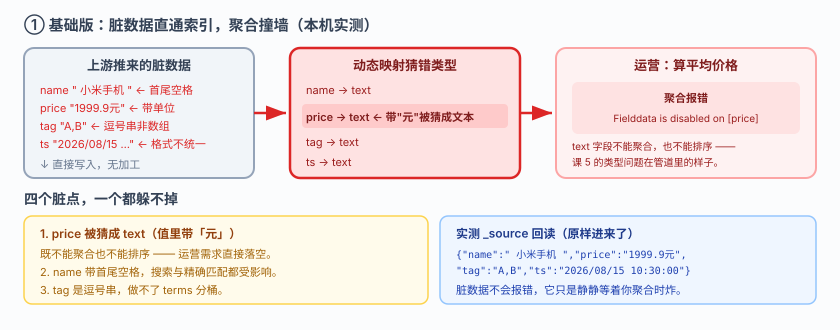
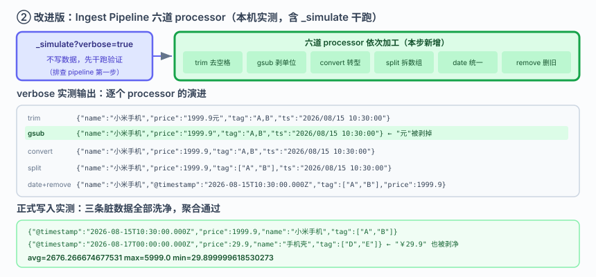
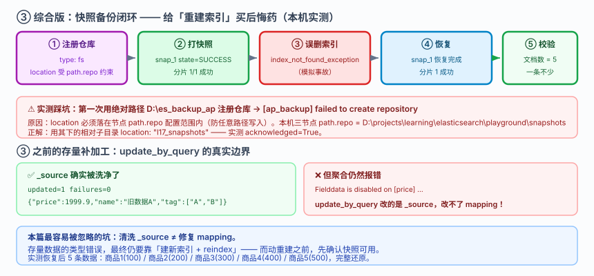

# 应用实战 · 数据管道：给脏数据加一道加工车间

> 对应课程：[课 11：数据管道与备份](../stages/4-分布式与工程实践/lessons/lesson-11-数据管道与备份.md) ｜ 覆盖知识点：Ingest Pipeline、Reindex 与 Update By Query、快照与恢复
> 定位：**会用，不上生产**——课里学完，在这里动手。课内验证的是"pipeline 怎么写"，这里做的是**一批脏数据从"进得去出不来"到"进得来、算得动、丢不掉"的完整过程**。
> 🧪 **本篇全部输出为本机 `l9-cluster`（ES 9.5.1，3 节点，`http://localhost:9201`）2026-09-20 实测**；脚本见 `playground/l17-app-t8.ps1`、`l17-app-t8b.ps1`、`l17-app-t8c.ps1`

---

## 场景：上游给了脏数据，索引已经建好了

**场景**：上游系统推过来的商品数据长这样——价格带单位、名字带空格、标签是逗号串、日期格式不统一：

```json
{"name":"  小米手机  ","price":"1999.9元","tag":"A,B","ts":"2026/08/15 10:30:00"}
```

你的索引已经建好上线了。运营要"平均价格"，一聚合就报错。

**全貌一句话**：真实项目还要考虑 pipeline 版本管理、失败队列（dead letter queue）、以及用 Logstash / Kafka Connect 做更重的 ETL——本课只解决**入口这一层**：在写入路径上加一道加工车间，并对已有数据补加工，最后用快照兜底。

---

### ① 基础实现（能跑但幼稚）：脏数据直接进索引

不加工，直接写：

```powershell
$ES = "http://localhost:9201"
$h  = @{ "Content-Type" = "application/json" }

Invoke-RestMethod "$ES/ap_raw/_doc" -Method Post -Headers $h -Body @'
{"name":"  小米手机  ","price":"1999.9元","tag":"A,B","ts":"2026/08/15 10:30:00"}
'@ | Out-Null
```

**回读 `_source`，原样进来了**：

```
{"name":"  小米手机  ","price":"1999.9元","tag":"A,B","ts":"2026/08/15 10:30:00"}
```

运营要平均价格，一聚合就报错（实测）：

```
聚合报错: Fielddata is disabled on [price] in [ap_raw].
          Text fields are not optimised for operations that require per-document
          field data like aggregations and sorting...
          Please use a keyword field instead.
```



> 看图：四条脏数据从上游直接写入索引（高亮处 `price` 带"元"字被猜成 `text`），右侧"算平均价"的需求撞在 text 字段上，报 `Fielddata is disabled`。**这就是课 5 讲的类型问题在真实数据管道里的样子。**

> ⚠️ **它的问题**：
> 1. **`price` 被猜成 `text`**（因为值里带"元"），既不能聚合也不能排序。
> 2. **`name` 带首尾空格**——搜索和精确匹配都会受影响。
> 3. **`tag` 是逗号串**——做不了 terms 分桶（它想要数组）。
> 4. **日期格式不统一**——`2026/08/15 10:30:00` 和 `2026-08-16` 混在一起。

---

### ② 改进一：Ingest Pipeline 在写入路径上加车间

**先别急着写数据**——用 `_simulate` 干跑，看每个 processor 的效果（实测）：

```powershell
$pipe = @{
  description = "商品数据清洗"
  processors = @(
    @{ trim    = @{ field = "name" } },
    @{ gsub    = @{ field = "price"; pattern = "[^0-9.]"; replacement = "" } },
    @{ convert = @{ field = "price"; type = "double"; ignore_missing = $true } },
    @{ split   = @{ field = "tag"; separator = "," } },
    @{ date    = @{ field = "ts"; target_field = "@timestamp"
                    formats = @("yyyy/MM/dd HH:mm:ss","yyyy-MM-dd"); ignore_failure = $true } },
    @{ remove  = @{ field = "ts"; ignore_missing = $true } }
  )
  on_failure = @(@{ set = @{ field = "error"; value = "{{ _ingest.on_failure_message }}" } })
} | ConvertTo-Json -Depth 10 -Compress

Invoke-RestMethod "$ES/_ingest/pipeline/clean_goods" -Method Put -Headers $h -Body $pipe | Out-Null
```

**`_simulate?verbose=true` 实测输出（逐个 processor 的演进）**：

```
[] {"name":"小米手机","tag":"A,B","price":"1999.9元","ts":"2026/08/15 10:30:00"}   ← trim
[] {"name":"小米手机","tag":"A,B","price":"1999.9","ts":"2026/08/15 10:30:00"}     ← gsub 剥掉"元"
[] {"name":"小米手机","tag":"A,B","price":1999.9,"ts":"2026/08/15 10:30:00"}       ← convert
[] {"name":"小米手机","tag":["A","B"],"price":1999.9,"ts":"2026/08/15 10:30:00"}   ← split
[] {"name":"小米手机","@timestamp":"2026-08-15T10:30:00.000Z",...}                 ← date
[] {"name":"小米手机","@timestamp":"2026-08-15T10:30:00.000Z","tag":["A","B"],"price":1999.9}  ← remove
```

**`gsub` 是关键一步**：`pattern: "[^0-9.]"` 把 `1999.9元` 里的"元"剥掉，否则 `convert` 会直接失败（实测报错 `unable to convert [1999.9元] to double`）。

**正式写入，走 pipeline**：

```powershell
Invoke-RestMethod "$ES/ap_raw2/_doc?pipeline=clean_goods" -Method Post -Headers $h -Body @'
{"name":"  小米手机  ","price":"1999.9元","tag":"A,B","ts":"2026/08/15 10:30:00"}
'@
```

**实测输出（三条脏数据全部被洗净）**：

```
{"@timestamp":"2026-08-15T10:30:00.000Z","price":1999.9,"name":"小米手机","tag":["A","B"]}
{"@timestamp":"2026-08-16T00:00:00.000Z","price":5999.0,"name":"华为手机","tag":["C"]}
{"@timestamp":"2026-08-17T00:00:00.000Z","price":29.9,"name":"手机壳","tag":["D","E"]}
```

**现在聚合通了**（实测）：

```
avg=2676.266674677531  max=5999.0  min=29.899999618530273
```



> 看图：数据在写入前先过六道 processor（高亮处）——`trim` 去空格、`gsub` 剥单位、`convert` 转类型、`split` 拆数组、`date` 统一时间、`remove` 删原字段。`_simulate` 左侧提供"不写数据的干跑"能力，**先验证再上线**。

> ⚠️ **它的问题**：
> 1. **只对新写入生效**——已经躺在索引里的旧数据没被加工。
> 2. **`on_failure` 我设了 `error` 字段兜底**，但这意味着坏数据仍然写进去了（只是多了个错误标记）。生产上要考虑失败队列。

---

### ③ 改进二：`update_by_query` 给存量数据补加工

对已有索引，用 `update_by_query` 让存量数据重过一遍 pipeline：

```powershell
Invoke-RestMethod "$ES/ap_raw/_update_by_query?refresh=true&pipeline=clean_goods" `
  -Method Post -Headers $h -Body '{"query":{"match_all":{}}}'
```

**实测输出**：

```
updated=1  failures=0
{"@timestamp":"2026-08-15T10:30:00.000Z","price":1999.9,"name":"旧数据A","tag":["A","B"]}
```

**`_source` 确实被改了**——旧数据也洗干净了。

> ⚠️ **它的问题（重要实测结论）**：聚合**仍然报错**：

```
仍报错: Fielddata is disabled on [price] in [ap_raw]...
```

**为什么？** 因为 `update_by_query` 改的是 `_source`，**改不了 mapping**。`price` 字段在动态映射时已经被定型为 `text`，你把值洗成数字，`_source.price` 确实是数字了，但**倒排索引里的 `price` 字段类型仍是 text**，所以聚合照样失败。

> 这一条是本篇最容易被忽略的坑：**清洗 `_source` ≠ 修复 mapping**。存量数据的类型错误，最终仍要靠"建新索引 + reindex"（课 5、课 9 讲过的重建路径）。

---

### ④ 综合实现：快照备份，给重建兜底

既然动不动就要重建，那备份就是刚需。先探测仓库路径（实测本机三个节点的 `path.repo` 都配置为 `D:\projects\learning\elasticsearch\playground\snapshots`）：

```powershell
# 1) 注册仓库（location 必须是 path.repo 之内的路径）
Invoke-RestMethod "$ES/_snapshot/ap_backup" -Method Put -Headers $h -Body @'
{"type":"fs","settings":{"location":"l17_snapshots"}}
'@
```

> ⚠️ **实测踩坑**：我第一次用绝对路径 `D:\es_backup_ap` 注册，直接失败 `[ap_backup] failed to create repository`。原因：ES 要求 `location` 必须落在节点 `path.repo` 配置范围内，否则拒绝注册（防止任意路径写入）。

```powershell
# 2) 做快照
Invoke-RestMethod "$ES/_snapshot/ap_backup/snap_1?wait_for_completion=true" -Method Put -Headers $h -Body @'
{"indices":"ap_bk","include_global_state":false}
'@
```

**实测输出**：

```
注册成功 acknowledged=True
快照前文档数 = 5
快照完成: snap_1  state=SUCCESS
分片成功数 = 1 / 总 1
包含索引 = ap_bk
```

**删索引再恢复**（实测）：

```
索引已删除: index_not_found_exception
恢复完成: snap_1
分片成功数 = 1
恢复后文档数 = 5
    商品1  price=100
    商品2  price=200
    商品3  price=300
    商品4  price=400
    商品5  price=500
```

**5 条数据一条不少地回来了。**



> 看图：完整的备份闭环（高亮处）——注册仓库（受 `path.repo` 约束）→ 打快照 → 模拟误删 → 恢复 → 校验文档数。**到这一步，"重建索引"这个高风险动作有了后悔药。**

> 🎯 **会用标志**：拿到一批脏数据，能想到在写入路径加 Ingest Pipeline 而不是在应用层写清洗代码；会用 `_simulate?verbose=true` 先干跑验证每步效果；知道 `gsub` 剥单位要在 `convert` 之前（顺序错了会失败）；能说清 `update_by_query` 改的是 `_source` 而**改不了 mapping**；并且能在动手重建索引前先确认快照可用。

---

## 🧭 导航

- ⬅️ 回到课程：[课 11：数据管道与备份](../stages/4-分布式与工程实践/lessons/lesson-11-数据管道与备份.md)
- 📚 全部实战：[应用实战索引](INDEX.md)
- ⬅️ 上一课实战：[10 · red 之后先做的三个判断](10-集群健康与排障.md)
- ➡️ 下一课实战：[12 · 让 ES 跟上数据库](12-接入真实项目.md)

---

> ⚠️ **执行环境**：本篇命令在 **Windows PowerShell** 下实测。**不要在 WSL 里照抄**——本机实测 WSL2 因 NAT 隔离连不上 Windows 侧 9201（详见课 16 第四幕环境结论）。
> ⚠️ **PowerShell 5.1 编码坑**：`Invoke-RestMethod` 会把 ES 返回的 UTF-8 中文按 Latin-1 解析成乱码；无 BOM 的 `.ps1` 脚本中文也会被吞成 `?`；复杂嵌套 JSON 必须用 `ConvertTo-Json -Depth 10` 构造（手拼会被引号问题吞掉）。
> 实测脚本：`elasticsearch/playground/l17-app-t8.ps1`、`l17-app-t8b.ps1`、`l17-app-t8c.ps1`（临时脚本，已按 `lXX-*` 惯例忽略）。
