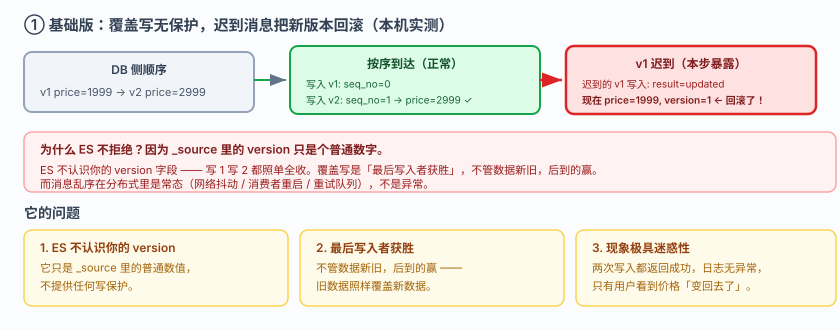
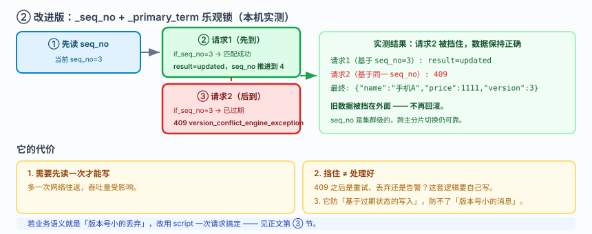
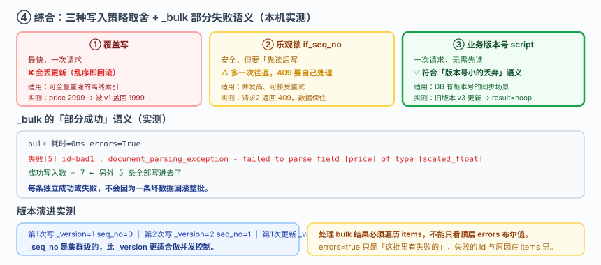

# 应用实战 · 数据同步：让 ES 跟上数据库

> 对应课程：[课 12：接入真实项目](../stages/4-分布式与工程实践/lessons/lesson-12-接入真实项目.md) ｜ 覆盖知识点：客户端选型与集成、数据同步模式、搜索应用架构
> 定位：**会用，不上生产**——课里学完，在这里动手。课内验证的是"客户端怎么连"，这里做的是**同步链路从"会丢更新"到"乱序也不怕、失败可重试"的完整演进**。
> 🧪 **本篇全部输出为本机 `l9-cluster`（ES 9.5.1，3 节点，`http://localhost:9201`）2026-09-20 实测**；脚本见 `playground/l17-app-t9.ps1`

---

## 场景：数据库改了数据，ES 里还是旧的

**场景**：你用"应用层双写"同步——改完 MySQL 就往 ES 写一次。上线后运营反馈："我明明把价格从 1999 改成 2999 了，搜索页还是 1999。" 你查日志，两次写入都成功了。

**全貌一句话**：真实项目还要处理 CDC 订阅（Canal / Debezium）、消息队列削峰、以及全量校验与补偿（对账任务）——本课只解决**写入这一层**：让同步在乱序和并发下仍然正确。

---

### ① 基础实现（能跑但幼稚）：直接覆盖写

同步逻辑就是"数据库改成什么样，就往 ES 覆盖写一次"：

```powershell
$ES = "http://localhost:9201"
$h  = @{ "Content-Type" = "application/json" }

# 第一次同步（价格 1999，版本 1）
Invoke-RestMethod "$ES/ap_sync/_doc/1001" -Method Post -Headers $h -Body '{"name":"手机","price":1999,"version":1}'
# 第二次同步（价格 2999，版本 2）
Invoke-RestMethod "$ES/ap_sync/_doc/1001" -Method Post -Headers $h -Body '{"name":"手机","price":2999,"version":2}'
```

**实测输出**：

```
写入 v1: seq_no=0 primary_term=1
写入 v2: seq_no=1 primary_term=1
当前: {"name":"手机","price":2999,"version":2}
```

看起来很正常。**问题出在乱序**——如果 v1 的写入因为网络/重试迟到了：

```
迟到的 v1 写入: result=updated
现在: {"name":"手机","price":1999,"version":1}   ← 旧版本盖掉了新版本！
```



> 看图：v1 与 v2 两个同步消息本应按序到达，但 v1 迟到（高亮处），直接覆盖写进了 ES，**把已经生效的 v2 回滚成了 v1**。ES 不会因为 `version` 字段小就拒绝——`version` 只是你 `_source` 里的一个普通数字，ES 根本不认识它。

> ⚠️ **它的问题**：
> 1. **ES 不认识你的 `version` 字段**：它只是 `_source` 里的一个普通数值，写 1 写 2 都照单全收。
> 2. **覆盖写是"最后写入者获胜"**——不管数据新旧，后到的赢。
> 3. **消息乱序在分布式里是常态**，不是异常：网络抖动、消费者重启、重试队列都会造成乱序。

---

### ② 改进一：`_seq_no` + `_primary_term` 乐观锁

ES 给每个文档维护了集群级的 **`_seq_no`（序列号）**。带上它做条件写入，就能挡住"基于过期状态"的写入：

```powershell
# 先读当前 seq_no
$cur = Invoke-RestMethod "$ES/ap_sync/_doc/1001"
# 带条件写入：只有 seq_no 没变才允许写
Invoke-RestMethod "$ES/ap_sync/_doc/1001?if_seq_no=$($cur._seq_no)&if_primary_term=$($cur._primary_term)" `
  -Method Post -Headers $h -Body '{"name":"手机","price":2999,"version":2}'
```

**实测：模拟两个并发请求都基于同一个旧 `seq_no`**：

```
请求1（基于 seq_no=3）: result=updated
请求2（基于同一 seq_no）: version_conflict_engine_exception status=409
最终: {"name":"手机A","price":1111,"version":3}   ← 请求2 被挡住，没覆盖
```

**请求 2 拿到了 409**，数据保持请求 1 写入的结果。



> 看图：与上一张同布局，写入带上了 `if_seq_no` / `if_primary_term`（高亮处）。请求 1 先到并推进了 `seq_no`；请求 2 拿着过期的 `seq_no` 到达时，ES 发现对不上，**直接返回 409 而不是覆盖**——旧数据被挡在外面。

> ⚠️ **它的问题**：
> 1. **需要先读一次才能写**——多一次网络往返，吞吐量受影响。
> 2. **挡住 ≠ 处理好**：409 之后你还得决定是重试、丢弃还是告警，这套逻辑要自己写。
> 3. **它防的是"基于过期状态的写入"**，但如果你就是想让"版本号小的消息不生效"，需要业务层的版本号。

---

### ③ 改进二：业务版本号 + script 比较后写入

更贴近业务的做法：**把"版本号小的丢弃"这个规则写进 ES 的 script**，一次请求搞定，不用先读：

```powershell
Invoke-RestMethod "$ES/ap_sync/_update/1002" -Method Post -Headers $h -Body @'
{"script":{
  "source":"if (ctx._source.version < params.v) { ctx._source.price = params.p; ctx._source.version = params.v } else { ctx.op = \"noop\" }",
  "params":{"v":6,"p":3500}}}
'@
```

**实测输出**：

```
用更高版本 6 更新: result=updated
  现在: {"name":"平板","price":3500,"version":6}
用旧版本 3 更新: result=noop   ← noop 表示被拒绝
  现在: {"name":"平板","price":3500,"version":6}   ← 旧版本没覆盖新版本
```

**`result=noop`** —— ES 明确告诉你"这次什么都没做"。迟到的旧消息被静默丢弃，且不报错、不污染数据。

> ⚠️ **它的问题**：script 更新比普通写入**更耗 CPU**，高吞吐场景要评估；且 script 逻辑复杂后不好调试。

---

### ④ 综合实现：`_bulk` 批量同步 + 部分失败处理

真实同步都是批量的。关键是**理解 bulk 的"部分成功"语义**：

```powershell
# 5 条正常 + 1 条故意写错（price 是字符串）
Invoke-RestMethod "$ES/ap_sync/_bulk?refresh=true" -Method Post -Headers $h -Body $bulkBody
```

**实测输出**：

```
bulk 耗时=0ms  errors=True
  失败[5] id=bad1 : document_parsing_exception - failed to parse field [price]
                    of type [scaled_float] in document with id 'bad1'.
成功写入数 = 7
```

**关键观察**：`errors=true`，但**另外 5 条全部成功写入了**。这是 bulk 的核心语义——**每条独立成功或失败，不会因为一条坏数据回滚整批**。

**所以处理 bulk 结果必须遍历 `items`，而不是只看 `errors` 标志**：

```powershell
foreach ($item in $result.items) {
  if ($item.index.error) {
    # 记录失败 id 与原因，进重试队列
    Write-Output "失败 id=$($item.index._id) : $($item.index.error.reason)"
  }
}
```

**版本演进（实测）**：

```
第1次写:   _version=1  seq_no=0
第2次写:   _version=2  seq_no=1
第1次更新: _version=3  seq_no=2
```

> `_version` 与 `_seq_no` 都递增，但 **`_seq_no` 是集群级的**（跨主分片切换仍然可靠），更适合做并发控制。



> 看图：三条路径的取舍（高亮处）——**覆盖写**最快但会丢更新；**乐观锁**安全但要多读一次；**业务版本号 script** 一次请求搞定且符合业务语义。右侧 `_bulk` 的"部分成功"语义决定了你**必须遍历 `items`** 而不是只看顶层 `errors`。

> 🎯 **会用标志**：听到"数据库改了 ES 没跟上"，能立刻怀疑到"乱序覆盖"而不是"同步延迟"；能说清 ES 的 `_source.version` 只是普通字段、不提供任何保护；会用 `if_seq_no` + `if_primary_term` 做乐观锁，或用 script 实现"版本号小的丢弃"；处理 `_bulk` 响应时知道要遍历 `items` 逐条判断，而不是看一个 `errors` 布尔值就完事。

---

## 🧭 导航

- ⬅️ 回到课程：[课 12：接入真实项目](../stages/4-分布式与工程实践/lessons/lesson-12-接入真实项目.md)
- 📚 全部实战：[应用实战索引](INDEX.md)
- ⬅️ 上一课实战：[11 · 给脏数据加一道加工车间](11-数据管道与备份.md)
- ➡️ 下一课实战：[13 · 给外部方开一个只读账号](13-三大主战场.md)

---

> ⚠️ **执行环境**：本篇命令在 **Windows PowerShell** 下实测。**不要在 WSL 里照抄**——本机实测 WSL2 因 NAT 隔离连不上 Windows 侧 9201（详见课 16 第四幕环境结论）。
> ⚠️ **PowerShell 5.1 编码坑**：`Invoke-RestMethod` 会把 ES 返回的 UTF-8 中文按 Latin-1 解析成乱码；无 BOM 的 `.ps1` 脚本中文也会被吞成 `?`；script 里含引号时必须用 `\"` 转义。
> 实测脚本：`elasticsearch/playground/l17-app-t9.ps1`（临时脚本，已按 `lXX-*` 惯例忽略）。
