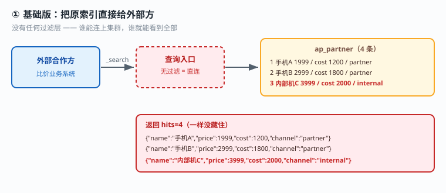
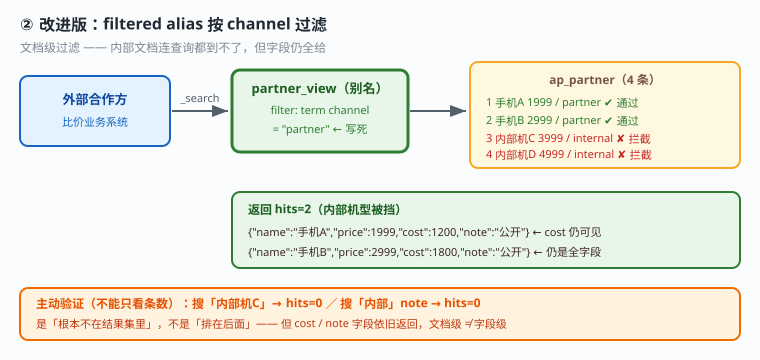
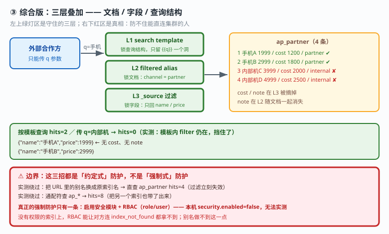

# 应用实战 · 安全与权限：给外部方开一个只读账号

> 对应课程：[课 13：三大主战场](../stages/5-生产与选型/lessons/lesson-13-三大主战场.md) ｜ 覆盖知识点：日志与可观测、向量检索与 RAG、安全与权限
> 定位：**会用，不上生产**——课里学完，在这里动手。课内验证的是"安全体系有哪些组件"，这里做的是**把可见面从"全库全字段"收到"最小可用"的过程**。
> 🧪 **本篇全部输出为本机 `l9-cluster`（ES 9.5.1，3 节点，`http://localhost:9201`）2026-09-20 实测**；脚本见 `playground/l17-app-t10.ps1`、`l17-app-t10b.ps1`

---

## ⚠️ 先说清楚本篇的实测边界（必读）

**本机 `l9-cluster` 的安全模块是关闭的**，实测确认：

```
security.available = True    security.enabled = False
_security API      → 无响应（no handler）→ 无法实测 RBAC
```

也就是说：**`_security/user`、`_security/role` 这套真正的账号权限体系在本机跑不了**（basic license + `xpack.security.enabled: false`）。

**所以本篇改用三种"不需要安全模块、且能实测"的手段**来达成同一个目标——最小可见面：

| 手段 | 限制什么 | 需要安全模块吗 |
|---|---|---|
| `filtered alias` | 能看到**哪些文档** | 不需要 |
| `_source` 过滤 | 能看到**哪些字段** | 不需要 |
| `search template` | 能**怎么查** | 不需要 |
| **RBAC（role/user）** | 谁、能访问哪些索引、哪些 API | **需要**（本篇无法实测） |

> 这是**降级方案不是等价方案**。生产环境做外部方授权，正解是启用安全模块后用 RBAC（角色限定索引 + 字段级/文档级安全），本篇的三招是"安全模块不可用时的补偿手段"，且**无法防住能直连集群的人**（见第 ④ 节边界验证）。

---

## 场景：外部合作方要查数据，但不能看全部

**场景**：合作方要接你的商品数据做比价。你给了他们一个查询地址，结果他们看到了**成本价 `cost`** 和**内部机型**——这两样都是绝对不能外泄的。

**索引里有 4 条数据**：

| id | name | price | cost | channel | note |
|---|---|---|---|---|---|
| 1 | 手机A | 1999 | 1200 | partner | 公开 |
| 2 | 手机B | 2999 | 1800 | partner | 公开 |
| 3 | 内部机C | 3999 | 2000 | internal | 内部机密 |
| 4 | 内部机D | 4999 | 2500 | internal | 内部机密 |

---

### ① 基础实现（能跑但幼稚）：直接把索引给出去

```powershell
$ES = "http://localhost:9201"
$h  = @{ "Content-Type" = "application/json" }

Invoke-RestMethod "$ES/ap_partner/_search" -Method Post -Headers $h -Body '{"size":10}'
```

**实测输出**：

```
外部方查原索引: hits=4
    {"name":"手机A","price":1999,"cost":1200,"channel":"partner","note":"公开"}
    {"name":"手机B","price":2999,"cost":1800,"channel":"partner","note":"公开"}
    {"name":"内部机C","price":3999,"cost":2000,"channel":"internal","note":"内部机密"}
    {"name":"内部机D","price":4999,"cost":2500,"channel":"internal","note":"内部机密"}
```

**成本价、内部机型、内部备注，一样没藏住。**



> 看图：外部方直接查原索引（高亮处 `cost` 与 `internal` 通道的数据），4 条全返回。**没有任何过滤层**——谁能连上集群，谁就能看到全部。

---

### ② 改进一：`filtered alias` 限制"能看到哪些文档"

给外部方一个**带过滤条件的别名**，把内部通道的文档挡在外面：

```powershell
Invoke-RestMethod "$ES/_aliases" -Method Post -Headers $h -Body @'
{"actions":[{"add":{"index":"ap_partner","alias":"partner_view",
  "filter":{"term":{"channel":"partner"}}}}]}
'@
```

**实测输出**：

```
经 filtered alias 查: hits=2   ← 内部机型的 2 条被挡住
    {"name":"手机A","price":1999,"cost":1200,"channel":"partner","note":"公开"}
    {"name":"手机B","price":2999,"cost":1800,"channel":"partner","note":"公开"}
```

**主动验证是否真挡住了**（不能只看条数，要试着去够那些数据）：

```
搜内部机C:     hits=0   ← 0 说明过滤生效
搜内部 note:   hits=0
```

**直接按名字搜内部机型，返回 0 条**——不是"排在后面"，是根本不在结果集里。



> 看图：与上一张同布局，入口换成带 `filter` 的别名（高亮处）。4 条文档里有 2 条 `channel=internal` 在别名层就被过滤掉，**连查询都到不了它们**。右侧"搜内部机C"的验证返回 0，证明过滤是真实生效而不是排序靠后。

> ⚠️ **它的问题**：`cost` 和 `note` 字段**仍然可见**。文档级过滤不等于字段级过滤。

---

### ③ 改进二：`_source` 过滤限制"能看到哪些字段"

在查询里指定只返回哪些字段：

```powershell
Invoke-RestMethod "$ES/partner_view/_search" -Method Post -Headers $h -Body @'
{"size":10,"_source":{"includes":["name","price"],"excludes":["cost","note"]}}
'@
```

**实测输出**：

```
{"name":"手机A","price":1999}
{"name":"手机B","price":2999}
```

**`cost` 与 `note` 不再返回。**

> ⚠️ **它的问题**：这个过滤写在**查询请求里**，外部方可以自己改请求体把它去掉——**等于没锁**。真正要锁住，得让外部方根本发不出自定义查询，这就是下一招。

---

### ④ 改进三：`search template` 锁定"能怎么查"

把查询结构**固化在服务端**，外部方只能传参数，改不了结构：

```powershell
# 用 ConvertTo-Json 构造（手拼 JSON 的转义极易出错，本篇实测踩到）
$src = @{
  query = @{ bool = @{
    must   = @(@{ match = @{ name = "{{q}}" } })
    filter = @(@{ term  = @{ channel = "partner" } })   # ← 过滤写死在模板里
  } }
  size = 10
  _source = @{ includes = @("name","price") }           # ← 字段也写死
} | ConvertTo-Json -Compress

Invoke-RestMethod "$ES/_scripts/partner_search" -Method Put -Headers $h -Body `
  (@{ script = @{ lang = "mustache"; source = $src } } | ConvertTo-Json -Depth 10 -Compress) | Out-Null
```

**用 `_render/template` 先看渲染效果**（调试模板的第一步，实测）：

```json
{"query":{"bool":{"must":[{"match":{"name":"手机"}}],"filter":[{"term":{"channel":"partner"}}]}},"size":10,"_source":{"includes":["name","price"]}}
```

**实测查询**：

```
按模板查询: hits=2
    {"name":"手机A","price":1999}
    {"name":"手机B","price":2999}
```

**关键验证：试图绕过**（实测）：

```
传 q=内部机: hits=0   ← 模板内的 filter 仍在，挡住了
```

**外部方把参数改成"内部机"，依然返回 0 条**——因为 `filter: channel=partner` 是写死在模板里的，参数只能填 `{{q}}` 这一个洞。



> 看图：三层防护叠加（高亮处）——`filtered alias` 管文档、`_source` 管字段、`search template` 管查询结构。**但右下角的红色区域是真相**：这些手段都作用在"查询入口"，**防不住能直连集群的人**。

**边界验证（实测，这段最重要）**：

```
-- 用 _search 显式指定 index（试图绕过别名）--
  直查原索引 hits=4  ← 别名过滤只在别名入口生效
-- 用通配符查 --
  通配符查 hits=8
```

**只要把 URL 里的别名换成原索引名，过滤立刻失效。** 这就是本篇开头的降级说明必须存在的理由：

> **别名 / `_source` / 模板 都是"约定式"防护，不是"强制式"防护。**
> 真正的强制防护只有一条：**启用安全模块 + RBAC**，让账号在没有权限的索引上连 `index_not_found` 都拿不到。

> 🎯 **会用标志**：看到"外部方要查数据"，能立刻想到要同时限制**文档、字段、查询结构**三个维度，而不是只给个索引名；会用 `filtered alias` + `_source` + `search template` 在没有安全模块的场景下做出最小可见面；并且**清楚这三招的边界**——它们防不住直连集群的人，生产环境必须上 RBAC。

---

## 🧭 导航

- ⬅️ 回到课程：[课 13：三大主战场](../stages/5-生产与选型/lessons/lesson-13-三大主战场.md)
- 📚 全部实战：[应用实战索引](INDEX.md)
- ⬅️ 上一课实战：[12 · 让 ES 跟上数据库](12-接入真实项目.md)
- ➡️ 下一课实战：[14 · 一场选型评审会怎么过](14-该不该用ES.md)

---

> ⚠️ **执行环境**：本篇命令在 **Windows PowerShell** 下实测。**不要在 WSL 里照抄**——本机实测 WSL2 因 NAT 隔离连不上 Windows 侧 9201（详见课 16 第四幕环境结论）。
> ⚠️ **本篇为降级方案**：`l9-cluster` 的 `xpack.security.enabled = false`，RBAC 无法实测。生产环境请启用安全模块后用 `_security/role` + `_security/user` 做授权，本篇三招只能作为补偿手段。
> ⚠️ **PowerShell 5.1 编码坑**：`Invoke-RestMethod` 会把 ES 返回的 UTF-8 中文按 Latin-1 解析成乱码；无 BOM 的 `.ps1` 脚本中文也会被吞成 `?`；**stored script 必须用 `ConvertTo-Json` 构造**（手拼 JSON 的转义会让查询返回 0 条，本篇实测踩到）。
> 实测脚本：`elasticsearch/playground/l17-app-t10.ps1`、`l17-app-t10b.ps1`（临时脚本，已按 `lXX-*` 惯例忽略）。
