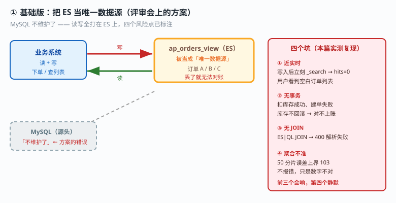
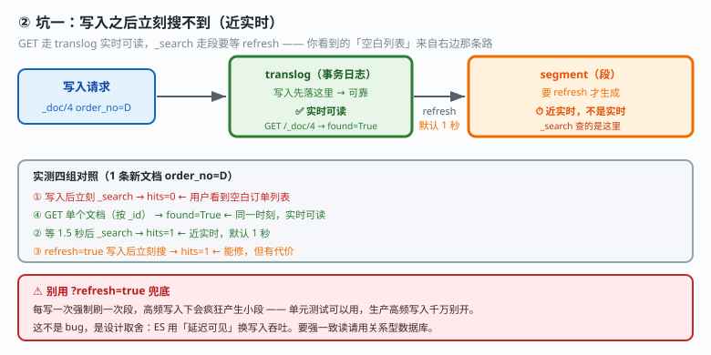
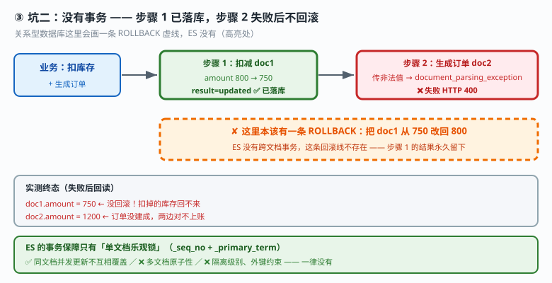
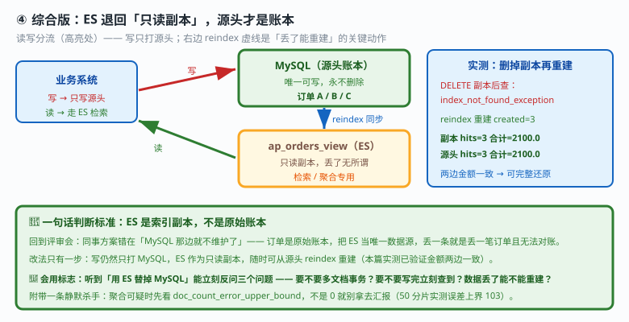

# 应用实战 · 选型：把 ES 当主库用，会踩哪四个坑

> 对应课程：[课 14：该不该用 ES](../stages/5-生产与选型/lessons/lesson-14-该不该用ES.md) ｜ 覆盖知识点：选型决策清单
> 定位：**会用，不上生产**——课里学完，在这里动手。课内给的是结论「ES 是索引副本，不是原始账本」，这里做的是**亲手把 ES 当主库用一次，把四个坑踩实，再把它改回副本位置**。
> 🧪 **本篇全部输出为本机 `l9-cluster`（ES 9.5.1，3 节点，`http://localhost:9201`）2026-09-20 实测**；脚本见 `playground/l17-app-t11.ps1`

---

## 场景：评审会上那个"用 ES 替掉 MySQL"的方案

**场景**：你的订单系统现在跑在 MySQL 上，用户抱怨搜索慢。同事在评审会上提：

> "我把订单数据同步到 ES，然后**直接让业务系统读写 ES**，MySQL 那边就不维护了。"

听起来很合理——ES 查询快、能分词、还能聚合。

**这个方案错在哪？** 空口争论没意义，直接搭一个最小模型实测：

| 角色 | 索引 | 说明 |
|---|---|---|
| 源头（MySQL 的位置） | `ap_orders_src` | 3 条订单，A/B/C |
| ES 副本（被当主库用） | `ap_orders_view` | 从源头 reindex 过来 |

---

### ① 基础实现（能跑但幼稚）：把 ES 当唯一数据源

先按同事的方案搭起来——源头同步一份过去，之后业务只读写 ES：

```powershell
$ES = "http://localhost:9201"
$h  = @{ "Content-Type" = "application/json" }

Invoke-RestMethod "$ES/_reindex?refresh=true" -Method Post -Headers $h -Body @'
{"source":{"index":"ap_orders_src"},"dest":{"index":"ap_orders_view"}}
'@
```

**实测输出**：

```
准备：源头 3 条，同步到 ES 副本 created=3
```

现在假设"MySQL 不维护了"，业务系统直接读写 ES。下面四个坑会依次找上门。



> 看图：业务系统的读写箭头**同时**打在 ES 上（高亮处），源头只剩一条虚线。右边四个红色标记就是接下来要逐个复现的坑——它们不是理论风险，是本篇实测跑出来的。

---

### ② 坑一：写入之后立刻搜不到（近实时）

**业务场景**：用户下单成功，跳转订单列表页，列表是空的——刷新一下又有了。

```powershell
Invoke-RestMethod "$ES/ap_orders_view/_doc/4?refresh=false" -Method Post -Headers $h -Body '{"order_no":"D","amount":500,"status":"paid"}'
Invoke-RestMethod "$ES/ap_orders_view/_search" -Method Post -Headers $h -Body '{"query":{"term":{"order_no":"D"}}}'
```

**实测输出**：

```
① 写入后立刻 _search        → hits=0        ← 用户看到空白
④ 对照：GET 单个文档(按_id) → found=True  order_no=D  ← 实时可读
② 等 1.5 秒后 _search       → hits=1        ← 近实时，默认 1 秒
③ refresh=true 写入后立刻搜 → hits=1        ← 能修，但有代价
```

**第 ① 和 ④ 的对比是这里最关键的分界点**：

| 操作 | 读什么 | 是否实时 |
|---|---|---|
| `GET /index/_doc/{id}` | **translog**（写入时先落的可靠日志） | ✅ **实时** |
| `POST /index/_search` | **段**（segment，要 refresh 才生成） | ⏱ **近实时**（默认 1 秒） |

**这不是 bug，是设计取舍**——ES 用"延迟可见"换写入吞吐。但如果你要的是"下单成功立刻能查到"的强一致读，ES 默认给不了。

> ⚠️ **别用 `?refresh=true` 兜底**：它确实能立刻搜到（第 ③ 条实测），但每写一次就强制刷一次段，高频写入下会疯狂产生小段。**单元测试可以用，生产高频写入千万别开**。



> 看图：写入先落 translog（实时可读），段要等 refresh 才生成（默认 1 秒）。**你下单成功看到的"空白列表"，就是因为查的是右边那条路。**

---

### ③ 坑二：没有事务，改了 A 再改 B 崩了，A 不回滚

**业务场景**："扣库存 + 生成订单"必须同时成功或同时失败。在 ES 里跑一遍：

```powershell
# 步骤 1：扣减 doc1（库存 800 → 750）
Invoke-RestMethod "$ES/ap_orders_view/_update/1" -Method Post -Headers $h -Body '{"doc":{"amount":750}}'

# 步骤 2：生成订单 doc2，故意传一个非法值模拟"中途崩溃"
Invoke-RestMethod "$ES/ap_orders_view/_update/2" -Method Post -Headers $h -Body '{"doc":{"amount":"不是数字"}}'
```

**实测输出**：

```
改动前 doc1.amount = 800
步骤1 扣减 doc1 → 800 改 750 : result=updated
步骤2 生成订单 doc2 传非法值 : HTTP 报错 type=document_parsing_exception
步骤2 失败后回读 doc1.amount = 750   ← 没回滚！扣掉的库存回不来
同时 doc2.amount = 1200              ← 订单没建成，两边对不上账
```

**这就是全篇最致命的一条**——库存扣了、订单没建、且没有任何机制把库存加回来。

ES 的事务保障**只有单文档乐观锁**（`_seq_no` + `_primary_term`）：

- ✅ 能保证：同一文档的并发更新不会互相覆盖
- ❌ 不能保证：多个文档的原子性。中间崩了，**前面的不会回滚**
- ❌ 没有：跨文档事务、隔离级别、外键约束



> 看图：步骤 1 的绿色箭头已经落到库里，步骤 2 红色叉掉之后**没有任何反向箭头把 doc1 改回去**（高亮处）。关系型数据库这里会画一条 ROLLBACK 虚线，ES 没有。

---

### ④ 坑三：没有跨表 JOIN

**业务场景**：订单要关联店铺、用户、商品。用 ES|QL 试一下 SQL 风格的 JOIN：

```powershell
Invoke-RestMethod "$ES/_query" -Method Post -Headers $h -Body @'
{"query":"FROM ap_orders_view o JOIN ap_orders_src s ON o.order_no = s.order_no LIMIT 3"}
'@
```

**实测输出**：

```
带 JOIN  : HTTP 400 parsing_exception
           line 1:21: mismatched input 'o' expecting {<EOF>, '|', '::', ',', 'metadata'}
不带 JOIN: {"columns":[{"name":"order_no","type":"keyword"},
                       {"name":"amount","type":"double"}],
            "values":[["A",800.0],["B",1200.0],["C",100.0]]}
```

**语法解析阶段就失败了**——不是"不支持得好一点"，是 ES 根本没有关系型 JOIN 这个概念。

四条替代路：

| 方案 | 做法 | 代价 |
|---|---|---|
| **反范式冗余**（最常用） | 把关联字段直接写进主文档 | 数据冗余，更新要同步改多处 |
| `nested` 类型 | 同索引内嵌对象数组 | 查询慢，父子需同分片 |
| `parent-child` join | 同索引内建父子关系 | 性能代价大，官方不推荐滥用 |
| 应用层拼装 | 查两次，代码里组装 | 丧失数据库端的关联优化 |

---

### ⑤ 坑四：聚合在多分片上算不准（附赠，最容易隐身）

前三个坑会"报错"或"空白"，至少能被发现。**这个不报错，只是数字不对**。

用课 10 留下的控制变量实验数据（**各 3000 条完全相同的数据，唯一变量是主分片数**）：

```powershell
$agg = '{"size":0,"aggs":{"by_brand":{"terms":{"field":"brand","size":3}}}}'
Invoke-RestMethod "$ES/l10_shard_1/_search"  -Method Post -Headers $h -Body $agg
Invoke-RestMethod "$ES/l10_shard_50/_search" -Method Post -Headers $h -Body $agg
```

**实测输出**：

```
l10_shard_1 (1 主分片)  : doc_count_error_upper_bound=0    首桶=BRAND-0:100
l10_shard_50(50 主分片) : doc_count_error_upper_bound=103  首桶=BRAND-1:87
```

同一份数据，**单分片误差上界 0、首桶精确 100；50 分片误差上界 103、首桶只剩 87，连品牌名的排序都变了**（BRAND-0 → BRAND-1）。

原理：每个分片各自算自己的 top N 再交给协调节点合并，某个分片里排不进前 N 的桶就被截断了。

> 📌 **这就是官方建议"单分片 20–50 GB"的现实依据**——`l10_shard_50` 每个分片只有约 60 条，属于典型分片过度。
> 📌 **排查手法**：聚合结果可疑时，先看返回里的 `doc_count_error_upper_bound`。它不是 0 就说明数字不可信，别拿去给老板汇报。

---

### ⑥ 综合实现：把 ES 改回"只读副本"，丢了能从源头重建

四个坑踩完，回到评审会。正确的定位不是"用不用 ES"，而是**"ES 在架构里站在哪"**。



> 看图：读写分流（高亮处）——**写只打源头，ES 只接收同步**。右边那条 `reindex` 虚线是本篇的关键动作：副本没了能一键重建。

**关键验证：把副本删掉，看能不能重建**（实测）：

```powershell
# 模拟"ES 数据丢了"
Invoke-RestMethod "$ES/ap_orders_view" -Method Delete
# 从源头重建
Invoke-RestMethod "$ES/_reindex?refresh=true" -Method Post -Headers $h -Body @'
{"source":{"index":"ap_orders_src"},"dest":{"index":"ap_orders_view"}}
'@
```

**实测输出**：

```
删掉副本后查询 : index_not_found_exception / no such index [ap_orders_view]
从源头 reindex 重建 : created=3
重建后副本 hits=3 金额合计=2100.0
源头       hits=3 金额合计=2100.0
```

**金额合计两边都是 2100.0**——副本可以完整还原，这才是 ES 该在的位置。

> 🎯 **会用标志**：听到"用 ES 替掉 MySQL"能立刻反问**三个问题**——要不要多文档事务？要不要写完立刻查到？数据丢了能不能重建？会用 `doc_count_error_upper_bound` 判断聚合数字可不可信；能一句话讲清 ES 该站在"只读副本"位置，而不是主库。

---

## 选型速查：六个"不该上 ES"的信号

| 信号 | 本篇实测证据 | 替代方案 |
|---|---|---|
| 需要**多文档事务** | 步骤 2 失败后 doc1 不回滚（坑二） | 关系型数据库 |
| 需要**强一致读** | 写入后立刻搜 hits=0（坑一） | 关系型数据库 / KV 存储 |
| 数据是**高度关联的关系模型** | JOIN 语法解析失败（坑三） | 关系型数据库 / 图数据库 |
| 把 ES 当**唯一数据源** | 删掉就 `index_not_found`，全靠源头重建（坑六） | ES 必须是"可重建的副本" |
| 频繁**单行更新**、按主键点查为主 | ES 强项是检索不是点查 | KV 存储 / 关系型数据库 |
| 数据量小（< 百万级）且查询简单 | 运维成本 > 收益 | PostgreSQL 全文检索够用 |

> 🔑 **一句话判断标准**：**ES 应该是你数据的"索引副本"，不是"原始账本"。**
> 如果你的设计方案里 ES 挂了数据就没了——这个设计是错的。

---

## 🧭 导航

- ⬅️ 回到课程：[课 14：该不该用 ES](../stages/5-生产与选型/lessons/lesson-14-该不该用ES.md)
- 📚 全部实战：[应用实战索引](INDEX.md)
- ⬅️ 上一课实战：[13 · 给外部方开一个只读账号](13-三大主战场.md)
- ➡️ 阶段 4 增补：[15 · 从裸索引到自动滚动归档](15-索引管理与生命周期策略.md)

---

> ⚠️ **执行环境**：本篇命令在 **Windows PowerShell** 下实测。**不要在 WSL 里照抄**——本机实测 WSL2 因 NAT 隔离连不上 Windows 侧 9201（详见课 16 第四幕环境结论）。
> ⚠️ **脚本必须带 BOM**：无 BOM 的 `.ps1` 中文会被 PS 5.1 解析成乱码并报 `Unexpected token`（本篇实测踩到，加 BOM 后跑通）。
> ⚠️ **坑四的聚合数据**来自课 10 的 `l10_shard_*` 系列（各 3000 条、唯一变量是主分片数），非本篇新建；`doc_count_error_upper_bound` 会随集群状态有微小浮动，本次实测为 103。
> 实测脚本：`elasticsearch/playground/l17-app-t11.ps1`（临时脚本，已按 `lXX-*` 惯例忽略）。
