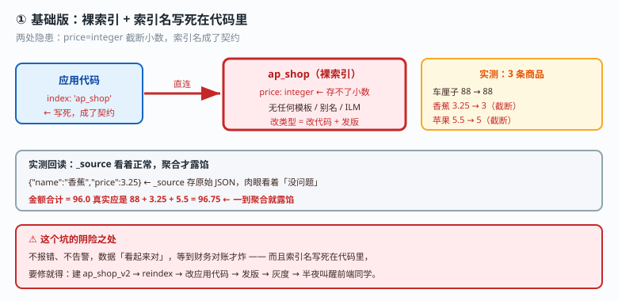
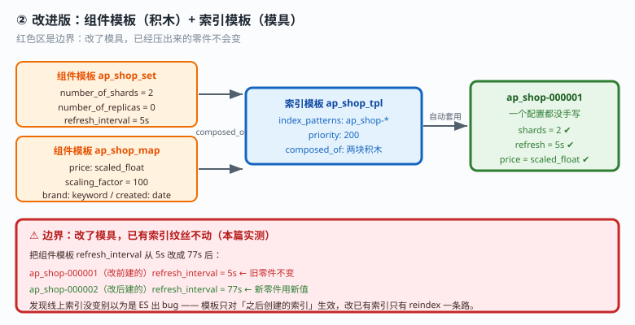
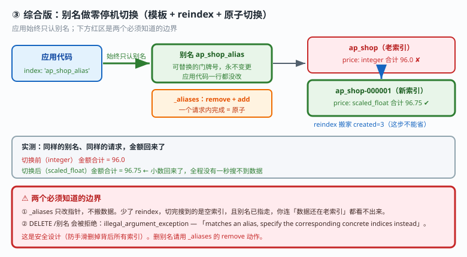
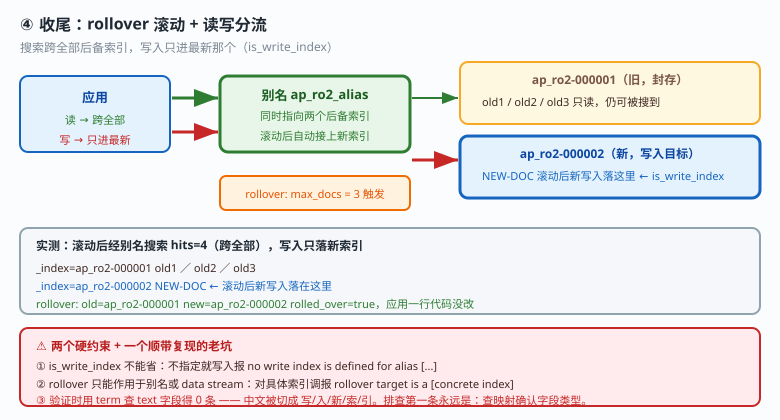

# 应用实战 · 索引管理：从裸索引到能自己滚动归档

> 对应课程：[课 15：索引管理与生命周期策略](../stages/4-分布式与工程实践/lessons/lesson-15-索引管理与生命周期策略.md) ｜ 覆盖知识点：索引模板体系、别名、ILM 生命周期、索引运维操作
> 定位：**会用，不上生产**——课里学完，在这里动手。课内讲的是"这四个组件各管一段"，这里做的是**从两年前那个 `price: integer` 事故出发，一步步把索引从裸奔改到能自动滚动**。
> 🧪 **本篇全部输出为本机 `l9-cluster`（ES 9.5.1，3 节点，`http://localhost:9201`）2026-09-20 实测**；脚本见 `playground/l17-app-t12.ps1`、`t12b.ps1`、`t12c.ps1`

---

## 场景：凌晨三点，3.25 元的香蕉被存成了 3 元

**场景**：你接手一个跑了两年的商品搜索。运营找上门："3.25 元的香蕉显示成 3 元，财务对不上账。"

根因是两年前某个工程师建的索引：

```json
{ "mappings": { "properties": { "name": { "type": "text" }, "price": { "type": "integer" } } } }
```

`integer` 存不了小数。更要命的是应用代码里**写死了索引名**——要改类型就得 `shop_v2` + reindex + 改代码 + 发版 + 灰度。

本篇就用这个最小模型，走完四步改造。

---

### ① 基础实现（能跑但幼稚）：裸索引 + 索引名写死在代码里

先复现事故现场：

```powershell
$ES = "http://localhost:9201"
$h  = @{ "Content-Type" = "application/json" }

Invoke-RestMethod "$ES/ap_shop" -Method Put -Headers $h -Body @'
{"mappings":{"properties":{"name":{"type":"text"},"price":{"type":"integer"},"brand":{"type":"keyword"}}}}
'@
Invoke-RestMethod "$ES/ap_shop/_doc/2?refresh=true" -Method Post -Headers $h -Body '{"name":"香蕉","price":3.25,"brand":"FRUIT-B"}'
```

**实测输出**：

```
源头写入 3 条，回读 hits=3
    1  {"name":"车厘子","price":88,"brand":"FRUIT-A"}
    2  {"name":"香蕉","price":3.25,"brand":"FRUIT-B"}
    3  {"name":"苹果","price":5.5,"brand":"FRUIT-A"}
金额合计 = 96.0   ← 真实应是 88+3.25+5.5=96.75
```

**`_source` 里看着是 3.25，但聚合出来是 96.0 而不是 96.75**——写入时小数就被截断了，`_source` 存的是原始 JSON，所以肉眼看着"没问题"，一到聚合/排序就露馅。

> ⚠️ **这个坑的阴险之处**：不报错、不告警，数据"看起来对"。财务对账时才炸。

应用代码写死了索引名，索引名就成了**契约**：

```javascript
await client.search({ index: 'ap_shop', query: { ... } })   // ← 契约一变，全线要改
```



> 看图：应用箭头直接打在具体索引上（高亮处），两处隐患——`price: integer` 截断小数，索引名写死导致改类型要动应用。

---

### ② 改进一：组件模板 + 索引模板，把"正确配置"固化下来

**思路**：不再靠人记得写对配置，而是让**未来每一个索引自动继承正确配置**。

```powershell
# 积木 1：settings
Invoke-RestMethod "$ES/_component_template/ap_shop_set" -Method Put -Headers $h -Body @'
{"template":{"settings":{"number_of_shards":2,"number_of_replicas":0,"index.refresh_interval":"5s"}}}
'@
# 积木 2：mappings（price 改用 scaled_float）
Invoke-RestMethod "$ES/_component_template/ap_shop_map" -Method Put -Headers $h -Body @'
{"template":{"mappings":{"properties":{"name":{"type":"text"},
  "price":{"type":"scaled_float","scaling_factor":100},"brand":{"type":"keyword"},"created":{"type":"date"}}}}}
'@
# 模具：匹配 ap_shop-*，引用两块积木
Invoke-RestMethod "$ES/_index_template/ap_shop_tpl" -Method Put -Headers $h -Body @'
{"index_patterns":["ap_shop-*"],"priority":200,"composed_of":["ap_shop_set","ap_shop_map"]}
'@
```

然后**建一个索引，一个配置都不写**：

```powershell
Invoke-RestMethod "$ES/ap_shop-000001" -Method Put -Headers $h -Body '{}'
```

**实测输出**：

```
number_of_shards   = 2                              ← 来自组件模板
number_of_replicas = 0                              ← 来自组件模板
refresh_interval   = 5s                             ← 来自组件模板
price 类型         = scaled_float / scaling_factor=100.0
```

> 💡 **为什么用 `scaled_float` 而不是 `float`**：`scaling_factor: 100` 把小数放大 100 倍存成整数，**既保住两位小数精度又省存储**——这正是那个事故的正确解法。

#### 关键边界：改了模板，已有索引会跟着变吗？

这是最容易误解的一条，本篇实测：

```
ap_shop-000001（改前建的）refresh_interval = 5s    ← 纹丝不动
ap_shop-000002（改后建的）refresh_interval = 77s   ← 用了新值
```

**改模具不影响已经压出来的零件。** 你改了模板发现线上索引没变，不是 ES 出 bug，是**模板只对之后创建的索引生效**。要改已有索引，只有 reindex 一条路。



> 看图：两块组件模板（积木）被索引模板（模具）引用，新索引自动继承。**右侧红色标记就是边界**——箭头只指向"之后新建的索引"，不回流到旧索引。

---

### ③ 改进二：别名 + reindex，零停机把 `integer` 换成 `scaled_float`

有了模板，新索引的配置对了。接下来把老数据搬过去，**且应用代码一行不改**。

```powershell
# 1) 给新索引挂别名（应用从此认别名，不认索引名）
Invoke-RestMethod "$ES/_aliases" -Method Post -Headers $h -Body @'
{"actions":[{"add":{"index":"ap_shop-000001","alias":"ap_shop_alias"}}]}
'@
# 2) 搬数据 —— ⚠️ 这步不能省
Invoke-RestMethod "$ES/_reindex?refresh=true" -Method Post -Headers $h -Body @'
{"source":{"index":"ap_shop"},"dest":{"index":"ap_shop-000001"}}
'@
```

**实测输出**：

```
reindex 搬家: created=3
切换前搜别名: hits=3
    {"name":"苹果","price":5.5,"brand":"FRUIT-A"}
    {"name":"车厘子","price":88,"brand":"FRUIT-A"}
    {"name":"香蕉","price":3.25,"brand":"FRUIT-B"}
切换后金额合计 = 96.75   ← 小数回来了（96.75）
```

**同样的别名、同样的请求，金额从 96.0 变成 96.75**——全程没有一秒钟搜不到数据。

> ⚠️ **最容易漏的一步**：`_aliases` 只改指针，**不搬数据**。少了 reindex，切完搜到的是一个空索引，而且因为别名已经指走了，你连"数据还在老索引"都看不出来。

#### 验证原子性：一个请求里 remove + add

```powershell
Invoke-RestMethod "$ES/_aliases" -Method Post -Headers $h -Body @'
{"actions":[{"remove":{"index":"ap_shop-000001","alias":"ap_shop_alias"}},
            {"add":{"index":"ap_shop_v2","alias":"ap_shop_alias"}}]}
'@
```

**实测输出**：

```
原子切换 acknowledged=True
切换后搜同一别名: hits=1  _index=ap_shop_v2
    {"name":"新索引的梨","price":12.34}
```

`_aliases` 在一个请求里完成 remove + add，**要么全成功要么全失败**，不存在"应用查到一半别名指向空了"的中间状态。

#### 边界：`DELETE /别名` 会被拒绝

```
DELETE /ap_shop_alias → illegal_argument_exception
   : The provided expression [ap_shop_alias] matches an alias,
     specify the corresponding concrete indices instead.
```

ES 明确拒绝"通过别名删索引"——**这是安全设计**：如果 `DELETE /别名` 能直接删掉背后所有索引，生产事故会多一大截。删别名请用 `_aliases` 的 `remove`。



> 看图：应用始终只认别名（高亮处），切换在别名层完成。**下方红色区是两个边界**——reindex 不能省，DELETE 别名会被拒。

---

### ④ 运维：forcemerge 治"碎"

索引写久了段会碎。造一个碎索引实测：

```powershell
Invoke-RestMethod "$ES/ap_fm/_forcemerge?max_num_segments=1" -Method Post -Headers $h
```

**实测输出（2 主分片 / 0 副本，连写 8 条每条都 refresh）**：

```
forcemerge 前 段数（全索引合计） = 8
forcemerge 后 段数（全索引合计） = 2   ← 2 个主分片各 1 段，合计 2
合并后条数 = 8   ← 一条不丢
```

> ⚠️ **这里我第一轮差点写错结论**：看到"合并后还有 2 段"差点以为 `max_num_segments=1` 没生效。实际是 **`max_num_segments` 是"每个分片"的段数上限**——2 个主分片各剩 1 段，合计自然是 2。**看段数要按分片看，别只看合计。**

**代价**：合并是 I/O 和 CPU 密集型，**别在写入频繁的索引上做**——这正是 ILM 把它放在 warm 阶段（已停止写入）的原因。

---

### ⑤ 收尾：rollover 让索引自己换新的

索引会一直长大。rollover 让它在达到阈值时自动换一个新的，**应用全程只认别名**。

```powershell
# 建第一个索引时显式指定写索引
Invoke-RestMethod "$ES/ap_ro2-000001" -Method Put -Headers $h -Body @'
{"mappings":{"properties":{"name":{"type":"keyword"}}},
 "aliases":{"ap_ro2_alias":{"is_write_index":true}}}
'@
# 达到条件后滚动
Invoke-RestMethod "$ES/ap_ro2_alias/_rollover" -Method Post -Headers $h -Body '{"conditions":{"max_docs":3}}'
```

**实测输出**：

```
rollover: old=ap_ro2-000001  new=ap_ro2-000002  rolled_over=True
经别名搜（跨全部后备索引）: hits=4
    _index=ap_ro2-000001  name=old1
    _index=ap_ro2-000001  name=old2
    _index=ap_ro2-000001  name=old3
    _index=ap_ro2-000002  name=NEW-DOC     ← 滚动后新写入落在这里
```

**搜索跨全部后备索引（4 条都在），写入只进最新那个**——这就是"读写分离"的基础。

> ⚠️ **`is_write_index` 不能省**：不指定写索引就写入，实测报错 `no write index is defined for alias [...]`。
> ⚠️ **rollover 必须作用于别名或 data stream**：直接对具体索引调会报 `rollover target is a [concrete index] but one of [alias,data_stream] was expected`。



> 看图：滚动后别名同时指向两个后备索引（高亮处）——**搜索走全部，写入只走最新的那个**。应用从头到尾只认别名，一行代码没改。

#### 顺带复现一个老坑：`term` 查 `text` 字段

补测时我遇到"新写入的文档按名字精确查 0 条"，查下去发现是**老朋友**：

```
text 字段 + term 精确查 : hits=0   ← 0 条，因为 text 被分词了
text 字段 + match 查    : hits=1   ← match 走分词，能查到
实际切分结果: 写 / 入 / 新 / 索 / 引
```

**中文被逐字切开，倒排索引里根本没有"写入新索引"这个完整词条**，所以 `term` 精确匹配必然 0 条。这和课 4、课 6 是同一个坑，只是这次出现在"验证 rollover 是否生效"的场景里——**排查手法第一条永远是：查映射确认字段类型。**

> 🎯 **会用标志**：看到"改个字段类型要发版"能立刻想到**模板 + 别名 + reindex** 三件套；会说清"改模板不影响已有索引"和"段数是按分片算的"两个实测边界；会用 `is_write_index` 配 rollover 让写入只进最新索引；知道 `DELETE /别名` 会被拒绝、删别名要用 `_aliases` 的 remove。

---

## 🧭 导航

- ⬅️ 回到课程：[课 15：索引管理与生命周期策略](../stages/4-分布式与工程实践/lessons/lesson-15-索引管理与生命周期策略.md)
- 📚 全部实战：[应用实战索引](INDEX.md)
- ⬅️ 阶段 5 实战：[14 · 一场选型评审会怎么过](14-该不该用ES.md)
- ➡️ 下一课实战：[16 · 商品规格筛选与搜索框补全](16-复杂结构与搜索建议.md)

---

> ⚠️ **执行环境**：本篇命令在 **Windows PowerShell** 下实测。**不要在 WSL 里照抄**——本机实测 WSL2 因 NAT 隔离连不上 Windows 侧 9201。
> ⚠️ **脚本必须带 BOM**：无 BOM 的 `.ps1` 中文会被 PS 5.1 解析成乱码并报 `Unexpected token`（本篇实测踩到）。
> ⚠️ **本篇未改动集群级设置**：ILM 轮询间隔 `indices.lifecycle.poll_interval` 是集群级参数（默认 10 分钟），按规矩需用户授权才改，故本篇用**手动 rollover** 验证滚动语义，未跑 ILM 阶段自动流转。
> ⚠️ **两处实测修正**：① forcemerge 后段数不是 1 而是"每分片 1 段"（2 分片 = 合计 2）；② 验证写入落点时 `term` 查 `text` 字段得 0 条，改用 `keyword` 才测得准。
> 实测脚本：`elasticsearch/playground/l17-app-t12.ps1`、`t12b.ps1`、`t12c.ps1`（临时脚本，已按 `lXX-*` 惯例忽略）。
