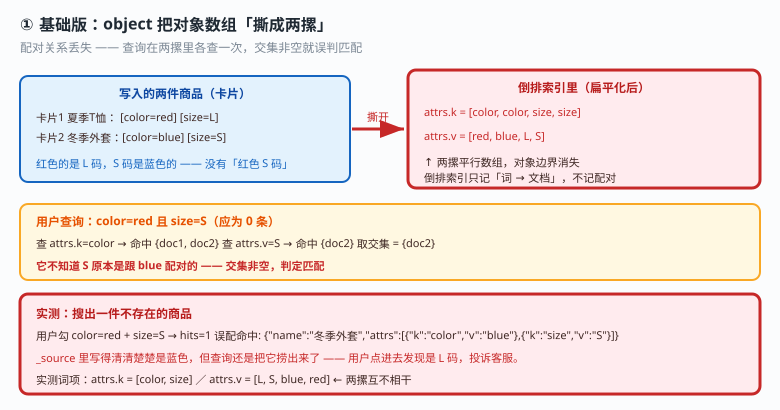

# 应用实战 · 复杂结构：商品规格筛选与搜索框补全

> 对应课程：[课 16：复杂结构与搜索建议](../stages/4-分布式与工程实践/lessons/lesson-16-复杂结构与搜索建议.md) ｜ 覆盖知识点：object 数组扁平化、nested、flattened、自动补全
> 定位：**会用，不上生产**——课里学完，在这里动手。课内给的是"三种类型的分工表"，这里做的是**从"搜出一件不存在的商品"这个投诉出发，一步步修到正确，并把 `flattened` 的真实边界测出来**。
> 🧪 **本篇全部输出为本机 `l9-cluster`（ES 9.5.1，3 节点，`http://localhost:9201`）2026-09-20 实测**；脚本见 `playground/l17-app-t13.ps1`、`t13b.ps1`

---

## 场景：用户勾了"红色 + S 码"，搜出一件不存在的商品

**场景**：电商商品搜索，每个商品带一组规格：

| 商品 | 规格 |
|---|---|
| 夏季T恤 | color=red, size=**L** |
| 冬季外套 | color=**blue**, size=S |

用户在页面上勾了 `color=red` + `size=S`。按常识结果应该是 **0 条**——红色的是 L 码，S 码是蓝色的。

但结果返回了 1 条。用户点进去发现是 L 码，投诉客服。

---

### ① 基础实现（能跑但幼稚）：用默认的 `object` 存规格

```powershell
$ES = "http://localhost:9201"
$h  = @{ "Content-Type" = "application/json" }

Invoke-RestMethod "$ES/ap_obj" -Method Put -Headers $h -Body @'
{"mappings":{"properties":{"name":{"type":"keyword"},
  "attrs":{"properties":{"k":{"type":"keyword"},"v":{"type":"keyword"}}}}}}
'@
Invoke-RestMethod "$ES/ap_obj/_doc/1" -Method Post -Headers $h -Body '{"name":"夏季T恤","attrs":[{"k":"color","v":"red"},{"k":"size","v":"L"}]}'
```

**实测输出**：

```
用户勾 color=red + size=S → hits=1   ← 应为 0！
    误配命中: {"name":"冬季外套","attrs":[{"k":"color","v":"blue"},{"k":"size","v":"S"}]}
```

**命中了一件 color=blue 的外套。** `_source` 里写得清清楚楚是蓝色，但查询还是把它捞出来了。

#### 为什么？看看倒排索引里到底存成了什么

```
attrs.k 词项 = color, size
attrs.v 词项 = L, S, blue, red
```

**`attrs.k` 和 `attrs.v` 是两摞互不相干的平行数组**，对象之间的边界消失了。`color` 在第一摞里存在、`S` 在第二摞里存在，两个 `must` 各查一次取交集——**非空，于是判定匹配**。

它不知道 `S` 原本是跟 `blue` 配对的。



> 看图：左边的两张卡片被**撕成两摞**（高亮处）——所有 `k` 放一摞、所有 `v` 放一摞。查询在两摞里各查一次，`color` 有、`S` 有，交集非空 → 误配。

---

### ② 改进一：`nested` 把对象边界找回来

**思路**：不再撕卡片，而是**把每张卡片装进独立信封**——每个子对象单独存成一个隐藏文档（hidden doc），信封上写着父文档 ID。

```powershell
Invoke-RestMethod "$ES/ap_nst" -Method Put -Headers $h -Body @'
{"mappings":{"properties":{"name":{"type":"keyword"},
  "attrs":{"type":"nested","properties":{"k":{"type":"keyword"},"v":{"type":"keyword"}}}}}}
'@
```

**实测输出（同样的跨对象查询）**：

```
同样的跨对象查询 → hits=0   ← 0，正确
```

#### ⚠️ 但这里有个"改完反而搜不到"的坑

```
普通 bool 查 color=red → hits=0   ← 0！nested 字段必须用 nested 查询
```

**从 `object` 迁到 `nested` 后，原来的普通 `bool` 查询全部返回 0。** 因为子文档是独立存储的，普通查询碰不到它们。这是迁移时最常见的事故——改完发现"什么都搜不到了"。


> 看图：每张卡片装进独立信封（高亮处），查询先匹配信封再顺 ID 找回父文档。**右侧橙色标记是代价**——文档数从 2 膨胀到 6。

#### 代价：hidden doc 让文档数膨胀

**实测 `_cat/indices`**（`_count` 只算顶层文档，看不出膨胀）：

```
index    docs.count   store.size
ap_obj        2         12.3kb
ap_nst        6          6.2kb
```

**同样是 2 条顶层文档，nested 索引的 `docs.count` 是 6**——2 个顶层 + 4 个隐藏子文档。这就是 hidden doc 的直接证据。

> ⚠️ **三个真实代价**：① 文档膨胀（2→6），子对象越多越厉害；② 查询更慢（本质是段内 join）；③ 嵌套深度限额（默认 `indices.query.bool.max_nested_depth = 30`）。
> 💡 **判断要不要用**：如果数组内的对象**不需要跨字段配对查询**，就别用 nested。

---

### ③ 改进二：`nested` 查询 + `inner_hits` 定位到具体规格

nested 字段必须用专门的 `nested` 查询：

```powershell
Invoke-RestMethod "$ES/ap_nst/_search" -Method Post -Headers $h -Body @'
{"query":{"nested":{"path":"attrs","inner_hits":{},
  "query":{"bool":{"must":[{"term":{"attrs.k":"color"}},{"term":{"attrs.v":"red"}}]}}}}}
'@
```

**实测输出**：

```
nested 查询 color=red → hits=1   ← 1，正确
    命中文档: 夏季T恤
    inner_hits 定位: k=color  v=red  _nested.offset=0
再查 color=red + size=S（同一规格内不可能）→ hits=0   ← 0，正确
```

`inner_hits` 不只告诉你"这条文档命中了"，还告诉你**是哪个子对象命中的**（`_nested.offset=0` 表示数组里的第 0 个）。

**对照实验：一个文档里有两个同 `k` 不同 `v` 的子对象**

```
查 attrs.k=color → hits=1
    子对象: k=color  v=red
    子对象: k=color  v=blue
```

**两个 color 子对象都被列出来**——普通查询做不到这种定位，这就是 `inner_hits` 在调试 nested 时的价值。

> ⚠️ **本篇实测踩到的小坑**：第一轮脚本用 `ConvertTo-Json` 打印 inner_hits 时输出为空，差点误判"inner_hits 没生效"。补测打印原始 JSON 后确认它**完全正常**（`t13b` 脚本）。**怀疑功能失效前，先看原始返回。**

---

### ④ 边界：`flattened` 解决的不是同一个问题

> ⚠️ **本节要推翻一个流传很广的说法**：网上有称「ES 7.0 之后 `flattened` 已经取代 `nested`」。**这是错的**，下面是实测反证。

#### 先看 `flattened` 能做什么：压"字段数"

它的用法是**扁平的键值对结构**（不是 `{k:v}` 数组）：

```powershell
Invoke-RestMethod "$ES/ap_flt2/_doc/1" -Method Post -Headers $h -Body '{"name":"夏季T恤","attrs":{"color":"red","size":"L"}}'
```

**实测输出**：

```
attrs.color=red  → hits=1
attrs.color=blue → hits=1
跨键 color=blue + size=L → hits=0   ← 0，扁平 KV 下不误配
```

**点路径查询正常，且不误配。** 它的价值在于：整个 `attrs` 对象只占 **1 个映射字段位**，键名再多也不会撑爆 `index.mapping.total_fields.limit`（默认 1000）。

#### 再看它不能做什么：遇到对象数组就退化

把同样的 `[{k:color,v:red},{k:size,v:L}]` 数组塞进去：

```
数组结构 + 跨对象查 → hits=1   ← 1，又误配了
对 flattened 跑 nested 查询 → search_phase_execution_exception   ← 直接报错
```

**两条反证**：

1. `flattened` 上跑 `nested` 查询**直接报错** → 两者不是替代关系
2. 对象数组场景下 `flattened` **一样会误配**（命中 1），而 `nested` 返回 0


> 看图：左边 `flattened` 的扁平 KV 结构下不误配；**右边换成对象数组就退化成跟 object 一样**（红色高亮），且跑 nested 查询直接报错。

**一句话区分**：

| 你想解决的问题 | 用哪个 |
|---|---|
| 对象数组内**跨对象误配** | `nested` |
| **键名不确定 / 字段数会爆炸** | `flattened` |
| 只是普通嵌套、不需要配对查询 | `object`（默认） |

> 🔑 `nested` 买的是**正确性**，`flattened` 买的是**字段数**。不存在谁取代谁。

---

### ⑤ 搜索框补全：要词用 `completion`，要文档用 `search_as_you_type`

规格筛选修好了，最后给搜索框加补全。两种能力一起建：

```powershell
Invoke-RestMethod "$ES/ap_sugg" -Method Put -Headers $h -Body @'
{"mappings":{"properties":{"title":{"type":"text"},
  "title_sayt":{"type":"search_as_you_type"},"suggest":{"type":"completion"}}}}
'@
Invoke-RestMethod "$ES/ap_sugg/_doc/1" -Method Post -Headers $h -Body @'
{"title":"elasticsearch 教程","title_sayt":"elasticsearch 教程",
 "suggest":{"input":["elasticsearch","ES 教程"],"weight":10}}
'@
```

#### `search_as_you_type`：边输边出**文档**

```powershell
Invoke-RestMethod "$ES/ap_sugg/_search" -Method Post -Headers $h -Body @'
{"query":{"multi_match":{"query":"elas","type":"bool_prefix",
  "fields":["title_sayt","title_sayt._2gram","title_sayt._3gram"]}},"size":5}
'@
```

**实测输出**：

```
search_as_you_type 输入 elas → hits=2（返回的是文档）
    elasticsearch 教程
    elasticsearch 实战
```

> ⚠️ **`fields` 里必须把 `_2gram` / `_3gram` 子字段显式列全**。只写主字段会退化成普通全文匹配，丢失"边输边出"的效果。

#### `completion`：下拉候选**词**

```powershell
Invoke-RestMethod "$ES/ap_sugg/_search" -Method Post -Headers $h -Body @'
{"suggest":{"my-s":{"prefix":"el","completion":{"field":"suggest"}}},"size":0}
'@
```

**实测输出**：

```
completion 输入 el → 返回候选词（不是文档）:
    elasticsearch        _score=10.0   ← score 就是写入时的 weight
    elasticsearch 实战   _score=5.0    ← score 就是写入时的 weight
```

**`_score` 完全等于写入时的 `weight`**——`completion` 的排序由 weight 决定，**不走 BM25**。想调排序就改 weight，别去调相关性。

**边界实测**：

```
前缀=教程（中间词）→ options=0 条   ← 0，completion 只从头匹配
```

**`completion` 只匹配前缀**，匹配不了"中间词"。要中间匹配请用 `search_as_you_type`。


> 看图：同一个输入分两路（高亮处）——上路 `completion` 从内存 FST 挑候选词，下路 `search_as_you_type` 走 n-gram 子字段返回真实文档。

> 🎯 **会用标志**：看到"多值属性要精确配对筛选"能立刻想到 `nested`，且知道必须配 `nested` 查询（普通 bool 会返回 0）；会用 `inner_hits` 定位命中了哪个子对象；能一句话讲清 `flattened` 压的是字段数不是配对关系、**不取代 nested**；能按"要词还是要文档"在 `completion` 和 `search_as_you_type` 之间做选择。

---

## 选型速查

| 场景 | 选什么 | 本篇实测依据 |
|---|---|---|
| 商品规格、多值属性需**精确配对** | `nested` | 跨对象查 0 条（object 误配 1 条） |
| 日志 tags、动态键、字段数可能破千 | `flattened` | 点路径查询正常，整个对象占 1 个字段位 |
| 普通嵌套对象，不查配对 | `object`（默认） | 最省，别折腾 |
| 搜索框下拉候选词（品牌名、城市名） | `completion` | 返回候选词，`_score` = weight |
| 边输边出搜索结果（文章标题、商品名） | `search_as_you_type` | 返回真实文档，支持中间匹配 |

---

## 🧭 导航

- ⬅️ 回到课程：[课 16：复杂结构与搜索建议](../stages/4-分布式与工程实践/lessons/lesson-16-复杂结构与搜索建议.md)
- 📚 全部实战：[应用实战索引](INDEX.md)
- ⬅️ 上一课实战：[15 · 从裸索引到自动滚动归档](15-索引管理与生命周期策略.md)
- 🎉 本篇为应用实战册最后一篇 —— 回到 [应用实战索引](INDEX.md) 横向复习

---

> ⚠️ **执行环境**：本篇命令在 **Windows PowerShell** 下实测。**不要在 WSL 里照抄**——本机实测 WSL2 因 NAT 隔离连不上 Windows 侧 9201。
> ⚠️ **脚本必须带 BOM**：无 BOM 的 `.ps1` 中文会被 PS 5.1 解析成乱码并报 `Unexpected token`。
> ⚠️ **一处实测修正**：第一轮脚本用 `ConvertTo-Json` 打印 `inner_hits` 输出为空，差点误判功能失效；补测打印原始 JSON 后确认 **inner_hits 完全正常**（`t13b`）。怀疑功能失效前先看原始返回。
> ⚠️ **看 hidden doc 膨胀要用 `_cat/indices`**：`_count` API 只统计顶层文档，nested 索引查出来仍是 2，看不出 6。
> 实测脚本：`elasticsearch/playground/l17-app-t13.ps1`、`t13b.ps1`（临时脚本，已按 `lXX-*` 惯例忽略）。
