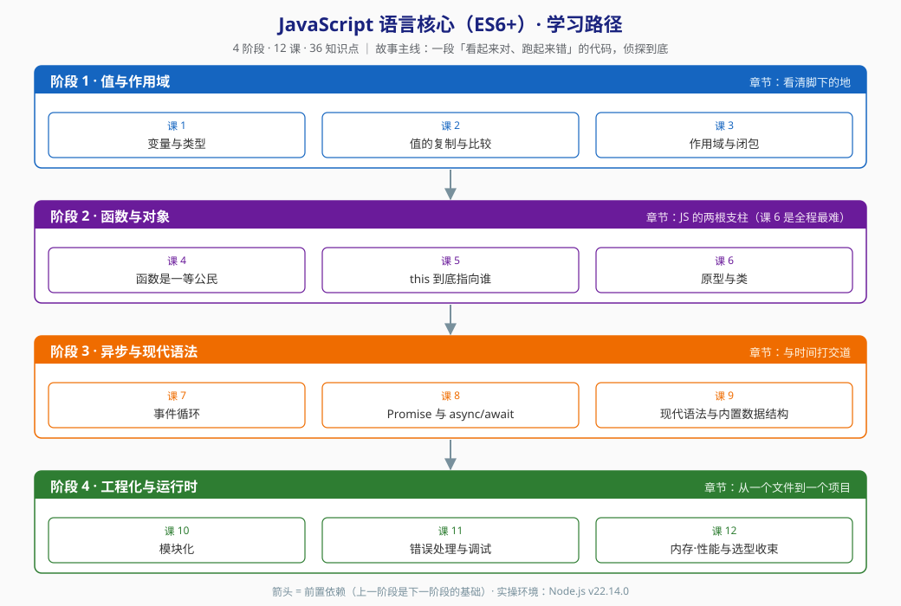

# JavaScript 语言核心（ES6+）· 学习路径总览

> 水平：入门 ｜ 模式：课程制 ｜ 规模：**4 阶段 / 12 课 / 36 知识点**
> 三大目标：① 理解概念 ② 动手实操 ③ 决策参考
> 📑 按课查阅请走 [`02-课程目录.md`](02-课程目录.md)（书本式目录，已编写 = 链接）
> 📌 本文件是**活文档**，随学习进度与大纲调整同步更新。

## 🎯 学习目标

- **目标类型**：理解概念 + 动手实操 + 决策参考（用户三选）
- **目标说明**：能解释 JS 里任何一个"诡异行为"背后的统一规则，能写出并调试现代 JS 代码，能在 `var/let/const`、`==/===`、原型链继承 vs class、`CommonJS` vs `ESM`、JS vs TS 这些岔路口说出"为什么选这个"。

> 学习目标是全局基准，决定各阶段 / 课的取舍与实操比重。目标变更时更新此处并同步调整相关课。

## 🚧 课程边界（重要）

本课程聚焦 **JavaScript 语言核心**。以下内容**不在**范围内，避免学了一半发现"漏了"：

| 不在范围内 | 归属 |
|-----------|------|
| DOM / BOM、事件流、浏览器渲染 | 浏览器 API（可作为后续独立主题） |
| React / Vue / 前端框架 | 框架主题（建议先学完本课再上框架） |
| Node.js 后端（http / fs / stream） | Node 服务端主题（本课只用 Node 当**代码运行环境**） |
| TypeScript 语法细节 | 选型讨论在课 12，语法本身不教 |

## 🎬 故事主线

**一段「看起来对、跑起来错」的代码，侦探到底。**

想象你在维护一个老项目。你写下一段再普通不过的 JS：

```js
for (var i = 0; i < 3; i++) {
  setTimeout(() => console.log(i), 0);
}
// 你以为输出 0 1 2，实际输出 3 3 3
```

你改了一个对象，另一个地方的值跟着变了；你调一个函数，`this` 不是你以为的那个；你 `catch` 了错误，异步里的错还是漏了出去。

**这些不是"JS 设计得烂"，而是你还没拿到那张地图。** 这张地图只有四条主干线：值怎么存、函数怎么调、时间怎么走、代码怎么组织。

**这门课，就是你从"能写 JS"成长为"能预判 JS 行为"的完整旅程。** 四个阶段，正好对应四次认知升级：

- **阶段 1**：搞清楚一个值到底存在哪里、被谁看见 —— 从此不再被 `undefined` 和"改了不该改的"困扰
- **阶段 2**：搞清楚函数与对象这两根支柱 —— 从此 `this`、原型、继承不再是玄学
- **阶段 3**：搞清楚"时间"这件事 —— 从此异步代码的执行顺序你能自己在脑子里跑一遍
- **阶段 4**：从单文件走向工程化 —— 模块怎么拆、错怎么捕、内存怎么管、技术栈怎么选

## 🗺️ 学习路径图



> 箭头 = 前置依赖。每个阶段都建立在前一阶段之上，不可跳过。

## 📚 阶段总览

### 阶段 1：值与作用域（课 1-3 · 9 知识点）

- **目标**：搞清楚"一个值存在哪里、谁能看见它"，从此不再被 `undefined`、意外共享、隐式转换坑到。
- **学习重点**：
  - `var` / `let` / `const` 的差异不是背规则，而是**作用域 + 提升 + TDZ** 三条机制的组合结果
  - 原始值 vs 引用值 —— 这是"改了 A 结果 B 也变了"的唯一根因
  - 闭包 —— 它不是高级技巧，而是词法作用域的**必然产物**
- **必须掌握**：能说清 `var` 与 `let` 在循环里的行为差异；能手写一个不会被循环陷阱坑到的闭包；能推演 `[] == ![]` 为什么是 `true`
- **对应课**：[课 1 变量与类型](stages/1-值与作用域/lessons/lesson-01-变量与类型.md) ✅、[课 2 值的复制与比较](stages/1-值与作用域/lessons/lesson-02-值的复制与比较.md) ✅、[课 3 作用域与闭包](stages/1-值与作用域/lessons/lesson-03-作用域与闭包.md) ✅
- [进入阶段 1 概览](stages/1-值与作用域/overview.md)

### 阶段 2：函数与对象（课 4-6 · 9 知识点）

- **目标**：拿下 JS 的两根支柱 —— 函数是一等公民、对象靠原型链。从此 `this` 与继承不再是玄学。
- **学习重点**：
  - 函数不只是"一段可复用代码"，它是**可以传递的值**（决定了回调、高阶函数、闭包全成立）
  - `this` 的四种绑定规则有**明确优先级**，不是"看情况"
  - 原型链是**属性查找的兜底路径**，不是"继承的语法"
- **必须掌握**：能正确说出任意调用点 `this` 的指向；能手写一个 `bind`；能画出 `class` 背后的原型链图；能说清五种继承写法各自的缺陷
- **⚠️ 难度提示**：**课 6（原型与类）是全程最难的一课**，且与课 5（this）相邻。允许分两次学，讲法上采用"先用 `class` 写，再拆开看原型"的逆向路径。
- **对应课**：课 4 函数是一等公民、课 5 this 到底指向谁、课 6 原型与类
- [进入阶段 2 概览](stages/2-函数与对象/overview.md)

### 阶段 3：异步与现代语法（课 7-9 · 9 知识点）

- **目标**：搞清楚 JS 怎么处理"时间"。从此异步代码的执行顺序你能自己在脑子里跑一遍，而不是靠试。
- **学习重点**：
  - 单线程 + 调用栈 + 任务队列 = 事件循环，三个零件缺一不可
  - 宏任务与微任务是**两级队列**，清空时机决定了所有"输出顺序题"的答案
  - `async/await` 不是新机制，是 Promise 的**语法糖**——理解这点才知道怎么写出并发而非串行
- **必须掌握**：能推演任意 `setTimeout` + `Promise` + `await` 混合代码的输出顺序；能说清 `Promise.all` / `allSettled` / `race` / `any` 的语义差异；能把串行 `await` 改成并发
- **📌 前置约定**：课 7 讲微任务时会借用 `Promise.then` 的**外壳**举例（"它是微任务"），Promise 的完整机制留到课 8 展开。这是刻意的顺序安排，不是遗漏。
- **对应课**：课 7 事件循环、课 8 Promise 与 async/await、课 9 现代语法与内置数据结构
- [进入阶段 3 概览](stages/3-异步与现代语法/overview.md)

### 阶段 4：工程化与运行时（课 10-12 · 9 知识点）

- **目标**：从"能写单文件"走向"能组织一个项目"，并站高一层回答"我该用什么"。
- **学习重点**：
  - 模块化是工程化的起点：`CommonJS` 与 `ESM` 的差异在**加载时机**，不在语法
  - 错误处理的真正难点是**异步错误捕获**与"什么时候该 catch、什么时候该往上抛"
  - 内存泄漏的四种典型写法，以及 `WeakMap` 为什么是它们的通用解
  - 收束到决策：JS vs TS、运行时与工具链怎么选
- **必须掌握**：能说清 ESM 的"实时绑定"与 CommonJS 的"值拷贝"差在哪及后果；能为 `unhandledrejection` 写全局兜底；能指出并修复一个闭包导致的内存泄漏；能给出"我这个项目该不该上 TS"的判断条件
- **对应课**：课 10 模块化、课 11 错误处理与调试、课 12 内存·性能与选型收束
- [进入阶段 4 概览](stages/4-工程化与运行时/overview.md)

## 🔧 实操环境

| 项 | 值 |
|----|-----|
| 运行时 | **Node.js v22.14.0**（nvm4w 管理） |
| 包管理器 | npm 10.9.2 |
| Shell | Windows PowerShell |
| 浏览器侧 | Chrome / Edge DevTools（课 11、课 12 用到） |

> 所有可运行示例默认以 Node.js v22.14.0 为准。完整环境结论见 [`00-学习档案.md`](00-学习档案.md)。

## 当前进度

- [x] 阶段 1：值与作用域（✅ 已完成 · 9/9）
- [x] 阶段 2：函数与对象（✅ 已完成 · 9/9）
- [x] 阶段 3：异步与现代语法（✅ 已完成 · 9/9）
- [x] 阶段 4：工程化与运行时（✅ 已完成 · 9/9）

> 🎉 **4 阶段 / 12 课 / 36 知识点已全部完成**；**Phase 3 综合实战项目《异步任务编排器》已完成**。按流程下一步是 **Phase 4 课程手册汇总**（`final-课程手册.md` 已生成）。
> 知识点级进度以 [`00-学习档案.md`](00-学习档案.md) 的进度表为准。

## 🚀 续学接力提示词

> 复制下面这段文字发给 AI，即可从下一个未完成环节继续（无需重新描述上下文）：

```
继续学 JavaScript 语言核心（ES6+）。我的学习档案在 frontend/javascript-core/00-学习档案.md，
已完成 Phase 3 综合实战项目《异步任务编排器》（projects/异步任务编排器/），
课程手册 final-课程手册.md 也已汇总完成。
请按流程进入 Phase 5，生成实战经验、排障速查手册与场景解法库。
```
