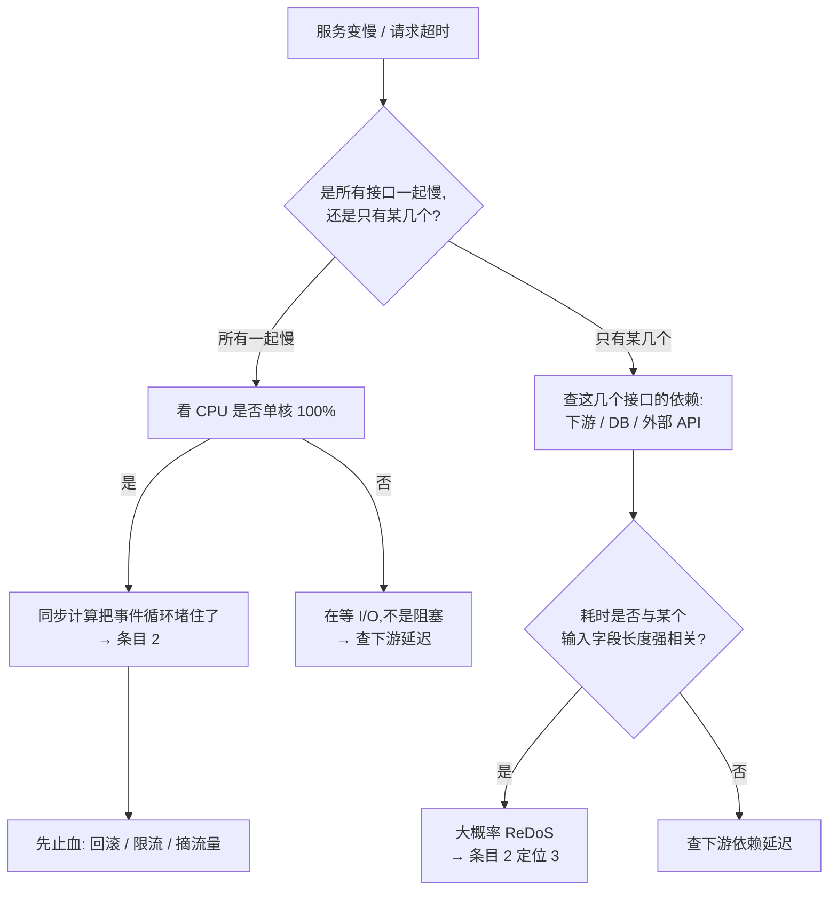

# JavaScript 语言核心 · 排障速查手册（QRH 式）

> **Phase 5 三件套之二 · 使用态**（崩了就翻，只要答案）
> 实测环境：Node.js v22.14.0 ｜ 生成日期：2026-09-04
>
> 📌 **本手册只给动作，不给原理。** 想懂"为什么会这样"去 [`08-实战经验.md`](08-实战经验.md)（每条末尾标了对应编号）。
> ⚠️ **第一条动作永远是止血，不是查根因**——线上没时间先搞清楚再动手。

## 怎么用

1. 看**下面这张索引表**，用你看到的**报错关键字或现象**定位条目
2. 进入条目后**从上往下执行**，别跳步骤
3. 每条最后有「若无效」的出口，不留死胡同

**紧急度**：🔴 立即处理（业务已受损）｜🟡 尽快处理（有风险未爆发）｜⚪ 有时间再看（体验或优化）

---

## 📇 症状索引表

> 交叉引用一律用**条目编号**（如「→ 转条目 4」），不用锚点链接——中文标题的锚点在不同渲染器（GitHub / VS Code / GitLab）下生成规则不一致，跳不过去。

| 你看到的（关键字 / 现象） | 条目 | 紧急度 |
|---|---|---|
| `ERR_UNHANDLED_REJECTION`、进程**退出码 1**、同步代码跑完进程就死 | **1** | 🔴 |
| **所有**请求 P99 一起飙升、健康检查超时、定时器大幅延迟 | **2** | 🔴 |
| `FATAL ERROR: Reached heap limit`、**退出码 134**、内存单调上涨 | **3** | 🔴 |
| 任务永远不返回、**零报错零日志**、进程也不退出 | **4** | 🟡 |
| `RangeError: Maximum call stack size exceeded` | **5** | 🟡 |
| `TypeError: Cannot read properties of undefined (reading 'x')` | **6** | 🟡 |
| `ReferenceError: Cannot access 'x' before initialization` | **7** | 🟡 |
| 异步结果为空、后续代码先执行、`reduce` 拿到 Promise | **8** | 🟡 |
| 批量任务耗时 ≈ 单任务 × 任务数 | **9** | 🟡 |
| `TypeError: Converting circular structure to JSON` | **10** | 🟡 |
| `xxx.getTime is not a function`、字段莫名消失、`NaN` 变 `null`、`Map` 变 `{}` | **11** | ⚪ |
| 改了 A，B 也跟着变 | **12** | ⚪ |

---

### 快速分流：服务"慢/卡"到底是哪一类



---

## 1. 🔴 进程退出码 1 + `ERR_UNHANDLED_REJECTION`

**一眼识别**：进程突然消失，**退出码 1**；日志以 `ERR_UNHANDLED_REJECTION` 开头，跟着一行 `Error: xxx`。特征是**同步代码其实都执行完了**（错误在微任务清空后才抛）。

| 步骤 | 动作 | 预期 |
|---|---|---|
| **止血** | 若最近有发布 → **先回滚**；否则加全局兜底让进程先活着 | 进程不再随退出码 1 消失 |
| 定位 1 | 全局搜 `new Promise` 与 `async` 调用点，找**既没 `.catch` 也没被 `try { await }` 包裹**的 | 通常 1–2 处 |
| 定位 2 | 临时加兜底打印（`reason` **和** `promise` 都要打） | 拿到具体是哪一个 Promise |
| 修复 | 单点加 `.catch` 或 `try/await/catch`；全局加 `process.on('unhandledRejection', ...)` 并**明确决策**（重启 / 降级） | 退出码 0 |
| 若无效 | → 转**条目 4**（可能兜底把错误吞了，只剩挂死） |

**分支判定**：若有兜底但进程仍崩 → 检查兜底 handler 自己有没有抛错；若退出码是 134 → 转**条目 3**

**预防**：所有 `async` 入口函数外层包 catch；CI 冒烟测试断言退出码为 0
**原理**：→ [`08-实战经验.md` · 故障模式 3](08-实战经验.md)

---

## 2. 🔴 全部请求变慢 / 健康检查失败

**一眼识别**：**所有**接口 P99 一起飙升（不是某几个）；定时器延迟远超设定值（期望 0ms 实际几百 ms）；CPU **单核** 100%；健康检查超时导致实例被摘除。

| 步骤 | 动作 | 预期 |
|---|---|---|
| **止血** | 若最近有发布/配置变更 → **直接回滚**（Cloudflare 的解法是"全局终止那个组件"，别纠结定位） | P99 回落 |
| 定位 1 | 上 `monitorEventLoopDelay`，看 `max` 与 `mean` | `max` 远大于 `mean` → 存在**长同步阻塞**；两者接近 → 不是阻塞，去查下游 |
| 定位 2 | 看 CPU 是否单核 100% | 是 → 同步计算；否 → 在等 I/O，转查下游延迟 |
| 定位 3 | 用 `node --cpu-prof` 抓 profile，或直接检查最近上线的**正则 / 大报文解析 / 大循环** | 找到热点函数 |
| 修复 | ① 分片让出主线程 ② `worker_threads` 挪走 ③ 换算法（去掉嵌套量词正则）④ 限制输入长度 | `max` 降到可接受水位 |
| 若无效 | → 转 `debug` 现场取证（本手册只覆盖"典型"阻塞，具体热点需现场 profile） |

**分支判定**：

- 若耗时**与某个输入字段长度强相关**（短输入正常、长输入秒级）→ 几乎可以确定是 **ReDoS**：把该字段截短重试，耗时断崖下跌即确认 → 修复走"改写正则 + 输入长度上限"
- 若是**启动阶段**一次性变慢 → 可能是冷启动编译 / 大量同步 require，转 ⚪ 优化类

**关键命令**（可直接抄）：

```js
const { monitorEventLoopDelay } = require('perf_hooks');
const h = monitorEventLoopDelay({ resolution: 10 });
h.enable();
setTimeout(() => {
  h.disable();
  console.log('max(ms)=', (h.max / 1e6).toFixed(1), 'p99(ms)=', (h.percentile(99) / 1e6).toFixed(1));
}, 30_000);
```

**预防**：请求路径禁止无上限同步循环；大报文用流式解析；用户可控输入设长度上限
**原理**：→ [`08-实战经验.md` · 故障模式 6、7](08-实战经验.md)

---

## 3. 🔴 内存持续上涨 / `FATAL ERROR: Reached heap limit`

**一眼识别**：`process.memoryUsage().heapUsed` **单调上涨不回落**；最终日志出现 `Mark-Compact` / `scavenge` 密集刷屏，然后 `FATAL ERROR: Reached heap limit`，**退出码 134**。

| 步骤 | 动作 | 预期 |
|---|---|---|
| **止血** | ① **先取堆快照**（`v8.writeHeapSnapshot()`）② 再重启实例 / 摘流量 | 服务恢复；快照保留作为证据 |
| 定位 1 | 在测试环境用 `node --expose-gc` 跑，手动 `global.gc()` 后看内存是否回落 | **回落** → 不是泄漏，只是还没触发 GC；**不回落** → 确认泄漏 |
| 定位 2 | 取**两次**堆快照（间隔一个业务高峰），在 DevTools Memory 面板用 **Comparison** 视图看"新增对象数"排行 | 找到增长最快的构造器 |
| 定位 3 | 看 Retainers（持有链），顺藤摸瓜找到"谁在引用它" | 定位到具体容器 / 闭包 / 监听器 |
| 修复 | 按类型选：无界容器 → **有界 LRU**；给对象挂元数据 → **`WeakMap`**；定时器/监听器 → **补清理路径**；闭包持大对象 → **缩小捕获范围** | GC 后内存能回落到基线 |
| 若无效 | → 转 `debug` 现场排查；临时兜底是"定期重启 + 拆分进程"，但那是缓兵之计不是修复 |

**分支判定**：

- 若泄漏对象是**业务数据容器**（`Map` / 数组 / 缓存）→ 加淘汰策略（LRU / TTL）
- 若泄漏对象是**与 DOM 或外部资源相关**（浏览器场景）→ 检查脱离文档树的引用残留 ⏳（此项本课未实测，需现场验证）
- 若只是 `--max-old-space-size` 调小了导致频繁 OOM → **调大只能延后 OOM，不解决泄漏**

**四种典型泄漏对照**（课 12 实测数字）：

| 类型 | 实测表现 | 修复 |
|---|---|---|
| 意外全局变量 | 4.2 → 19.5 MB，严格模式下报 `ReferenceError` | 加 `'use strict'` |
| 定时器未清理 | 4.3 → 19.6 MB | `clearInterval` / `AbortController` |
| 闭包持大对象 | 4.3 → 19.6 MB | 缩小捕获范围（修复版**压根不涨**） |
| 无界 `Map` 缓存 | 156.9 MB vs `WeakMap` 95.9 MB（**差值 61.0 MB**） | 换 `WeakMap` 或加 LRU 上限 |

**预防**：长存活容器必须有上限；给对象挂元数据默认用 `WeakMap`；`FinalizationRegistry` **不能**用来做确定性清理（规范不保证回调被调用）
**原理**：→ [`08-实战经验.md`](08-实战经验.md) 的「适用边界」一节 · [课 12 内存·性能与选型收束](stages/4-工程化与运行时/lessons/lesson-12-内存性能与选型收束.md)

---

## 4. 🟡 任务永远不完成、零报错

**一眼识别**：请求永远不返回、任务永远不完成；**没有任何报错、没有任何日志**；CPU 几乎为空；进程也不退出（只要还有活跃句柄）。

| 步骤 | 动作 | 预期 |
|---|---|---|
| **止血** | 给该调用加**超时**，先让业务能返回失败而不是无限等。<br/>⚠️ 常驻服务用 `AbortSignal.timeout`；**脚本/CLI/一次性任务用 `setTimeout` 哨兵**（前者内部定时器是 unref 的，无其它句柄时不触发） | 请求开始返回超时错误 |
| 定位 1 | 用 `Promise.race([p, 超时哨兵])` 判定 `p` 到底 settle 了没有 | 超时哨兵先返回 → `p` 确实没 settle |
| 定位 2 | 检查所有手写 `new Promise` 的**每个分支**是否都 `resolve`/`reject` | 找到漏掉失败分支的那处 |
| 定位 3 | 检查 executor 之外的异步回调（`setTimeout` / 事件 / 请求回调）里有没有 `throw` | 有 → Promise 接不住，错误会冒到 `uncaughtException` |
| 修复 | 补上缺失的 `resolve`/`reject`；异步回调里的错误手动 `try/catch` 后 `reject(e)` | 任务开始正常完成或失败 |
| 若无效 | → 转**条目 1**（可能兜底吞了错误）/ 转 `debug` |

**分支判定**：

- **若有全局 `uncaughtException` 兜底且只打日志** → 这是最坏组合：Promise 永不 settle **且**看不到真错误。兜底里必须打印 `promise` 对象并做出决策
- **若外部依赖（网络/DB）没有超时** → 对方不响应就永远 pending，超时是默认配置不是可选配置
- **若加了超时却仍然挂死** → 先确认超时哨兵真的会触发：脚本/CLI 场景下 `AbortSignal.timeout()` 的定时器是 unref 的，进程无其它句柄时**它不会触发**（实测：无其它句柄时 abort 不触发、进程 exit 0；同条件 `setTimeout` 正常触发）→ 换成 `setTimeout` 哨兵

**预防**：能用 `async` 就别手写 `new Promise`；每一个 `new Promise` 配一个超时
**原理**：→ [`08-实战经验.md` · 故障模式 4](08-实战经验.md)

---

## 5. 🟡 `RangeError: Maximum call stack size exceeded`

**一眼识别**：`RangeError: Maximum call stack size exceeded`，栈轨迹里同一个函数反复出现。

| 步骤 | 动作 | 预期 |
|---|---|---|
| **止血** | 若在线上 → 回滚最近变更；递归入口加**深度上限** | 不再崩 |
| 定位 1 | 看栈轨迹，找重复出现的那个函数 | 定位到递归点 |
| 定位 2 | 检查终止条件：是否漏了 base case？参数是否没变化？ | 找到"永远走不到出口"的原因 |
| 定位 3 | 若是处理深层嵌套数据（深 JSON、长链表）触发 → 不是 bug 是数据超预期 | 确认输入规模 |
| 修复 | ① 补/修正终止条件 ② 递归改**迭代**（显式栈）③ 数据超预期则改为流式/分治 | 不再触发 |
| 若无效 | → 转 `debug`（可能是相互递归 A→B→A，栈轨迹会交替，需要单独梳理） |

**分支判定**：若是**相互递归**（A 调 B、B 调 A）→ 栈轨迹会交替出现两个函数名，此时"看重复函数"这招失效，改用日志打印调用深度

**预防**：递归一律带深度上限；处理不可信深度的数据用迭代
**原理**：→ [课 7 事件循环](stages/3-异步与现代语法/lessons/lesson-07-事件循环.md)（本机实测溢出深度 12549 层）

---

## 6. 🟡 `TypeError: Cannot read properties of undefined`

**一眼识别**：`TypeError: Cannot read properties of undefined (reading 'x')`。报错行是一个**对象方法或属性访问**。

| 步骤 | 动作 | 预期 |
|---|---|---|
| **止血** | 若是新发布引入 → 回滚；否则在报错点前加可选链 `?.` 让它降级而非崩溃 | 不再崩（注意：这是降级不是根治） |
| 定位 1 | 判断是"`this` 丢了"还是"值本身是 undefined"：打印 `this` 与被访问对象 | `this === undefined` → `this` 丢失；对象本身 undefined → 数据流问题 |
| 定位 2 | **若 `this` 丢了**：查这个方法有没有被当值传出去（解构赋值 / 回调 / 延迟调用） | 找到丢失点 |
| 定位 3 | **若值是 undefined**：往上游追数据来源（接口字段缺失？异步还没返回？拼写错误？） | 找到数据缺口 |
| 修复 | `this` 丢失 → `bind` / 箭头包装 / class 字段箭头函数；数据缺失 → 补默认值或修正数据源 | 报错消失 |
| 若无效 | → 转 `debug` |

**分支判定**：

- 若发生在**回调里**（`setTimeout(obj.method, ms)`、数组方法的回调）→ 100% 是 `this` 丢失
- 若发生在**类的方法里** → 检查是不是用了箭头函数当方法（箭头函数拿不到实例 `this`）
- 若发生在**异步返回后** → 是数据时序问题，见**条目 8**

**预防**：方法当值传递时显式绑定；异步数据的中间态用可选链兜住
**原理**：→ [`08-实战经验.md` · 故障模式 5](08-实战经验.md)

---

## 7. 🟡 `ReferenceError: Cannot access 'x' before initialization`

**一眼识别**：`ReferenceError: Cannot access 'later' before initialization`。⚠️ 注意与 `x is not defined` **不同**——后者的变量压根不存在，前者是**变量已存在但还没初始化**（TDZ）。

| 步骤 | 动作 | 预期 |
|---|---|---|
| **止血** | 若是启动即崩（循环依赖）→ 回滚最近的模块调整 | 服务能起来 |
| 定位 1 | 看报错的变量名，判断三种形态之一：① 代码顺序 ② **ESM 循环依赖** ③ 参数默认值互相引用 | 归到某一类 |
| 定位 2 | **若是循环依赖**：画出 import 关系，找 A→B→A 的环 | 定位到环 |
| 定位 3 | 确认环上的导出是 `const`（进 TDZ）还是 `var`（得到 `undefined`） | `const` → 同步访问必炸 |
| 修复 | ① 代码顺序 → 把声明提到使用之前 ② 循环依赖 → 见 [场景解法库 · 场景 7](10-场景解法库.md) 的三个解法 ③ 参数默认值 → 调换顺序或改函数体内处理 | 不再触发 |
| 若无效 | → 转 `debug` |

**分支判定**：

- 若报错在**模块顶层**（启动时） → 循环依赖，走解法库场景 7
- 若报错在**函数体内**且变量在文件后面声明 → 纯代码顺序问题，挪声明即可
- 若用 `typeof x` 也报错 → **确认是 TDZ**（`typeof` 对未声明变量是安全的，会返回 `'undefined'`；能报错说明变量已存在但在死区）

**预防**：函数里别引用后面才声明的模块级 `const`；循环依赖视为设计问题
**原理**：→ [`08-实战经验.md` · 故障模式 10](08-实战经验.md)

---

## 8. 🟡 异步结果为空 / 后续代码先执行

**一眼识别**：`forEach` 之后立刻打印结果数组是 `[]`，过一会儿数据又"自己出现"；或 `reduce` 得到的是 `[object Promise]` 而不是数字；`try/catch` 抓不到回调里的错。

| 步骤 | 动作 | 预期 |
|---|---|---|
| **止血** | 若已上线 → 回滚；若是新代码 → 先把 `forEach` 换成 `for...of` + `await`（行为正确优先于性能） | 结果不再为空 |
| 定位 1 | 在紧跟其后的同步代码里打印结果长度 | 为 0 → 确认没人等这个 Promise |
| 定位 2 | 检查数组方法里是否有 `async` 回调，且外层没有 `await Promise.all(...)` | 找到那处 |
| 修复 | 要串行 → `for...of` + `await`；要并发 → `await Promise.all(items.map(...))`；要累加 → `reduce` 初值用 `Promise.resolve(0)` | 结果正确 |
| 若无效 | → 转**条目 9**（改完可能变慢，接着优化） |

**分支判定**：若**修好了但变慢** → 你用的是 `for...of` 串行版，改成 `Promise.all`（数量大则加并发上限），转条目 9

**预防**：数组方法里出现 `async` 回调，除非外层有 `await Promise.all(...)`，一律视为 bug
**原理**：→ [`08-实战经验.md` · 故障模式 2](08-实战经验.md)

---

## 9. 🟡 批量任务耗时 = N × 单次

**一眼识别**：总耗时 ≈ 单任务耗时 × 任务数；加机器、加 CPU 都没用（因为并发度恒为 1，资源根本没吃掉）。

| 步骤 | 动作 | 预期 |
|---|---|---|
| **止血** | 若已超时影响业务 → 降低批量规模或先只处理部分；**不要直接放开并发**（会打垮下游） | 先不超时 |
| 定位 1 | 量一下总耗时 ÷ 任务数是否 ≈ 单任务耗时 | 是 → 确认为串行 |
| 定位 2 | 在循环里打时间戳，看任务**启动时刻**是否串行排队 | 确认并发度 = 1 |
| 修复 | 数量可控 → `Promise.all(tasks.map(fn))`；数量大 → **并发上限**（信号量 / worker 池）；有依赖 → 保持串行但写明原因 | 耗时降到 1/N 或按上限收敛 |
| 若无效 | → 转**条目 2**（并发上来后可能触发新的瓶颈：事件循环或下游） |

**分支判定**：

- 改成 `Promise.all` 后**下游先扛不住** → 说明必须限流，用并发上限（参考实战项目的 Semaphore）
- 改成并发后**本机 CPU 打满** → 任务本身是 CPU 密集，转条目 2 的 worker 方案
- 任务之间有依赖 → **别并发**，串行是正确答案

**实测参考**（12 个任务 × 50ms，Node v22.14.0）：串行 742ms → `Promise.all` 62ms → 并发上限 3 为 247ms → 上限 5 为 184ms

**预防**：写循环前先问"这些任务之间有依赖吗？"
**原理**：→ [`08-实战经验.md` · 故障模式 1](08-实战经验.md)

---

## 10. 🟡 `TypeError: Converting circular structure to JSON`

**一眼识别**：`TypeError: Converting circular structure to JSON`，后面跟着 `--> starting at object with ...` 的环路径。

| 步骤 | 动作 | 预期 |
|---|---|---|
| **止血** | 若是日志/序列化路径崩了 → 先把该处序列化包 `try/catch`，别让打日志搞挂主流程 | 主流程不再被日志带崩 |
| 定位 1 | 看报错里的环路径（`--> property 'xxx' of object ...`），找到形成环的那个属性 | 定位到环 |
| 定位 2 | 确认这是**数据结构本身的环**（如父子互引、链表）还是**意外挂上去的引用**（如把整个 req 挂到了对象上） | 区分设计 vs bug |
| 修复 | ① 序列化前**剔除环上的属性**（展开时只取需要的字段）② 用 `structuredClone` 替代（它支持循环引用）③ 需要打印时用 `util.inspect(obj, { depth: 3 })` 代替 `JSON.stringify` | 序列化成功 |
| 若无效 | → 转**条目 11**（改用别的序列化方式后注意类型降级问题） |

**分支判定**：

- 若只是为了**打日志** → 用 `util.inspect`，它天生处理循环引用
- 若是为了**网络传输** → 必须定义 DTO（显式列出要传的字段），不要直接序列化领域对象
- 若环是**意外**产生的 → 先修环，别在序列化层打补丁

**预防**：序列化路径上只传扁平 DTO，不直接 `JSON.stringify` 领域对象
**原理**：→ [`08-实战经验.md` · 故障模式 8](08-实战经验.md)

---

## 11. ⚪ 数据静默损坏

**一眼识别**：`xxx.getTime is not a function`；字段莫名其妙消失；`NaN` / `Infinity` 变成 `null`；`Map` / `Set` 变成空 `{}`；`RegExp` 变成 `{}`。**全程不报错**。

| 步骤 | 动作 | 预期 |
|---|---|---|
| **止血** | 定位到出问题的那次序列化/拷贝，改为显式字段映射（DTO），先恢复正确性 | 数据恢复正确 |
| 定位 1 | 在拷贝前后各打一次 `Object.prototype.toString.call(value)` | 看到类型被降级（`[object Date]` → `[object String]`） |
| 定位 2 | 检查代码里有没有 `JSON.parse(JSON.stringify(x))` | 找到罪魁祸首 |
| 修复 | 纯数据 → 换 `structuredClone`；需跨网络 → 定义 DTO 并在边界做显式转换 | 类型保住 |
| 若无效 | → 转 `debug` |

**分支判定**：

- 若对象里**有函数或 Symbol** → `structuredClone` 也不行（会抛 `DOMException: could not be cloned`），必须手写或换方案
- 若需要**保留原型链**（自定义类的实例） → `structuredClone` 会丢原型（结果是普通对象），需手写克隆逻辑
- 若是**跨网络传输** → 类型降级是必然的（JSON 只有 6 种类型），必须在接收端显式还原

**实测降级对照**（Node v22.14.0）：

| 原类型 | JSON 往返后 | `structuredClone` 后 |
|---|---|---|
| `Date` | 字符串 ❌ | `Date` ✅ |
| `undefined` / 函数 / `Symbol` 字段 | **字段消失** ❌ | `undefined` 保留 ✅（函数/Symbol 抛错） |
| `NaN` / `Infinity` | `null` ❌ | 原样 ✅ |
| `Map` / `Set` / `RegExp` | `{}` ❌ | 原类型 ✅ |
| 循环引用 | `TypeError` ❌ | 支持 ✅ |

**预防**：把"深拷贝"当决策而不是语法；默认 `structuredClone`，记住它不克隆函数/Symbol 且丢原型
**原理**：→ [`08-实战经验.md` · 故障模式 8](08-实战经验.md)

---

## 12. ⚪ 改了 A，B 也跟着变

**一眼识别**：改了新对象的嵌套字段，回头发现原对象也变了；配置被污染；"我明明没动过那个变量"。

| 步骤 | 动作 | 预期 |
|---|---|---|
| **止血** | 若是配置污染 → 把该配置改为每次**现算**或在入口处深拷贝一次 | 污染不再扩散 |
| 定位 1 | 比较引用：`a.nested === b.nested` | `true` → 确认共享子对象 |
| 定位 2 | 检查创建副本的地方用的是不是 `{...x}` / `Object.assign` / `slice()` | 找到那处浅拷贝 |
| 修复 | 要独立副本 → `structuredClone`；只改一层 → 逐层重建 `{ ...obj, nested: { ...obj.nested, k: v } }` | `a.nested !== b.nested` |
| 若无效 | → 转 `debug`（可能是更深层的共享，或对象被多处持有） |

**分支判定**：

- 若只改**顶层**字段 → 浅拷贝够用，不用改（实测改顶层不影响原对象）
- 若改**嵌套**字段 → 必须深拷贝或逐层重建
- 若是**函数参数**传入的对象被改动 → 采用不可变写法：改的时候返回新对象，不改入参

**预防**：写下 `{...x}` 时默念一句"只复制一层"
**原理**：→ [`08-实战经验.md` · 故障模式 9](08-实战经验.md)

---

## 🆘 手册查不到当前症状

本手册只收录**领域典型**失败模式的预案。查不到 → 说明你遇到的是**具体**的 bug，转 `debug` 现场取证（拿日志、栈轨迹、最小复现），不要在本手册里硬套。

---

## 🚀 接下来

- 想搞懂原理 → [`08-实战经验.md`](08-实战经验.md)
- 想练设计 → [`10-场景解法库.md`](10-场景解法库.md)（7 道开放设计题）
- 想自测 → 复制"考我一下 JavaScript 语言核心"进入知识点对齐
