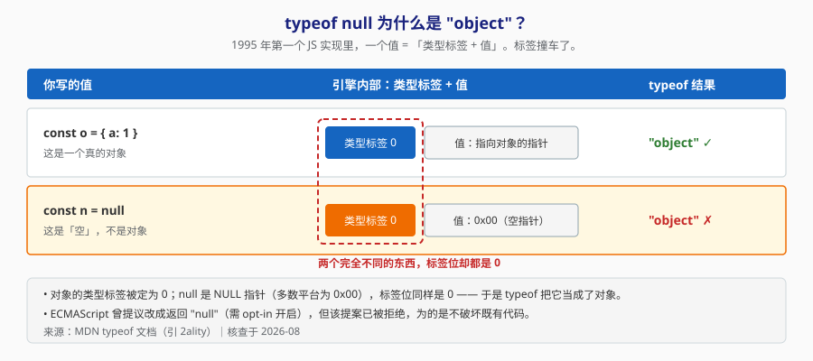
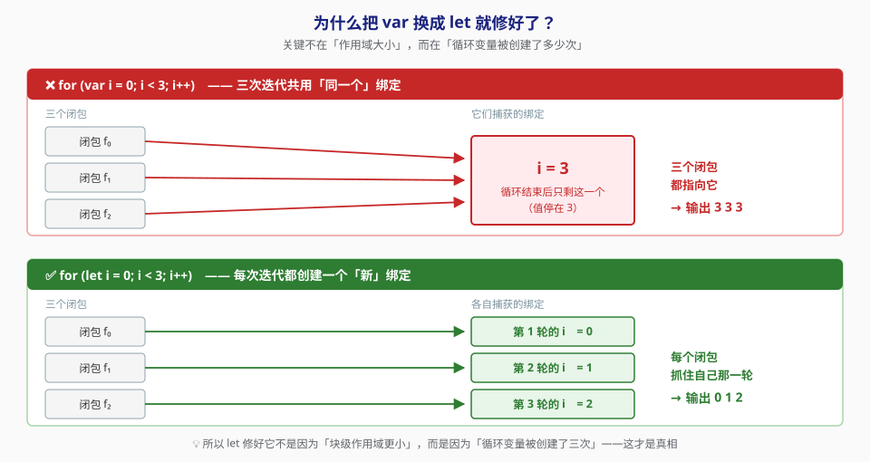
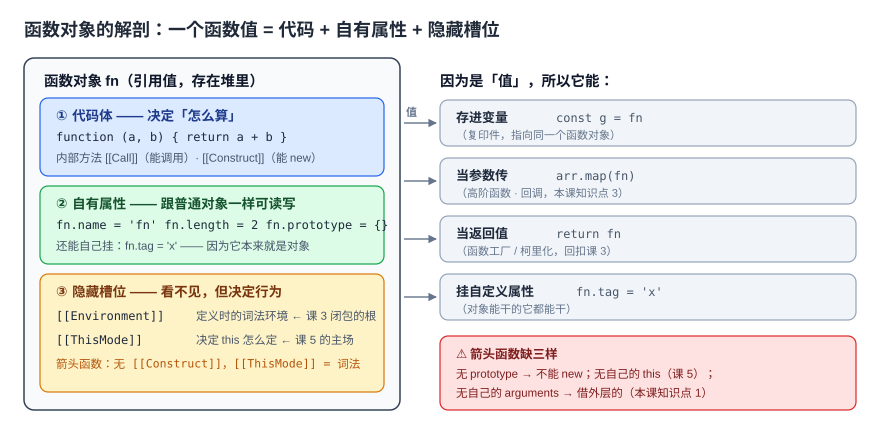
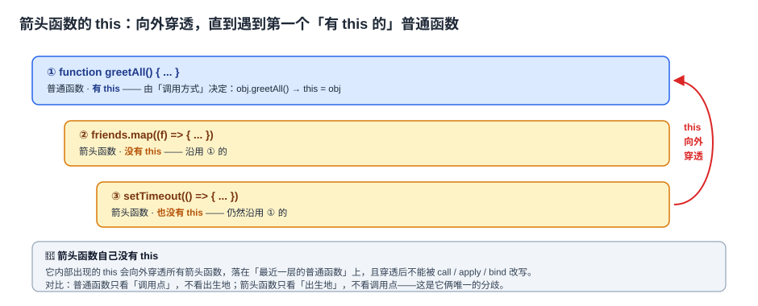
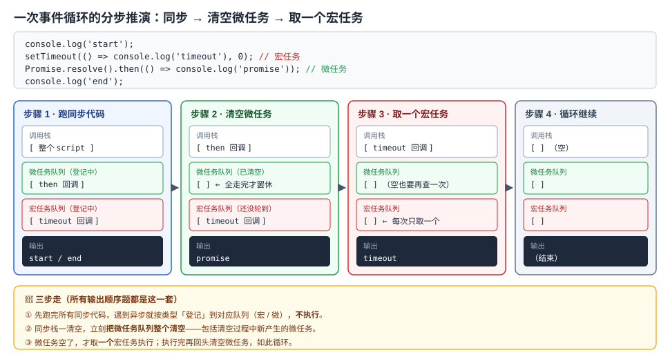
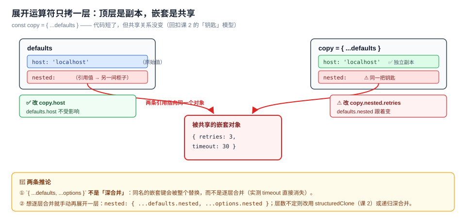
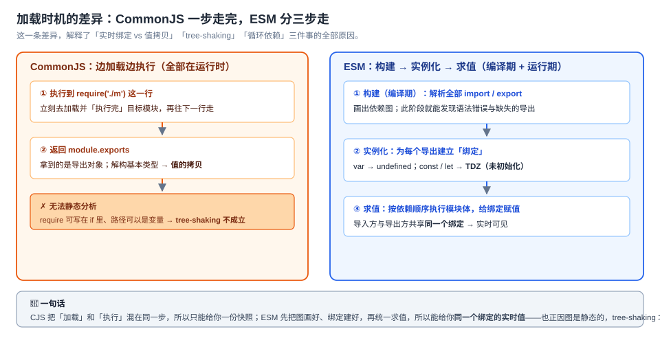

# JavaScript 语言核心（ES6+）· 课程手册

> 汇总手册（Phase 4）｜ 4 阶段 / 12 课 / 36 知识点 ｜ 已收录综合实战项目
> 实测环境：Node.js v22.14.0 ｜ 生成日期：2026-09-04
> 📌 本手册是**索引 + 摘要**，不替代课时正文；要下钻细节请走文中的课文件链接。

---

## 🗺️ 学习路径总览

**一句话定位**：让你从"能写 JS"成长为"能预判 JS 行为"。

> 四条主干线：**值怎么存 → 函数怎么调 → 时间怎么走 → 代码怎么组织**。

| 阶段 | 回答的问题 | 核心心法 |
|---|---|---|
| 1 值与作用域（课 1–3） | 一个值存在哪里、被谁看见？ | 作用域 + 提升 + TDZ 是 `var`/`let`/`const` 一切差异的根 |
| 2 函数与对象（课 4–6） | 函数怎么调、对象怎么连？ | `this` 看**调用点**；`class` 是原型继承的**语法糖** |
| 3 异步与现代语法（课 7–9） | JS 怎么处理"时间"？ | 单线程 + 调用栈 + 任务队列 = 事件循环 |
| 4 工程化与运行时（课 10–12） | 代码与资源怎么组织、怎么选？ | 差异在**加载时机**；选型看**约束**，不看宣传 |

---

## 阶段 1：值与作用域

### 课 1《变量与类型》

> **定位**：打地基。`var`/`let`/`const` 的差异不是背规则，而是三条机制的组合结果。

- **var·let·const 与 TDZ**：`let`/`const` 有块级作用域 + 暂时性死区；`var` 只有函数作用域 + 提升为 `undefined`。循环里的 `var i` 陷阱（`3 3 3`）正是这两点的后果。
- **数据类型全景**：7 种原始值 + Object；`typeof null === 'object'` 是历史 bug；`function` 不在类型表里（它是可调用对象，见课 4）。
- **类型检测的四种方式**：`typeof`（基本类型）/ `instanceof`（原型链）/ `Object.prototype.toString`（最准）/ `Array.isArray`（跨 realm 安全）。

📖 [课 1 正文](stages/1-值与作用域/lessons/lesson-01-变量与类型.md)

### 课 2《值的复制与比较》

> **定位**：解释"改了 A，结果 B 也变了"的唯一根因。

- **原始值 vs 引用值**：原始值复制的是**值**，引用值复制的是**指向同一对象的指针**。改属性影响对方、重新赋值不影响对方。
- **深浅拷贝**：浅拷贝只复制第一层；`structuredClone`（Node 17+）是真深拷贝。
- **== vs === 与隐式转换**：`===` 不转换；`==` 走一套隐式转换规则，`[] == ![]` 是 `true` 的完整推演见正文。

📖 [课 2 正文](stages/1-值与作用域/lessons/lesson-02-值的复制与比较.md)

### 课 3《作用域与闭包》

> **定位**：回答"一个名字在哪儿能被看见"。闭包不是技巧，是词法作用域的必然产物。

- **词法作用域与作用域链**：作用域在**代码书写时**就定了，与运行时调用无关（和课 5 的 `this` 正好相反）。
- **变量提升与块级作用域**：提升 = 声明先于赋值；`let` 进了 TDZ。
- **闭包**：函数记住了它的词法环境；`for (var ...)` 循环陷阱与 `for (let ...)` 的修复，本质是"每轮有没有独立绑定"。

📖 [课 3 正文](stages/1-值与作用域/lessons/lesson-03-作用域与闭包.md)

---

## 阶段 2：函数与对象

### 课 4《函数是一等公民》

> **定位**：函数凭什么能被传来传去 —— 它是"可调用对象"。

- **函数的四种定义方式与差异**：函数声明（提升）/ 函数表达式 / 箭头函数（无 `this`、无 `arguments`、不可 `new`）/ 构造器。箭头函数的三条硬限制全部实测。
- **参数机制**：按值传递；默认参数只在 `undefined` 时触发且有 TDZ；用剩余参数取代 `arguments`。
- **高阶函数与回调**：控制反转 —— 调用几次、何时调用、谁接错，都不由你（`map(parseInt)` 翻车推演）。

📖 [课 4 正文](stages/2-函数与对象/lessons/lesson-04-函数是一等公民.md)

### 课 5《this 到底指向谁》

> **定位**：`this` 不是玄学 —— 看**调用点**，不看出生地；四条规则有明确优先级。

- **this 的四种绑定规则**：优先级 `new` > 显式（call/apply/bind）> 隐式（对象方法）> 默认（全局/undefined）。隐式丢失：把方法取出来，"点"就没了。
- **箭头函数的 this**：不绑定自己的 `this`，向外穿透到最近的普通函数。判据：**箭头函数能保住外层 `this`，但造不出新的 `this`**。
- **手写 call·apply·bind 与 new**：三件套的灵魂是 `target[key](...args)` 一行；`new` 返回对象时覆盖显式绑定。

📖 [课 5 正文](stages/2-函数与对象/lessons/lesson-05-this到底指向谁.md)

### 课 6《原型与类》

> **定位**：全程最难的一课。`class` 底下就是原型链，别被语法骗了。

- **原型与原型链**：`__proto__` 是属性查找的兜底路径；读会沿链找、写只遮蔽不改原型。
- **class 语法与本质**：`class` 是原型继承的**语法糖**（五条证据实测：方法不可枚举、无提升、严格模式等）。
- **继承的五种写法与取舍**：原型链 / 借用构造 / 组合 / 寄生组合 / class。`class` 是今天的默认答案。

📖 [课 6 正文](stages/2-函数与对象/lessons/lesson-06-原型与类.md)

---

## 阶段 3：异步与现代语法

### 课 7《事件循环》

> **定位**：JS 单线程却不卡，全靠"调用栈 + 任务队列"这一套。

- **单线程与调用栈**：同步代码按栈执行；栈溢出 = `RangeError`（本机实测 12549 层）。
- **宏任务与微任务**：两级队列，微任务在每轮宏任务后**清空**（含连锁产生的）。
- **事件循环全流程**：`setTimeout` / `Promise.then` / `process.nextTick` 的先后顺序，全在"清空时机"上。

📖 [课 7 正文](stages/3-异步与现代语法/lessons/lesson-07-事件循环.md)

### 课 8《Promise 与 async/await》

> **定位**：`async/await` 不是新机制，是 Promise 的语法糖 —— 理解这点才写得出并发。

- **Promise 状态机**：pending → fulfilled/rejected，**三态不可逆**；`then` 永远返回新 Promise。
- **错误处理与组合方法**：`catch` 接错误；`all`/`allSettled`/`race`/`any` 语义差异（`all` 失败时其余请求**并未被取消**）。
- **async/await**：`async` 返回值恒为 Promise；`await` 把完成/失败拉回同步流。串行 vs 并发（实测 535ms vs 109ms）。

📖 [课 8 正文](stages/3-异步与现代语法/lessons/lesson-08-Promise与async-await.md)

### 课 9《现代语法与内置数据结构》

> **定位**：ES6+ 的"甜点"语法与真正有用的内置结构。

- **解构·展开·模板字符串**：对象展开 `...` 是**浅拷贝**（ES2018 才进标准）。
- **Map·Set·WeakMap·WeakSet**：`Map` 键可以是任意类型且保序；**`WeakMap` 键是弱引用**（给对象附加元数据的通用解）；`Set` 去重。
- **迭代器·生成器·可选链**：`Symbol.iterator` 让对象可 `for...of`；生成器可暂停；`?.`/`??` 属 ES2020。

📖 [课 9 正文](stages/3-异步与现代语法/lessons/lesson-09-现代语法与内置数据结构.md)

---

## 阶段 4：工程化与运行时

### 课 10《模块化》

> **定位**：代码怎么拆。CJS 与 ESM 的差异在**加载时机**，不在语法。

- **CommonJS 与 ESM**：CJS 运行时加载、导出值拷贝；ESM 编译期静态分析、导出实时绑定。tree-shaking 只在 ESM 上成立。
- **import·export 全语法**：命名/默认/转发；导入绑定是**只读**的。
- **循环依赖与动态导入**：ESM 循环依赖有三种表现（`const` + 同步访问抛 `ReferenceError`（TDZ）；`var` 是 `undefined`；延迟访问正常）；`import()` 做代码分割。

📖 [课 10 正文](stages/4-工程化与运行时/lessons/lesson-10-模块化.md)

### 课 11《错误处理与调试》

> **定位**：`try` 抓不到异步错误，是因为它的作用域是"栈帧存在的时间"。

- **Error 体系与 throw**：8 个内置错误类型；`cause`（ES2022）串错误链；跨 realm 时 `instanceof` 失效；永远 `throw new Error(...)` 不抛字符串。
- **try·catch·finally 与异步错误**：`finally` 里 `return` 会**静默吞掉异常**；两套兜底（`uncaughtException` / `unhandledRejection`）；错误边界 = 什么时候 catch、什么时候往上抛。
- **调试工具链与 Source Map**：`console.log` 三个坑；`--inspect-brk`；Source Map 把 `min.js:1:40` 还原成 `src.js:2:21`。

📖 [课 11 正文](stages/4-工程化与运行时/lessons/lesson-11-错误处理与调试.md)

### 课 12《内存·性能与选型收束》

> **定位**：收束。内存看**可达性**，选型看**约束**。

- **垃圾回收机制**：V8 用**可达性**（不是引用计数）—— 实测循环引用里的对象照样被回收；分代回收 + 标记清除。
- **常见内存泄漏与排查**：四种典型（意外全局 / 定时器监听器 / 闭包 / 无界容器）+ 堆快照对比法 + `WeakMap` 通用解。
- **选型收束**：该不该上 TS = 项目规模 × 团队规模 × 维护周期 × 依赖生态；警惕厂商基准（Bun 与 Deno 官网基准互相矛盾）。

📖 [课 12 正文](stages/4-工程化与运行时/lessons/lesson-12-内存性能与选型收束.md)

---

## 综合实战项目

### 《异步任务编排器》

> 需求：造一个「能限制并发、能超时、能重试、会缓存」的异步任务编排器。
> 环境：Node.js v22.14.0，**零依赖**。验收：**24 条断言 24 通过**。

**覆盖知识点地图**：**4 个阶段 / 12 课全部涉及**，其中 8 处核心落点 —— 闭包、`this`、事件循环、Promise 组合、Map 保序、ESM、错误体系与边界、内存泄漏。

**3 个真权衡决策点**（五段式详见 [`设计决策.md`](projects/异步任务编排器/设计决策.md)）：

| 决策点 | 选择 | 一句话理由 | 何时改选 |
|---|---|---|---|
| 并发调度机制 | 活动计数 + 等待队列（Semaphore） | 批量任务 + 需要可观测 + 未来可加优先级 | 持续流入的任务流 → Worker 池 |
| 超时与真取消 | `Promise.race` 判定 + `AbortController` 通知 | race 保证到点返回，abort 给任务收手机会 | 任务无法中断 → 只能接受"假取消" |
| 结果缓存 | 有界 `Map` + LRU | key 是字符串（WeakMap 用不了），有界才不泄漏 | 键天然是对象 → 换 `WeakMap` |

**反例对照**：7 条"能跑但很糟"的写法（无并发上限 / try 包 forEach / 抛字符串 / sleep 猜时间 / 无界缓存 / 定时器不清理 / 方法提取丢 this），**每条在小规模测试里都隐形**。

📖 [项目 README](projects/异步任务编排器/README.md) · [设计决策](projects/异步任务编排器/设计决策.md) · [反例对照](projects/异步任务编排器/反例对照.md) · [验收清单](projects/异步任务编排器/验收清单.md)

---

## 决策清单（决策参考目标专项）

> 本课程三大目标之一。每条都是"**看约束、给条件、不给结论**"的落地。

### 1. 值语义：`var` / `let` / `const` 选哪个？

- 默认 **`const`**，需要改就用 **`let`**，**不用 `var`**。
- 翻转点：维护老代码、必须兼容没有块级作用域的旧语义时，才碰 `var`。

### 2. 相等比较：`==` 还是 `===`？

- 默认 **`===`**。`==` 的隐式转换表是坑的来源。
- 例外：`x == null` 是"同时判断 null 和 undefined"的惯用写法，可接受。

### 3. 继承写法：五选一？

- 新项目默认 **`class extends`**。
- 老代码里认得出组合继承 / 寄生组合即可；无性能压榨需求不要手写原型链。

### 4. 模块化：CommonJS 还是 ESM？

- 新项目默认 **ESM**（能 tree-shaking、绑定只读、循环依赖语义更明确）。
- 翻转点：老库是 CJS、需要运行时动态加载、或目标运行时只认 CJS。

### 5. 该不该上 TypeScript？

- **≥3 条命中就上**：多模块契约多 / 多人协作 / 要维护几年 / 依赖都有类型 / 团队有时间学。
- **≤1 条**：先用 JSDoc + `@ts-check`。
- 时点事实（2026-09）：TS 7.0 是 Go 原生编译器（8–12x），"编译慢"已不成立；但 **7.0 无 API**，typescript-eslint / Vue / Svelte 等仍需 6.0。

### 6. 运行时：Node / Deno / Bun？

- 生产服务 + 长期维护 → **Node**；要沙箱/供应链安全 → **Deno**；要最快启动 + 一工具全包 → **Bun**。
- 甄别厂商基准三步：**谁测的 → 测的什么 → 我的场景像不像**。只采信"对手之间一致的结论"。

---

## 🚀 接下来可以做什么

- **避坑**：复制"给我讲讲 JavaScript 语言核心的实战经验、排障手册与场景解法库"，进入 Phase 5。
- **复盘**：复制"考我一下 JavaScript 语言核心，针对 {薄弱点}"进行知识点对齐。
- **进阶**：告诉我下一步想深入的方向（如浏览器 DOM、前端框架、TypeScript 语法、Node 后端），我会基于当前档案调整大纲继续。
