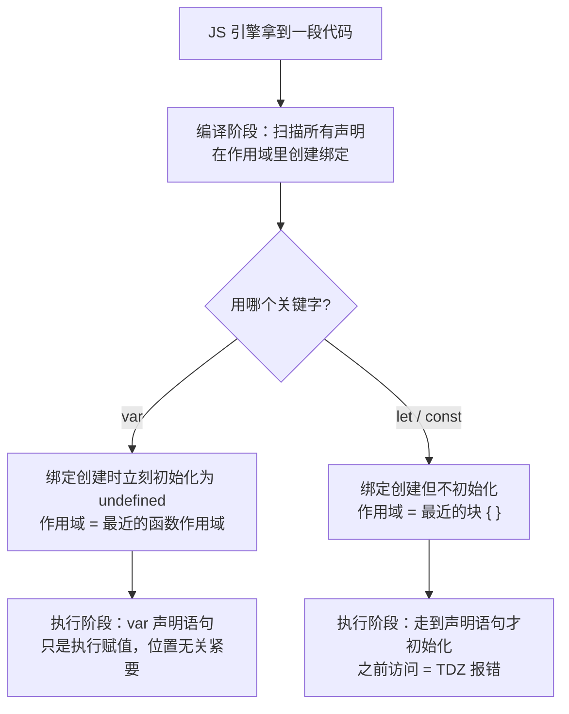
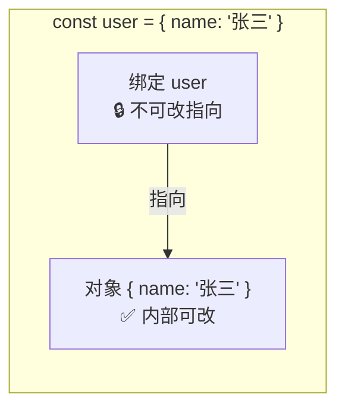
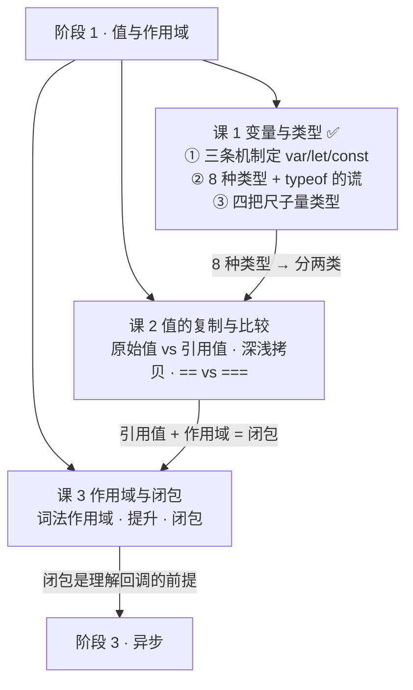
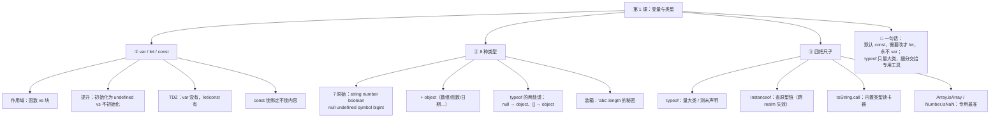

# 第 1 课：变量与类型

> 所属阶段：阶段 1《值与作用域》｜ 水平：入门 ｜ 本课知识点：var·let·const 与 TDZ、数据类型全景、类型检测的四种方式
> 故事情节：主角接手老项目，写下第一行"再普通不过"的 `var i`，第一次撞上"变量不是我以为的那个变量"
> ✅ 状态：已完成（2026-08-31）｜ 实操环境：Node.js v22.14.0（文中所有输出均为本机实测）

## 🎯 本课目标

- 说清 `var` / `let` / `const` 在作用域、提升、重复声明三方面的差异，并解释**为什么会这样**（而不是背规则）
- 数出 JS 的 7 种原始类型 + 对象，解释 `typeof null === 'object'` 这个历史 bug
- 针对"判断数组 / 判断 null / 判断 NaN"各选出正确的检测工具，并说明其他工具为什么不行

## 📌 知识点导航

| # | 知识点 | 状态 |
|---|--------|------|
| 1 | var·let·const 与 TDZ | ✅ |
| 2 | 数据类型全景 | ✅ |
| 3 | 类型检测的四种方式 | ✅ |

---

## 第一幕：起源与场景引入

> 🏛️ **起源**：1995 年，网景（Netscape）想让静态网页"动起来"，招来 Brendan Eich，最初是打算在浏览器里嵌入 Scheme 语言；但管理层很快改了主意——新语言的语法要像当时正火的 Java，好让非程序员也能上手。这门语言随 Navigator beta 于 1995 年 9 月发布时还叫 **LiveScript**，同年 12 月正式发布时才改名 **JavaScript**。1996 年 11 月网景把它提交给 Ecma International 标准化，1997 年 6 月诞生了第一版 ECMAScript。（核查于 2026-08，来源：维基百科 JavaScript 词条，引 Netscape/Sun 1995-12-04 新闻稿）
>
**了解这段历史有什么用？** 记住一件事就够了：JS 是一门**为了快速上线而仓促设计、随后又被标准化锁死**的语言。今天那些让你困惑的"诡异行为"，大多不是设计者的深谋远虑，而是 1995 年的一个权宜之计，因为兼容性再也改不掉了。（⏳ 附一笔：网络上广传的"Eich 只用了 10 天写出 JS"，本次未能在权威来源中核实，仅作传闻看待，不作为结论。）

好，回到你的项目。

> 🎬 **场景**：你接手了一个老项目，想加一个小功能——批量发三个请求，打印每次的序号。你写下再普通不过的四行代码：

```js
for (var i = 0; i < 3; i++) {
  setTimeout(() => console.log(i), 0);
}
```

你满心期待看到 `0 1 2`。结果控制台输出：

```
3
3
3
```

你揉揉眼睛，又写了段测试代码：

```js
console.log(i);        // 3        ← 循环都结束了，i 还在？
typeof i;              // 'number' ← 这个倒是没问题
typeof user;           // ReferenceError: user is not defined ← typeof 不是最安全的吗？！
```

三件事同时不对劲。别急，**这三件事的根因，全都在这门课里**。

---

## 第二幕：认知冲突

> ❓ **问题**：为什么"最基础"的部分反而最反直觉？

把上面三个异常摆在一起，它们指向同一个更深的困惑：

1. **变量的作用范围为什么和我的直觉不符？** `i` 明明是在 `for` 循环的括号里声明的，循环结束后它不但还活着，还保持着最后一次的值 `3`。
2. **为什么 `typeof` 一会儿安全一会儿炸？** 大家都说 `typeof x` 是"最安全的类型检测，永远不会报错"——为什么 `typeof user` 抛了 `ReferenceError`？
3. **为什么 `typeof null` 是 `'object'`，而 `null` 显然是"空"？** 这是不是说明我对 `null` 的理解从一开始就错了？

这三个问题的答案，恰好对应本课的三个知识点：

| 困惑 | 答案藏在 |
|------|---------|
| `i` 为什么活着 | **知识点 1**：`var` 是函数作用域 + 声明提升（不是块级作用域） |
| `typeof` 为什么会炸 | **知识点 1**：`let`/`const` 有暂时性死区（TDZ） |
| `typeof null` 为什么是 object | **知识点 2**：1995 年实现里的一个类型标签 bug |

先建立直觉，再上机制。

---

## 第三幕：层层揭示

### 知识点 1：var·let·const 与 TDZ

> 本知识点关键点：`var` 的变量提升与函数作用域 / `let`·`const` 的块级作用域 / TDZ 暂时性死区 / `const` 是"绑定不可变"而非"值不可变"

#### 一句话定义

`var`、`let`、`const` 的差异，是**作用域范围**、**提升行为**、**重复声明**三条机制的组合结果；`let`/`const` 在声明语句被执行之前存在一个"不能碰"的区间，叫暂时性死区（TDZ）。

#### 直觉建立（类比）

把变量想象成**公司里的工位**：

- **声明**（`var x`）= 行政部门在系统里登记了"工位 A 归 x 使用"
- **赋值**（`x = 1`）= x 本人真的搬过来坐下开始干活

`var` 的做法是：**先把工位登记好，人还没来时工位空着**（值是 `undefined`）。你要在这时候去工位找人，当然找不到人（`undefined`），但"这个工位存在"这件事是公认的——不会有人拦你。

`let`/`const` 的做法是：**工位也提前登记了，但在人搬进来之前，工位上挂着一块"施工中，禁止使用"的牌子**。你走过去，保安直接把你拦下来并报错——这就是 **TDZ（暂时性死区）**。

两者的区别在于**失败方式**：`var` 让你"悄悄地拿到一个空值"，`let`/`const` 让你"当场知道你搞错了"。**后者才是好设计**——它在第一时间把 bug 暴露出来，而不是让 `undefined` 流窜到半个项目之外再爆。

> 💡 **类比的边界**：真实机制里没有"工位"这回事。准确说法是：JS 引擎在执行代码前有一个**编译阶段**，此时会扫描出所有声明并在作用域里创建绑定（binding）。`var` 的绑定创建时立刻初始化为 `undefined`；`let`/`const` 的绑定创建时**不初始化**，要等到执行到声明语句才初始化——中间这段"已创建但未初始化"的区间就是 TDZ。另外，工位是"先到先得"的物理空间，而变量绑定只是引擎内部的一个记录，没有"占空间"的概念。

#### 核心原理

三条机制叠加，就产生了你看到的所有行为差异：



**三条机制拆解**：

| 机制 | `var` | `let` / `const` |
|------|-------|-----------------|
| **① 作用域** | **函数作用域**（整个函数内可见，不管写在哪个 `{}` 里） | **块级作用域**（只在其所在的 `{}` 内可见） |
| **② 提升** | 声明被提升，**并初始化为 `undefined`** | 声明被提升，**但不初始化**（进入 TDZ） |
| **③ 重复声明** | 允许（后者覆盖前者，是 bug 温床） | 同一作用域内禁止，直接 `SyntaxError` |

**`const` 的额外一条**：`const` 要求声明时必须赋值，且**绑定不可重新赋值**。

⚠️ 注意措辞——是**绑定不可变**，不是**值不可变**。这点极其重要：

```js
const user = { name: '张三' };
user.name = '李四';        // ✅ 完全合法！改的是对象内部，不是重新绑定
// user = { name: '王五' }; // ❌ TypeError: Assignment to constant variable.
```



**`let` 还是 `const`？** 一条实用规则：**默认用 `const`，只在确定需要重新赋值时才用 `let`，永远不用 `var`**。用 `const` 不是因为它"性能更好"（现代引擎下差异可忽略），而是它向读代码的人声明了"这个绑定不会再变"——这是一份免费的文档。

#### 示例演示

> 以下输出均为 **Node.js v22.14.0 本机实测**。

```js
// ① var：提升 + 初始化为 undefined
console.log(a);        // undefined   ← 不是 ReferenceError
var a = 1;
console.log(a);        // 1

// ② let：TDZ，连 typeof 都不放过
// console.log(b);     // ReferenceError: Cannot access 'b' before initialization
// typeof b;           // ReferenceError: Cannot access 'b' before initialization
let b = 1;

// ③ 块级作用域
if (true) {
  var v = 'var 出来了';
  let l = 'let 出不来';
  console.log(v, l);   // var 出来了 let 出不来
}
console.log(v);        // var 出来了   ← if 块关不住 var
// console.log(l);     // ReferenceError: l is not defined
```

```js
// ④ 循环里的经典对比（回扣第一幕）
for (var i = 0; i < 3; i++) { /* ... */ }
console.log(i);        // 3      ← 循环结束后 i 还活着，且保持最后的值

for (let j = 0; j < 3; j++) { /* ... */ }
// console.log(j);     // ReferenceError: j is not defined
```

```js
// ⑤ 重复声明
var d = 1;
var d = 2;             // ✅ 合法，静默覆盖（危险！）
console.log(d);        // 2

let e = 1;
// let e = 2;          // ❌ SyntaxError: Identifier 'e' has already been declared
```

#### 常见误区

1. **"提升就是把代码挪到最上面"**：这是一个方便理解但**不准确**的说法。引擎不会真的搬动你的代码。准确说法是"编译阶段先创建绑定"。之所以这个误解有害，是因为它会让你以为 `console.log(a); var a = 1;` 等价于 `var a = 1; console.log(a);`——后者会输出 `1`，前者输出 `undefined`，**赋值并没有被提升**，只有声明被提升了。

2. **"`typeof` 是安全的，永远不会报错"**：这句话只对一个**子集**成立。`typeof 完全没声明过的变量` 确实安全（返回 `'undefined'`）；但 `typeof` 一个**在 TDZ 中的 `let`/`const` 变量**会抛 `ReferenceError`。这正是第二幕里那个困惑的答案。

3. **"`const` 声明的对象不能改"**：错。`const` 锁的是"绑定"（这个变量名指向谁），不是"值"。想让对象内容也不可变，要用 `Object.freeze()`（但注意它只是浅冻结，深层还需递归处理）。

#### 一句话记住

> **`var` 悄悄给你 `undefined`，`let`/`const` 当场报错告诉你搞错了——所以默认用 `const`，需要重赋值用 `let`，永不写 `var`。**

> ✅ **困惑 1、2 已解**：`i` 活着是因为 `var` 是函数作用域（不是块级）；`typeof user` 会炸是因为 `let`/`const` 有 TDZ，而"typeof 永远安全"只适用于**从未声明**的变量。

#### 官方文档

- [var - MDN](https://developer.mozilla.org/zh-CN/docs/Web/JavaScript/Reference/Statements/var)
- [let - MDN](https://developer.mozilla.org/zh-CN/docs/Web/JavaScript/Reference/Statements/let)
- [const - MDN](https://developer.mozilla.org/zh-CN/docs/Web/JavaScript/Reference/Statements/const)

---

### 知识点 2：数据类型全景

> 本知识点关键点：7 种原始类型 + 对象 / `typeof` 返回值表与 `null` 的历史 bug / 装箱与拆箱 / `Symbol` 与 `BigInt` 的定位

#### 一句话定义

JS 只有 **8 种**数据类型：**7 种原始类型**（`string`、`number`、`boolean`、`null`、`undefined`、`symbol`、`bigint`）+ **对象**（object，包括数组、函数、日期等一切"非原始"的东西）。

#### 直觉建立（类比）

把 JS 的值分成两类，就像**便签纸**和**文件柜**：

- **原始类型 = 便签纸**：内容直接写在纸上。`let a = 1; let b = a;` 相当于照着抄了一张新便签，`a` 和 `b` 是两张独立的纸。
- **对象 = 文件柜**：变量里存的不是柜子本身，而是**柜子的钥匙**（引用）。`let x = {}; let y = x;` 相当于配了一把新钥匙，`x` 和 `y` 打开的是同一个柜子。

这就是"我改了 A，为什么 B 也变了"的唯一根因——**两把钥匙，同一个柜子**。这个主题会在课 2 展开。

> 💡 **类比的边界**：真实机制里，JS 引擎对原始值的存储有各种优化（比如 V8 会把小整数直接编码进指针里，叫 SMI），并不是真的每次都"抄一张便签纸"。但**行为上**它就是"按值复制"，类比在行为层面完全成立。

#### 核心原理

**`typeof` 返回值表**（实测）：

| 你写的值 | `typeof` 结果 | 备注 |
|---------|--------------|------|
| `undefined` | `"undefined"` | |
| `null` | `"object"` | ⚠️ **历史 bug，见下** |
| `true` | `"boolean"` | |
| `42` / `NaN` | `"number"` | `NaN` 也是 number！ |
| `'abc'` | `"string"` | |
| `1n` | `"bigint"` | ES2020 加入 |
| `Symbol()` | `"symbol"` | ES2015 加入 |
| `{}` / `[]` / `new Date()` / `/re/` | `"object"` | 数组、日期、正则都是 object |
| `function(){}` / `() => {}` | `"function"` | 函数是个"特殊待遇"的例外 |

**`typeof null === 'object'` 的成因**（这是本课最值得记住的历史知识）：


> 简单说：1995 年第一个 JS 实现里，一个值被表示成「**类型标签 + 值**」。对象的类型标签是 `0`；而 `null` 是 NULL 指针（`0x00`），它的标签位**恰好也是 0**。于是 `typeof` 把它认成了对象。ECMAScript 曾提议改成返回 `"null"`（需 opt-in 开启），但提案**被拒绝**了——因为无数既有代码已经在依赖这个"错误"行为。（核查于 2026-08，来源：MDN typeof 文档，引 2ality）

**装箱与拆箱**——为什么原始值能"点"出属性？

```js
'abc'.length;      // 3
(42).toFixed(2);   // '42.00'
```

`'abc'` 是原始类型，原始类型不是对象，对象才能有属性——那 `.length` 从哪来的？

答案是**装箱（boxing）**：当你试图访问原始值的属性时，引擎会临时把它包成一个对应的包装对象（`new String('abc')`），访问完立刻丢掉。

```js
typeof 'abc';               // 'string'   ← 原始值
typeof new String('abc');   // 'object'   ← 包装对象
'abc' == new String('abc'); // true       ← 装箱后值相同
'abc' === new String('abc');// false      ← 但类型不同
```

⚠️ **几乎永远不要手动 `new String()` / `new Number()` / `new Boolean()`**。它们会让 `typeof` 返回 `"object"`、让 `===` 失效、在布尔上下文里永远为真（因为对象都是 truthy）。这是 JS 里纯粹的自伤方式。

**`Symbol` 与 `BigInt` 的定位**：

```js
typeof Symbol();               // 'symbol'
Symbol('a') === Symbol('a');   // false ← 每次都是全新的、全局唯一的值

typeof 1n;                     // 'bigint'
1n + 1n;                       // 2n
// 1n + 1;                     // TypeError: Cannot mix BigInt and other types
```

- **`Symbol`**：给对象做**不会撞名**的属性键。你会在课 9 见到它（`Symbol.iterator`）。（ES2015）
- **`BigInt`**：表示超过 `Number` 安全范围（`2^53 - 1`）的整数。**注意它不能和 `Number` 混算**，会直接抛 `TypeError`。（ES2020）

#### 示例演示

```js
// typeof 全家福（实测输出）
const samples = { u: undefined, n: null, b: true, num: 42, s: 'abc',
                  bi: 1n, sy: Symbol(), o: {}, arr: [], f: () => {}, nan: NaN };
for (const [k, v] of Object.entries(samples)) {
  console.log(k.padEnd(4), typeof v);
}
// u    undefined
// n    object      ← ⚠️ 就是这个
// b    boolean
// num  number
// s    string
// bi   bigint
// sy   symbol
// o    object
// arr  object      ← 数组也是 object
// f    function
// nan  number      ← NaN 也是 number
```

```js
// 装箱的证据 + 副作用
const s = 'abc';
s.foo = 123;        // 装箱 → 在临时对象上写属性 → 临时对象立刻被丢掉
console.log(s.foo); // undefined ← 写进去的东西没了
```

#### 常见误区

1. **"`typeof null === 'object'` 说明 `null` 是对象"**：错。`null` 是**原始类型**，它表示"刻意没有值"。这是 `typeof` 的 bug，不是 `null` 的性质。要判断 `null`，请用 `x === null`。

2. **"`NaN` 不是 number，所以 `typeof NaN !== 'number'`"**：错。`NaN` 的类型就是 `number`，它只是"一个不合法的 number"。这个认知很重要，因为它是课 2 里 `Number.isNaN` 为什么必须存在的理由。

3. **"数组是一种独立类型"**：错。数组是对象，`typeof []` 返回 `"object"`。要判断数组必须用 `Array.isArray()`——这正是知识点 3 要解决的问题。

#### 一句话记住

> **JS 只有 8 种类型：7 种原始（string / number / boolean / null / undefined / symbol / bigint）+ object；函数是被 `typeof` 特殊照顾的 object；`typeof null === 'object'` 是 1995 年的 bug，改不掉了。**

> ✅ **困惑 3 已解**：`null` 是**原始类型**，`typeof` 说它是 object 只是 1995 年实现里"类型标签撞车"的 bug。判断 null 请用 `x === null`，别问 `typeof`。

#### 官方文档

- [JavaScript 数据类型和数据结构 - MDN](https://developer.mozilla.org/zh-CN/docs/Web/JavaScript/Guide/Data_structures)
- [typeof - MDN](https://developer.mozilla.org/zh-CN/docs/Web/JavaScript/Reference/Operators/typeof)
- [BigInt - MDN](https://developer.mozilla.org/zh-CN/docs/Web/JavaScript/Reference/Global_Objects/BigInt)

---

### 知识点 3：类型检测的四种方式

> 本知识点关键点：`typeof` / `instanceof` 与原型链的关系 / `Object.prototype.toString.call` / `Array.isArray` 与 `Number.isNaN` 各自的适用与坑

#### 一句话定义

JS 有四把"尺子"量类型：`typeof`、`instanceof`、`Object.prototype.toString.call()`、以及一批专用判断函数（`Array.isArray` 等）——**没有一把是万能的，各有各的量程和盲区**。

#### 直觉建立（类比）

量类型的四把工具，就像**测量工具的四种精度**：

| 工具 | 类比 | 适合量 |
|------|------|--------|
| `typeof` | **体重秤** | 量"大类"（是不是 number / string / function），但量不出"你是 int 还是 float" |
| `instanceof` | **查族谱** | 只回答"你是不是这个构造函数造出来的" |
| `Object.prototype.toString.call` | **身份读卡器** | 刷一下就知道精确类型（内置类型基本通吃） |
| `Array.isArray` 等专用函数 | **专用量具** | 只干一件事，但干得最准、最可靠 |

**核心心法**：先想清楚"我要排除的是什么"，再选尺子。**没有"最好的检测方式"，只有"对当前问题是可靠的那个"**。

> 💡 **类比的边界**：`instanceof` 的"查族谱"是有漏洞的——它查的是**原型链**，而原型链在跨"领域"（如 iframe、跨 vm）时会失效。这就是为什么后来有了专门的 `Array.isArray`。详见下方。

#### 核心原理

**四种方式的实测对比**：

| 值 | `typeof` | `instanceof Array` | `Object.prototype.toString.call` | `Array.isArray` |
|----|----------|-------------------|----------------------------------|-----------------|
| `[]` | `object` | `true` | `[object Array]` | `true` |
| `{}` | `object` | `false` | `[object Object]` | `false` |
| `null` | `object` ⚠️ | `false` | `[object Null]` | `false` |
| `undefined` | `undefined` | `false` | `[object Undefined]` | `false` |
| `NaN` | `number` ⚠️ | `false` | `[object Number]` | `false` |
| `'abc'` | `string` | `false` | `[object String]` | `false` |
| `new Date()` | `object` | `false` | `[object Date]` | `false` |
| `/re/` | `object` | `false` | `[object RegExp]` | `false` |

> 上表全部为 Node.js v22.14.0 实测结果。

**逐个说清它们的脾气**：

**① `typeof`** —— 快，但对 `null` 和数组说谎。

```js
typeof []           // 'object'  ← 数组？不认识
typeof null         // 'object'  ← null？不认识
typeof NaN          // 'number'  ← 只能说"技术上没错"
```

**唯一不可替代的能力**：`typeof` 是唯一能**安全检测未声明变量**的操作符。

```js
typeof 完全没声明过的变量   // 'undefined'  ← 不报错
完全没声明过的变量          // ReferenceError
```

**② `instanceof`** —— 查原型链：`x instanceof Foo` 等价于"沿着 `x` 的原型链往上找，能不能找到 `Foo.prototype`"。

```js
[] instanceof Array    // true
[] instanceof Object   // true  ← 因为 Array.prototype 的原型是 Object.prototype
```

⚠️ **它的致命伤**：跨"领域"（realm）失效。iframe 里的数组，它的 `Array.prototype` 和主页面的 `Array.prototype` 是**两个不同的对象**，于是 `iframeArray instanceof Array` 返回 `false`。这就是 `Array.isArray()` 存在的理由。（原型链的更多内容见课 6）

**③ `Object.prototype.toString.call(x)`** —— 内置类型通吃，返回形如 `[object Array]` 的字符串。

```js
Object.prototype.toString.call([])          // '[object Array]'
Object.prototype.toString.call(null)        // '[object Null]'   ← 唯一能直接区分 null 的
Object.prototype.toString.call(undefined)   // '[object Undefined]'
```

**为什么非要 `.call`？** 因为很多内置对象**重写**了自己的 `toString`（比如 `[1,2].toString()` 返回 `'1,2'`）。`.call` 是强行借 `Object.prototype` 上那个原始版本来用。

⚠️ 它也**不是万能的**：对自定义类的实例，它只会返回 `[object Object]`。要识别自定义类，还是得用 `instanceof`。

**④ 专用判断函数** —— 遇到具体问题时，这些永远是首选：

```js
Array.isArray([])        // true   ← 判断数组，永远用它，别用 instanceof
Number.isNaN(NaN)        // true
Number.isNaN('abc')      // false  ← 关键区别！
isNaN('abc')             // true   ← 全局 isNaN 会先做类型转换，容易误判
```

**`===` 也不是终点**：

```js
NaN === NaN        // false  ← 唯一一个"自己不等于自己"的值
Object.is(NaN, NaN)// true   ← Object.is 修了这一处
Object.is(0, -0)   // false  ← 以及这一处
0 === -0           // true
```

`Object.is` 只在**这两处**与 `===` 不同（`NaN`、`+0`/`-0`），其他地方行为一致。日常写代码用 `===` 就够了；只有在写工具函数、需要严格区分 `NaN` 或 `-0` 时才需要它。

**决策表——判断什么，用什么**：

| 你要判断的事 | 用这个 | 别用 |
|-------------|--------|------|
| 某个变量有没有声明 | `typeof x !== 'undefined'` | 直接访问（会抛错） |
| 是不是 `null` | `x === null` | `typeof`（会说是 object） |
| 是不是 `undefined` | `x === undefined` | `typeof` 也可以，但分不清"未声明" |
| 是不是 `null` 或 `undefined` | `x == null`（**这里故意用 `==`**） | `typeof` 组合判断 |
| 是不是数组 | `Array.isArray(x)` | `instanceof`（跨 realm 失效） |
| 是不是 `NaN` | `Number.isNaN(x)` | `isNaN`（会先转型，误判） |
| 区分内置对象细分类型 | `Object.prototype.toString.call(x)` | `typeof`（只会说 object） |
| 是不是某个自定义类的实例 | `x instanceof Foo` | `typeof` |

> 💡 **`x == null` 是 `==` 唯一值得用的场景**：因为 `==` 对 `null` 和 `undefined` 的特殊规定，它等价于 `x === null || x === undefined`，简洁且不会误伤 `0` 或 `''`。这是 JS 社区公认的少数几个 `==` 合理用法之一（其余的参见课 2）。

#### 示例演示

```js
// 一个"全能类型检测器"：组合四种工具
function typeOf(x) {
  if (x === null) return 'null';                    // typeof 会说 object
  if (Array.isArray(x)) return 'array';             // typeof 只会说 object
  if (Number.isNaN(x)) return 'nan';                // typeof 只会说 number
  const t = typeof x;
  if (t !== 'object') return t;                     // 原始类型直接返回
  return Object.prototype.toString.call(x)          // 剩下的是对象，读卡器上场
    .slice(8, -1)                                   // 砍掉前 8 个字符 '[object ' 和最后的 ']'
                                                    // '[object Date]' -> 'Date'
    .toLowerCase();                                 // -> 'date'
}

console.log(typeOf(null));        // 'null'
console.log(typeOf([]));          // 'array'
console.log(typeOf(NaN));         // 'nan'
console.log(typeOf(new Date()));  // 'date'
console.log(typeOf(/re/));        // 'regexp'
console.log(typeOf(42));          // 'number'
console.log(typeOf(Symbol()));    // 'symbol'
```

> 上面这个函数**就是"没有一把尺子能量一切"的最好证明**——它必须组合四种工具才能给出准确答案。你自己写一遍，比读十遍理解都深。

#### 常见误区

1. **"用 `instanceof` 判断数组就够了"**：不够。跨 iframe / 跨 realm 时会返回 `false`。永远用 `Array.isArray()`。

2. **"`Object.prototype.toString.call` 能识别自定义类"**：不能。它对自定义类实例只会返回 `[object Object]`（除非你手动定义 `Symbol.toStringTag`，那是 ES2015 的进阶技巧）。

3. **"`Object.is` 比 `===` 更严格，所以应该全面改用 `Object.is`"**：没必要，也不推荐。两者只在 `NaN` 和 `+0`/`-0` 两处不同，而把 `+0` 和 `-0` 视为相等在绝大多数场景是**正确且方便**的。全线换用 `Object.is` 反而会让习惯了 `===` 的读者困惑。

#### 一句话记住

> **判断数组用 `Array.isArray`，判断 NaN 用 `Number.isNaN`，判断 null 直接 `=== null`，判断未声明用 `typeof`，区分内置对象细分用 `Object.prototype.toString.call`——`typeof` 只用来量"原始类型的大类"。**

#### 官方文档

- [instanceof - MDN](https://developer.mozilla.org/zh-CN/docs/Web/JavaScript/Reference/Operators/instanceof)
- [Object.prototype.toString - MDN](https://developer.mozilla.org/zh-CN/docs/Web/JavaScript/Reference/Global_Objects/Object/toString)
- [Array.isArray - MDN](https://developer.mozilla.org/zh-CN/docs/Web/JavaScript/Reference/Global_Objects/Array/isArray)
- [Number.isNaN - MDN](https://developer.mozilla.org/zh-CN/docs/Web/JavaScript/Reference/Global_Objects/Number/isNaN)
- [Object.is - MDN](https://developer.mozilla.org/zh-CN/docs/Web/JavaScript/Reference/Global_Objects/Object/is)

---

## 第四幕：实操验证

现在回到第一幕的那段代码，用本课的知识**亲手验证**根因。

把下面代码存成 `l1-demo.js`，用 `node l1-demo.js` 运行（PowerShell 下先 `cd` 到文件目录）：

```js
// l1-demo.js —— 验证：为什么循环结束后 i 还活着，而且等于 3

console.log('=== var 版 ===');
for (var i = 0; i < 3; i++) {
  setTimeout(() => console.log('  回调里的 i =', i), 0);
}
console.log('  循环结束后 i =', i);        // 3   ← 变量还活着
console.log('  typeof i =', typeof i);      // number

console.log('=== let 版 ===');
for (let j = 0; j < 3; j++) {
  setTimeout(() => console.log('  回调里的 j =', j), 0);
}
// console.log(j);  // ReferenceError: j is not defined  ← 块级作用域关住了

console.log('=== typeof 的两种下场 ===');
console.log('  完全没声明:', typeof neverDeclared);   // undefined（安全）
try {
  console.log(typeof inTDZ);
} catch (e) {
  console.log('  TDZ 中的 let:', e.constructor.name + ': ' + e.message);
}
let inTDZ = 1;

console.log('=== 类型检测现场 ===');
console.log('  typeof null        =', typeof null);              // object ⚠️
console.log('  null === null      =', null === null);            // true ✅
console.log('  typeof []          =', typeof []);                // object ⚠️
console.log('  Array.isArray([])  =', Array.isArray([]));        // true ✅
console.log('  Number.isNaN(NaN)  =', Number.isNaN(NaN));        // true ✅
```

**实测输出**：

```
=== var 版 ===
  循环结束后 i = 3
  typeof i = number
=== let 版 ===
=== typeof 的两种下场 ===
  完全没声明: undefined
  TDZ 中的 let: ReferenceError: Cannot access 'inTDZ' before initialization
=== 类型检测现场 ===
  typeof null        = object
  null === null      = true
  typeof []          = object
  Array.isArray([])  = true
  Number.isNaN(NaN)  = true
  回调里的 i = 3
  回调里的 i = 3
  回调里的 i = 3
  回调里的 j = 0
  回调里的 j = 1
  回调里的 j = 2
```

> 💡 **注意输出的顺序**：所有带 `回调里` 的输出都排在最后，而不是紧跟在各自的 `console.log('循环结束后 i =', i)` 后面。因为 `setTimeout(fn, 0)` 的意思是"把 fn 排到队列里，等同步代码全部跑完再执行"——**不是"立即执行"**。这是课 7《事件循环》的主场，现在先记住这个现象，到时候会豁然开朗。

> ✅ **回扣场景**：三个困惑，现在解决了两个半：
> - ✅ **`i` 为什么活着**：因为 `var` 是函数作用域，`for` 的 `{}` 关不住它；循环结束时 `i++` 刚把它加到 `3`。
> - ✅ **`typeof` 为什么炸**：因为 `let`/`const` 有 TDZ，在声明语句执行前访问（连 `typeof` 也算）会抛 `ReferenceError`。
> - ✅ **`typeof null` 为什么是 object**：1995 年类型标签撞车的历史 bug。
>
> ⏳ **还剩半个**：换成 `let` 之后，`j` 的输出确实变成了 `0 1 2` —— 但**为什么？** 我们的回调是在循环结束后才执行的，那时 `j` 早就"死"了，怎么还能记住每次循环的值？
>
> 这个问题的答案叫**闭包**，是课 3 的主角。这里先记住结论：**在 `for` 里用 `let`，每次循环都会创建一个新的块级绑定**，回调"抓"住的是各自那一个。至于它凭什么能抓住——课 3 见。

---

## 第五幕：体系收束

> 📍 **全局定位**：你刚刚装上了这台"显微镜"的第一组镜片。

把本课放进整门课的地图里看：



**你现在会了什么**：

- 能用**三条机制**（作用域 / 提升 / TDZ）解释 `var`·`let`·`const` 的全部行为差异，而不是背规则
- 能数出 JS 的全部 8 种类型，知道 `typeof` 在**哪两个地方**会说谎（`null` 和数组）
- 面对"判断 XXX 是什么"能选出正确的工具，并且说清其他工具为什么不行

**你会发现的一个规律**：本课碰到的三个"诡异行为"，根因都不是"JS 设计得深奥"，而是：

1. `var` 的作用域规则 —— 1995 年的仓促决定，后来用 `let`/`const` 补上了，但为了兼容不能删掉 `var`
2. `typeof null` —— 一个实现层面的失误，提案修复被拒绝
3. `typeof []` 是 `object` —— 数组本来就是对象，这是设计，只是不够方便

**这就是这门课的方法论**：JS 的诡异行为，要么是**历史包袱**（改不掉了，只能绕开），要么是**设计取舍**（理解动机后就能接受）。没有一个是随机的。**你现在已经能区分这两种了**，这就是"能预判 JS 行为"的开始。

> 🔗 **下一步**：课 2《值的复制与比较》。本课把 8 种类型分成"原始值"和"对象"两大类，课 2 就来讲这两类值在**赋值、传参、比较**时的行为差异——也就是"我改了 A，为什么 B 也变了"的真正答案。

---

## 🐞 常见误区（本课汇总）

1. **"提升 = 把声明和赋值一起挪到顶部"** → 只有声明被提升，赋值留在原地。所以 `console.log(a); var a = 1;` 输出 `undefined` 而不是 `1`。
2. **"`typeof` 永远安全"** → 对未声明变量安全，对 TDZ 中的 `let`/`const` 会抛 `ReferenceError`。
3. **"`const` 对象不能改"** → `const` 锁绑定不锁内容。`user.name = 'x'` 完全合法。
4. **"`null` 是对象"** → `null` 是原始类型，`typeof null === 'object'` 是 bug。判空请用 `x === null`。
5. **"`NaN` 不是 number"** → `typeof NaN === 'number'`，它只是"不合法的 number"。
6. **"用 `instanceof` 判断数组"** → 跨 realm 会失效。用 `Array.isArray()`。
7. **"全局 `isNaN` 和 `Number.isNaN` 一样"** → `isNaN('abc')` 是 `true`（先转型），`Number.isNaN('abc')` 是 `false`。后者才符合"这是不是 NaN"的语义。
8. **"未声明就赋值没问题"** → 非严格模式下 `x = 1` 会悄悄创建一个全局变量；严格模式下直接 `ReferenceError`。ESM 模块**默认就是严格模式**——这也是永远别省略声明关键字的理由之一。

## 一图总结



## 课后小测

**Q1**：下面代码的输出是什么？

```js
console.log(a);
var a = 1;
```

- A. `1`
- B. `undefined`
- C. `ReferenceError`
- D. `null`

<details><summary>答案与解析</summary>

**答案：B**。`var` 的**声明**被提升到作用域顶部并初始化为 `undefined`，但**赋值 `a = 1` 留在原地**没有提升。所以第一行执行时 `a` 已存在但值还是 `undefined`。

易混点：很多人选 C，是把 `var` 和 `let` 搞混了——`let` 才会抛 `ReferenceError`（TDZ）。也有人选 A，是以为"提升 = 声明和赋值一起挪上去"。

</details>

**Q2**：想判断一个变量 `x` 是不是 `null`，最可靠的是？

- A. `typeof x === 'object'`
- B. `x === null`
- C. `!x`
- D. `x instanceof Object`

<details><summary>答案与解析</summary>

**答案：B**。

- A 错：`typeof null === 'object'` 确实成立，但 `typeof {} === 'object'` 也成立，分不开；而且这本身是个历史 bug。
- C 错：`!x` 对 `undefined`、`0`、`''`、`NaN`、`false` 全是 `true`，误伤一大片。
- D 错：`null instanceof Object` 是 `false`（`null` 没有原型链），反而判断反了。

</details>

**Q3**：关于 `const`，下面说法正确的是？

- A. `const arr = [1]; arr.push(2);` 会报错，因为 `const` 声明的值不可变
- B. `const obj = {}; obj = {};` 会报错
- C. `const` 声明的变量性能比 `let` 好，所以应该全部用 `const`
- D. `const x;` 是合法的，之后可以再赋值一次

<details><summary>答案与解析</summary>

**答案：B**。

- A 错：`arr.push(2)` 改的是数组**内部内容**，没有重新绑定 `arr`，完全合法。`const` 锁的是"绑定"（变量名指向谁），不是"值"。
- B 对：给 `const` 变量重新赋值 → `TypeError: Assignment to constant variable.`
- C 错：现代引擎下 `const` 与 `let` 的性能差异可忽略。用 `const` 的理由是**它向读代码的人声明了"这个绑定不会再变"**，是可读性收益，不是性能收益。
- D 错：`const` 声明时必须赋值，且只能赋值一次。`const x;` 直接 `SyntaxError`。

</details>

**Q4（进阶）**：下面两段代码的输出分别是什么？

```js
// 片段一
typeof neverDeclared;

// 片段二
typeof tdzVar;
let tdzVar = 1;
```

- A. 都是 `'undefined'`
- B. 片段一 `'undefined'`，片段二 抛 `ReferenceError`
- C. 片段一 抛 `ReferenceError`，片段二 `'undefined'`
- D. 都抛 `ReferenceError`

<details><summary>答案与解析</summary>

**答案：B**。

这是"typeof 永远安全"这句话的**边界**：

- 片段一：变量**从未声明**，`typeof` 安全返回 `'undefined'`
- 片段二：变量用 `let` 声明了，但访问发生在 TDZ 内 → `ReferenceError: Cannot access 'tdzVar' before initialization`

**实用价值**：这个区别在真实项目里会咬人。比如你写 `if (typeof feature !== 'undefined')` 做特性检测，如果 `feature` 恰好是在下方用 `let`/`const` 声明的，这行"安全检测"反而会直接崩掉程序。

</details>

## 🚀 下一批接力提示词

> 学完本课后，**复制下面这段文字发给 AI**，即可无缝进入下一课（无需重新描述上下文）：

```
继续学 JavaScript 语言核心（ES6+）。我的学习档案在 frontend/javascript-core/00-学习档案.md，
刚学完阶段 1《值与作用域》的课《变量与类型》三个知识点
（var·let·const 与 TDZ / 数据类型全景 / 类型检测的四种方式），
请按大纲继续讲解下一课《值的复制与比较》。
```

## 🧭 课程导航

➡️ **下一课**：[课 2：值的复制与比较](lesson-02-值的复制与比较.md)

📚 **返回目录**：[课程目录](../../02-课程目录.md) ｜ [阶段概览](../overview.md)
