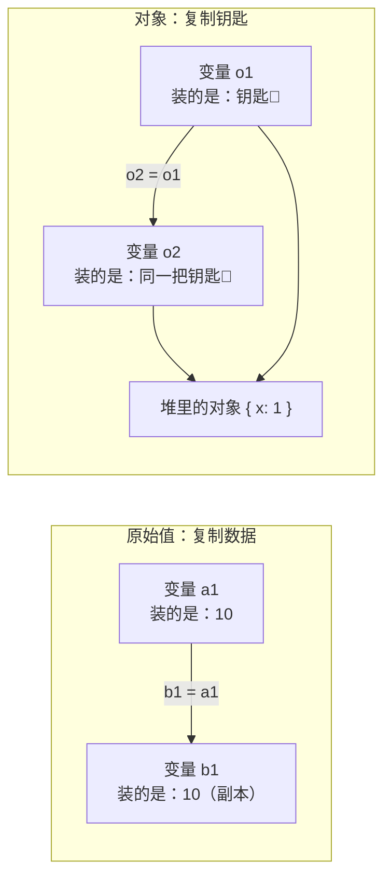
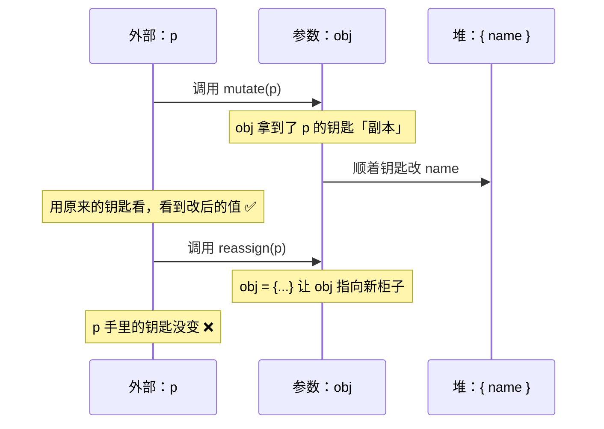
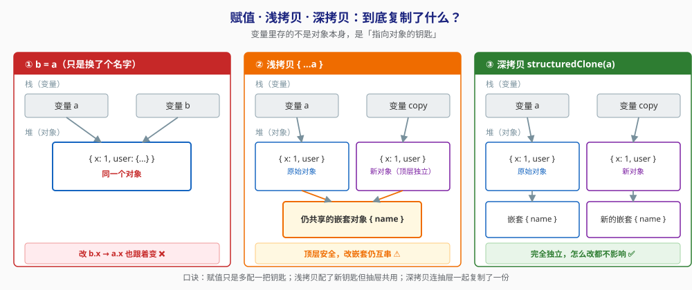
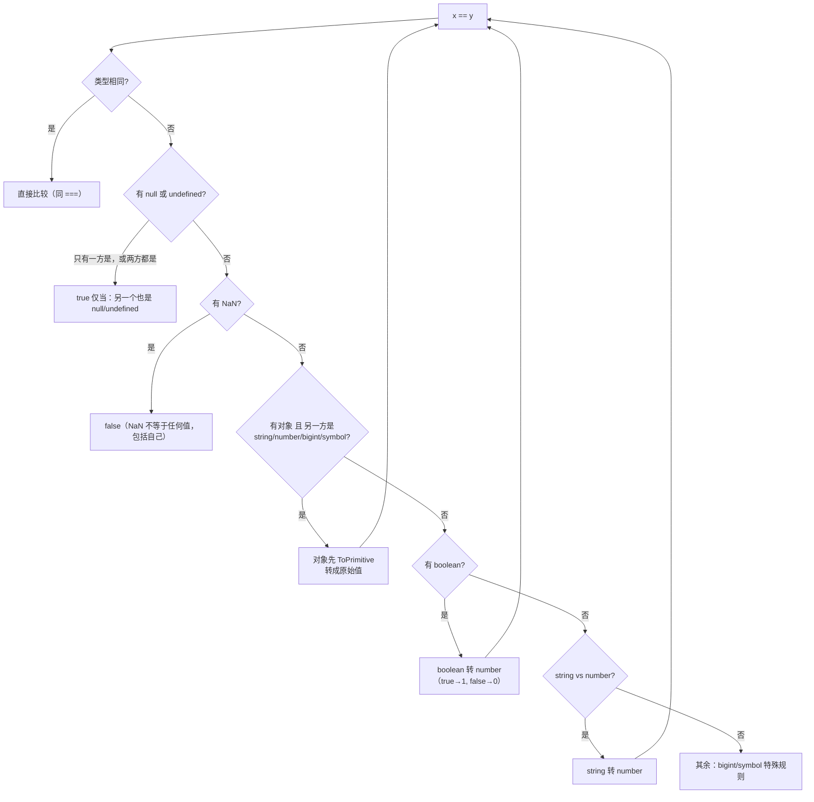
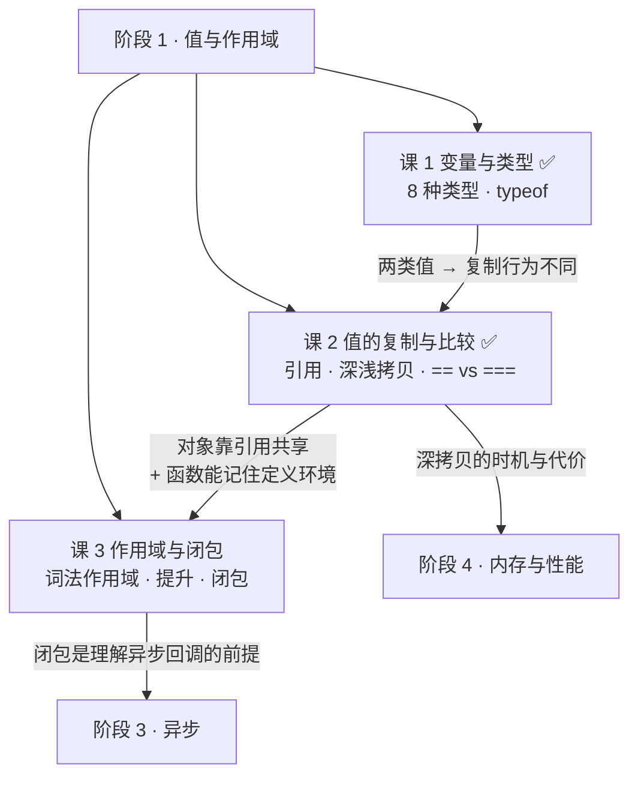
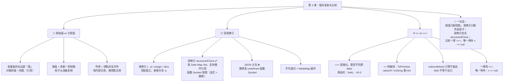

# 第 2 课：值的复制与比较

> 所属阶段：阶段 1《值与作用域》｜ 水平：入门 ｜ 本课知识点：原始值 vs 引用值、深浅拷贝、== vs === 与隐式转换
> 故事情节：主角写好了"恢复默认设置"按钮，一点下去，恢复出来的竟是用户刚改过的值——第一次意识到"复制"这个词在 JS 里有两种意思
> ✅ 状态：已完成（2026-08-31）｜ 实操环境：Node.js v22.14.0（文中所有输出均为本机实测）

## 🎯 本课目标

- 画出赋值时的栈 / 堆示意，解释"函数参数按值传递"对对象到底意味着什么
- 写出安全的深拷贝，并说清 `JSON.parse(JSON.stringify())` 会丢掉哪些东西
- 一步步推演出 `[] == ![]` 的结果为 `true`，并指出 `Object.is` 与 `===` 的两处差异

## 📌 知识点导航

| # | 知识点 | 状态 |
|---|--------|------|
| 1 | 原始值 vs 引用值 | ✅ |
| 2 | 深浅拷贝 | ✅ |
| 3 | == vs === 与隐式转换 | ✅ |

---

## 第一幕：起源与场景引入

课 1 我们把 8 种类型分成了两类：**原始类型**（便签纸）和**对象**（文件柜）。这一课就来讲这个分类带来的第一个后果——**复制**。

> 🎬 **场景**：你负责一个应用的「设置」页面。产品要求加一个「恢复默认」按钮。

你的思路很自然：页面加载时从接口拿一份默认配置**存起来**，用户点「恢复默认」时，把这份存起来的默认值填回表单。

```js
const defaultSettings = await fetchDefaultSettings();  // { theme: 'light', profile: { name: '默认用户' } }
const initial = { ...defaultSettings };                // 存一份"初始值"，看起来很合理

// ……用户在表单里改名成"李四"……
initial.profile.name = '李四';

// 用户点"恢复默认"
Object.assign(form, defaultSettings);
console.log(defaultSettings.profile.name);   // "李四"  ← ！！！默认值怎么被改了？
```

你把 `defaultSettings` 打印出来一看——**它早就被用户改掉了**。你存的"初始值"和它根本就是同一个东西。

更诡异的还在后面。你想不通，写了个小实验：

```js
[] == ![];      // true   ← 空数组"等于""非空数组的取反"？？
[] == [];       // false  ← 但两个空数组又不相等？
null == 0;      // false  ← null 不等于 0
null >= 0;      // true   ← 但 null 又大于等于 0？？
```

---

## 第二幕：认知冲突

> ❓ **问题**：为什么我"复制"了，却没复制成功？为什么 JS 的比较看起来是随机的？

三个困惑，一个比一个扎心：

1. **我明明复制了一份**（`{...defaultSettings}`），为什么改 copy，原始值也跟着变了？
2. **传对象进函数，改属性生效；但 `obj = {...}` 重新赋值就不生效。** 那 JS 到底是"按值传递"还是"按引用传递"？为什么两种操作结果不一样？
3. **`[] == ![]` 是 `true`，`[] == []` 是 `false`；`null == 0` 是 `false`，`null >= 0` 又是 `true`。** 这些结果是随机的吗？还是有一套我还没看见的规则？

好消息是：**这三个困惑都有确定答案，而且都是同一套底层规则的推论。**

| 困惑 | 答案藏在 |
|------|---------|
| 复制了却共享 | **知识点 1 + 2**：对象赋值复制的是"钥匙"不是"柜子"；`{...x}` 只是浅拷贝 |
| 改属性生效、重赋值不生效 | **知识点 1**：参数传递的是"引用的副本"——"按值传递"里的"值"，对对象来说就是那个引用 |
| 比较结果看起来随机 | **知识点 3**：`==` 有一套确定的转换算法，只是规则多；`>=` 那套规则又和 `==` 不一样 |

先建立直觉，再上机制。

---

## 第三幕：层层揭示

### 知识点 1：原始值 vs 引用值

> 本知识点关键点：栈与堆的直觉模型 / 赋值时复制的到底是什么 / "函数按值传递"的真正含义 / 类比的失效边界

#### 一句话定义

JS 里**变量存的永远是一个"值"**：对原始类型，这个值就是数据本身；对对象，这个值是**指向对象的引用**（可以理解成地址）。所以复制变量时，原始类型复制的是数据，对象复制的是那把"钥匙"。

#### 直觉建立（类比）

课 1 说原始值是**便签纸**、对象是**文件柜**。这个比喻现在要升级一下：

- 原始值 = 一张写着内容的便签纸。`let b = a` 相当于**照着抄一张新的**。之后你在 b 上涂改，a 不受影响。
- 对象 = 一个文件柜，变量里装的是**开这个柜子的钥匙**。`let b = a` 相当于**配了一把新钥匙**——柜子还是那一个。你在 b 这把钥匙打开的柜子里改东西，用 a 钥匙打开看到的当然也变了。

```js
let a1 = 10;
let b1 = a1;
b1 = 20;
console.log(a1);   // 10   ← 两张便签纸，互不影响

const o1 = { x: 1 };
const o2 = o1;        // 配了把新钥匙
o2.x = 99;
console.log(o1.x);    // 99  ← 同一个柜子
```

> 💡 **类比的边界**：引擎真实存储远比"便签纸 / 钥匙"复杂（V8 会把小整数直接编码进指针，叫 SMI；对象也可能被拆分成多个隐藏类字段）。但这个比喻在**行为层面**百分之百准确——你只需要记住一个问题："这个变量里装的是**数据**还是**钥匙**？"答案决定一切。

#### 核心原理

**赋值时到底复制了什么？**



所以 `o1 === o2` 是 `true`（两把钥匙开同一个柜子），而：

```js
[1, 2] === [1, 2]   // false ← 内容完全一样，但造了两个不同的柜子、配了两把不同的钥匙
```

**`===` 对对象比较的是"是不是同一个柜子"，不是"柜子里的东西一不一样"。** 这一条能解释前端一大半的"为什么我的 useEffect 又触发了""为什么 React 说我传入了新 props"。

**那函数传参到底是"按值"还是"按引用"？**

答案是：**永远按值传递**。只是对对象来说，**这个"值"就是那个引用**。

这句话听起来像绕口令，但它精确解释了困惑 2 的全部现象：

```js
function mutate(obj)   { obj.name = '改过了'; }        // 顺着钥匙开柜子改东西 → 生效
function reassign(obj) { obj = { name: '重新赋值' }; } // 把钥匙本身换了一把 → 对外面没影响

const p = { name: '原始' };
mutate(p);   console.log(p.name);   // '改过了'
reassign(p); console.log(p.name);   // '改过了'  ← 注意：还是 mutate 改的那个值，reassign 白干了
```



> **一句话**：参数是"钥匙的复印件"。复印件能开原来的柜子（所以能改里面的东西），但你把复印件涂改成另一把钥匙，**原件不会跟着变**。

#### 示例演示

> 以下输出均为 **Node.js v22.14.0 本机实测**。

```js
// ① 原始值 vs 引用值
let a1 = 10; let b1 = a1; b1 = 20;
console.log(a1, b1);                 // 10 20        ← a1 不受影响

const o1 = { x: 1 }; const o2 = o1; o2.x = 99;
console.log(o1.x, o2.x, o1 === o2);  // 99 99 true   ← 同一个对象

// ② 内容相同 ≠ 同一个对象
console.log([1, 2] === [1, 2]);      // false
console.log({ a: 1 } === { a: 1 });  // false

// ③ 函数传参：改属性 vs 重赋值
function mutate(obj)   { obj.name = '改过了'; }
function reassign(obj) { obj = { name: '重新赋值' }; }
const p = { name: '原始' };
mutate(p);   console.log(p.name);    // 改过了
reassign(p); console.log(p.name);    // 改过了  ← reassign 对外面毫无影响
```

#### 常见误区

1. **"JS 对对象是按引用传递的"**：不准确，而且这个误解会直接导致你在 `reassign` 这类代码上写 bug。准确说法是**永远按值传递**，只是对象的值 = 引用。理解成"传递钥匙的复印件"就不会错。

2. **`[1,2] !== [1,2]` 说明 JS 有 bug**：不是 bug，这是设计。`===` 对对象比的从来就是身份（identity）而非内容。要比较内容，得自己写深比较（或上 Lodash 的 `isEqual`）。

3. **"`const` 能让对象不被修改"**：不能（课 1 已说过，这里再强调一次，因为它是深浅拷贝讨论的起点）。`const` 锁的是钥匙，不是柜子。想让对象内容也不可变，用 `Object.freeze()`——但它是**浅冻结**，嵌套对象照样能改。

#### 一句话记住

> **变量里装的永远是一个"值"；对对象来说，这个值就是钥匙。所以赋值只是多配一把钥匙，柜子从没被复制过。**

> ✅ **困惑 2 已解**：参数是"钥匙的复印件"——顺着它改柜子里的东西生效，把它换成另一把钥匙则对外面毫无影响。所以 JS **永远按值传递**，只是对象的值就是引用。

#### 官方文档

- [JavaScript 数据类型和数据结构 - MDN](https://developer.mozilla.org/zh-CN/docs/Web/JavaScript/Guide/Data_structures)
- [相等性判断 - MDN](https://developer.mozilla.org/zh-CN/docs/Web/JavaScript/Equality_comparisons_and_sameness)

---

### 知识点 2：深浅拷贝

> 本知识点关键点：浅拷贝的三种写法 / `structuredClone` 与"JSON 大法"各自的坑 / 循环引用与 `WeakMap` 解法 / 拷贝的代价

#### 一句话定义

**浅拷贝**只复制对象的第一层（顶层属性独立、嵌套对象仍共享）；**深拷贝**递归复制所有层级，结果与原对象完全无关。

#### 直觉建立（类比）

接上"钥匙和柜子"的比喻，柜子里还能放**另一个柜子的钥匙**：

- **赋值**：多配一把钥匙，柜子还是同一个
- **浅拷贝**：造了个新柜子，把原柜子里的东西**照搬**过来——但里面的钥匙还是**同一把**，指向同一个内嵌柜子
- **深拷贝**：造了个新柜子，并且把里面所有内嵌柜子**也都复制了一份**，连钥匙都重新配



> 💡 **类比的边界**：深拷贝不是"无限递归复制"——遇到循环引用时必须有终止机制（见下方 `WeakMap` 方案）。另外深拷贝也不总是更贵：现代引擎对不可变数据有各种优化，而 `structuredClone` 是引擎原生实现，通常比手写的 JS 递归快。

#### 核心原理

**① 浅拷贝的三种写法**（都是等价的，都只拷一层）：

| 写法 | 适用 | 示例 |
|------|------|------|
| 展开运算符 `{...obj}` | 对象（最常用） | `const copy = { ...src }` |
| `Object.assign({}, obj)` | 对象（ES2015，比展开老） | `const copy = Object.assign({}, src)` |
| `arr.slice()` / `[...arr]` | 数组 | `const copy = arr.slice()` |

```js
const src = { x: 1, user: { name: '张三' } };
const copy = { ...src };
console.log(copy !== src);          // true  ← 顶层是新对象
console.log(copy.user === src.user);// true  ← ⚠️ 嵌套还是同一个！
```

**② 深拷贝方案一：`structuredClone()`（首选）**

> 🏛️ **来历**：它来自 **HTML 标准的结构化克隆算法（Structured Clone Algorithm）**——这套算法本来是给 `postMessage`（跨线程传数据）和 IndexedDB 用的，用来把 JS 值"打包"传出去。后来标准把它暴露成了一个可以直接调用的全局函数，于是 JS 终于有了官方深拷贝。
> （核查于 2026-08：规范见 WHATWG HTML `#dom-structuredclone`；**浏览器端自 2022 年 3 月起 Baseline 广泛可用**；**Node.js 自 v17.0.0 起全局可用**，本机 v22.14.0 实测可用）

```js
const deep = { x: 1, user: { name: '张三' }, d: new Date('2026-01-01'), m: new Map([['k', 1]]) };
const dc = structuredClone(deep);
console.log(dc.user !== deep.user);        // true  ← 嵌套也独立了
console.log(dc.d instanceof Date);         // true  ← Date 保住了！
console.log(dc.m instanceof Map);          // true  ← Map 也保住了
```

**但它也有边界**（实测）：

```js
structuredClone({ fn: () => {} });      // DataCloneError: () => {} could not be cloned.
structuredClone({ s: Symbol('x') });    // DataCloneError: Symbol(x) could not be cloned.

// 原型链不会被保留：
const parent = { inherited: 'yes' };
const child = Object.create(parent);
console.log(Object.getPrototypeOf(structuredClone(child)) === parent);  // false ← 原型丢了
```

**③ 深拷贝方案二：`JSON.parse(JSON.stringify(x))`（"JSON 大法"，能不用就不用）**

它会丢一大堆东西，**而且是静默的**：

| 原始值 | JSON 大法之后 | 说明 |
|--------|--------------|------|
| `undefined` / 函数 / `Symbol` | **直接消失** | 静默丢弃，不报错 ⚠️ |
| `new Date()` | 变成**字符串** | 丢类型 |
| `new RegExp()` / `Map` / `Set` | 变成 **`{}`** | 内容全丢 |
| `NaN` / `Infinity` | 变成 **`null`** | |
| `10n`（BigInt） | **抛 `TypeError`** | 唯一会报错的 |
| 循环引用 | **抛 `TypeError`** | `Converting circular structure to JSON` |

```js
const rich = { u: undefined, fn: () => {}, d: new Date('2026-01-01'),
               re: /abc/g, m: new Map([['k', 1]]), nan: NaN };
const back = JSON.parse(JSON.stringify(rich));
console.log(Object.keys(back).join(', '));  // d, re, m, nan   ← u 和 fn 人间蒸发
console.log(typeof back.d);                 // string          ← Date 变字符串
console.log(JSON.stringify(back.re));       // {}              ← 正则变空对象
console.log(back.nan);                      // null            ← NaN 变 null
```

> ⚠️ **为什么它特别危险**：丢函数、丢 `undefined` 的时候**一声不响**。对比之下 `structuredClone` 会**显式抛 `DataCloneError`**——**宁可当场报错，也不要静默给你一个残缺的副本**。

**④ 方案横评**（实测对比）：

| 维度 | 展开 / `Object.assign` | `JSON.parse(JSON.stringify())` | `structuredClone` | 手写递归 |
|------|----------------------|-------------------------------|-------------------|---------|
| 嵌套独立 | ❌ | ✅ | ✅ | ✅ |
| 保住 `Date` / `Map` / `Set` | —（不复制嵌套） | ❌ | ✅ | 需自己处理 |
| 含函数 / `Symbol` | —（不递归，原样带过去） | ❌ **静默丢** | ❌ **抛错（更好）** | 自己定规则 |
| 循环引用 | ✅（不递归） | ❌ 抛错 | ✅ | 需 `WeakMap` |
| 保留原型链 | ❌ | ❌ | ❌ | 可自行处理 |
| 成本 | 几乎为零 | 中（两次序列化） | 低（引擎原生） | 高（JS 递归） |

**⑤ 循环引用与 `WeakMap` 解法**

手写深拷贝遇到循环引用会无限递归爆栈。解法是**用 `WeakMap` 记住"已经造过的新对象"**：

```js
function deepClone(obj, seen = new WeakMap()) {
  if (obj === null || typeof obj !== 'object') return obj;  // 原始值原样返回
  if (seen.has(obj)) return seen.get(obj);                  // 见过 → 还回上次造的那个
  if (obj instanceof Date)   return new Date(obj);
  if (obj instanceof RegExp) return new RegExp(obj);

  const out = Array.isArray(obj) ? [] : {};
  seen.set(obj, out);              // ⭐ 先登记再递归——这一行是破环的关键
  for (const k of Reflect.ownKeys(obj)) {
    out[k] = deepClone(obj[k], seen);
  }
  return out;
}

const cyc = { name: '环' };
cyc.self = cyc;                    // 自己引用自己
const cc = deepClone(cyc);
console.log(cc.self === cc);       // true ← 不爆栈，且环被正确还原
```

> **为什么用 `WeakMap` 而不是普通 `Map` 或对象？** 因为 `WeakMap` 的键是**弱引用**——拷贝结束后，那些临时登记的对象不会因为这个 Map 的存在而无法被垃圾回收。用普通 `Map` 会造成内存泄漏。（`WeakMap` 的更多内容见课 9）

**⑥ 拷贝的代价**

深拷贝不是免费的：对象越大越深，成本越高。**三条实用纪律**：

1. **先问"我真的需要拷贝吗"**——很多时候用不可变更新（`{ ...state, x: 1 }`）比整体深拷贝便宜得多
2. **只在跨越"所有权边界"时深拷贝**——比如把外部传入的配置存为快照、把数据交给另一个线程/模块
3. **热路径上别深拷贝**——放在循环里深拷贝大对象，是常见的性能杀手

#### 示例演示

```js
// 三种浅拷贝写法，嵌套都共享
const src = { x: 1, user: { name: '张三' } };
const c1 = { ...src };
const c2 = Object.assign({}, src);
console.log(c1 !== src, c1.user === src.user);   // true true  ← 顶层独立，嵌套共享
console.log(c2 !== src, c2.user === src.user);   // true true

const arrSrc = [1, [2, 3]];
const ac = arrSrc.slice();
console.log(ac !== arrSrc, ac[1] === arrSrc[1]); // true true  ← 数组同理

// 循环引用：JSON 抛错，structuredClone 直接支持
const cyc = { name: '环' }; cyc.self = cyc;
try { JSON.stringify(cyc); } catch (e) { console.log('JSON  ->', e.constructor.name); }  // TypeError
const cc = structuredClone(cyc);
console.log('clone ->', cc.self === cc);   // true ← 环被正确还原了
```

#### 常见误区

1. **"`{...obj}` 就是深拷贝"**：这是**最普遍也最致命**的误解。展开运算符只拷一层，嵌套对象照旧共享。第一幕那个"恢复默认失效"的 bug 就是这么来的。

2. **"JSON 大法足够了"**：它对纯 JSON 数据（后端接口返回的普通对象 / 数组）确实够用；但只要数据里有 `Date`、`Map`、`undefined` 或循环引用，就会**静默**给你一个残缺副本。

3. **"`structuredClone` 什么都能拷"**：不能。函数和 `Symbol` 会抛 `DataCloneError`，原型链会丢。有这些需求就得手写。

4. **"`Object.freeze` 之后对象就完全不可变了"**：`Object.freeze` 是**浅冻结**，嵌套对象照样能改。要深层冻结得递归调用。

#### 一句话记住

> **`{...x}` 只拷一层，嵌套照旧共享；深拷贝优先 `structuredClone`（保 Date/Map、支持循环引用，但函数和 Symbol 会抛错）；JSON 大法会静默丢东西，能不用就不用。**

> ✅ **困惑 1 已解**：`{...defaultSettings}` 只拷了顶层，`profile` 这个嵌套对象还是同一把钥匙——这就是"恢复默认"失效的真正原因。一行修复：换成 `structuredClone(defaultSettings)`。

#### 官方文档

- [structuredClone() - MDN](https://developer.mozilla.org/zh-CN/docs/Web/API/Window/structuredClone)
- [结构化克隆算法 - MDN](https://developer.mozilla.org/zh-CN/docs/Web/API/Web_Workers_API/Structured_clone_algorithm)
- [Object.assign - MDN](https://developer.mozilla.org/zh-CN/docs/Web/JavaScript/Reference/Global_Objects/Object/assign)
- [展开语法 - MDN](https://developer.mozilla.org/zh-CN/docs/Web/JavaScript/Reference/Operators/Spread_syntax)
- [WeakMap - MDN](https://developer.mozilla.org/zh-CN/docs/Web/JavaScript/Reference/Global_Objects/WeakMap)

---

### 知识点 3：== vs === 与隐式转换

> 本知识点关键点：抽象相等比较算法 / `ToPrimitive` 与 `valueOf`·`toString` 顺序 / 经典 `[] == ![]` 推演 / `Object.is` 与 `NaN`

#### 一句话定义

`===`（严格相等）**直接比较**，类型不同就 `false`；`==`（抽象相等）**先按一套确定的算法做类型转换，再比较**。两者都是确定的——`==` 的"诡异"来自**规则多**，不是来自随机。

#### 直觉建立（类比）

把比较想象成**两个外国人对话**：

- `===`：**不带翻译**。双方语言不同 → 直接谈崩（`false`），干脆利落。
- `==`：**带了个翻译官**。只要有一方开口说"我不是这个类型"，翻译官就按一本厚厚的规则手册把双方翻成同一种语言，再比。

问题在于：这本规则手册**很厚**，而且翻译官有时会做出你没预料到的"翻译"。所以 `[] == ![]` 会是 `true`——不是随机，是你没读过那本手册。

> 💡 **类比的边界**：`==` 不是"翻译官自由发挥"，它是**完全确定**的规范算法（ECMA-262 里的 Abstract Equality Comparison）。而且有一类情况翻译官**拒绝工作**：`null` 和 `undefined` 只跟彼此相等，不做任何数值转换。这正是 `null == 0` 为 `false` 的原因。

#### 核心原理

**`==` 的核心规则（按执行顺序，够用版）**：



**关键几条**：

1. `null` 和 `undefined` **只等于彼此**，不等于任何其他值（所以 `null == 0` 是 `false`）
2. `NaN` 不等于任何值，**包括它自己**
3. 对象 vs 原始值 → 对象先 `ToPrimitive`
4. 有 boolean → 先把 boolean 转成 number

**`ToPrimitive`：`valueOf` 与 `toString` 的调用顺序**

对象要转成原始值时，引擎会给一个"提示"（hint），hint 决定先调谁：

| 场景 | hint | 调用顺序 | 实测结果 |
|------|------|---------|---------|
| `Number(obj)` | `number` | `valueOf` → `toString` | `1` |
| `String(obj)` | `string` | `toString` → `valueOf` | `'2'` |
| `obj + ''`、`obj == x` | `default` | `valueOf` → `toString` | `'1'` |

```js
const o = { valueOf() { return 1; }, toString() { return '2'; } };
Number(o);    // 1    （hint=number，valueOf 先）
String(o);    // '2'  （hint=string，toString 先）
o + '';       // '1'  （hint=default，valueOf 先 → 1，再 1 + '' → '1'）
```

> 📌 **`Date` 是个例外**：它默认走 `string` hint，所以 `date + ''` 得到的是「日期字符串」而不是数字；但 `date1 - date2` 走 `number` hint，得到的是毫秒差。
> 原理是 `Date` 内置了一个 `Symbol.toPrimitive`（常写作 `@@toPrimitive`）方法——对象可以用它**自定义**"我该怎么被转成原始值"，`Date` 就用它把自己默认指定成了 string。（详见 [Symbol.toPrimitive - MDN](https://developer.mozilla.org/zh-CN/docs/Web/JavaScript/Reference/Global_Objects/Symbol/toPrimitive)）

**🎯 经典推演：`[] == ![]` 为什么是 `true`**

按规则一步步走（每一步都是实测可验证的）：

| 步骤 | 表达式 | 依据 |
|:----:|--------|------|
| 0 | `[] == ![]` | 原式 |
| 1 | `[] == false` | `![]`：`[]` 是对象 → truthy → `!` 取反得 `false` |
| 2 | `[] == 0` | 规则 4：有 boolean → `Number(false)` = `0` |
| 3 | `'' == 0` | 规则 3：对象 vs number → `[]` 做 ToPrimitive（hint=default）：`valueOf()` 返回 `[]`（不是原始值，跳过）→ `toString()` 返回 `''` |
| 4 | `0 == 0` | 规则：`''` 转 number → `Number('')` = `0` |
| 5 | **`true`** | ✅ |

```js
![]            // false
[] == false    // true
[] == 0        // true
[].toString()  // ''
'' == 0        // true
[] == ![]      // true   ← 每一步都可验证，没有一步是随机的
[] == []       // false  ← 两边都是对象，比引用，两个不同的数组
```

**`null` 的三副面孔（一个能让你在面试里加分的点）**

```js
null == 0;     // false   ← == 有 null 特殊规则：null 只等于 null/undefined
null >= 0;     // true    ← 但关系运算符（> < >= <=）走的是 ToNumber：Number(null) = 0，所以 0 >= 0
null > 0;      // false   ← 0 > 0
Number(null);  // 0
```

**根因**：`==` 和 `>=` 用的是**两套不同的规则**。`==` 里 `null` 有特殊豁免；关系运算符没有，一律先 `ToNumber`。

**语句级陷阱：`{} + []`**

```js
({}) + [];   // '[object Object]'  ← 表达式位置：{} 是空对象
+[];         // 0                  ← 一元加号把 [] 转成 0
```

在浏览器控制台直接敲 `{} + []` 会得到 `0`——因为**语句开头**的 `{}` 被解析成了**空代码块**，整句等价于 `+[]`。这个坑在面试和博客里被反复引用，但它考的其实是"语句 vs 表达式的解析差异"，不是 `==` 的规则。

**什么时候该用 `==`？**

只有一处公认的合理用法：

```js
if (x == null) { /* x 是 null 或 undefined */ }
// 等价于：if (x === null || x === undefined)
```

理由：`==` 对 `null`/`undefined` 的特殊规定让它等价于上面那句，且**不会误伤 `0`、`''`、`false`**。除此之外，**一律用 `===`**。

#### 示例演示

```js
// 一条一条验证（实测输出）
[] == ![];        // true
[] == [];         // false  ← 比引用
[] == false;      // true
[] == 0;          // true
'' == 0;          // true
'0' == 0;         // true
'1' == true;      // true   ← '1' → 1，true → 1
'2' == true;      // false  ← '2' → 2，true → 1，2 ≠ 1
null == undefined;// true
null == 0;        // false  ← null 特殊规则
null >= 0;        // true   ← 关系运算符走 ToNumber
NaN == NaN;       // false  ← 唯一不等于自己的值
({}) == '[object Object]';  // true
[1, 2] == '1,2';  // true   ← 数组 toString 是 '1,2'

// Object.is 与 === 的两处差异（课 1 学过，这里串起来）
NaN === NaN;         // false
Object.is(NaN, NaN); // true   ← 差异 1
0 === -0;            // true
Object.is(0, -0);    // false  ← 差异 2
```

#### 常见误区

1. **"`==` 的行为是随机的 / 不可预测的"**：不是。它有完整的规范算法。问题在于规则多、边界多，记住成本高——所以社区约定"一律用 `===`"，是为了**省掉记住那本手册的成本**，不是因为 `==` 不确定。

2. **"`null >= 0` 为 true，说明 `null` 是 0"**：不是。`null` 只在**关系运算符**下被转成 0；在 `==` 下它不等于任何数字。两套规则别混。

3. **"`===` 完全没问题"**：`===` 有两处你可能不想要的行为——`NaN !== NaN`、`0 === -0`。写工具函数时需要严格区分的话，用 `Object.is`。

4. **"隐式转换都要避免"**：不必一刀切。`'' + x`、`x == null`、模板字符串里的转换都是清晰且被接受的。**该避免的是"读者看不出会转换"的地方**，比如 `if (arr == '1,2')`。

#### 一句话记住

> **`==` 带翻译、`===` 不带翻译——前者规则确定但手册很厚，所以一律用 `===`，唯一例外是 `x == null`（等价于判 null 或 undefined）；另外记住 `NaN !== NaN` 和 `0 === -0` 这两处 `===` 的坑，需要时用 `Object.is`。**

> ✅ **困惑 3 已解**：`==` 的规则完全确定，`[] == ![]` 五步可推演（不是随机）；`null >= 0` 为 `true` 是因为**关系运算符走 `ToNumber`**，和 `==` 压根不是同一套规则。

#### 官方文档

- [相等（==）- MDN](https://developer.mozilla.org/zh-CN/docs/Web/JavaScript/Reference/Operators/Equality)
- [严格相等（===）- MDN](https://developer.mozilla.org/zh-CN/docs/Web/JavaScript/Reference/Operators/Strict_equality)
- [Symbol.toPrimitive - MDN](https://developer.mozilla.org/zh-CN/docs/Web/JavaScript/Reference/Global_Objects/Symbol/toPrimitive)

---

## 第四幕：实操验证

现在回到第一幕那个"恢复默认"的 bug，用本课知识**亲手验证并修好它**。

把下面代码存成 `l2-demo.js`，用 `node l2-demo.js` 运行：

```js
// l2-demo.js —— 验证：为什么"恢复默认"恢复出的是用户改过的值

console.log('=== 场景复现：恢复默认设置 ===');
const defaultSettings = { theme: 'light', profile: { name: '默认用户', tags: ['a'] } };

const initial = { ...defaultSettings };        // ❌ 浅拷贝
initial.profile.name = '李四';
console.log('浅拷贝 -> defaultSettings.profile.name =', defaultSettings.profile.name, '（被污染）');

const ds2 = { theme: 'light', profile: { name: '默认用户', tags: ['a'] } };
const initial2 = structuredClone(ds2);         // ✅ 深拷贝
initial2.profile.name = '李四';
console.log('深拷贝 -> ds2.profile.name          =', ds2.profile.name, '（干净）');

console.log('\n=== 传参：改属性生效 vs 重新赋值不生效 ===');
function mutate(obj) { obj.name = '改过了'; }
function reassign(obj) { obj = { name: '重新赋值' }; }
const p = { name: '原始' };
mutate(p);   console.log('mutate   之后 p.name =', p.name);
reassign(p); console.log('reassign 之后 p.name =', p.name);

console.log('\n=== 拷贝方案横评 ===');
const src2 = { d: new Date('2026-01-01'), m: new Map([['k', 1]]) };
const byJson = JSON.parse(JSON.stringify(src2));
console.log('JSON    Date 变成:', typeof byJson.d, '| Map 变成:', JSON.stringify(byJson.m));
const byClone = structuredClone(src2);
console.log('clone   Date 保住:', byClone.d instanceof Date, '| Map 保住:', byClone.m instanceof Map);
try { structuredClone({ fn: () => {} }); } catch (e) { console.log('clone 含函数 ->', e.name + ': ' + e.message); }
console.log('JSON  含函数 -> 静默丢弃：', JSON.stringify({ fn: () => {} }));

console.log('\n=== 循环引用 ===');
const cyc = { name: '环' }; cyc.self = cyc;
try { JSON.stringify(cyc); } catch (e) { console.log('JSON  ->', e.constructor.name + ': Converting circular structure to JSON'); }
const cc = structuredClone(cyc);
console.log('clone -> 成功，cc.self === cc:', cc.self === cc);

console.log('\n=== [] == ![] 逐步推演 ===');
console.log('![]           =', ![]);
console.log('[] == false   =', [] == false);
console.log('[] == 0       =', [] == 0);
console.log('[].toString() =', JSON.stringify([].toString()));
console.log("'' == 0       =", '' == 0);
console.log('[] == ![]     =', [] == ![]);
console.log('[] == []      =', [] == [], '（比的是引用，不是内容）');

console.log('\n=== null 的三副面孔 ===');
console.log('null == 0    =', null == 0);
console.log('null >= 0    =', null >= 0, '（关系运算符走 ToNumber）');
console.log('null > 0     =', null > 0);
console.log('Number(null) =', Number(null));

console.log('\n=== 语句级陷阱：{} 的两种下场 ===');
console.log('表达式 ({}) + [] =', JSON.stringify(({} + [])));
console.log('一元加号 +[]     =', +[]);
```

**实测输出**：

```
=== 场景复现：恢复默认设置 ===
浅拷贝 -> defaultSettings.profile.name = 李四 （被污染）
深拷贝 -> ds2.profile.name          = 默认用户 （干净）

=== 传参：改属性生效 vs 重新赋值不生效 ===
mutate   之后 p.name = 改过了
reassign 之后 p.name = 改过了

=== 拷贝方案横评 ===
JSON    Date 变成: string | Map 变成: {}
clone   Date 保住: true | Map 保住: true
clone 含函数 -> DataCloneError: () => {} could not be cloned.
JSON  含函数 -> 静默丢弃： {}

=== 循环引用 ===
JSON  -> TypeError: Converting circular structure to JSON
clone -> 成功，cc.self === cc: true

=== [] == ![] 逐步推演 ===
![]           = false
[] == false   = true
[] == 0       = true
[].toString() = ""
'' == 0       = true
[] == ![]     = true
[] == []      = false （比的是引用，不是内容）

=== null 的三副面孔 ===
null == 0    = false
null >= 0    = true （关系运算符走 ToNumber）
null > 0     = false
Number(null) = 0

=== 语句级陷阱：{} 的两种下场 ===
表达式 ({}) + [] = "[object Object]"
一元加号 +[]     = 0
```

> ✅ **回扣场景**：三个困惑全部解决——
> - **"复制了却共享"**：`{...defaultSettings}` 只拷了顶层，`profile` 这个嵌套对象还是同一把钥匙。改用 `structuredClone` 后，默认值干干净净，"恢复默认"恢复正常。
> - **"改属性生效、重赋值不生效"**：参数是钥匙的复印件。`mutate` 顺着复印件开柜子改东西，当然生效；`reassign` 只是把复印件换成了另一把钥匙，原件纹丝不动。所以**永远按值传递**——对象的值就是引用。
> - **"比较看起来随机"**：`==` 的规则是完全确定的（`[] == ![]` 五步推演可复现）；`null >= 0` 为 true 是因为关系运算符走 `ToNumber`，和 `==` 不是同一套规则。
>
> 💡 **一行修复**：把 `const initial = { ...defaultSettings };` 改成 `const initial = structuredClone(defaultSettings);`。这就是这一课最实用的一句话。

---

## 第五幕：体系收束

> 📍 **全局定位**：你现在掌握了"值"这门课的一半——**值怎么存、怎么复制、怎么比较**。



**你现在会了什么**：

- 看到任意赋值 / 传参代码，能立刻判断"改这里会不会影响那里"
- 面对"我要复制这个对象"，能在浅拷贝 / `structuredClone` / JSON 大法 / 手写之间做出**有依据的**选择，并说清各自丢什么
- 能推演 `==` 的任意转换结果，并知道为什么"一律用 `===`"是社区共识（省掉记住手册的成本，不是因为 `==` 不确定）

**本课的方法论，和课 1 是同一条**：

| 现象 | 是历史包袱还是设计取舍？ |
|------|------------------------|
| 对象赋值共享引用 | **设计取舍**：如果赋值就深拷贝，传个大对象给函数会有巨大的性能开销 |
| `{...x}` 只拷一层 | **设计取舍**：浅拷贝成本极低且能满足 90% 的不可变更新场景，深拷贝太贵不该是默认 |
| `==` 的隐式转换 | **历史包袱**：1995 年为"让非程序员好上手"加的宽容规则，后患无穷，社区用 `===` 绕开 |
| `NaN !== NaN` | **设计取舍**：遵循 IEEE 754 浮点标准，代价是判断 NaN 必须专门用 `Number.isNaN` |
| `JSON.stringify` 静默丢函数 | **历史包袱**：JSON 格式本身就没有函数这个概念，只能丢 |

**判断力就是这样长出来的**：遇到诡异行为，先问"这是包袱还是取舍"。包袱 → 记住并绕开；取舍 → 理解它为什么这么选，你就知道什么时候该顺着它、什么时候该绕开它。

> 🔗 **下一步**：课 3《作用域与闭包》。本课解决的是"值怎么共享"，课 3 要解决的是"**函数为什么能记住它诞生时的环境**"——也就是课 1 开头那个 `3 3 3` 的**最后一块拼图**：为什么把 `var` 换成 `let` 就输出 `0 1 2`。

---

## 🐞 常见误区（本课汇总）

1. **"`{...obj}` 是深拷贝"** → 只拷一层，嵌套照旧共享。第一幕那个 bug 就是这么来的。
2. **"JS 对对象是按引用传递"** → 永远按值传递，只是对象的值 = 引用。理解成"传钥匙的复印件"就不会错。
3. **"`[1,2] === [1,2]` 应该是 true"** → `===` 对对象比的是身份不是内容，所以是 `false`。
4. **"JSON 大法能安全深拷贝"** → 会**静默**丢掉 `undefined`、函数、`Symbol`，把 `Date` 变字符串、`Map`/`Set` 变 `{}`、`NaN` 变 `null`，循环引用直接抛错。
5. **"`structuredClone` 什么都能拷"** → 函数和 `Symbol` 会抛 `DataCloneError`，原型链会丢。
6. **"`Object.freeze` 之后对象完全不可变"** → 它是浅冻结，嵌套对象照样能改。
7. **"`==` 的行为是随机的"** → 有完整规范算法，规则确定但手册很厚。用 `===` 是为了省掉记规则的成本。
8. **"`null >= 0` 为 true 说明 null 是 0"** → 关系运算符走 `ToNumber`，和 `==` 的 null 特殊规则是两套东西。
9. **"深拷贝越深越好"** → 深拷贝有成本，热路径上别用；先问"我真的需要拷贝吗"。

## 一图总结



## 课后小测

**Q1**：下面代码的输出是什么？

```js
const a = { n: 1, sub: { m: 2 } };
const b = { ...a };
b.n = 10;
b.sub.m = 20;
console.log(a.n, a.sub.m);
```

- A. `1 2`
- B. `10 20`
- C. `1 20`
- D. `10 2`

<details><summary>答案与解析</summary>

**答案：C**。

展开运算符是**浅拷贝**：`b` 的顶层属性是独立的，所以 `b.n = 10` 不影响 `a.n`（还是 `1`）；但 `b.sub` 和 `a.sub` 是**同一个对象**，所以 `b.sub.m = 20` 会改到 `a.sub.m`（变成 `20`）。

这正是第一幕"恢复默认失效"的 bug 原型。

</details>

**Q2**：关于函数传参，下面说法正确的是？

```js
function fn(obj) { obj = { x: 99 }; }
const p = { x: 1 };
fn(p);
console.log(p.x);
```

- A. 输出 `99`，因为对象是按引用传递的
- B. 输出 `1`，因为对象是按值传递的
- C. 输出 `1`，因为 JS 永远按值传递，这里给参数重新赋值不影响外部变量
- D. 取决于是否使用严格模式

<details><summary>答案与解析</summary>

**答案：C**。

B 的结论对（输出 `1`），但理由表述不完整；**C 才是准确说法**：JS **永远按值传递**。对对象来说，这个"值"就是引用。

调用 `fn(p)` 时，参数 `obj` 拿到了 `p` 那份引用的**副本**。函数体内 `obj = { x: 99 }` 是**让参数变量指向了新对象**，并没有动 `p` 手里的那份引用。所以 `p.x` 仍是 `1`。

⚠️ 注意对比：如果函数里写的是 `obj.x = 99`（顺着钥匙改柜子里的东西），那 `p.x` 就会变成 `99`。

</details>

**Q3**：要深拷贝下面这个对象，哪个方案最合适？

```js
const data = { createdAt: new Date(), tags: ['a'], meta: { id: 1 } };
```

- A. `{ ...data }`
- B. `JSON.parse(JSON.stringify(data))`
- C. `structuredClone(data)`
- D. `Object.assign({}, data)`

<details><summary>答案与解析</summary>

**答案：C**。

- A、D 都是浅拷贝 → `meta` 仍共享，且 `tags` 数组也仍共享，不合格。
- B 能深拷贝，但 `createdAt`（`Date`）会被**静默变成字符串**——你拿到的不再是 `Date` 对象，`data.createdAt.getTime()` 会直接报错。
- C 正确：`structuredClone` 会保住 `Date`，嵌套对象和数组也全部独立，且这段代码里没有函数 / `Symbol`，不会触发 `DataCloneError`。

</details>

**Q4（进阶）**：`[] == ![]` 的结果是 `true`。下面哪一步**不是**这个结果的推导环节？

- A. `![]` 求值为 `false`
- B. boolean 参与 `==` 时先转成 number，得到 `[] == 0`
- C. 对象参与 `==` 时先做 `ToPrimitive`，`[]` 转成 `''`
- D. `''` 被转成 boolean，得到 `false == 0`

<details><summary>答案与解析</summary>

**答案：D**。

完整推导是：`[] == ![]` → `[] == false`（A）→ `[] == 0`（B）→ `'' == 0`（C）→ `0 == 0` → `true`。

D 错在最后一步的方向：`''` 是被转成 **number**（`Number('')` = `0`），不是转成 boolean。如果真转成了 boolean，`''` 会变成 `false`，然后 `false == 0` 又要再转一次——绕了一圈但结论碰巧还是 `true`，所以这个错误很隐蔽。

**关键记忆点**：`==` 在 string vs number 时，永远是 **string → number**，不是 string → boolean。

</details>

## 🚀 下一批接力提示词

> 学完本课后，**复制下面这段文字发给 AI**，即可无缝进入下一课（无需重新描述上下文）：

```
继续学 JavaScript 语言核心（ES6+）。我的学习档案在 frontend/javascript-core/00-学习档案.md，
刚学完阶段 1《值与作用域》的课《值的复制与比较》三个知识点
（原始值 vs 引用值 / 深浅拷贝 / == vs === 与隐式转换），
请按大纲继续讲解下一课《作用域与闭包》。
```

## 🧭 课程导航

⬅️ **上一课**：[课 1：变量与类型](lesson-01-变量与类型.md)

➡️ **下一课**：[课 3：作用域与闭包](lesson-03-作用域与闭包.md)

📚 **返回目录**：[课程目录](../../02-课程目录.md) ｜ [阶段概览](../overview.md)
