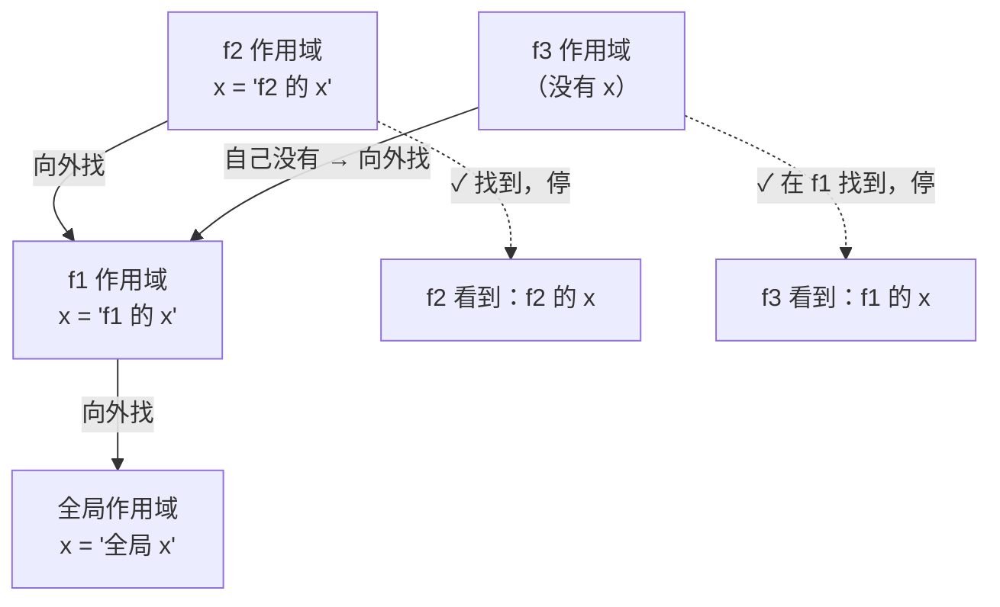
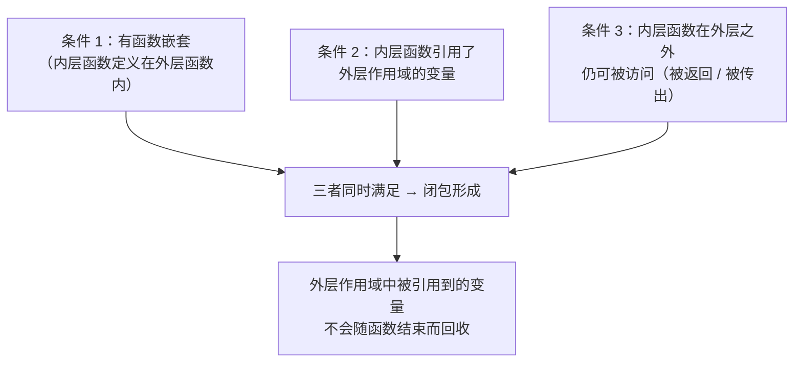
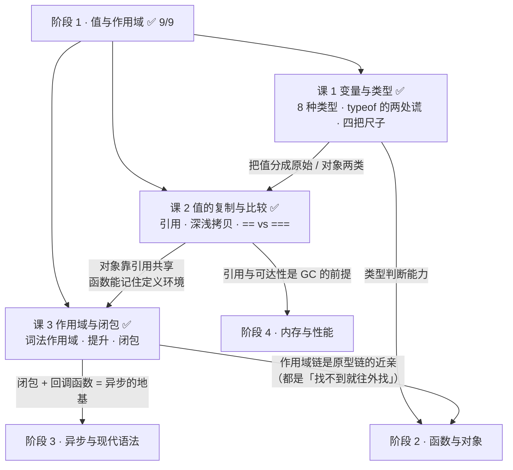
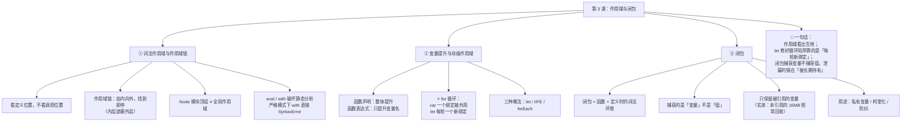

# 第 3 课：作用域与闭包

> 所属阶段：阶段 1《值与作用域》｜ 水平：入门 ｜ 本课知识点：词法作用域与作用域链、变量提升与块级作用域、闭包
> 故事情节：主角终于要正面回答课 1 开头那个 `3 3 3`——根因不在 `var`，而在**作用域是"定义时"就定好的**，而回调很久之后才执行
> ✅ 状态：已完成（2026-08-31）｜ 实操环境：Node.js v22.14.0（文中所有输出均为本机实测）
> 🎉 **本课是阶段 1 的收官课**——学完它，课 1 开头的 `3 3 3` 就彻底结案了

## 🎯 本课目标

- 解释为什么作用域是"**定义时**确定"而非"调用时确定"，并能画出作用域链的查找过程
- 说清函数声明与函数表达式在提升上的差异，以及**为什么 `for` 循环里 `let` 每次迭代都是新绑定**
- 手写一个不被循环陷阱坑到的闭包，并说清闭包与内存的真实关系（不是"闭包必然泄漏"）

## 📌 知识点导航

| # | 知识点 | 状态 |
|---|--------|------|
| 1 | 词法作用域与作用域链 | ✅ |
| 2 | 变量提升与块级作用域 | ✅ |
| 3 | 闭包 | ✅ |

---

## 第一幕：起源与场景引入

> 🏛️ **起源**：闭包不是 JS 发明的，它来自 **Scheme**——1975 年由 Guy L. Steele 与 Gerald Jay Sussman 在 MIT 创造的 Lisp 方言，而且是**第一个采用词法作用域的 Lisp 方言**（这一条很关键：它正是本课主题的源头）。（核查于 2026-08，来源：维基百科 Scheme 词条）
>
> 而 JS 与 Scheme 的渊源比大多数人想的还深：1995 年网景招来 Brendan Eich，**最初的任务就是在浏览器里嵌入 Scheme 语言**；虽然后来管理层要求"语法要像 Java"，Scheme 的两大核心特性——**函数是一等公民**和**词法闭包**——还是留在了 JS 里。（核查于 2026-08，来源：维基百科 JavaScript 词条「Creation at Netscape」，该事实在课 1 已核实）
>
> 所以你今天写的每一个闭包，都是一条从 1975 年一路流到现在的"活化石"。

好，回到那个从课 1 就悬着的问题。

> 🎬 **场景**：这次不是抽象的 `for` 循环，而是一个你八成真写过的需求——给五个按钮各绑一个点击事件。

```js
const buttons = document.querySelectorAll('.btn');   // 页面上有 5 个按钮
for (var i = 1; i <= buttons.length; i++) {
  buttons[i - 1].onclick = function () {
    console.log('你点了第 ' + i + ' 个按钮');
  };
}
```

你挨个点了五个按钮，控制台输出：

```
你点了第 6 个按钮
你点了第 6 个按钮
你点了第 6 个按钮
你点了第 6 个按钮
你点了第 6 个按钮
```

**五个按钮，全都说自己是第 6 个。** 而且第 6 个按钮根本不存在！

你上网一搜，答案全是同一句：**"把 `var` 换成 `let` 就好了"**。你照做——真的好了。

然后你陷入沉默：**凭什么？**

---

## 第二幕：认知冲突

> ❓ **问题**：`let` 只是个"声明变量"的关键字，它凭什么能影响**很久之后**才执行的回调？

三个困惑一个比一个深：

1. **"换成 `let` 就好了"到底是在修什么？** 如果只是"块级作用域更小"，那把 `var i` 改成 `let i` 放在同一个 `for` 里，作用域不还是那一块吗？为什么行为就变了？
2. **外层函数都执行完了，里面的变量按理说"没了"，闭包凭什么还能读到？** 它到底存在哪里？
3. **大家都说闭包会导致内存泄漏**——那闭包到底是"变量该回收没回收"，还是"我自己的写法有问题"？

| 困惑 | 答案藏在 |
|------|---------|
| 换成 `let` 到底改了什么 | **知识点 2**：关键不是"作用域更小"，而是**循环变量被创建了多少次** |
| 函数执行完了变量为什么还在 | **知识点 1 + 3**：词法作用域定义时就锁定 + 闭包持有的是"变量"不是"值" |
| 闭包是不是必然泄漏 | **知识点 3**：闭包只保留它**真正引用到**的变量（本课有实测证据） |

---

## 第三幕：层层揭示

### 知识点 1：词法作用域与作用域链

> 本知识点关键点：作用域在**定义时**确定 / 作用域链的查找规则（由内向外，找到即停）/ 全局作用域与全局对象 / `eval` 与 `with` 为何被禁用

#### 一句话定义

JS 采用**词法作用域（Lexical Scope，也叫静态作用域）**：一个函数能看见哪些变量，在它**被写下来的那一刻**就永久确定了，跟它后来在哪里被调用毫无关系。查找变量时沿着**作用域链**由内向外，找到即停。

#### 直觉建立（类比）

把函数想象成一个人，**出生时会背上一个背包，里面装着它出生地能看见的所有变量**。

- 这个人后来可以被带到任何地方工作（在任何地方被调用），**但背包永远跟着他**。
- 他在北京出生，背包里装的就是北京的东西；把他派到上海工作十年，他背包里仍然是北京那些东西——**出生地决定背包内容，工作地不决定**。

```js
const name = '全局的 name';

function outer() {
  const name = 'outer 的 name';
  return inner;              // 返回 inner，但 inner 出生在全局
}
function inner() {           // ← inner 出生在这里（全局）
  return name;
}

outer()();   // '全局的 name'  ← 在 outer 里调用也没用，看的是「出生地」
```

这个反直觉的结果，正是"词法作用域"最直接的证据。

> 💡 **类比的边界**：两处要修正——
> ① 背包装的不是"变量的副本"，而是**对同一个变量的引用**（回扣课 2 的"钥匙"）。所以外部改了变量，闭包里看到的也会变——下面 KP3 会验证这一点。
> ② 背包**不是什么都装**：现代引擎会做变量级分析，只把**闭包真正引用到的**变量放进背包，没用到的照常回收。本课后面有实测证据。

#### 核心原理

**作用域链的查找规则：由内向外，找到即停**



```js
const x = '全局 x';
function f1() {
  const x = 'f1 的 x';
  function f2() { const x = 'f2 的 x'; console.log(x); }   // 'f2 的 x'
  function f3() { console.log(x); }                         // 'f1 的 x' ← 自己没有，向外找
  f2(); f3();
}
f1();
```

**注意"找到即停"**：`f3` 沿着链往上，在 `f1` 就找到了 `x`，**不会再往上找到全局**。这条规则叫**变量遮蔽（shadowing）**——内层同名变量"遮住"了外层的。

**全局作用域与全局对象**

全局作用域是最外层。在**浏览器**里，全局作用域里的 `var` 和函数会挂到 `window` 上；但：

```js
var g = 1;
console.log('g' in globalThis);   // false  ← Node.js CommonJS 模块下！
```

⚠️ 这是初学者常被绕的地方：**Node.js 的 CommonJS 模块顶层不是全局作用域**（每个 `.js` 文件被包在一个模块函数里）。所以在 Node 里 `var g = 1` 只是"模块级"变量，不会挂到 `globalThis`。在浏览器里则**会**挂到 `window`。
（`globalThis` 是 ES2020 引入的统一写法，在浏览器 === `window`，在 Node === `global`——本课实测 `globalThis === global` 为 `true`。）

**`eval` 与 `with` 为什么被禁用？**

它们能让作用域**在运行期被改动**，直接破坏"定义时确定"这条根基：

```js
// eval 能改写外层的 let 变量（实测）
(function () {
  let leaked = '不该被改';
  eval('leaked = "被 eval 改了"');
  console.log(leaked);        // '被 eval 改了'  ← 运行期偷偷改了词法环境
})();

// with 让一个对象的属性临时"变成"变量（实测）
(function () {
  const obj = { a: 1 };
  with (obj) { console.log(a); }   // 1 ← a 不来自任何词法作用域，来自 obj
})();
```

后果有两个：

1. **引擎无法静态分析** → 所有优化（内联、逃逸分析）全部失效，性能断崖式下跌
2. **代码不可读** → 看到 `a`，你不知道它来自哪个作用域

所以：**严格模式下 `with` 直接是 `SyntaxError`（实测）**；`eval` 虽然还在，但 ESLint 默认报错，MDN 和所有规范都建议不要用。
（补充实测：严格模式下 `eval` 里的 `var` 不会泄漏到外层——`typeof evStrict` 为 `'undefined'`，而非严格模式下是 `'number'`。）

#### 示例演示

```js
// ① 定义时确定，不是调用时
const name = '全局的 name';
function outer() { const name = 'outer 的 name'; return inner; }
function inner() { return name; }
outer()();        // '全局的 name'  ← 在 outer 里调用也没用

function outer2() {
  const name2 = 'outer2 的 name';
  function inner2() { return name2; }   // 定义在 outer2 内部 → 看见 outer2 的
  return inner2;
}
outer2()();       // 'outer2 的 name'

// ② 作用域链：由内向外，找到即停
const x = '全局 x';
function f1() {
  const x = 'f1 的 x';
  function f2() { const x = 'f2 的 x'; console.log(x); }  // 'f2 的 x'
  function f3() { console.log(x); }                        // 'f1 的 x'
  f2(); f3();
}
f1();

// ③ Node 模块顶层不是全局作用域
var g = 1;
console.log('g' in globalThis);   // false
console.log(globalThis === global);  // true
```

#### 常见误区

1. **"函数在哪调用，就看哪的作用域"**：这是**动态作用域**（Perl、Bash 的部分场景），JS 不是。JS 是词法作用域——**看出生地，不看工作地**。上面 `outer()()` 的实测结果就是这个误区的最佳解药。

2. **"作用域链会一直找到全局"**：不，是**找到即停**。内层有同名变量就会遮蔽外层，链就不会再往上走了。

3. **"Node 里 `var x` 会挂到全局对象上"**：不会。CommonJS 模块的顶层是模块作用域，不是全局作用域。浏览器里才会挂到 `window`。

#### 一句话记住

> **JS 是词法作用域：函数能看见谁，在它被写下来的那一刻就定了；查找变量沿作用域链由内向外，找到即停（内层会遮蔽外层）。**

> ✅ **困惑 2 的前半已解**：作用域是"**定义时锁定**"的——函数记住的是它出生时那片环境，跟它后来被带到哪里调用毫无关系。所以外层函数执行结束后，只要还有人（闭包）能到达那片环境，里面的变量就还在。

#### 官方文档

- [闭包 - MDN](https://developer.mozilla.org/zh-CN/docs/Web/JavaScript/Guide/Closures)
- [globalThis - MDN](https://developer.mozilla.org/zh-CN/docs/Web/JavaScript/Reference/Global_Objects/globalThis)
- [严格模式 - MDN](https://developer.mozilla.org/zh-CN/docs/Web/JavaScript/Reference/Strict_mode)

---

### 知识点 2：变量提升与块级作用域

> 本知识点关键点：编译阶段的声明提升 / 函数声明 vs 函数表达式的提升差异 / 循环中 `let` 与 `var` 的经典对比（**回扣第一幕的 `3 3 3`**）

#### 一句话定义

JS 引擎执行前有个**编译阶段**，会先扫描并建立所有声明的绑定（这就是"提升"）；`var` 的绑定在此时就被初始化为 `undefined`，`let`/`const` 则保持未初始化（TDZ）。**在 `for` 循环中，`let` 会在每一次迭代创建一份新的绑定**——这才是 `3 3 3` 与 `0 1 2` 的分水岭。

#### 直觉建立（类比）

把 `for` 循环想成一条**流水线**：

- **`var` 版**：整条流水线共用**一个工位牌**，上面写着 `i`。流水线跑完时，牌子上停在第 6 个数字。三个回调都盯着这**同一块牌子** → 都读到 6。
- **`let` 版**：每跑一轮，**换一块新牌子**。第 1 轮的回调盯着牌子①，第 2 轮盯着牌子②……各有各的，互不干扰。


> 💡 **类比的边界**：严格说 `let` 不是"每轮都新建一个全新变量"，规范描述是——每轮迭代开始时会**复制**上一轮那个绑定的值，创建一个**新的词法绑定**（per-iteration binding）。表现上等价于"每轮一个新变量"，但理解成"复制 + 新建"更准确。这也是为什么在循环体里修改 `i`，会影响到下一轮——因为下一轮是从这一轮复制过去的。

#### 核心原理

**① 提升：函数声明 vs 函数表达式**

课 1 讲了 `var`/`let`/`const` 的提升差异，这里补上函数这块：

```js
// ✅ 函数声明：整个函数（名字 + 函数体）都被提升
declFn();                 // '整个函数都被提升了'  ← 能调用
function declFn() { return '整个函数都被提升了'; }

// ❌ 函数表达式：只有变量名被提升，值还没赋值
typeof exprFn;            // 'undefined'
exprFn();                 // TypeError: exprFn is not a function
var exprFn = function () { return 'x'; };
```

**一句话**：**函数声明整体提升，函数表达式只提升那个 `var` 变量。**

**② `for` 循环的真相：每次迭代的新绑定**

这是本课的题眼。`var` 和 `let` 在 `for` 里的差别，**不是"块级作用域更小"**，而是——

- `var i`：整个循环**只有一个** `i` 绑定，所有迭代共用它
- `let i`：每一轮迭代都会**创建一个新的 `i` 绑定**，并把上一轮的值复制过来

```js
// var 版：三个回调捕获的是「同一个 i」
const out1 = [];
for (var i = 0; i < 3; i++) { out1.push(() => i); }
out1.map(f => f());      // [3, 3, 3]   ← 循环结束时 i === 3

// let 版：三个回调各捕获「自己那一轮的 i」
const out2 = [];
for (let i = 0; i < 3; i++) { out2.push(() => i); }
out2.map(f => f());      // [0, 1, 2]   ✅
```

**回到五个按钮**：`var` 版里五个回调全部盯着同一个 `i`，循环结束时 `i` 已经跑到 `6`（`i <= 5` 的最后一轮后 `i++` 变成 6）→ 全都输出"第 6 个"。`let` 版里每个回调抓住自己那一轮的 `i` → 正确输出 1 到 5。

> 🎯 **这就是课 1 开头 `3 3 3` 的完整答案**：
> 1. `setTimeout` 的回调要等同步代码跑完才执行（**课 7 会讲为什么**）
> 2. 回调执行时去读 `i`——**读的是它被定义时捕获的那个绑定**
> 3. `var` 版只有一个共享的 `i`，此时已经是 `3` → 输出 `3 3 3`
> 4. `let` 版每轮一个 `i`，各自还是 `0 1 2` → 输出 `0 1 2`

#### 示例演示

```js
// ① 函数声明 vs 函数表达式的提升
(function () {
  console.log(declFn());        // '整个函数都被提升了'
  function declFn() { return '整个函数都被提升了'; }
})();
(function () {
  console.log(typeof exprFn);   // undefined
  try { exprFn(); } catch (e) { console.log(e.constructor.name + ': ' + e.message); }
  var exprFn = function () { return 'x'; };
})();
// TypeError: exprFn is not a function

// ② 循环里 var vs let（五种写法的实测结果）
for (var i = 0; i < 3; i++) { fns.push(() => i); }        // 3 3 3
for (let i = 0; i < 3; i++) { fns.push(() => i); }        // 0 1 2
// IIFE 版（ES6 之前的标准解法）：
for (var i = 0; i < 3; i++) {
  (function (j) { fns.push(() => j); })(i);               // 0 1 2
}
// forEach 版（用函数参数天然形成新作用域）：
[0, 1, 2].forEach(function (i) { fns.push(() => i); });   // 0 1 2
```

```js
// ③ 证明「下一轮是从上一轮复制过去的」：在循环体内改 let i
for (let i = 0; i < 30; i++) {
  console.log('本轮进入时 i =', i);
  i += 10;                     // 改的是「本轮」这个绑定
}
// 实测输出：
// 本轮进入时 i = 0
// 本轮进入时 i = 11   ← 上一轮末尾 i = 10，+1 后复制过来
// 本轮进入时 i = 22   ← 上一轮末尾 i = 21，+1 后复制过来
```

> 这个结果证实了前面类比的"边界"：每轮是**新的绑定**，但它的初始值是从**上一轮末尾的值**复制来的（再 +1）。所以 `let` 不是"每轮一个完全无关的新变量"，而是"每轮复制 + 新建"。

#### 常见误区

1. **"`let` 修好它是因为块级作用域更小"**：**这是流传最广的误解**。如果只是"作用域更小"，`var i` 改成 `let i` 放在同一个 `for` 里，作用域范围并没变。真正的原因是**每轮迭代创建新绑定**。这个区别很重要——它决定了你能否解释清楚"为什么 `var` 换成 `let` 就够了"。

2. **"函数表达式不提升"**：不准确。变量**声明**提升了（所以 `typeof exprFn` 是 `'undefined'` 而不是报错），只是**赋值**没提升。准确说法是"只提升了变量名，没提升值"。

3. **"在循环里改 `let i` 不会影响下一轮"**：会。因为下一轮的绑定是**从这一轮复制**过去的。想完全隔离就在循环体里再 `const` 一个局部变量。

#### 一句话记住

> **`var` 在循环里只有一个绑定被所有迭代共用，`let` 每轮迭代都新建一个绑定并把上一轮的值复制过来——这才是 `3 3 3` 和 `0 1 2` 的分水岭。**

> ✅ **困惑 1 已解**：换成 `let` 改的**不是"作用域大小"**，而是**循环变量被创建了多少次**。每轮一个新绑定，五个回调各自抓住自己那一轮的 `i`——所以"第 6 个按钮"变成了正确的 1 到 5。

#### 官方文档

- [let - MDN（含循环中的 per-iteration binding 说明）](https://developer.mozilla.org/zh-CN/docs/Web/JavaScript/Reference/Statements/let)
- [函数 - MDN](https://developer.mozilla.org/zh-CN/docs/Web/JavaScript/Guide/Functions)

---

### 知识点 3：闭包

> 本知识点关键点：闭包的形成条件与本质（函数 + 其定义时的词法环境）/ 闭包与内存：为什么不会被回收 / 循环中的闭包陷阱与三种解法 / 闭包的实际用途（私有变量、柯里化、防抖）

#### 一句话定义

**闭包 = 函数 + 它定义时所处的词法环境**。当一个内层函数引用了外层作用域的变量，并且这个内层函数在外层函数执行结束后**仍然可以被访问**，JS 就会把那些被引用的变量保留下来——这个"函数 + 保留下来的环境"的组合，就叫闭包。

#### 直觉建立（类比）

承接 KP1 的"背包"比喻，现在回答那个关键问题：**为什么人走了，背包还在？**

因为**背包是被"租赁"的，不是被"拥有"的**。只要还有人（闭包）在用背包里的东西，仓库（内存）就不能把它清掉。

```js
function createCounter() {
  let n = 0;                       // ← 这个 n 本该在函数结束后消失
  return function () { return ++n; };  // ← 但它被返回的函数引用着
}
const inc = createCounter();
inc(); inc();                      // 函数早就"结束"了，n 却还活着
```

更准确的比喻是**租房押金**：函数执行完 = 你退租了。正常情况下房东（GC）会清房间。但如果你把钥匙（闭包）给了朋友，朋友还时不时来拿东西，那房东就不能清——**只要还有人能进这个房间，房间就得留着**。

> 💡 **类比的边界**：GC 不是"看有没有人在用这个房间"，而是"看这个房间还**能不能被到达**"（可达性）。而且现代引擎足够聪明——它只保留闭包**真正引用到**的那个变量，其余的照常回收。注意这一点，因为它是"闭包必然导致内存泄漏"这个说法的错误所在。

#### 核心原理

**① 闭包形成的三个条件**（三个同时满足才算）：



**② 闭包捕获的是"变量"不是"值"**

这一点极其重要，也是 `var` 版陷阱的深层原因：

```js
let counter = 0;
const inc = () => ++counter;
inc(); inc();
console.log(counter);   // 2  ← 闭包读写的是「同一个变量」，不是它的快照
```

所以 `for (var i...)` 里，三个回调捕获的是**同一个变量 `i`**，不是 `i` 在当时那一刻的值。等它们执行时，`i` 已经变成 `3` 了——**它们读的是变量的当前值，不是捕获时的值**。

**③ 闭包与内存：实测证据（本课最硬的一块）**

"闭包会导致内存泄漏"这句话**只对一半**。现代引擎只保留闭包**真正引用到**的变量。实测如下（`node --expose-gc`，Node v22.14.0）：

| 场景 | GC 后 `heapUsed` | 结论 |
|------|-----------------|------|
| 基线（还没造大数组） | **4.6 MB** | — |
| A：闭包**不引用**那个 16MB 大数组 | **4.2 MB** | ✅ 大数组被回收了 |
| B：闭包**引用**那个 16MB 大数组 | **19.4 MB** | ⚠️ 被闭包引用，保留下来了 |
| 丢弃 B 的闭包后再 GC | **4.2 MB** | ✅ 引用一断就回收了 |

```js
// A：闭包只捕获 tiny，没碰 huge
let closureA;
(function () {
  const huge = new Array(2_000_000).fill('x');   // 约 16 MB
  const tiny = 42;
  closureA = () => tiny;                          // 只引用了 tiny
})();
global.gc();   // → heapUsed 4.2 MB，huge 被回收了

// B：闭包捕获了 huge
let closureB;
(function () {
  const huge = new Array(2_000_000).fill('x');
  closureB = () => huge.length;                   // 引用了 huge
})();
global.gc();   // → heapUsed 19.4 MB，huge 被留下了
```

**结论**：闭包不是"把整个外层作用域都冻在内存里"，它只留住**你真正提到的那几个变量**。

> 📌 那么真正的内存泄漏从哪来？来自**闭包本身被长期持有**——比如把闭包挂在一个全局对象上、挂在 DOM 事件监听里却从不移除、放进一个永不清理的缓存 Map。那时闭包连同它引用的变量一起，谁也回收不掉。（这是**课 12** 的主场，届时会有完整的四种泄漏模式与排查方法。）

**④ 循环中的闭包陷阱与三种解法**

| 解法 | 写法 | 适用 |
|------|------|------|
| **① `let`（首选）** | `for (let i = 0; ...)` | ES6+ 项目，**默认选这个** |
| **② IIFE（老项目）** | `(function (j) { ... })(i)` | 无法用 `let` 的老代码（ES5 时代的标准解法） |
| **③ `forEach` / 参数传递** | `[0,1,2].forEach(i => ...)` | 本来就在遍历数组时 |

```js
// ① let：每轮新绑定
for (let i = 0; i < 3; i++) { fns.push(() => i); }              // 0 1 2
// ② IIFE：用函数参数"接住"当轮的值，形成新的作用域
for (var i = 0; i < 3; i++) { (function (j) { fns.push(() => j); })(i); }  // 0 1 2
// ③ forEach：回调的参数天然是每轮独立的
[0, 1, 2].forEach(function (i) { fns.push(() => i); });          // 0 1 2
```

**⑤ 闭包的三个实际用途**

**用途一：私有变量**（JS 里最接近"私有字段"的原生方案）

```js
function createCounter() {
  let n = 0;                              // 外部完全访问不到
  return {
    inc: () => ++n,
    get: () => n,
  };
}
const c = createCounter();
c.inc(); c.inc();
c.get();    // 2
c.n;        // undefined  ← 拿不到，只能通过 inc/get 操作
```

**用途二：柯里化（Currying）**——把多参数函数变成"一步步传参"

```js
const add = (a) => (b) => a + b;
const add10 = add(10);
add10(5);      // 15
add(1)(2);     // 3
```

**用途三：防抖（Debounce）**——搜索框输入停止后才发请求

```js
function debounce(fn, delay) {
  let timer = null;                       // ← 被闭包持有，每次调用都能访问到同一个 timer
  return function (...args) {
    clearTimeout(timer);                  // 取消上一次的定时器
    timer = setTimeout(() => fn.apply(this, args), delay);
  };
}

const debounced = debounce(() => callCount++, 50);
debounced(); debounced(); debounced();
// 50ms 后 callCount === 1  ← 连调 3 次只执行 1 次
```

如果没有闭包，`timer` 就没地方放——放全局变量会污染作用域，而且多个防抖函数会互相干扰。**闭包让"状态跟着函数走"**，这是它最核心的工程价值。

#### 示例演示

```js
// ① 闭包捕获的是变量不是值
let counter = 0;
const inc = () => ++counter;
inc(); inc();
console.log(counter);       // 2

// ② 私有变量
function createCounter() { let n = 0; return { inc: () => ++n, get: () => n }; }
const c = createCounter(); c.inc(); c.inc();
console.log(c.get(), c.n);  // 2 undefined

// ③ 柯里化
const add = (a) => (b) => a + b;
console.log(add(10)(5), add(1)(2));   // 15 3

// ④ 防抖：连调 3 次只执行 1 次（实测 callCount === 1）
```

#### 常见误区

1. **"闭包必然导致内存泄漏"**：不对。实测证明闭包只保留**被引用到**的变量；真正的泄漏来自"闭包本身被长期持有且从不释放"（挂在全局、监听器不移除、缓存不清理）。闭包是**工具**，不是**原罪**。

2. **"闭包捕获的是变量当时的值"**：不对，捕获的是**变量本身**（引用）。所以外部后续改了，闭包里看到的也变——`var` 版陷阱正是这么来的。想要"当时的值"，就得靠 `let` 的每轮新绑定或 IIFE 的参数。

3. **"只有 `return` 一个函数才算闭包"**：不对。把内层函数赋给全局变量、传进 `setTimeout`、作为事件回调——**只要内层函数在外层之外仍可被访问**，就形成闭包。第一幕那五个按钮的回调就是闭包，虽然它们是被赋值出去的。

4. **"函数执行完，里面的变量立刻消失"**：不一定。只要还有闭包引用着，被引用的那些就还在——这正是闭包能工作的原因。

#### 一句话记住

> **闭包 = 函数 + 它定义时的词法环境；它捕获的是"变量"不是"值"，只保留真正引用到的那些；泄漏的锅不在闭包，而在"闭包被长期持有却从不释放"。**

> ✅ **困惑 2、3 已解**：闭包捕获的是**变量本身**而不是值，所以外层函数结束后它依然"可达"，不会消失（这是闭包能工作的原因）。同时内存实测证明它**只保留被引用的变量**（未引用的 16MB 照常被回收，4.2MB vs 19.4MB）——所以"闭包必然泄漏"是错的，真正的泄漏来自闭包本身被长期持有却从不释放。

#### 官方文档

- [闭包 - MDN](https://developer.mozilla.org/zh-CN/docs/Web/JavaScript/Guide/Closures)
- [函数柯里化 - MDN 术语](https://developer.mozilla.org/zh-CN/docs/Glossary/Currying)

---

## 第四幕：实操验证

把下面代码存成 `l3-demo.js`，用 `node l3-demo.js` 运行：

```js
// l3-demo.js —— 回扣第一幕：五个按钮的 bug，以及为什么 let 能修好它

console.log('=== 1. 词法作用域：看「定义位置」，不看「调用位置」 ===');
const name = '全局的 name';
function outer() {
  const name = 'outer 的 name';
  return inner;                          // inner 定义在全局，所以返回它没用
}
function inner() { return name; }
console.log('outer()()   =', outer()(), '← 在 outer 里调用也没用');

function outer2() {
  const name2 = 'outer2 的 name';
  function inner2() { return name2; }    // 定义在 outer2 内部
  return inner2;
}
console.log('outer2()()  =', outer2()());

console.log('\n=== 2. 作用域链：由内向外，找到即停 ===');
const x = '全局 x';
function f1() {
  const x = 'f1 的 x';
  function f2() { const x = 'f2 的 x'; console.log('  f2 看到:', x); }
  function f3() { console.log('  f3 看到:', x, '（自己没有，向外找到 f1 的）'); }
  f2(); f3();
}
f1();

console.log('\n=== 3. 提升：函数声明 vs 函数表达式 ===');
(function () {
  console.log('  声明式，声明前调用 =>', declFn());
  function declFn() { return '整个函数都被提升了'; }
})();
(function () {
  console.log('  表达式，声明前 typeof =>', typeof exprFn);
  try { exprFn(); } catch (e) { console.log('  调用 =>', e.constructor.name + ': ' + e.message); }
  var exprFn = function () { return 'x'; };
})();

console.log('\n=== 4. 五个按钮的 bug 与三种解法 ===');
(function () {
  const btns = [];
  for (var i = 1; i <= 5; i++) { btns.push(() => '第 ' + i + ' 个按钮'); }
  console.log('  var 版  :', btns.map(f => f()).join(' / '));
})();
(function () {
  const btns = [];
  for (let i = 1; i <= 5; i++) { btns.push(() => '第 ' + i + ' 个按钮'); }
  console.log('  let 版  :', btns.map(f => f()).join(' / '));
})();
(function () {
  const btns = [];
  for (var i = 1; i <= 5; i++) {
    (function (n) { btns.push(() => '第 ' + n + ' 个按钮'); })(i);
  }
  console.log('  IIFE 版 :', btns.map(f => f()).join(' / '));
})();

console.log('\n=== 5. 闭包的三个实际用途 ===');
function createCounter() {
  let n = 0;                             // 外部访问不到
  return { inc: () => ++n, get: () => n };
}
const c = createCounter(); c.inc(); c.inc();
console.log('  私有变量: c.get() =', c.get(), '| 直接访问 c.n =', c.n);

const add = (a) => (b) => a + b;
console.log('  柯里化  : add(10)(5) =', add(10)(5));

let callCount = 0;
function debounce(fn, delay) {
  let timer = null;                      // 被闭包持有
  return function (...args) {
    clearTimeout(timer);
    timer = setTimeout(() => fn.apply(this, args), delay);
  };
}
const debounced = debounce(() => callCount++, 50);
debounced(); debounced(); debounced();
setTimeout(() => {
  console.log('  防抖    : 连调 3 次，50ms 后实际执行 =', callCount, '次（应为 1）');
}, 120);
```

**实测输出**：

```
=== 1. 词法作用域：看「定义位置」，不看「调用位置」 ===
outer()()   = 全局的 name ← 在 outer 里调用也没用
outer2()()  = outer2 的 name

=== 2. 作用域链：由内向外，找到即停 ===
  f2 看到: f2 的 x
  f3 看到: f1 的 x （自己没有，向外找到 f1 的）

=== 3. 提升：函数声明 vs 函数表达式 ===
  声明式，声明前调用 => 整个函数都被提升了
  表达式，声明前 typeof => undefined
  调用 => TypeError: exprFn is not a function

=== 4. 五个按钮的 bug 与三种解法 ===
  var 版  : 第 6 个按钮 / 第 6 个按钮 / 第 6 个按钮 / 第 6 个按钮 / 第 6 个按钮
  let 版  : 第 1 个按钮 / 第 2 个按钮 / 第 3 个按钮 / 第 4 个按钮 / 第 5 个按钮
  IIFE 版 : 第 1 个按钮 / 第 2 个按钮 / 第 3 个按钮 / 第 4 个按钮 / 第 5 个按钮

=== 5. 闭包的三个实际用途 ===
  私有变量: c.get() = 2 | 直接访问 c.n = undefined
  柯里化  : add(10)(5) = 15
  防抖    : 连调 3 次，50ms 后实际执行 = 1 次（应为 1）
```

> ✅ **回扣场景**：三个困惑全部解决——
>
> - **"换成 `let` 到底改了什么"**：不是"作用域更小"，而是**每轮迭代创建一个新的 `i` 绑定**。`var` 版五个回调共享同一个 `i`，循环结束时它是 `6`，于是全输出"第 6 个"；`let` 版每个回调抓住自己那一轮，输出 1–5。实测三种解法（`let` / IIFE / `forEach`）都能得到正确结果。
> - **"函数执行完变量为什么还在"**：因为闭包捕获的是**变量本身**，只要还有人能到达它，它就不会被回收——这就是闭包能工作的原因（实测 `createCounter` 里 `n` 累加到 2）。
> - **"闭包是不是必然泄漏"**：**不是**。内存实测显示，闭包未引用的 16MB 数组照常被回收（4.2MB），引用了的才保留（19.4MB），引用一断又回落到 4.2MB。泄漏的真正来源是"闭包本身被长期持有"。
>
> 🎯 **课 1 的 `3 3 3` 至此结案**：`setTimeout` 回调晚执行（课 7 讲清为什么）+ 回调读的是被捕获的绑定 + `var` 只有一个共享绑定值为 3 = `3 3 3`。换成 `let`，因为每轮一个新绑定，就成了 `0 1 2`。

---

## 第五幕：体系收束

> 🎉 **阶段 1《值与作用域》至此收官。**



**三课串起来，其实只讲了一件事：值存在哪里、谁能看见它、谁能留住它。**

| 课 | 回答的问题 | 一句话 |
|----|-----------|--------|
| 课 1 | 值有哪几种？怎么判断？ | JS 只有 8 种类型，`typeof` 在 null 和数组两处说谎 |
| 课 2 | 复制和传参时发生了什么？ | 赋值只是多配一把钥匙，柜子从没被复制过 |
| 课 3 | 变量什么时候消失？ | 定义时确定谁能看见；还有人能到达，就不会消失 |

**你现在会了什么**：

- 看到任意嵌套函数，能立刻画出作用域链并说出某个标识符最终解析到哪一层
- 面对"循环里的异步回调拿不到正确的值"，能给出三种解法并解释根因（而不是只记得"换成 let"）
- 能说清闭包的价值（私有变量 / 柯里化 / 防抖）与风险（不是必然泄漏，而是被长期持有）

**阶段 1 的"包袱 vs 取舍"总账**（这个体例从课 1 延续到课 3）：

| 现象 | 归属 |
|------|------|
| `typeof null === 'object'` | **历史包袱**（1995 年类型标签撞车，提案修复被拒） |
| `var` 的函数作用域 | **历史包袱**（1995 年的仓促决定，用 `let`/`const` 补上但删不掉） |
| `==` 的隐式转换 | **历史包袱**（为"让非程序员好上手"加的宽容规则） |
| 对象赋值共享引用 | **设计取舍**（若赋值即深拷贝，传大对象会有巨大开销） |
| 词法作用域 | **设计取舍**（牺牲"动态作用域的灵活"换取"可静态分析 + 可预测"，这笔交易极其划算） |
| 闭包的变量保留 | **设计取舍**（付出"内存不能立刻释放"的代价，换来私有状态与函数工厂） |

**这就是这门课想给你的东西**：JS 的诡异行为里，**没有一个是随机的**。逐个归类成"包袱"或"取舍"之后，你就从"记住一堆特例"变成了"能从设计动机推导出行为"——这才是"能预判 JS"的意思。

> 🔗 **下一步：阶段 2《函数与对象》**。阶段 1 打的是"值和作用域"的地基，阶段 2 要立起 JS 的两根支柱——**函数**（它是可以传递的值）和**对象**（它靠原型链串联）。第一课《函数是一等公民》会把"函数能当参数传、能当返回值"这条性质讲透，它是阶段 3 所有异步机制的前提。
>
> ⚠️ 提前预告：阶段 2 的**课 6《原型与类》是全程最难**，建议到时候分两次学。

---

## 🐞 常见误区（本课汇总）

1. **"函数在哪调用，就看哪的作用域"** → JS 是词法作用域，看**定义位置**不看调用位置。`outer()()` 返回全局 `name` 就是铁证。
2. **"作用域链会一路找到全局"** → 找到即停，内层同名变量会**遮蔽**外层。
3. **"Node 里 `var x` 会挂到全局对象上"** → 不会，CommonJS 模块顶层是模块作用域；浏览器里才会挂到 `window`。
4. **"`let` 修好循环陷阱是因为块级作用域更小"** → 真正原因是**每轮迭代创建新绑定**。
5. **"函数表达式不提升"** → 变量名提升了（值 `undefined`），只是赋值没提升。
6. **"闭包捕获的是当时的值"** → 捕获的是**变量本身**。`var` 版陷阱正源于此。
7. **"闭包必然导致内存泄漏"** → 实测证明闭包只保留**被引用到**的变量；泄漏来自闭包本身被长期持有。
8. **"只有 `return` 函数才算闭包"** → 传进 `setTimeout`、挂到事件回调、赋给外部变量，都形成闭包。

## 一图总结



## 课后小测

**Q1**：下面代码的输出是什么？

```js
const name = '全局';
function outer() {
  const name = 'outer';
  return inner;
}
function inner() { return name; }
console.log(outer()());
```

- A. `'outer'`
- B. `'全局'`
- C. `undefined`
- D. 抛 `ReferenceError`

<details><summary>答案与解析</summary>

**答案：B**。

`inner` **定义在全局**，所以它能看见的是全局的 `name = '全局'`。虽然它是在 `outer` 内部被返回的、看起来"在 outer 的上下文里"，但 JS 是**词法作用域**——看的是**定义位置**，不是调用位置。

这正是本课开篇那个反直觉实验。选 A 的同学，是把 JS 当成了动态作用域语言。

</details>

**Q2**：为什么 `for` 循环里把 `var` 换成 `let`，异步回调就能拿到正确的值？

- A. 因为 `let` 的块级作用域比 `var` 的函数作用域更小，所以变量不会泄漏出去
- B. 因为 `let` 会在**每一次迭代**创建一个新的绑定，每个回调捕获的是自己那一轮的绑定
- C. 因为 `let` 声明的变量不能被修改，所以回调读到的始终是初始值
- D. 因为 `let` 不存在变量提升，回调执行时才去读取它

<details><summary>答案与解析</summary>

**答案：B**。

- A 是流传最广的**误解**：`var i` 改成 `let i` 放在同一个 `for` 里，代码的作用域范围并没有"变小"，所以 A 解释不了行为为什么变。
- B 才是真相：`let` 在 `for` 循环里会为**每一轮迭代创建一个新的词法绑定**（并把上一轮的值复制过来），于是三个回调各抓住一个不同的 `i`。
- C 错：`let` 声明的变量**可以**被修改，`const` 才不能重新绑定。
- D 错：`let` 也有提升（只是进入 TDZ，不初始化），而且"什么时候读取"不是关键——关键是"读的是哪个绑定"。

</details>

**Q3**：关于闭包与内存，下面说法正确的是？

- A. 闭包会把外层函数的整个作用域都冻结在内存里，必然导致泄漏
- B. 闭包只保留它**真正引用到**的变量，未被引用的变量照常回收
- C. 只要用了闭包就一定会内存泄漏
- D. 闭包引用的变量在函数执行结束时立即被回收

<details><summary>答案与解析</summary>

**答案：B**。

本课的内存实测直接证明了这一点（`node --expose-gc`，Node v22.14.0）：

| 场景 | GC 后 heapUsed |
|------|---------------|
| 基线 | 4.6 MB |
| 闭包**未引用** 16MB 大数组 | **4.2 MB** ← 被回收了 |
| 闭包**引用** 16MB 大数组 | 19.4 MB ← 被保留 |
| 丢弃闭包后再 GC | **4.2 MB** ← 又回落 |

A、C 错在"必然"——闭包只留住被引用的变量。D 错得更明显：如果立即回收，闭包根本无法工作。

真正的泄漏来源是**闭包本身被长期持有**（挂在全局、监听器不移除、缓存不清理），详见课 12。

</details>

**Q4（进阶）**：下面这段代码输出什么？

```js
function createCounter() {
  let n = 0;
  return { inc: () => ++n, get: () => n };
}
const c = createCounter();
const inc = c.inc;
inc(); inc();
console.log(c.get(), c.n);
```

- A. `2 2`
- B. `2 undefined`
- C. `0 undefined`
- D. `2` 然后抛 `ReferenceError`

<details><summary>答案与解析</summary>

**答案：B**。

- `const inc = c.inc` 把 `inc` 方法**单独取出来**调用。因为它是箭头函数，`this` 不参与（箭头函数的 `this` 是词法的），而 `inc` 操作的是**闭包捕获的 `n`**，不是 `this.n`——所以照样能改到那个 `n`。
- `c.get()` 返回 `2`（被加了两次）。
- `c.n` 是 `undefined`，因为 `n` 是 `createCounter` 内部的局部变量，**外部完全访问不到**——这正是"私有变量"效果。

⚠️ 顺带一提：如果这里把箭头函数换成普通函数（`inc: function () { return ++this.n; }`），那么 `const inc = c.inc; inc()` 就会因为 `this` 丢失而失效——这就是**课 5《this 到底指向谁》**要解决的问题，到时候你会对它有更深的体感。

</details>

## 🎉 阶段 1 完成 · 接力提示词

> **阶段 1《值与作用域》3 课 9 个知识点已全部完成。**
> 复制下面这段文字发给 AI，即可无缝进入阶段 2（无需重新描述上下文）：

```
继续学 JavaScript 语言核心（ES6+）。我的学习档案在 frontend/javascript-core/00-学习档案.md，
刚学完阶段 1《值与作用域》全部 3 课（变量与类型 / 值的复制与比较 / 作用域与闭包）9 个知识点，
请按大纲继续讲解阶段 2《函数与对象》的课 4《函数是一等公民》。
```

> 💡 也可以先做阶段自测再进下一阶段：复制"考我一下 JavaScript，针对阶段 1 的 9 个知识点"。

## 🧭 课程导航

⬅️ **上一课**：[课 2：值的复制与比较](lesson-02-值的复制与比较.md)

➡️ **下一课**：[课 4：函数是一等公民](../../2-函数与对象/lessons/lesson-04-函数是一等公民.md)（跨阶段 · 阶段 2 开始）

📚 **返回目录**：[课程目录](../../02-课程目录.md) ｜ [阶段概览](../overview.md)
