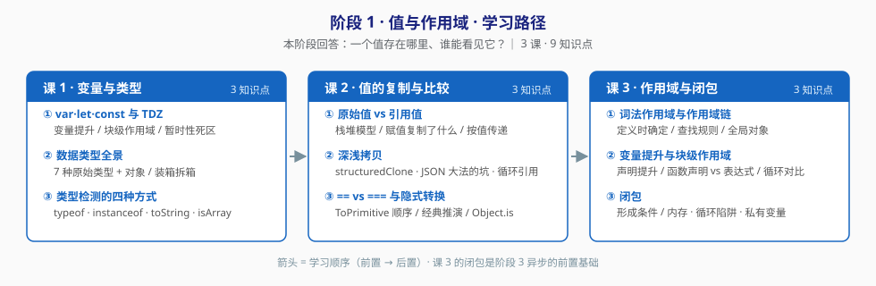

# 阶段 1：值与作用域

> 所属课程：JavaScript 语言核心（ES6+） ｜ 故事章节：**看清脚下的地** ｜ 上一阶段：无（起点）
> 返回：[学习路径总览](../01-学习路径总览.md) ｜ [课程目录](../02-课程目录.md)

## 🎯 本阶段目标

- 搞清楚"一个值存在哪里、谁能看见它"，从此不再被 `undefined`、意外共享、隐式转换这三件事困扰。
- 建立**原始值 vs 引用值**的心智模型，能一眼看穿"我改了 A，为什么 B 也跟着变了"。
- 理解闭包不是高级技巧，而是**词法作用域的必然产物**——这是阶段 3 学异步的前置基础。

## 📍 学习重点

| 重点 | 为什么重要 |
|------|-----------|
| `var` / `let` / `const` 的差异 | 不是三条要背的规则，而是**作用域 + 提升 + TDZ** 三条机制的组合结果。理解机制，规则自然就记住了 |
| 原始值 vs 引用值 | "改了 A 结果 B 也变了"的唯一根因。所有深浅拷贝问题都源出此处 |
| 隐式转换 | `==` 的行为不是随机的，背后是 `ToPrimitive` 的确定算法。能推演，就不用背 |
| 闭包 | 它是词法作用域的必然产物。搞懂它，阶段 3 的异步、阶段 4 的内存泄漏都会顺很多 |

## ✅ 必须掌握的知识点

| 知识点 | 所属课 | 学完应能 |
|--------|--------|----------|
| var·let·const 与 TDZ | 课 1 | 说清 `var` 与 `let` 在 `for` 循环里的行为差异，并解释为什么 |
| 数据类型全景 | 课 1 | 数出 7 种原始类型 + 对象；解释 `typeof null === 'object'` 这个历史 bug |
| 类型检测的四种方式 | 课 1 | 针对"判断数组""判断 null""判断 NaN"各选出正确工具并说明理由 |
| 原始值 vs 引用值 | 课 2 | 画出赋值时的栈堆示意，解释"函数参数按值传递"对对象意味着什么 |
| 深浅拷贝 | 课 2 | 写出安全的深拷贝，并说清 `JSON.parse(JSON.stringify())` 会丢什么 |
| == vs === 与隐式转换 | 课 2 | 一步步推演出 `[] == ![]` 的结果是 `true`，并指出 `Object.is` 与 `===` 的两处差异 |
| 词法作用域与作用域链 | 课 3 | 解释为什么作用域是"定义时确定"而非"调用时确定" |
| 变量提升与块级作用域 | 课 3 | 说清函数声明与函数表达式在提升上的差异，以及为什么会踩坑 |
| 闭包 | 课 3 | 手写一个不被循环陷阱坑到的闭包，并说清闭包与内存的关系 |

## 🗺️ 本阶段路径图

> 箭头 = 学习顺序（前置 → 后置）。课 3 的闭包是阶段 3 学异步的前置基础。

## 本阶段产出

- [x] `lessons/lesson-01-变量与类型.md`
- [x] `lessons/lesson-02-值的复制与比较.md`
- [x] `lessons/lesson-03-作用域与闭包.md`

> 实操环境：Node.js v22.14.0（Windows PowerShell）。所有示例以 `node xxx.js` 直接运行为准。
