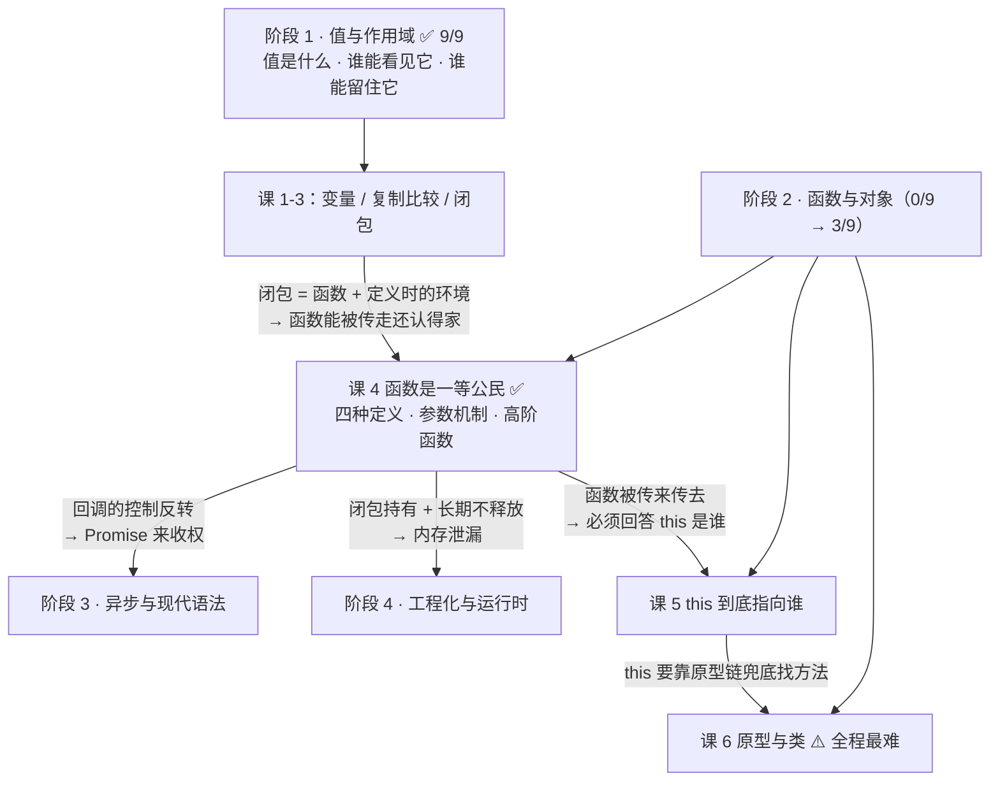
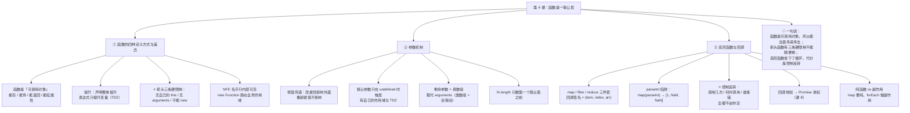

# 第 4 课：函数是一等公民

> 所属阶段：阶段 2《函数与对象》｜ 水平：入门 ｜ 本课知识点：函数的四种定义方式与差异、参数机制、高阶函数与回调
> 故事情节：主角发现"函数"不只是 `function foo(){}` 那么简单——它能被存进变量、当参数传、还能被返回。这条性质，撑起了后面所有的异步与回调
> ✅ 状态：已完成（2026-09-02）｜ 实操环境：Node.js v22.14.0（文中所有输出均为本机实测）
> 🏁 **本课是阶段 2 的第一课**——阶段 1 打的是"值与作用域"的地基，从这课开始立第一根支柱：**函数**

## 🎯 本课目标

- 说清函数声明 / 函数表达式 / 箭头函数 / `Function` 构造器在**提升**上的差异，以及箭头函数的三条限制
- 说清默认参数的 TDZ、剩余参数与 `arguments` 的取舍
- 用 `map` / `filter` / `reduce` 替代手写循环，并解释回调地狱的成因——**控制反转**

## 📌 知识点导航

| # | 知识点 | 状态 |
|---|--------|------|
| 1 | 函数的四种定义方式与差异 | ✅ |
| 2 | 参数机制 | ✅ |
| 3 | 高阶函数与回调 | ✅ |

---

## 第一幕：起源与场景引入

> 🏛️ **起源**："一等公民"这个说法不是 JS 的发明，更不是前端圈的黑话。
>
> 术语 **first-class citizen** 由英国计算机科学家 **Christopher Strachey** 在 **1960 年代中期**提出。他在著名的讲义《Fundamental Concepts in Programming Languages》（1967 年暑期学校讲义，2000 年才正式发表）里，拿当时如日中天的 **ALGOL** 做**反例**：ALGOL 的"过程（procedure）""总是得亲自出场，永远不能被一个变量或表达式代表"，所以它们是 **second class citizens**（二等公民）。（核查于 2026-09，来源：Wikipedia First-class function 词条，引 Strachey 1967 讲义；正式发表见 *Higher-Order and Symbolic Computation* 13:11–49, 2000）
>
> 而真正把一等函数**做对**的是 Lisp 家族：John McCarthy 1958 年造出 Lisp，但早期 Lisp 的函数是**动态作用域**的——函数被传走之后再调用，变量的解析规则会出问题（这就是著名的 **funarg problem**）。直到 1975 年的 **Scheme** 才把"词法作用域 + 一等函数 + 闭包"这套组合做对（课 3 已核实）。
>
> JS 从 Scheme 那里原样继承了这套组合（课 1、课 3 已核实）。**所以本课讲的东西，是一条从 1958 → 1975 → 1995 一路流到今天的技术血脉。**

好，回到你手上的代码。

> 🎬 **场景**：你要处理一批用户数据，需求有三个——筛出成年人、只要名字、算平均年龄。

你写了三段 `for` 循环，稳，而且能跑：

```js
const users = [
  { name: '小明', age: 17 },
  { name: '小红', age: 22 },
  { name: '小刚', age: 30 },
];

// 需求 1：筛出成年人
const adults = [];
for (let i = 0; i < users.length; i++) {
  if (users[i].age >= 18) adults.push(users[i]);
}
// 需求 2：只要名字
const names = [];
for (let i = 0; i < adults.length; i++) {
  names.push(adults[i].name);
}
// 需求 3：平均年龄
let sum = 0;
for (let i = 0; i < adults.length; i++) {
  sum += adults[i].age;
}
console.log(names, sum / adults.length);   // [ '小红', '小刚' ] 26
```

然后同事 review 时，把它改成了三行：

```js
const adults = users.filter(u => u.age >= 18);
const names  = adults.map(u => u.name);
const avg    = adults.reduce((s, u) => s + u.age, 0) / adults.length;
```

三段循环变成三行，下标、临时数组全没了。你想照着这个思路自己封装一个工具函数，把"按什么分组"也做成可变的——**卡住了**：

```js
function countBy(arr, keyFn) {
  // keyFn 到底是个什么东西？
  // 字符串？数字？……「按什么分组」这段操作，怎么当参数传进来？
}
```

你盯着 `filter(u => u.age >= 18)` 看了半天，心里冒出一个更根本的疑问。

---

## 第二幕：认知冲突

> ❓ **问题**：在我的认知里，**参数只能是数据**（数字、字符串、对象）。那 `filter(...)` 里传进去的那个箭头函数，到底是什么东西？

三个困惑，一个比一个深：

1. **函数凭什么能当参数传？** 它到底是什么"类型"的值？——可课 1 学的 **8 种类型里根本没有 function** 这一项啊。
2. **既然能传，那它什么时候被调用、被调用几次、拿到几个参数，谁说了算？** 我传进去的是我的函数，可它什么时候执行好像不是我定的——这正常吗？
3. **箭头函数和普通函数看起来差不多，那它们能随便互换吗？** 我把项目里的 `function () {}` 全改成 `() => {}`，为什么有几个地方直接崩了？

| 困惑 | 答案藏在 |
|------|---------|
| 函数凭什么能当参数传 | **知识点 1**：函数本身就是**一种值**（可调用对象），不是什么特殊语法 |
| 回调的执行时机谁说了算 | **知识点 3**：**控制反转**——你把执行权交出去了（并埋下阶段 3 的伏笔） |
| 箭头函数能不能随便互换 | **知识点 1**：它有**三条硬限制**；具体后果在**课 5** |

> 💡 顺带剧透：困惑 1 里"8 种类型里没有 function"这个观察**非常敏锐**——它指向 `typeof` 的第三处特殊情况，本课会正面回答。

---

## 第三幕：层层揭示

### 知识点 1：函数的四种定义方式与差异

> 本知识点关键点：函数声明 / 函数表达式 / 箭头函数 / `Function` 构造器 / 提升差异 / 箭头函数的三条限制（无自己的 `this`、无 `arguments`、不能 `new`）

#### 一句话定义

JS 里的函数是**对象（Object）的一种**——准确说是"**可调用对象**"（callable object）。它既能像函数一样被调用，又像普通对象一样有属性、能被赋值给变量、能当参数传、能当返回值。**"一等公民"这四个字，说的就是这一件事。**

#### 直觉建立（类比）

把函数想成一张**菜谱卡**：

- 菜谱**不是菜**——`fn` 是菜谱，`fn()` 才是照着做菜。
- 菜谱可以被**复印**（赋值给另一个变量）、**夹进别人的文件夹**（当参数传）、**印成新菜谱发出去**（当返回值）、**在背面贴便签**（挂属性）。
- 关键在于：**菜谱是一张纸，纸是实物，能被搬来搬去。**

而"函数不是一等公民"的语言（比如 C 语言里焊死在编译单元里的函数），相当于菜谱**钉死在厨房墙上**——你只能指着墙说"做这道菜"，没法把菜谱拿走交给别人。

> 💡 **类比的边界**：菜谱卡是"纸"，但它比普通的值多了三样东西，光靠"纸"这个比喻会漏掉：
> ① 卡的背面印着**它是在哪间厨房写出来的**（`[[Environment]]`，课 3 讲的闭包就是这个槽位）；
> ② 卡上写着**这道菜需要几个人配合**（`length`，形参个数）；
> ③ 有些卡还带一张**"可开生产线"的执照**（`prototype` + `[[Construct]]`），有执照才能 `new`——**箭头函数没有这张执照**。

#### 核心原理

**① 函数是对象：证据链（全部为 Node v22.14.0 实测）**

```js
function fn(a, b) {}

typeof fn;                                          // 'function'     ← 注意这里
fn instanceof Object;                               // true           ← 它是对象
Object.getPrototypeOf(fn) === Function.prototype;   // true
Object.prototype.toString.call(fn);                 // '[object Function]'

fn.name;    // 'fn'
fn.length;  // 2   ← 形参个数
fn.tag = '我能挂属性';   // 像普通对象一样挂属性，完全合法
```

⚠️ **这里要回扣课 1，也是困惑 1 的正解**：课 1 讲过"JS 只有 8 种类型"，里面**没有 function**。`typeof` 返回 `'function'` 是它对函数的**特殊照顾**——课 1 讲过它在 `null` 和数组上说的**两处谎**，这是第三处需要单独记住的情况：**规范里 function 属于 Object 类型下的"可调用对象"，`typeof` 只是额外给了它一个标签**。

**函数的内部结构**（本课第一张图，把上面三样东西一次画全）：


**② 四种定义方式与提升差异**

| 定义方式 | 写法 | 提升行为 | `.name` | 有 `prototype`（能 `new`） |
|----------|------|----------|---------|--------------------------|
| **函数声明** | `function f(){}` | **整体提升**（声明前就能调用） | `'f'` | ✅ |
| **函数表达式** | `const f = function(){}` | 只提升变量（`let/const` 还要进 TDZ） | `'f'`（自动推断） | ✅ |
| **具名函数表达式** | `const f = function me(){}` | 同上 | `'me'`（取本名） | ✅ |
| **箭头函数** | `const f = () => {}` | 同表达式 | `'f'` | ❌ |
| **`Function` 构造器** | `new Function('a','return a')` | 无提升（运行时才生成） | `'anonymous'` | ✅ |

三种提升行为的实测：

```js
typeof hoistedDecl;   // 'function'
                      // ← 函数声明：整个函数（名字 + 函数体）都被提升，可以直接调用

typeof varExpr;       // 'undefined'
                      // ← var 版表达式：只提升了那个变量，值还没赋上

hoistedArrow();       // ReferenceError: Cannot access 'hoistedArrow' before initialization
                      // ← let/const 版：变量在 TDZ 里（回扣课 1）

function hoistedDecl() { return 'ok'; }
var varExpr = function () {};
const hoistedArrow = () => {};
```

> **一句话**：**函数声明整体提升；函数表达式只提升那个变量（`let`/`const` 版还要进 TDZ）。**（回扣课 3 知识点 2）

**③ 箭头函数的三条硬限制**（困惑 3 的直接答案）

| 限制 | 意味着什么 | 实测结果 |
|------|-----------|----------|
| **① 没有自己的 `this`** | `this` 是**词法继承**外层的，`call` / `apply` / `bind` **改不动它** | `arrow.call(target) === module.exports` → `true`（`call` 无效） |
| **② 没有自己的 `arguments`** | 用到 `arguments` 时借的是**外层函数**的 | 外层只有 1 个实参，箭头读到的 `arguments.length` 就是 `1`，尽管它自己收到了 3 个 |
| **③ 不能 `new`** | 没有 `prototype`，也没有 `[[Construct]]` | `(() => {}).prototype` → `undefined`；`new A()` → `TypeError: A is not a constructor` |

限制 ② 的实测（这个例子最能说明"借的是外层的"）：

```js
function outer(a) {
  const arrow = () => arguments.length;   // 箭头自己没有 arguments → 借 outer 的
  return arrow(1, 2, 3);                  // 它自己其实收到了 3 个实参
}
outer('x');   // 1   ← 读到的是 outer 的实参个数（1 个），不是自己的（3 个）
```

> 🎯 因为限制 ①，箭头函数**不能用作需要 `this` 的对象方法、不能当构造函数**——这是**课 5《this 到底指向谁》**的主场。现在只需记住一句话：**箭头函数不是 `function` 的简写，它是有语义差异的另一种函数。**

**④ 两条容易漏的补充**

**具名函数表达式（NFE）**：那个名字**只在函数内部可见**，专门用来递归和让调用栈好看：

```js
const fact = function me(n) { return n <= 1 ? 1 : n * me(n - 1); };
fact(5);   // 120
me(1);     // ReferenceError: me is not defined   ← 外部看不见
```

> ⚠️ 注意这里要用 `me(1)` 而不是 `typeof me` 来验证：`typeof` 对**未声明的标识符**是安全的，会返回 `'undefined'` 而不报错（课 1 讲过这个特性）。要证明"外部看不见"，得真的去**调用**它。

**`Function` 构造器**：它创建的函数运行在**全局作用域**里，拿不到你的局部变量（和 `eval` 是同类，有安全与性能双重问题，**别用**）：

```js
const secret = '外层的 secret';
new Function('return typeof secret;')();   // 'undefined'   ← 拿不到
(() => typeof secret)();                   // 'string'      ← 普通闭包拿得到（课 3）
```

**⑤ 附赠一条：块里的函数声明**

```js
function strictBlock() { 'use strict'; { function inBlock() {} } return typeof inBlock; }
function sloppyBlock() { { function inBlock2() {} } return typeof inBlock2; }

strictBlock();   // 'undefined'   ← 严格模式：块级作用域，出了块就没了
sloppyBlock();   // 'function'    ← 非严格模式：ES6 为兼容老代码，把它提升到函数作用域
```

#### 示例演示

```js
// ① 函数是对象
function fn(a, b) {}
typeof fn;                    // 'function'
fn instanceof Object;         // true
fn.name;                      // 'fn'
fn.length;                    // 2
fn.tag = 'x';                 // 能挂属性

// ② 提升差异
typeof hoistedDecl;           // 'function'
typeof varExpr;               // 'undefined'
hoistedArrow();               // ReferenceError（TDZ）
function hoistedDecl() {}
var varExpr = function () {};
const hoistedArrow = () => {};

// ③ 箭头三条限制
(() => {}).prototype;                        // undefined
new (() => {})();                            // TypeError: ... is not a constructor
(function outer(a) { return (() => arguments.length)(1, 2, 3); })('x');   // 1

// ④ NFE
const fact = function me(n) { return n <= 1 ? 1 : n * me(n - 1); };
fact(5);                     // 120
```

#### 常见误区

1. **"箭头函数就是 `function` 的简写"** → 不是。`this` / `arguments` / `new` 三条都是**语义差异**，不是写法差异。混用会出真 bug。
2. **"`typeof x === 'function'` 说明 function 是独立类型"** → 它是 Object 下的**可调用对象**，`typeof` 只是给了它单独的标签（课 1 的 8 种类型里没有它）。
3. **"函数表达式完全不提升"** → 变量声明提升了（`var` 版是 `undefined`），只是赋值没提升；`let/const` 版是进 TDZ，访问抛 `ReferenceError`。
4. **"函数声明写在哪都一样"** → 写在**块**里不一样：严格模式下是块级作用域，非严格模式下会提升到函数/全局作用域（实测见 ⑤）。
5. **"NFE 里的名字在外面也能用"** → 不能，只在函数体内部可见（所以叫"具名函数表达式"而不是"具名变量"）。

#### 一句话记住

> **函数是"可调用对象"：能存、能传、能返回、能挂属性；函数声明整体提升而表达式只提升变量；箭头函数有三条硬限制——无自己的 `this`、无自己的 `arguments`、不能 `new`。**

> ✅ **困惑 1、3 已解**：函数不是"特殊语法"，它是**一种值**（Object 下的可调用对象），所以能被当参数传——`typeof` 给它单独的 `'function'` 标签只是"特殊照顾"。而它**不能**和箭头函数随便互换，因为箭头函数少了三样东西（`this` 的绑定方式、`arguments`、可 `new` 的能力）。

#### 官方文档

- [函数 - MDN](https://developer.mozilla.org/zh-CN/docs/Web/JavaScript/Guide/Functions)
- [箭头函数 - MDN](https://developer.mozilla.org/zh-CN/docs/Web/JavaScript/Reference/Functions/Arrow_functions)
- [Function - MDN](https://developer.mozilla.org/zh-CN/docs/Web/JavaScript/Reference/Global_Objects/Function)
- [一等函数 - MDN 术语表](https://developer.mozilla.org/zh-CN/docs/Glossary/First-class_Function)

---

### 知识点 2：参数机制

> 本知识点关键点：形参与实参的映射关系（非严格模式下的 arguments 联动）/ 默认参数与 TDZ / 剩余参数 vs `arguments`（为什么该用前者）/ 参数按值传递的再确认

#### 一句话定义

JS 的参数是**按值传递**的（回扣课 2）：形参拿到的是实参的"副本"——原始值复制值，对象复制引用。ES6 又加了**默认参数**（**只有 `undefined` 才触发**，且有自己的作用域与 TDZ）和**剩余参数 `...rest`**（**真数组**），这两者基本取代了老的 `arguments`。

#### 直觉建立（类比）

把一次函数调用想成**工位分配**：

- **形参**是工位上的**名牌**（`a`、`b`），**实参**是来上班的**人**。人来就挂上名牌，人没来名牌就空着（`undefined`）。
- **默认参数**是"这个工位没人来时的**替补**"——但规矩很怪：**只有工位真的空着（`undefined`）替补才上**；`null`、`0`、`''` 都算"有人来了"，替补不上。
- **剩余参数 `...rest`** 是"剩下的人**排队进休息室**"，休息室是个**真数组**（`map` / `filter` 随便用）。
- **`arguments`** 是老式的"**签到表**"：有 `length`、能用下标翻，但**不是数组**（没有 `map`）；更要命的是，它跟名牌之间**有时候会联动**——这正是它的坑。

> 💡 **类比的边界**：默认参数的"替补"不是写在函数体里的，而是在**参数自己的小作用域**里求值——这个小作用域夹在"外层作用域"和"函数体作用域"之间，**也有 TDZ**。所以默认参数能引用**前面**的参数，引用**后面**的会直接报错。

#### 核心原理

**① 参数按值传递的再确认（回扣课 2）**

这组对比是日常 bug 和面试的高频来源，实测：

```js
function reassign(o) { o = { n: 999 }; }   // 给形参「重新赋值」
function mutate(o)   { o.n = 999; }        // 改形参「指向的那个对象」

const o1 = { n: 1 }; reassign(o1); console.log(o1.n);   // 1    ← 没变
const o2 = { n: 1 }; mutate(o2);   console.log(o2.n);   // 999  ← 变了
```

原因正是课 2 那句"**赋值只是多配一把钥匙，柜子从没被复制过**"：

- `o = { n: 999 }` 是**把形参这把钥匙换成新的** → 外面的钥匙照旧指着老柜子，不受影响；
- `o.n = 999` 是**用钥匙打开柜子改里面的东西** → 两把钥匙开的是同一个柜子，外面看得到。

**② `arguments`：两个坑（类数组 + 联动）**

```js
function showArgs() {
  return { length: arguments.length, isArray: Array.isArray(arguments), typeofMap: typeof arguments.map };
}
showArgs(1, 2, 3);   // { length: 3, isArray: false, typeofMap: 'undefined' }
```

**坑一：它不是数组**，要用得先转：`Array.from(arguments)` 或 `[...arguments]`。

**坑二：它会跟形参联动**——但**只在"非严格模式 + 简单参数列表"时才联动**。四种情况实测：

| 情况 | 函数里 `a = 2` 之后，`arguments[0]` 是 | 结论 |
|------|--------------------------------------|------|
| 非严格 + 简单参数 `function (a)` | **2** ⚠️ 跟着变了 | **联动** |
| 严格模式（函数体里有 `'use strict'`） | 1 | 不联动 |
| 有默认参数 `function (a = 1)` | 1 | 不联动 |
| 有剩余参数 `function (a, ...rest)` | 1 | 不联动 |

**结论**：联动这条规则**只在最老式的写法下才成立**，而且它违反直觉（改了形参，签到表自己跟着变）。所以 ES6 之后的原则很干脆——**用剩余参数，别用 `arguments`**。

**③ 默认参数：只有 `undefined` 才触发**

```js
function d(a = '默认值') { return a; }
d(undefined);   // '默认值'   ✅ 触发
d(null);        // null       ❌ 不触发（有人来了，只是带了个 null）
d(0);           // 0          ❌ 不触发
d('');          // ''         ❌ 不触发
```

**默认参数有自己的作用域，也进 TDZ**：

```js
function td(a = b, b = 2) { return [a, b]; }
td();   // ReferenceError: Cannot access 'b' before initialization   ← 参数也有 TDZ

function ok(a = 1, b = a + 1) { return b; }
ok();   // 2   ← 可以引用「前面」的参数
```

**④ 剩余参数 `...rest`：真数组，用来取代 `arguments`**

```js
function r(first, ...rest) { return { first, rest, isArray: Array.isArray(rest) }; }
r(1, 2, 3);   // { first: 1, rest: [ 2, 3 ], isArray: true }
```

规则：只能放在**最后一个**；它是**真数组**（`map` / `filter` / `reduce` 随便用）；一旦用了它，`arguments` 就不再联动。

**⑤ `fn.length` 数的是"第一个默认值之前"的形参个数**

```js
(function (a, b) {}).length;       // 2
(function (a, b = 1) {}).length;   // 1   ← 从 b 开始有默认值，就不数了
(function (a = 1, b) {}).length;   // 0
(function (...rest) {}).length;    // 0
```

#### 示例演示

```js
// 一个真实感的函数签名，把默认参数 + 剩余参数一次用上
function connect(host, port = 80, ...others) {
  return { host, port, others };
}
connect('a.com');              // { host: 'a.com', port: 80,   others: [] }
connect('a.com', null);        // { host: 'a.com', port: null, others: [] }  ← null 不触发默认值
connect('a.com', 443, 1, 2);   // { host: 'a.com', port: 443, others: [ 1, 2 ] }
connect.length;                // 1   ← 只数第一个默认值之前的形参
```

#### 常见误区

1. **"传对象进去，在函数里改了外面就会变"** → 只在你**改属性**时成立；给形参**重新赋值**完全不影响外面。
2. **"默认参数传 `null` 也会生效"** → 不会，**只有 `undefined` 才触发**。
3. **"`arguments` 和形参总能互改"** → 只在"非严格模式 + 简单参数列表"下联动，另外三种情况都不联动。
4. **"参数个数不匹配会报错"** → 不会。传多了忽略，传少了补 `undefined`——**没有重载、没有类型检查**，这是 JS 的既有设计（函数式风格依赖这一点）。
5. **"默认参数写在函数体里求值"** → 不是，它在**参数自己的作用域**里求值，且能引用前面的参数（反过来引用会撞 TDZ）。

#### 一句话记住

> **参数按值传递（改属性影响外面、重新赋值不影响）；默认参数只在 `undefined` 时触发且有 TDZ；用剩余参数（真数组）取代 `arguments`（类数组，且只在老式写法下才跟形参联动）。**

> ✅ **困惑 2 的前半已解**：传进去的函数拿到几个参数，是**调用方（那个高阶函数）决定的**，不是你决定的——`map` 给你的回调固定塞三个参数 `(item, index, arr)`，这就是 `map(parseInt)` 翻车的原因（见知识点 3）。

#### 官方文档

- [默认参数 - MDN](https://developer.mozilla.org/zh-CN/docs/Web/JavaScript/Reference/Functions/Default_parameters)
- [剩余参数 - MDN](https://developer.mozilla.org/zh-CN/docs/Web/JavaScript/Reference/Functions/rest_parameters)
- [arguments 对象 - MDN](https://developer.mozilla.org/zh-CN/docs/Web/JavaScript/Reference/Functions/arguments)

---

### 知识点 3：高阶函数与回调

> 本知识点关键点：函数作为参数与返回值 / `map`·`filter`·`reduce` 三件套 / 回调的代价：控制反转与回调地狱 / 纯函数与副作用

#### 一句话定义

**高阶函数（higher-order function）** = **接收函数作为参数**，或者**返回一个函数**的函数。被传进去、等着被调用的那个函数，叫**回调（callback）**。

#### 直觉建立（类比）

把函数当参数传，就像**把菜谱交给中央厨房**：

- 你决定**做什么**（传哪个函数进去）；
- 厨房决定**什么时候做、做几遍、给多少食材**（回调的调用时机与实参）。

便利性的来源很朴素：**"做什么"和"怎么遍历"被拆开了**。你写循环时，循环骨架（下标、边界、`push`）在每段里重复；把"对每个元素做什么"抽成参数之后，**骨架只要写一次**。

> 💡 **类比的边界（也是本类比较危险的地方）**：正是"厨房决定什么时候做"埋下了雷——**你交出去的不只是"做什么"，还有"什么时候做、做几次"的控制权**。现实里的中央厨房不会漏做你的菜，**JS 里的高阶函数会**（下面有实测）。这个代价叫**控制反转**，它是回调地狱的真正成因。

#### 核心原理

**① 函数作为参数：`map` / `filter` / `reduce` 三件套**

| 方法 | 回调签名 | 返回 | 用来干什么 |
|------|----------|------|-----------|
| `map(fn)` | `fn(item, index, arr)` | **新数组**（等长） | 逐个**变换** |
| `filter(fn)` | `fn(item, index, arr)` | **新数组**（子集） | 按条件**筛选** |
| `reduce(fn, init)` | `fn(acc, item, index, arr)` | **任意类型**（一个累加结果） | 汇总成一个值 |

```js
const adults = users.filter(u => u.age >= 18);                             // 筛
const names  = adults.map(u => u.name);                                    // 变
const avg    = adults.reduce((sum, u) => sum + u.age, 0) / adults.length;  // 汇总
// names = [ '小红', '小刚' ]   avg = 26
```

⚠️ **回调其实收到三个参数——这是经典陷阱的根源**：

```js
['1', '2', '3'].map(parseInt);   // [ 1, NaN, NaN ]   ← 咦？
```

`map` 把 `(item, index, arr)` **三个**都塞给了 `parseInt`，而 `parseInt` 的第二个参数是**进制**。于是真正执行的是：

| 实际调用 | 解释 | 结果 |
|----------|------|------|
| `parseInt('1', 0)` | 进制 0 → 按 10 处理 | `1` |
| `parseInt('2', 1)` | **一进制不存在** | `NaN` |
| `parseInt('3', 2)` | **二进制里没有 3** | `NaN` |

正确写法：**自己包一层，明确只接你要的那个参数**。

```js
['1', '2', '3'].map(n => parseInt(n, 10));   // [ 1, 2, 3 ]   ✅
```

> 🔑 这条经验可以推广：**任何把"现成的函数"直接丢给 `map` 的写法都要警惕**（`map(Number)` 侥幸没事，是因为 `Number` 忽略第二个参数；`map(parseInt)` 就没这么幸运）。

**② 函数作为返回值：函数工厂**（回扣课 3 的柯里化）

```js
const greaterThan = (n) => (x) => x > n;   // 返回「一个判断函数」
[1, 5, 10].filter(greaterThan(4));         // [ 5, 10 ]
```

价值：把"阈值"和"判断逻辑"分开，一个工厂能造出一族函数。课 3 的 `add(10)(5)`、防抖 `debounce(fn, 50)` 都是同一招。

**③ 回调的代价：控制反转（Inversion of Control）**

**这是本课最该带走的概念。** 你写 `arr.map(fn)`，看起来是你在调用一切，实际上你交出去了三样东西：

| 你交出去的控制权 | 实测会发生什么 |
|-----------------|---------------|
| **调用几次** | 稀疏数组 `[1, , 3]` 有 3 个位置，`map` 的回调只被调用 **2 次**（跳过空洞） |
| **什么时候调用** | 异步回调的**完成顺序 ≠ 发起顺序** |
| **错了谁能接住** | `try / catch` **抓不到**异步回调里抛的错 |

```js
// ① 调用次数不由你定
const sparse = [1, , 3];
let calls = 0;
sparse.map(x => { calls++; return x * 10; });
// 实测：数组长度 3，回调被调用 2 次，结果是 [ 10, <1 empty item>, 30 ]

// ② 完成顺序 ≠ 发起顺序
console.log('发起顺序: A(30ms) B(10ms) C(20ms)');
[['A', 30], ['B', 10], ['C', 20]].forEach(([tag, delay]) => {
  setTimeout(() => console.log('完成顺序:', tag, `(${delay}ms)`), delay);
});
// 实测输出：B (10ms) → C (20ms) → A (30ms)

// ③ try/catch 抓不到异步回调里的错
try {
  setTimeout(() => { throw new Error('异步回调里抛的错'); }, 0);
} catch (e) { console.log('catch 到了'); }
// 实测：catch 没执行，进程以 uncaughtException 崩溃退出（exit code 1）
```

> 🔑 **一句话概括控制反转**：同步代码里你是"**调用者**"，回调里你变成了"**被调用者**"。你把"接下来做什么"交给了一个**你无法控制时序、也无法用 `try/catch` 兜住**的第三方。

**④ 回调地狱（callback hell）的形状**

当"下一步依赖上一步的结果"时，回调只能一层层往里套：

```js
// 示意代码（伪异步 API，只展示形状，不必运行）
getUser(id, function (user) {
  getOrders(user.id, function (orders) {
    getDetail(orders[0].id, function (detail) {
      render(detail);
    });
  });
});
```

三个问题同时爆发：**横向金字塔**（读不动）、**错误处理要写三遍**、**没法 `return`、也没法 `try/catch`**。

> 🎯 **这是阶段 3 的引信**：课 7《事件循环》会解释"回调为什么晚执行"，课 8《Promise 与 async/await》会用 Promise 把**控制权收回来**——Promise 解决的正是这里讲的"控制反转"。现在先记住痛在哪，到时候才知道 Promise 好在哪。

**⑤ 纯函数与副作用**

| | 定义 | 实测（`[1,2,3]` 翻倍） |
|---|------|---------------------|
| **纯函数** | 同样输入 → 同样输出，且**不改外部状态** | `arr.map(x => x*2)`：原数组 `[1,2,3]` **不变**，返回 `[2,4,6]` |
| **带副作用** | 改了外部状态（改参数、改全局、发请求、写日志） | 手写循环 `arr[i] *= 2`：原数组**也变成** `[2,4,6]` |

```js
const pure   = (arr) => arr.map(x => x * 2);                                  // 不改原数组
const impure = (arr) => { for (let i = 0; i < arr.length; i++) arr[i] *= 2; return arr; };
```

**为什么要在意**：传给 `map` / `filter` / `reduce` 的回调**应当是纯的**——否则一次遍历会改到别人，或者依赖了外部变量导致结果不确定。真要产生副作用，用 `forEach`（它的定位就是"只做副作用，不返回东西"）。

#### 示例演示

```js
// ① 自己实现一个 filter —— 高阶函数其实就这么朴素
function myFilter(arr, predicate) {
  const out = [];
  for (const item of arr) if (predicate(item)) out.push(item);
  return out;
}
myFilter(users, u => u.age >= 18).map(u => u.name);   // [ '小红', '小刚' ]

// ② 第一幕卡住的 countBy —— 现在知道 keyFn 是什么了：一个函数
function countBy(arr, keyFn) {
  const m = new Map();
  for (const item of arr) {
    const k = keyFn(item);
    m.set(k, (m.get(k) ?? 0) + 1);
  }
  return m;
}
countBy(users, u => u.age >= 18 ? '成年' : '未成年');
// Map(2) { '未成年' => 1, '成年' => 2 }

// 换个 keyFn，同一个 countBy 立刻换一种分法 —— 这就是「把行为参数化」的收益
countBy(users, u => u.age < 20 ? '20 岁以下' : u.age < 30 ? '20-29 岁' : '30 岁及以上');
// Map(3) { '20 岁以下' => 1, '20-29 岁' => 1, '30 岁及以上' => 1 }
```

#### 常见误区

1. **"回调就是异步"** → 错。`map` / `filter` / `sort` 的回调全是**同步**的。回调只表示"**被别人调用**"，跟异步没有必然关系。
2. **"`['1','2','3'].map(parseInt)` 应该得到 `[1,2,3]`"** → 不会，回调收到**三个**参数，`parseInt` 的第二个是进制。
3. **"`forEach` 和 `map` 差不多"** → `map` **返回新数组**（回调要纯、要有 `return`）；`forEach` **返回 `undefined`**（用来做副作用），而且**不能 `break`**。
4. **"把异步调用包在 `try/catch` 里就能兜住错误"** → 抓不到，实测进程直接崩溃退出。
5. **"高阶函数只是语法糖"** → 不是。它换来的是**"遍历骨架只写一次"**，代价是**控制反转**——这是真实的工程权衡，不是风格偏好。

#### 一句话记住

> **高阶函数 = 吃函数或吐函数的函数；它换来"遍历骨架只写一次"的便利，代价是控制反转——调用几次、什么时候调用、错了谁接住，都不再由你决定。**

> ✅ **困惑 2 已解**：你传进 `map` / `filter` 的那个函数，**执行时机与实参都是 `map` / `filter` 定的**——这就是"控制反转"。同步场景下这是纯粹的便利（少写循环）；一旦掺进异步，它就变成回调地狱的根源，而 Promise（课 8）正是冲着这个问题来的。

#### 官方文档

- [Array.prototype.map - MDN](https://developer.mozilla.org/zh-CN/docs/Web/JavaScript/Reference/Global_Objects/Array/map)
- [Array.prototype.filter - MDN](https://developer.mozilla.org/zh-CN/docs/Web/JavaScript/Reference/Global_Objects/Array/filter)
- [Array.prototype.reduce - MDN](https://developer.mozilla.org/zh-CN/docs/Web/JavaScript/Reference/Global_Objects/Array/reduce)

---

## 第四幕：实操验证

把下面代码存成 `l4-demo.js`，用 `node l4-demo.js` 运行（本机 Node.js v22.14.0）：

```js
// l4-demo.js —— 回扣第一幕：三段 for 循环 → 三行链式；以及「函数能当参数传」到底传了什么
const users = [
  { name: '小明', age: 17 },
  { name: '小红', age: 22 },
  { name: '小刚', age: 30 },
];

console.log('=== 1. 旧写法：三段 for 循环 ===');
const adultsOld = [];
for (let i = 0; i < users.length; i++) {
  if (users[i].age >= 18) adultsOld.push(users[i]);
}
const namesOld = [];
for (let i = 0; i < adultsOld.length; i++) {
  namesOld.push(adultsOld[i].name);
}
let sum = 0;
for (let i = 0; i < adultsOld.length; i++) {
  sum += adultsOld[i].age;
}
console.log('  名字:', namesOld, '| 平均年龄:', sum / adultsOld.length);

console.log('\n=== 2. 新写法：filter + map + reduce ===');
const adultsNew = users.filter((u) => u.age >= 18);
const namesNew = adultsNew.map((u) => u.name);
const avgNew = adultsNew.reduce((s, u) => s + u.age, 0) / adultsNew.length;
console.log('  名字:', namesNew, '| 平均年龄:', avgNew);

console.log('\n=== 3. 传进去的到底是什么东西 ===');
const isAdult = (u) => u.age >= 18;
console.log('  typeof isAdult           =', typeof isAdult);
console.log('  isAdult instanceof Object=', isAdult instanceof Object);
console.log('  isAdult.name / .length   =', isAdult.name, '/', isAdult.length);

console.log('\n=== 4. 回调其实收到三个参数 ===');
users.slice(0, 1).map((item, index, arr) => {
  console.log(`  item=${item.name}, index=${index}, arr.length=${arr.length}`);
  return item;
});

console.log('\n=== 5. parseInt 陷阱 ===');
console.log("  ['1','2','3'].map(parseInt) =", ['1', '2', '3'].map(parseInt));
console.log("  n => parseInt(n, 10)        =", ['1', '2', '3'].map((n) => parseInt(n, 10)));

console.log('\n=== 6. 第一幕卡住的 countBy：keyFn 是一个函数 ===');
function countBy(arr, keyFn) {
  const m = new Map();
  for (const item of arr) {
    const k = keyFn(item);
    m.set(k, (m.get(k) ?? 0) + 1);
  }
  return m;
}
console.log('  按成年 / 未成年  =', countBy(users, (u) => (u.age >= 18 ? '成年' : '未成年')));
console.log('  换个 keyFn 分年龄段 =', countBy(users, (u) => (u.age < 20 ? '20 岁以下' : u.age < 30 ? '20-29 岁' : '30 岁及以上')));

console.log('\n=== 7. 控制反转：调用次数不由你定 ===');
const sparse = [1, , 3];
let calls = 0;
const mapped = sparse.map((x) => {
  calls++;
  return x * 10;
});
console.log('  数组长度:', sparse.length, '| 回调被调用:', calls, '次 | 结果:', mapped);

console.log('\n=== 8. 控制反转：完成顺序 ≠ 发起顺序 ===');
console.log('  发起顺序: A(30ms) B(10ms) C(20ms)');
[['A', 30], ['B', 10], ['C', 20]].forEach(([tag, delay]) => {
  setTimeout(() => console.log('  完成顺序:', tag, `(${delay}ms)`), delay);
});

console.log('\n=== 9. 默认参数 + 剩余参数 ===');
function connect(host, port = 80, ...others) {
  return { host, port, others };
}
console.log('  connect("a.com")            =', connect('a.com'));
console.log('  connect("a.com", null)      =', connect('a.com', null), '  ← null 不触发默认值');
console.log('  connect("a.com", 443, 1, 2) =', connect('a.com', 443, 1, 2));
console.log('  connect.length              =', connect.length, '  ← 只数第一个默认值之前的形参');

console.log('\n=== 10. 箭头函数不能当构造函数 ===');
function Person(name) {
  this.name = name;
}
console.log('  new Person("小明").name =', new Person('小明').name);
try {
  const P = (name) => {
    this.name = name;
  };
  new P('小明');
} catch (e) {
  console.log('  new 箭头函数 =>', e.constructor.name + ': ' + e.message);
}
```

**实测输出**：

```
=== 1. 旧写法：三段 for 循环 ===
  名字: [ '小红', '小刚' ] | 平均年龄: 26

=== 2. 新写法：filter + map + reduce ===
  名字: [ '小红', '小刚' ] | 平均年龄: 26

=== 3. 传进去的到底是什么东西 ===
  typeof isAdult           = function
  isAdult instanceof Object= true
  isAdult.name / .length   = isAdult / 1

=== 4. 回调其实收到三个参数 ===
  item=小明, index=0, arr.length=1

=== 5. parseInt 陷阱 ===
  ['1','2','3'].map(parseInt) = [ 1, NaN, NaN ]
  n => parseInt(n, 10)        = [ 1, 2, 3 ]

=== 6. 第一幕卡住的 countBy：keyFn 是一个函数 ===
  按成年 / 未成年  = Map(2) { '未成年' => 1, '成年' => 2 }
  换个 keyFn 分年龄段 = Map(3) { '20 岁以下' => 1, '20-29 岁' => 1, '30 岁及以上' => 1 }

=== 7. 控制反转：调用次数不由你定 ===
  数组长度: 3 | 回调被调用: 2 次 | 结果: [ 10, <1 empty item>, 30 ]

=== 8. 控制反转：完成顺序 ≠ 发起顺序 ===
  发起顺序: A(30ms) B(10ms) C(20ms)

=== 9. 默认参数 + 剩余参数 ===
  connect("a.com")            = { host: 'a.com', port: 80, others: [] }
  connect("a.com", null)      = { host: 'a.com', port: null, others: [] }   ← null 不触发默认值
  connect("a.com", 443, 1, 2) = { host: 'a.com', port: 443, others: [ 1, 2 ] }
  connect.length              = 1   ← 只数第一个默认值之前的形参

=== 10. 箭头函数不能当构造函数 ===
  new Person("小明").name = 小明
  new 箭头函数 => TypeError: P is not a constructor
  完成顺序: B (10ms)
  完成顺序: C (20ms)
  完成顺序: A (30ms)
```

> ✅ **回扣场景**：三个困惑全部结案——
>
> - **"函数凭什么能当参数传"**：实测第 3 段证明 `isAdult` 的 `typeof` 是 `'function'`、`instanceof Object` 为 `true`、还有 `.name` / `.length` 属性——**它本来就是个对象，是个值**，传它和传一个普通对象没有区别。第一幕卡住的 `countBy(users, keyFn)` 于是成立了（第 6 段）：同一个 `countBy`，换个 `keyFn` 就换一种分法。
> - **"执行时机谁说了算"**：第 4 段证明回调收到的是**三个**参数（`item, index, arr`），第 7 段证明 `map` 在长度为 3 的稀疏数组上只调了 **2 次**回调，第 8 段证明异步回调的**完成顺序（B→C→A）≠ 发起顺序（A→B→C）**——**都是调用方说了算，不是你**。
> - **"箭头函数能不能随便换"**：第 10 段给出硬证据——`new` 一个箭头函数直接 `TypeError: P is not a constructor`。它确实不能和普通函数互换。
>
> 🎯 **顺带把阶段 1 的债也还上了**：第 3 段同时回答了课 1 留下的"8 种类型里没有 function"——`typeof` 给函数的 `'function'` 标签是**特殊照顾**，规范里它属于 Object 下的可调用对象。

---

## 第五幕：体系收束



**本课在整条故事线里的位置**（阶段 2 章节名：**JS 的两根支柱**）：

| 阶段 | 回答的问题 | 本课的贡献 |
|------|-----------|-----------|
| 阶段 1 | 值存在哪里、谁能看见它？ | 打下了"闭包 = 函数 + 环境"这块基石 |
| **阶段 2** | **函数怎么调？对象怎么连？** | **本课立起第一根支柱：函数是可以传递的值** |
| 阶段 3 | JS 怎么处理"时间"？ | 本课埋的"控制反转"，是 Promise 存在的理由 |
| 阶段 4 | 一个文件到一个项目缺了什么？ | 模块化的导出，本质上就是"导出函数/值" |

**你现在会了什么**：

- 看到 `arr.map(fn)`，能说清 `fn` 是一个**值**（可调用对象），以及它会被塞几个参数、被调用几次
- 面对"能不能把箭头函数换成普通函数"，能立刻列出三条硬限制并判断风险
- 面对"传对象进去改了属性外面也变了"，能用课 2 的"钥匙"模型解释，并区分"改属性"与"重新赋值"
- 能解释为什么 `try/catch` 兜不住异步回调的错，并知道这个问题要在**课 8** 解决

**本课的"包袱 vs 取舍"总账**（体例从课 1 延续至今）：

| 现象 | 归属 |
|------|------|
| `typeof fn === 'function'` | **历史包袱**（规范里它属于 Object，`typeof` 单独给标签，是早期约定的残留） |
| `arguments` 与形参联动 | **历史包袱**（只在非严格 + 简单参数下成立，违反直觉，已被剩余参数取代） |
| 块内函数声明的非严格提升 | **历史包袱**（ES6 为兼容老代码的 Annex B 行为） |
| 默认参数只在 `undefined` 时触发 | **设计取舍**（保留"显式传 `null` 表示'我就要 null'"的表达能力） |
| 参数个数不匹配不报错 | **设计取舍**（无重载、无类型检查，换来函数式风格所需的灵活性） |
| 函数是一等公民 | **设计取舍**（付出"控制反转 + 需要 GC 支持闭包"的代价，换来回调 / 高阶函数 / 整个异步模型） |

> 🔗 **下一步：课 5《this 到底指向谁》**。本课留下一个未决的问题——既然函数能被传来传去，那**它被传到别处调用时，函数体里的 `this` 是谁**？箭头函数和普通函数的答案完全不同，而绝大多数"this 丢了"的 bug 都出在这一点上。课 5 会给你一套**有明确优先级的四条绑定规则**，从此不用再猜。
>
> ⚠️ 提前预告：阶段 2 的**课 6《原型与类》是全程最难**，到时候建议分两次学。

---

## 🐞 常见误区（本课汇总）

1. **"箭头函数就是 `function` 的简写"** → 不是，`this` / `arguments` / `new` 三条都是语义差异。
2. **"`typeof x === 'function'` 说明 function 是独立类型"** → 它是 Object 下的可调用对象，8 种类型里没有它。
3. **"函数表达式完全不提升"** → 变量声明提升了（`var` 版为 `undefined`），只是赋值没提升；`let/const` 版进 TDZ。
4. **"函数声明写在哪都一样"** → 块里的不一样：严格模式块级作用域，非严格模式提升到函数/全局作用域。
5. **"NFE 里的名字在外面也能用"** → 只在函数体内部可见。
6. **"传对象进去，改了外面就会变"** → 只在**改属性**时成立；给形参**重新赋值**不影响外面。
7. **"默认参数传 `null` 也会生效"** → 不会，**只有 `undefined` 才触发**。
8. **"`arguments` 和形参总能互改"** → 只在"非严格 + 简单参数列表"下联动。
9. **"参数不匹配会报错"** → 不会，传多忽略、传少补 `undefined`。
10. **"回调就是异步"** → 错，`map` / `filter` 的回调都是同步的。
11. **"`['1','2','3'].map(parseInt)` 得到 `[1,2,3]`"** → 得到 `[1, NaN, NaN]`，回调收到三个参数。
12. **"用 `try/catch` 能兜住异步回调的错"** → 抓不到，实测进程直接崩溃退出。

## 一图总结



## 课后小测

**Q1**：下面代码的输出是什么？

```js
const isAdult = (u) => u.age >= 18;
console.log(typeof isAdult, isAdult instanceof Object);
```

- A. `'function' false`
- B. `'function' true`
- C. `'object' true`
- D. `'object' false`

<details><summary>答案与解析</summary>

**答案：B**。

`typeof` 对函数**特殊照顾**返回 `'function'`，但函数**本质上是 Object 的一种**（可调用对象），所以 `instanceof Object` 为 `true`。

这正是课 1 留下的那个疑问的答案：JS 的 8 种类型里没有 function，`typeof` 的 `'function'` 只是给它的一个标签（课 1 讲过 `typeof` 在 `null` 和数组上的两处谎，这是第三处要单独记住的情况）。

</details>

**Q2**：这段代码的两次输出分别是？

```js
function reassign(o) { o = { n: 999 }; }
function mutate(o)   { o.n = 999; }
const o1 = { n: 1 }; reassign(o1); console.log(o1.n);
const o2 = { n: 1 }; mutate(o2);   console.log(o2.n);
```

- A. `999 999`
- B. `1 1`
- C. `1 999`
- D. `999 1`

<details><summary>答案与解析</summary>

**答案：C**。

回扣课 2 的"钥匙"模型：

- `o = { n: 999 }` 是给形参**换了一把新钥匙**，外面的钥匙照旧指着老柜子 → `o1.n` 还是 `1`；
- `o.n = 999` 是**用钥匙打开柜子改里面的东西**，两把钥匙开的是同一个柜子 → `o2.n` 变成 `999`。

一句话：**改属性影响外面，重新赋值不影响。**

</details>

**Q3**：关于 `arguments`，下列说法正确的是？

- A. `arguments` 是数组，可以直接用 `.map()`
- B. 非严格模式且参数列表简单时，改形参会同步改 `arguments`
- C. 只要函数体里写了 `'use strict'`，`arguments` 依然会和形参联动
- D. 严格模式下 `arguments` 依然会和形参联动

<details><summary>答案与解析</summary>

**答案：B**。

本课实测的四种情况：

| 情况 | `a = 2` 后 `arguments[0]` | 结论 |
|------|--------------------------|------|
| 非严格 + 简单参数 | **2** | 联动 |
| 严格模式 | 1 | 不联动 |
| 有默认参数 | 1 | 不联动 |
| 有剩余参数 | 1 | 不联动 |

A 错：`arguments` 是**类数组**（有 `length`、能用下标，但没有 `.map()`），要先 `Array.from(arguments)` 转换。
C、D 错：严格模式恰恰**取消**了联动。

**工程结论**：用剩余参数 `...rest`（真数组、不联动），别用 `arguments`。

</details>

**Q4**：为什么 `['1','2','3'].map(parseInt)` 得到 `[1, NaN, NaN]`？

- A. `parseInt` 不能用于字符串数组
- B. `map` 给回调传了**三个**参数 `(item, index, arr)`，而 `parseInt` 的第二个参数是**进制**
- C. `map` 会跳过数组中不能转成数字的元素
- D. `parseInt` 必须配合 `Number` 使用

<details><summary>答案与解析</summary>

**答案：B**。

真实执行的是：

| 调用 | 解释 | 结果 |
|------|------|------|
| `parseInt('1', 0)` | 进制 0 → 按 10 处理 | `1` |
| `parseInt('2', 1)` | 一进制不存在 | `NaN` |
| `parseInt('3', 2)` | 二进制里没有 3 | `NaN` |

正确写法是**自己包一层，明确只接一个参数**：

```js
['1', '2', '3'].map(n => parseInt(n, 10));   // [ 1, 2, 3 ]
```

⚠️ 推广经验：**任何把"现成的函数"直接丢给 `map` 的写法都要警惕**——`map(Number)` 侥幸没事只是因为 `Number` 忽略第二个参数。

</details>

**Q5（进阶）**：下面说法错误的是？

- A. 箭头函数没有自己的 `arguments`，用到时借的是外层函数的
- B. `try / catch` 抓不到异步回调里抛出的错误
- C. 函数的 `.length` 属性等于它被调用时传入的实参个数
- D. 把函数传给 `map`，调用几次是由 `map` 决定的，不是由你决定的

<details><summary>答案与解析</summary>

**答案：C**。

- **C 错**：`fn.length` 是**形参个数**（而且是"第一个默认值之前"的形参个数），跟调用时传了几个实参**毫无关系**。运行时拿实参个数要用 `arguments.length`（或剩余参数）。
- A 对：实测——外层只有 1 个实参时，箭头读到的 `arguments.length` 就是 `1`，尽管它自己收到了 3 个。
- B 对：实测——`try/catch` 没执行，进程以 `uncaughtException` 崩溃退出（exit code 1）。
- D 对：这就是**控制反转**；稀疏数组 `[1, , 3]` 长度为 3，`map` 的回调只被调用 2 次。

</details>

## 🚀 下一批接力提示词

> 学完本课后，**复制下面这段文字发给 AI**，即可无缝进入下一课：

```
继续学 JavaScript 语言核心（ES6+）。我的学习档案在 frontend/javascript-core/00-学习档案.md，
刚学完阶段 2《函数与对象》的课《函数是一等公民》三个知识点
（函数的四种定义方式与差异 / 参数机制 / 高阶函数与回调），
请按大纲继续讲解下一课《this 到底指向谁》。
```

## 🧭 课程导航

⬅️ **上一课**：[课 3：作用域与闭包](../../1-值与作用域/lessons/lesson-03-作用域与闭包.md)（跨阶段 · 阶段 1 收官课）

➡️ **下一课**：[课 5：this 到底指向谁](lesson-05-this到底指向谁.md)

📚 **返回目录**：[课程目录](../../02-课程目录.md) ｜ [阶段概览](../overview.md)
