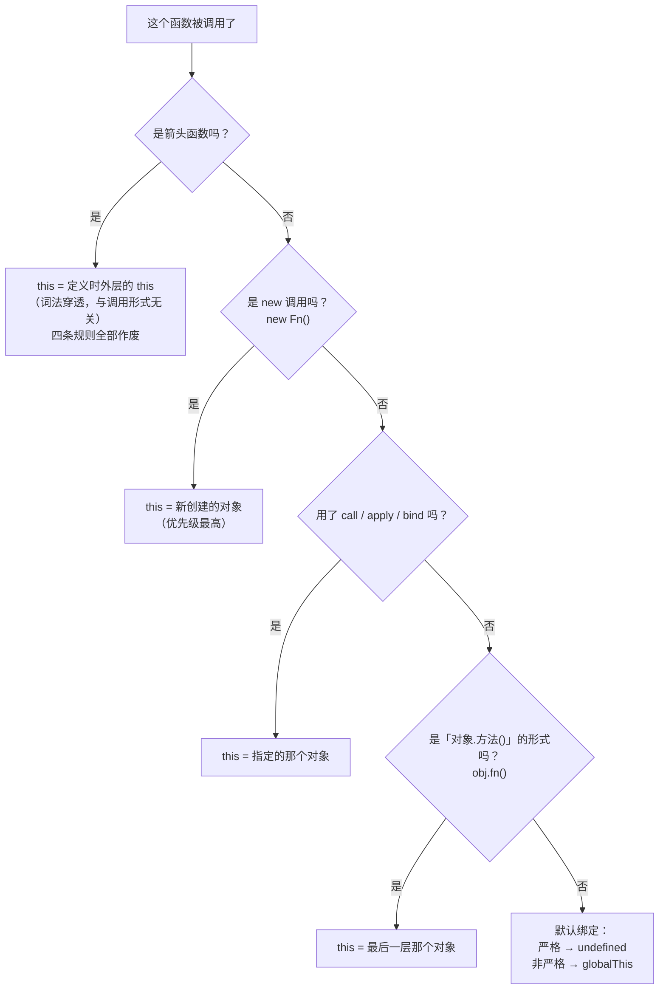
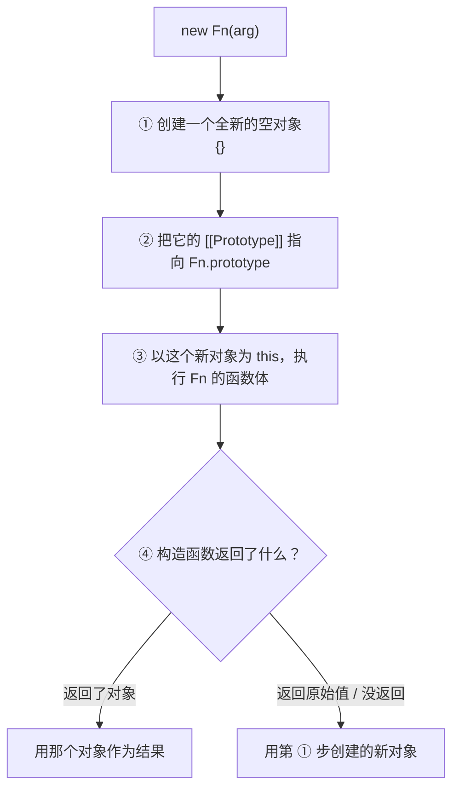
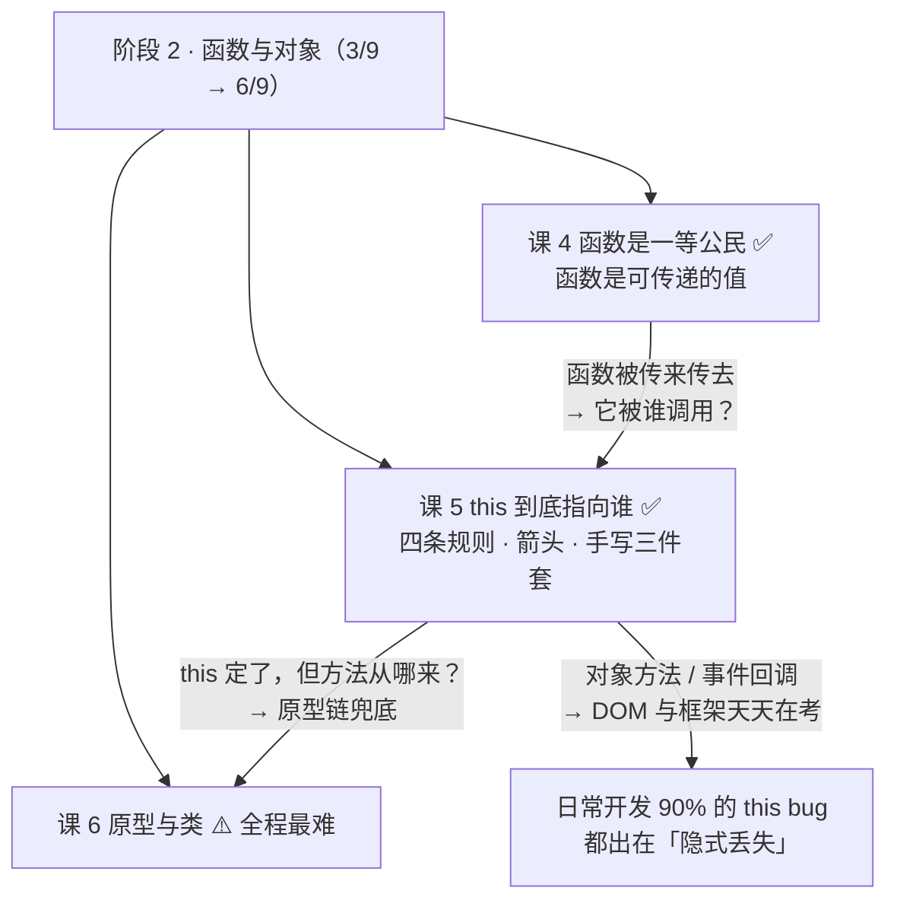
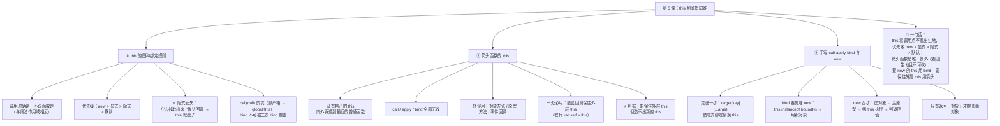

# 第 5 课：this 到底指向谁

> 所属阶段：阶段 2《函数与对象》｜ 水平：入门 ｜ 本课知识点：this 的四种绑定规则、箭头函数的 this、手写 call·apply·bind 与 new
> 故事情节：主角把对象方法传给 `setTimeout`，结果 `this.name` 变成 `undefined`——"this 丢了"。这一课就是把丢掉的东西找回来
> ✅ 状态：已完成（2026-09-02）｜ 实操环境：Node.js v22.14.0（文中所有输出均为本机实测）
> 🔗 本课是课 4 的直接续集：课 4 证明"函数是可以传递的值"，本课回答它必然带来的问题——**函数被传到别处调用时，函数体里的 `this` 是谁**

## 🎯 本课目标

- 对任意调用点说出 `this` 的指向，并按**优先级**说明是哪条绑定规则生效
- 指出对象方法、事件回调、原型方法三处误用箭头函数的后果
- 手写一个可用的 `bind`，并说清 `new` 的四步过程

## 📌 知识点导航

| # | 知识点 | 状态 |
|---|--------|------|
| 1 | this 的四种绑定规则 | ✅ |
| 2 | 箭头函数的 this | ✅ |
| 3 | 手写 call·apply·bind 与 new | ✅ |

---

## 第一幕：起源与场景引入

> 🏛️ **起源**：`this` 这个关键字不是 JS 发明的，它是从 **C++ / Java** 借来的——而 JS 借的时候，**只借了名字和写法，没借语义**。
>
> 1995 年，网景管理层要求这门新语言"**语法要像 Java**"（课 1 已核实，来源：Wikipedia JavaScript 词条「Creation at Netscape」）。于是 JS 里有了 `this`，写起来和 Java 一模一样。
>
> 但在 Java / C++ 里，`this` 是**编译期就确定的**——它永远指向"当前方法所属的那个对象实例"。一个方法写在哪个类里，`this` 就是那个类的实例，**没有第二种可能**。
>
> 而 JS 的 `this` 是**到调用那一刻才决定**的：同一个函数，换个调用方式，`this` 就换一个人。
>
> ⏳ **置信度：低**——"Eich 当时为什么把 `this` 设计成调用时绑定"这个**具体设计动机**，本课未检索到权威来源（Wikipedia 与 MDN 均未记载），故不作断言。可以确定的是**结果**：JS 的 `this` 是调用时绑定的，与 Java 完全不同。而这条差异，正是本课所有困惑的根源——它早已被规范固化，永远改不了。

好，回到你今天下午写的那段代码。

> 🎬 **场景**：一个用户对象，有个打招呼的方法。直接调用好好的，交给 `setTimeout` 就废了。

```js
const user = {
  name: '小明',
  greet() {
    console.log('你好，我是 ' + this.name);
  },
};

user.greet();                   // 你好，我是 小明      ✅
```

现在产品提了个需求：**3 秒后自动打个招呼**。你把方法直接传给了 `setTimeout`：

```js
setTimeout(user.greet, 3000);   // 你好，我是 undefined  ❌
```

**函数是同一个函数，方法还是那个方法，`name` 也确实在对象上——凭什么 `this.name` 就没了？**

你试了几种"网上说的办法"：

```js
setTimeout(user.greet.bind(user), 3000);   // 好使了
setTimeout(() => user.greet(), 3000);      // 也好使了

// 但你想"一劳永逸"，把方法本身改成箭头函数：
const user2 = {
  name: '小明',
  greet: () => console.log('你好，我是 ' + this.name),
};
user2.greet();                  // 你好，我是 undefined  ❌ 连直接调用都坏了！
```

**为什么同样是"箭头函数"，放在调用点就好使，放在定义处就彻底坏掉？**

---

## 第二幕：认知冲突

> ❓ **问题**：`this` 到底是"**定义时**"定的，还是"**调用时**"定的？

三个困惑，直指 JS 最反直觉的那块：

1. **函数是同一个函数，就换了个调用方式，`this` 凭什么就丢了？** 它存在哪里？跟着函数走吗？
2. **课 3 刚讲完"词法作用域是定义时确定"，`this` 会不会也遵循同一套规则？** 如果遵循，那 `user.greet()` 和 `greetCopy()` 应该有同一个 `this` 才对——可实测不是。
3. **"用箭头函数就好了"这句话到底在什么条件下成立？** 为什么放在调用点是修复，放在方法定义处反而更糟？

| 困惑 | 答案藏在 |
|------|---------|
| 换个调用方式就丢 | **知识点 1**：**隐式绑定**与**隐式丢失** |
| 定义时还是调用时 | **知识点 1 + 2**：四条规则全在**调用时**生效；箭头函数是唯一例外（**定义时**确定） |
| 箭头函数何时是坑、何时是解药 | **知识点 2**：三处误用 + 一处必用 |

> 💡 提示：困惑 2 是这课的**题眼**。你已经掌握了"变量看出生地"（课 3），而 `this` 恰恰相反——**它看调用点**。这个反差一旦吃透，本课就通了。

---

## 第三幕：层层揭示

### 知识点 1：this 的四种绑定规则

> 本知识点关键点：默认绑定（严格 / 非严格）/ 隐式绑定与**隐式丢失** / 显式绑定 `call`·`apply`·`bind` / `new` 绑定 / 四条规则的优先级排序

#### 一句话定义

`this` 是函数**在被调用的那一刻**才确定的一个绑定，指向"这次调用所依托的那个上下文对象"。**决定它的是调用方式，不是定义位置。** 规则共四条，按优先级从低到高：**默认绑定 < 隐式绑定 < 显式绑定 < `new` 绑定**。

#### 直觉建立（类比）

把 `this` 想成**工位上那台电脑**——谁来上班（谁发起这次调用），电脑就归谁用：

- **默认绑定**：没人认领这台电脑 → 非严格模式下归"公司公共区"（`globalThis`），严格模式下**根本没有电脑**（`undefined`）。
- **隐式绑定**：`obj.fn()` —— 门口挂着 `obj` 的工牌，电脑归 `obj`。
- **显式绑定**：`fn.call(obj)` —— 你直接把 `obj` 的工牌**拍在桌上**，说"这台归他"。
- **`new` 绑定**：`new Fn()` —— 新招了个员工（新建的对象），电脑**直接配给新人**，谁说话都不好使。

> 💡 **类比的边界**（两处必须修正，否则会误导）：
> ① 现实里"电脑归谁"是持久的，JS 里 `this` **每次调用都重新定**——同一个函数，两次调用可以有完全不同的 `this`。`this` 不是一个"跟着函数走的属性"。
> ② **箭头函数压根没有这台电脑**。它用的是"出生时那间办公室的电脑"（词法继承），而且**无法重新分配**——`call` / `apply` / `bind` 对它全部无效。这是知识点 2 的主场。

#### 核心原理

**① 四条规则（全部为 Node v22.14.0 实测）**

| 规则 | 调用形式 | `this` 指向 | 优先级 |
|------|----------|-------------|--------|
| **默认绑定** | `fn()` | 非严格：`globalThis`；严格：`undefined` | 最低 |
| **隐式绑定** | `obj.fn()` | **最后一层**的 `obj` | ↑ |
| **显式绑定** | `fn.call/apply/bind(obj)` | 你指定的 `obj` | ↑ |
| **`new` 绑定** | `new Fn()` | 新创建的那个对象 | 最高 |

```js
function showThis() { return this; }
function showThisStrict() { 'use strict'; return this; }

showThis() === globalThis;   // true    ← 默认绑定（非严格）
showThisStrict();            // undefined ← 默认绑定（严格）

const a = { name: 'a', b: { name: 'b', fn() { return this.name; } } };
a.b.fn();                    // 'b'     ← 隐式绑定：只看最后一层，是 b 不是 a

(function () { return this.name; }).call({ name: '指定的对象' });   // '指定的对象' ← 显式

function Ctor() { this.tag = 'new 出来的'; }
new Ctor().tag;              // 'new 出来的' ← new 绑定
```

⚠️ **严格模式的两个默认来源**（初学者最容易懵的地方）：

- **Node 的 CommonJS 模块**（普通 `.js`）**默认非严格** → 默认绑定给 `globalThis`
- **ESM 模块（`.mjs` / `"type": "module"`）、`class` 内部、函数体里写了 `'use strict'`** → 默认严格 → 默认绑定是 `undefined`

所以同一句 `fn()`，在不同文件里结果可能不同。**这也是为什么现代项目几乎不用"默认绑定"——它太依赖环境。**

**② 判定流程（照着走，不用背）**

> ⚠️ **第一问必须先问"是不是箭头函数"**：箭头函数**不参与**那四条规则，它一旦是箭头，后面四问全都作废。把这一问放最后会误判（比如 `obj.arrowFn()` 看着像隐式绑定，其实 `this` 根本不是 `obj`）。



**③ 隐式丢失（本课的题眼）**

**关键机制**：`obj.fn()` 之所以能让 `this` 指向 `obj`，靠的是**调用点前面的那个"点"**。一旦你把方法**取出来**再调用，那个"点"就没了 → 规则回落到默认绑定。

四种写法实测：

```js
const user = { name: '小明', greet() { return this.name; } };

user.greet();              // '小明'  ✅ 有点，隐式绑定

const greetCopy = user.greet;
greetCopy();               // undefined  ❌ 取出来裸调用 → 默认绑定，this 丢了

(user.greet)();            // '小明'  ✅ 光加括号不算"取出"，还是隐式绑定

(false || user.greet)();   // undefined  ❌ 逗号/逻辑运算符会先「求值」，结果是个裸函数
```

> 🔑 **这就是第一幕 `setTimeout` 的真相**：`setTimeout(user.greet, 3000)` 内部干的事，等价于 `const fn = user.greet; ... fn()`——**它只是拿到了函数这个值，然后裸调用它**。那个"点"在传参的瞬间就丢了。
>
> 回扣课 4：这正是"函数是一等公民"的**代价**——函数能被传来传去，也就意味着**它会被拿到一个你没预料到的上下文里被调用**。

**④ 显式绑定：`call` / `apply` / `bind`**

| 方法 | 执行时机 | 参数形式 | 返回值 |
|------|----------|----------|--------|
| `call(thisArg, a, b, c)` | **立即执行** | 参数列表 | 函数返回值 |
| `apply(thisArg, [a, b, c])` | **立即执行** | **数组** | 函数返回值 |
| `bind(thisArg, a, b)` | **不执行** | 参数列表（可预设） | **一个新函数** |

⚠️ **显式绑定的三个坑**（实测）：

```js
function showThis() { return this; }
function showThisStrict() { 'use strict'; return this; }

// 坑 1：传 null / undefined，非严格模式下会被替换成全局对象
showThis.call(null) === globalThis;        // true  ← 你写 null，它给你 globalThis
showThisStrict.call(null);                 // null  ← 严格模式保持原样

// 坑 2：传原始值，非严格模式下会被包装成对象
showThis.call(1);                          // [Number: 1]（typeof 是 'object'）
showThisStrict.call(1);                    // 1（保持原始值）

// 坑 3：bind 不可被第二次 bind 覆盖
const o1 = { name: 'o1' }, o2 = { name: 'o2' };
function who() { return this.name; }
const b1 = who.bind(o1);
b1.bind(o2)();                             // 'o1'  ← 第二次 bind 无效！
```

**⑤ `new` 绑定：优先级最高**

```js
function C2() { this.name = 'new 出来的'; }
const other = { name: 'other' };

new (C2.bind(other))().name;   // 'new 出来的'  ← new 赢了，bind 的 this 被完全忽略
```

**优先级总览（实测）**：

```js
user.greet.call(other);        // 'other'            ← 显式 > 隐式
new (C2.bind(other))().name;   // 'new 出来的'        ← new > 显式
```

#### 示例演示

```js
// ① 四条规则一次看全
showThis() === globalThis;                 // true（默认 · 非严格）
a.b.fn();                                  // 'b'（隐式 · 只看最后一层）
who.call(o1);                              // 'o1'（显式）
new Ctor().tag;                            // 'new 出来的'（new）

// ② 隐式丢失四种写法
user.greet();                              // '小明'
greetCopy();                               // undefined
(user.greet)();                            // '小明'
(false || user.greet)();                   // undefined

// ③ 三个坑
showThis.call(null) === globalThis;        // true
showThis.call(1);                          // [Number: 1]
b1.bind(o2)();                             // 'o1'（bind 不可覆盖）
```

#### 常见误区

1. **"`this` 指向函数自己"** → 不。`this` 跟函数对象没有任何关系（想引用自己用函数名或 `fn.name`）。
2. **"`this` 指向函数的作用域"** → 不。作用域是**词法**的（课 3），`this` 是**动态**的，两者是两套完全不同的机制。
3. **"`obj.fn` 取出来还是那个方法，`this` 应该还在"** → 不。隐式绑定靠的是**调用点那个"点"**，取出来就没了。
4. **"`call(null)` 能让 `this` 变成 `null`"** → 只在严格模式下成立；非严格模式下会被替换成 `globalThis`。
5. **"`bind` 过一次还能再 `bind` 改掉"** → 不能，`bind` 的绑定是**永久**的。
6. **"箭头函数也遵循这四条规则"** → 不，它**完全不参与**这四条（见知识点 2）。

#### 一句话记住

> **`this` 在调用那一刻才确定，看的是调用方式：new > 显式（call/apply/bind）> 隐式（obj.fn()）> 默认（严格 undefined / 非严格 globalThis）。把方法取出来再调用，隐式绑定就丢了。**

> ✅ **困惑 1、2 已解**：`this` **不跟着函数走**，它每次调用重新确定。所以同一个函数换种调用方式，`this` 就换人——这就是 `setTimeout(user.greet, 3000)` 翻车的全部原因。而它与课 3 的词法作用域**是两套相反的机制**：变量看**定义位置**（出生地），`this` 看**调用方式**（调用点）。唯一的例外是箭头函数（知识点 2）。

#### 官方文档

- [this - MDN](https://developer.mozilla.org/zh-CN/docs/Web/JavaScript/Reference/Operators/this)
- [Function.prototype.call - MDN](https://developer.mozilla.org/zh-CN/docs/Web/JavaScript/Reference/Global_Objects/Function/call)
- [Function.prototype.bind - MDN](https://developer.mozilla.org/zh-CN/docs/Web/JavaScript/Reference/Global_Objects/Function/bind)
- [严格模式 - MDN](https://developer.mozilla.org/zh-CN/docs/Web/JavaScript/Reference/Strict_mode)

---

### 知识点 2：箭头函数的 this

> 本知识点关键点：词法 `this`，**定义时**确定 / 与四种规则无关，也无法被 `call`·`apply`·`bind` 改变 / 常见误用场景：对象方法、事件回调、原型方法

#### 一句话定义

箭头函数**没有自己的 `this`**。它内部出现的 `this`，是**词法继承**自定义时所在的外层作用域，并且**无法被 `call` / `apply` / `bind` 改变**。它是四种规则之外唯一的例外——**`this` 在定义时就定死了。**

#### 直觉建立（类比）

- **普通函数**的 `this`：**"谁叫我，我就是谁的"**（看调用点）。
- **箭头函数**的 `this`：**"我在哪出生，我就是那儿的"**（看出生地）。

这一点和课 3 的词法作用域**完全一致**，也和课 4 讲过的 `arguments` 一模一样——**箭头函数没有的东西（`this`、`arguments`），它就向外借**。

> 💡 **类比的边界**："向外借"不是借**一层**，而是**穿透所有箭头函数**，一直找到最近一个"有 `this` 的普通函数"为止。如果一路穿到最外层都没有（比如 ESM 模块顶层），就落在模块/全局的 `this` 上。

**穿透示意图**：


#### 核心原理

**① 为什么？——规范层面的答案**

课 4 讲过函数对象有个隐藏槽位 `[[ThisMode]]`。普通函数是 `global` / `strict`（需要每次调用时计算 `this`），**箭头函数是 `lexical`**——它压根不创建 `this` 绑定，遇到 `this` 就沿作用域链往外找。

`call` / `apply` / `bind` 之所以对它无效，是因为它们**改的是"这次调用的 this"**，而箭头函数**根本没有"自己的 this"可改**。

```js
const arrowThis = () => this;
const target = { name: 'target' };
arrowThis.call(target) === module.exports;   // true  ← call 完全无效（课 4 已实测）
```

**② 三处误用（大纲要求，全部实测）**

| 误用场景 | 写法 | 后果 | 实测 |
|----------|------|------|------|
| **① 对象方法** | `{ name: 'x', greet: () => this.name }` | `this` 是**外层的**（模块里是 `module.exports`，浏览器里是 `window`），**永远拿不到 `name`** | `objArrow.greet()` → `undefined` |
| **② 原型方法** | `U.prototype.get = () => this.n` | 同理，拿不到实例 | `new U('小刚').get()` → `undefined` |
| **③ 事件回调** | `btn.addEventListener('click', () => this.classList)` | 浏览器事件回调的 `this` 默认是**触发元素**，用箭头就拿不到了 | 模拟实测：`BUTTON` → `undefined` |

```js
// ① 对象方法用箭头 —— 连直接调用都是坏的
const objArrow = { name: '小明', greet: () => this.name };
objArrow.greet();          // undefined  ❌

// ② 原型方法用箭头 —— 拿不到实例
function U(n) { this.n = n; }
U.prototype.get = () => this.n;
new U('小刚').get();       // undefined  ❌

// ③ 事件回调用箭头 —— 拿不到触发元素（浏览器行为，此处用等价代码模拟）
function addEventListener(handler) {
  const el = { tagName: 'BUTTON' };
  return handler.call(el);          // 浏览器就是以「触发元素」为 this 调用 handler 的
}
addEventListener(function () { return this.tagName; });   // 'BUTTON'    ✅
addEventListener(() => this.tagName);                     // undefined   ❌
```

> 🔑 **一条通用判据**：**凡是"需要 this 指向某个人"的位置，都不能用箭头函数**——因为它没有，也拿不到。对象方法、原型方法、事件回调、构造函数，全在此列。

**③ 一处必用：在回调里保住外层的 `this`**

这是箭头函数存在的最大价值——**当你在方法内部再写一层回调时，普通函数会把 `this` 弄丢，箭头函数不会**：

```js
const team = {
  name: '小明',
  friends: ['小红', '小刚'],
  greetAllNormal() { return this.friends.map(function (f) { return this.name + ' 向 ' + f + ' 打招呼'; }); },
  greetAllArrow()  { return this.friends.map((f) => this.name + ' 向 ' + f + ' 打招呼'); },
};

team.greetAllNormal();   // [ 'undefined 向 小红 打招呼', 'undefined 向 小刚 打招呼' ]  ❌
team.greetAllArrow();    // [ '小明 向 小红 打招呼', '小明 向 小刚 打招呼' ]            ✅
```

**`map` 的回调是被 `map` 自己调用的**（回扣课 4 的"控制反转"），所以普通函数版的 `this` 落回默认绑定 → 丢了。箭头版的 `this` **穿透回 `greetAllArrow` 的 `this`**，也就是 `team`。

> 📌 **历史背景**：ES6 之前没有箭头函数，老代码里通行的写法是 `var self = this;`（或 `var that = this`），然后在回调里用 `self`。**箭头函数本质上就是这个模式的语法糖**，但更可靠——不用手动存变量，也不会漏改。你在老项目里看到 `var self = this` 时，就知道它等价于今天的箭头函数。

**④ 什么时候用哪种？一张表收口**

| 场景 | 该用什么 | 理由 |
|------|----------|------|
| 对象方法 | **普通函数**（或方法简写 `greet() {}`） | 需要 `this` = 该对象 |
| 原型 / class 方法 | **普通函数** | 需要 `this` = 实例 |
| 事件回调 | **普通函数**（需要 `this` 时） | 需要 `this` = 触发元素 |
| 构造函数 | **普通函数**（箭头直接报错） | 箭头不能 `new`（课 4 已实测） |
| **方法内部的嵌套回调** | **箭头函数** ⭐ | 需要**保住外层的 `this`** |
| 不需要 `this` 的纯函数 | 箭头函数（更短） | 无所谓，看习惯 |

#### 示例演示

```js
// ① 三处误用
const objArrow = { name: '小明', greet: () => this.name };
objArrow.greet();                                        // undefined
function U(n) { this.n = n; }
U.prototype.get = () => this.n;
new U('小刚').get();                                     // undefined

// ② 一处必用
const team = { name: '小明', friends: ['小红', '小刚'],
  greetAllNormal() { return this.friends.map(function (f) { return this.name + ' 向 ' + f + ' 打招呼'; }); },
  greetAllArrow()  { return this.friends.map((f) => this.name + ' 向 ' + f + ' 打招呼'); },
};
team.greetAllNormal();   // [ 'undefined 向 小红 打招呼', ... ]
team.greetAllArrow();    // [ '小明 向 小红 打招呼', ... ]

// ③ call 改不动它
const arrowThis = () => this;
arrowThis.call({ name: 'target' }) === module.exports;   // true
```

#### 常见误区

1. **"箭头函数的 `this` 指向定义它的对象"** → 不准确。它指向**定义时所在的那个作用域的 `this`**——通常是外层的普通函数，而不一定是某个对象。
2. **"箭头函数可以用 `bind` 改 `this`"** → 不能，`call` / `apply` / `bind` 对它**全部无效**。
3. **"对象里用箭头函数做方法能少写代码"** → 会**静默失效**（不报错，只是 `this` 不对）。这是最难查的一类 bug，因为它不抛异常。
4. **"箭头函数总是优于普通函数"** → 不。上表六种场景里，只有两种该用箭头。

#### 一句话记住

> **箭头函数没有自己的 `this`，它向外穿透到最近一层的普通函数；`call`/`apply`/`bind` 对它无效。所以：需要"this 指向谁"的地方（对象方法 / 原型方法 / 事件回调 / 构造函数）不能用它，而"需要保住外层 this"的嵌套回调正是它的主场。**

> ✅ **困惑 3 已解**：箭头函数放在**调用点**（`setTimeout(() => user.greet(), 3000)`）是修复——因为箭头自己没有 `this`，它穿透到外层，而你在箭头函数体里写的是 `user.greet()`，**那个"点"还在**。箭头函数放在**方法定义处**（`greet: () => this.name`）是灾难——因为它会穿透到对象**外面**，拿到 `module.exports` / `window`，连直接调用都拿不到 `name`。
>
> **判据一句话**：箭头函数能**保住**外层的 `this`，但**造不出**一个新的 `this`。

#### 官方文档

- [箭头函数 - MDN](https://developer.mozilla.org/zh-CN/docs/Web/JavaScript/Reference/Functions/Arrow_functions)
- [this - MDN（箭头函数章节）](https://developer.mozilla.org/zh-CN/docs/Web/JavaScript/Reference/Operators/this)

---

### 知识点 3：手写 call·apply·bind 与 new

> 本知识点关键点：手写 `call` / `apply` / `bind` 揭示机制（`bind` 需处理 `new` 的情况）/ `new` 的四步过程 / 绑定丢失的真实案例与修复手段

#### 一句话定义

`call` / `apply` / `bind` 的本质是**借"隐式绑定"来偷换 `this`**：把函数临时挂成目标对象的属性，用 `obj.fn()` 的形式调它，`this` 自然就成了那个对象。`new` 的本质是**创建一个新对象，并把它作为 `this` 交给构造函数**——共四步。

#### 直觉建立（类比）

想让张三用李四的工位电脑，你有两个办法：

1. **把张三的工牌临时挂在李四工位上**，让他进去干活，干完摘走（**这就是 `call` / `apply`**）；
2. **给张三办一张长期工牌**，绑死在李四工位上，以后他每次来都坐那儿（**这就是 `bind`**）。

> 💡 **类比的边界**：真实的 `bind` 办出来的"长期工牌"有个例外——**如果张三是被"招聘"进来的（`new`），他会拿到一台属于自己的新电脑，那张长期工牌当场作废**。这正是手写 `bind` 时最难、也最有价值的一处细节（见下文 `isNew` 判断）。

#### 核心原理

**① 手写 `call`（注释逐步解释）**

```js
Function.prototype.myCall = function (thisArg, ...args) {
  const fn = this;                    // 谁调 myCall，this 就是那个函数（隐式绑定）
  const key = Symbol('fn');           // 用 Symbol 当属性名，避免覆盖对象已有的同名属性
  // null / undefined → 换成 globalThis；原始值 → 包装成对象（复刻原生行为）
  const target = thisArg == null ? globalThis : Object(thisArg);
  Object.defineProperty(target, key, {
    value: fn, enumerable: false, configurable: true,   // 设为不可枚举，不污染 for...in
  });
  const result = target[key](...args);    // ★ 关键一步：用「对象.方法()」的形式调用 → 隐式绑定生效
  delete target[key];                     // 用完了把临时属性删掉，不留痕迹
  return result;
};
```

**★ 整个 `myCall` 的灵魂就是 `target[key](...args)` 这一行**——它把"指定 `this`"这个需求，**翻译成了引擎本来就会做的隐式绑定**。

**② 手写 `apply`**（只是参数形式不同）

```js
Function.prototype.myApply = function (thisArg, args = []) {
  return this.myCall(thisArg, ...args);   // 数组展开即可，其余逻辑完全复用
};
```

**③ 手写 `bind`（含 `new` 处理）**

```js
Function.prototype.myBind = function (thisArg, ...preArgs) {
  const fn = this;
  function boundFn(...args) {
    // ★ 如果被 new 调用，this 是 boundFn 的新实例 → 忽略 bind 的 thisArg，改用新对象
    const isNew = this instanceof boundFn;
    return fn.apply(isNew ? this : thisArg, [...preArgs, ...args]);   // preArgs 支持参数预设（柯里化）
  }
  // 保住原型链：让 new boundFn() 出来的对象，instanceof 原函数仍然成立
  boundFn.prototype = Object.create(fn.prototype);
  return boundFn;
};
```

两处关键细节：

| 细节 | 为什么要这么写 | 不这么写会怎样 |
|------|---------------|---------------|
| `this instanceof boundFn` | 识别"这次是被 `new` 调用的" | `new (fn.bind(obj))()` 会错误地把 `this` 绑成 `obj`（实测原生行为是**新对象**） |
| `boundFn.prototype = Object.create(fn.prototype)` | 让新实例能继承原函数原型上的方法 | `new` 出来的对象 `instanceof 原函数` 为 `false`、拿不到原型方法 |

实测（手写版行为与原生完全一致）：

```js
const o1 = { name: 'o1' }, o2 = { name: 'o2' };
function who() { return this.name; }
who.myCall(o1);                 // 'o1'
who.myApply(o2);                // 'o2'
who.myBind(o1)();               // 'o1'

function Animal(name) { this.name = name; }
Animal.prototype.say = function () { return '我是 ' + this.name; };
const MyDog = Animal.myBind({ name: '被 bind 的' }, '阿黄');   // 预设参数 '阿黄'
const dog = new MyDog();
dog.name;                       // '阿黄'          ← bind 的 thisArg 被 new 覆盖了
dog instanceof Animal;          // true            ← 原型链保住了
dog.say();                      // '我是 阿黄'
```

**④ `new` 的四步过程**



实测（重点在第 ④ 步的"对象 vs 原始值"分岔）：

```js
function RetObj()  { this.x = 1; return { y: 2 }; }
function RetPrim() { this.x = 1; return 2; }

new RetObj();    // { y: 2 }              ← 返回对象 → 用它，this.x 白设了
new RetPrim();   // RetPrim { x: 1 }      ← 返回原始值 → 忽略，用新对象
```

第 ② 步涉及原型链，**课 6《原型与类》会把它彻底拆开**，这里先记住有这么一步：

```js
Object.getPrototypeOf(new Animal('阿黄')) === Animal.prototype;   // true
```

**⑤ 绑定丢失的真实案例与修复手段（回扣第一幕）**

| 手段 | 写法 | 评价 |
|------|------|------|
| **① `bind`** | `setTimeout(user.greet.bind(user), 3000)` | **最明确**——意图写在代码里，谁都看得懂 |
| **② 箭头函数包一层** | `setTimeout(() => user.greet(), 3000)` | **最灵活**——回调里还能做别的事 |
| **③ `call` / `apply`** | `setTimeout(user.greet.call(user), 3000)` | ❌ **陷阱**：`call` 是立即执行的，这句会把结果（而不是函数）传给 `setTimeout`。要延迟执行只能用 ① 或 ② |
| **④ `var self = this`** | 老代码写法 | 已被箭头函数取代，看到时要认得 |
| ❌ **对象方法改箭头** | `greet: () => this.name` | **错误**——这是知识点 2 的误用①，直接调用都是坏的 |
| ❌ **硬扛默认绑定** | 指望 `this` 落到 `globalThis` | **危险**——严格模式下是 `undefined`，换个文件就崩 |

实测三种修复：

```js
// 丢 this 版（等价于 setTimeout(user.greet, 3000) 内部的行为）
greetCopy();                       // '你好，我是 undefined'
// 修复①
user.greet.bind(user)();           // '你好，我是 小明'
// 修复②
(() => user.greet())();            // '你好，我是 小明'
```

#### 示例演示

见上方各段（全部为实测）。手写三件套的完整可运行版本见**第四幕**的 `l5-demo.js`。

#### 常见误区

1. **"`bind` 会立即执行函数"** → 不，`bind` **只返回新函数**，`call` / `apply` 才立即执行。
2. **"`apply` 和 `call` 不一样"** → 逻辑完全一样，**只有参数形式不同**（数组 vs 列表）。
3. **"手写 `call` 直接写 `fn.this = thisArg` 就行"** → 不行，`this` 不可写。必须借隐式绑定（`target[key](...)`），这也是面试常考的题眼。
4. **"`new (fn.bind(obj))()` 的 `this` 是 `obj`"** → 不，是**新对象**。`new` 的优先级最高。
5. **"构造函数 `return` 什么都会覆盖新对象"** → 只有返回**对象**时才覆盖；返回原始值会被忽略。
6. **"用 `var self = this` 是现代写法"** → 是 2015 年之前的写法，现在该用箭头函数（但读老代码时要认得它）。

#### 一句话记住

> **`call`/`apply`/`bind` 的本质是把函数临时挂成目标对象的属性、借隐式绑定偷换 `this`；`bind` 返回的新函数一旦被 `new`，`this` 改用新对象（`new` 优先级最高）；`new` 走四步，且只有构造函数返回「对象」时才覆盖新建的那个对象。**

#### 官方文档

- [Function.prototype.apply - MDN](https://developer.mozilla.org/zh-CN/docs/Web/JavaScript/Reference/Global_Objects/Function/apply)
- [new 运算符 - MDN](https://developer.mozilla.org/zh-CN/docs/Web/JavaScript/Reference/Operators/new)
- [new.target - MDN](https://developer.mozilla.org/zh-CN/docs/Web/JavaScript/Reference/Operators/new.target)

---

## 第四幕：实操验证

把下面代码存成 `l5-demo.js`，用 `node l5-demo.js` 运行（本机 Node.js v22.14.0）：

```js
// l5-demo.js —— 回扣第一幕：setTimeout 把 this 弄丢了，以及把它找回来的全部手段
const user = {
  name: '小明',
  greet() { return '你好，我是 ' + this.name; },
};

console.log('=== 1. 第一幕：this 是怎么丢的 ===');
console.log('  user.greet()                          =>', user.greet());
const greetCopy = user.greet;   // ← setTimeout(user.greet, ms) 内部干的就是这一步
console.log('  取出来再裸调用（等价于 setTimeout 内部）=>', greetCopy());

console.log('\n=== 2. 四条规则速览 ===');
function showThis() { return this; }
function showThisStrict() { 'use strict'; return this; }
console.log('  默认绑定（非严格）=== globalThis :', showThis() === globalThis);
console.log('  默认绑定（严格）                  :', showThisStrict());
const a = { name: 'a', b: { name: 'b', fn() { return this.name; } } };
console.log('  隐式绑定 a.b.fn() =>', a.b.fn(), '（只看最后一层，不是 a）');
console.log('  显式绑定 call     =>', (function () { return this.name; }).call({ name: '指定的对象' }));
function Ctor() { this.tag = 'new 出来的'; }
console.log('  new 绑定          =>', new Ctor().tag);

console.log('\n=== 3. 隐式丢失的四种写法 ===');
console.log('  user.greet()            =>', user.greet());
console.log('  greetCopy()             =>', greetCopy());
console.log('  (user.greet)()          =>', (user.greet)(), '（光加括号不丢）');
console.log('  (false || user.greet)() =>', (false || user.greet)(), '（表达式求值 → 丢）');

console.log('\n=== 4. 优先级：new > 显式 > 隐式 > 默认 ===');
const other = { name: 'other' };
console.log('  user.greet.call(other)  =>', user.greet.call(other), '（显式 > 隐式）');
function C2() { this.name = 'new 出来的'; }
console.log('  new (C2.bind(other))()  =>', new (C2.bind(other))().name, '（new > 显式）');

console.log('\n=== 5. 箭头函数的三处误用 ===');
const objArrow = { name: '小明', greet: () => this.name };
console.log('  误用① 对象方法用箭头 =>', objArrow.greet());
function U(n) { this.n = n; }
U.prototype.get = () => this.n;
console.log('  误用② 原型方法用箭头 =>', new U('小刚').get());
function addEventListener(handler) {                 // 模拟浏览器：以「触发元素」为 this 调用 handler
  const el = { tagName: 'BUTTON' };
  return handler.call(el);
}
console.log('  误用③ 事件回调：普通函数 =>', addEventListener(function () { return this.tagName; }));
console.log('        事件回调：箭头函数 =>', addEventListener(() => this.tagName));

console.log('\n=== 6. 箭头函数的正确用法：在回调里保住外层 this ===');
const team = {
  name: '小明',
  friends: ['小红', '小刚'],
  greetAllNormal() { return this.friends.map(function (f) { return this.name + ' 向 ' + f + ' 打招呼'; }); },
  greetAllArrow() { return this.friends.map((f) => this.name + ' 向 ' + f + ' 打招呼'); },
};
console.log('  回调用普通函数（this 丢了）:', team.greetAllNormal());
console.log('  回调用箭头函数（this 保住）:', team.greetAllArrow());

console.log('\n=== 7. 手写 call / apply / bind ===');
Function.prototype.myCall = function (thisArg, ...args) {
  const fn = this;                                    // 谁调 myCall，this 就是那个函数
  const key = Symbol('fn');                           // 用 Symbol 避免覆盖对象原有属性
  const target = thisArg == null ? globalThis : Object(thisArg);   // null/undefined → 全局；原始值 → 包装对象
  Object.defineProperty(target, key, { value: fn, enumerable: false, configurable: true });
  const result = target[key](...args);                // 借「隐式绑定」把 this 变成 target
  delete target[key];
  return result;
};
Function.prototype.myApply = function (thisArg, args = []) {
  return this.myCall(thisArg, ...args);
};
Function.prototype.myBind = function (thisArg, ...preArgs) {
  const fn = this;
  function boundFn(...args) {
    const isNew = this instanceof boundFn;            // 被 new 调用时，忽略 bind 的 thisArg
    return fn.apply(isNew ? this : thisArg, [...preArgs, ...args]);
  }
  boundFn.prototype = Object.create(fn.prototype);    // 保住原型链，让 instanceof 成立
  return boundFn;
};
const o1 = { name: 'o1' }, o2 = { name: 'o2' };
function who() { return this.name; }
console.log('  myCall(o1)  =>', who.myCall(o1));
console.log('  myApply(o2) =>', who.myApply(o2));
console.log('  myBind(o1)()=>', who.myBind(o1)());
function Animal(name) { this.name = name; }
Animal.prototype.say = function () { return '我是 ' + this.name; };
const MyDog = Animal.myBind({ name: '被 bind 的' }, '阿黄');
const dog = new MyDog();
console.log('  new 手写 bind 的函数 =>', dog.name, '| instanceof Animal:', dog instanceof Animal, '| say():', dog.say());

console.log('\n=== 8. new 的四步与返回值规则 ===');
function RetObj() { this.x = 1; return { y: 2 }; }
function RetPrim() { this.x = 1; return 2; }
console.log('  构造函数返回对象   =>', new RetObj(), '（用返回的对象）');
console.log('  构造函数返回原始值 =>', new RetPrim(), '（忽略，用新对象）');
const realDog = new Animal('小黑');
console.log('  第 2 步：getPrototypeOf(dog) === Animal.prototype =>', Object.getPrototypeOf(realDog) === Animal.prototype);

console.log('\n=== 9. 第一幕场景的三种修复（真实 setTimeout） ===');
setTimeout(() => console.log('  丢 this 版            =>', greetCopy()), 60);
setTimeout(() => console.log('  修复① bind(user)      =>', user.greet.bind(user)()), 70);
setTimeout(() => console.log('  修复② 箭头函数包一层   =>', (() => user.greet())()), 80);
```

**实测输出**：

```
=== 1. 第一幕：this 是怎么丢的 ===
  user.greet()                          => 你好，我是 小明
  取出来再裸调用（等价于 setTimeout 内部）=> 你好，我是 undefined

=== 2. 四条规则速览 ===
  默认绑定（非严格）=== globalThis : true
  默认绑定（严格）                  : undefined
  隐式绑定 a.b.fn() => b （只看最后一层，不是 a）
  显式绑定 call     => 指定的对象
  new 绑定          => new 出来的

=== 3. 隐式丢失的四种写法 ===
  user.greet()            => 你好，我是 小明
  greetCopy()             => 你好，我是 undefined
  (user.greet)()          => 你好，我是 小明 （光加括号不丢）
  (false || user.greet)() => 你好，我是 undefined （表达式求值 → 丢）

=== 4. 优先级：new > 显式 > 隐式 > 默认 ===
  user.greet.call(other)  => 你好，我是 other （显式 > 隐式）
  new (C2.bind(other))()  => new 出来的 （new > 显式）

=== 5. 箭头函数的三处误用 ===
  误用① 对象方法用箭头 => undefined
  误用② 原型方法用箭头 => undefined
  误用③ 事件回调：普通函数 => BUTTON
        事件回调：箭头函数 => undefined

=== 6. 箭头函数的正确用法：在回调里保住外层 this ===
  回调用普通函数（this 丢了）: [ 'undefined 向 小红 打招呼', 'undefined 向 小刚 打招呼' ]
  回调用箭头函数（this 保住）: [ '小明 向 小红 打招呼', '小明 向 小刚 打招呼' ]

=== 7. 手写 call / apply / bind ===
  myCall(o1)  => o1
  myApply(o2) => o2
  myBind(o1)()=> o1
  new 手写 bind 的函数 => 阿黄 | instanceof Animal: true | say(): 我是 阿黄

=== 8. new 的四步与返回值规则 ===
  构造函数返回对象   => { y: 2 } （用返回的对象）
  构造函数返回原始值 => RetPrim { x: 1 } （忽略，用新对象）
  第 2 步：getPrototypeOf(dog) === Animal.prototype => true

=== 9. 第一幕场景的三种修复（真实 setTimeout） ===
  丢 this 版            => 你好，我是 undefined
  修复① bind(user)      => 你好，我是 小明
  修复② 箭头函数包一层   => 你好，我是 小明
```

> ✅ **回扣场景**：三个困惑全部结案——
>
> - **"换个调用方式就丢"**：第 1、3 段证明——`user.greet()` 有"点"，`greetCopy()` 没"点"。`setTimeout(user.greet, 3000)` 内部干的就是"先取出来，到时候裸调用"，所以"点"在传参那一刻就丢了。第 9 段实测三种修复全部让它回到 `'你好，我是 小明'`。
> - **"定义时还是调用时"**：第 2 段证明四条规则**全在调用时生效**；第 4 段证明优先级是 `new` > 显式 > 隐式 > 默认；第 5、6 段证明**箭头函数是唯一例外**——它在定义时就定死，且 `call` 改不动它（课 4 已实测 `arrowThis.call(target) === module.exports`）。
> - **"箭头函数何时是坑、何时是解药"**：第 5 段是三处坑（对象方法 / 原型方法 / 事件回调，全是 `undefined`），第 6 段是一处解药（嵌套回调里保住外层 `this`，`'小明 向 小红 打招呼'`）。判据一句话：**箭头函数能保住外层的 `this`，但造不出新的 `this`。**
>
> 🎯 **手写三件套也实测通过**（第 7 段）：手写的 `myCall` / `myApply` / `myBind` 行为与原生一致，连"`new` 时忽略 `bind` 的 `thisArg`"这个最刁钻的细节都复刻了（`dog.name` 是 `'阿黄'` 而不是 `'被 bind 的'`，且 `instanceof Animal` 为 `true`）。

---

## 第五幕：体系收束



**本课在阶段 2 里的位置**：

| 课 | 回答的问题 | 一句话 |
|----|-----------|--------|
| 课 4 | 函数是什么？ | 它是可以被传递的**值** |
| **课 5** | **函数被传走后，`this` 是谁？** | **看调用点，四条规则有明确优先级；箭头函数是唯一例外** |
| 课 6 | 方法从哪来？ | 原型链（属性查找的兜底路径） |

**你现在会了什么**：

- 看到任意 `fn(...)` 调用点，能按 `new` → 显式 → 隐式 → 默认 的顺序说出 `this` 是谁，并说出依据
- 看到"方法被取出来 / 传进回调"，能立刻预警**隐式丢失**，并给出 `bind` 或箭头包一层的修复
- 面对"这里该不该用箭头函数"，能用"**需要 this 指向谁吗？**"这一条判据决定
- 能手写一个可用的 `bind`（含 `new` 处理），并说清 `new` 的四步与返回值规则

**本课的"包袱 vs 取舍"总账**（体例从课 1 延续至今）：

| 现象 | 归属 |
|------|------|
| `this` 的动态绑定 | **历史包袱**（借了 Java 的语法外壳，却用了一套完全不同的动态语义；已被规范固化，无法更改） |
| 非严格模式下 `call(null)` → `globalThis` | **历史包袱**（早期"宽容"设计的残留，严格模式已修掉） |
| 隐式丢失 | **设计取舍**（代价：`this` 会静默丢失；收益：函数才能真正自由传递——课 4 的一等公民若没有它，代价会更大） |
| 箭头函数的词法 `this` | **设计取舍**（代价：不能做方法 / 构造函数；收益：嵌套回调不必再写 `var self = this`） |
| `new` > 显式 > 隐式 > 默认 的优先级链 | **设计取舍**（规则明确可预测，代价是要记一条优先级链——但这比"看情况"好太多） |

> 🔗 **下一步：课 6《原型与类》**。本课留下最后一个问题——我们一直在说 `obj.fn()`，可 `fn` 这个方法是**从哪儿找到的**？如果对象上没有呢？答案就是**原型链**：它是一条"属性查找的兜底路径"。
>
> ⚠️ **课 6 是全程最难的一课**，且与本课相邻、难度叠加。按阶段概览的约定，它采用**逆向讲法**：先用 `class` 正常写代码，跑通了，再拆开看它背后的原型链。**允许分两次学**——先跟着写 `class`，下次再拆原型。卡住不是你笨，是这课本来就难。

---

## 🐞 常见误区（本课汇总）

1. **"`this` 指向函数自己"** → 不，`this` 跟函数对象没有任何关系。
2. **"`this` 指向函数的作用域"** → 不。作用域是词法的（课 3），`this` 是动态的，两套机制。
3. **"`obj.fn` 取出来 `this` 还在"** → 不，隐式绑定靠的是**调用点那个"点"**。
4. **"`call(null)` 让 `this` 变成 `null`"** → 只在严格模式下成立；非严格模式会换成 `globalThis`。
5. **"`bind` 过一次还能再 `bind` 改掉"** → 不能，`bind` 的绑定是永久的。
6. **"箭头函数的 `this` 指向定义它的对象"** → 指向**定义时所在作用域的 `this`**，通常是外层函数。
7. **"箭头函数可以用 `bind` 改 `this`"** → 不能，`call` / `apply` / `bind` 对它全部无效。
8. **"对象里用箭头函数做方法能少写代码"** → 会**静默失效**（不报错，只是 `this` 不对），最难查。
9. **"`bind` 会立即执行"** → 不，`bind` 只返回新函数；`call` / `apply` 才立即执行。
10. **"`new (fn.bind(obj))()` 的 `this` 是 `obj`"** → 不是，是**新对象**——`new` 优先级最高。
11. **"构造函数 `return` 什么都会覆盖新对象"** → 只有返回**对象**时才覆盖，返回原始值会被忽略。
12. **"`var self = this` 是现代写法"** → 是 ES6 之前的写法，现在该用箭头函数（读老代码时要认得）。

## 一图总结



## 课后小测

**Q1**：下面代码的输出是什么？

```js
const obj = {
  name: '小明',
  greet() { return this.name; },
};
const g = obj.greet;
console.log(obj.greet(), g());
```

- A. `小明 小明`
- B. `小明 undefined`
- C. `undefined undefined`
- D. `undefined 小明`

<details><summary>答案与解析</summary>

**答案：B**。

`obj.greet()` 前面有"点" → **隐式绑定**，`this` = `obj` → `'小明'`。

`const g = obj.greet; g()` 把方法**取出来**裸调用了 → "点"没了 → 回落到**默认绑定**。在 Node 的 CommonJS（非严格）下 `this` 是 `globalThis`，而 `globalThis.name` 是 `undefined`。

这就是**隐式丢失**——本课第一幕 `setTimeout(user.greet, 3000)` 翻车的同一个原因。

</details>

**Q2**：四选一，哪个 `this` 指向 `obj`？

```js
function fn() { return this; }
const obj = { fn };
// ① fn()            ② obj.fn()
// ③ fn.call(obj)    ④ new (fn.bind(obj))()
```

- A. ②③
- B. ①②③
- C. ②③④
- D. ①②③④

<details><summary>答案与解析</summary>

**答案：A**（② 和 ③）。

- ① `fn()` → 默认绑定，`this` 是 `globalThis`（非严格），**不是** `obj`。
- ② `obj.fn()` → 隐式绑定 ✅
- ③ `fn.call(obj)` → 显式绑定 ✅
- ④ `new (fn.bind(obj))()` → **`new` 绑定优先级最高**，忽略 `bind` 的 `obj`，`this` 是新建的对象，**不是** `obj`。

④ 是最容易被漏掉的一条——这正是手写 `bind` 时必须判断 `this instanceof boundFn` 的原因。

</details>

**Q3**：关于箭头函数的 `this`，下列说法正确的是？

- A. 箭头函数的 `this` 在调用时确定，和普通函数一样
- B. 箭头函数的 `this` 可以用 `bind` 改变
- C. 箭头函数没有自己的 `this`，它向外穿透到最近一层的普通函数
- D. 对象方法写成箭头函数，可以通过 `obj.method()` 正常拿到 `obj`

<details><summary>答案与解析</summary>

**答案：C**。

- A 错：箭头函数的 `this` 在**定义时**就定死了，是四种规则的唯一例外。
- B 错：`call` / `apply` / `bind` 对它**全部无效**——因为它压根没有"自己的 `this`"可改。
- C 对：这就是"词法 `this`"，会穿透所有箭头函数，直到遇到最近一个普通函数。
- D 错：实测 `const o = { name: '小明', greet: () => this.name }; o.greet()` → `undefined`，因为 `this` 穿透到了对象**外面**。

**判据一句话**：箭头函数能**保住**外层的 `this`，但**造不出**一个新的 `this`。

</details>

**Q4**：手写 `call` 时，最关键的一行是下面哪个？

```js
Function.prototype.myCall = function (thisArg, ...args) {
  const fn = this;
  const key = Symbol('fn');
  const target = thisArg == null ? globalThis : Object(thisArg);
  Object.defineProperty(target, key, { value: fn, enumerable: false, configurable: true });
  const result = target[key](...args);   // ← 这一行
  delete target[key];
  return result;
};
```

- A. `const fn = this;`
- B. `Object.defineProperty(...)`
- C. `target[key](...args)`
- D. `delete target[key];`

<details><summary>答案与解析</summary>

**答案：C**。

`target[key](...args)` 是**整个实现的灵魂**——它把"指定 `this`"这个需求，翻译成了引擎本来就会做的**隐式绑定**（`对象.方法()` 的形式）。`this` 根本不可写，唯一合法的偷换方式就是借这一条规则。

其余各行都是配角：
- A 是取出被调用的函数（靠的也是隐式绑定：`fn.myCall()` 里 `myCall` 的 `this` 是 `fn`）。
- B 是把函数临时挂成属性，用 `Symbol` 避免覆盖原有属性。
- D 是用完清理现场。

</details>

**Q5（进阶）**：下面代码两次 `console.log` 分别输出什么？

```js
function Animal(name) { this.name = name; }
const Bound = Animal.bind({ name: '被 bind 的' });
console.log(new Bound('阿黄').name);
function Ret() { this.x = 1; return { y: 2 }; }
console.log(new Ret().x);
```

- A. `阿黄` / `1`
- B. `被 bind 的` / `undefined`
- C. `阿黄` / `undefined`
- D. `被 bind 的` / `1`

<details><summary>答案与解析</summary>

**答案：C**。

- 第一个：`new Bound('阿黄')` 用的是 **`new` 绑定，优先级高于 `bind`** → 忽略 `bind` 的 `{name:'被 bind 的'}`，`this` 是新建的对象，`name` 被构造函数设成 `'阿黄'`。
- 第二个：`Ret` 的构造函数里给 `this.x = 1`，但**返回了一个对象 `{ y: 2 }`** → `new` 的第 ④ 步规定"返回对象就用它"，所以最终结果是 `{ y: 2 }`，`.x` 是 `undefined`（`this.x = 1` 白设了）。

⚠️ 如果构造函数返回的是**原始值**（`return 2`），则会被忽略，`new` 的结果仍是新建的对象。

</details>

## 🚀 下一批接力提示词

> 学完本课后，**复制下面这段文字发给 AI**，即可无缝进入下一课（⚠ 下一课是全程最难，允许分两次学）：

```
继续学 JavaScript 语言核心（ES6+）。我的学习档案在 frontend/javascript-core/00-学习档案.md，
刚学完阶段 2《函数与对象》的课《this 到底指向谁》三个知识点
（this 的四种绑定规则 / 箭头函数的 this / 手写 call·apply·bind 与 new），
请按大纲继续讲解下一课《原型与类》（本课全程最难，请采用"先用 class 写、再拆原型"的逆向讲法）。
```

## 🧭 课程导航

⬅️ **上一课**：[课 4：函数是一等公民](lesson-04-函数是一等公民.md)

➡️ **下一课**：[课 6：原型与类](lesson-06-原型与类.md)（⚠️ 全程最难，建议分两次学）

📚 **返回目录**：[课程目录](../../02-课程目录.md) ｜ [阶段概览](../overview.md)
