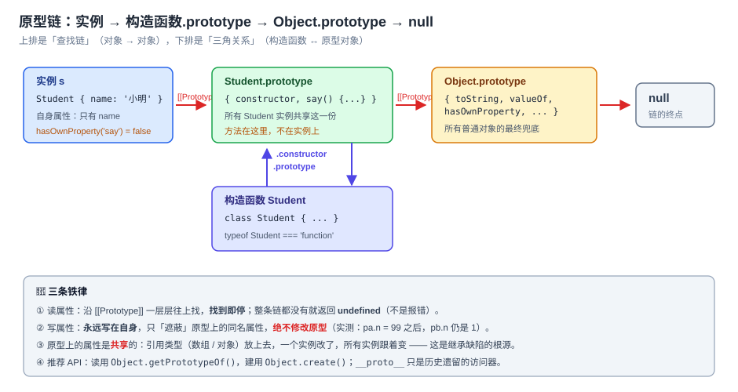
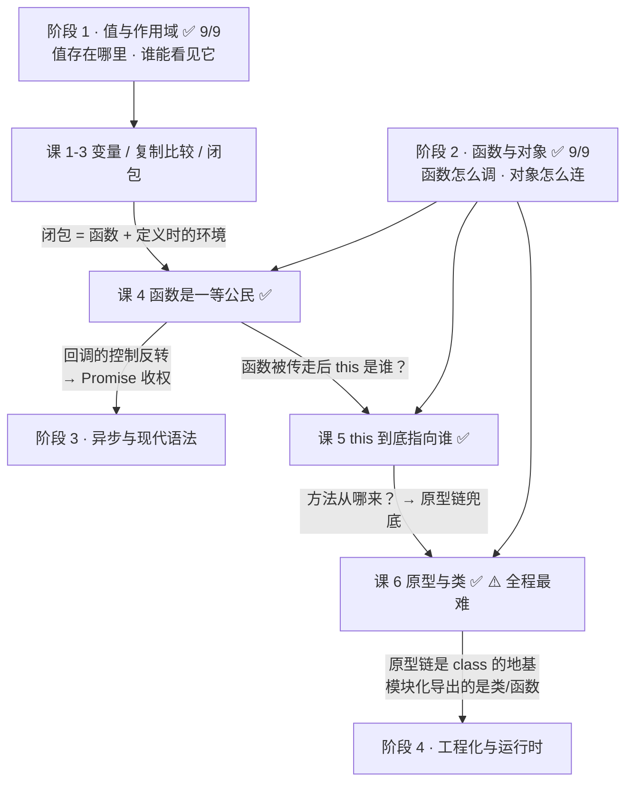
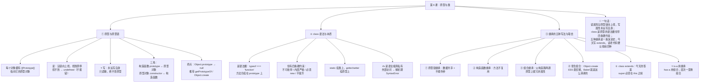

# 第 6 课：原型与类

> 所属阶段：阶段 2《函数与对象》｜ 水平：入门 ｜ 本课知识点：原型与原型链、class 语法与本质、继承的五种写法与取舍
> 故事情节：主角一直在用 `class` 写继承，直到某天打印一个对象，看到一串 `[[Prototype]]`——原来一直在用的东西，底下是另一套机制
> ⚠️ **本课是全程最难的一课**，采用**逆向讲法**：先用 `class` 正常写代码并跑通，再拆开看它背后的原型链。允许分两次学
> ✅ 状态：已完成（2026-09-02）｜ 实操环境：Node.js v22.14.0（文中所有输出均为本机实测）
> 🎉 **本课是阶段 2《函数与对象》的收官课**——学完它，JS 的两根支柱（函数、对象）就都立起来了

## 🎯 本课目标

- 画出 `prototype` / `__proto__` / `constructor` 的三角关系，说清属性查找的兜底顺序
- 给出"`class` 是语法糖"的证据，并用私有字段 `#x` 写出真正的私有属性
- 列出五种继承写法各自的缺陷，说清什么时候该用**组合**而非继承

## 📌 知识点导航

| # | 知识点 | 状态 |
|---|--------|------|
| 1 | 原型与原型链 | ✅ |
| 2 | class 语法与本质 | ✅ |
| 3 | 继承的五种写法与取舍 | ✅ |

---

## 第一幕：起源与场景引入

> 🏛️ **起源**：JS 的面向对象，走的是一条**少有人走的路**——世界上绝大多数语言（Java、C++、Python）都是"**基于类**"的，而 JS 骨子里是"**基于原型**"的。
>
> 原型这套机制来自 **Self 语言**：**David Ungar 与 Randall Smith 于 1986 年在施乐 PARC 设计**，随后两人转到斯坦福，**1987 年做出第一个可用的 Self 编译器**。Self 做了一个激进的决定——**彻底取消"类"**，对象直接从对象继承（复制一个现有对象再改，这就是原型）。（核查于 2026-09，来源：Wikipedia Self 词条；该词条亦将 **JavaScript** 列入 Self 的 "Influenced" 名单）
>
> Wikipedia 的原型编程词条给了一句精准的总结：*让原型的名字在学术界流行起来的语言是 Self（1985–1995，Ungar 与 Smith），而**让原型变得无处不在的语言是 JavaScript（1995 至今，Brendan Eich）**。*
>
> 于是就形成了本课要讲的这个"双层结构"：**1995 年 JS 自带的是原型继承；直到 2015 年的 ES6，才在上面加了一层 `class` 语法**——而它只是原型继承的**语法糖**（Wikipedia 原型编程词条，引 MDN Classes 页面）。
>
> 💡 所以本课有个反常识的顺序：**你已经会用的 `class` 是"后加的外衣"，你没见过的原型链才是"本来就有的身体"。**

> 🎬 **场景**：用 `class` 写一个学生类，一切顺利。

```js
class Student {
  constructor(name) { this.name = name; }
  say() { return '我是 ' + this.name; }
}

const s = new Student('小明');
s.say();            // '我是 小明'   ✅
```

写到这儿一切正常。然后你想给所有学生**动态加一个方法**（比如给第三方库的类补个能力），你试了一句：

```js
Student.prototype.study = () => '学习中';
s.study();          // '学习中'      ✅
```

**加在 `Student.prototype` 上，`s` 这个实例立刻就能用了。** 你盯着这行代码，忽然想到一个问题——`say` 到底在哪儿？于是你打印了 `s`：

```js
console.log(s);                    // Student { name: '小明' }
console.log(s.hasOwnProperty('say'));   // false  ← say 根本不在 s 上！
```

**`say` 不在实例上，`s.say()` 却跑得好好的；方法加在 `prototype` 上，实例立刻就能用。这中间到底发生了什么？**

---

## 第二幕：认知冲突

> ❓ **问题**：属性查找的时候，JS 到底去哪儿找的？

三个困惑，一个比一个深：

1. **`say` 明明不在 `s` 上，`s.say()` 凭什么能调用？** 它去哪儿找到的？
2. **`class` 到底是"真正的类"，还是别的东西？** 我明明写了 `class`，凭什么它和原型有关系？
3. **为什么老代码里全是 `Child.prototype = new Parent()`、`Parent.call(this, name)` 这种奇怪写法？** 继承到底有几种写法，各自差在哪？

| 困惑 | 答案藏在 |
|------|---------|
| `say` 不在实例上却能调用 | **知识点 1**：**原型链**——属性查找的兜底路径 |
| `class` 是真类还是别的 | **知识点 2**：class 的本质（**语法糖**）+ 私有字段 |
| 继承到底怎么写 | **知识点 3**：五种写法各自的缺陷 + 组合优于继承 |

> 💡 **本课采用逆向讲法**（阶段概览里已约定）：先让你看见 `class` 能正常用（第一幕已经跑通了），再一层层把它拆开。所以知识点 1 会**从你已经看到的怪现象出发**，而不是从 `prototype` 的定义出发。

---

## 第三幕：层层揭示

### 知识点 1：原型与原型链

> 本知识点关键点：`prototype`·`__proto__`·`constructor` 三角关系 / 属性查找与**属性屏蔽** / 原型链的终点与 `Object.prototype` / 类比：家族族谱 vs 共享工具间（并指出类比失效处）

#### 一句话定义

**每个对象都有一条内部指针 `[[Prototype]]`，指向它的"原型对象"。** 当你读取一个属性时，如果对象自己没有，JS 就**顺着这条链一层层往上找，找到即停；整条链都没有就返回 `undefined`**。这条由 `[[Prototype]]` 串起来的链，就叫**原型链**。

#### 直觉建立（类比）

把对象想成**一个员工，带着两个地方放东西**：

- **自己的抽屉**（自身属性）：`this.name = '小明'` 写在抽屉里，**每人一份，互不干扰**。
- **部门的共享工具间**（原型对象）：`say` 这类方法放在工具间，**全部门共用一份**。

要用工具时，先看自己抽屉（自身属性），没有就去工具间（原型），工具间也没有就去公司的总工具间（`Object.prototype`），还没有——**就没有了（返回 `undefined`，不是报错）**。

> ⚠️ **类比的边界（三处，非常重要，漏了就会踩坑）**：
>
> ① **两个类比各有对错的半边**：
> - 像"**家族族谱**"的部分：**查找是向上委托的**——自己没有就问爸爸，爸爸没有就问爷爷。这一点族谱比喻很准。
> - 不像"**共享工具间**"的部分：**工具间是所有实例共用同一份的**。改了工具间的东西，**所有实例看到的都变了**——族谱没有这个性质（爸爸变了不等于所有儿子都变）。
> - **结论**：*"家族族谱"比喻查找方向，"共享工具间"比喻共享风险。两个合起来才完整。*
>
> ② **"取用"和"放东西"的规则是反的**（这是本知识点最容易踩的坑）：
> - **读**：自己没有 → 沿链往上找；
> - **写**：**永远写在自己抽屉里**，只是"遮蔽"了原型上的同名属性，**绝不会改到原型**。所以 `pa.n = 99` 之后，`pb.n` 仍然是 `1`。
>
> ③ **工具间里放"共享的工具"（方法）很合适，但放"Array / Object 这类引用值"是灾难**——因为所有实例拿到的是**同一个数组**，一个改了全都变（下面有实测）。

#### 核心原理

**① 全景图：原型链 + 三角关系**



四个关键等式（全部实测）：

```js
Object.getPrototypeOf(s) === Student.prototype;                 // true
Student.prototype.constructor === Student;                      // true
Object.getPrototypeOf(Student.prototype) === Object.prototype;  // true
Object.getPrototypeOf(Object.prototype) === null;               // true  ← 链的终点
```

**② 三个名字，别再混了**

| 名字 | 是什么 | 谁有 |
|------|--------|------|
| **`prototype`** | 一个**普通属性**，指向"用我 `new` 出来的实例的原型对象" | **只有函数（含 `class`）有**；普通对象没有 |
| **`[[Prototype]]`** | 对象内部的**隐藏槽位**，指向它的原型 | **所有对象都有** |
| **`__proto__`** | 读写 `[[Prototype]]` 的**历史遗留访问器**（挂在 `Object.prototype` 上） | 都能点出来，但**不推荐用** |
| **`constructor`** | 原型对象上的属性，指回构造函数 | 原型对象上默认有 |

```js
// __proto__ 其实是个访问器（getter/setter），不是真正的属性 —— 实测：
Object.getOwnPropertyDescriptor(Object.prototype, '__proto__');
// { get: [Function: get __proto__], set: [Function: set __proto__], ... }
```

> 📌 **推荐 API**：读用 `Object.getPrototypeOf(obj)`，建用 `Object.create(proto)`，改（谨慎）用 `Object.setPrototypeOf(obj, proto)`。`__proto__` 是历史遗留，MDN 明确不建议在生产代码里用它。

**③ 属性查找：找到即停，找不到返回 `undefined`**

```js
s.toString === Object.prototype.toString;   // true  ← s 自己没有，一路找到 Object.prototype
s.不存在的属性;                              // undefined  ← 不抛 ReferenceError！
'say' in s;                                 // true   ← in 会查整条链
s.hasOwnProperty('say');                    // false  ← 只看自身
Object.keys(s);                             // [ 'name' ]  ← 只列自身可枚举属性
```

**④ 属性屏蔽（Property Shadowing）：写只写自身**

```js
function P() {}
P.prototype.n = 1;
const pa = new P(), pb = new P();

pa.n = 99;             // ← 只是给 pa 自己加了个 n，遮蔽了原型上的 n
// 实测：
//   pa.n = 99 / pb.n = 1 / P.prototype.n = 1
//   pa.hasOwnProperty('n') = true / pb.hasOwnProperty('n') = false
```

> 🔑 这一点由 Wikipedia 的原型编程词条背书：JS 采用委托模型，**"对子对象的修改总是记录在子对象自身，绝不会写进父对象（子对象的值遮蔽父对象的值，而不是改变它）"**。
>
> 换句话说：**实例能"读到"原型，但改不动原型。** 想真的改原型，得显式写 `Student.prototype.x = ...`。

**⑤ 原型上的引用值是共享的（继承缺陷的根源）**

```js
function P2() { this.friends = ['a']; }   // 写在 this 上 → 各自一份
const x1 = new P2(), x2 = new P2();
x1.friends.push('b');
// 实测：x1.friends = ['a','b']  x2.friends = ['a']   ✅ 互不影响

function P3() {}
P3.prototype.friends = ['a'];             // 写在原型上 → 共享一份
const y1 = new P3(), y2 = new P3();
y1.friends.push('b');
// 实测：y1.friends = ['a','b']  y2.friends = ['a','b']  ⚠️ 串了！
```

记住这条，知识点 3 讲"原型链继承为什么烂"时会直接用到它。

#### 示例演示

```js
// ① 三角关系四等式
Object.getPrototypeOf(s) === Student.prototype;                 // true
Student.prototype.constructor === Student;                      // true
Object.getPrototypeOf(Student.prototype) === Object.prototype;  // true
Object.getPrototypeOf(Object.prototype) === null;               // true

// ② 读查链、写写自身
P.prototype.n = 1;
pa.n = 99;    // pa.n=99  pb.n=1  P.prototype.n=1

// ③ 共享引用值的灾难
P3.prototype.friends = ['a'];
y1.friends.push('b');   // y1 和 y2 都变成 ['a','b']
```

#### 常见误区

1. **"实例上有一份方法的副本"** → 不。方法只存在于原型上，所有实例**共享同一份**——这正是原型继承省内存的原因。
2. **"改实例属性会改到原型"** → 不。写操作**永远写在自身**，只遮蔽，绝不改原型（想改原型得显式写 `Fn.prototype.x = ...`）。
3. **"`__proto__` 和 `prototype` 是一回事"** → 不。`prototype` 是**函数**的属性；`[[Prototype]]`（`__proto__`）是**对象**的槽位。`s.prototype` 是 `undefined`，`Student.__proto__` 是 `Function.prototype`。
4. **"找不到属性会报错"** → 不，返回 `undefined`。这也是很多 bug 静默发生的原因。
5. **"原型上放什么都行"** → 不行。**引用类型放原型上会被所有实例共享**，是经典事故源（方法放上去没问题，数据放上去要小心）。

#### 一句话记住

> **对象有一条 `[[Prototype]]` 指针指向原型；读属性沿链向上找、找到即停、找不到返回 `undefined`，写属性永远只写自身（遮蔽而非修改）；原型上的东西是所有实例共享的——方法共享是优点，数据共享是陷阱。**

> ✅ **困惑 1 已解**：`say` 不在 `s` 上，但 `s` 的 `[[Prototype]]` 指向 `Student.prototype`，`say` 就在那儿。所以 `s.say()` 能跑；所以往 `Student.prototype` 上加方法，所有实例（包括**之前就创建好的** `s`）立刻就能用。

#### 官方文档

- [对象原型 - MDN](https://developer.mozilla.org/zh-CN/docs/Learn_web_development/Extensions/Advanced_JavaScript_objects/Object_prototypes)
- [继承与原型链 - MDN](https://developer.mozilla.org/zh-CN/docs/Web/JavaScript/Guide/Inheritance_and_the_prototype_chain)
- [Object.getPrototypeOf - MDN](https://developer.mozilla.org/zh-CN/docs/Web/JavaScript/Reference/Global_Objects/Object/getPrototypeOf)
- [Object.create - MDN](https://developer.mozilla.org/zh-CN/docs/Web/JavaScript/Reference/Global_Objects/Object/create)

---

### 知识点 2：class 语法与本质

> 本知识点关键点：`class` 是语法糖，证据是什么（`typeof`、可不用 `new` 调用会报错等）/ 静态方法与私有字段 `#` / `getter`·`setter` / 与 ES5 构造函数的等价与差异

#### 一句话定义

**`class` 没有引入新的对象模型。** 它只是让我们**用更像类的写法**，去搭出知识点 1 讲的那一套原型结构。它的本质仍然是：**一个构造函数 + 一个 `prototype` 对象**。

#### 直觉建立（类比）

`class` 就像是给原型机制**套上的一件"西装"**：

- 穿着西装（用 `class`）时，你看上去像个正经的"类"，有 `constructor`、有 `extends`、有 `super`；
- 脱下西装（`typeof`）一看，**里面还是那个函数**，方法还是挂在 `prototype` 上。

西装的作用不是改变身体，而是**让读代码的人（尤其是从 Java / C++ 过来的人）一眼看懂**。

> 💡 **类比的边界**：西装不只是装饰，它带来了**四条真实的行为差异**（class 方法不可枚举、内部严格模式、不能不用 `new` 调用、不提升）。所以"class 只是语法糖"这句话**只对一半**——**底层机制是同一套，但语义约束是真实新增的**。这也是为什么不能简单地把 `class` 和 ES5 构造函数完全划等号。

#### 核心原理

**① "`class` 是语法糖"的五条证据（全部实测）**

| # | 证据 | 实测结果 |
|---|------|----------|
| ① | `typeof` | `typeof Clean === 'function'` ← **它就是个函数** |
| ② | 方法仍在原型上 | `Object.getOwnPropertyNames(Clean.prototype)` → `[ 'constructor', 'say' ]` |
| ③ | 原型结构一致 | `Object.getPrototypeOf(实例) === Clean.prototype` → `true` |
| ④ | 实例仍是普通对象 | `实例 instanceof Clean` → `true` |
| ⑤ | 可以用原型 API 操作它 | `Clean.prototype.xxx = ...` 对已创建的实例**立刻生效**（第一幕已验证） |

**② 但 `class` 有四条 ES5 写法没有的硬约束（也全部实测）**

| 约束 | 实测 |
|------|------|
| **方法不可枚举** | `Object.keys(Clean.prototype)` → `[]`；而 ES5 写法 `Object.keys(Es5Clean.prototype)` → `[ 'say' ]` |
| **内部默认严格模式** | 类方法里裸调 `function(){ return this }` → `undefined`；ES5 函数里 → `globalThis` |
| **必须 `new` 调用** | `Clean()` → `TypeError: Class constructor Clean cannot be invoked without 'new'` |
| **不提升（TDZ）** | 声明前使用 → `ReferenceError: Cannot access 'NotYet' before initialization` |

> 🎯 最后一条尤其重要：**函数声明整体提升（课 3 讲过），`class` 不提升**。所以 `class` 必须先定义后使用。

**③ `class` 语法全览（含私有字段、静态、`getter`）**

```js
class Bank {
  #balance = 0;                    // 私有字段（ES2022）：只有类内部能访问
  static bankName = 'JS 银行';     // 静态字段：挂在类本身，不在实例上

  constructor(bal) { this.#balance = bal; }

  get balance() { return this.#balance; }   // getter：读起来像属性
  deposit(n) { this.#balance += n; }        // 实例方法：挂在 prototype 上

  static info() { return Bank.bankName; }   // 静态方法：Bank.info() 调用
}

const acc = new Bank(100);
acc.deposit(50);
acc.balance;               // 150           （getter）
Bank.info();               // 'JS 银行'      （静态方法）
Object.keys(acc);          // []             ← #balance 不在里面
acc['#balance'];           // undefined      ← 连字符串下标都拿不到
```

**④ 私有字段 `#x` 为什么是"真正的私有"**

课 3 讲过用闭包做私有变量（`let n = 0`，外部访问不到）。`#x` 是语言级的替代方案，而且**更强**：

| 对比 | 闭包私有变量 | `#x` 私有字段 |
|------|-------------|--------------|
| 外部读取 | `undefined` | `undefined` |
| 外部**访问**（写代码时） | 不报错，拿到 `undefined` | ❌ **直接 `SyntaxError`，整个文件编译失败** |
| 能否被 `Object.keys` 列出 | 不能 | 不能 |
| 多个实例是否共享 | 取决于写法 | 每个实例各一份 |

实测：在类外写 `acc.#balance`，Node 直接抛出——

```
SyntaxError: Private field '#balance' must be declared in an enclosing class
```

⚠️ **注意它是 `SyntaxError`（解析期错误），不是运行时错误**——`try/catch` **抓不到**，整个 JS 文件根本不会被执行。这是 `#x` 与"约定俗成的 `_x` 下划线前缀"最本质的区别：后者只是君子协定，前者是**语法层面的硬封锁**。

**⑤ `class` vs ES5 构造函数：对照表**

| 维度 | ES5 构造函数 | `class` |
|------|-------------|---------|
| `typeof` | `'function'` | `'function'`（一样） |
| 方法位置 | `Fn.prototype.m = function(){}` | 类体内直接写 |
| 方法可枚举 | **是** | **否** |
| 严格模式 | 默认非严格 | **默认严格** |
| 不用 `new` | 允许（`this` 会落到全局） | **报错** |
| 提升 | **整体提升** | **不提升（TDZ）** |
| 继承 | 手工接原型链（见知识点 3） | `extends` + `super` |
| 私有 | 只能靠闭包 | `#x` |

#### 示例演示

```js
class Clean {
  constructor(name) { this.name = name; }
  say() { return '我是 ' + this.name; }
  static create(n) { return new Clean(n); }
}
function Es5Clean(name) { this.name = name; }
Es5Clean.prototype.say = function () { return '我是 ' + this.name; };

typeof Clean;                              // 'function'
Object.keys(Clean.prototype);              // []        ← 不可枚举
Object.keys(Es5Clean.prototype);           // [ 'say' ] ← 可枚举
Object.getOwnPropertyNames(Clean);         // [ 'length', 'name', 'prototype', 'create' ]（static 在类上）
Clean();                                   // TypeError: Class constructor ... without 'new'
new NotYet();                              // ReferenceError（TDZ）
class NotYet {}
```

#### 常见误区

1. **"`class` 引入了真正的类，和原型无关了"** → 不，底层仍是原型链，`typeof` 仍是 `'function'`。
2. **"`class` 和 ES5 构造函数完全等价，只是换个写法"** → 不，有**四条真实差异**（不可枚举 / 严格模式 / 必须 `new` / 不提升）。
3. **"`class` 会提升，可以先用后定义"** → 不，`class` 有 TDZ，必须先定义。
4. **"`#x` 只是把属性名加了 `#`，绕一绕还能拿到"** → 拿不到。它是**语法层面**的私有，外部访问直接 `SyntaxError`（解析期，连 `try/catch` 都抓不到）。
5. **"静态方法也能被实例调用"** → 不能。`static` 方法挂在**类本身**上，`acc.info()` 会报 `TypeError`。

#### 一句话记住

> **`class` 是原型继承的语法糖——底层仍是"函数 + prototype"，但它额外带来了四条硬约束（方法不可枚举、内部严格、必须 `new`、不提升）；私有字段 `#x` 是语言级的真私有，外部访问会在解析期直接报 `SyntaxError`。**

> ✅ **困惑 2 已解**：`class` 不是"真正的类"，它是给原型机制套的一件西装——`typeof` 一验就露馅（`'function'`），方法照样挂在 `prototype` 上（第一幕往 `Student.prototype` 上加方法能立刻生效，就是铁证）。但西装不是纯装饰：它带来了四条 ES5 没有的硬约束。

#### 官方文档

- [类 - MDN](https://developer.mozilla.org/zh-CN/docs/Web/JavaScript/Reference/Classes)
- [私有属性 - MDN](https://developer.mozilla.org/zh-CN/docs/Web/JavaScript/Reference/Classes/Private_properties)
- [static - MDN](https://developer.mozilla.org/zh-CN/docs/Web/JavaScript/Reference/Classes/static)
- [extends - MDN](https://developer.mozilla.org/zh-CN/docs/Web/JavaScript/Reference/Classes/extends)

---

### 知识点 3：继承的五种写法与取舍

> 本知识点关键点：原型链继承 / 构造函数继承 / 组合继承 / 寄生组合继承 / `class extends` / 各自的缺陷（共享引用属性、无法传参、调用两次父类构造等）/ 什么时候该用组合而非继承

#### 一句话定义

JS 的继承**只有一种底层机制**——原型链（知识点 1）。所谓"五种写法"，是 ES5 时代的程序员在这个机制上**手工搭出继承关系的五种工程方案**，外加 ES6 提供的标准答案 `class extends`。它们不是五种"等价选项"，而是**一条从有明显缺陷到逐步完善的演进路线**。

#### 直觉建立（类比）

想让儿子继承爸爸的东西，有几种做法：

1. **照着爸爸抄一份家产清单**（`Child.prototype = new Parent()`）：清单上写着"工具间"，结果**全家人共用同一个工具间**——一个儿子往里放了把锤子，其他儿子打开也都是那把锤子。
2. **把爸爸请来，当着儿子的面再执行一遍**（`Parent.call(this)`）：东西倒是**一人一份**了，但爸爸身上的**本事（方法）没传下来**，每个儿子都得重新学一遍。
3. **①② 一起上**：东西一人一份、本事也传下来了，但**爸爸被折腾了两趟**。
4. **只抄爸爸的"本事清单"，不当面执行一遍**（`Object.create`）：最省事，也最正确。
5. **直接说"我是他儿子"**（`class extends`）：语言替你把上面这些全做了。

> 💡 **类比的边界**：这个类比里的"爸爸"其实有**两副身家**——**写在 `this` 上的数据**（每个实例该有一份）和**写在 `prototype` 上的方法**（所有实例该共享一份）。五种写法的全部差异，说白了就是"**这两样东西分别怎么处理**"。抓住这条线索，五种写法就不用死记了。

#### 核心原理

**对照总表**（先给结论，下面逐个拆）：

| # | 写法 | 实例数据 | 方法复用 | 主要缺陷 |
|---|------|---------|---------|---------|
| ① | 原型链继承 | ❌ 共享 | ✅ | 引用属性共享 + **不能向父构造传参** |
| ② | 构造函数继承 | ✅ 独立 | ❌ | 方法无法复用，每实例一份 |
| ③ | 组合继承 | ✅ 独立 | ✅ | 父构造**被调用两次**，原型上留冗余属性 |
| ④ | **寄生组合继承** | ✅ 独立 | ✅ | ES5 时代最优解，写法繁琐 |
| ⑤ | **`class extends`** | ✅ 独立 | ✅ | **现在的标准答案**（ES6+） |

---

**① 原型链继承** —— `Child.prototype = new Parent()`

```js
function Parent1(name) { this.name = name; this.friends = ['a']; }
Parent1.prototype.say = function () { return '我是 ' + this.name; };

function Child1() {}
Child1.prototype = new Parent1('父类原型实例');   // ← 拿父类的一个「实例」当子类的原型
```

**两个致命缺陷（实测）**：

```js
const c1a = new Child1(), c1b = new Child1();
c1a.friends.push('b');
// c1a.friends = ['a','b']   c1b.friends = ['a','b']   ⚠️ 两个实例的数据串了
// c1a.name = '父类原型实例'  ← 写死在原型上，根本没法给每个实例传不同的名字
```

- **缺陷 A**：父构造函数里 `this.friends = ['a']` 变成**原型上的共享属性**（回扣知识点 1 第 ⑤ 条）→ 一个改了全都变。
- **缺陷 B**：创建子类型时**无法向父构造函数传参**——你想传，参数只能写死在 `new Parent1('...')` 那一行。

---

**② 构造函数继承** —— `Parent.call(this, name)`

```js
function Parent2(name) {
  this.name = name;
  this.say = function () { return '我是 ' + this.name; };   // 只能写在构造函数里
}
function Child2(name) {
  Parent2.call(this, name);     // ← 借父构造函数，把属性「抄」到子实例上
}
```

**能传参了，数据也独立了**，但：

```js
new Child2('a').say === new Child2('b').say;   // false  ← 每个实例各有一份 say
```

**缺陷**：方法只能定义在构造函数内部 → **每个实例各生成一份**，无法复用。这违背了原型机制"方法共享"的初衷，内存浪费。

---

**③ 组合继承**（① + ②）—— ES5 时代最常见的写法

```js
function Parent3(name) { this.name = name; this.friends = ['a']; }
Parent3.prototype.say = function () { return '我是 ' + this.name; };

function Child3(name) {
  Parent3.call(this, name);        // 第二次调用（每 new 一次都调）
}
Child3.prototype = new Parent3();  // 第一次调用（建立原型链，全局一次）
Child3.prototype.constructor = Child3;
```

**它修好了前两种的主要缺陷**（数据独立 + 方法复用），但引入一个新问题（实测）：

```
建立原型链后，父构造已调用 1 次
new 一个 Child3 后，父构造共调用 2 次   ⚠️
原型上有多余的 name 吗 → true         ⚠️
```

**缺陷**：父构造函数被**调用了两次**——一次在建立原型链时（`new Parent3()`），一次在每次实例化时（`Parent3.call(this)`）。后果是**实例上有一份 `name`，原型上还躺着一份多余的 `name`**，白白占内存，还可能造成不一致。

---

**④ 寄生组合继承** —— ES5 的**最优解**

```js
function Parent4(name) { this.name = name; this.friends = ['a']; }
Parent4.prototype.say = function () { return '我是 ' + this.name; };

function Child4(name) {
  Parent4.call(this, name);                            // 只调用这一次
}
// 关键：用 Object.create 建立原型链 —— 它「只接原型，不执行父构造」
Child4.prototype = Object.create(Parent4.prototype);
Child4.prototype.constructor = Child4;
```

实测：

```
建立原型链后，父构造已调用 0 次   ✅
new 一个 Child4 后，父构造共调用 1 次   ✅
原型上有多余的 name 吗 → false   ✅
instanceof Child4 / Parent4 → true / true   ✅
```

**灵魂一步是 `Object.create(Parent4.prototype)`**——它创建一个**空的新对象，只把 `[[Prototype]]` 指向 `Parent4.prototype`**，**完全不执行 `Parent4` 的构造函数**：

```js
const byNew    = new Base();                  // Base { tag: 'Base' }  ← 执行了构造函数，带上了 tag
const byCreate = Object.create(Base.prototype); // Base {}              ← 没有 tag，只接了原型
// 但两者都能调用原型上的方法：byNew.hi() / byCreate.hi() 都是 'hi'
```

> 📌 这正是 **Babel 把 `class` 转译成 ES5 时用的方案**。所以你在编译产物里看到的 `_inherits` / `Object.create` 那一堆代码，就是在干这件事。

---

**⑤ `class extends`** —— 现在的标准答案

```js
class Parent5 {
  constructor(name) { this.name = name; }
  say() { return '我是 ' + this.name; }
}
class Child5 extends Parent5 {
  constructor(name, grade) {
    super(name);          // ← 必须先调 super，才能用 this
    this.grade = grade;
  }
  study() { return this.name + ' 在 ' + this.grade + ' 年级'; }
}

const c5 = new Child5('小明', 3);
c5.say();     // '我是 小明'      ← 继承自 Parent5.prototype
c5.study();   // '小明 在 3 年级'  ← 自己的方法
Object.getPrototypeOf(Child5) === Parent5;   // true  ← 静态方法也能继承
```

**为什么 `super()` 必须在 `this` 之前？** 实测：

```js
class Bad extends Parent5 {
  constructor() { this.x = 1; super(); }   // ❌
}
// ReferenceError: Must call super constructor in derived class
//   before accessing 'this' or returning from derived constructor
```

原因很直接：**在派生类里，`this` 是由 `super()`（也就是父类构造函数）创建出来的**。回扣课 5——父类的构造函数负责 `this` 的初始化；在它跑完之前，`this` 还不存在，所以你不能用它。

> 🎯 **一句话总结这条演进路线**：**① 数据共享 → ② 方法不复用 → ③ 父构造跑两趟 → ④ 用 `Object.create` 精修 → ⑤ 语言帮你全做了。** 你现在能直接写 ⑤，但**读懂老代码需要认识 ①③④**，面试也常考"为什么 ④ 比 ③ 好"。

#### 该用继承还是组合？（大纲要求的收口）

**判据一句话**：**"是一种（is-a）"用继承，"有一个（has-a）"用组合。**

```js
// ❌ 继承：Car 并不是「一种」Engine
class Car extends Engine {
  start() { return this.type + ' 引擎启动，车往前走'; }
}

// ✅ 组合：Car 「有一个」Engine
class Engine {
  constructor(type) { this.type = type; }
  start() { return this.type + ' 引擎启动'; }
}
class Car {
  constructor() { this.engine = new Engine('V6'); }   // 持有，而不是继承
  start() { return this.engine.start() + '，车往前走'; }
}
new Car().start();   // 'V6 引擎启动，车往前走'
```

**为什么组合更受推崇**：

| 维度 | 继承 | 组合 |
|------|------|------|
| 耦合度 | **强耦合**——改父类可能破坏所有子类（脆弱基类问题） | **松耦合**——换一个 `Engine` 实现，不影响 `Car` |
| 灵活性 | 关系在**编译期定死**，运行时改不了 | 运行时可替换（`this.engine = new ElectricEngine()`） |
| 层次 | 需求一变就出现"菱形继承""多层继承"泥潭 | 扁平，按需拼装 |

**什么时候该用继承**：确实是"is-a"关系（如 `Student extends Person`），且**层次很浅（一两层）**时——继承读起来最自然。除此之外，优先组合。

#### 示例演示

见上方各段（全部为实测）。完整可运行版本见**第四幕**的 `l6-demo.js`。

#### 常见误区

1. **"`Child.prototype = Parent.prototype` 就够了"** → **大错**。这样两者指向**同一个对象**，给子类加方法会污染父类（`Child.prototype.childMethod = ...` 之后，父类实例也能调到）。正确做法是 `Object.create(Parent.prototype)` 或 `Object.setPrototypeOf`。
2. **"忘了写 `Child.prototype.constructor = Child`"** → `constructor` 会指向 `Parent`，`实例.constructor` 判断出错。这是寄生组合继承里最容易漏的一行。
3. **"`super()` 可以放在构造函数最后"** → 不行，派生类里**必须先 `super()` 才能用 `this`**。
4. **"继承层次越深越体现设计能力"** → 相反。层次越深越脆弱，超过两层就该考虑组合了。
5. **"组合就是不用继承"** → 组合是**优先**而非唯一。`Student extends Person` 这种清晰的两层 is-a 关系，用继承最简单也最易读。

#### 一句话记住

> **五种继承是一段演进史：① 共享数据 → ② 方法不复用 → ③ 父构造跑两趟 → ④ `Object.create` 精修 → ⑤ `class extends` 是今天的答案；而"是一种"用继承、"有一个"用组合，层次一深就该换组合。**

> ✅ **困惑 3 已解**：老代码里那些奇怪写法（① `Child.prototype = new Parent()`、② `Parent.call(this, name)`、③ 两者叠用、④ `Object.create` 版）是**同一条演进路线上的四个阶段**，各自在修前一种的缺陷。今天有新项目直接用 ⑤，但读老代码和面试时，这条路线要认得全。

#### 官方文档

- [继承与原型链 - MDN](https://developer.mozilla.org/zh-CN/docs/Web/JavaScript/Guide/Inheritance_and_the_prototype_chain)
- [super - MDN](https://developer.mozilla.org/zh-CN/docs/Web/JavaScript/Reference/Operators/super)
- [Object.create - MDN](https://developer.mozilla.org/zh-CN/docs/Web/JavaScript/Reference/Global_Objects/Object/create)

---

## 第四幕：实操验证

把下面代码存成 `l6-demo.js`，用 `node l6-demo.js` 运行（本机 Node.js v22.14.0）：

```js
// l6-demo.js —— 回扣第一幕：把能正常工作的 class 一层层拆开
console.log('=== 1. 第一幕：方法不在实例上，却能调用 ===');
class Student {
  constructor(name) { this.name = name; }
  say() { return '我是 ' + this.name; }
}
const s = new Student('小明');
console.log('  s                       =', s);
console.log('  s.hasOwnProperty("say") =', s.hasOwnProperty('say'), '← say 不在实例上');
console.log('  s.say()                 =', s.say(), '← 却能调用');
Student.prototype.study = () => '学习中';
console.log('  加在 prototype 上后 s.study() =', s.study());

console.log('\n=== 2. 三角关系与链的末端 ===');
console.log('  getPrototypeOf(s) === Student.prototype        :', Object.getPrototypeOf(s) === Student.prototype);
console.log('  Student.prototype.constructor === Student      :', Student.prototype.constructor === Student);
console.log('  getPrototypeOf(Student.prototype) === Object.prototype :', Object.getPrototypeOf(Student.prototype) === Object.prototype);
console.log('  getPrototypeOf(Object.prototype) === null      :', Object.getPrototypeOf(Object.prototype) === null);

console.log('\n=== 3. 读 vs 写：读查链，写只写自身 ===');
function P() {}
P.prototype.n = 1;
const pa = new P(), pb = new P();
pa.n = 99;
console.log('  pa.n / pb.n / P.prototype.n :', pa.n, '/', pb.n, '/', P.prototype.n, '← 写没改到原型');
console.log('  pa.hasOwnProperty("n")      :', pa.hasOwnProperty('n'));
console.log('  pb.hasOwnProperty("n")      :', pb.hasOwnProperty('n'));
console.log('  s.不存在的属性              :', s.不存在的属性, '← 找不到返回 undefined，不报错');
console.log('  "say" in s（in 查整条链）   :', 'say' in s);

console.log('\n=== 4. 引用类型放原型上 → 所有实例共享 ===');
function P2() { this.friends = ['a']; }
const x1 = new P2(), x2 = new P2();
x1.friends.push('b');
console.log('  写在 this 上     : x1 =', x1.friends, '| x2 =', x2.friends);
function P3() {}
P3.prototype.friends = ['a'];
const y1 = new P3(), y2 = new P3();
y1.friends.push('b');
console.log('  写在 prototype 上: y1 =', y1.friends, '| y2 =', y2.friends, '⚠️ 串了');

console.log('\n=== 5. class 的本质：五条证据 ===');
class Clean {
  constructor(name) { this.name = name; }
  say() { return '我是 ' + this.name; }
  static create(n) { return new Clean(n); }
}
function Es5Clean(name) { this.name = name; }
Es5Clean.prototype.say = function () { return '我是 ' + this.name; };
console.log('  ① typeof Clean                    :', typeof Clean, '← 它就是个函数');
console.log('  ② Object.keys(Clean.prototype)    :', Object.keys(Clean.prototype), '(class 方法不可枚举)');
console.log('     Object.keys(Es5Clean.prototype):', Object.keys(Es5Clean.prototype), '(ES5 写法可枚举)');
console.log('     getOwnPropertyNames(Clean.prototype):', Object.getOwnPropertyNames(Clean.prototype), '← 方法确实在原型上');
console.log('  ③ static 挂在类本身上:', Object.getOwnPropertyNames(Clean));
class StrictInside { m() { return (function () { return this; })(); } }
console.log('  ④ class 内部默认严格，裸调 this 得到:', new StrictInside().m());
function Es5Sloppy() { return (function () { return this; })(); }
console.log('     ES5 函数默认非严格（对照）      :', Es5Sloppy() === globalThis);
try { Clean(); } catch (e) { console.log('  ⑤ 不用 new 调用 =>', e.constructor.name + ':', e.message); }
try { new NotYet(); } catch (e) { console.log('     声明前使用   =>', e.constructor.name + ':', e.message); }
class NotYet {}

console.log('\n=== 6. 私有字段 #x：真正的私有 ===');
class Bank {
  #balance = 0;
  static bankName = 'JS 银行';
  constructor(bal) { this.#balance = bal; }
  get balance() { return this.#balance; }
  deposit(n) { this.#balance += n; }
  static info() { return Bank.bankName; }
}
const acc = new Bank(100);
acc.deposit(50);
console.log('  acc.balance (getter) =', acc.balance);
console.log('  Bank.info() (static) =', Bank.info());
console.log('  Object.keys(acc)     =', Object.keys(acc), '← #balance 不在里面');
console.log('  acc["#balance"]      =', acc['#balance'], '← 也拿不到（它不是字符串属性）');

console.log('\n=== 7. 五种继承写法逐个实测 ===');
// ① 原型链继承
function Parent1(name) { this.name = name; this.friends = ['a']; }
Parent1.prototype.say = function () { return '我是 ' + this.name; };
function Child1() {}
Child1.prototype = new Parent1('父类原型实例');
const c1a = new Child1(), c1b = new Child1();
c1a.friends.push('b');
console.log('  ① 原型链继承  : c1a.friends =', c1a.friends, '| c1b.friends =', c1b.friends, '⚠️ 共享引用');
console.log('                  且 c1a.name =', c1a.name, '← 写死在原型上，无法传参');

// ② 构造函数继承
function Parent2(name) { this.name = name; this.say = function () { return '我是 ' + this.name; }; }
function Child2(name) { Parent2.call(this, name); }
const c2 = new Child2('小红');
console.log('  ② 构造函数继承: c2.say() =', c2.say(), '| 方法能复用吗 →', new Child2('a').say === new Child2('b').say, '⚠️ 每实例一份');

// ③ 组合继承
let pc = 0;
function Parent3(name) { pc++; this.name = name; this.friends = ['a']; }
Parent3.prototype.say = function () { return '我是 ' + this.name; };
function Child3(name) { Parent3.call(this, name); }
Child3.prototype = new Parent3();
Child3.prototype.constructor = Child3;
console.log('  ③ 组合继承    : 建原型链后父构造调用', pc, '次');
const c3 = new Child3('小刚');
console.log('                  new 一个实例后共', pc, '次 ⚠️ | 原型上有多余 name 吗 →', Object.getPrototypeOf(c3).hasOwnProperty('name'));

// ④ 寄生组合继承
let pc4 = 0;
function Parent4(name) { pc4++; this.name = name; this.friends = ['a']; }
Parent4.prototype.say = function () { return '我是 ' + this.name; };
function Child4(name) { Parent4.call(this, name); }
Child4.prototype = Object.create(Parent4.prototype);
Child4.prototype.constructor = Child4;
console.log('  ④ 寄生组合继承: 建原型链后父构造调用', pc4, '次 ✅');
const c4 = new Child4('小丽');
console.log('                  new 一个实例后共', pc4, '次 ✅ | 原型上有多余 name 吗 →', Object.getPrototypeOf(c4).hasOwnProperty('name'));
console.log('                  instanceof Child4 / Parent4 :', c4 instanceof Child4, '/', c4 instanceof Parent4);

// ⑤ class extends
class Parent5 {
  constructor(name) { this.name = name; }
  say() { return '我是 ' + this.name; }
}
class Child5 extends Parent5 {
  constructor(name, grade) { super(name); this.grade = grade; }
  study() { return this.name + ' 在 ' + this.grade + ' 年级'; }
}
const c5 = new Child5('小明', 3);
console.log('  ⑤ class extends: c5.say() =', c5.say(), '| c5.study() =', c5.study());
console.log('                  静态也继承：getPrototypeOf(Child5) === Parent5 →', Object.getPrototypeOf(Child5) === Parent5);
try {
  class Bad extends Parent5 { constructor() { this.x = 1; super(); } }
  new Bad();
} catch (e) { console.log('                  super 之前用 this =>', e.constructor.name + ': ' + e.message); }

console.log('\n=== 8. 组合优于继承：Car 有一个 Engine，而不是「是一种」Engine ===');
class Engine {
  constructor(type) { this.type = type; }
  start() { return this.type + ' 引擎启动'; }
}
class Car {
  constructor() { this.engine = new Engine('V6'); }
  start() { return this.engine.start() + '，车往前走'; }
}
console.log(' ', new Car().start());
```

**实测输出**：

```
=== 1. 第一幕：方法不在实例上，却能调用 ===
  s                       = Student { name: '小明' }
  s.hasOwnProperty("say") = false ← say 不在实例上
  s.say()                 = 我是 小明 ← 却能调用
  加在 prototype 上后 s.study() = 学习中

=== 2. 三角关系与链的末端 ===
  getPrototypeOf(s) === Student.prototype        : true
  Student.prototype.constructor === Student      : true
  getPrototypeOf(Student.prototype) === Object.prototype : true
  getPrototypeOf(Object.prototype) === null      : true

=== 3. 读 vs 写：读查链，写只写自身 ===
  pa.n / pb.n / P.prototype.n : 99 / 1 / 1 ← 写没改到原型
  pa.hasOwnProperty("n")      : true
  pb.hasOwnProperty("n")      : false
  s.不存在的属性              : undefined ← 找不到返回 undefined，不报错
  "say" in s（in 查整条链）   : true

=== 4. 引用类型放原型上 → 所有实例共享 ===
  写在 this 上     : x1 = [ 'a', 'b' ] | x2 = [ 'a' ]
  写在 prototype 上: y1 = [ 'a', 'b' ] | y2 = [ 'a', 'b' ] ⚠️ 串了

=== 5. class 的本质：五条证据 ===
  ① typeof Clean                    : function ← 它就是个函数
  ② Object.keys(Clean.prototype)    : [] (class 方法不可枚举)
     Object.keys(Es5Clean.prototype): [ 'say' ] (ES5 写法可枚举)
     getOwnPropertyNames(Clean.prototype): [ 'constructor', 'say' ] ← 方法确实在原型上
  ③ static 挂在类本身上: [ 'length', 'name', 'prototype', 'create' ]
  ④ class 内部默认严格，裸调 this 得到: undefined
     ES5 函数默认非严格（对照）      : true
  ⑤ 不用 new 调用 => TypeError: Class constructor Clean cannot be invoked without 'new'
     声明前使用   => ReferenceError: Cannot access 'NotYet' before initialization

=== 6. 私有字段 #x：真正的私有 ===
  acc.balance (getter) = 150
  Bank.info() (static) = JS 银行
  Object.keys(acc)     = [] ← #balance 不在里面
  acc["#balance"]      = undefined ← 也拿不到（它不是字符串属性）

=== 7. 五种继承写法逐个实测 ===
  ① 原型链继承  : c1a.friends = [ 'a', 'b' ] | c1b.friends = [ 'a', 'b' ] ⚠️ 共享引用
                  且 c1a.name = 父类原型实例 ← 写死在原型上，无法传参
  ② 构造函数继承: c2.say() = 我是 小红 | 方法能复用吗 → false ⚠️ 每实例一份
  ③ 组合继承    : 建原型链后父构造调用 1 次
                  new 一个实例后共 2 次 ⚠️ | 原型上有多余 name 吗 → true
  ④ 寄生组合继承: 建原型链后父构造调用 0 次 ✅
                  new 一个实例后共 1 次 ✅ | 原型上有多余 name 吗 → false
                  instanceof Child4 / Parent4 : true / true
  ⑤ class extends: c5.say() = 我是 小明 | c5.study() = 小明 在 3 年级
                  静态也继承：getPrototypeOf(Child5) === Parent5 → true
                  super 之前用 this => ReferenceError: Must call super constructor in derived class before accessing 'this' or returning from derived constructor

=== 8. 组合优于继承：Car 有一个 Engine，而不是「是一种」Engine ===
  V6 引擎启动，车往前走
```

> ✅ **回扣场景**：三个困惑全部结案——
>
> - **"`say` 不在实例上却能调用"**：第 1、2 段证明 `s` 的 `[[Prototype]]` 指向 `Student.prototype`，`say` 就在那儿；第 2 段还给出了完整的链：`s → Student.prototype → Object.prototype → null`。第 1 段最后一行是这份理解最直接的兑现——**往 `Student.prototype` 上加方法，连之前就创建好的 `s` 都能立刻用**。
> - **"`class` 是真类还是别的"**：第 5 段五条证据一起上——`typeof` 是 `'function'`、方法确实挂在 `prototype` 上、静态挂在类本身上；同时它确实带来了四条 ES5 没有的硬约束（不可枚举、内部严格、必须 `new`、不提升）。第 6 段补上私有字段 `#x` 的真正私有性。
> - **"继承到底怎么写"**：第 7 段把五种写法摆在一起对比数据——① 数据共享且不能传参、② 方法不复用、③ 父构造跑两趟且原型上留冗余、④ 全绿、⑤ 最省心还连静态一起继承。第 8 段给出"is-a 用继承、has-a 用组合"的判据与实例。
>
> 🎯 **额外收获**：第 3 段那条**"读查链、写只写自身"**是所有"为什么改了 A，B 也变了 / 为什么改了 A，B 没变"类 bug 的总开关；第 4 段的"引用类型放原型上会串"正是第 7 段 ① 号写法缺陷的同一个根因——**前后两处是同一条知识的不同表现**。

---

## 第五幕：体系收束

> 🎉 **阶段 2《函数与对象》至此收官。**



**阶段 2 三课，其实只讲了两根支柱**：

| 课 | 回答的问题 | 一句话 |
|----|-----------|--------|
| 课 4 | 函数是什么？ | 它是可以传递的**值**——这条撑起了回调与整个异步模型 |
| 课 5 | 函数被传走后 `this` 是谁？ | 看调用点，四条规则有明确优先级；箭头函数是唯一例外 |
| **课 6** | **方法从哪来？对象怎么连？** | **原型链是属性查找的兜底路径；`class` 只是它的一件西装** |

**你现在会了什么**：

- 看到任意 `obj.prop`，能画出查找路径并说出它最终落在链的哪一层
- 面对"改了实例属性，其他实例也变了"，能立刻判定是"引用值放到了原型上"
- 面对"这个 `class` 能不能当函数用 / 能不能提升"，能用四条硬约束作答
- 看到老代码里的 `Child.prototype = new Parent()`，能说出它的两个缺陷，并给出 `Object.create` 的修法
- 面对新需求，能用"is-a / has-a"判断该继承还是组合

**本课的"包袱 vs 取舍"总账**（体例从课 1 延续至今）：

| 现象 | 归属 |
|------|------|
| `__proto__` 这个访问器 | **历史包袱**（ES6 为兼容既有代码而标准化，MDN 不建议用，应改用 `Object.getPrototypeOf`） |
| 原型链继承的共享引用属性 | **设计缺陷**（① 号写法被后面的写法逐步淘汰就是证据） |
| 组合继承调用两次父构造 | **设计缺陷**（被 ④ 号 `Object.create` 修掉） |
| `class` 是语法糖 | **设计取舍**（代价：让人误以为 JS 有真正的类；收益：让绝大多数开发者写得下去、读得懂） |
| 基于原型而非类 | **设计取舍**（代价：与主流语言心智模型不同、学习成本高；收益：极高的动态性——运行时能给原型加方法、能替换原型） |
| 私有字段 `#x` | **设计取舍**（代价：语法特殊、解析期报错很硬；收益：语言级真私有，取代闭包 hack） |

**这就是这门课想给你的东西**：JS 的诡异行为里，**没有一个是随机的**。逐个归类成"包袱"或"取舍"之后，你就从"记住一堆特例"变成了"能从设计动机推导出行为"——这才是"能预判 JS"的意思。

> 🔗 **下一步：阶段 3《异步与现代语法》**。阶段 2 立起了 JS 的两根支柱，现在回想课 4 埋的那颗雷——**回调的控制反转**：调用几次、什么时候调用、错了谁接住，全都不由你定。阶段 3 的课 7《事件循环》会先解释"回调为什么晚执行"，课 8《Promise 与 async/await》再把控制权收回来。
>
> ⚠️ 按大纲约定，**知识点全部讲完后还有两个收尾环节**：**综合实战项目**（Phase 3，跨阶段整合）+ **实战经验 / 排障速查手册 / 场景解法库**（Phase 5）。别在课时讲完时就以为学完了。

---

## 🐞 常见误区（本课汇总）

1. **"实例上有一份方法的副本"** → 不，方法只在原型上，所有实例共享同一份。
2. **"改实例属性会改到原型"** → 不。写**永远写自身**，只遮蔽，绝不改原型。
3. **"`__proto__` 和 `prototype` 是一回事"** → 不。`prototype` 是函数的属性，`[[Prototype]]` 是对象的槽位。
4. **"找不到属性会报错"** → 不，返回 `undefined`（很多 bug 因此静默发生）。
5. **"原型上放什么都行"** → 不行，引用类型放上去会被所有实例共享。
6. **"`class` 引入了真正的类"** → 不，`typeof` 仍是 `'function'`，底层还是原型。
7. **"`class` 和 ES5 构造函数完全等价"** → 不，有四条真实差异（不可枚举 / 严格模式 / 必须 `new` / 不提升）。
8. **"`class` 会提升"** → 不，有 TDZ，必须先定义后使用。
9. **"`#x` 绕一绕还能拿到"** → 拿不到，外部访问是**解析期 `SyntaxError`**，`try/catch` 抓不到。
10. **"静态方法实例也能调用"** → 不能，`static` 挂在类本身上。
11. **"`Child.prototype = Parent.prototype` 就够了"** → 大错，会污染父类，要用 `Object.create`。
12. **"忘了 `Child.prototype.constructor = Child` 无所谓"** → 会让 `实例.constructor` 指向父类。
13. **"`super()` 可以放在构造函数最后"** → 不行，派生类里必须先 `super()` 才能用 `this`。
14. **"继承层次越深越体现设计能力"** → 相反，超过两层就该考虑组合。

## 一图总结



## 课后小测

**Q1**：下面代码的输出是什么？

```js
function P() {}
P.prototype.n = 1;
const a = new P(), b = new P();
a.n = 99;
console.log(a.n, b.n, P.prototype.n);
```

- A. `99 99 99`
- B. `99 1 99`
- C. `99 1 1`
- D. `1 1 99`

<details><summary>答案与解析</summary>

**答案：C**。

`a.n = 99` 是**写操作**，而写操作**永远写在对象自身**——它只是给 `a` 新增了一个自身的 `n`，**遮蔽**了原型上的 `n`，**绝不会修改原型**。

所以 `b` 仍然去原型上读到 `1`，`P.prototype.n` 也还是 `1`。

这就是"**读查链、写只写自身**"的不对称规则。实测：

```
pa.n / pb.n / P.prototype.n : 99 / 1 / 1
pa.hasOwnProperty('n') : true
pb.hasOwnProperty('n') : false
```

</details>

**Q2**：关于 `class`，下列说法**错误**的是？

- A. `typeof SomeClass === 'function'`
- B. `class` 声明会提升，可以先使用后定义
- C. 类内部默认使用严格模式
- D. 类的方法是**不可枚举**的

<details><summary>答案与解析</summary>

**答案：B**。

- A 对：`class` 本质就是函数，`typeof` 就是 `'function'`。
- **B 错**：**`class` 不提升**，声明前使用会抛 `ReferenceError: Cannot access 'X' before initialization`（TDZ）。这一点与**函数声明整体提升**正好相反（回扣课 3）。
- C 对：实测——类方法里裸调 `function(){ return this }` 得到 `undefined`，说明是严格模式。
- D 对：`Object.keys(Cls.prototype)` 返回 `[]`，而 ES5 写法返回 `[ 'say' ]`。

</details>

**Q3**：`Child.prototype = new Parent()` 这种继承写法有什么缺陷？

- A. 没有缺陷，这是推荐写法
- B. 父类构造函数会被调用两次
- C. 父类的**引用类型属性会被所有子类实例共享**，且**无法向父构造函数传参**
- D. 子类无法访问父类原型上的方法

<details><summary>答案与解析</summary>

**答案：C**。

- **缺陷 A**：`new Parent()` 把父构造函数里 `this.friends = ['a']` 这类引用属性**放到了原型上**，于是所有子类实例共享同一个数组。实测：`c1a.friends.push('b')` 之后，`c1b.friends` 也变成了 `['a','b']`。
- **缺陷 B**：创建子类型时**无法向父构造函数传参**——参数只能写死在 `new Parent('...')` 那一行。实测 `c1a.name` 恒为 `'父类原型实例'`。

其他选项：
- B 描述的是**组合继承（③）**的缺陷，不是这一种。
- D 错：子类**恰恰能**访问父类原型上的方法（这正是这种写法唯一的好处）。

</details>

**Q4**：寄生组合继承为什么优于组合继承？

- A. 因为它用的是 `Object.create(Parent.prototype)`，建立原型链时**不执行父构造函数**，避免了父构造被调用两次
- B. 因为它完全放弃了原型链
- C. 因为它让子类能继承父类的静态属性
- D. 因为它不需要写 `Child.prototype.constructor = Child`

<details><summary>答案与解析</summary>

**答案：A**。

组合继承（③）做了两件事：`Child.prototype = new Parent()`（**调用父构造 1 次**，且把父实例属性留在了原型上）+ `Parent.call(this)`（**每 new 一次再调 1 次**）。实测：建原型链后已调用 1 次，`new` 一个实例后共 2 次，且原型上躺着一份多余的 `name`。

寄生组合继承（④）改用 `Object.create(Parent.prototype)`——它**只创建一个以 `Parent.prototype` 为原型的新对象，完全不执行父构造函数**。实测：建原型链 0 次，`new` 一个实例共 1 次，原型上没有多余属性。

- B 错：它恰恰是靠原型链工作的。
- C 错：静态属性的继承要靠 `Object.setPrototypeOf(Child, Parent)`，`class extends` 才自动做。
- D 错：`Object.create` 出来的对象没有自己的 `constructor`，**这一行仍然要写**。

> 📌 这正是 **Babel 把 `class` 转译成 ES5 时用的方案**——你在编译产物里看到的 `Object.create` 就是在干这件事。

</details>

**Q5（进阶）**：下面代码两次输出分别是什么？

```js
class Parent { constructor(name) { this.name = name; } }
class Child extends Parent {
  constructor(name) { this.tag = 'child'; super(name); }
}
```

- A. 正常创建，无输出
- B. 抛 `ReferenceError`，因为是 `class`
- C. 抛 `SyntaxError`，因为是 `class`
- D. 正常创建，但 `this.tag` 是 `undefined`

<details><summary>答案与解析</summary>

**答案：B**。

派生类（`extends`）里，**`this` 是由 `super()`（也就是父类构造函数）创建出来的**。在 `super()` 跑完之前 `this` 还不存在，所以在它之前写 `this.tag = 'child'` 会抛：

```
ReferenceError: Must call super constructor in derived class
  before accessing 'this' or returning from derived constructor
```

正确写法是把 `super(name)` 提到最前面：

```js
class Child extends Parent {
  constructor(name) {
    super(name);        // ← 必须先调
    this.tag = 'child'; // ← 之后才能用 this
  }
}
```

回扣课 5：`super(name)` 本质上是"以新对象为 `this` 调用父类构造函数"——所以 **`this` 得先被创建出来**。

</details>

## 🚀 下一批接力提示词

> 🎉 **阶段 2 已全部完成**，复制下面这段文字发给 AI，即可无缝进入阶段 3：

```
继续学 JavaScript 语言核心（ES6+）。我的学习档案在 frontend/javascript-core/00-学习档案.md，
刚学完阶段 2《函数与对象》全部 3 课（函数是一等公民 / this 到底指向谁 / 原型与类），
请按大纲继续讲解阶段 3《异步与现代语法》的课 7《事件循环》。
```

## 🧭 课程导航

⬅️ **上一课**：[课 5：this 到底指向谁](lesson-05-this到底指向谁.md)

➡️ **下一课**：[课 7：事件循环](../../3-异步与现代语法/lessons/lesson-07-事件循环.md)（跨阶段 · 阶段 3 开始）

📚 **返回目录**：[课程目录](../../02-课程目录.md) ｜ [阶段概览](../overview.md)
