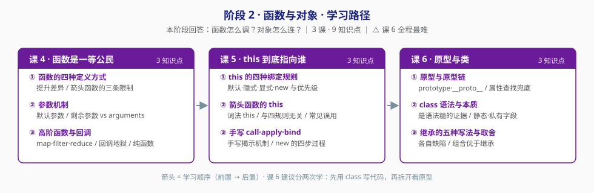

# 阶段 2：函数与对象

> 所属课程：JavaScript 语言核心（ES6+） ｜ 故事章节：**JS 的两根支柱** ｜ 上一阶段：[阶段 1 值与作用域](../1-值与作用域/overview.md)
> 返回：[学习路径总览](../01-学习路径总览.md) ｜ [课程目录](../02-课程目录.md)

## 🎯 本阶段目标

- 理解函数不只是"一段可复用代码"，而是**可以传递的值**——这一条决定了回调、高阶函数、闭包全部成立。
- 拿下 `this`：四种绑定规则有**明确优先级**，不是"看情况"。学完能正确说出任意调用点的 `this` 指向。
- 拿下原型链：它是**属性查找的兜底路径**，不是"继承的语法"。能画出 `class` 背后的原型链图。

## ⚠️ 难度提示

**课 6《原型与类》是全程最难的一课**，且与课 5《this》相邻，难度叠加。

- **讲法**：课 6 采用**逆向路径**——先用 `class` 正常写代码，跑通了，再拆开看它背后的原型链。先有能用，再讲为什么。
- **节奏**：允许分两次学。第一次跟着写 `class`，第二次拆原型。卡住不是你笨，是这课本来就难。

## 📍 学习重点

| 重点 | 为什么重要 |
|------|-----------|
| 函数是一等公民 | 函数能当参数、当返回值、能存进变量——回调、高阶函数、闭包、Promise 全靠这一条成立 |
| `this` 的四种绑定规则 | 规则 + 优先级是确定的。掌握后所有"this 丢了"的 bug 都能定位到具体是哪条规则生效 |
| 箭头函数的 `this` | 它**不参与**那四种规则，是词法的。知道这点就知道哪些地方不能用箭头函数 |
| 原型链 | 属性查找的兜底路径。理解它，`class` 就从"魔法"变成"语法糖"，继承写法的取舍也有了判断依据 |

## ✅ 必须掌握的知识点

| 知识点 | 所属课 | 学完应能 |
|--------|--------|----------|
| 函数的四种定义方式与差异 | 课 4 | 说清函数声明 / 表达式 / 箭头函数在提升上的差异，以及箭头函数的三条限制 |
| 参数机制 | 课 4 | 说清默认参数的 TDZ、剩余参数与 `arguments` 的取舍 |
| 高阶函数与回调 | 课 4 | 用 `map`/`filter`/`reduce` 替代手写循环；解释回调地狱的成因——控制反转 |
| this 的四种绑定规则 | 课 5 | 对任意调用点说出 `this` 指向，并按优先级说明是哪条规则生效 |
| 箭头函数的 this | 课 5 | 指出对象方法、事件回调、原型方法三处误用箭头函数的后果 |
| 手写 call·apply·bind 与 new | 课 5 | 手写一个可用的 `bind`；说清 `new` 的四步过程 |
| 原型与原型链 | 课 6 | 画出 `prototype` / `__proto__` / `constructor` 三角关系；说清属性查找的兜底顺序 |
| class 语法与本质 | 课 6 | 给出"class 是语法糖"的证据；用私有字段 `#x` 写真正的私有属性 |
| 继承的五种写法与取舍 | 课 6 | 列出五种写法各自的缺陷；说清什么时候该用组合而非继承 |

## 🗺️ 本阶段路径图

> 箭头 = 学习顺序（前置 → 后置）。课 6 建议分两次学。

## 本阶段产出

- [ ] `lessons/lesson-04-函数是一等公民.md`
- [ ] `lessons/lesson-05-this到底指向谁.md`
- [ ] `lessons/lesson-06-原型与类.md`

> 实操环境：Node.js v22.14.0（Windows PowerShell）。涉及浏览器行为的示例另行标注。
