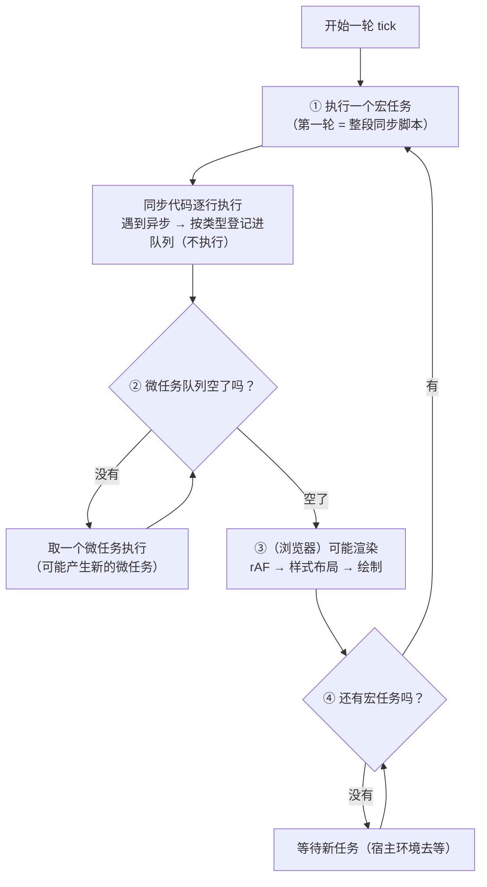
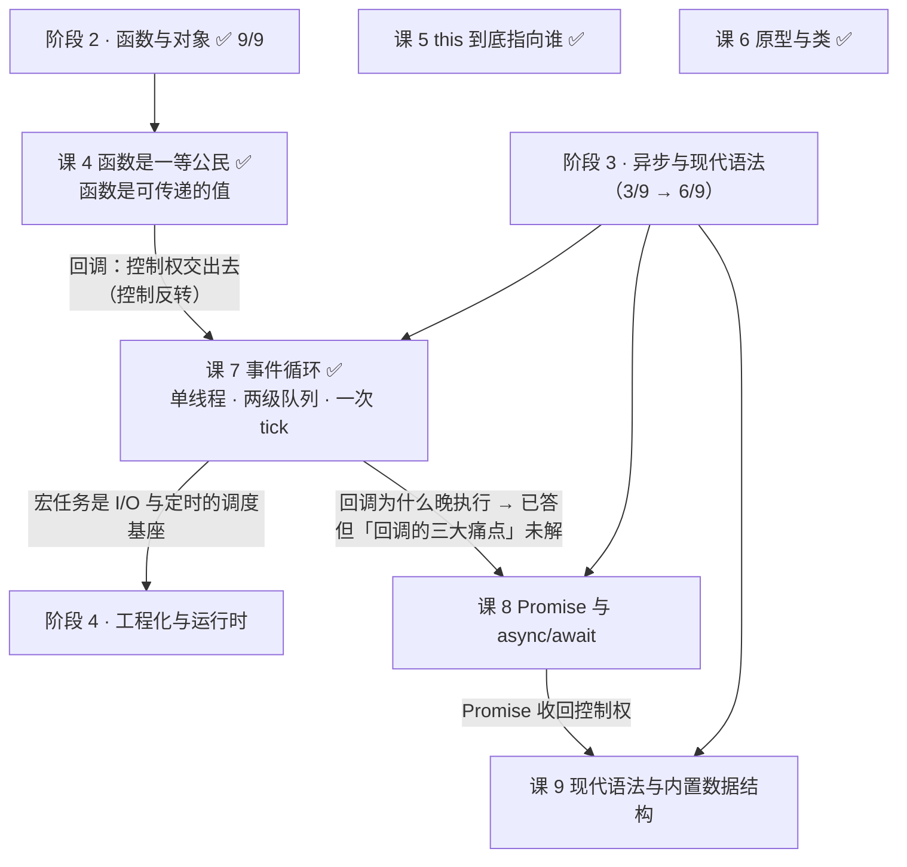
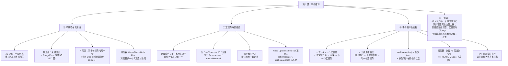

# 第 7 课：事件循环

> 所属阶段：阶段 3《异步与现代语法》｜ 水平：入门 ｜ 本课知识点：单线程与调用栈、宏任务与微任务、事件循环全流程
> 故事情节：主角终于要正面回答开头那个问题了——`setTimeout(fn, 0)` 明明写的是 0 毫秒，为什么最后才执行？这一课拆开"JS 怎么处理时间"这台机器
> 📌 **前置约定**：本课讲微任务时会借用 `Promise.then` 的**外壳**举例（"它是微任务"），Promise 的完整机制留到**课 8** 展开
> ✅ 状态：已完成（2026-09-02）｜ 实操环境：Node.js v22.14.0（文中所有输出均为本机实测）
> 💳 **本课来还一笔旧账**：课 1 开篇的 `3 3 3`，课 3 解释了"为什么是 3 而不是 0 1 2"（`var` 只有一个共享绑定），但"**回调为什么最后执行**"这笔债一直欠着——今天结清

## 🎯 本课目标

- 解释 JS 为什么是单线程，说出栈溢出的触发条件与阻塞的代价
- 对 `setTimeout` / `Promise.then` / `queueMicrotask` 正确归类为宏任务或微任务，并说出微任务的清空时机
- 推演任意 `setTimeout` + Promise 混合代码的输出顺序；解释为什么 `setTimeout(fn, 0)` 不是"立即执行"

## 📌 知识点导航

| # | 知识点 | 状态 |
|---|--------|------|
| 1 | 单线程与调用栈 | ✅ |
| 2 | 宏任务与微任务 | ✅ |
| 3 | 事件循环全流程 | ✅ |

---

## 第一幕：起源与场景引入

> 🏛️ **起源**：**事件循环不是 JS 的发明**——它是图形界面程序几十年来的老传统（早期叫"消息循环 / message loop"：程序不停问"有消息吗？"，有就处理，没有就等）。
>
> 1995 年 JS 诞生在浏览器里，立刻面临一个硬约束：**既要能响应用户的点击和输入，又不能因为等待而卡死页面**。答案就是沿用这套模型——把"要等的事"交给浏览器去等，等好了再排进队列，由 JS 主线程按顺序处理。
>
> 至于"事件循环"这个机制被**正式写进规范**，则要晚得多：如今由 **WHATWG HTML Living Standard** 维护（本课用到的"定时器初始化步骤"就出自其 §8.7 Timers）。
>
> ⏳ **置信度：低**——"`setTimeout` 具体由谁在哪一年引入"这一细节，本课未检索到权威来源，故不作断言。可以确定并已核实的是**现行规范的行为**，下面会引用。

> 🎬 **场景**：一段只有四行的代码，输出顺序却和你想的不一样。

```js
console.log('start');

setTimeout(() => console.log('timeout'), 0);   // 明明写的是 0 毫秒

Promise.resolve().then(() => console.log('promise'));

console.log('end');
```

凭直觉，`setTimeout` 是 0 毫秒——应该**立刻**执行吧？那顺序应该是 `start → timeout → promise → end`。

实测结果：

```
start
end
promise
timeout
```

**`timeout` 不但没有立刻执行，还排在了最后；而看起来八竿子打不着的 `promise`，反而插到了它前面。**

这正是课 1 开篇那个 `3 3 3` 的同一个根因：

```js
for (var i = 0; i < 3; i++) {
  setTimeout(() => console.log(i), 0);
}
console.log('同步结束');
// 实测：先输出「同步结束」，然后才是 3 3 3
```

课 3 解释了"为什么是 3 而不是 0 1 2"（`var` 在循环里只有一个共享绑定）。但还有半句没解释：**这些回调凭什么全都排在同步代码之后？**

---

## 第二幕：认知冲突

> ❓ **问题**：JS 不是单线程吗？单线程怎么可能"一边等定时器，一边干别的"？

三个困惑，直指这台机器的心脏：

1. **`setTimeout(fn, 0)` 写的是 0 毫秒，为什么不是立刻执行？** 它到底在等什么？
2. **既然都叫"异步"，为什么 `Promise.then` 比 `setTimeout(fn, 0)` 更早？** 难道异步任务之间还分三六九等？
3. **单线程怎么做到"同时"等定时器、等网络请求、还能响应点击？** 等待的时候 CPU 在干嘛？

| 困惑 | 答案藏在 |
|------|---------|
| 0 毫秒为什么不是立即 | **知识点 1**：同步代码不跑完，别的任务根本没有机会上栈 |
| Promise 为什么能插队 | **知识点 2**：异步任务是**两级队列**，微任务整体优先于宏任务 |
| 单线程怎么"同时"做事 | **知识点 3**：事件循环 + **宿主环境**在背后多线程地"等" |

> 💡 第 3 个困惑的答案会颠覆一个常见误解：JS **语言**是单线程的，但**浏览器 / Node 不是**。这台机器是两拨人一起转起来的。

---

## 第三幕：层层揭示

### 知识点 1：单线程与调用栈

> 本知识点关键点：为什么 JS 是单线程（动机与代价）/ 调用栈（`Call Stack`）与栈溢出 / 阻塞的代价 / 浏览器 Runtime 与 Node Runtime 的差异

#### 一句话定义

**JS 语言本身只有一个调用栈（单线程）**：同一时刻只能执行一个函数，必须等栈顶的函数返回，才能执行下一个。它的异步能力不来自"同时做多件事"，而来自**宿主环境（浏览器 / Node）在背后用其他线程去"等"，等好了再把回调排进队列**。

#### 直觉建立（类比）

把 JS 主线程想成**一家只有一个厨师的小餐馆**：

- 厨师**一次只能做一道菜**（单线程）——手上的菜没做完，后面点的单只能等着。
- 顾客的订单排成**一个队列**，厨师做完一道，从队列取下一单。
- 但"等外卖平台派单""微波炉叮一声"这些**等待的活不是厨师干的**——是别人（宿主环境 / 其他线程）干的，干完了把菜放到出餐口，厨师再取。

> 💡 **类比的边界（两处，很重要）**：
> ① 现实里的厨师可以"边烧水边切菜"（人是真并发）；**JS 主线程不能**——它只有一双手。所谓"并发"是**任务在时间上交错** + **把等待的活外包出去**，不是同时执行。
> ② 类比里"别人"是看不见的，但它是这台机器的**另一半**：`setTimeout` 的计时、网络请求、文件读写，**全是宿主环境在做**。JS 主线程只负责"执行回调"。

#### 核心原理

**① 为什么 JS 是单线程？**

最常见的解释是：**JS 生来要操作 DOM**。如果多线程，两个线程同时操作一个节点——一个要删、一个要改——就需要复杂的锁机制，否则 DOM 状态会不一致。而锁对一个"给设计师和业余爱好者用的脚本语言"来说太重了。

⚠️ 这是**社区公认的动机解释**，不是规范条文。但无论动机如何，**结果是确定的**：JS 只有一个调用栈，这是语言层面的硬约束，改不了。

**② 调用栈（Call Stack）：后进先出**

函数调用 → 栈帧入栈；函数返回 → 栈帧出栈。栈**满了**就爆：

```js
let depth = 0;
function deep() { depth++; deep(); }
try { deep(); } catch (e) { console.log(e.constructor.name + ':', e.message); }
// 实测（Node v22.14.0）：递归 12549 层后 => RangeError: Maximum call stack size exceeded
```

> 📌 栈溢出的触发条件：**递归没有终止条件**（或终止条件永远不成立）。本机上限约 **12500 层**——这个数字因引擎和栈大小而异，**不要记具体数值**，记住"无限递归会爆栈，报 `RangeError`"就够。

**③ 阻塞的代价（本节最有分量的一条）**

同步代码占着调用栈，其他所有任务都得排队。实测：

```js
const t0 = Date.now();
setTimeout(() => console.log('0ms 定时器，实际延迟:', Date.now() - t0, 'ms'), 0);
while (Date.now() - t0 < 200) { /* 空转 200ms，死占调用栈 */ }
// 实测输出：
//   阻塞结束，耗时: 200 ms
//   0ms 定时器，实际延迟: 200 ms
```

**一个写着"0 毫秒"的定时器，被 200ms 的同步循环硬生生拖到了 200ms。**

> 🔑 这条可以直接推导出 **`setTimeout(fn, 0)` 的真实含义**：它**不是**"0 毫秒后执行"，而是——
> **"至少 0 毫秒后，并且必须等到当前调用栈清空（所有同步代码跑完）+ 所有微任务清空之后，才轮到它。"**
>
> 浏览器里同理：一个 3 秒的同步计算，会让页面**完全卡死 3 秒**——点不动、滚不动、动画停住。这就是为什么要避免长任务。

**④ 浏览器 Runtime vs Node Runtime**

两者的**JS 部分（调用栈 + 任务队列 + 事件循环）是一样的**，差别在"谁在背后帮忙等"：

| | 浏览器 | Node.js |
|---|--------|---------|
| 帮忙等的是谁 | **Web APIs**：定时器线程、网络线程、DOM 事件、渲染引擎 | **libuv**：事件循环 + 线程池（默认 4 个线程处理文件 I/O 等） |
| 特有的宏任务 | UI 渲染、`requestAnimationFrame`、`MessageChannel` | `setImmediate`、I/O 回调、`process.nextTick`（更优先的独立队列） |
| 有 UI 渲染阶段吗 | **有**（rAF → 样式布局 → 绘制） | 没有 |
| 全局对象 | `window` / `globalThis` | `global` / `globalThis` |

> 🎯 **一句话收口**：**JS 单线程，宿主多线程。** 异步 = 把"等待"外包给宿主 + 用队列排队执行回调。

#### 示例演示

```js
// ① 栈溢出
let depth = 0;
function deep() { depth++; deep(); }
try { deep(); } catch (e) { /* RangeError: Maximum call stack size exceeded */ }

// ② 阻塞的代价
const t0 = Date.now();
setTimeout(() => console.log('延迟:', Date.now() - t0, 'ms'), 0);
while (Date.now() - t0 < 200) {}
// 实测：0ms 的定时器实际延迟 200ms
```

#### 常见误区

1. **"JS 是单线程，所以浏览器/Node 也是单线程"** → 错。**JS 主线程**是单线程，**宿主环境**是多线程的——否则定时器、网络请求根本没法"在背后等"。
2. **"`setTimeout(fn, 0)` 等于立刻执行"** → 错。它是"**至少** 0 毫秒，且排在当前同步代码与所有微任务之后"。
3. **"异步代码运行在其他线程上"** → 半错。**等待**在其他线程，**执行**永远在 JS 主线程。所以异步回调里的同步代码一样会阻塞。
4. **"回调慢是因为定时器不准"** → 多半不是。定时器可能很准，是**前面有同步代码堵着**（实测：0ms 被 200ms 循环拖到 200ms）。

#### 一句话记住

> **JS 只有一个调用栈：同步代码不跑完，谁也别想上栈；异步的"等待"由宿主环境用其他线程完成，等好了再把回调排进队列——所以 `setTimeout(fn, 0)` 的意思是"至少 0ms，且排在所有同步代码与微任务之后"。**

> ✅ **困惑 1 已解**：`setTimeout(fn, 0)` 不是"立刻"，因为**调用栈被同步代码占着**。它写的 0 毫秒只是"最早什么时候可以被考虑"，能不能上栈还得等前面排空。

#### 官方文档

- [事件循环 - MDN](https://developer.mozilla.org/zh-CN/docs/Web/JavaScript/Reference/Execution_model)（JS 执行模型）
- [并发模型与事件循环 - MDN](https://developer.mozilla.org/zh-CN/docs/Web/JavaScript/Reference/Execution_model#%E4%BA%8B%E4%BB%B6%E5%BE%AA%E7%8E%AF)
- [HTML 标准 · Timers（含 4ms 规则）](https://html.spec.whatwg.org/multipage/timers-and-user-prompts.html)
- [Node.js 事件循环指南](https://nodejs.org/zh-cn/docs/guides/event-loop-timers-and-nexttick)

---

### 知识点 2：宏任务与微任务

> 本知识点关键点：任务队列的**两级结构** / 哪些是宏任务（`setTimeout`·`setInterval`·I/O·UI 渲染）、哪些是微任务（`Promise.then`·`queueMicrotask`·`MutationObserver`）/ 微任务的清空时机 / `queueMicrotask`

#### 一句话定义

异步任务分**两级**：**宏任务（macrotask / task）** 与 **微任务（microtask）**。一次事件循环只取**一个**宏任务，但会把**微任务队列整条清空**——这就是 `Promise.then` 能插到 `setTimeout(fn, 0)` 前面的全部原因。

#### 直觉建立（类比）

把事件循环想成**机场的一趟趟航班**：

- **宏任务 = 航班**：一次只放一趟。
- **微任务 = 这趟航班的 VIP 通道**：每处理完一趟航班，要把 VIP 通道里的人**全部放完**，才叫下一趟航班。
- 关键细节：**VIP 通道里如果又来了新的人，他们在这一轮也一起走完**——不会留到下一趟航班。

> 💡 **类比的边界**：现实里 VIP 通道再多人也不会让航班永远不起飞；**JS 里会**——如果微任务不停地产生新的微任务，宏任务会被**"饿死"**，永远得不到执行（页面就此卡死）。所以**不要在微任务里无限递归地产生微任务**。

#### 核心原理

**① 两级队列（实测）**

```js
setTimeout(() => console.log('[宏] setTimeout A'), 0);
setTimeout(() => console.log('[宏] setTimeout B'), 0);
Promise.resolve().then(() => console.log('[微] then A'));
queueMicrotask(() => console.log('[微] queueMicrotask'));
Promise.resolve().then(() => console.log('[微] then B'));
console.log('[同步] sync');

// 实测输出：
//   [同步] sync
//   [微] then A
//   [微] queueMicrotask
//   [微] then B
//   [宏] setTimeout A
//   [宏] setTimeout B
```

**两个宏任务被三个微任务整体插队到了最后**——这就是两级队列的直接证据。

**② 谁是谁？（分类表）**

| 级别 | 常见来源 |
|------|---------|
| **宏任务** | `setTimeout` / `setInterval`、I/O 回调（文件、网络）、UI 渲染、`MessageChannel`、`setImmediate`（Node） |
| **微任务** | `Promise.then` / `.catch` / `.finally`、`queueMicrotask()`、`MutationObserver`（浏览器）、`await` 之后的代码（**课 8**） |
| **Node 专属 · 更优先** | `process.nextTick()` —— 它有自己的队列，**比微任务队列优先级还高** |

**③ 微任务的清空时机：整条清空，包括新产生的**

```js
Promise.resolve().then(() => {
  console.log('[微] 1');
  Promise.resolve().then(() => console.log('[微] 1-1（1 里新生的）'));
});
Promise.resolve().then(() => console.log('[微] 2'));
setTimeout(() => console.log('[宏] 宏任务被所有微任务插队到最后'), 0);
console.log('[同步] sync');

// 实测输出：
//   [同步] sync
//   [微] 1
//   [微] 2
//   [微] 1-1（1 里新生的）   ← 后产生的微任务，仍在本轮走完
//   [宏] 宏任务被所有微任务插队到最后
```

**④ `queueMicrotask(fn)`：显式入队一个微任务**

它就是"把 `fn` 排进微任务队列"的官方 API，语义和 `Promise.resolve().then(fn)` 几乎一致，但**更直白、没有 Promise 包装的开销**。

```js
queueMicrotask(() => console.log('我在微任务队列里'));
```

> 📌 什么时候用它？当你需要"在当前同步代码之后、下一个宏任务之前"立刻做点什么，而又不想引入 Promise 时。日常用得不多，但**它是理解微任务最好的探针**。

**⑤ Node 专属：`process.nextTick` 比微任务更优先（实测）**

```js
setTimeout(() => console.log('setTimeout(0)'), 0);
setImmediate(() => console.log('setImmediate'));
Promise.resolve().then(() => console.log('promise.then'));
process.nextTick(() => console.log('process.nextTick'));
queueMicrotask(() => console.log('queueMicrotask'));
console.log('[同步] sync');

// 实测输出（Node v22.14.0）：
//   [同步] sync
//   process.nextTick     ← 最优先，比微任务还靠前
//   promise.then
//   queueMicrotask
//   setImmediate
//   setTimeout(0)
```

⚠️ **这里有个著名的坑**：**`setImmediate` 与 `setTimeout(0)` 在主模块顶层的先后顺序不保证**。本课实测 4 次：**3 次 `setTimeout` 先、1 次 `setImmediate` 先**——取决于进程启动耗时与定时器是否恰好到期。

但在 **I/O 回调内**则是**确定**的（实测 4/4）：

```js
const fs = require('fs');
fs.readFile(__filename, () => {
  setTimeout(() => console.log('setTimeout(0)'), 0);
  setImmediate(() => console.log('setImmediate'));
});
// 实测 4 次全部：setImmediate → setTimeout(0)
```

原因是 Node 的事件循环分**阶段**：I/O 回调在 **poll 阶段**执行，而紧接着的 **check 阶段**就是 `setImmediate`，所以 `setImmediate` 一定抢在下一轮的 timers 阶段之前。

> 🎯 **实用结论**：**不要依赖 `setTimeout(0)` 与 `setImmediate` 的先后顺序**。需要确定性，就用 `setImmediate` 明确表达"在本次 I/O 之后、下一轮 timers 之前"。

#### 示例演示

见上方各段（全部为实测）。

#### 常见误区

1. **"微任务只是一种更快的宏任务"** → 不是。它们是**两个队列**，机制不同：微任务**整条清空**，宏任务**每次取一个**。
2. **"微任务队列清空完就完了"** → 不是，**清空过程中新产生的微任务也在本轮一起走完**（实测 `[微] 1-1` 就在本轮）。
3. **"`process.nextTick` 就是微任务"** → 在 Node 里它是**独立且更优先**的队列，比 `Promise.then` 还靠前（实测）。
4. **"`setImmediate` 一定在 `setTimeout(0)` 之后"** → **不保证**（顶层实测两种顺序都出现过）。别依赖它。
5. **"可以在微任务里无限递归产生微任务"** → 会**饿死宏任务**，页面/进程卡死。

#### 一句话记住

> **异步分两级：微任务（`Promise.then` / `queueMicrotask`，Node 里 `process.nextTick` 更优先）整条清空，宏任务（`setTimeout` / I/O / 渲染）每轮只取一个——所以微任务永远整体插在下一个宏任务之前。**

> ✅ **困惑 2 已解**：异步任务确实分三六九等。`Promise.then` 进的是**微任务队列**，`setTimeout` 进的是**宏任务队列**，而微任务队列是在"每个宏任务之后"被**整条清空**的——所以 `promise` 一定排在 `timeout` 前面。

#### 官方文档

- [queueMicrotask - MDN](https://developer.mozilla.org/zh-CN/docs/Web/API/queueMicrotask)
- [在 JavaScript 中通过 queueMicrotask 使用微任务 - MDN](https://developer.mozilla.org/zh-CN/docs/Web/API/HTML_DOM_API/Microtask_guide)
- [process.nextTick - Node.js 文档](https://nodejs.org/api/process.html#processnexttickcallback-args)
- [HTML 标准 · 微任务检查点](https://html.spec.whatwg.org/multipage/webappapis.html#perform-a-microtask-checkpoint)

---

### 知识点 3：事件循环全流程

> 本知识点关键点：一次 tick 的完整顺序（同步 → 清空微任务 → 取一个宏任务 → 再清空微任务）/ 经典输出顺序题的**通用推演方法** / `setTimeout(fn, 0)` 的真实含义 / 渲染时机与 `requestAnimationFrame`

#### 一句话定义

**一次 tick（一轮循环）= 执行一个宏任务（第一轮是整段同步脚本）→ 把微任务队列整条清空 →（浏览器）可能有渲染 → 取下一个宏任务 → 再清空微任务……** 如此往复。

#### 直觉建立（类比）

还是那家只有一个厨师的餐馆——现在把流程精确化：

1. 厨师**必须把手上这道菜做完**（当前宏任务 + 同步栈）
2. 然后**把出餐口上所有已经做好的配菜全部出完**（清空微任务，含新送来的）
3. 然后**擦一下桌子**（浏览器：渲染）
4. 然后**才从订单队列取下一单**（下一个宏任务）

> 💡 **类比的边界**：餐馆里"配菜出完"和"取下一单"是同一个人的连续动作；JS 里这两步之间有**硬性检查点**——每执行完一个宏任务，引擎**必须**去查微任务队列，即使它是空的。这就是为什么"微任务插队"是**保证**而不是巧合。

#### 核心原理

**① 一次 tick 的完整顺序**



**② 分步图解（用第一幕那段代码走一遍）**


**③ 通用推演方法：三步走**(本课的实用核心)

面对任何"输出顺序题"，照这三步走，**不用猜、不用试**：

| 步骤 | 做什么 |
|------|--------|
| **第 1 步** | **跑完所有同步代码**。遇到异步调用，**只登记不执行**：`setTimeout` 记进宏任务队列，`Promise.then` / `queueMicrotask` 记进微任务队列（Node 里 `process.nextTick` 记进更优先的队列） |
| **第 2 步** | 同步栈一清空，**立刻把微任务队列整条清空**——包括清空过程中新产生的微任务 |
| **第 3 步** | 微任务空了，取**一个**宏任务执行；执行完，再回头清空微任务；如此循环 |

**实战演练**（实测输出 `1 3 5 4 2`）：

```js
console.log('1');                                   // 第1步：同步 → 输出 1
setTimeout(() => console.log('2'), 0);              // 第1步：登记到【宏任务】
new Promise((resolve) => {
  console.log('3');                                 // 第1步：executor 是同步执行的！→ 输出 3
  resolve();
}).then(() => console.log('4'));                    // 第1步：登记到【微任务】
console.log('5');                                   // 第1步：同步 → 输出 5
// 同步结束 → 第2步：清空微任务 → 输出 4
// 第3步：取一个宏任务 → 输出 2
```

> 🎯 **这道题里最大的坑是第 3 行**：**`new Promise(executor)` 的 executor 是同步执行的**！`Promise` 构造函数会**立即**调用你传进去的那个函数。很多人以为 `new Promise` 里的内容也是异步的，于是把 `3` 排到了 `5` 后面。

**④ `setTimeout(fn, 0)` 到底是什么意思**

三句话，缺一不可：

1. **不是 0 毫秒**——必须等当前同步代码 + 所有微任务跑完；
2. **也不保证恰好 N 毫秒**——只是"最早不早于 N 毫秒"，实际取决于队列拥堵情况；
3. **还有下限**——**浏览器**里，嵌套超过 5 层的定时器会被强制至少 4 毫秒。

第 3 条已核实（**WHATWG HTML Living Standard，§8.7 Timers** 的 timer initialization steps）：

> "Timers can be nested; after five such nested timers, however, the interval is forced to be at least four milliseconds."
> 第 5 步原文：**"If nestingLevel is greater than 5, and timeout is less than 4, then set timeout to 4."**（核查于 2026-09）

⚠️ **这条是浏览器规则，Node 不遵循**。本机（Node v22.14.0 / Windows）实测嵌套 `setTimeout(…, 0)` 的实际延迟：

| 层级 | 1 | 2 | 3 | 4 | 5 | 6 | 7 | 8 |
|------|---|---|---|---|---|---|---|---|
| 实测延迟 | 7ms | 15ms | 14ms | 15ms | 15ms | 15ms | 15ms | 15ms |

没有出现 4ms，而是稳定在 ~15ms——**Node 的定时器由 libuv 管理，实测受操作系统定时器粒度影响**（本环境为 Windows）。⏳ 具体粒度因操作系统而异，此处只报告实测值，**不要把它当成通用数字**。

**⑤ 渲染时机与 `requestAnimationFrame`（浏览器专属）**

浏览器比 Node 多一步：**渲染**。它发生在微任务清空之后、下一个宏任务之前：

```
宏任务 → 清空微任务 → 【渲染：rAF 回调 → 样式计算 → 布局 → 绘制】 → 下一个宏任务
```

- **`requestAnimationFrame(fn）`** 的回调在**渲染前**执行，频率跟随屏幕刷新率（通常 60Hz）。它**既不是宏任务也不是微任务**——它是渲染阶段的一部分。
- 所以"用 `setTimeout(fn, 16)` 做动画"是不靠谱的：它可能被微任务推迟、也可能与屏幕刷新不同步，导致掉帧。做动画就该用 `rAF`。
- Node 里没有渲染阶段，因此也没有 `requestAnimationFrame`。

#### 示例演示

```js
// ① 一次 tick 的完整顺序（第一幕代码）
console.log('start');
setTimeout(() => console.log('timeout'), 0);
Promise.resolve().then(() => console.log('promise'));
console.log('end');
// start → end → promise → timeout

// ② 三步走实战（注意 executor 是同步的！）
console.log('1');
setTimeout(() => console.log('2'), 0);
new Promise((r) => { console.log('3'); r(); }).then(() => console.log('4'));
console.log('5');
// 1 → 3 → 5 → 4 → 2
```

#### 常见误区

1. **"`new Promise(fn)` 里的 `fn` 是异步的"** → **同步执行**！这是输出顺序题的头号陷阱。
2. **"微任务清空完就去取下一个宏任务"** → 顺序没错，但要注意**浏览器中间还有渲染步骤**。
3. **"`setTimeout(fn, 16)` 等于 60fps 动画"** → 不可靠。它会被微任务和队列拥堵推迟，且与屏幕刷新不同步。做动画用 `requestAnimationFrame`。
4. **"嵌套 setTimeout 的 4ms 下限在哪都适用"** → 那是 **HTML 规范（浏览器）** 的规则；Node 实测不遵循（本环境稳定 ~15ms）。
5. **"事件循环是 JS 引擎提供的"** → 不是。事件循环由**宿主环境**（浏览器 / Node）提供，JS 引擎（V8）只提供调用栈和堆。这也是为什么"Node 和浏览器的事件循环细节不同"。

#### 一句话记住

> **一次 tick = 一个宏任务 → 清空全部微任务（含新生的）→（浏览器）渲染 → 下一个宏任务；`setTimeout(fn, 0)` 是"至少 0ms 且排在所有同步代码与微任务之后"，浏览器里嵌套超 5 层还会被钳到 4ms。**

> ✅ **困惑 3 已解**：JS 主线程只管"执行"，**"等待"被外包给了宿主环境的其他线程**（定时器线程、网络线程、libuv 线程池）。等好了，宿主把回调放进队列；主线程按"宏任务一个一个来，微任务整条清空"的规矩取出来执行——**这就是单线程能"同时"处理多件事的全部秘密**。

#### 官方文档

- [HTML 标准 · 事件循环处理模型](https://html.spec.whatwg.org/multipage/webappapis.html#event-loop-processing-model)
- [requestAnimationFrame - MDN](https://developer.mozilla.org/zh-CN/docs/Web/API/Window/requestAnimationFrame)
- [setTimeout - MDN](https://developer.mozilla.org/zh-CN/docs/Web/API/Window/setTimeout)
- [Node.js：事件循环、定时器与 process.nextTick](https://nodejs.org/zh-cn/docs/guides/event-loop-timers-and-nexttick)

---

## 第四幕：实操验证

把下面代码存成 `l7-demo.js`，用 `node l7-demo.js` 运行（本机 Node.js v22.14.0）。

> 💡 **为什么脚本要"排开"各节？** 因为定时器是全局排队的——如果所有小节一口气写完，第 1 节的定时器会和第 5 节的混在一起输出，就看不出规律了。下面用 **800ms 间隔**把每一节隔开，让每节独立完成自己的一轮循环。

```js
// l7-demo.js —— 回扣第一幕：0 毫秒的定时器为什么最后跑
console.log('=== 0. 调用栈：栈溢出 ===');
(function () {
  let depth = 0;
  function deep() { depth++; deep(); }
  try { deep(); } catch (e) {
    console.log('  递归 ' + depth + ' 层后 =>', e.constructor.name + ':', e.message);
  }
})();

const sections = [];
const section = (name, fn) => sections.push({ name, fn });

section('1. 第一幕：0 毫秒的定时器为什么最后跑', () => {
  console.log('  start');
  setTimeout(() => console.log('  [宏] setTimeout(0)'), 0);
  Promise.resolve().then(() => console.log('  [微] promise.then'));
  console.log('  end');
});

section('2. 两级队列：微任务整体先于宏任务', () => {
  setTimeout(() => console.log('  [宏] setTimeout A'), 0);
  setTimeout(() => console.log('  [宏] setTimeout B'), 0);
  Promise.resolve().then(() => console.log('  [微] then A'));
  queueMicrotask(() => console.log('  [微] queueMicrotask'));
  Promise.resolve().then(() => console.log('  [微] then B'));
  console.log('  [同步] sync');
});

section('3. 清空微任务时，新生的微任务也在本轮一起走完', () => {
  Promise.resolve().then(() => {
    console.log('  [微] 1');
    Promise.resolve().then(() => console.log('  [微] 1-1（1 里新生的）'));
  });
  Promise.resolve().then(() => console.log('  [微] 2'));
  setTimeout(() => console.log('  [宏] 宏任务被所有微任务插队到最后'), 0);
  console.log('  [同步] sync');
});

section('4. 经典输出顺序题', () => {
  console.log('  1');
  setTimeout(() => console.log('  2'), 0);
  new Promise((resolve) => {
    console.log('  3');                    // ← executor 是同步执行的！
    resolve();
  }).then(() => console.log('  4'));
  console.log('  5');
});

section('5. 回扣课 1 的 3 3 3：回调为什么最后执行', () => {
  for (var i = 0; i < 3; i++) setTimeout(() => console.log('  var 版:', i), 0);
  for (let i = 0; i < 3; i++) setTimeout(() => console.log('  let 版:', i), 0);
  console.log('  同步结束（这一行先于所有定时器）');
});

section('6. Node 特有：process.nextTick 比微任务更优先', () => {
  setTimeout(() => console.log('  setTimeout(0)'), 0);
  setImmediate(() => console.log('  setImmediate'));
  Promise.resolve().then(() => console.log('  promise.then'));
  process.nextTick(() => console.log('  process.nextTick'));
  queueMicrotask(() => console.log('  queueMicrotask'));
  console.log('  [同步] sync');
});

section('7. 阻塞的代价：同步代码会推迟一切', () => {
  const t0 = Date.now();
  setTimeout(() => console.log('  0ms 定时器，实际延迟:', Date.now() - t0, 'ms'), 0);
  while (Date.now() - t0 < 200) { /* 空转 200ms，死占调用栈 */ }
  console.log('  阻塞结束，耗时:', Date.now() - t0, 'ms');
});

sections.forEach((s, i) => {
  setTimeout(() => {
    console.log('\n=== ' + s.name + ' ===');
    s.fn();
  }, i * 800 + 50);
});
```

**实测输出**：

```
=== 0. 调用栈：栈溢出 ===
  递归 12549 层后 => RangeError: Maximum call stack size exceeded

=== 1. 第一幕：0 毫秒的定时器为什么最后跑 ===
  start
  end
  [微] promise.then
  [宏] setTimeout(0)

=== 2. 两级队列：微任务整体先于宏任务 ===
  [同步] sync
  [微] then A
  [微] queueMicrotask
  [微] then B
  [宏] setTimeout A
  [宏] setTimeout B

=== 3. 清空微任务时，新生的微任务也在本轮一起走完 ===
  [同步] sync
  [微] 1
  [微] 2
  [微] 1-1（1 里新生的）
  [宏] 宏任务被所有微任务插队到最后

=== 4. 经典输出顺序题 ===
  1
  3
  5
  4
  2

=== 5. 回扣课 1 的 3 3 3：回调为什么最后执行 ===
  同步结束（这一行先于所有定时器）
  var 版: 3
  var 版: 3
  var 版: 3
  let 版: 0
  let 版: 1
  let 版: 2

=== 6. Node 特有：process.nextTick 比微任务更优先 ===
  [同步] sync
  process.nextTick
  promise.then
  queueMicrotask
  setImmediate
  setTimeout(0)

=== 7. 阻塞的代价：同步代码会推迟一切 ===
  阻塞结束，耗时: 200 ms
  0ms 定时器，实际延迟: 200 ms
```

> ⚠️ **第 6 节注意**：`setImmediate` 与 `setTimeout(0)` 的先后顺序**不保证**——本课实测 4 次，**3 次 `setTimeout` 先、1 次 `setImmediate` 先**（上面贴的是其中一次）。在 **I/O 回调内**才是确定的（实测 4/4 都是 `setImmediate` 先）。

> ✅ **回扣场景**：三个困惑全部结案——
>
> - **"0 毫秒为什么不是立即"**：第 7 节给出硬证据——**0ms 的定时器被 200ms 的同步循环拖到了 200ms**。因为调用栈被占着，谁也上不去。`setTimeout(fn, 0)` 是"至少 0ms，且排在所有同步代码与微任务之后"。
> - **"Promise 为什么能插队"**：第 2 节——**三个微任务把两个宏任务整体插到了最后**；第 3 节进一步证明"清空微任务时新生的微任务也一起走完"（`[微] 1-1` 排在宏任务之前）。这是**两级队列**的直接证据。
> - **"单线程怎么同时做事"**：第 0 节（只有一个调用栈，递归 12549 层就爆）+ 第 7 节（同步代码能堵死一切）证明 JS **执行**是单线程的；而"等待"外包给了宿主环境——第 1、2、6 节那些回调能在同步代码之后陆续执行，就是宿主环境把"等到的结果"送回队列的结果。
>
> 💳 **课 1 的 `3 3 3` 至此彻底结案**：第 5 节显示"同步结束"先于所有定时器——回调之所以最后执行，是因为**它们是宏任务，必须等同步栈清空**；而输出 `3 3 3` 而不是 `0 1 2`，是因为 **`var` 在循环中只有一个共享绑定**（课 3）+ 回调执行时那个绑定已经变成 3。两半原因合起来，才是完整答案。

---

## 第五幕：体系收束



**本课在整条故事线里的位置**（阶段 3 章节名：**与时间打交道**）：

| 课 | 回答的问题 | 一句话 |
|----|-----------|--------|
| 阶段 2 课 4 | 函数是什么？ | 它是可以传递的**值**——代价是**控制反转**（回调何时执行由不得你） |
| **阶段 3 课 7** | **回调为什么"晚"执行？** | **单线程 + 调用栈 + 两级队列**：同步不跑完，别的没机会；微任务整条清空，宏任务每次一个 |
| 阶段 3 课 8 | 回调的痛点怎么解？ | **Promise** 把控制权收回来（**下一课**） |
| 阶段 3 课 9 | 现代语法给了什么？ | 解构、Map/Set、迭代器、生成器 |

**你现在会了什么**：

- 看到 `setTimeout(fn, 0)`，能说出它"至少 0ms 且排在所有同步代码与微任务之后"，而不是"立即"
- 面对任何 `setTimeout` + Promise 混合代码，能用**三步走**（同步登记 → 清空微任务 → 取一个宏任务）推演出输出顺序，不靠猜
- 面对"页面卡死"，能判断是不是同步长任务堵住了调用栈，并知道它连 0ms 定时器都会拖住
- 知道 `new Promise(executor)` 的 executor 是**同步**执行的——这是顺序题的头号陷阱

**本课的"包袱 vs 取舍"总账**（体例从课 1 延续至今）：

| 现象 | 归属 |
|------|------|
| JS 单线程 | **设计取舍**（代价：长任务会阻塞一切；收益：无需锁、DOM 操作简单、心智负担低） |
| `setTimeout(fn, 0)` 不是立即 | **设计使然**（它本就是"排队"而非"定时到点抢占"；把 0 理解成"立即"是学习者的错，不是语言的错） |
| 微任务整条清空 | **设计取舍**（代价：可能饿死宏任务；收益：Promise 链能在一个 tick 内跑完，状态一致可预期） |
| `process.nextTick` 优先于微任务 | **历史包袱**（Node 早年的设计早于 Promise 标准化，如今保留为兼容） |
| `setTimeout(0)` vs `setImmediate` 顺序不定 | **历史包袱**（Node 阶段调度的副产物；两者语义本就不同，混用才会踩到） |
| 浏览器嵌套定时器 4ms 下限 | **设计取舍**（为降低功耗与 CPU 占用而牺牲精度，见 HTML 规范 §8.7） |

> 🔗 **下一步：课 8《Promise 与 async/await》**。本课把"回调为什么晚执行"讲清了，但**回调的三大痛点还没解决**——回扣课 4 的控制反转：**调用几次、什么时候调用、错了谁接住，全都不由你定**。课 8 的 Promise 就是冲着这三个问题来的：它把"回调"换成"状态机 + `then` 链"，让你能 `return`、能 `catch`、能组合。
>
> 到时候你会明白一件很爽的事：**`await` 看起来像同步代码，但它背后的调度机制，就是今天这台机器。**

---

## 🐞 常见误区（本课汇总）

1. **"JS 是单线程，所以浏览器/Node 也是单线程"** → JS **主线程**单线程，宿主环境是多线程的。
2. **"`setTimeout(fn, 0)` 等于立刻执行"** → 至少 0ms，且排在所有同步代码与微任务之后。
3. **"异步代码运行在别的线程上"** → **等待**在别的线程，**执行**永远在 JS 主线程。
4. **"回调慢是定时器不准"** → 多半是前面有同步代码堵着（实测 0ms 被拖到 200ms）。
5. **"微任务只是更快的宏任务"** → 是两个队列，机制不同：微任务整条清空，宏任务每次一个。
6. **"微任务清空完就完了"** → 清空过程中**新产生的**微任务也在本轮走完。
7. **"`process.nextTick` 就是微任务"** → Node 里它是独立且**更优先**的队列。
8. **"`setImmediate` 一定在 `setTimeout(0)` 之后"** → **不保证**（顶层实测两种都出现过）。
9. **"`new Promise(fn)` 里的 `fn` 是异步的"** → **同步执行**，顺序题头号陷阱。
10. **"`setTimeout(fn, 16)` 就是 60fps 动画"** → 不可靠，做动画用 `requestAnimationFrame`。
11. **"嵌套 4ms 下限到处适用"** → 那是**浏览器**（HTML 规范）规则；Node 实测不遵循。
12. **"事件循环是 JS 引擎的一部分"** → 由**宿主环境**提供，V8 只提供调用栈和堆。

## 一图总结



## 课后小测

**Q1**：下面代码的输出顺序是？

```js
console.log('start');
setTimeout(() => console.log('timeout'), 0);
Promise.resolve().then(() => console.log('promise'));
console.log('end');
```

- A. `start → timeout → promise → end`
- B. `start → end → timeout → promise`
- C. `start → end → promise → timeout`
- D. `start → promise → end → timeout`

<details><summary>答案与解析</summary>

**答案：C**。

按三步走推演：

1. **同步阶段**：输出 `start`；`setTimeout` 登记进**宏任务**队列；`.then` 登记进**微任务**队列；输出 `end`。
2. **清空微任务**：输出 `promise`。
3. **取一个宏任务**：输出 `timeout`。

⚠️ `setTimeout` 的 `0` **不是"立即"**——它只表示"至少 0 毫秒"，实际必须排在所有同步代码**和**所有微任务之后。

</details>

**Q2**：关于宏任务与微任务，下列说法正确的是？

- A. 微任务队列清空完，就去执行下一个宏任务；清空过程中新产生的微任务留到下一轮
- B. 微任务队列会被**整条清空**，包括清空过程中新产生的微任务；宏任务每轮只取一个
- C. `Promise.then` 是宏任务，`setTimeout` 是微任务
- D. 微任务和宏任务的优先级相同，谁先注册谁先执行

<details><summary>答案与解析</summary>

**答案：B**。

- **B 对**：这正是两级队列的全部机制。实测：

  ```
  [同步] sync
  [微] 1
  [微] 2
  [微] 1-1（1 里新生的）   ← 新生的微任务，仍在本轮走完
  [宏] 宏任务被所有微任务插队到最后
  ```

- A 错：清空过程中**新产生的**微任务也在**本轮**一起走完。
- C 错：正好说反了——`Promise.then` 是**微任务**，`setTimeout` 是**宏任务**。
- D 错：两级队列有明确的优先级，跟注册顺序无关（三个微任务能把两个先注册的宏任务整体插队到最后）。

</details>

**Q3**：下面代码的输出顺序是？

```js
console.log('1');
setTimeout(() => console.log('2'), 0);
new Promise((resolve) => {
  console.log('3');
  resolve();
}).then(() => console.log('4'));
console.log('5');
```

- A. `1 2 3 4 5`
- B. `1 3 5 4 2`
- C. `1 3 5 2 4`
- D. `1 5 3 4 2`

<details><summary>答案与解析</summary>

**答案：B**（实测输出 `1 3 5 4 2`）。

**这题最大的坑在第 3 行**：`new Promise(executor)` 的 **executor 是同步执行的**——`Promise` 构造函数会**立即**调用你传进去的那个函数。很多人以为 `new Promise` 里的内容也是异步的，于是把 `3` 排到了 `5` 后面。

推演：
1. 同步：输出 `1` → 登记宏任务 `2` → **同步执行 executor 输出 `3`** → 登记微任务 `4` → 输出 `5`
2. 清空微任务：输出 `4`
3. 取一个宏任务：输出 `2`

</details>

**Q4**：关于 `setTimeout(fn, 0)`，下列说法**错误**的是？

- A. 它不是"立即执行"，至少要等当前同步代码和所有微任务跑完
- B. 浏览器里，嵌套超过 5 层的定时器会被强制至少 4 毫秒
- C. 它保证在恰好 0 毫秒后执行
- D. 如果前面有 200ms 的同步循环，它会被推迟到 200ms 之后

<details><summary>答案与解析</summary>

**答案：C**。

- A 对：这就是它的真实语义。
- B 对：已核实 **WHATWG HTML Living Standard §8.7 Timers**——*"If nestingLevel is greater than 5, and timeout is less than 4, then set timeout to 4."*（注意这是**浏览器**规则，Node 不遵循）
- **C 错**：它不保证任何精确时刻，只保证"不早于"。
- D 对：实测——0ms 的定时器被 200ms 的空转循环拖到了 **200ms** 才执行。

</details>

**Q5（进阶）**：为什么 JS 是单线程，却能"同时"等定时器、等网络请求、还能响应点击？

- A. 因为 JS 引擎内部开了多个线程
- B. 因为 JS 主线程只负责**执行**，而"等待"被外包给了**宿主环境**的其他线程；等好了宿主把回调放进队列，主线程按队列顺序取出来执行
- C. 因为 `setTimeout` 的回调真的在另一个线程上执行
- D. 因为 JS 其实是多线程的，只是看起来像单线程

<details><summary>答案与解析</summary>

**答案：B**。

这是本课最核心的一张图：**JS 单线程，宿主多线程。**

- **JS 引擎（V8）**只提供：一个调用栈 + 一个堆。**执行永远只有一个线程**。
- **宿主环境**（浏览器的 Web APIs / Node 的 libuv）提供：定时器线程、网络线程、文件 I/O 线程池、事件循环本身。
- 流程：`setTimeout` / `fetch` / `fs.readFile` 一调用，**等待的活就交给了宿主**；宿主等到了，把回调放进任务队列；主线程空闲了（栈空了）就按"微任务整条清空 → 宏任务取一个"的规矩取出来执行。

A、C 错：回调**不在**别的线程上执行，永远在 JS 主线程。D 错：JS 执行模型确实只有一个调用栈（这也是它不需要锁的原因）。

</details>

## 🚀 下一批接力提示词

> 学完本课后，**复制下面这段文字发给 AI**，即可无缝进入下一课：

```
继续学 JavaScript 语言核心（ES6+）。我的学习档案在 frontend/javascript-core/00-学习档案.md，
刚学完阶段 3《异步与现代语法》的课《事件循环》三个知识点
（单线程与调用栈 / 宏任务与微任务 / 事件循环全流程），
请按大纲继续讲解下一课《Promise 与 async/await》。
```

## 🧭 课程导航

⬅️ **上一课**：[课 6：原型与类](../../2-函数与对象/lessons/lesson-06-原型与类.md)（跨阶段 · 阶段 2 收官课）

➡️ **下一课**：[课 8：Promise 与 async/await](lesson-08-Promise与async-await.md)

📚 **返回目录**：[课程目录](../../02-课程目录.md) ｜ [阶段概览](../overview.md)
