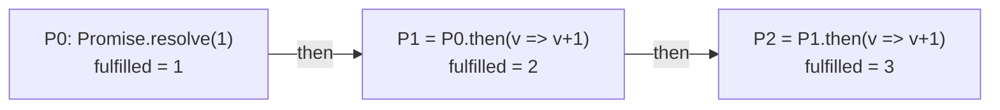
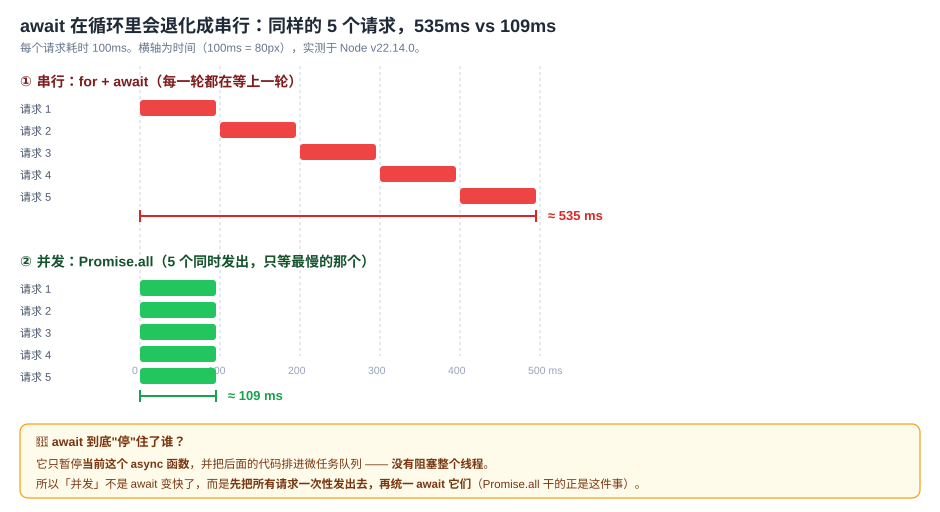
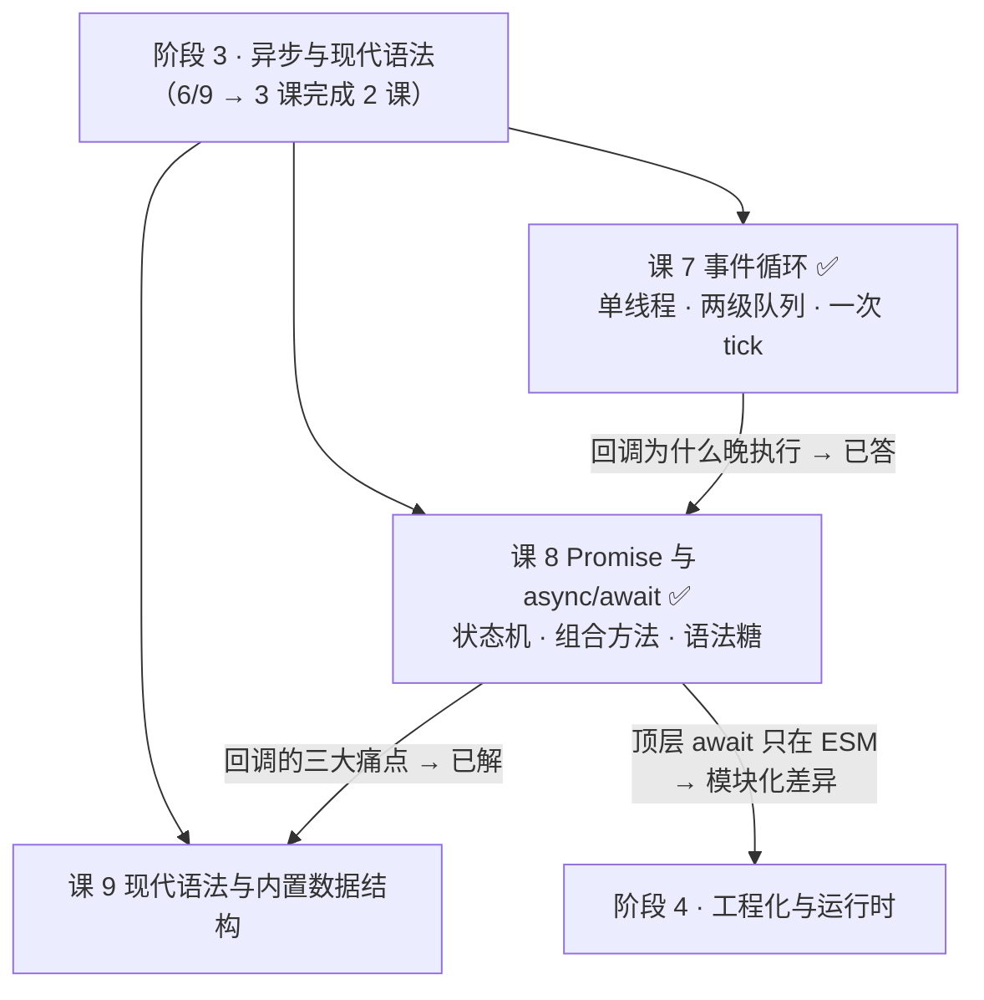
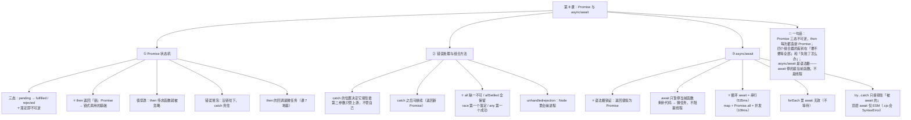

# 第 8 课：Promise 与 async/await

> 所属阶段：阶段 3《异步与现代语法》｜ 水平：入门 ｜ 本课知识点：Promise 状态机、错误处理与组合方法、async/await
> 故事情节：主角用 `await` 写循环发 10 个请求，接口慢得离谱——因为 `await` 在循环里会退化成串行。搞懂"它是语法糖"，才知道怎么改成并发
> ✅ 状态：已完成（2026-09-03）｜ 实操环境：Node.js v22.14.0（文中所有输出均为本机实测）
> 🔗 本课来还课 4 欠的债：当时说"回调有三大痛点，Promise 是解药"——今天兑现

## 🎯 本课目标

- 说清 Promise 三态不可逆、`then` 返回新 Promise、值穿透与错误冒泡
- 区分 `all` / `allSettled` / `race` / `any` 的语义，并选出适合"允许部分失败"场景的那个
- 把串行的 `await` 循环改成并发；说清 `try...catch` 与 `.catch` 的取舍

## 📌 知识点导航

| # | 知识点 | 状态 |
|---|--------|------|
| 1 | Promise 状态机 | ✅ |
| 2 | 错误处理与组合方法 | ✅ |
| 3 | async/await | ✅ |

---

## 第一幕：起源与场景引入

> 🏛️ **起源**：Promise 不是 JS 的发明，它是个**从 1976 年一路走来的老概念**。
>
> - **1976 年**，Daniel P. Friedman 与 David Wise 在论文《The Impact of Applicative Programming on Multiprocessing》中提出 **promise** 这个术语；**1977 年**，Henry Baker 与 Carl Hewitt 提出了近似的 **future** 概念。
> - **1988 年**，Barbara Liskov 与 Liuba Shrira 在论文《Promises: Linguistic Support for Efficient Asynchronous Procedure Calls in Distributed Systems》中，把 promise 用到了分布式系统的远程调用上（语言是 Argus）。
> - 中间二十年它一直小众；**2000 年之后**因为 UI 响应性和 Web 开发的兴起才大规模走红。
> - **JS 的 Promise 在 ES2015（ES6）才进入标准**；`async` / `await` 关键字则是 **ES2017（ES8）**。而 `async/await` 这套语法的流行，要归功于 **.NET 4.5（2010 年宣布、2012 年发布）**，它又深受 **F# 的异步工作流（2007）** 启发——后来 Dart(2014)、Python(2015)、JavaScript(ES2017) 陆续跟进。
>
> （核查于 2026-09，来源：Wikipedia「Futures and promises」词条及其引用的原始论文）
>
> ⏳ **一处存疑已标注**：Wikipedia 该词条的**导语**把 promise 一词的提出归于 Friedman & Wise（1976），而**History 章节**又说"promise 一词由 Liskov 与 Shrira 创造"。两处说法不一致，故本课按最稳妥的口径陈述：**概念 1976 年提出，1988 年在分布式系统语境下确立**。

> 🎬 **场景**：批量拉取 5 个用户详情，每个请求约 100ms。

```js
const fetchUser = (id) => delay(100, '用户' + id);   // 模拟 100ms 的请求

// 你的写法：直接在循环里 await
async function loadUsers(ids) {
  const users = [];
  for (const id of ids) {
    users.push(await fetchUser(id));    // ← 每个都要等上一个回来
  }
  return users;
}
```

实测（5 个 id）：

```
串行 for + await : 用户1,用户2,用户3,用户4,用户5 | 耗时 535 ms
```

同事把它改成一行：

```js
const users = await Promise.all(ids.map((id) => fetchUser(id)));
```

```
并发 Promise.all : 用户1,用户2,用户3,用户4,用户5 | 耗时 109 ms
```

**同样的 5 个请求，快了近 5 倍。**

你懵了：`await` 不是"异步"吗？异步不就是"不阻塞、同时干"吗？为什么放在循环里就变成了一个一个来？

---

## 第二幕：认知冲突

> ❓ **问题**：`await` 到底"停"住了谁？

三个困惑：

1. **`await` 看起来把函数"停"在那里等，可 JS 是单线程——它停在哪儿？会不会把整个线程堵死？**（如果堵死了，那和同步代码有什么区别？）
2. **既然 `await` 是"等"，那它等的东西到底是什么？** 为什么 `Promise.all` 返回的那个东西也能被 `await`？`async` 函数我明明 `return 42`，为什么外面拿到的是个 Promise？
3. **如果这 5 个请求里有 1 个失败了，会怎样？** 另外 4 个成功的结果还能拿到吗？

| 困惑 | 答案藏在 |
|------|---------|
| `await` 停住了谁 | **知识点 3**：只暂停**当前这个 async 函数**，把后续代码排进微任务队列，**不阻塞线程** |
| `async` 返回值 / 为什么都能 await | **知识点 1 + 3**：Promise 三态 + `async` 返回值恒为 Promise（语法糖的铁证） |
| 一个失败会不会连累其他 | **知识点 2**：`all` 快速失败 vs `allSettled` 全保留 |

> 💡 课 4 埋的那颗雷，本课开始拆：当时说"回调的三大痛点是**调用几次、什么时候调用、错了谁接住都不由你定**"。Promise 就是冲着这三个来的——它把"回调"换成了"**状态机 + `then` 链**"，让异步也能 `return`、能 `catch`、能组合。

---

## 第三幕：层层揭示

### 知识点 1：Promise 状态机

> 本知识点关键点：`pending`·`fulfilled`·`rejected` 三态**不可逆** / `then` 返回**新** Promise（链式调用的基础）/ 值穿透与错误冒泡 / `then` 的回调是**微任务**（回扣课 7）

#### 一句话定义

Promise 是一个**装"未来才会有的结果"的容器**，它有三个状态：`pending`（进行中）→ `fulfilled`（成功）/ `rejected`（失败）。**状态一旦落定就不可逆**；`.then()` 会**返回一个新的 Promise**，这是链式调用的基础。

#### 直觉建立（类比）

把 Promise 想成**奶茶店的取餐小票**：

- 你点单后拿到小票——此时饮品还没有，小票处于 **`pending`（制作中）**；
- 做好了 → 小票变成 **`fulfilled`（可取）**，你凭它换成奶茶；
- 原料卖完了 → 小票变成 **`rejected`（失败）**，你凭它去退款。
- **关键**：小票的状态**只能变一次**。做好了就不可能再变回"制作中"，也不可能"做好了同时又卖完了"。

> 💡 **类比的边界（两处）**：
> ① 现实里小票是死的，你得自己去柜台看状态；**Promise 会主动通知**——状态一变，你用 `.then()` 登记的回调就会被排进**微任务队列**（回扣课 7）自动执行。
> ② **`.then()` 返回的是一张"新小票"**，不是原来那张。这是理解链式调用的关键，也是本知识点最常被忽略的一点——很多人以为 `.then()` 是在原来的 Promise 上"加个监听"，其实它每次都**造出一个新 Promise**。

#### 核心原理

**① 三态与不可逆（实测）**

```js
const p = new Promise((resolve, reject) => {
  resolve('第一次 resolve 生效');
  reject(new Error('迟到的 reject'));   // ← 无效
  resolve('迟到的 resolve');            // ← 无效
});
p.then((v) => console.log(v));   // '第一次 resolve 生效'
```

三个状态在控制台里能看到（实测打印结果）：

| 状态 | 打印出来的样子 |
|------|---------------|
| `pending` | `Promise { <pending> }` |
| `fulfilled` | `Promise { 42 }` |
| `rejected` | `Promise { <rejected> Error: x ... }` |

**② `then` 返回「新」Promise（链式调用的全部秘密）**

```js
const pa = Promise.resolve(1);
const pb = pa.then((v) => v + 1);

pb === pa;                  // false  ← 是新对象
pb instanceof Promise;      // true
```

用 mermaid 画出来是这样——**每一次 `.then()` 都吐出一个新的 Promise**：



> 🎯 **为什么这很重要**：因为 `then` 返回新 Promise，所以链上每一环都可以是**异步的**——你可以在 `.then()` 里 `return` 另一个 Promise，下一环会**等它落定**再继续。这就是"把回调金字塔拉平成一条链"的机制。

**③ 值穿透：`then` 传的不是函数，就被忽略**

```js
Promise.resolve(1)
  .then(2)          // 不是函数 → 整条被忽略，值原样透传
  .then(null)       // 同上
  .then((v) => v + 1)
  .then((v) => console.log(v));   // 2
```

规则很简单：**`.then` 的参数如果不是函数，这一环就"不存在"**，上一个 Promise 的值直接流到下一环。

**④ 错误冒泡：链上任意一环抛错，都会一路往下走，直到被某个 `catch` 接住**

```js
Promise.resolve(1)
  .then(() => { throw new Error('第二步炸了'); })
  .then(() => console.log('这里不会执行'))       // ← 被跳过
  .catch((e) => console.log('抓到:', e.message)); // '抓到: 第二步炸了'
```

这跟同步代码的 `try...catch` 是一个味道：**错误沿着链往下冒泡，直到有人接住它。**

**⑤ `then` 的回调是微任务（回扣课 7，也是本课的地基）**

```js
console.log('[同步] 1');
Promise.resolve().then(() => console.log('[微] then'));
console.log('[同步] 2');

// 实测输出：
//   [同步] 1
//   [同步] 2
//   [微]   then
```

**课 7 只借了 `Promise.then` 的外壳说"它是微任务"，现在可以补上后半句了**：`.then()` 里那个回调，会被排进**微任务队列**，等当前同步代码跑完就立刻清空。**`await` 之后的代码同理**——这是知识点 3 的伏笔。

#### 示例演示

```js
// ① 三态不可逆
const p = new Promise((resolve, reject) => {
  resolve('第一次 resolve 生效');
  reject(new Error('迟到的 reject'));   // 无效
  resolve('迟到的 resolve');            // 无效
});

// ② then 返回新 Promise
const pa = Promise.resolve(1);
const pb = pa.then((v) => v + 1);   // pb !== pa，且 pb 是 Promise

// ③ 值穿透 + ④ 错误冒泡（见上方代码块）
```

#### 常见误区

1. **"`.then()` 是给 Promise 加一个监听器"** → 不准确。它**返回一个新 Promise**，这是链式调用能成立的原因。
2. **"Promise 状态能来回变"** → 不能。落定即不可逆，`resolve` 之后再 `reject` 完全无效。
3. **"`.then(2)` 会把 2 当回调"** → 不会。非函数的参数会被忽略，值直接穿透。
4. **"`.then()` 的回调是同步执行的"** → 不是。它永远是**微任务**，要等当前同步代码跑完（回扣课 7）。

#### 一句话记住

> **Promise 三态不可逆（pending → fulfilled / rejected）；`.then()` 每次都返回「新」Promise，所以能无限链下去；传非函数会值穿透，链上抛错会往下冒泡；`.then` 的回调是微任务。**

> ✅ **困惑 2 的前半已解**：能被 `await` 的东西，本质都是 Promise（或 thenable）。而 `async` 函数返回的**恒为 Promise**——这正是知识点 3 要给出的语法糖铁证。

#### 官方文档

- [Promise - MDN](https://developer.mozilla.org/zh-CN/docs/Web/JavaScript/Reference/Global_Objects/Promise)
- [使用 Promise - MDN](https://developer.mozilla.org/zh-CN/docs/Web/JavaScript/Guide/Using_promises)
- [Promise.prototype.then - MDN](https://developer.mozilla.org/zh-CN/docs/Web/JavaScript/Reference/Global_Objects/Promise/then)

---

### 知识点 2：错误处理与组合方法

> 本知识点关键点：`catch` 的**位置**决定捕获范围 / `Promise.all`·`allSettled`·`race`·`any` 的语义差异与选型 / `then` 的第二参数 vs `catch` / `unhandledrejection`

#### 一句话定义

Promise 的错误处理靠**冒泡**：`catch` 放在链的哪个位置，决定了它能接住哪些错误。而 `Promise.all` / `allSettled` / `race` / `any` 是**同时管理多个 Promise** 的四个组合器，它们的差异集中在两件事上：**要不要等全部**、**失败了怎么办**。

#### 直觉建立（类比）

- **单个 Promise 的错误处理** = 公司里的**问题上报流程**：基层出问题，逐级往上抛，谁先"接住"处理，流程就到此为止。
- **四个组合器** = 四种**收作业的方式**：
  - `all`：全部交齐才收，**有 1 个人没交就整批改不了**（快速失败）；
  - `allSettled`：全部交齐，**交了的和没交的都记录**（永不失败）；
  - `race`：只看**第一个**交的人（交得好不好都算）；
  - `any`：只看**第一个交得好**的人（全都没交好才算失败）。

> 💡 **类比的边界**：`all` 有个反直觉的细节——**即使中途有人失败，其他人也并没有被"取消"**，只是它们的结果被丢弃了（`all` 只看最快的那个失败）。想保留所有结果，就得用 `allSettled`。这一点在"发请求"场景里尤其重要：**被丢弃的请求其实还在跑**。

#### 核心原理

**① `then` 的第二参数 vs `catch`：位置决定一切**

这是本知识点最经典的考点：

```js
// ① 第二参数抓不到「自己这一级 onFulfilled 里抛的错」
Promise.resolve(1)
  .then(
    () => { throw new Error('自己抛的'); },
    (e) => console.log('第二参数抓到:', e.message)   // ← 不会执行！
  )
  .catch((e) => console.log('被后面的 catch 接住:', e.message));
// 实测输出：被后面的 catch 接住: 自己抛的

// ② 第二参数能抓「上游」的错误
Promise.reject(new Error('上游的错'))
  .then(
    () => console.log('onFulfilled 不执行'),
    (e) => console.log('第二参数抓到上游错误:', e.message)
  );
// 实测输出：第二参数抓到上游错误: 上游的错
```

**一句话**：**`then` 的第二参数只管"上游"，管不了"自己"；`catch` 能管它之前的所有环节（含自己这一级的上游）。** 所以日常**一律用链尾的 `catch`**，第二参数只在你想"就地处理上游错误、然后继续正常流程"时才用。

**② `catch` 之后还能继续：它同样返回新 Promise**

```js
Promise.reject(new Error('原始错误'))
  .catch(() => '恢复成正常值')      // ← 把失败「修复」成成功
  .then((v) => console.log(v));     // '恢复成正常值'
```

这就是"错误恢复"模式：`catch` 里可以返回一个正常值，链就**从失败转回成功**继续往下走。

**③ 四个组合器（全部实测）**

| 方法 | 成功条件 | 失败条件 | 返回值 | 典型用途 |
|------|---------|---------|--------|---------|
| **`all`** | **全部** fulfilled | **任一** rejected（快速失败） | 结果数组（**按输入顺序**，不是完成顺序） | 多个**缺一不可**的请求 |
| **`allSettled`** | **永不失败** | — | `[{status, value\|reason}]` 数组 | **允许部分失败**，要拿到全部结果 |
| **`race`** | 第一个**落定**的 | 第一个落定的是 rejected 就失败 | 那一个的结果 | 超时控制 |
| **`any`** | 第一个 **fulfilled** 的 | **全部** rejected → `AggregateError` | 那一个的结果 | 多源备份取最快可用 |

```js
// all：全成功 → 结果按输入顺序
await Promise.all([delay(10, 'A'), delay(20, 'B'), delay(5, 'C')]);   // [ 'A', 'B', 'C' ]

// all：一个失败 → 整体失败，其他结果全丢
await Promise.all([
  delay(10, 'A-成功'),
  delay(5).then(() => { throw new Error('B-失败'); }),
  delay(20, 'C-成功'),
]).catch((e) => e.message);   // 'B-失败'  ← A、C 的结果拿不到了

// allSettled：一个都不丢
await Promise.allSettled([...]);
// [ 'fulfilled=A-成功', 'rejected=B-失败', 'fulfilled=C-成功' ]

// race：谁先落定算谁（成功失败都算）
await Promise.race([delay(50, '慢的'), delay(10, '快的')]);   // '快的'
await Promise.race([先失败, 后成功]);                          // rejected: 先失败

// any：跳过失败的，取第一个成功的
await Promise.any([先失败, 后成功]);   // '后成功'
// 全失败 → AggregateError
await Promise.any([错1, 错2]).catch((e) => e);
// AggregateError | errors=错1,错2
```

> 🎯 **选型口诀**：**缺一不可 → `all`；允许部分失败 → `allSettled`；要超时 → `race`；多源取可用 → `any`。**
>
> 本课的"5 个用户详情"场景：如果是**详情页**（少一个都不行）用 `all`；如果是**列表页**（少一个只是少一行）就该用 `allSettled`。

**④ `unhandledrejection`：没人接住的错误去哪了**

```js
Promise.reject(new Error('没人接的错'));
```

这是一个**没有任何 handler** 的 rejected Promise。在 Node 里实测：

```
Error: 没人接的错
    at Object.<anonymous> (...)
Node.js v22.14.0
# 进程直接崩溃，退出码 1 —— 后面的代码一行都不会执行
```

浏览器里不会崩，但会在控制台报 `Uncaught (in promise)`。**这是"静默失败"的头号来源**：一个漏写的 `.catch`，可能让整个 Node 服务挂掉。

兜底办法（浏览器 / Node 都支持）：

```js
// 浏览器
window.addEventListener('unhandledrejection', (e) => { e.preventDefault(); console.error(e.reason); });
// Node
process.on('unhandledRejection', (reason) => console.error('原因:', reason));
```

#### 示例演示

见上方各段（全部为实测）。

#### 常见误区

1. **"`then(onFulfilled, onRejected)` 能抓所有错"** → 抓不到**自己这一级** `onFulfilled` 里抛的错。
2. **"`all` 里一个失败，其他请求会被取消"** → 不会。其他请求**照跑**，只是结果被丢弃（没有取消机制）。
3. **"`all` 的结果顺序按完成先后"** → 按**输入顺序**。这是 `all` 很贴心的设计。
4. **"`any` 和 `race` 一样"** → 不一样。`race` 取**第一个落定**的（失败也算），`any` 取**第一个成功**的（全失败才报 `AggregateError`）。
5. **"漏写 `.catch` 只是控制台报个错"** → 在 Node 里会**让进程崩溃退出**（实测退出码 1）。

#### 一句话记住

> **错误沿链冒泡，`catch` 的位置决定它接住谁；四个组合器的差别在「要不要等全部」和「失败了怎么办」——缺一不可用 `all`，允许部分失败用 `allSettled`，超时用 `race`，多源取优用 `any`。**

> ✅ **困惑 3 已解**：`Promise.all` 里**只要有一个失败，整体立刻 rejected，其他成功的结果全部丢弃**（实测：只拿到 `'B-失败'`，A 和 C 的结果没了）。想保留全部结果，改用 `allSettled`——它永不失败，把每个的 `status` / `value` / `reason` 都留给你。

#### 官方文档

- [Promise.all - MDN](https://developer.mozilla.org/zh-CN/docs/Web/JavaScript/Reference/Global_Objects/Promise/all)
- [Promise.allSettled - MDN](https://developer.mozilla.org/zh-CN/docs/Web/JavaScript/Reference/Global_Objects/Promise/allSettled)
- [Promise.any - MDN](https://developer.mozilla.org/zh-CN/docs/Web/JavaScript/Reference/Global_Objects/Promise/any)
- [Promise.race - MDN](https://developer.mozilla.org/zh-CN/docs/Web/JavaScript/Reference/Global_Objects/Promise/race)

---

### 知识点 3：async/await

> 本知识点关键点：本质是 Promise 的**语法糖**（证据：返回值恒为 Promise）/ `await` 的暂停与恢复机制 / 串行 vs 并发的写法与性能差（`Promise.all` 改造）/ `try...catch` 与 `.catch` 的取舍 / 顶层 `await`（ESM 专属）

#### 一句话定义

`async` / `await` **不是新机制**，它是 Promise 的**语法糖**：`async` 函数**一定返回 Promise**（无论你 `return` 什么），`await` 则把"`.then()` 链"改写成了"看起来像同步代码"的样子。**它改变的是写法，不是底层调度。**

#### 直觉建立（类比）

把 `async/await` 想成**给 Promise 链套上的一件"顺读外套"**：

- 没有它时，异步逻辑要一层层 `.then()` 往里套（回调金字塔的近亲）；
- 有了它，同样的逻辑可以**从上往下一行行写**，读起来跟同步代码一模一样。

> 💡 **类比的边界（最关键的一处）**：**外套不会改变身体**。`await` 看起来"停在那里等"，但它**没有阻塞任何东西**——它只是把这个 async 函数**剩下的部分打包成一个微任务**，等它 await 的那个 Promise 落定之后再排回队列。**线程该干嘛还干嘛。**
>
> 这正是第一幕那个 5 倍差距的根源：`await` 暂停的是**当前这个函数**，不是整个世界。

#### 核心原理

**① 证据：`async` 函数的返回值恒为 Promise**

```js
async function ret42() { return 42; }

const r = ret42();
r instanceof Promise;   // true
await r;                // 42
```

**不管你 `return` 什么**（数字、字符串、对象、甚至什么都不 `return`），`async` 函数都会把它**包成一个 Promise**。抛出的错误也一样：

```js
async function throwIt() { throw new Error('async 里抛的'); }
await throwIt().catch((e) => e.message);   // 'rejected: async 里抛的'
```

> 🎯 **这是"语法糖"最硬的证据**：如果你 `return 42` 却拿到一个 Promise，说明语言在背后替你做了 `.then` 的活儿——**机制没变，写法变了**。

**② `await` 的暂停与恢复：让出调用栈，不阻塞线程**

```js
async function demo() {
  console.log('A（同步执行）');
  await null;                       // 即使 await 的不是 Promise，也会让出一次
  console.log('B（await 之后 = 微任务）');
}
console.log('start');
demo();
console.log('end');

// 实测输出：
//   start
//   A（同步执行）
//   end
//   B（await 之后 = 微任务）
```

**看清楚这个顺序**：`end` 排在 `B` 前面——说明 `await` **没有阻塞** `demo()` 后面的同步代码。它做的是：

1. 执行到 `await`，**把 async 函数剩余的部分挂起**；
2. **立即返回**给调用方（调用方拿到一个 pending Promise）；
3. 等 await 的那个 Promise 落定，再把剩余部分作为**微任务**排回队列。

**`await` 后面的代码 = 微任务**（回扣课 7 + 本课知识点 1 ⑤）。

补充两点：
- **`await` 一个非 Promise 值**（如 `await 42`）也会让出一次，结果就是那个值本身。
- **`await` 一个 thenable**（任何有 `.then()` 方法的对象）也会"展开"它。

**③ 串行 vs 并发：本课的题眼**



```js
const fetchUser = (id) => delay(100, '用户' + id);
const ids = [1, 2, 3, 4, 5];

// ❌ 串行：每一轮都在等上一轮回来
const serialOut = [];
for (const id of ids) {
  serialOut.push(await fetchUser(id));
}
// 实测：535 ms

// ✅ 并发：先把所有请求一次性发出去，再统一 await
const parallelOut = await Promise.all(ids.map((id) => fetchUser(id)));
// 实测：109 ms
```

> 🔑 **改造口诀**：**`for` 循环里 `await` = 串行；`map` + `Promise.all` = 并发。**
> 差别不在 `await` 变快了，而在**请求是"一个一个发"还是"一次性全发"**。

⚠️ **顺带一个高频陷阱：`forEach` 里用 `await` 完全无效**

```js
const forEachOut = [];
ids.forEach(async (id) => { forEachOut.push(await fetchUser(id)); });
console.log(forEachOut);   // 实测：[]  ← 空的！耗时 0ms
```

原因：`forEach` **不会等待**你传给它的 async 回调（它拿到的是 Promise，直接丢掉）。要并发就用 `map` + `Promise.all`。

**④ `try...catch` 与 `.catch` 的取舍**

| | 写法 | 抓得到 | 适用 |
|---|------|--------|------|
| **`try...catch` + `await`** | `try { await fn() } catch (e) {}` | ✅ 能抓 | async 函数内部，想让错误处理**贴近出错的那行** |
| **`.catch()`** | `fn().catch((e) => {})` | ✅ 能抓 | Promise 链风格；或想在**一处**统一兜底 |
| **`try` 包住「没 await」的 Promise** | `try { fn() } catch (e) {}` | ❌ **抓不到** | — |

最后一行是**最危险的坑**（回扣课 4 的控制反转、课 7 的"try/catch 抓不到异步错误"）：

```js
async function f() {
  try {
    Promise.reject(new Error('没 await 的错'));   // ← 忘了 await
  } catch (e) {
    console.log('抓到了');                        // ← 永远不会执行
  }
}
// 实测：catch 没执行，触发 unhandledRejection 事件，Node 里会直接崩进程
```

**实用建议**：

- 在 async 函数里，**优先用 `try...catch` 包住 `await`**——错误处理和出错的代码挨在一起，读起来最清楚；
- **记得 `await`**——漏一个 `await`，`try...catch` 就形同虚设；
- 想在最后统一兜底，可以在链尾加 `.catch()`。

**⑤ 顶层 `await`（ESM 专属）**

想在模块顶层直接写 `await`？可以，但**这个文件必须被当成 ESM 加载**。实测三种情况（Node v22.14.0，目录里**没有** package.json）：

| 文件 | 被当成 | 实测结果 |
|------|--------|---------|
| `xxx.mjs` | ESM（扩展名决定） | ✅ 正常，输出 `'拿到值了'` |
| `xxx.js` | **ESM（语法检测：含顶层 `await` → 按 ESM 加载）** | ✅ 正常 |
| `xxx.cjs` | CommonJS（扩展名决定） | ❌ `SyntaxError: await is only valid in async functions and the top level bodies of modules` |

```js
// ✅ ESM：顶层 await 可用
const value = await delay(50, '拿到值了');
console.log(value);   // '拿到值了'

// ❌ CommonJS（.cjs）：直接语法错误
const v = await Promise.resolve('x');
// SyntaxError: await is only valid in async functions and the top level bodies of modules
```

⚠️ **注意那条"语法检测"**：在 Node v22.14.0 上，一个没有 package.json 的 `.js` 文件**不是**默认 CommonJS——Node 会看它的语法，发现顶层 `await`（或 `import`）就按 ESM 加载。所以"`.js` 里写顶层 await 会报错"这个常见说法**在本版本上不成立**；真正一定会报错的是 `.cjs`，或者 `package.json` 里显式写了 `"type": "commonjs"` 的目录下的 `.js`。

> 📌 模块类型判定是**课 10《模块化》** 的主场，这里只需记住结论：**顶层 `await` 是 ESM 专属能力，CommonJS 用不了。**

#### 示例演示

```js
// ① 语法糖证据
async function ret42() { return 42; }
ret42() instanceof Promise;   // true

// ② await 不阻塞（start → A → end → B）
// ③ 串行 535ms vs 并发 109ms
// ④ forEach 里 await 无效：[]
// ⑤ try + await 能抓；try 包住没 await 的 Promise 抓不到
```

#### 常见误区

1. **"`await` 会阻塞线程"** → 不会。它只暂停**当前 async 函数**，剩余代码变成微任务排回队列。
2. **"`async` 函数返回的就是我 `return` 的值"** → 不是，**恒为 Promise**（包了一层）。
3. **"循环里 `await` 是并发的"** → 是**串行**。要并发用 `map` + `Promise.all`。
4. **"`forEach` 里加 `async` 就能等"** → 不能。`forEach` 不等待回调返回的 Promise。
5. **"`try...catch` 能兜住所有异步错误"** → 只能兜住**被 `await` 的** Promise。
6. **"哪里都能用顶层 `await`"** → 只有 ESM 模块可以；CommonJS 会 `SyntaxError`。

#### 一句话记住

> **`async` 函数返回值恒为 Promise（语法糖的铁证）；`await` 只暂停当前函数、把后续代码排进微任务；循环里 `await` 是串行，要并发就 `map` + `Promise.all`；`try...catch` 只接得住「被 await 的」错误。**

> ✅ **困惑 1、2 已解**：`await` **停的是当前这个函数，不是线程**——它把后面的代码排进微任务队列就返回了（实测 `end` 排在 `B` 前面）。而所有能被 `await` 的东西本质都是 Promise，`async` 函数的返回值也恒为 Promise——**这就是"它是语法糖"的全部证据**。

#### 官方文档

- [async 函数 - MDN](https://developer.mozilla.org/zh-CN/docs/Web/JavaScript/Reference/Statements/async_function)
- [await - MDN](https://developer.mozilla.org/zh-CN/docs/Web/JavaScript/Reference/Operators/await)
- [await 与并发执行 - MDN](https://developer.mozilla.org/zh-CN/docs/Web/JavaScript/Reference/Operators/await#await_%E5%92%8C%E5%B9%B6%E5%8F%91%E6%89%A7%E8%A1%8C)

---

## 第四幕：实操验证

把下面代码存成 `l8-demo.js`，用 `node l8-demo.js` 运行（本机 Node.js v22.14.0）。

> 💡 **脚本为什么要"逐节 await"？** Promise 的回调是微任务、定时器是宏任务，如果所有小节一口气写完，第 3 节的输出会插到第 6 节中间。下面用 `for...of` + `await s.fn()` 让每一节**完整跑完**再进入下一节。

```js
// l8-demo.js —— 回扣第一幕：await 在循环里会退化成串行
// 顺带用一个全局 handler 演示 unhandledRejection 事件（否则进程会直接崩）
process.on('unhandledRejection', (reason) => {
  console.log('  [unhandledRejection 事件] 原因:', reason && reason.message);
});

const delay = (ms, v) => new Promise((resolve) => setTimeout(() => resolve(v), ms));
const sections = [];
const section = (name, fn) => sections.push({ name, fn });

section('1. 三态不可逆：落定后再改无效', () => {
  const p = new Promise((resolve, reject) => {
    resolve('第一次 resolve 生效');
    reject(new Error('迟到的 reject'));   // 无效
    resolve('迟到的 resolve');            // 无效
  });
  return p.then((v) => console.log('  resolve 之后再 reject / 再 resolve =>', v));
});

section('2. then 返回「新」Promise（链式调用的基础）', () => {
  const pa = Promise.resolve(1);
  const pb = pa.then((v) => v + 1);
  console.log('  pb === pa             :', pb === pa, '（false = 是新对象）');
  console.log('  pb instanceof Promise :', pb instanceof Promise);
  return pb.then((v) => console.log('  链上的值              :', v));
});

section('3. 值穿透：then 传的不是函数就被忽略', () => {
  return Promise.resolve(1)
    .then(2)                      // 非函数 → 忽略
    .then(null)
    .then((v) => {
      console.log('  穿透后收到的值        :', v);
      return v + 1;
    })
    .then((v) => console.log('  +1 之后               :', v));
});

section('4. 错误冒泡 + catch 的位置', () => {
  return Promise.resolve(1)
    .then(() => { throw new Error('第二步炸了'); })
    .then(() => console.log('  这里不会执行'))
    .catch((e) => console.log('  链尾 catch 抓到       :', e.message))
    .then(() => {
      // catch 之后还能继续：catch 也返回新 Promise
      return Promise.reject(new Error('原始错误'))
        .catch(() => '恢复成正常值')
        .then((v) => console.log('  catch 之后继续 then   :', v));
    });
});

section('5. then 的第二参数 vs catch', () => {
  return Promise.resolve(1)
    .then(
      () => { throw new Error('自己抛的'); },
      (e) => console.log('  第二参数抓到          :', e.message)   // ← 不会执行！
    )
    .catch((e) => console.log('  被后面的 catch 接住   :', e.message))
    .then(() => Promise.reject(new Error('上游的错'))
      .then(
        () => console.log('  onFulfilled 不执行'),
        (e) => console.log('  第二参数抓到上游错误  :', e.message)
      ));
});

section('6. then 的回调是微任务（回扣课 7）', () => {
  console.log('  [同步] 1');
  Promise.resolve().then(() => console.log('  [微]   then'));
  console.log('  [同步] 2');
});

section('7. 四个组合方法', async () => {
  console.log('  all 全成功      :', await Promise.all([delay(10, 'A'), delay(20, 'B'), delay(5, 'C')]));
  console.log('  all 有失败      :', await Promise.all([
    delay(10, 'A-成功'),
    delay(5).then(() => { throw new Error('B-失败'); }),
    delay(20, 'C-成功'),
  ]).catch((e) => '整体失败，只拿到: ' + e.message));
  const settled = await Promise.allSettled([
    delay(10, 'A-成功'),
    delay(5).then(() => { throw new Error('B-失败'); }),
    delay(20, 'C-成功'),
  ]);
  console.log('  allSettled      :', JSON.stringify(settled.map((x) => x.status + '=' + (x.value || x.reason.message))));
  console.log('  race（谁先）    :', await Promise.race([delay(50, '慢的'), delay(10, '快的')]));
  console.log('  race（先失败）  :', await Promise.race([
    delay(5).then(() => { throw new Error('先失败'); }),
    delay(50, '后成功'),
  ]).catch((e) => 'rejected: ' + e.message));
  console.log('  any（跳过错的） :', await Promise.any([
    delay(5).then(() => { throw new Error('先失败'); }),
    delay(20, '后成功'),
  ]));
  console.log('  any 全失败      :', await Promise.any([
    delay(5).then(() => { throw new Error('错1'); }),
    delay(10).then(() => { throw new Error('错2'); }),
  ]).catch((e) => e.constructor.name + ' | errors=' + e.errors.map((x) => x.message).join(',')));
});

section('8. async 函数：返回值恒为 Promise（语法糖证据）', async () => {
  async function ret42() { return 42; }
  async function throwIt() { throw new Error('async 里抛的'); }
  const r = ret42();
  const t = throwIt();
  t.catch(() => {});
  console.log('  ret42() 是 Promise 吗  :', r instanceof Promise);
  console.log('  then 取出的值          :', await ret42());
  console.log('  async 抛错 → catch 抓到:', await throwIt().catch((e) => 'rejected: ' + e.message));
});

section('9. await 的暂停与恢复（让出调用栈）', () => {
  async function demo() {
    console.log('  A（同步执行）');
    await null;                       // await 非 Promise 值，也会让出一次
    console.log('  B（await 之后 = 微任务）');
  }
  console.log('  start');
  const p = demo();
  console.log('  end');
  return p;
});

section('10. 第一幕场景：串行 vs 并发', async () => {
  const fetchUser = (id) => delay(100, '用户' + id);
  const ids = [1, 2, 3, 4, 5];

  let t0 = Date.now();
  const serialOut = [];
  for (const id of ids) serialOut.push(await fetchUser(id));
  console.log('  串行 for + await :', serialOut.join(','), '| 耗时', Date.now() - t0, 'ms');

  t0 = Date.now();
  const parallelOut = await Promise.all(ids.map((id) => fetchUser(id)));
  console.log('  并发 Promise.all :', parallelOut.join(','), '| 耗时', Date.now() - t0, 'ms');

  t0 = Date.now();
  const forEachOut = [];
  ids.forEach(async (id) => { forEachOut.push(await fetchUser(id)); });
  console.log('  forEach 里 await : 同步结束后立刻打印 =', JSON.stringify(forEachOut), '（空！耗时', Date.now() - t0, 'ms）');
});

section('11. try...catch 与 .catch', async () => {
  try { await Promise.reject(new Error('被 await 的错')); }
  catch (e) { console.log('  try + await 抓到 :', e.message); }

  try { Promise.reject(new Error('没 await 的错')); }
  catch (e) { console.log('  这里不会执行'); }
  console.log('  ↑ 没 await 的 Promise，try 抓不到（触发 unhandledRejection 事件）');
  await delay(20);
});

(async () => {
  for (const s of sections) {
    console.log('\n=== ' + s.name + ' ===');
    await s.fn();
  }
})();
```

**实测输出**：

```
=== 1. 三态不可逆：落定后再改无效 ===
  resolve 之后再 reject / 再 resolve => 第一次 resolve 生效

=== 2. then 返回「新」Promise（链式调用的基础） ===
  pb === pa             : false （false = 是新对象）
  pb instanceof Promise : true
  链上的值              : 2

=== 3. 值穿透：then 传的不是函数就被忽略 ===
  穿透后收到的值        : 1
  +1 之后               : 2

=== 4. 错误冒泡 + catch 的位置 ===
  链尾 catch 抓到       : 第二步炸了
  catch 之后继续 then   : 恢复成正常值

=== 5. then 的第二参数 vs catch ===
  被后面的 catch 接住   : 自己抛的
  第二参数抓到上游错误  : 上游的错

=== 6. then 的回调是微任务（回扣课 7） ===
  [同步] 1
  [同步] 2
  [微]   then

=== 7. 四个组合方法 ===
  all 全成功      : [ 'A', 'B', 'C' ]
  all 有失败      : 整体失败，只拿到: B-失败
  allSettled      : ["fulfilled=A-成功","rejected=B-失败","fulfilled=C-成功"]
  race（谁先）    : 快的
  race（先失败）  : rejected: 先失败
  any（跳过错的） : 后成功
  any 全失败      : AggregateError | errors=错1,错2

=== 8. async 函数：返回值恒为 Promise（语法糖证据） ===
  ret42() 是 Promise 吗  : true
  then 取出的值          : 42
  async 抛错 → catch 抓到: rejected: async 里抛的

=== 9. await 的暂停与恢复（让出调用栈） ===
  start
  A（同步执行）
  end
  B（await 之后 = 微任务）

=== 10. 第一幕场景：串行 vs 并发 ===
  串行 for + await : 用户1,用户2,用户3,用户4,用户5 | 耗时 535 ms
  并发 Promise.all : 用户1,用户2,用户3,用户4,用户5 | 耗时 109 ms
  forEach 里 await : 同步结束后立刻打印 = [] （空！耗时 0 ms）

=== 11. try...catch 与 .catch ===
  try + await 抓到 : 被 await 的错
  ↑ 没 await 的 Promise，try 抓不到（触发 unhandledRejection 事件）
  [unhandledRejection 事件] 原因: 没 await 的错
```

> ✅ **回扣场景**：三个困惑全部结案——
>
> - **"`await` 停住了谁"**：第 9 节给出铁证——`start → A → end → B`，**`end` 排在 `B` 前面**，说明 `await` 只暂停了 `demo()` 自己，外面的同步代码照跑不误。它把函数剩余部分打包成**微任务**就返回了。
> - **"`async` 返回值 / 为什么都能 await"**：第 8 节——`ret42()` 明明 `return 42`，`instanceof Promise` 却是 `true`，得用 `await` / `.then()` 才能取出 `42`。**这就是"语法糖"三个字的全部含义**：机制还是 Promise，只是写法像同步。
> - **"一个失败会不会连累其他"**：第 7 节——`all` 只拿到 `'B-失败'`，A 和 C 的成功结果**全丢了**；换成 `allSettled` 则三个都在（`fulfilled=A-成功`、`rejected=B-失败`、`fulfilled=C-成功`）。
>
> 💳 **课 4 的债还清了**：当时说回调有三大痛点——
>
> | 回调的痛点 | Promise 怎么解 |
> |-----------|---------------|
> | 调用几次不由你定 | Promise 状态**只落定一次**，`.then` 的回调**必定只调一次** |
> | 什么时候调用不由你定 | 状态落定后，回调被排进**微任务队列**（课 7 讲的时机），可预测 |
> | 错了谁接住不由你定 | 错误**沿链冒泡**，一个 `catch` 兜住整条链；还能 `try...catch` |
>
> 而第 10 节那 5 倍差距提醒我们另一件事：**Promise 解决了"控制权"，但解决不了"你把它写成串行"**——并发要靠 `Promise.all` 主动去写。

---

## 第五幕：体系收束



**阶段 3 三课的分工**：

| 课 | 回答的问题 | 一句话 |
|----|-----------|--------|
| 课 7 | 回调为什么"晚"执行？ | 单线程 + 调用栈 + 两级队列 |
| **课 8** | **回调的痛点怎么解？** | **Promise 用状态机 + `then` 链收回控制权，`await` 是它的语法糖** |
| 课 9 | 现代语法给了什么？ | 解构、Map/Set、迭代器、生成器 |

**你现在会了什么**：

- 看到任意 Promise 链，能说出每一步 `then` 返回的是**新** Promise，以及错误会往哪冒泡
- 面对"5 个请求，允许部分失败"，能选出 `allSettled` 而不是 `all`，并说出理由
- 看到循环里的 `await`，能立刻预警"这是串行"，并改成 `map` + `Promise.all`
- 知道 `try...catch` 只接得住**被 `await` 的** Promise，漏一个 `await` 就会变成 `unhandledrejection`

**本课的"包袱 vs 取舍"总账**（体例从课 1 延续至今）：

| 现象 | 归属 |
|------|------|
| `then` 的第二参数抓不到自己抛的错 | **设计取舍**（代价：反直觉；收益：让"就地恢复上游错误"与"链尾统一兜底"两种意图都能表达） |
| `Promise.all` 快速失败 | **设计取舍**（代价：其他结果被丢弃；收益：语义清晰——"缺一不可"就该整体失败） |
| 未处理的 rejection 让 Node 进程崩溃 | **设计取舍**（代价：一个漏写的 `.catch` 能搞挂服务；收益：**绝不让错误静默消失**——这比浏览器里只打个日志要严格） |
| `async/await` 是语法糖 | **设计取舍**（代价：容易让人误以为"await 会阻塞"；收益：异步代码可以像同步一样从上往下读） |
| `forEach` 不等待 async 回调 | **历史包袱**（`forEach` 早于 Promise 标准化，语义上不会处理回调返回的 Promise） |

> 🔗 **下一步：课 9《现代语法与内置数据结构》**，阶段 3 的收官课——解构 / 展开 / 模板字符串、`Map` / `Set` / `WeakMap` / `WeakSet`、迭代器 / 生成器 / 可选链。学完它，阶段 3 就完成了。
>
> ⚠️ 提醒：课时讲完 ≠ 学完。**课 9 之后还有两个收尾环节**：**综合实战项目**（跨阶段整合）+ **实战经验 / 排障速查手册 / 场景解法库**。

---

## 🐞 常见误区（本课汇总）

1. **"`.then()` 只是加监听器"** → 它**返回新 Promise**，这是链式调用的基础。
2. **"Promise 状态能来回变"** → 三态不可逆，落定后改不动。
3. **"`.then(2)` 会把 2 当回调"** → 非函数被忽略，值穿透。
4. **"`.then()` 的回调同步执行"** → 永远是**微任务**。
5. **"`then` 的第二参数能抓所有错"** → 抓不到**自己这一级**抛的错。
6. **"`all` 失败会取消其他请求"** → 不会，其他请求照跑，只是结果被丢弃。
7. **"`all` 的结果按完成顺序"** → 按**输入顺序**。
8. **"`any` 和 `race` 一样"** → `race` 取第一个**落定**的，`any` 取第一个**成功**的。
9. **"漏写 `.catch` 只是报个错"** → Node 里**进程崩溃退出**（实测退出码 1）。
10. **"`await` 阻塞线程"** → 只暂停当前 async 函数，剩余代码变微任务。
11. **"`async` 返回的就是我 return 的值"** → 恒为 Promise。
12. **"循环里 `await` 是并发"** → 是**串行**；并发用 `map` + `Promise.all`。
13. **"`forEach` 加 `async` 就能等"** → 不能，`forEach` 不等待。
14. **"`try...catch` 能兜住所有异步错误"** → 只接得住**被 `await` 的**。
15. **"哪里都能用顶层 `await`"** → 仅 ESM；CommonJS（`.cjs`）会 `SyntaxError`。注意 Node v22.14.0 会对无 package.json 的 `.js` 做**语法检测**，含顶层 await 就按 ESM 加载，所以".js 一定报错"的说法在本版本不成立。

## 一图总结



## 课后小测

**Q1**：下面代码的输出是？

```js
const p = new Promise((resolve, reject) => {
  resolve('A');
  reject(new Error('B'));
  resolve('C');
});
p.then((v) => console.log(v));
```

- A. `A`，然后抛未处理的 rejection
- B. `C`
- C. `A`
- D. `B`

<details><summary>答案与解析</summary>

**答案：C**。

Promise **三态不可逆**：`resolve('A')` 让它立刻落定为 `fulfilled`，后面无论再 `reject` 还是再 `resolve`，**全部无效，也不会报错**。

实测输出：`resolve 之后再 reject / 再 resolve => 第一次 resolve 生效`。

注意：那个"被丢弃的" `reject` **不会**造成问题——`reject` 调用本身被忽略，不产生 rejected Promise，所以也没有 unhandledrejection。

</details>

**Q2**：关于 `then` 的第二参数，下列说法正确的是？

- A. 它能抓到自己这一级 `onFulfilled` 里抛的错
- B. 它只能抓「上游」的错误，抓不到自己这一级抛的
- C. 它和链尾的 `catch` 完全等价，随便用哪个都行
- D. 它比 `catch` 优先级更高，会先执行

<details><summary>答案与解析</summary>

**答案：B**。

实测两条对照：

```js
// ① 自己抛的错 → 第二参数抓不到，被后面的 catch 接住
Promise.resolve(1)
  .then(() => { throw new Error('自己抛的'); }, (e) => console.log('第二参数抓到'))
  .catch((e) => console.log('被后面的 catch 接住:', e.message));
// 输出：被后面的 catch 接住: 自己抛的

// ② 上游的错 → 第二参数能抓
Promise.reject(new Error('上游的错'))
  .then(() => {}, (e) => console.log('第二参数抓到上游错误:', e.message));
// 输出：第二参数抓到上游错误: 上游的错
```

所以日常**一律用链尾的 `catch`**——第二参数只在你想"就地处理上游错误、然后继续正常流程"时才用。

</details>

**Q3**：有 5 个相互独立的请求，**允许部分失败**（失败的那个在界面上标灰即可，其他照常显示），该用哪个？

- A. `Promise.all`
- B. `Promise.allSettled`
- C. `Promise.race`
- D. `Promise.any`

<details><summary>答案与解析</summary>

**答案：B**。

- **`all`**：**任一**失败 → 整体立刻 rejected，**其他成功的结果全部丢弃**（实测只拿到 `'B-失败'`）。不满足"其他照常显示"。
- **`allSettled`**：✅ **永不失败**，返回一个 `[{status, value|reason}]` 数组（实测：`fulfilled=A-成功`、`rejected=B-失败`、`fulfilled=C-成功`），你可以逐个判断。
- **`race`**：只取第一个落定的，其他全不管。
- **`any`**：只取第一个成功的，拿不到全部结果。

**选型口诀**：缺一不可 → `all`；**允许部分失败 → `allSettled`**；超时 → `race`；多源取优 → `any`。

</details>

**Q4**：关于 `async` / `await`，下列说法**错误**的是？

- A. `async` 函数的返回值**恒为** Promise，即使你 `return 42`
- B. `await` 会阻塞整个 JS 线程，直到 Promise 落定
- C. `await` 之后的代码相当于一个微任务
- D. `try...catch` 能接住**被 `await` 的** Promise 的错误

<details><summary>答案与解析</summary>

**答案：B**。

- **B 错**：`await` **只暂停当前这个 async 函数**，把剩余代码打包成微任务排回队列，**不阻塞线程**。铁证是这段实测：

  ```
  start
  A（同步执行）
  end          ← 外面的同步代码照跑，排在 await 之后的代码前面
  B（await 之后 = 微任务）
  ```

- A 对：`async function ret42() { return 42; }` → `ret42() instanceof Promise` 为 `true`，这是"语法糖"最硬的证据。
- C 对：见上面的输出顺序。
- D 对：但有个前提——**必须是被 `await` 的**。漏写 `await`，`try...catch` 就形同虚设，错误会变成 `unhandledrejection`。

</details>

**Q5（进阶）**：这段代码为什么慢，怎么改？

```js
async function loadUsers(ids) {
  const users = [];
  for (const id of ids) {
    users.push(await fetchUser(id));   // 每个请求 100ms
  }
  return users;
}
```

- A. `await` 太慢，应该去掉 `await` 直接用 Promise
- B. 5 个请求被写成了**串行**（实测 535ms）；改成 `await Promise.all(ids.map((id) => fetchUser(id)))` 即可并发（实测 109ms）
- C. 应该用 `ids.forEach(async (id) => users.push(await fetchUser(id)))`
- D. 应该给 `fetchUser` 加缓存

<details><summary>答案与解析</summary>

**答案：B**。

`for` 循环里每一轮的 `await` 都会**等上一个请求回来才发下一个**，于是 5 个 100ms 的请求被排成了一列（实测 **535 ms**）。

改法：先把所有请求**一次性发出去**，再统一 `await` 它们（实测 **109 ms**）：

```js
const users = await Promise.all(ids.map((id) => fetchUser(id)));
```

- A 错：去掉 `await` 拿到的会是 Promise 而不是值。
- **C 是高频陷阱**：`forEach` **不会等待**你传给它的 async 回调，实测同步结束后打印 `users` 得到的是 `[]`。
- D 是另一个话题，不是本问的根因。

</details>

## 🚀 下一批接力提示词

> 学完本课后，**复制下面这段文字发给 AI**，即可无缝进入下一课：

```
继续学 JavaScript 语言核心（ES6+）。我的学习档案在 frontend/javascript-core/00-学习档案.md，
刚学完阶段 3《异步与现代语法》的课《Promise 与 async/await》三个知识点
（Promise 状态机 / 错误处理与组合方法 / async·await），
请按大纲继续讲解下一课《现代语法与内置数据结构》。
```

## 🧭 课程导航

⬅️ **上一课**：[课 7：事件循环](lesson-07-事件循环.md)

➡️ **下一课**：[课 9：现代语法与内置数据结构](lesson-09-现代语法与内置数据结构.md)（阶段 3 收官课）

📚 **返回目录**：[课程目录](../../02-课程目录.md) ｜ [阶段概览](../overview.md)
